# Architectural Design Specification

Project: Tayana ANSI SS7 Protocol Adaptation Layer

## Table of Contents

1. Objectives
2. Scope
3. References
4. Abbreviations
5. Introduction
6. System Context and Boundaries
7. Constraints and Dependencies
8. Component Responsibility Details
9. High-Level Architecture (Modules + Interfaces)
10. SS7 Flow Designs
11. Configurations Changes


# 1. Objectives
This document describes the high level design of the Tayana ANSI SS7 Protocol Adaptation
Layer: the software that sits between operator signalling applications and the Aculab SS7
protocol stack, and presents ANSI SCCP and ANSI TCAP services to those applications over
local inter-process communication.

It is written to:

- give an architecture review an end-to-end view of the product, from the SS7 network to
  the application process;
- state the northbound interface contract explicitly, so integrating applications do not
  have to infer it from source code;
- record the ANSI protocol profile actually implemented and the Aculab Service Access Point
  model the product is built on;
- define the deployment, configuration and operational envelope the product requires.


# 2. Scope
### In scope

| Module | Directory | Delivered processes |
| --- | --- | --- |
| SCCP adaptation layer | `sccp/` | `SccpAnsiHandler` |
| TCAP adaptation layer | `tcap/` | `TcapAnsiHandler`, `TcapAnsiHandler_DlgCleaner`, `TcapAnsiHandler_Traffic` |

Together with the shared structure definitions in `include/`, which form the northbound
interface contract.

### Out of scope

| Item | Reason |
| --- | --- |
| The Aculab SS7 stack v4.0 | Third-party product. Consumed, not delivered. |
| MTP2, MTP3, M3UA and M2PA behaviour | Provided by the Aculab stack; no part of it is implemented here. |
| Global Title Translation | Performed by the network STPs or by the Aculab driver. See 6.2. |
| Tayana platform framework libraries | External to this repository; consumed as a dependency. |
| Design of the northbound applications | Owned by those applications. |
| Link, linkset and point code provisioning | Aculab stack configuration, owned by the deployment. |
| Function-level design | Belongs in a Low Level Design. Algorithm-level material is in the Annex. |


# 3. References
| ID | Reference |
| --- | --- |
| ACU-DEV | Aculab, *SS7 Developer's Guide*, MAN1200 Rev 6.16.1 |
| ACU-SCCP | Aculab, *SS7 Distributed SCCP API Guide*, MAN1205 Rev 6.16.1 |
| ACU-TCAP | Aculab, *SS7 Distributed TCAP API Guide*, MAN1201 Rev 6.16.1 |
| ACU-INST | Aculab, *SS7 Installation and Administration Guide*, MAN1202 Rev 6.16.1 |
| ANSI-T1.112 | ANSI T1.112, *Signalling System Number 7 — Signalling Connection Control Part* |
| ANSI-T1.114 | ANSI T1.114, *Signalling System Number 7 — Transaction Capabilities Application Part* |
| TSS-ANNEX | Tayana, *ANSI SS7 Protocol Adaptation Layer — Technical Design Annex* (`HLD-Annex.md`) |

The basis of ANSI conformance is stated in 18.1. The product does not implement the ANSI
standards directly on the TCAP path; it selects ANSI behaviour in the Aculab stack.


# 4. Abbreviations
The full list is in Appendix A. The terms used most heavily are:

| Term | Meaning |
| --- | --- |
| SSAP | The Aculab Service Access Point object — a process's attachment to the SS7 stack for one SSN. See 7.1. |
| SSN | SubSystem Number. Identifies an application within a signalling point. |
| Dialogue | The product's identifier for a TCAP conversation, allocated from the dialogue pool and used on the northbound interface. See 11.2. |
| Transaction | The Aculab library object representing a TCAP transaction. Bound one-to-one to a dialogue. See 11.3. |
| Package | The ANSI TCAP term for a message type (Query, Conversation, Response, Abort, Unidirectional). |
| Peg | A statistics counter held in shared memory. See 15.4. |


# 5. Introduction
## 2.1 What the Product Is

The product is an adaptation layer. It does not implement SS7 transport, routing or link
management — the Aculab SS7 stack does that. What it provides is:

1. **Attachment management.** Creating, connecting, supervising and re-establishing the
   Aculab Service Access Points through which signalling flows, including failover between
   the stack's redundant host A and host B.
2. **Protocol adaptation.** Translating between the Aculab library's message and component
   objects and a flat, fixed-layout C structure that an application can exchange over a
   message queue.
3. **Dialogue identity and lifetime.** Allocating a stable dialogue identifier for each TCAP
   conversation, binding it to the Aculab transaction object, and reclaiming it when the
   conversation ends or times out.
4. **Northbound transport.** Carrying those structures to and from the application over
   System V message queues, with error recovery when a queue is lost.
5. **Observability.** Structured logs, a developer trace channel and shared-memory
   statistics counters.

The product presents **two independent northbound services**. An application uses one or
the other; they do not interoperate and no message passes between them.

| Service | Process | What the application receives | Who encodes TCAP |
| --- | --- | --- | --- |
| SCCP connectionless transfer with ANSI TCAP framing | `SccpAnsiHandler` | `_SccpInfo` — a decoded ANSI TCAP package with no dialogue state | This product, in its own codec |
| ANSI TCAP transaction service | `TcapAnsiHandler` | `AnsiTcapMsg` — one message per component, against a managed dialogue | The Aculab stack |

This split has architectural consequences detailed in 6.5.

## 2.2 Delivered Processes

| Process | Arguments | Role |
| --- | --- | --- |
| `SccpAnsiHandler` | `<ssn>` | Connectionless SCCP relay. Terminates one Aculab SCCP SSAP, encodes and decodes ANSI TCAP packages carried in unitdata, and bridges to the application. Entry point is in the main module; the SSN is validated to 1–254. |
| `TcapAnsiHandler` | `<ssn> <instances>` | ANSI TCAP transaction handler. Terminates up to 50 Aculab TCAP SSAPs, manages the dialogue pool, and bridges components to the application. Entry point is in the main module; arguments validated. |
| `TcapAnsiHandler_DlgCleaner` | none | Timeout sweeper. Scans the shared dialogue pool and asks the handler to tear down dialogues that have exceeded their timeout. Entry point is in the main module. |
| `TcapAnsiHandler_Traffic` | `[refresh secs]` | Console statistics display. Entry point is in the main module. See 15.4 for its current state. |

Build targets are defined in `sccp/Makefile` and `tcap/Makefile`.
These are the only names by which the delivered processes should be referred to.

## 2.3 ANSI Capability Summary

| Capability | SCCP path | TCAP path |
| --- | --- | --- |
| SCCP connectionless transfer (UDT / XUDT / LUDT) | Supported | Supported, beneath TCAP |
| SCCP connection-oriented service | Not supported | Not applicable |
| Return-on-error and UDTS notice handling | Supported | Supported |
| Routing on point code and SSN | Supported | Supported |
| Routing on Global Title | Supported — address passed through, translation performed by the network | Supported |
| Global Title Translation performed locally | Not performed. See AD-06. |
| ANSI Query with Permission / without Permission | Encode and decode | Supported |
| ANSI Conversation with / without Permission | Encode and decode | Supported |
| ANSI Response, Abort, Unidirectional | Encode and decode | Supported |
| Components: Invoke, Return Result, Return Error, Reject | Encode and decode | Supported |
| Dialogue portion | Carried opaquely | Constructed and parsed by the Aculab stack |
| Structured dialogue lifetime management | Not provided | Provided |
| Pre-arranged end | Not applicable | Provided, including timeout-driven |
| ITU-T variant behaviour | Not supported | Not supported |

The product is ANSI-only. Residual ITU-era identifiers exist in the shared headers
(the implementation defines ITU dialogue types 0–10 alongside ANSI types 11–17)
because the header is shared with other Tayana products. Only the ANSI values are used by
this product.

## 2.4 Position in the Operator Network

The product runs at a signalling point, alongside the applications it serves. It is not a
network element in its own right: it has no point code of its own, holds no routing tables,
and performs no translation. Its point code, subsystem numbers and destinations are those
configured in the Aculab stack and in its own configuration files.

Typical deployments place it in front of MAP, CAP or INAP application logic, giving that
logic access to ANSI TCAP transactions or to raw connectionless transport without linking
the Aculab libraries directly.

---


# 6. System Context and Boundaries
## 3.1 Context Diagram

**Figure F-01 — System context.**

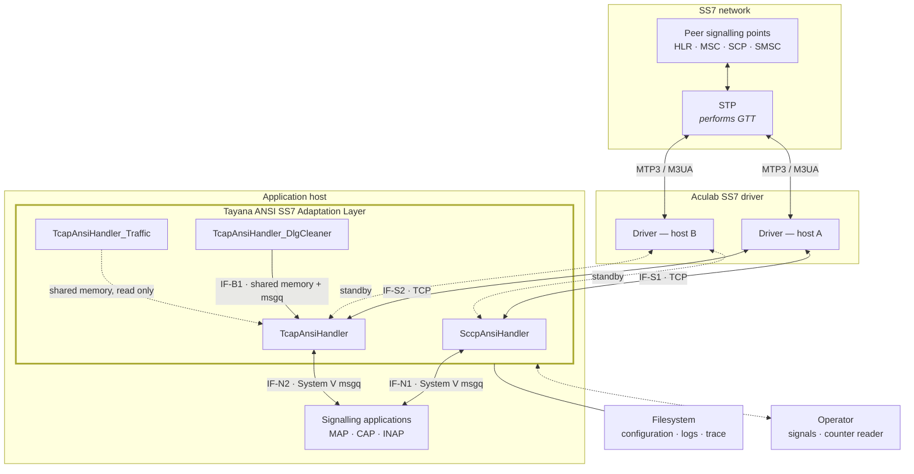

## 3.2 External Interface Catalogue

| ID | Peer | Transport | Payload | Direction | Detail |
| --- | --- | --- | --- | --- | --- |
| IF-N1 | Application | System V message queue | `_SccpInfo` | Bidirectional | 10.2 |
| IF-N2 | Application | System V message queue | `AnsiTcapMsg` | Bidirectional | 10.2 |
| IF-S1 | Aculab SS7 driver | TCP, inside the Aculab SCCP library | Aculab distributed SCCP protocol | Bidirectional | 7, 18.3 |
| IF-S2 | Aculab SS7 driver | TCP, inside the Aculab TCAP library | Aculab distributed TCAP protocol | Bidirectional | 7, 18.3 |
| IF-C1 | Filesystem | File | Product and Aculab-native configuration | Inbound | 13 |
| IF-P1 | Operator or supervisor | POSIX signals | Signal number | Inbound | 12.2 |
| IF-B1 | `TcapAnsiHandler` | System V message queue and shared memory | `AnsiTcapMsg`, dialogue pool | `_DlgCleaner` → handler | 11.2 |
| IF-O1 | Counter reader | System V shared memory | Statistics counters | Outbound | 15.4 |
| IF-O2 | Operator | Files, standard output | Log records, trace lines | Outbound | 15.2, 15.3 |

IF-S1 and IF-S2 are TCP connections, but the product never manipulates a socket. The
transport is opened, authenticated, kept alive and re-established inside the Aculab
libraries; the product sees only SSAP objects and connection-state events
[ACU-SCCP §1.1, ACU-TCAP §1.1].

## 3.3 Actor Responsibilities

| Responsibility | Network / STP | Aculab stack | This product | Application |
| --- | --- | --- | --- | --- |
| MTP2 / MTP3 link management | ● | ● | | |
| Route and linkset provisioning | ● | ● | | |
| Global Title Translation | ● | ○ | | |
| SCCP message assembly on the wire | | ● | | |
| SCCP address field population | | ○ | ● | ○ |
| Destination point code selection | | | ● | |
| SCCP protocol class and return option | | | ● | ● |
| ANSI TCAP encoding — SCCP path | | | ● | |
| ANSI TCAP encoding — TCAP path | | ● | ○ | |
| Transaction identifier allocation | | ● | ○ | |
| Dialogue identity and lifetime | | | ● | ● |
| Dialogue timeout and teardown | | | ● | |
| Component construction | | | ○ | ● |
| Operation and parameter semantics | | | | ● |
| Application context and service logic | | | | ● |
| Signalling point and subsystem status | | ● | ● | |
| Flow control response | | ● | ● | |
| Logs and counters for this layer | | ○ | ● | |

● primary owner ○ contributes

## 3.4 Environment Assumptions

| # | Assumption | Consequence if not met |
| --- | --- | --- |
| A-01 | The Aculab SS7 driver is installed, licensed and running on at least one of host A or host B | The SSAP does not reach service; the handler remains in its reconnect loop and passes no traffic |
| A-02 | MTP3 or M3UA linksets and routes are provisioned in the Aculab stack configuration | Messages are accepted by the SSAP but never reach the network |
| A-03 | Global Title Translation is available in the network STPs or the Aculab driver | GT-addressed messages are not delivered; the product performs no translation |
| A-04 | The application runs on the same host as its handler, with access to the configured IPC keys | The northbound interface cannot be established. See 14.1 |
| A-05 | `PRODUCT_HOME` and `PRODUCT_CFG_PATH` are set in every process environment | Configuration paths cannot be resolved and startup fails |
| A-06 | The Tayana platform framework libraries are available at the versions the product was built against | The product cannot be built or started |
| A-07 | Kernel System V IPC limits are sized for the configured capacity | Queue or shared memory creation fails at startup. See 14.5 |
| A-08 | Every process sharing a message queue is compiled with an identical flag set | Structure sizes disagree across the interface. See 10.4 |
| A-09 | The configured local point code matches the one in the Aculab SSAP configuration | SSAP creation is rejected and startup fails. See 13.3 |

---


# 7. Constraints and Dependencies
## 7.1 Architecture Principles

| # | Principle | Rationale |
| --- | --- | --- |
| P-01 | All Aculab API calls are confined to one adaptation class per module — `SccpAculab` and `TcapAculab` | Contains the third-party dependency and makes a stack upgrade a bounded change |
| P-02 | One process per SSN | Fault isolation, independent lifecycle and configuration |
| P-03 | Shared memory is used only for state that must outlive or cross a process | Everything else stays process-private, avoiding cross-process locking |
| P-04 | Fail fast on configuration error, fail soft on link error | A misconfiguration is a deployment defect and must be visible immediately; a link failure is expected and must self-heal |
| P-05 | The product holds no durable state | Recovery semantics stay simple and explicit |
| P-06 | Every message received from the stack is released on every exit path | Stack flow control depends on it. See 7.5 |
| P-07 | The application owns protocol semantics; the product owns protocol encoding | Keeps service logic out of the adaptation layer |

## 7.2 Architecture Decision Register

| ID | Decision | Rationale | Alternatives rejected | Consequences |
| --- | --- | --- | --- | --- |
| AD-01 | One OS process per SSN | Fault isolation (AQ-01); independent configuration and lifecycle | A single process multiplexing all SSNs | More processes to supervise; per-SSN IPC key allocation required |
| AD-02 | System V message queues for the northbound interface | Kernel-buffered, no connection management, matches the existing Tayana framework | UNIX domain sockets; shared-memory ring; TCP | Application and handler must be co-resident (14.1); IPC keys must be managed and cleaned up; default 0666 permissions are a local access consideration (16.4) |
| AD-03 | Dialogue pool in System V shared memory rather than process-private memory | Lets the cleaner and statistics processes observe dialogue state without touching the handler's threads (AQ-04) | In-process map with an internal timer wheel | Cross-process locking required; pool contents are process-address-space values and must be treated as opaque by any reader other than the owning handler (11.2) |
| AD-04 | Hand-rolled ANSI BER codec on the SCCP path; the Aculab encoder on the TCAP path | The SCCP path deliberately exposes raw connectionless transport, where no Aculab TCAP SSAP is involved and encoding cannot be delegated | Routing all TCAP framing through the Aculab TCAP SSAP | ANSI encoding knowledge exists in two places, only one of which is vendor-maintained (6.5) |
| AD-05 | The Aculab transaction handle is stored in the dialogue record | Gives O(1) dialogue-to-transaction resolution without a second index | Storing an opaque key and re-resolving through the Aculab API | The handle is only meaningful inside the owning process (11.3) |
| AD-06 | Global Title Translation delegated entirely to the network and the Aculab driver | GTT is an operator routing policy, not application logic; STPs already own it | Local translation tables in the product | The deployment must provide GTT (A-03); the product cannot diagnose translation failures beyond the returned cause |
| AD-07 | Polling the Aculab API rather than using its event interface | Simple, predictable thread model — one blocking call per receive thread | An event-driven API with a single dispatcher thread | The poll timeout sets the receive latency floor (9.1); thread count scales with SSAP instances |
| AD-08 | Detached worker threads supervised by a periodic loop, rather than a managed thread pool | Minimal machinery; the threads of a failed SSAP instance exit on their own | An explicit thread pool with lifecycle management | Threads are not joined; supervision is by SSAP health rather than by thread state (8.4) |
| AD-09 | A separate cleaner process for dialogue timeout, rather than an in-handler timer | Keeps a full-pool scan off the handler's latency path, and keeps all Aculab manipulation inside the handler by making the cleaner request teardown rather than perform it | An in-handler timer wheel, or a per-dialogue Aculab timer | An extra process to deploy and supervise; the cleaner and handler must agree on the message contract (11.2) |
| AD-10 | Static libraries rather than shared objects for the product's own code | Single-file deployment per process; no runtime library path management | Shared objects | Every process must be rebuilt when a shared header changes (10.4) |

---


# 8. Component Responsibility Details

The adaptation layer is split into two independent architectural paths—SCCP and TCAP—each managed by its own set of dedicated protocol engines.

**Figure F-04 — Components and their relationships.**

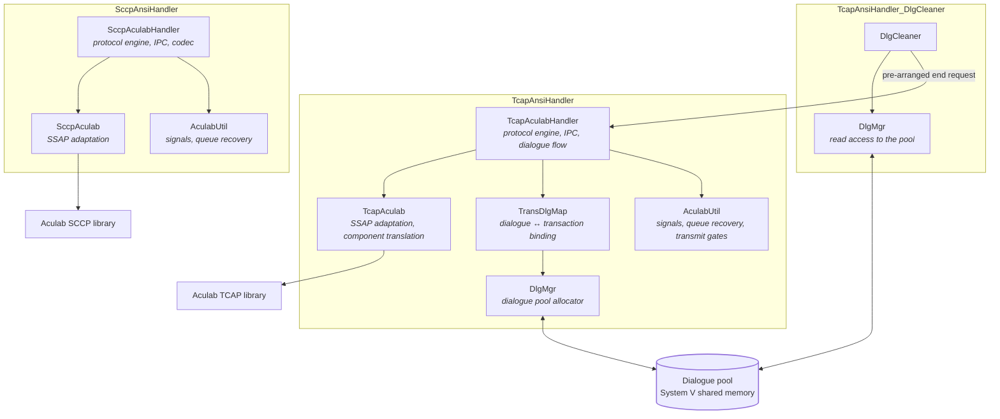

### The SCCP Path
The SCCP path is driven by the `SccpAnsiHandler`, which serves as the core FSM and primary dispatcher for unitdata payloads. When an application writes to the northbound IPC queues, `SccpAnsiHandler` intercepts the request, applies load sharing logic to select a destination point code, and explicitly executes a hand-rolled ANSI TCAP BER codec on the raw payloads. It is deliberately designed to drain all message types from its receive queue so that peer processes can write to it without needing to know its exact SSN.

Beneath the handler, the `SccpAculab` class acts as the stack interface. It owns the SSAP connection object and translates the internal C structures directly into Aculab SCCP API calls. By handling all local and remote address translation on the fly, it tricks the stack into believing the application is fully operational, shielding the rest of the product from Aculab driver complexities.

### The TCAP Path
The TCAP path is orchestrated by the `TcapAnsiHandler`. As the primary workhorse, it owns the dialogue lifecycle and supervises up to 50 active SSAP instances. It is responsible for orchestrating the strict serialization and transmission sequence mandated by the TCAP state machine, including fanning out multi-component packages into individual queue messages and accumulating outbound components until it detects the "last" flag. If it detects a duplicate Begin, it gracefully synthesizes an abort.

Encoding on this path is delegated entirely to the `TcapAculab` component. To maintain extremely high throughput without triggering expensive heap allocations on the hot path, `TcapAculab` acts as a zero-allocation bridge, directly translating `AnsiTcapMsg` structures into native Aculab component objects. 

To bridge the gap between the Aculab driver's transaction IDs and the application's dialogue IDs, the `TransDlgMap` provides O(1) correlation. When an answer returns from the network, this mapper instantly looks up the transaction and aligns the state before handing it back to the IPC queues, eliminating the need for costly iterative searches.

### Memory and Concurrency Management
Underpinning the TCAP path is the `DlgMgr`, which acts as the master memory allocator. It governs the System V shared-memory pool and manages a free-index ring protected by a high-performance binary semaphore. When a new dialogue is initiated, `DlgMgr` instantly allocates a safe identifier, preventing cross-process locking overhead and shutdown crashes.

Because scanning a pool of 100,000 dialogues for timeouts inside the main handler would cause a massive latency spike, the product offloads this work to the `TcapAnsiHandler_DlgCleaner`. Running as a dedicated, single-threaded background process, it opaquely scans the shared memory pool. When it finds an expired dialogue, it simply injects a teardown request into the main handler's receive queue. This architectural isolation guarantees carrier-grade throughput by never blocking the main handler's event loop.


# 9. High-Level Architecture (Modules + Interfaces)
## 4.1 Architectural Drivers

| # | Driver | Architectural response |
| --- | --- | --- |
| AQ-01 | Fault isolation between subsystems — one application's failure must not stop another's signalling | One process per SSN, each owning its SSAP, IPC queues and threads |
| AQ-02 | Survivability of stack link loss — signalling must resume without operator action | Supervisor loop with health evaluation, SSAP re-creation and reconnect; dual host A/B attachment |
| AQ-03 | Throughput with bounded latency | Dedicated receive and transmit threads per SSAP instance; multiple instances per process; minimal locking on the message path |
| AQ-04 | Concurrent dialogue capacity | Shared-memory dialogue pool with an O(1) free-index ring |
| AQ-05 | Operability without restart | Signal-driven configuration reload and trace toggle |
| AQ-06 | Diagnosability from logs alone | Three independent observability channels |


## 4.3 End-to-End Signalling Path

**Figure F-02 — End-to-end signalling path.**

```mermaid
flowchart LR
    N["1<br/>Peer SP / STP"]
    M["2<br/>MTP3 / M3UA<br/><i>Aculab driver</i>"]
    T["3<br/>TCP<br/><i>host A / host B</i>"]
    S["4<br/>SSAP object<br/><i>Aculab library</i>"]
    R["5<br/>Rx / Tx threads<br/><i>this product</i>"]
    Q["6<br/>System V msgq<br/><i>this product</i>"]
    A["7<br/>Application"]

    N <-->|MSU| M
    M <-->|"MTP-TRANSFER"| T
    T <-->|"Aculab distributed protocol"| S
    S <-->|"acu_*_msg_t"| R
    R <-->|"_SccpInfo / AnsiTcapMsg"| Q
    Q <--> A

    style R stroke-width:3px
    style Q stroke-width:3px
```

| Hop | Boundary | Data unit | Owner | Failure surfaces as |
| --- | --- | --- | --- | --- |
| 1 | Peer SP / STP ↔ network | MSU | Operator network | Destination prohibited, subsystem out of service, no route |
| 2 | MTP3 / M3UA ↔ Aculab driver | MTP-TRANSFER primitive | Aculab configuration | Link or linkset down, local point code not configured |
| 3 | Driver ↔ product, over TCP to host A and B | Aculab distributed protocol | This product, client side | Connection state change, connect timeout, login rejected, both hosts down |
| 4 | Aculab library ↔ SSAP object | `acu_sccp_msg_t` / `acu_tcap_msg_t` | This product | SSAP creation failure, point code mismatch, SSAP exiting |
| 5 | SSAP ↔ Rx / Tx threads | Decoded or encoded internal structure | This product | Poll timeout, decode failure, encode failure, receive buffer stall |
| 6 | Product ↔ System V message queue | `_SccpInfo` / `AnsiTcapMsg` | This product and the application | Queue full, message too large, queue removed, key collision |
| 7 | Message queue ↔ application | Application semantics | Application | Application not draining; dialogue abandoned |

Hops 1 and 2 are outside the product but inside its fault domain: a large share of
production incidents originate there and surface here as status events. How they are
detected is described in 7.4. Hops 3 to 6 are owned by this product. Hop 7 belongs to the
application, but backpressure from it propagates back to hop 3, which is why chapter 9
treats the chain as one system.

## 4.4 Layered View

**Figure F-03 — Protocol layering and where each layer is processed.**

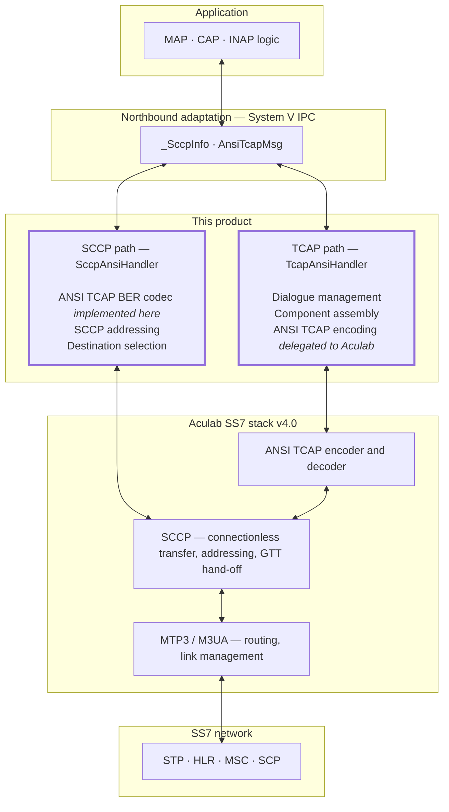

This chapter is the contract between the product and an integrating application. It is
normative: an application built against it does not need to read the product's source.

## 10.1 Interface Catalogue

Each service uses three System V message queues, whose keys are read from the product
configuration file at startup.

| Interface | Queue | Configuration key | Direction | Payload |
| --- | --- | --- | --- | --- |
| IF-N1 | Receive | `MSG_SCCP_HDLR_Q_RCV` | Application → `SccpAnsiHandler` | `_SccpInfo` |
| IF-N1 | Deliver | `MSG_SCCP_DEC_Q_RCV` | `SccpAnsiHandler` → application | `_SccpInfo` |
| IF-N1 | Heartbeat | `MSG_SCCP_HEART_BEAT_Q_RCV` | Application → handler | Liveness indication |
| IF-N2 | Receive | `MSG_TCAP_HDLR_Q_RCV` | Application → `TcapAnsiHandler` | `AnsiTcapMsg` |
| IF-N2 | Deliver | `MSG_TCAP_DEC_Q_RCV` | `TcapAnsiHandler` → application | `AnsiTcapMsg` |
| IF-N2 | Heartbeat | `MSG_TCAP_HEART_BEAT_Q_RCV` | Application → handler | Liveness indication |
| IF-B1 | Receive | `MSG_TCAP_HDLR_Q_RCV` | `_DlgCleaner` → `TcapAnsiHandler` | `AnsiTcapMsg` |

Key ranges are validated at startup against the platform-wide IPC key bounds. Queues are created with permissions
0666 (`SS7_IPC_PERM`, the implementation).

IF-B1 is not a separate queue. The cleaner injects teardown requests into the handler's own
receive queue, so the handler processes a
timeout through the same path as an application request. This is the mechanism behind
AD-09.

## 10.2 Message Type Semantics

The System V message type field is used to address a subsystem, and the two services treat
it differently. An integrator must know which.

| | `SccpAnsiHandler` | `TcapAnsiHandler` |
| --- | --- | --- |
| Type written on delivery | The handler's SSN | The handler's SSN |
| Type used when reading | `0` — any type | The handler's SSN |
| Site | the implementation | the implementation |

`SccpAnsiHandler` drains every message type from its receive queue. This is deliberate: it
allows a peer process that tags messages with its own SSN to write to the SCCP handler
without knowing the handler's SSN. The consequence for the deployment is that the SCCP
receive queue must not be shared with any other consumer, because the handler will consume
messages intended for that consumer.

`TcapAnsiHandler` filters on its own SSN, so several subsystems may in principle share a
queue key.

## 10.3 Message Structures

### `_SccpInfo` — IF-N1

Defined at the implementation.

| Field | Type | Meaning |
| --- | --- | --- |
| `msgType` | `UINT8` | Message discriminator. Only `SCCP_MSG_UDT` is accepted outbound; anything else is discarded |
| `udt` | union member | The unitdata body, below |

`_SccpUdt`:

| Field | Type | Meaning |
| --- | --- | --- |
| `pcMsgHdlg` | `UINT8`, aliased by `protoClass:4` and `msgHdlg:4` | SCCP protocol class in the low nibble; bit 7 requests the return-on-error option |
| `cldPartyAddress` | `TCAPAddress` | Called party address |
| `clgPartyAddress` | `TCAPAddress` | Calling party address |
| `transInfo` | `_TransactionInfo` | Package type and transaction identifiers |
| `dlgInfo` | `_TcapDlgInfo` | Dialogue portion, carried opaquely |
| `compInfo` | `_TcapCompInfo` | Decoded components |

`_TransactionInfo` carries `pkgType`, the two identifier lengths, and the two
identifiers. Length rules are in [TSS-ANNEX A2].

The union around `udt` currently has one member. An application must still discriminate on
`msgType` before reading it, so that adding a second member later does not silently change
the meaning of existing traffic.

### `AnsiTcapMsg` — IF-N2

Defined at the implementation.

| Field | Type | Meaning |
| --- | --- | --- |
| `ssn` | `int` | Subsystem number; also the message type used on the queue |
| `dialogueId` | `int` | The product's dialogue identifier. Must be non-zero on every outbound message |
| `tcUserId` | `int` | Opaque application correlation value, carried through unchanged |
| `origTransIdLen`, `origTransId` | `UINT8`, `UINT32` | Originating transaction identifier |
| `destAddress`, `origAddress` | `TCAPAddress` | Destination and originating SCCP addresses |
| `tcapDlg` | `EnumTcapDlg` | Package type. See 6.3 |
| `componentPresent` | `BOOLEAN` | Whether `tcapComponent` is populated |
| `tcapComponent` | `AnsiTcapComponent` | One component |

`AnsiTcapMsg` is the ANSI-specific form. The ITU form `TcapMsg` additionally
carries destination transaction identifier fields, application context and user
information; it is not used by this product. The two are 432 and 520 bytes respectively. Only `AnsiTcapMsg` may be written to or read
from IF-N2.

### Component multiplicity

An ANSI package may carry several components; the northbound structure carries one. The
product therefore fans out and fans in:

- **Inbound.** One queue message is written per component. Where a Query carries more than one
  component, the second and subsequent messages are presented with the package type
  rewritten to `TCAP_BEGIN_CONTINUE`, so that the application can tell a
  continuation of one package from a new one.
- **Outbound.** Components marked not-last are accumulated and only sent when the last one
  arrives. An application that sends a not-last
  component and never follows it with a last component leaves the package unsent.

## 10.4 Build Compatibility Rule

The northbound structures have optional tails selected by compile-time flags. Every process
that reads or writes a queue must agree on them, because the structures are exchanged by
value and read with a fixed expected size.

| Flag | Effect | Defined in |
| --- | --- | --- |
| `SS7_TIMESTAMP` | Appends a `struct timespec` to `_SccpInfo` and `AnsiTcapMsg` | Neither Makefile |
| `KAFKA_BRIDGE` | Appends a `KafkaRoutingInfo` to `_SccpInfo`, `AnsiTcapMsg`, `TcapMsg` and the dialogue record | the Makefiles, the implementation |

`KafkaRoutingInfo` is a routing-metadata block —
stack identifier, application identifier, reply topic and partition — that the product
stores on the dialogue record when a Query is sent
and returns on the matching inbound message. The product neither produces nor
consumes any message bus; the block is carried through opaquely for an external bridge
process to use. There is no message-bus client, database client or cache client anywhere in
the product.

Two rules follow, and both belong in the build and deployment procedure:

1. **The application must be compiled with the same flag set as its handler.** A mismatch
   changes the structure size on the interface, and messages are then either rejected for
   size or interpreted with the fields misaligned.
2. **`tcap/Makefile` defines `KAFKA_BRIDGE` and `sccp/Makefile` does not.** `_SccpInfo` is
   therefore a different size in the two delivered processes. This is only material if a
   future change makes the two processes share a queue; today they do not (5.1). Any such
   change must first bring the two Makefiles into agreement.

## 10.5 Scenario Walkthroughs

### Inbound unitdata, SCCP path

**Figure F-09 — Inbound SCCP unitdata.**

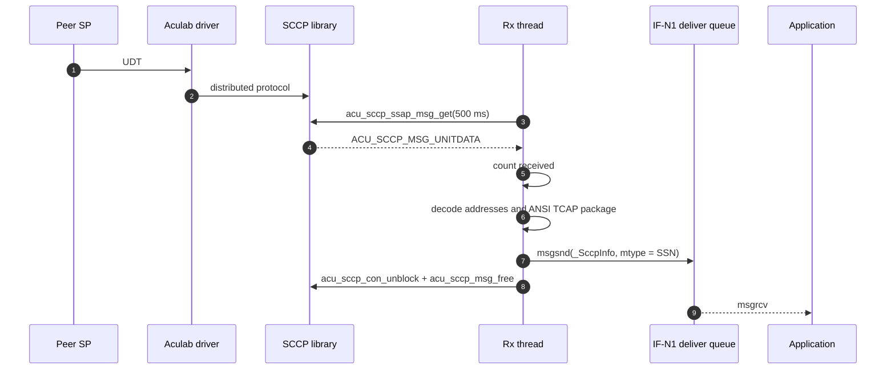

### TCAP dialogue, inbound Query to Response

**Figure F-10 — Inbound Query through to Response.**

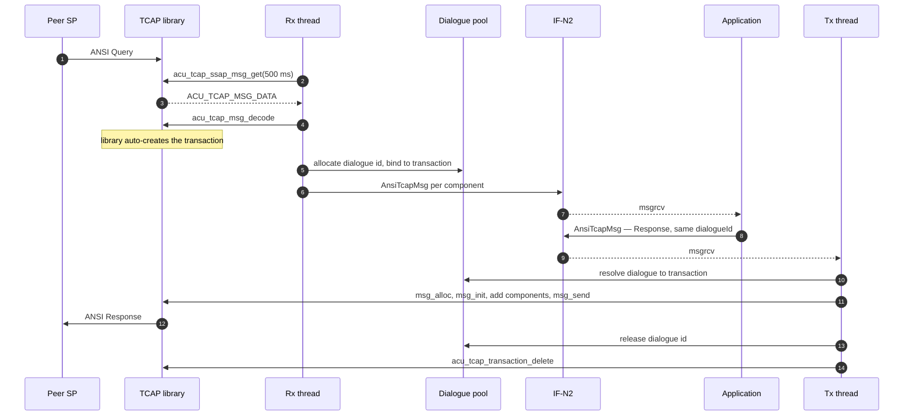

Response, End, Abort and response-timeout all mark the dialogue for teardown; Conversation refreshes its timestamp and leaves
it open.

### Dialogue timeout

**Figure F-11 — Timeout-driven teardown.**

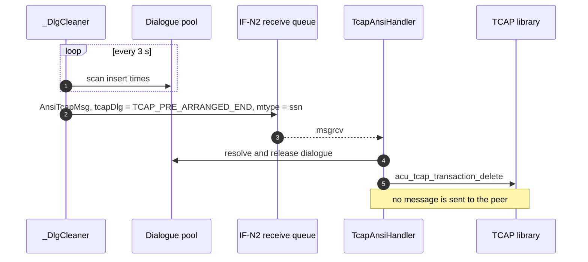

The cleaner never touches the Aculab library. It reads timestamps and posts a request; all
transaction manipulation stays in the handler that owns the SSAP.

---


# 10. SS7 Flow Designs

The following sequence diagrams illustrate how the adaptation layer processes inbound traffic, highlighting the architectural mechanisms (like the shared-memory dialogue pool and the resilient IPC queues) that guarantee performance and delivery.

## 10.1 Inbound SCCP Unitdata Flow

When processing raw connectionless transfer, the system relies on the SCCP path. Crucially, the `SccpAnsiHandler` does not delegate encoding to Aculab; it executes its own hand-rolled ANSI TCAP BER codec because the SCCP path deliberately exposes raw connectionless transport where no Aculab TCAP SSAP is involved.

**Figure F-09 — Inbound SCCP unitdata.**


During step 7, the `SccpAnsiHandler` pushes the `_SccpInfo` structure into the northbound System V message queue. These queues are managed directly by the OS kernel, which provides a strict **delivery guarantee**. If the application crashes, the queue outlives it; the message remains safely spooled in memory until the application recovers and resumes draining the queue, preventing silent message loss.

## 10.2 TCAP Dialogue (Inbound Query to Response)

For transaction-aware routing, the `TcapAnsiHandler` takes over. Here, the product delegates the complex ASN.1 encoding entirely to the Aculab library to avoid double-encoding overhead and properly handle dialogue portion edge-cases.

**Figure F-10 — Inbound Query through to Response.**

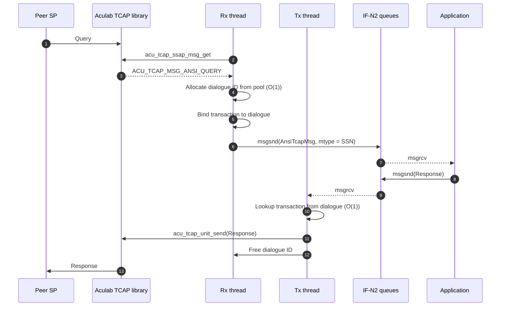

This sequence relies heavily on the **Shared Memory Dialogue Pool**. In step 4, the `DlgMgr` allocates a dialogue ID in O(1) time from the ring buffer. Later in step 10, when the application sends a Response, the `TransDlgMap` instantly correlates the dialogue ID back to the Aculab transaction ID. This lock-free shared memory design allows the background `DlgCleaner` to scan the pool concurrently without ever interrupting the execution of the Rx or Tx threads shown in this diagram.


# 11. Configurations Changes
## 13.1 The Three-Tier Model

Configuration lives at three levels, owned by different parties.

**Figure F-14 — Configuration tiers.**

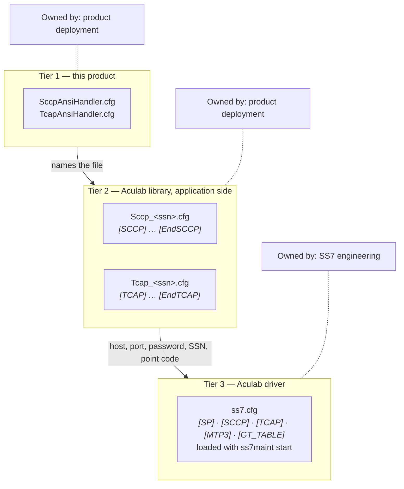

| Tier | File | Contents | Read by |
| --- | --- | --- | --- |
| 1 | `SccpAnsiHandler.cfg`, `TcapAnsiHandler.cfg` | IPC keys, capacity, timeouts, feature flags, destinations | This product |
| 2 | `Sccp_<ssn>.cfg`, `Tcap_<ssn>.cfg` or `Tcap_<pointcode>_<ssn>.cfg` | Local SSN and point code, driver host names and passwords, trace and buffer settings | The Aculab library, on behalf of this product |
| 3 | `ss7.cfg` | Signalling point, SCCP, TCAP, MTP3 and GT translation configuration | The Aculab driver, via `ss7maint start -f` [ACU-INST §6.1.1] |

Tier 2 file names are constructed from the SSN at
the implementation and the implementation, the implementation.

## 13.2 Path Resolution

Tier 1 and tier 2 files are located from two environment variables, `PRODUCT_HOME` and
`PRODUCT_CFG_PATH`, combined with the file name. Both must be set in every process environment
(assumption A-05); the supervisor or start script is responsible for exporting them.

## 13.3 Cross-Process Consistency Rules

These rules span more than one file or process, so no single component can validate them.
They belong in the deployment checklist.

| # | Rule | Consequence if broken |
| --- | --- | --- |
| C-1 | `MAX_ACU_TCAP_DLG_SIZE` must be identical in the handler's and the cleaner's view of `TcapAnsiHandler.cfg` | The two processes compute different pool geometries and address different records |
| C-2 | The local point code in the tier 2 file must match the one configured for the signalling point in tier 3 | SSAP creation is rejected; startup fails |
| C-3 | Tier 3 must contain an SCCP `[CONCERNED]` section for every destination point code and SSN the product is configured to use | Subsystem status is never reported and destination selection cannot react to a subsystem failure (7.4) |
| C-4 | Tier 3 must contain `[SCCP]` and `[TCAP]` sections, even if empty, and `sccp_listen` must be set | Applications using the SCCP API library cannot attach [ACU-INST §5.1.5, §5.1.6] |
| C-5 | The tier 2 password must match the corresponding tier 3 section password | Connection fails with a login rejection |
| C-6 | Every IPC key must be unique across the host | Two products silently share a queue or segment |
| C-7 | The application and its handler must be built with the same compile flags | Structure size mismatch on the interface (10.4) |
| C-8 | `MAX_ACU_TCAP_DLG_SIZE` must be at least twice the required concurrent outbound dialogue count | Allocation fails at half the configured capacity (11.2) |

## 13.4 Worked Example

Tier 1, `TcapAnsiHandler.cfg`, for one point code with four instances and 200,000 pool
records giving approximately 100,000 usable outbound dialogues:

```ini
MSG_TCAP_HDLR_Q_RCV        = 4101
MSG_TCAP_DEC_Q_RCV         = 4102
MSG_TCAP_HEART_BEAT_Q_RCV  = 4103

SEM_IN_DLG_KEY             = 4201
SHM_IN_DLG_POOL_KEY        = 4202
SHM_DLG_MGMT_QUEUE_KEY     = 4203

MAX_ACU_TCAP_DLG_SIZE      = 200000
ACU_TCAP_DLG_TIMEOUT       = 30
ACU_TCAP_DLG_TIMEOUT_CAP   = 60
ACU_TCAP_DLG_CLEANER_SSN   = 200

RESTORATION_REQUIRED       = 0
TCAP_PEG_REQUIRED          = 1
TCAP_MSG_DISPLAY_PARAM     = 0

NUMBER_OF_OPC              = 1
OPC_1                      = 12345:4
```

Tier 2, `Tcap_200.cfg`, as read by the Aculab library:

```ini
[TCAP]
  localpc       = 12345
  localssn      = 200
  host_a_name   = 10.0.0.11
  host_a_password = <password matching ss7.cfg [TCAP]>
  host_b_name   = 10.0.0.12
  host_b_password = <password matching ss7.cfg [TCAP]>
  server        = y
[EndTCAP]
```

The corresponding tier 3 `ss7.cfg` must declare the same local point code, a `[TCAP]`
section with `tcap_listen` and the matching password, an `[SCCP]` section with
`variant = ANSI`, and a `[CONCERNED]` section for each destination. The full parameter
reference is in Appendix B and [TSS-ANNEX A8].

---


# 12. Additional System Details
# 7. Aculab Stack Integration

## 7.1 The SSAP Model

The Aculab stack runs almost entirely in a kernel driver. MTP3, M3UA, M2PA, the SCCP user
part and a TCAP routing stub all live there [ACU-DEV §3.2]. The application links a
user-space library that reaches the driver over a password-authenticated TCP connection on
port 8256 by default [ACU-SCCP §1.1, ACU-INST §5.1.5].

The object that represents that attachment is the SSAP. One SSAP corresponds to one
subsystem number and owns the transport to the driver [ACU-SCCP §1.3, ACU-TCAP §1.3]. Its
internals are private to the library; the product holds only the pointer.

**Figure F-05 — SSAP attachment.**

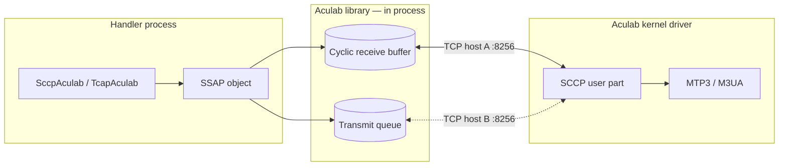

## 7.2 SSAP Lifecycle

**Figure F-06 — SSAP lifecycle.**

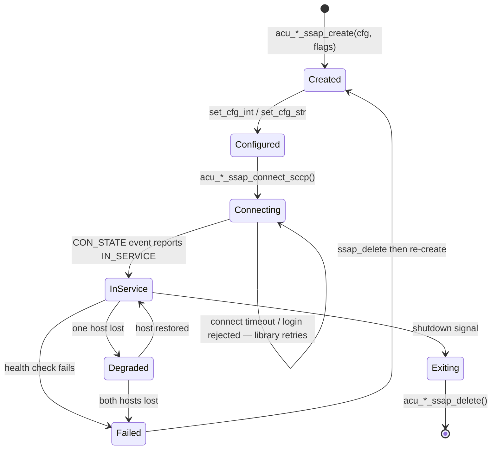

The sequence is constrained by the library in two ways that shape the startup design:

1. **Local subsystem number and point code must be set before connecting**
   [ACU-SCCP §2.1.5, ACU-TCAP §2.1.3]. The product supplies both from the Aculab-native
   configuration file at creation time.
2. **Connection completes asynchronously.** The application must wait for a connection
   state event and confirm in-service before creating connections or transactions
   [ACU-SCCP §2.1.10, ACU-TCAP §2.1.5].

The product honours the second by gating the transmit thread on SSAP status and by creating the unitdata connection object
only once the SSAP is in service.

Creation flags select the variant and the server role. The TCAP SSAP is created with
`SS7_STANDARD_ANSI`, which is the switch that puts
the library into ANSI message formats [ACU-TCAP §2.1.5.1].

## 7.3 SSAP Cardinality

| | SCCP path | TCAP path |
| --- | --- | --- |
| SSAPs per process | 1 | Up to 50 (`MAX_ACU_TCAP_INSTANCES`, the implementation) |
| Instances per point code | — | Up to 10 (`MAX_INSTANCE_PER_PC`, the implementation) |
| Point codes per process | 1 | Up to 128, from `NUMBER_OF_OPC` |
| Threads per SSAP | 2 (one process-wide receive, one transmit) | 2 per instance |
| Configuration file | `Sccp_<ssn>.cfg` | `Tcap_<ssn>.cfg`, or `Tcap_<pointcode>_<ssn>.cfg` in multi-point-code mode |

The TCAP path's multi-instance model exists to spread load across several stack
attachments, each with its own transaction identifier range (6.4) and its own transport to
the driver. Instances are declared as `OPC_<n>` entries of the form
`"<pointcode>:<instances>"`.

## 7.4 Status and Network Management

The product subscribes to two categories of network status so that it can avoid sending
into a known-unavailable destination (6.2):

| Subscription | Call | Site |
| --- | --- | --- |
| Signalling point status | `acu_sccp_enable_sp_status()` | the implementation |
| Subsystem status | `acu_sccp_enable_user_status()` | the implementation |

Events arrive as `ACU_SCCP_MSG_SP_STATUS` and `ACU_SCCP_MSG_USER_STATUS` and refresh the
cached per-destination status at the implementation, the implementation.

One deployment dependency follows from the vendor documentation and must be reflected in
the stack configuration:

> User status is only reported if the SS7 stack configuration file contains an SCCP
> `[CONCERNED]` section for the pointcode and ssn. [ACU-SCCP §2.1.12]

Without a `[CONCERNED]` section for each destination the product is configured to use,
subsystem status never changes from its initial value and destination selection cannot
react to a subsystem going out of service. This is a joint configuration rule between the
product and the Aculab stack; it is restated in 13.3.

## 7.5 Buffer Ownership and Unblock Discipline

Two rules from the Aculab API are architectural constraints rather than implementation
details, because violating either stalls signalling for every user of the stack, not just
the offending message.

**Rule 1 — received data is borrowed, not owned.**

> The data for received messages is held in the library's circular receive buffer. The
> application must free the message promptly, otherwise it will block messages for other
> connections. [ACU-SCCP §2.1.8]

The product therefore copies what it needs out of the Aculab message into its own structure
and frees the message on every path, including error paths. The SCCP receive handler frees
before returning from each branch of its dispatch switch.

**Rule 2 — processing a message blocks its connection or transaction.**

Removing a message from the SSAP queue implicitly blocks the associated object; the
application must unblock it after processing unless the SSAP is configured single-threaded
[ACU-SCCP §2.1.8, ACU-TCAP §1.5]. The product calls `acu_sccp_con_unblock()` and
`acu_tcap_trans_unblock()` on every exit path. The case worth calling out is the notice
path, where the unblock is required even though
no message is delivered northbound; omitting it suspends notice delivery permanently.

Principle P-06 exists to make both rules reviewable: any new exit path added to a receive
handler must answer whether it received a message from the stack and, if so, whether it
freed and unblocked it.

## 7.6 Vendor Dependency

| Library | Version present | Used by |
| --- | --- | --- |
| `libacu_ss7sccp.so` | 6.17.0 | `SccpAnsiHandler` |
| `libacu_ss7tcap.so` | 6.16.1 | `TcapAnsiHandler` and its companions |

Both are 64-bit. The Makefiles select the 64-bit path when it is present
(`sccp/Makefile:11-15`, `tcap/Makefile:14-18`); only the 64-bit libraries are shipped in
the SDK tree, so the product is 64-bit only in practice.

The complete list of Aculab symbols the product calls, with the error handling applied to
each, is in [TSS-ANNEX A9]. That register is the impact checklist for a stack upgrade: it
is the full set of vendor behaviour the product depends on.

One documentation discrepancy is recorded there and repeated here because it affects anyone
reading the vendor guides alongside the code: the shipped header declares
`acu_sccp_ssap_connect_sccp` while [ACU-SCCP §2.1.5.3]
documents the same function as `acu_sccp_ssap_connect_driver`. The header is authoritative
for the delivered SDK.

---

# 8. Process and Concurrency Architecture

## 8.1 Process Model

**Figure F-07 — Processes and the resources they share.**

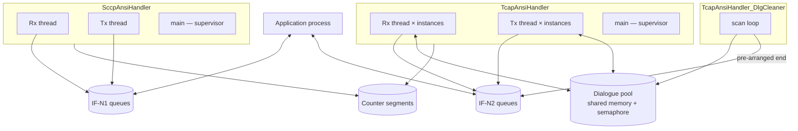

The four processes are started independently. There is no `fork()` anywhere in the product;
process relationships are established entirely through named IPC resources.

## 8.2 Thread Model

| Process | Threads | Created at |
| --- | --- | --- |
| `SccpAnsiHandler` | 1 receive, 1 transmit, plus the main supervisor | the implementation, the implementation |
| `TcapAnsiHandler` | 1 receive and 1 transmit per active SSAP instance, plus the main supervisor | the implementation |
| `TcapAnsiHandler_DlgCleaner` | Single-threaded | — |
| `TcapAnsiHandler_Traffic` | Single-threaded | — |

Worker threads are detached. With the
maximum of 50 SSAP instances, `TcapAnsiHandler` runs up to 100 worker threads plus main.

| Thread | Loop body |
| --- | --- |
| Receive | Poll the SSAP with a 500 ms timeout; classify the event; decode; write northbound |
| Transmit | Block on the northbound queue; wait for the SSAP to be in service; encode; send to the stack |
| Main | Every 3 seconds: evaluate SSAP health, reconnect if required, service configuration and trace signals |

The 500 ms poll timeout (the implementation,
the implementation) is a consequence of AD-07 and is discussed as a latency
term in 9.1. The 3-second supervisor cadence is at
the implementation and the implementation.

## 8.3 Shared State and Synchronisation

The design keeps the message path lock-free by giving each piece of mutable state a single
owning thread.

| State | Owner | Protection |
| --- | --- | --- |
| Decoded SCCP structure (`mSccpInfo`) | The single SCCP receive thread | Sole ownership — no lock |
| SCCP unitdata connection and address structures | The single SCCP transmit thread | Sole ownership — no lock |
| Destination alternation flag | The single SCCP transmit thread | Sole ownership — no lock |
| Cached destination status | Written by the receive thread, read by the transmit thread | Word-sized, single writer |
| SSAP pointer array | Written by main during reconnect, read by workers | See below |
| Dialogue pool and free-index ring | Any handler thread, and the cleaner process | System V semaphore, the implementation |
| Statistics counters | All threads | Shared memory, provided by the platform counter library |

The dialogue pool is the only state shared across processes, and it is the only state
guarded by a lock. That lock is a System V binary semaphore, taken across allocation,
release and update.

The SSAP pointer array is written by the supervisor during reconnection while worker
threads may be polling the old SSAP. The design relies on the reconnect path only being
entered after health evaluation has already determined that the SSAP is not carrying
traffic, and on the transmit gate described in 8.4 being closed for the duration.

## 8.4 Supervision and Failure Isolation

Every 3 seconds the main thread evaluates SSAP health. On failure it deletes and re-creates
the SSAP, reconnects, and re-establishes the worker threads for the affected instance.
Transmit is gated for the duration by a per-instance flag, so that no thread attempts to send through an SSAP
that is being replaced.

Isolation boundaries:

| Failure | Blast radius |
| --- | --- |
| One SSAP instance loses its driver connection | That instance only; other instances in the same process keep running |
| One handler process exits | Its SSN only. Other SSNs are separate processes (AD-01) |
| `TcapAnsiHandler_DlgCleaner` exits | Dialogues stop being reclaimed on timeout; live traffic is unaffected until the pool fills |
| `TcapAnsiHandler_Traffic` exits | Statistics display only; no signalling impact |
| Application exits | Its inbound queue backs up; see 9.3 |
| Aculab driver restarts | Both handlers reconnect automatically; in-flight dialogues are lost |

Signals are handled by setting flags only; the work is done in the main loop. A second termination signal after shutdown has begun
exits immediately.

---

# 11. Data Architecture

## 11.1 The Shared Header Contract

Three headers in `include/` define what crosses the northbound interface. They are the
product's ABI and are shared with other Tayana products.

| Header | Defines |
| --- | --- |
| `Ss7Structs.h` | Address, operation, problem and component sub-structures |
| `TcapStructs.h` | `AnsiTcapMsg`, `AnsiTcapComponent` and the dialogue and component enumerations |
| `MsuStructs.h` | `_SccpInfo` and its sub-structures |

A change to any of them changes the interface. Because the product links statically
(AD-10), every process — including the application — must be rebuilt together.

## 11.2 The Dialogue Pool

The dialogue pool is the product's only shared, cross-process data structure. It exists so
that the cleaner and the statistics display can observe dialogue state without entering the
handler's threads (AD-03).

**Figure F-12 — Dialogue pool structure.**

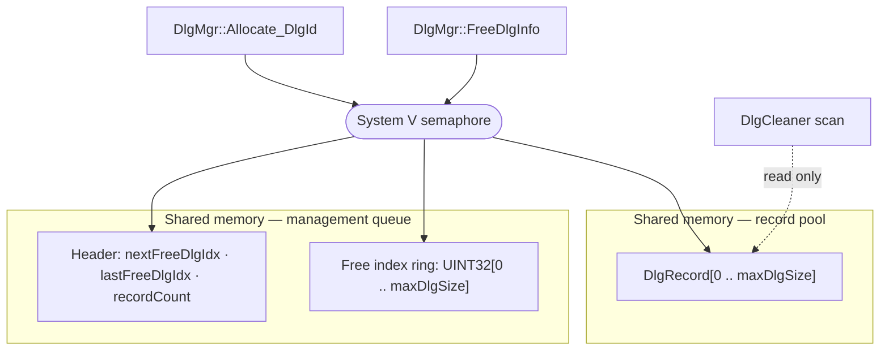

| Segment | Key | Size |
| --- | --- | --- |
| Record pool | `SHM_IN_DLG_POOL_KEY` | `sizeof(DlgRecord) × (maxDlgSize + 1)` |
| Management queue | `SHM_DLG_MGMT_QUEUE_KEY` | `sizeof(UINT32) × (maxDlgSize + 1) + sizeof(DlgMgmtQueueHeader)` |
| Semaphore | `SEM_IN_DLG_KEY` | 1 semaphore |

`maxDlgSize` comes from `MAX_ACU_TCAP_DLG_SIZE`, bounded to 1–500,000. Segments are created with `IPC_CREAT | IPC_EXCL`
and fall back to attaching an existing segment, so whichever of the handler and cleaner
starts first creates them.

### The identifier space is split in half

This property governs how the pool must be sized.

The pool is divided into two halves at `mHalfMaxDlgSize`. Allocation draws only from the free-index ring and
adds the half-size offset, so **every locally-allocated dialogue identifier lands in the
upper half**. The lower half is reserved for identifiers derived from the
peer's range.

The operational consequence: **a configured pool of N yields approximately N/2 usable
outbound dialogues.** A deployment that needs 100,000 concurrent locally-initiated
dialogues must configure `MAX_ACU_TCAP_DLG_SIZE` to at least 200,000. Sizing against the
configured number rather than half of it is the most common capacity error on this product.

Release mirrors the split: an upper-half identifier is zeroed and its index pushed back
onto the free ring; a lower-half identifier is only zeroed, because it was never drawn from
the ring.

### Record contents and reader discipline

`DlgRecord` holds the dialogue identifier, the
Aculab transaction handle, the SSN, the insertion time, both transaction identifiers and
their lengths, the invoke identifier, the calling and called addresses, the operation code,
the package type, the application context, the SSAP instance number, and — when built with
`KAFKA_BRIDGE` — the routing block.

The transaction handle is a pointer into the address space of the process that created it.
It is meaningful only there. Any other reader of the pool, including the cleaner and the
statistics display, must treat it as an opaque value and must not dereference it. The
cleaner is written to this rule: it reads only the insertion time and the SSN.

## 11.3 Dialogue and Transaction Binding

Two identifiers exist for one conversation, and the mapping between them is the core of the
TCAP path.

| | Dialogue identifier | Transaction |
| --- | --- | --- |
| Allocated by | This product, from the pool | The Aculab library |
| Visible to | The application, on IF-N2 | This product only |
| Represented as | `int dialogueId` | `acu_tcap_trans_t *` |
| Lifetime | Until release or timeout | Until `acu_tcap_transaction_delete()` |
| On the wire | Never | As the four-byte ANSI transaction identifier |

The binding is held in both directions:

- Dialogue to transaction: the record's `trans` field.
- Transaction to dialogue: the record's address is stored in the transaction's user pointer
  with `acu_tcap_trans_set_userptr()` and
  retrieved with `acu_tcap_trans_get_userptr()`.

The user pointer is the vendor's intended mechanism for exactly this:

> The dialogue identifier is only meaningful to the local TCAP user and it is not
> transmitted, so the Aculab API implements the dialogue id as a `(void *)` userptr that may
> be associated with a transaction. [ACU-DEV §10.1.6]

Using it gives O(1) resolution in both directions with no second index to keep consistent.

## 11.4 System V IPC Resource Model

| Resource | Count | Key source | Removed on exit |
| --- | --- | --- | --- |
| Message queues, SCCP | 3 | `SccpAnsiHandler.cfg` | No |
| Message queues, TCAP | 3 | `TcapAnsiHandler.cfg` | No |
| Shared memory, dialogue pool | 2 | `TcapAnsiHandler.cfg` | No |
| Shared memory, counters | 1 per handler | Platform counter library | No |
| Semaphore | 1 | `TcapAnsiHandler.cfg` | No |

No IPC resource is removed by the product on shutdown. Queued messages therefore survive a
handler restart, which is intentional. The operational consequences — key registry
ownership, stale-resource cleanup between test runs, and sizing the kernel limits — are in
14.5 and 17.2.

## 11.5 Persistence

The product has no database, no file-backed state and no journal. All state is either
process-private or in the System V shared memory described above, and none of it survives a
host restart.

The recovery position that follows is explicit: **dialogues do not survive a handler
restart.** After a restart the pool is re-attached but the transaction handles in it refer
to an address space that no longer exists, and the corresponding transactions no longer
exist in the library. Records for those dialogues age out through the cleaner's timeout
sweep. Applications must treat a handler restart as the loss of all in-flight dialogues and
re-establish them.

The Aculab library offers a transaction restoration facility for applications that persist
the necessary identifiers themselves [ACU-TCAP §1.6, §2.1.6]. The product does not use it;
`RESTORATION_REQUIRED` should be left at 0.

---

# 12. Control Plane

## 12.1 Startup Sequence

**Figure F-13 — Handler startup.**

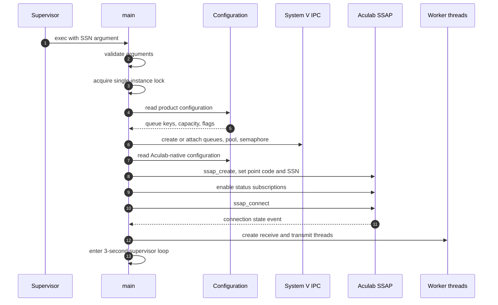

Failure policy follows principle P-04. A configuration error — a missing mandatory key, an
out-of-range value, a point code that disagrees with the Aculab configuration — is fatal at
startup. A connection failure is not: the supervisor loop retries indefinitely.

## 12.2 Signals

| Signal | Number | Effect |
| --- | --- | --- |
| `SIGCFG` | 10 | Re-read the runtime-changeable configuration |
| `SIGTRACE` | 12 | Toggle the trace channel |
| `SIGTERM`, `SIGINT`, `SIGQUIT`, `SIGPIPE` | — | Begin orderly shutdown |
| `SIGHUP`, `SIGCHLD` | — | Ignored |

Handlers set a flag and return; the action is taken by
the main loop on its next pass, so a reload takes effect within one supervisor cycle. A
second termination signal after shutdown has started exits immediately.

Reload is deliberately narrow. On the SCCP path it re-reads only the counter-enable flag and
the message display parameter. Queue keys, capacity
and point codes are not re-read, because changing them would invalidate resources already
created and connections already established. Changing those requires a restart.

## 12.3 Reconnection

Every supervisor pass evaluates SSAP status. On failure:

1. Close the transmit gate for the affected instance.
2. Delete the SSAP.
3. Re-create it from configuration, re-apply settings and status subscriptions.
4. Reconnect and wait for the in-service state.
5. Re-establish the worker threads for the instance.
6. Re-open the transmit gate.

Steps 2 to 4 are `SsapReConnect`. The library itself also
reconnects the underlying TCP transport automatically and reports the result as a connection
state event [ACU-SCCP §2.1.10], so a brief transport outage is usually absorbed below this
level without an SSAP rebuild.

In-flight dialogues do not survive an SSAP rebuild. They age out through the cleaner.

## 12.4 Shutdown

Shutdown sets the run flag false. Worker threads observe it at the top of their loops and
return; main deletes the SSAPs and exits. IPC resources are left in place (11.4).

Shutdown is not drained: messages already in a northbound queue remain queued for the next
start, and a message in flight through the stack may be lost. Deployments that require a
bounded drain must stop the application first, allow the queues to empty, and then stop the
handlers.

## 12.5 Single-Instance Enforcement

Each handler takes a named process lock at startup and exits if it is already held. This
prevents a second instance from attaching to the same IPC keys and SSN, which would produce
two consumers on one queue and duplicate SSAP registrations for one subsystem.

The lock is a platform framework facility. Its stale-lock clearing procedure belongs in the
deployment runbook (17.2).

---

# 14. Deployment Architecture

## 14.1 The Co-Residency Rule

The northbound interface is System V message queues (AD-02). System V IPC is host-local:
there is no network transport for it. This produces one hard placement constraint:

> **The application, `SccpAnsiHandler`, `TcapAnsiHandler` and `TcapAnsiHandler_DlgCleaner`
> must all run on the same host.**

There is no configuration that relaxes this, and no supported topology in which the
application is remote from its handler. An application that must run elsewhere needs a
relay process co-resident with the handler.

The Aculab driver is a different matter. Because the product reaches it over TCP inside the
vendor library (7.1), the driver may be local or remote. Both are supported.

## 14.2 Variant A — Aculab driver co-located

**Figure F-15 — Single-host deployment.**

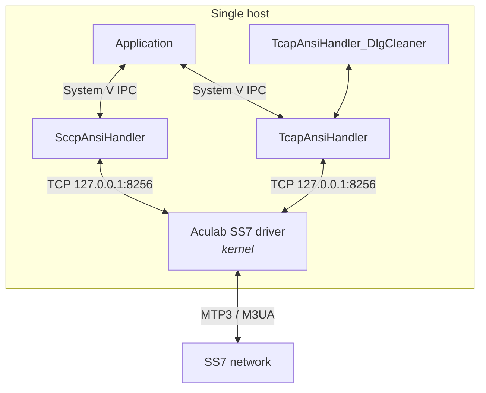

Everything on one host. The library-to-driver connection is a loopback TCP connection, so
`host_a_name` is `127.0.0.1` and no cross-host firewall rule is needed. This is the simplest
deployment and the one with the fewest failure modes, but the host is a single point of
failure for both signalling and application processing.

## 14.3 Variant B — Aculab driver on separate hosts

**Figure F-16 — Distributed deployment.**

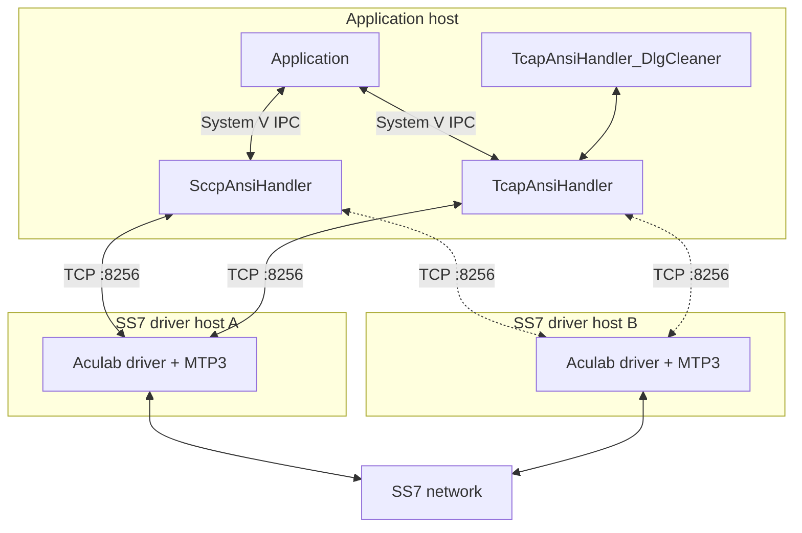

The application host runs no SS7 driver. This is the arrangement the vendor calls
distributed TCAP [ACU-DEV §4.1]. It allows several application hosts to share one signalling
point, and it separates application capacity from signalling capacity.

It requires:

- TCP reachability from every application host to port 8256 on every driver host;
- a password configured in tier 2 matching the driver's `[SCCP]` and `[TCAP]` sections;
- awareness that hostname resolution happens when the Aculab configuration file is read,
  not at connect time [ACU-INST §5.1.1], so a DNS change requires a reload.

## 14.4 Dual-Host Resilience

Both variants may use the stack's dual-MTP3 arrangement, in which two driver hosts present
themselves to the network as one point code with traffic shared across all available links
[ACU-DEV §4.2].

The product participates by configuring both hosts on each SSAP —
`ACU_TCAP_CFG_HOST_A_NAME` and `HOST_B_NAME` — and
by tracking per-host connection state in its SSAP status record. The library selects the
host and reconnects automatically; the product does not choose.

| Failure | Result |
| --- | --- |
| One driver host lost | Library moves traffic to the surviving host; SSAP stays in service |
| Both driver hosts lost | SSAP leaves service; supervisor enters the reconnect loop; in-flight dialogues age out |
| One MTP3 link lost | Absorbed by the stack; no product-visible effect |
| Application host lost | Total loss of service for that host's subsystems |

Host A is connection identifier 0 and host B is 1 [ACU-SCCP §2.1.10.1]; this is how the two
appear in the connection state events and in the SSAP status record.

## 14.5 Host Prerequisites

The product requires a 64-bit Linux host with:

| Requirement | Reason |
| --- | --- |
| POSIX threads | Worker thread model (8.2) |
| System V message queues, shared memory and semaphores | Northbound interface and dialogue pool |
| The Aculab SS7 v4.0 runtime, reachable per 14.2 or 14.3 | All signalling |
| `PRODUCT_HOME` and `PRODUCT_CFG_PATH` exported | Configuration resolution (13.2) |

Kernel System V limits must be raised from their defaults for anything beyond a laboratory
configuration:

| Parameter | Governs | Sizing basis |
| --- | --- | --- |
| `msgmnb` | Bytes per message queue | Peak burst depth × message size. `AnsiTcapMsg` is 432 bytes |
| `msgmax` | Largest single message | Must exceed the larger of `sizeof(_SccpInfo)` and `sizeof(AnsiTcapMsg)` |
| `msgmni` | Number of queues | Three per handler, plus every other product on the host |
| `shmmax`, `shmall` | Shared memory | `sizeof(DlgRecord) × (maxDlgSize + 1)` plus the management queue segment (11.2) |
| `semmni` | Semaphores | One per TCAP handler, plus other products |

The two shared-memory figures are the ones most often left at defaults. At the maximum pool
size of 500,000 records the record segment alone is several hundred megabytes; `shmmax` must
be raised to match or the handler fails at startup.

## 14.6 Startup Ordering

| Order | Component | Precondition |
| --- | --- | --- |
| 1 | Aculab driver, loaded and configured with `ss7maint start` | Host booted |
| 2 | MTP3 links in service | Driver running, peer available |
| 3 | `SccpAnsiHandler` and `TcapAnsiHandler` | Driver reachable, configuration present |
| 4 | `TcapAnsiHandler_DlgCleaner` | Pool segments exist, or it creates them |
| 5 | Application | Queues exist |
| 6 | `TcapAnsiHandler_Traffic` | Any time |

Steps 3 and 4 are order-independent in principle, because either process creates the pool
segments if they are absent. Starting the handler first is preferred, so that the geometry
is established by the process that owns it.

A handler started before the driver is reachable does not fail; it retries (12.3). An
application started before its handler does not fail either, because the queue is created by
whichever process gets there first — but messages it sends before the handler starts will be
consumed when the handler starts, which is usually desirable and occasionally surprising.

### Process supervision

The product does not daemonise, does not fork and does not restart itself. It enforces
single-instance execution (12.5) and exits on an unrecoverable error. Supervision — start
ordering, restart on exit, environment export — is an external responsibility.

Whatever supervises the processes must: start them in the order above; export `PRODUCT_HOME`
and `PRODUCT_CFG_PATH`; restart a process that exits unexpectedly; and not restart a process
that exited because of a configuration error, since it will fail identically until the
configuration is corrected.

---

# 15. Observability

## 15.1 The Three Channels

| Channel | Destination | Audience | Controlled by |
| --- | --- | --- | --- |
| Log | Platform log file | Operations, support | `SS7LogCodes.h` code, always on |
| Trace | Standard output | Engineering | Environment variable, toggled by `SIGTRACE` |
| Counters | Shared memory | Operations, capacity management | `SCCP_PEG_REQUIRED`, `TCAP_PEG_REQUIRED` |

They are independent. A message appearing on the console is a trace line and does not prove
that anything was written to the log; the two have different destinations and different
enabling conditions. Verification procedures must state which channel they read.

## 15.2 Logging

Log codes are enumerated in `include/SS7LogCodes.h`:

| Range | Meaning |
| --- | --- |
| `GSYS01`–`GSYS16` | Process lifecycle: start, initialisation result, shutdown, instance collision |
| `CFG01`, `CFG02` | Configuration read and validation |
| `ACUSCCP01`–`ACUSCCP44` | SCCP path |
| `ACUTCAP01`–`ACUTCAP180` | TCAP path |

The per-code map, with the source location and trigger condition of each, is in
[TSS-ANNEX A6].

The lifecycle codes are the ones to assert in a deployment check: `GSYS01` at start,
`GSYS03` on successful initialisation, `GSYS04` on initialisation failure, `GSYS02` at
shutdown, `GSYS16` when a second instance is refused.

## 15.3 Tracing

Trace is compiled in and gated at runtime by an environment variable per process:

| Process | Variable |
| --- | --- |
| `SccpAnsiHandler` | `TRACE_ACULAB_SCCP_HDLR` |
| `TcapAnsiHandler` | `TRACE_ACULAB_TCAP_HDLR` |
| `TcapAnsiHandler_DlgCleaner` | `TRACE_ACULAB_TCAP_DLG_CLEANER` |

Trace is verbose and costs measurable CPU. It should be off in production and enabled only
for a specific investigation.

A separate message-display parameter — `SCCP_MSG_DIPLAY_PARAM` and
`TCAP_MSG_DISPLAY_PARAM`, range 0–255 — selects which parts of a message are printed. Both
are runtime-reloadable through `SIGCFG` (12.2), so display can be changed without a restart.

The Aculab libraries have their own independent trace, configured in the tier 2 file
through `TRACE_TAG`, `TRACE_MODE` and the `TRACE_LEVEL` family [ACU-SCCP §2.1.4]. Stack
encoding problems are usually diagnosed there rather than in the product's trace.

## 15.4 Statistics Counters

Counters are held in shared memory and read by an external tool. Segments are identified by
name — `SHM_SCCP_PEG_KEY` and `SHM_TCAP_PEG_KEY`.

| Counter | ID | Meaning |
| --- | --- | --- |
| `PEG_DROP_RCVD_FROM_NWK` | 59 | TCAP message received from the network and dropped |
| `PEG_DROP_SEND_TO_NWK` | 60 | TCAP message from the application dropped instead of sent |
| `PEG_RCVD_FROM_APP` | 81 | TCAP message received from the application |
| `PEG_SEND_TO_NWK` | 82 | TCAP message sent to the network |
| `PEG_RCVD_FROM_NWK` | 83 | TCAP message received from the network |
| `PEG_SEND_TO_APPL` | 84 | TCAP message delivered to the application |
| `PEG_UDT_RCVD_FROM_STACK` | 91 | Unitdata received from the stack |
| `PEG_UDT_RCVD_FROM_APPL` | 92 | Unitdata received from the application |
| `PEG_UDT_SENT_TO_STACK` | 93 | Unitdata sent to the stack |
| `PEG_UDT_SENT_TO_APPL` | 94 | Unitdata delivered to the application |
| `PEG_NOTICE_RCVD` | 95 | UDTS notice received |

Definitions are at the implementation and
the implementation.

The counters are designed to be read in pairs, because a difference localises a fault to one
hop:

| Indicator | Expression | Interpretation |
| --- | --- | --- |
| SCCP transmit loss | 92 − 93 | Accepted from the application but not sent to the stack — destination unavailable or encode failure |
| SCCP receive loss | 91 − 94 | Received from the stack but not delivered — decode failure or northbound queue problem |
| TCAP transmit loss | 81 − 82 | Should track counter 60 |
| TCAP receive loss | 83 − 84 | Should track counter 59 |

Counters are only maintained when the corresponding `*_PEG_REQUIRED` flag is set, and that
flag is reloadable at runtime. A counter reading zero therefore means either no traffic or
counters disabled; a deployment should confirm the flag before drawing conclusions from a
zero. The complete list of increment sites, including whether each fires before or after the
action it counts, is in [TSS-ANNEX A7].

`TcapAnsiHandler_Traffic` is the console display for these counters. Most of its display
logic is currently commented out in the delivered source, so counters should be read with
the platform counter tool rather than through it.

## 15.5 Aculab-Side Diagnostics

Several conditions are only visible on the stack side. `ss7maint` provides them
[ACU-INST §7, §8.2]:

| Command | Shows |
| --- | --- |
| `ss7maint sccpstatus` | Remote signalling point state, remote SCCP state, remote subsystem state |
| `ss7maint tcapstatus` | Per-application point code, SSN and transaction identifier ranges; connection and flow-control counts |
| `ss7maint mtp3status`, `linkstatus` | Route and link state |
| `ss7maint trace` | Driver-level protocol trace |

The states reported by `sccpstatus` correspond one-to-one with the status values the product
receives through its subscriptions (7.4), which makes it the fastest way to confirm whether
a destination problem is inside or outside the product.

The vendor's instruction that the output of `ss7maint` must not be parsed by scripts, as it
is subject to change without notice [ACU-INST §4], should be carried into any monitoring
integration.

---

# 16. Non-Functional Characteristics

## 16.1 Capacity Ceilings

These are architectural limits. They are properties of the design and the vendor stack, not
targets.

| Dimension | Ceiling | Source |
| --- | --- | --- |
| Dialogue pool records | 500,000 | the implementation |
| Usable outbound dialogues | Approximately half the configured pool | 11.2 |
| SSAP instances per TCAP process | 50 | the implementation |
| Instances per point code | 10 | the implementation |
| Point codes per TCAP process | 128 | the implementation |
| SCCP SSAPs per process | 1 | the implementation |
| Worker threads per TCAP process | 100 | 2 × 50 instances |
| SCCP payload northbound | 300-byte buffer, 255-byte effective | 6.6 |
| Subsystem numbers | 1–254 | the implementation |
| Dialogue timeout | 1–5000 s | the implementation |
| SCCP connections per stack | 4094 | [ACU-SCCP Appendix C] |
| SCCP connections per SSAP | 3840 | [ACU-SCCP Appendix C] |
| Transactions per TCAP SSAP | 983,040 | [ACU-TCAP Appendix C] |
| Operations per transaction | 256 | [ACU-TCAP Appendix C] |
| Driver transmit queue per SSAP | 140 messages, not configurable | [ACU-TCAP §1.7] |

The binding constraint in practice is the dialogue pool, because it is the only one that is
both configurable and consumed by normal traffic. Sizing it is covered in 17.4.

## 16.2 Performance Characteristics

The design has three properties that determine its performance envelope.

**Receive latency has a floor when traffic is sparse.** The receive thread polls with a
500 ms timeout (AD-07, 8.2). A message arriving just after an empty poll waits for the next
one. Under sustained load the effect vanishes, because polls return immediately.

**Throughput scales with SSAP instances, not with threads within an instance.** Each
instance has one receive and one transmit thread, and each message is processed by exactly
one of them. Adding instances adds parallelism; there is no way to parallelise within an
instance.

**The message path takes no locks.** Only dialogue allocation and release take the pool
semaphore (8.3). Under high dialogue churn that semaphore is the one contended resource in
the design, and it is contended across processes because the cleaner takes it too.

Absolute figures depend on host, message size and component count, and are to be established
by measurement — see Appendix C.

## 16.3 Availability and Recovery

| Event | Detection | Recovery | Traffic impact |
| --- | --- | --- | --- |
| Aculab driver connection lost | Connection state event | Library reconnects automatically | Brief; SSAP may stay in service |
| One driver host lost, dual configuration | Connection state event | Traffic moves to the surviving host | None |
| SSAP unhealthy | Supervisor pass, within 3 s | Delete, re-create, reconnect, re-establish threads | Instance out of service until reconnected; dialogues on it are lost |
| Northbound queue removed | Next queue operation | Queue re-created | Messages in the removed queue are lost |
| Handler process exits | External supervisor | Restart | All dialogues for that SSN lost (11.5) |
| Cleaner process exits | External supervisor | Restart | Dialogues stop being reclaimed; pool fills over time |
| Destination unavailable | Status subscription | Alternate destination if configured | None if an alternate is available |

The product self-heals for everything below process level. Process-level recovery is the
supervisor's responsibility (14.6).

## 16.4 Security

| Aspect | Position |
| --- | --- |
| Northbound interface | System V IPC created with 0666 permissions. Any local user can read and write the queues. Deployments requiring isolation must restrict host access, since the permission is compiled in |
| Driver connection | Password-authenticated with a three-way handshake and a password-derived key [ACU-INST §5.1.1]. Passwords appear in plain text in tier 2 and tier 3 configuration files, which must therefore be readable only by the owning account |
| Network exposure | The product opens no listening socket. Its only outbound connections are made by the Aculab library to the driver hosts |
| Payload content | Signalling payloads may contain subscriber identifiers. Trace prints message content and should be off in production; log content and retention are governed by the deployment's data policy |
| Licensing | The TCAP handler validates a configured licence key at startup and exits if it fails |

Firewall requirement for Variant B: TCP port 8256 from each application host to each driver
host, outbound only.

## 16.5 Maintainability and Portability

| Aspect | Position |
| --- | --- |
| Vendor containment | All Aculab calls are confined to two adaptation classes (P-01). The upgrade impact surface is the register in [TSS-ANNEX A9] |
| Interface stability | The northbound structures are a shared ABI with no version field. A change requires coordinated rebuild of the application and all handlers (10.4, 11.1) |
| Portability | 64-bit Linux only in practice: the shipped Aculab libraries are 64-bit, and the design depends on System V IPC and POSIX threads |
| Configuration change | Counter enable and message display are reloadable in service; everything else requires a restart (12.2) |

---

# 17. Operations and Maintenance

## 17.1 Operational Overview

| Task | Frequency | Reference |
| --- | --- | --- |
| Confirm both handlers are in service | Continuous | 15.2 lifecycle codes |
| Watch counter pairs for divergence | Continuous | 15.4 |
| Check destination and subsystem status | On alarm | `ss7maint sccpstatus` |
| Review dialogue pool occupancy | Daily | 17.4 |
| Reload counter or display settings | On demand | `SIGCFG` |
| Enable trace for an investigation | On demand | 15.3 |
| Clean stale IPC resources | After an abnormal stop | 17.2 |

## 17.2 Routine Procedures

**Start.** Follow the ordering in 14.6. Confirm `GSYS03` for each handler before starting
the application.

**Stop.** Stop the application first, allow the northbound queues to drain, then stop the
handlers and the cleaner. Shutdown is not drained by the product (12.4).

**Configuration reload.** Change the file, send `SIGCFG`, confirm the `CFG` log entries.
Only the counter-enable and display parameters take effect; anything else needs a restart.

**Stale IPC cleanup.** IPC resources are not removed on exit (11.4). After an abnormal stop,
and between test runs, confirm with `ipcs -q -m -s` and remove leftover resources for the
configured keys before restarting. Removing a queue while a handler is running is safe — the
handler detects it and re-creates it — but any messages in it are lost.

**IPC key registry.** Keys are allocated per deployment and must be unique across the host
(C-6). The deployment should maintain a register of which product owns which key range.

## 17.3 Diagnostic Playbook

| Symptom | First evidence to gather | Likely cause |
| --- | --- | --- |
| No traffic in either direction, handler running | `ss7maint sccpstatus`; SSAP state in the log | Driver unreachable, or SSAP not in service |
| Handler loops in reconnect | Connection state log entries; login failure text | Wrong password, wrong host, or SCCP not configured for that point code in tier 3 |
| Startup fails immediately | `GSYS04` and the preceding `CFG` entries | Configuration error — mandatory key missing, value out of range, or point code mismatch (C-2) |
| Startup fails with an instance collision | `GSYS16` | A previous instance is still running, or a stale process lock |
| Received counter advances, delivered counter does not | Counters 91 and 94, or 83 and 84 | Decode failure, or northbound queue full or removed |
| Application counter advances, sent counter does not | Counters 92 and 93, or 81 and 82 | Both destinations unavailable, or encode failure |
| Receive counters frozen while the link is up | Aculab trace | A message not freed, stalling the library receive buffer (7.5) |
| Notices stop arriving after the first one | SCCP notice log entries | The notice path failed to unblock the connection (7.5) |
| Dialogue allocation fails | Pool-full log entry; pool occupancy | Pool exhausted — real capacity, a leak, or sizing against the wrong half (11.2) |
| Dialogues accumulate and are never reclaimed | Cleaner process state; pool occupancy trend | Cleaner not running, or its timeout longer than the traffic profile requires |
| Abort delivered to the application unexpectedly | TCAP log entries around the dialogue | Duplicate Query on an existing dialogue, or a decode failure on the inbound message |
| Messages arrive with fields misaligned | Build flags of the application and handler | Compile-flag mismatch on the interface (10.4) |
| Subsystem failures not detected | Tier 3 `[CONCERNED]` sections | Missing `[CONCERNED]` section (C-3) |
| Startup fails attaching shared memory | `shmmax`, `shmall` | Kernel limits too small for the configured pool (14.5) |
| Both handlers start but one passes no traffic | Which SSN each is configured for | Two handlers sharing an IPC key, or the SCCP handler draining a queue it shares (10.2) |

## 17.4 Capacity Management

The number to watch is dialogue pool occupancy. It is available from the pool header and
from the counter set.

Sizing method:

1. Establish the peak concurrent dialogue count — the arrival rate multiplied by the mean
   dialogue lifetime.
2. Add headroom for dialogues awaiting timeout, which is the abandonment rate multiplied by
   `ACU_TCAP_DLG_TIMEOUT`.
3. **Double the result**, because allocation draws from half the pool (11.2, C-8).
4. Confirm `shmmax` accommodates the resulting segment (14.5).

Dialogue timeout is the second control. A timeout much longer than the real dialogue
lifetime causes abandoned dialogues to occupy the pool for longer than necessary; a timeout
shorter than the peer's response time tears down dialogues that would have completed. It
should be set from the measured response-time distribution of the peer, with margin.

---

# 18. Standards and Vendor Conformance

## 18.1 Basis of Conformance

The product's ANSI behaviour rests on the Aculab stack, and the conformance claim is scoped
accordingly.

**On the TCAP path**, ANSI message formats, transaction identifier handling, component
encoding and dialogue portion construction are performed by the Aculab library. ANSI
behaviour is selected by creating the SSAP with the ANSI standard flag and by configuring `variant = ANSI` in the driver
[ACU-INST §5.1.6]. The vendor states that its API supports ANSI TCAP as described in
ANSI T1.114 [ACU-DEV §10]. The product's conformance on this path is therefore the vendor's
conformance, plus correct use of the API.

**On the SCCP path**, the product encodes and decodes ANSI TCAP packages itself, against the
tag table in `sccp/include/MsuAnsiStructs.h`. Conformance on this path is the product's own.
The tag table, the encode and decode pipelines and the positional rules that disambiguate
reused tags are in [TSS-ANNEX A1–A3], and that annex is the reference for any conformance
review of this path.

**SCCP itself** is entirely the stack's. The product supplies addresses and payload; message
assembly, addressing rules, segmentation and management procedures are performed by the
driver, configured with `variant = ANSI` in the `[SCCP]` section.

The product does not claim independent certification against ANSI T1.112 or T1.114. Clause
citations are not given, because the product implements the vendor API rather than the
standards directly.

## 18.2 ANSI-Specific Behaviour Depended Upon

These are points where ANSI differs from ITU and where the design depends on the difference.
They are drawn from the vendor documentation and must be re-verified on a stack upgrade.

| Area | ANSI behaviour | Reference |
| --- | --- | --- |
| Point codes | 24-bit; may be written in 8-8-8 notation as well as decimal | [ACU-INST §5.1.1.3] |
| Transaction identifiers | Always four bytes | [ACU-TCAP §2.1.6.8] |
| SCCP nature of address | Not valid for ANSI | [ACU-SCCP Appendix B.2] |
| Message priority | Default 0 for ANSI; absent for ITU | [ACU-SCCP §2.1.3] |
| Response priority | Default 1 for ANSI; absent for ITU | [ACU-SCCP §2.1.3] |
| Package types | Disjoint constant set from ITU — Query, Conversation, Response, Abort, Unidirectional | [ACU-TCAP §2.1.8.1] |
| Components | Explicit last and not-last variants of Invoke and Return Result | [ACU-TCAP §2.1.8.6] |
| Return Result | Carries no operation code on the wire | [ACU-TCAP §2.1.8.7] |
| Component parameters | Must begin `0xF2` or `0x30` | [ACU-TCAP §2.1.8] |
| Abort user information | Surfaced as if it were a component | [ACU-TCAP §2.1.9.4] |
| P-Abort causes | A distinct enumeration from ITU | [ACU-TCAP §2.1.9.4] |
| MTP3 restart | Only the white-book procedure is valid for ANSI | [ACU-INST §5.1.7] |
| GTT load sharing | Only the four least significant SLS bits are used | [ACU-INST §5.1.6.4] |

## 18.3 Aculab API Usage

The product calls the Aculab distributed SCCP and TCAP APIs only. It does not use the
maintenance API, the monitoring API, the ISUP API, the call control API or the standalone
ASN.1 codec, all of which are present in the SDK.

The complete register of symbols used, with call sites and error handling, is in
[TSS-ANNEX A9]. It should be reviewed against the vendor release notes before any stack
upgrade, since it is the full set of vendor behaviour the product relies on.

---

# Appendix A — Acronyms

| Term | Meaning |
| --- | --- |
| ABI | Application Binary Interface |
| ANSI | American National Standards Institute — the North American SS7 variant |
| BER | Basic Encoding Rules — the ASN.1 encoding used by TCAP |
| CL / CO | Connectionless / Connection-Oriented SCCP service |
| DPC | Destination Point Code |
| ES | Encoding Scheme — global title digit encoding |
| GT | Global Title — an address translated to a point code by the network |
| GTI | Global Title Indicator — which global title sub-fields are present |
| GTT | Global Title Translation |
| IPC | Inter-Process Communication. Here: System V message queues, shared memory and semaphores |
| LUDT | Long UnitData — the extended connectionless SCCP message |
| MSU | Message Signal Unit — the SS7 network protocol data unit |
| MTP | Message Transfer Part — SS7 layers 1 to 3, provided by the Aculab stack |
| M2PA, M3UA | SIGTRAN adaptation layers carrying MTP over IP |
| NAI | Nature of Address Indicator — present in ITU global titles, not in ANSI |
| NP | Numbering Plan |
| OPC | Origination Point Code |
| Package | The ANSI TCAP term for a message type |
| Peg | A statistics counter held in shared memory |
| SAP | Service Access Point |
| SCCP | Signalling Connection Control Part |
| SLS | Signalling Link Selection |
| SP | Signalling Point |
| SSAP | The concrete Aculab Service Access Point object |
| SSN | SubSystem Number |
| STP | Signal Transfer Point — the SS7 router that normally performs GTT |
| TCAP | Transaction Capabilities Application Part |
| TID | Transaction Identifier |
| TT | Translation Type — a global title sub-field selecting a translation table |
| UDT / UDTS | UnitData / UnitData Service — the connectionless SCCP message and its return-on-error counterpart |
| XUDT | Extended UnitData — the segmentable connectionless SCCP message |

# Appendix B — Configuration Parameter Reference

Tier 1 parameters, read from `SccpAnsiHandler.cfg` and `TcapAnsiHandler.cfg`. Ranges and
defaults for every parameter, including tier 2, are in [TSS-ANNEX A8].

### `SccpAnsiHandler.cfg`

| Parameter | Range | Mandatory | Reloadable | Purpose |
| --- | --- | --- | --- | --- |
| `MSG_SCCP_HDLR_Q_RCV` | IPC key range | Yes | No | Application to handler queue |
| `MSG_SCCP_DEC_Q_RCV` | IPC key range | Yes | No | Handler to application queue |
| `MSG_SCCP_HEART_BEAT_Q_RCV` | IPC key range | Yes | No | Heartbeat queue |
| `SCCP_DESTINATION_1` | 1–16777215 | Yes | No | Primary destination point code |
| `SCCP_DESTINATION_2` | 1–16777215 | No | No | Secondary destination point code; 0 disables alternation |
| `SCCP_PEG_REQUIRED` | 0 / 1 | No | Yes | Enable statistics counters |
| `SCCP_MSG_DIPLAY_PARAM` | 0–255 | No | Yes | Trace message display selector |

### `TcapAnsiHandler.cfg`

| Parameter | Range | Mandatory | Reloadable | Purpose |
| --- | --- | --- | --- | --- |
| `MSG_TCAP_HDLR_Q_RCV` | IPC key range | Yes | No | Application to handler queue; also used by the cleaner |
| `MSG_TCAP_DEC_Q_RCV` | IPC key range | Yes | No | Handler to application queue |
| `MSG_TCAP_HEART_BEAT_Q_RCV` | IPC key range | Yes | No | Heartbeat queue |
| `SEM_IN_DLG_KEY` | IPC key range | Yes | No | Dialogue pool semaphore |
| `SHM_IN_DLG_POOL_KEY` | IPC key range | Yes | No | Dialogue record pool segment |
| `SHM_DLG_MGMT_QUEUE_KEY` | IPC key range | Yes | No | Free-index ring segment |
| `MAX_ACU_TCAP_DLG_SIZE` | 1–500000 | Yes | No | Pool size. Usable outbound capacity is about half (11.2) |
| `ACU_TCAP_IN_DLG_SHIFT_INDX` | — | No | No | Adjusts the split point between the two halves |
| `ACU_TCAP_DLG_TIMEOUT` | 1–5000 s | Yes | No | Dialogue inactivity timeout |
| `ACU_TCAP_DLG_TIMEOUT_CAP` | 1–5000 s | Yes | No | Timeout applied to cleaner-owned dialogues |
| `ACU_TCAP_DLG_CLEANER_SSN` | 1–255 | Yes | No | SSN used by the cleaner |
| `NUMBER_OF_OPC` | 0–128 | Yes | No | Number of point codes to attach to |
| `OPC_<n>` | `<pointcode>:<instances>` | Yes | No | Point code and instance count |
| `TRANID_RANGE` | — | No | No | Explicit transaction identifier range (6.4) |
| `RESTORATION_REQUIRED` | 0 / 1 | No | No | Leave at 0. See 11.5 |
| `TCAP_DISABLE_RECV_LOCAL_ADDRESS` | 0 / 1 | No | No | Suppress capture of the received local address |
| `SET_LOCAL_ACU_TCAP_ADDR_FLAG` | 0 / 1 | No | No | Set the local address explicitly on outbound messages |
| `SET_APP_GT_RELAY_FLAG` | 0 / 1 | No | No | Relay the application's global title unchanged |
| `SEND_RSP_TIMEOUT_ON_PRE_ARR_END` | 0 / 1 | No | No | Deliver a response-timeout indication on pre-arranged end |
| `TCAP_MSG_LICENCE_KEY` | string | Yes | No | Licence key; validated at startup |
| `TCAP_PEG_REQUIRED` | 0 / 1 | No | Yes | Enable statistics counters |
| `TCAP_MSG_DISPLAY_PARAM` | 0–255 | No | Yes | Trace message display selector |

# Appendix C — Figures to be Completed

The design is complete without these. They are deployment and acceptance figures that
cannot be derived from the design, and they are collected here rather than left inline so
that the body of the document reads as a finished specification.

| # | Figure | Needed for | Owner |
| --- | --- | --- | --- |
| C-1 | Sustained and peak transaction rate, per SSN and aggregate | 16.2, pool sizing | Product management |
| C-2 | Peak concurrent dialogue count | 17.4, `MAX_ACU_TCAP_DLG_SIZE` | Product management |
| C-3 | End-to-end latency budget for this layer | 16.2 | Product management |
| C-4 | Busy-hour message mix and mean components per package | 16.2 | Product management |
| C-5 | Required availability figure and tolerable outage during SSAP reconnect | 16.3 | Product management |
| C-6 | Chosen deployment variant, host count and virtualisation | 14.2, 14.3 | Deployment |
| C-7 | Target Linux distribution, kernel and toolchain versions | 14.5 | Deployment |
| C-8 | Process supervision mechanism | 14.6 | Deployment |
| C-9 | Log file path and retention policy | 15.2, 16.4 | Deployment |
| C-10 | IPC key allocation for the target host | 13.3, 17.2 | Deployment |
| C-11 | Kernel System V limits for the target configuration | 14.5 | Deployment |
| C-12 | Licence key issue and distribution procedure | 16.4 | Product management |
| C-13 | Confirmation that the SCCP 6.17.0 and TCAP 6.16.1 library pairing is vendor-supported | 7.6 | Engineering, with Aculab |
| C-14 | Target monitoring or element management integration | 15.5 | Deployment |

---

*End of document.*