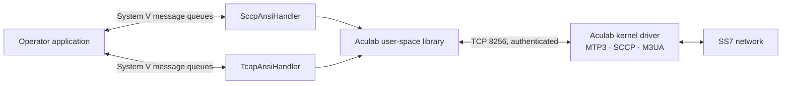
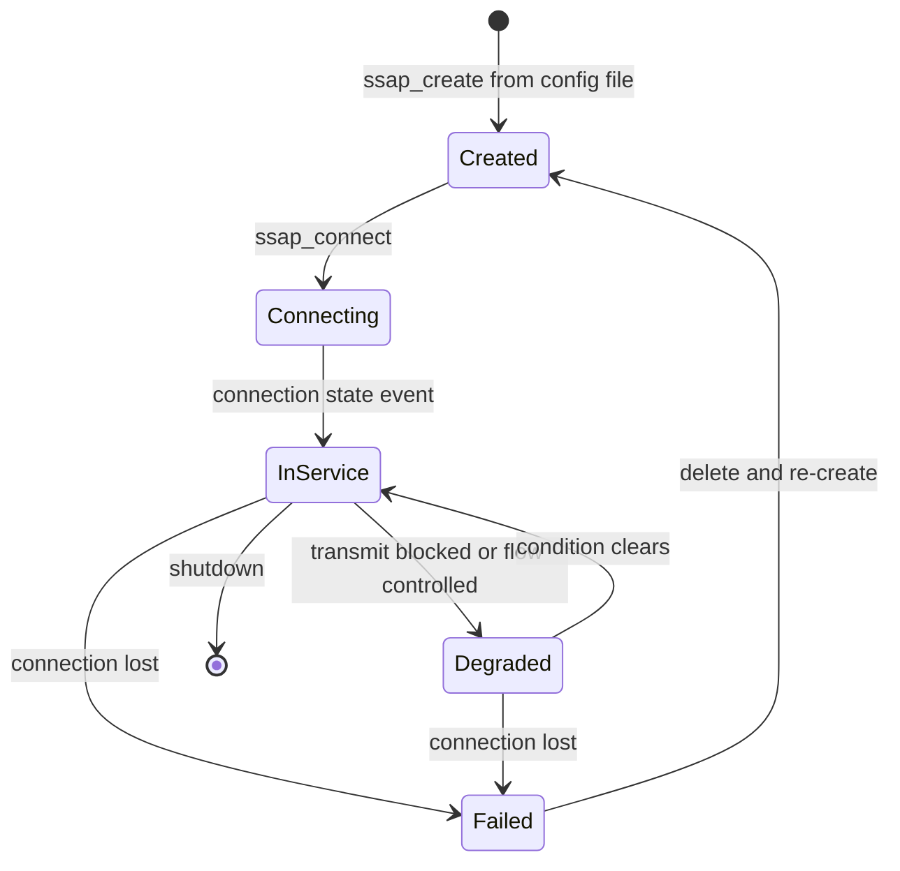
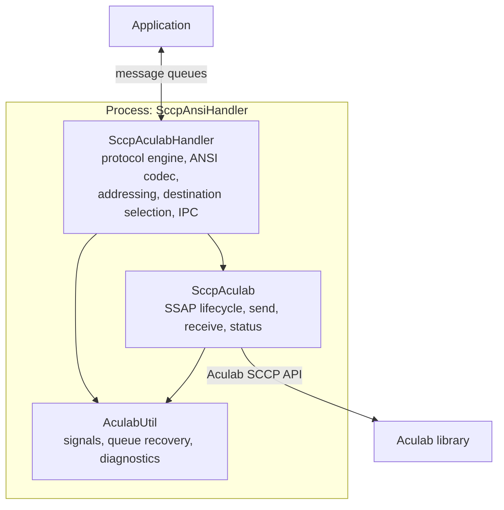
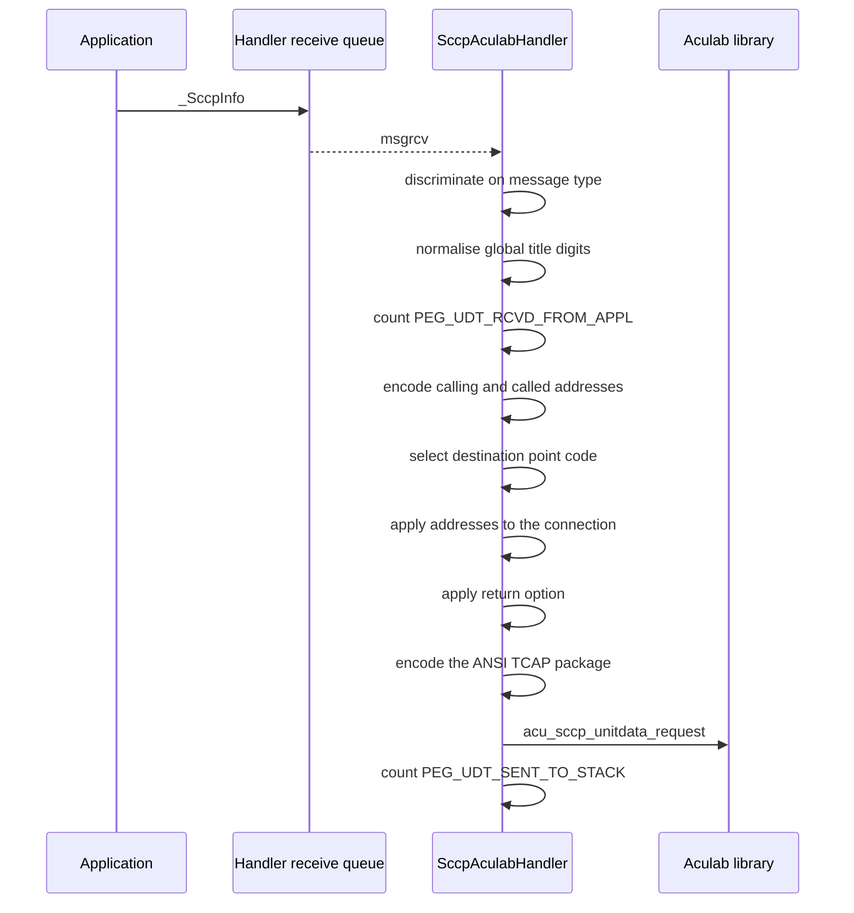
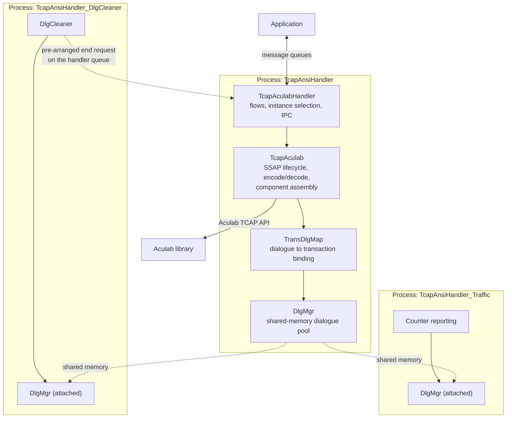
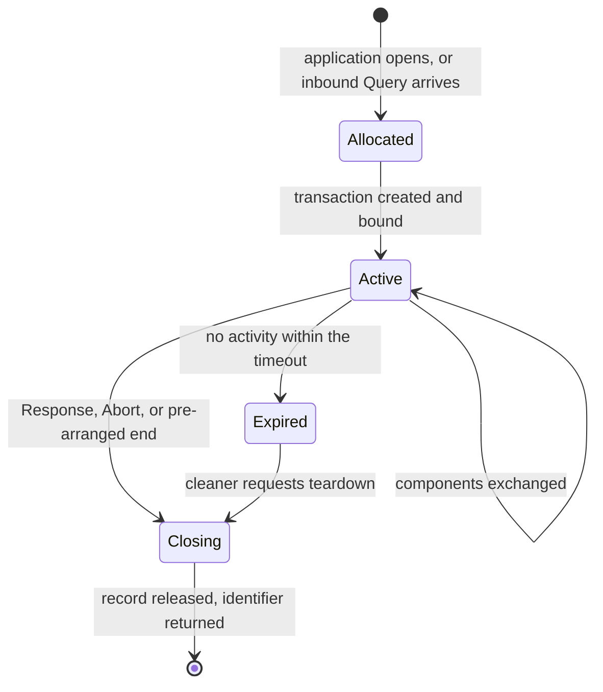
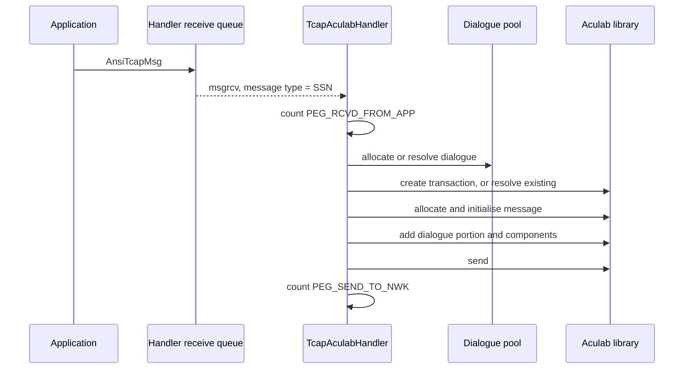
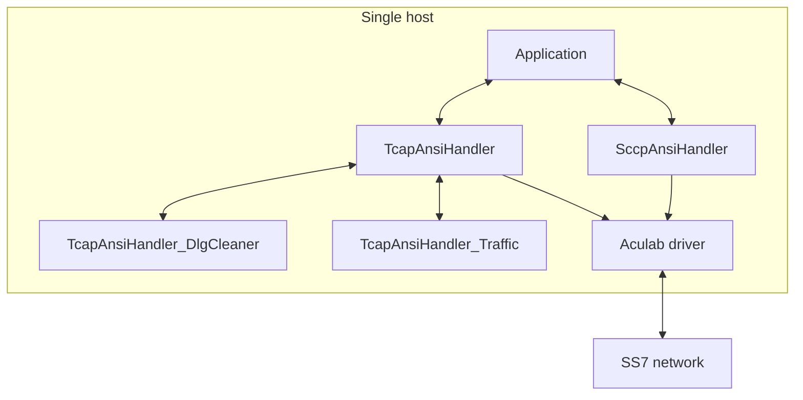
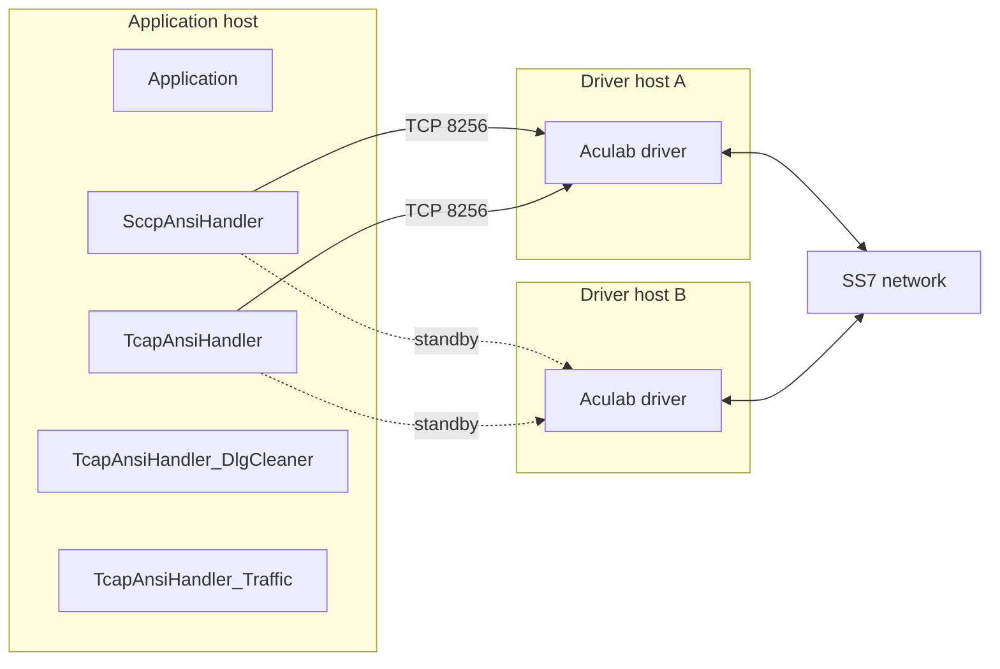

# High Level Design

## Tayana ANSI SS7 Protocol Adaptation Layer

| | |
| --- | --- |
| Document | High Level Design — ANSI SS7 Protocol Adaptation Layer |
| Product version | 3.0_RC2 (`ANSI_PRODUCT_VER`, `include/Ss7ConstDef.h:46`) |
| Document version | 1.0 |
| Date | 31 July 2026 |
| Author | Sayak Singha |
| Reviewer | |
| Approver | |
| Classification | Internal — Tayana Software Solutions |

---

## Contents

**Part I — The system**

1. About this document
2. What the product is
3. Architecture common to both layers

**Part II — The SCCP layer**

4. What the SCCP layer does
5. Addressing and destination selection
6. Transmit path
7. Receive path
8. ANSI encoding in the SCCP layer
9. Application interface
10. Configuration
11. Logging and counters

**Part III — The TCAP layer**

12. What the TCAP layer does
13. Point code and instance model
14. Transactions and dialogues
15. The dialogue pool
16. The dialogue cleaner
17. Transmit path
18. Receive path
19. Application interface
20. Configuration
21. Logging and counters

**Part IV — Deployment and operations**

22. Deployment
23. Startup, shutdown and reload
24. Capacity and limits
25. Operations and fault finding
26. Standards basis

Appendix A — Acronyms
Appendix B — Configuration quick reference
Appendix C — Site data to be supplied

---

# Part I — The system

# 1. About this document

## 1.1 Purpose

This document describes the design of the Tayana ANSI SS7 Protocol Adaptation Layer: the
software that sits between an operator signalling application and the Aculab SS7 stack, and
presents ANSI SCCP and ANSI TCAP services to that application over local inter-process
communication.

It is written for three readers:

- An architect or integrator who needs to know what the product does and what it requires
  from its environment, without reading the source.
- An application developer who has to build against the message interface.
- A deployment or operations engineer who has to configure, start and diagnose it.

## 1.2 Scope

Delivered from this repository:

| Layer | Directory | Processes |
| --- | --- | --- |
| SCCP | `sccp/` | `SccpAnsiHandler` |
| TCAP | `tcap/` | `TcapAnsiHandler`, `TcapAnsiHandler_DlgCleaner`, `TcapAnsiHandler_Traffic` |

together with the shared message structures in `include/`, which are the interface contract
the application compiles against.

Not covered here, and not delivered by this repository:

| Item | Owner |
| --- | --- |
| The Aculab SS7 stack | Aculab. Consumed as a third-party product |
| MTP2, MTP3, M3UA, M2PA | Aculab stack |
| Global Title Translation | Network STPs, or the Aculab driver's translation tables |
| Link and point code provisioning | Deployment |
| The northbound application | The application team |
| Function-level logic | Low Level Design |

## 1.3 How the two layers relate

The SCCP layer and the TCAP layer are **two independent products that happen to share a
repository**. They do not talk to each other. They do not share memory, queues or
configuration files. An application can use either, or both, or neither.

This document is therefore organised sequentially: Part II describes the SCCP layer
completely, then Part III describes the TCAP layer completely. Where the two make the same
design choice, Part I states it once.

## 1.4 Conventions

Statements about behaviour are backed by a source reference of the form
`file.cc:line`. Where a fact comes from Aculab documentation rather than from our code, the
guide is named.

Configuration keys are written as they appear in the file, including the misspelling in
`SCCP_MSG_DIPLAY_PARAM`, which the parser matches literally.

## 1.5 References

| Ref | Document |
| --- | --- |
| Aculab SS7 Developer's Guide | Stack architecture, driver model |
| Aculab SS7 Installation and Administration Guide | `ss7.cfg`, `ss7maint` |
| Aculab Distributed SCCP API Guide (rev 6.17.0) | SCCP API |
| Aculab Distributed TCAP API Guide (rev 6.16.1) | TCAP API |
| `HLD-Annex.md` | Field-level tables: tag values, log codes, counters, API register |

---

# 2. What the product is

## 2.1 The problem it solves

An operator application that needs to exchange ANSI SS7 signalling has to deal with a
protocol stack, a network link, addressing, transaction state and failure handling. The
Aculab stack solves the lower half of that. It does not present anything an application team
would want to code against directly: it is a C API with its own threading model, its own
buffer ownership rules, and a connection to a kernel driver that can fail independently of
the application.

This product closes that gap. It owns the Aculab API, holds the connection to the stack,
and exposes a message interface: the application sends a structure on a queue and receives a
structure on a queue. Everything about the stack — connection loss, host failover, flow
control, buffer discipline, transaction handles — stays on this side of the boundary.

## 2.2 What is delivered

| Binary | Built from | Role |
| --- | --- | --- |
| `SccpAnsiHandler` | `sccp/Makefile:107` | The whole SCCP layer. One process per subsystem number |
| `TcapAnsiHandler` | `tcap/Makefile:155` | The whole TCAP layer. One process per subsystem number |
| `TcapAnsiHandler_DlgCleaner` | `tcap/Makefile:185` | Times out abandoned dialogues |
| `TcapAnsiHandler_Traffic` | `tcap/Makefile:170` | Reports traffic counters |

Each binary links a set of static libraries built from the same source tree. The split is a
build convenience, not an architectural boundary; the libraries are not shipped or versioned
independently.

## 2.3 Where it sits



Two boundaries matter:

- **Application to handler** is System V message queues. These are kernel objects local to
  one host. The application and the handlers must run on the same machine. This is not a
  recommendation; there is no mechanism by which it could work otherwise.
- **Library to driver** is a TCP connection. The driver may be on the same host or on a
  different one.

## 2.4 What ANSI means here

The product implements ANSI behaviour as the Aculab stack implements it. It does not
implement an ANSI specification independently, and no clause numbers are claimed. The
practical differences from ITU that show up in the design are:

| Property | Consequence in this product |
| --- | --- |
| 24-bit point codes | Destination point codes are validated over the range 1 to 16777215 |
| No Nature of Address Indicator | The field is absent from the address model and is commented out in deployed configuration |
| Transaction identifiers are always four bytes | The decoder accepts element lengths of 4 and 8 only, and treats anything else as malformed |
| Distinct package types | Query with and without Permission, Conversation with and without Permission, Response, Unidirectional, Abort |
| Components carry a last / not-last distinction | Both the encoder and the decoder must track it |
| Return Result carries no operation code on the wire | An application correlating a result must use the invoke identifier |

---

# 3. Architecture common to both layers

## 3.1 How the product attaches to the Aculab stack

The Aculab stack is a kernel driver. MTP3, SCCP, M3UA and M2PA all live inside it. An
application does not link the protocol stack; it links a user-space library that opens an
authenticated TCP connection to the driver on port 8256.

The unit of attachment is a **Service Access Point**, or SSAP. An SSAP is created from a
configuration file, given a local point code and subsystem number, and then connected. Once
connected it is the handle through which the process sends, receives and observes status.



Two properties of the SSAP shape the whole design:

**The SSAP is not repairable.** There is no reconnect call. When the transport to the driver
fails, the process deletes the SSAP and builds a new one from configuration. Everything held
against the old SSAP — transaction handles above all — is invalid from that moment.

**Some settings are fixed at create time.** The local point code, the subsystem number and,
for TCAP, the transaction identifier range must be set before connecting. They cannot be
changed on a live SSAP. This is why a configuration reload cannot change addressing.

### Buffer discipline

Two rules come from the Aculab API and are absolute:

- A received message points into the library's cyclic receive buffer. It must be freed, or
  its contents copied out, promptly. Holding one stalls reception for every connection on
  that SSAP, not just the one the message arrived on.
- After a message is processed, the connection or transaction must be unblocked. A missed
  unblock stops that connection permanently.

Both are honoured on every path in the code, including error paths. Any new code path that
receives a message inherits both obligations.

### Dual-host attachment

The library accepts two driver hosts, A and B. It connects to both and uses A while A is
usable. Failover is inside the library; the process learns about it only as a connection
state event. The deployed configuration reviewed for this document sets host A only
(`Tcap_1071_8.cfg`), so driver failure is not currently survivable without operator action.

## 3.2 Processes

One process serves one subsystem number. Serving three subsystems means three
`SccpAnsiHandler` processes, or three `TcapAnsiHandler` processes, each with its own
configuration file and its own IPC keys.

The reason is fault isolation. A subsystem whose SSAP has failed, or whose peer has gone
away, does not affect another subsystem. The cost is that per-SSN IPC keys have to be
allocated and kept unique across the host, and that there are more processes to supervise.

The product does not supervise itself beyond thread level. Restarting a failed process is
the deployment's responsibility.

## 3.3 The application interface

The interface is a pair of System V message queues per handler, plus a heartbeat queue:

| Queue | Direction |
| --- | --- |
| Handler receive queue | Application to handler |
| Decoder receive queue | Handler to application |
| Heartbeat queue | Platform supervision to handler |

The queue keys are configured, not derived. They must be unique across every System V object
on the host, including those belonging to other products.

A message queue carries a `long` message type as its first field. The product uses it: on
the TCAP path the message type is the subsystem number, which is how one queue can serve
several subsystems and how the cleaner addresses a specific handler.

### The structure is the contract

The application and the handler exchange a C structure by value. There is no serialisation
and no version field. Both sides must have been compiled from the same headers, with the
same compile-time flags.

This matters because the flags are not the same across the two layers today. `tcap/Makefile`
defines `-DKAFKA_BRIDGE` (`tcap/Makefile:6`, `:11`); `sccp/Makefile` does not. That flag adds
a routing-metadata tail to several structures. An application built with one setting and a
handler built with the other will disagree about structure size and will misread every
message. Rebuilding both from the same tree is the only safe procedure.

`-DKAFKA_BRIDGE` does not make the product talk to Kafka. There is no Kafka client anywhere
in this repository. The flag exposes a `KafkaRoutingInfo` tail
(`include/TcapStructs.h:242-262`) that an out-of-tree bridge process can populate and read.
It is a passthrough contract, nothing more.

## 3.4 Configuration files

Configuration is layered, and which file a process reads is not obvious from the file names.
The following was established by tracing every `CfgInit` call in the source.

| File | Read by | Contains |
| --- | --- | --- |
| `SccpAnsiHandler.cfg`, section `[ACULAB_SCCP_API]` | `SccpAnsiHandler` | Every product setting for the SCCP layer: IPC keys, destinations, counter and display flags |
| `TcapAnsiHandler.cfg`, section `[ACULAB_TCAP_API]` | `TcapAnsiHandler`, `TcapAnsiHandler_DlgCleaner` | Every product setting for the TCAP layer: IPC keys, dialogue pool, timeouts, feature flags, licence, point codes |
| `Sccp_<ssn>.cfg` | Aculab library, on behalf of `SccpAnsiHandler` | Local and remote address, driver hosts and passwords, buffers, library trace |
| `Tcap_<ssn>.cfg` or `Tcap_<pc>_<ssn>.cfg` | Aculab library, on behalf of `TcapAnsiHandler` | As above, plus transaction identifier range |
| `ipc.cfg`, `Peg.cfg`, `kernel.cfg` | `TcapAnsiHandler_Traffic` only | Counter reporting |
| `ss7.cfg` | The Aculab driver, via `ss7maint` | Point code, variant, links, SCCP and TCAP listeners, passwords |

Three consequences follow, and all three are live issues on the deployment inspected for
this document.

**`kernel.cfg` is not read by the handlers.** It is a platform-wide file shared with other
Tayana products. It currently carries a full set of TCAP settings —
`MAX_ACU_TCAP_DLG_SIZE`, `ACU_TCAP_DLG_TIMEOUT`, `SCCP_DESTINATION_1`,
`TCAP_PEG_REQUIRED`, `ACU_TCAP_IN_DLG_SHIFT_INDX` and others. None of them reach
`SccpAnsiHandler` or `TcapAnsiHandler`. Only `TcapAnsiHandler_Traffic` reads this file.
Where the values differ from `TcapAnsiHandler.cfg` — and they do, `MAX_ACU_TCAP_DLG_SIZE` is
64000 in one and 500000 in the other — the `TcapAnsiHandler.cfg` value is the one in force.
The `kernel.cfg` copies are stale and should be removed to avoid future confusion.

**Some error messages name the wrong file.** A failure to read `MAX_ACU_TCAP_DLG_SIZE`
reports "in file kernel.cfg" (`tcap/src/TcapAculabHandler.cc:581`) although the value was
read from `TcapAnsiHandler.cfg`. The SCCP layer does the same
(`sccp/src/SccpAculabHandler.cc:137`, `:203`). The log text is stale; the file actually
opened is the one named in the table above. Anyone diagnosing a configuration failure should
edit the file the table names, not the file the message names.

**`kernel.cfg` also carries Dialogic-era settings** — `TCAP_RSI_MGMT_MODULE_ID`,
`TCAP_SIU0_INSTANCE`, `TCAP_SIU1_INSTANCE`, `DIA_TCAP_DLG_TIMEOUT`. Those belong to a
different stack and have no effect on this product.

### Path resolution

Configuration is located relative to the environment variables `PRODUCT_HOME` and
`PRODUCT_CFG_PATH`. Neither has a default. Whatever starts the processes must export both,
and must export the same values to every process, or the handler and the cleaner will
disagree about the dialogue pool.

## 3.5 Design decisions

These are the choices that shape the product. Each is stated with what it costs, because the
cost is usually what an integrator runs into first.

### One process per subsystem number

Fault isolation between subsystems, and per-subsystem configuration and lifecycle. The
alternative — one process multiplexing every subsystem — was rejected because a single SSAP
failure would take down unrelated traffic.

*Cost:* more processes to supervise; IPC keys must be allocated per subsystem and kept
unique host-wide.

### System V message queues for the application interface

Kernel-buffered, no connection management, and it matches the interface every other Tayana
handler already presents. UNIX domain sockets and a shared-memory ring were both considered
and rejected as more machinery for no gain within a host.

*Cost:* the application must run on the same host as the handlers. Queue keys must be
managed and cleaned up. Default queue permissions are 0666, so any local account can read
signalling traffic; if that is unacceptable, the deployment must restrict it.

### The dialogue pool in shared memory rather than process-private memory

The cleaner process must see dialogue state in order to time dialogues out, and the traffic
process must see occupancy. Keeping the pool inside the handler would require an in-process
timer and would put a full-pool scan on the traffic path.

*Cost:* cross-process locking. Raw pointers stored in the pool are only meaningful inside
the handler that wrote them, and become invalid across a restart.

### Hand-rolled ANSI encoding in the SCCP layer, Aculab encoding in the TCAP layer

The SCCP layer deliberately offers raw connectionless transport with no TCAP SSAP involved,
so there is no Aculab encoder available to it; it has to build ANSI TCAP itself. The TCAP
layer has an encoder and uses it.

*Cost:* ANSI encoding knowledge exists in two places, only one of which is ours to maintain.
Section 8 states the limits this puts on the SCCP layer.

### Aculab transaction handles stored in the shared dialogue record

Gives direct dialogue-to-transaction resolution without a second index.

*Cost:* the handle is a pointer in the handler's address space. The cleaner and the traffic
process may read the record but must never dereference that field, and it is meaningless
after a restart.

### Global Title Translation delegated to the network and the driver

Translation is operator routing policy. STPs already own it.

*Cost:* the deployment must guarantee translation capability. The product cannot diagnose a
translation failure beyond reporting the cause the network returned.

### Polling the Aculab API rather than using its event interface

One blocking call per receive thread, and a thread model that can be reasoned about.

*Cost:* the poll timeout is 500 ms, and that becomes the receive latency floor when traffic
is sparse. Under load the call returns as soon as a message is available and the floor does
not apply.

### Detached worker threads with a supervisor loop

Minimal machinery. A failed SSAP's threads exit on their own.

*Cost:* threads are never joined. A reconnect that re-spawns them accumulates threads over
repeated failures.

### A separate cleaner process for dialogue timeout

Keeps a full-pool scan — up to 500,000 records — off the handler's traffic path, and keeps
all Aculab manipulation inside the handler: the cleaner requests teardown, it does not
perform it.

*Cost:* one more process to deploy and supervise, and a message contract between the two
that must stay in step.

### Static libraries rather than shared objects

One file per binary to deploy. No runtime library path management.

*Cost:* a change to a shared header requires every binary to be rebuilt, and the rebuild has
to be complete — a partial rebuild produces exactly the structure-mismatch failure described
in 3.3.
---

# Part II — The SCCP layer

Everything in Part II concerns `SccpAnsiHandler` only. It has no dependency on, and no
communication with, the TCAP layer.

# 4. What the SCCP layer does

## 4.1 Service offered

The SCCP layer offers **connectionless transport with ANSI TCAP framing**. An application
hands it a called party address, a calling party address and a TCAP package described as
fields; the handler builds the ANSI TCAP byte stream, wraps it in an SCCP unitdata message
and sends it. In the other direction it takes a received unitdata message, parses the ANSI
TCAP inside it, and hands the application the same field structure.

Connection-oriented SCCP is not offered. Nothing in the code creates or accepts an SCCP
connection.

## 4.2 Why this layer exists alongside the TCAP layer

The TCAP layer (Part III) gives an application transactions and dialogues: state that the
Aculab library holds and manages. That is the right model for most applications and it is
the one to prefer.

The SCCP layer exists for applications that need the opposite: no transaction state held
anywhere, full control of the transaction identifiers on the wire, and the ability to send a
package that a transaction-aware layer would refuse. It is the lower-level, less-safe
option.

The consequence is that the SCCP layer has no TCAP SSAP available to it, so it cannot ask
Aculab to encode TCAP. It encodes TCAP itself. Section 8 covers what that costs.

## 4.3 Internal structure



One SSAP. One receive thread. One transmit path driven by the application queue.

---

# 5. Addressing and destination selection

## 5.1 The address model

An SCCP address in this product carries a point code, a subsystem number and a global title.
Which of those are present is expressed differently on each side of the Aculab boundary:

- The application uses an **address indicator** byte, in the SCCP convention: bit 0 point
  code present, bit 1 subsystem number present, bits 2 to 3 the global title indicator.
- Aculab uses a **validity bitmask** on its address structure.

The handler converts between the two in both directions. The exact bit mapping is in the
Annex, section A2.2.

For ANSI there is no Nature of Address Indicator. The field does not appear in the ANSI
address model and is commented out in the deployed configuration files.

Global title digits are held as ASCII by the application and as packed BCD on the wire. The
decoder always unpacks. The encoder converts only if the first digit byte looks like ASCII —
if it exceeds `0x30` (`sccp/src/SccpAculabHandler.cc:439-456`). An application that supplies
packed BCD whose first byte happens to exceed that value will have its digits converted a
second time and will send the wrong address. Applications should supply ASCII digits
consistently.

## 5.2 Destination selection

This is the part of the SCCP layer most likely to surprise an integrator.

The application supplies a called party address, and the handler encodes it — the global
title, the subsystem number and the address indicator all come from the application. The
**point code does not**. After encoding the called party address, the handler overwrites the
destination point code with one taken from its own configuration
(`sccp/src/SccpAculabHandler.cc:483-552`).

Two point codes may be configured, `SCCP_DESTINATION_1` and `SCCP_DESTINATION_2`. Selection
depends on whether the second is set:

| Configuration | Behaviour |
| --- | --- |
| Destination 2 not set | Send to destination 1 if the network reports it available. If not, drop the message and log `ACUSCCP24` |
| Both set | Alternate between them on successive messages. If the one selected this time is unavailable, use the other. If both are unavailable, drop the message and log `ACUSCCP24` |

The alternation is a simple toggle held in the process (`mPcFlag`), so with both destinations
available and healthy, traffic is shared evenly between them.

Availability comes from the network, not from configuration. The handler subscribes to
signalling point and subsystem status and keeps the current state of each destination. A
destination that has never been reported available is treated as unavailable, which means a
missing `[CONCERNED]` entry in the driver's `ss7.cfg` for a destination point code and
subsystem will cause every message to that destination to be dropped, with no other symptom.

So: **the SCCP layer routes on configured point codes and uses the application's global
title only for onward translation.** An application cannot direct a message to an arbitrary
point code through this layer.

---

# 6. Transmit path

`ProcessTxMsgToStack`, `sccp/src/SccpAculabHandler.cc:426`.



| Step | Site | Note |
| --- | --- | --- |
| Discriminate | `:596-599` | Only unitdata proceeds. Any other message type is discarded silently |
| Normalise digits | `:439-456` | The ASCII heuristic described in 5.1 |
| Count received | `:459` | Counted before encoding, so messages later dropped are still counted as received from the application |
| Encode calling party | `:476` | Failure logs `ACUSCCP17` and drops |
| Encode called party | `:483` | Failure logs `ACUSCCP18` and drops |
| Select destination | `:485-552` | Section 5.2 |
| Apply to connection | `:561` | Addresses are copied onto the connection object |
| Apply return option | `:570-577` | Must follow the address step, because it is set on the same connection |
| Encode the package | `:1450-1469` | Section 8 |
| Send | `:591` | Return value checked; failure is logged |
| Count sent | `:411` | Counted only on success |

There is no transmit drop counter in the SCCP layer. A message dropped for any of the
reasons above is counted as received from the application but never as sent to the stack.
The difference between counters 92 and 93 is therefore the drop count, and the log code says
which reason.

---

# 7. Receive path

`RxMsgFromStack`, `sccp/src/SccpAculabHandler.cc:643`.

The receive thread polls the Aculab API with a 500 ms timeout
(`sccp/src/SccpAculabApi.cc:426`). When traffic is sparse this timeout is the latency floor;
under load the call returns as soon as a message is available.

Events arrive on one of three paths:

| Event | Handling |
| --- | --- |
| Unitdata | Counted, decoded, delivered to the application queue |
| Notice | Counted, and the return cause logged as `ACUSCCP36`. A notice means the network could not deliver a message we sent |
| Connection state, point code status, subsystem status | Update the SSAP and destination state used by 5.2. Not counted, not delivered |

Decode is described in the Annex, A2. A decode failure logs `ACUSCCP30` and the message is
dropped; it was already counted as received.

Every path — including every failure path — frees the received message and unblocks the
connection. That obligation is stated in 3.1 and is not optional.

A notice increments the same receive counter as normal data (`:693`). A rise in
counter 91 without a matching rise in counter 94 may be inbound delivery failures rather
than a fault in the handler.

---

# 8. ANSI encoding in the SCCP layer

## 8.1 Why the codec is here

As established in 4.2, this layer has no TCAP SSAP, so Aculab cannot encode for it. The
handler contains its own ANSI TCAP encoder and decoder.

The tag values it works against are defined in `sccp/include/MsuAnsiStructs.h` and are listed
in full in the Annex, A1.

## 8.2 The tag ambiguity

Two tag values carry two meanings each in ANSI:

| Value | At package level | At component level |
| --- | --- | --- |
| `0xE8` | Unidirectional package | Component portion |
| `0xE1` | Query without Permission | Invoke, not last |

Nothing in the byte distinguishes them. The decoder resolves this by **position**: a tag read
as the first byte of the package is a package tag; a tag read after the transaction
identifier element is a component-level tag.

This is a standing constraint on the decoder. Any change to `DecodeUnitData`
(`sccp/src/SccpAculabHandler.cc:1068`) that alters the order in which elements are examined,
or introduces a lookahead across the transaction identifier boundary, can silently
reinterpret a Unidirectional package as a component portion. The function's position
sensitivity must be preserved.

The header records that these values were corrected from an earlier, incorrect set
(`sccp/include/MsuAnsiStructs.h:30`). The Annex table is the corrected set.

## 8.3 Message size limit

The encoder patches element lengths after writing content, using an 8-bit length variable.
That bounds a single constructed element to 255 bytes of content, consistent with the
300-byte payload buffer the decoder copies into (`:1073`, `:1093`).

The practical effect is that **the SCCP layer is limited to packages of roughly 255 bytes**.
It does not segment, and it does not use the extended connectionless formats. A deployment
whose packages approach that size must use the TCAP layer, where length handling belongs to
the Aculab encoder and definite-length encoding can be forced.

## 8.4 Asymmetry between the two directions

The encoder and decoder are deliberately not exact inverses:

| Aspect | Decode | Encode |
| --- | --- | --- |
| Digits | BCD to ASCII, always | ASCII to BCD, conditionally |
| Address content | Validity mask to indicator byte | Indicator byte to validity mask |
| Length form | Long form and indefinite form both accepted | Definite form only |
| Missing address | Warning; decoding continues | Failure; message dropped |

Accepting indefinite-length encoding inbound while never producing it outbound is the
correct choice: be liberal in what is accepted, strict in what is sent.

---

# 9. Application interface

## 9.1 Structure

The application exchanges `_SccpInfo` (`include/MsuStructs.h`). It carries:

| Field group | Contents |
| --- | --- |
| Message type | Discriminates the union. Only unitdata is handled |
| Protocol class and handling | Class in the low nibble, return-on-error in bit 7 |
| Called and calling party address | Point code, subsystem number, address indicator, global title digits |
| Transaction information | Package type, originating and destination transaction identifiers |
| Dialogue information | The dialogue portion, carried verbatim |
| Component information | Component type, invoke and linked identifiers, operation or error code, parameters |

The dialogue portion is not interpreted. It is copied out of the received package and copied
into a sent one unchanged. An application that uses application contexts is responsible for
their content.

## 9.2 Obligations on the application

- **Set the message type before reading the union.** The structure is a union discriminated
  by that field and there is no other way to know which arm is valid.
- **Supply ASCII global title digits**, for the reason in 5.1.
- **Do not expect the destination point code to be honoured.** See 5.2.
- **Compile against the same headers with the same flags as the handler.** See 3.3.
- **Correlate Return Results by invoke identifier.** An ANSI Return Result carries no
  operation code on the wire, so the field will be empty on receipt.

---

# 10. Configuration

## 10.1 What the handler reads

Every product setting comes from `SccpAnsiHandler.cfg`, section `[ACULAB_SCCP_API]`
(`sccp/src/SccpAculabHandler.cc:133`, `:198`, `:283`). Nothing in `kernel.cfg` reaches this
process; see 3.4.

| Key | Range enforced | On failure |
| --- | --- | --- |
| `MSG_SCCP_HDLR_Q_RCV` | IPC key range | Startup fails |
| `MSG_SCCP_DEC_Q_RCV` | IPC key range | Startup fails |
| `MSG_SCCP_HEART_BEAT_Q_RCV` | IPC key range | Startup fails |
| `SCCP_PEG_REQUIRED` | 0 or 1 | Startup fails |
| `SCCP_MSG_DIPLAY_PARAM` | Display parameter range | Startup fails |
| `SCCP_DESTINATION_1` | 1 to 16777215 | Startup fails |
| `SCCP_DESTINATION_2` | 1 to 16777215 | Set to 0, startup continues |

Two points worth noting. `SCCP_DESTINATION_2` is the only optional setting; every other key
is mandatory and a missing one prevents startup. And the range on both destinations is the
full 24-bit ANSI point code space, not the 1 to 35000 range stated in the comments of the
sample file — that comment is stale and should be corrected.

The misspelling in `SCCP_MSG_DIPLAY_PARAM` is matched literally by the parser. It cannot be
corrected in the file without also changing the code.

## 10.2 What the Aculab library reads

`Sccp_<ssn>.cfg` is read by the library when the SSAP is created. It carries the local point
code and subsystem number, the remote default address, the driver host names, ports and
passwords, buffer sizes and the library's own trace and log settings. The local point code
here must match the one in the driver's `ss7.cfg`; the handler cross-checks and refuses to
start if they differ (`sccp/src/SccpAculabApi.cc:197-205`).

## 10.3 Worked example

From a working deployment:

```
[ACULAB_SCCP_API]

MSG_SCCP_HDLR_Q_RCV = 4100
MSG_SCCP_DEC_Q_RCV = 4101
MSG_SCCP_HEART_BEAT_Q_RCV = 4102

SCCP_PEG_REQUIRED = 1
SCCP_MSG_DIPLAY_PARAM = 2

SCCP_DESTINATION_1 = 1070
SCCP_DESTINATION_2 = 35000
```

Both destinations are set, so this deployment alternates between point codes 1070 and 35000
as described in 5.2, with each covering for the other.

---

# 11. Logging and counters

## 11.1 Log codes

The SCCP layer uses codes `ACUSCCP01` to `ACUSCCP44` across 87 call sites, plus the generic
platform codes. The full catalogue with trigger conditions is in the Annex, A6.2.

The codes worth alarming on:

| Code | Meaning |
| --- | --- |
| `ACUSCCP01` | SSAP creation failed, or the configured local point code does not match the SSAP's. Fatal |
| `ACUSCCP13` | SSAP status and reconnect decision. The primary availability signal |
| `ACUSCCP24` | Destination not available; message dropped. Section 5.2 |
| `ACUSCCP14` | Write to the application queue failed |
| `ACUSCCP30` | Decode of a received message failed |
| `ACUSCCP36` | Notice received from the network, with the return cause |

## 11.2 Counters

Five counters, all incremented in `sccp/src/SccpAculabHandler.cc`:

| ID | Counter | Where |
| --- | --- | --- |
| 91 | Unitdata received from the stack | `:643`, before decoding |
| 92 | Unitdata received from the application | `:458`, before encoding |
| 93 | Unitdata sent to the stack | `:411`, on success only |
| 94 | Unitdata sent to the application | `:393`, after the write |
| 95 | Notices received | `:693` |

Derived indicators:

| Indicator | Expression | Healthy |
| --- | --- | --- |
| Transmit loss | 92 − 93 | Zero |
| Receive loss | 91 − 94 | Zero |
| Notice rate | 95 over time | Low and stable |

Every increment is guarded by `SCCP_PEG_REQUIRED`. A counter reading zero means either no
traffic or counters disabled — check the flag before drawing a conclusion.
---

# Part III — The TCAP layer

Everything in Part III concerns `TcapAnsiHandler` and its two companion processes. It has no
dependency on, and no communication with, the SCCP layer.

# 12. What the TCAP layer does

## 12.1 Service offered

The TCAP layer offers **transaction-oriented signalling**. The application works in terms of
a dialogue: it opens one, sends and receives components on it, and closes it. The handler
maps that dialogue onto an Aculab transaction, and the Aculab library holds the transaction
state, encodes and decodes ANSI TCAP, and runs the operation timers.

This is the layer most applications should use. It is safer than the SCCP layer because the
library enforces the protocol state machine, and it is not subject to the 255-byte package
limit of section 8.3.

## 12.2 What the product adds over the library

The Aculab library already provides transactions. This layer exists because the library's
model does not survive contact with an operational deployment on its own:

| Problem | What this layer does |
| --- | --- |
| A transaction handle is a pointer, valid only inside one process and only until the SSAP is rebuilt | Presents a stable numeric dialogue identifier and keeps the mapping |
| A peer that abandons a dialogue leaves the transaction open forever | A separate process times dialogues out (section 16) |
| One SSAP has one point code, but operators run several | Supports multiple originating point codes, each with several SSAP instances (section 13) |
| Transaction identifiers must not collide between the two ends | Splits the identifier space so each end allocates from its own half (section 15) |
| The library's interface is a C API with buffer ownership rules | Presents a message structure on a queue |

## 12.3 Internal structure



The three processes share the dialogue pool through System V shared memory. The cleaner
never calls the Aculab API: it detects an expired dialogue and asks the handler to tear it
down. All Aculab manipulation stays in the handler.

---

# 13. Point code and instance model

## 13.1 Multiple originating point codes

One SSAP serves one point code. An operator that presents several originating point codes
needs several SSAPs, and this layer creates them inside one process.

Configuration declares how many:

```
NUMBER_OF_OPC = 1
OPC_0 = 1071:1
```

Each entry is `<point code>:<number of instances>`. Indices must start at 0 and increment
without gaps. The count is bounded at 128 (`include/Ss7ConstDef.h:187-188`) and instances per
point code at 10 (`tcap/include/TcapAculabConstDef.h:54`).

Setting `NUMBER_OF_OPC = 0` disables the mechanism; the handler then takes a single point
code from `LocalPC` in `Tcap_<ssn>.cfg` (`tcap/src/TcapAculabHandler.cc:784`).

The configuration file the library reads depends on which mode is in use:

| Mode | File |
| --- | --- |
| `NUMBER_OF_OPC = 0` | `Tcap_<ssn>.cfg` |
| `NUMBER_OF_OPC` ≥ 1 | `Tcap_<pc>_<ssn>.cfg`, one per point code |

The deployment inspected for this document uses point code 1071 and subsystem 8, so the file
is `Tcap_1071_8.cfg`.

## 13.2 Why several instances of one point code

Each SSAP instance is a separate connection to the driver with its own transaction
identifier range. Several instances of the same point code multiply the transaction capacity
and spread traffic across connections.

The ranges must not overlap. `TRANID_RANGE` in the library configuration sets the range for
an instance, and the handler applies it before connecting
(`tcap/src/TcapAculabHandler.cc:1053`). It cannot be changed on a live SSAP.

If the point code declared in `OPC_<n>` does not match the one in the corresponding library
configuration file, SSAP creation fails and the handler reports both values
(`tcap/src/TcapAculabApi.cc:304`).

## 13.3 Threads

Each connected instance gets **two detached threads**: one receive, one transmit
(`tcap/src/TcapAculabHandlerMain.cc:165`, `:186`). A deployment with one point code and one
instance runs two worker threads; the maximum configuration would run considerably more.

Thread creation is serialised with a one-second delay between each
(`tcap/src/TcapAculabHandlerMain.cc:183`). The parameter block passed to the new thread is
reused by the parent for the next instance, so that delay is load-bearing: it gives each
thread time to copy its instance number before the parent overwrites it. **The delay must
not be removed as an optimisation.** The visible cost is startup time — roughly two seconds
per instance, so a ten-instance configuration takes about twenty seconds to come up.

Threads are detached and never joined. A reconnect that re-spawns them accumulates threads
across repeated failures.

---

# 14. Transactions and dialogues

## 14.1 The two identities

| Identity | Owned by | Lifetime | Visible to |
| --- | --- | --- | --- |
| Dialogue identifier | This product | From allocation to release | The application |
| Transaction handle | Aculab library | From create to delete | The handler only |

The application only ever sees the dialogue identifier. The handler holds the binding between
the two in the dialogue pool record.

The transaction handle is stored in shared memory so the handler can resolve it directly, but
it is a pointer in the handler's address space. The cleaner and the traffic process read
other fields of the same record and must never dereference that one. After a restart it is
meaningless.

## 14.2 Dialogue lifetime



An outbound dialogue is allocated when the application opens it. An inbound dialogue is
created by the library when a Query is decoded, and the handler allocates a record for it at
that point.

## 14.3 Package types

Outbound package types map one to one onto Aculab message types; the table is in the Annex,
A4.1. Two cases are worth stating here:

- **Pre-arranged end** is not a package. Nothing is sent to the peer; the transaction is
  simply deleted locally. This is how the cleaner ends an abandoned dialogue.
- **Abort** may be generated by the library rather than by the application, in response to a
  protocol error or a decode failure. The application will see a dialogue end it did not
  initiate.

Inbound, the message type reported before decoding is coarse. The real package type is only
available after the library has decoded the message, and decoding is also what auto-creates
the transaction for an inbound Query.

## 14.4 Components

Four component types cross the interface in both directions: Invoke, Return Result, Return
Error and Reject. Three more can only arrive inbound, generated by the library rather than by
the peer:

| Pseudo-component | Meaning |
| --- | --- |
| Operation timeout | An outstanding operation timed out |
| Local reject | A malformed component was received |
| Abort user information | Abort content presented as a component |

An application must be prepared to receive these on a dialogue it was not expecting activity
on.

Two ANSI encoding rules are applied by the library and affect what the application sees. A
Return Result carries no operation code on the wire, so the field is empty on receipt and
correlation must use the invoke identifier. Component parameters must begin with tag `0xF2`
or `0x30`; anything else is wrapped in a private constructed item.

---

# 15. The dialogue pool

## 15.1 What it is

Two System V shared memory segments and one semaphore, created by whichever process starts
first and attached by the others:

| Object | Contents |
| --- | --- |
| Record pool | One record per dialogue identifier |
| Management queue | A header plus a ring of free indices |
| Semaphore | Serialises allocation, release and update |

## 15.2 The half-split, and how to size it

This is the property most often got wrong when sizing a deployment.

The pool is divided in half. The upper half is allocated from locally; the lower half is
reserved for identifiers derived from the peer's transaction range. Allocation always adds
an offset so that every locally allocated identifier lands in the upper half
(`tcap/src/TcapAculabDlgMgr.cc:300-303`).

From `tcap/src/TcapAculabDlgMgr.cc:85-86`:

```
half        = MAX_ACU_TCAP_DLG_SIZE / 2 + ACU_TCAP_IN_DLG_SHIFT_INDX
allocatable = MAX_ACU_TCAP_DLG_SIZE / 2 - ACU_TCAP_IN_DLG_SHIFT_INDX
```

**A configured pool of N yields approximately N/2 usable outbound dialogues.** Applied to the
deployment inspected here, with `MAX_ACU_TCAP_DLG_SIZE = 500000` and
`ACU_TCAP_IN_DLG_SHIFT_INDX = 2000`:

| Quantity | Value |
| --- | --- |
| Configured pool | 500,000 |
| Boundary between halves | 252,000 |
| Outbound dialogues allocatable | 248,000 |

Size the pool at twice the required concurrent outbound dialogue count, not at the count
itself. Exhaustion logs `ACUTCAP24` and the outbound request fails.

The configured maximum is 500,000 records (`tcap/src/TcapAculabHandler.cc:577-579`), so the
ceiling on outbound dialogues for any deployment is about 250,000.

## 15.3 Locking

A binary semaphore taken with `SEM_UNDO`. That flag matters: a process that dies holding the
lock has its operation reversed by the kernel, so a handler crash does not leave the pool
permanently locked against the cleaner.

Allocation, release and update take the lock. The read paths — insertion time, subsystem
number, occupancy — do not. That is deliberate: they read scalar fields where a torn read
yields a stale value rather than an invalid one, and the caller acts on the value only
through a subsequent locked operation. The cleaner is the main such reader: it reads a
timestamp without the lock, and the teardown it requests is performed by the handler under
the lock.

## 15.4 Defensive behaviour

Releasing a record that is already free, or referencing an identifier outside the pool, is
logged and ignored rather than allowed to corrupt the free ring. The codes are `ACUTCAP73`,
`ACUTCAP74`, `ACUTCAP75`, `ACUTCAP76` and `ACUTCAP156`. Any of these appearing in a log is a
real defect somewhere upstream and should be investigated, not filtered out.

---

# 16. The dialogue cleaner

`TcapAnsiHandler_DlgCleaner` exists so that a full-pool scan never runs on the handler's
traffic path. At the maximum pool size that scan touches 500,000 records.

Every three seconds it walks the pool and compares each record's insertion time against a
timeout. Two timeouts are configured, and which applies depends on the record's subsystem
number: `ACU_TCAP_DLG_TIMEOUT_CAP` for the cleaner's own subsystem, `ACU_TCAP_DLG_TIMEOUT`
otherwise. To bound its own CPU cost it sleeps briefly every two thousand records.

On expiry it posts a pre-arranged end request to the handler's receive queue, using the
record's subsystem number as the message type so it reaches the right handler. The handler
releases the dialogue and deletes the transaction. Nothing is sent to the peer.

Whether the application is told is configurable. With
`SEND_RSP_TIMEOUT_ON_PRE_ARR_END = 1` the handler notifies the application that the dialogue
timed out; with `0` the dialogue disappears silently. The deployment inspected here has this
set to `0`, so **an application there will not be told when a dialogue is reaped.** If the
application maintains its own per-dialogue state, it needs its own timer, or this flag needs
to be set to 1.

Both timeouts are in seconds. The deployment inspected here sets `ACU_TCAP_DLG_TIMEOUT = 5000`,
which is the configured ceiling (`tcap/include/TcapAculabConstDef.h:42`), and
`ACU_TCAP_DLG_TIMEOUT_CAP = 8000`. Those are long — over an hour — and mean the pool holds
abandoned dialogues for a long time before reclaiming them. That is a deliberate operational
choice, but it interacts directly with the sizing rule in 15.2 and should be reviewed
together with it.

---

# 17. Transmit path

Driven by the transmit thread of each instance, reading the application queue.



The path is defensive at every step, and each failure has its own drop counter increment and
log code — transaction creation, message allocation, message initialisation, component
addition, dialogue mapping and the send itself. A message dropped anywhere in that chain is
counted in `PEG_DROP_SEND_TO_NWK`, so transmit loss is directly observable rather than
inferred.

Three behaviours are worth calling out:

- **A Query on a dialogue that already has a transaction is rejected** and counted. It
  indicates the application has reused a dialogue identifier without closing it.
- **A non-Query package with no existing transaction is rejected.** The dialogue must be
  opened before it can be continued.
- **Addresses are fixed when the message is initialised, not when it is sent.** The product
  clears the library's address defaults and applies the application's values, so what goes on
  the wire is what the application supplied rather than a residue of configuration. Two flags
  govern this: `SET_LOCAL_ACU_TCAP_ADDR_FLAG` forces the local address to be set explicitly,
  and `SET_APP_GT_RELAY_FLAG` relays the application's global title unchanged. Both are set to
  1 in the deployment inspected here.

## 17.1 Transmit gating

Each instance's transmit thread only runs when its SSAP is in service and not transmit
blocked. If no instance is available, the message is dropped and `ACUTCAP157` is logged.

There is also a restoration gate. When `RESTORATION_REQUIRED` is set to 1, transmit threads
wait for a restore flag before starting, logging `ACUTCAP105` while they wait. The
restoration procedure itself is not used in the delivered configuration — the Aculab restore
calls are present in the code but not exercised — so **this flag must be left at 0**. Setting
it to 1 stops transmission with no way to release it. The deployment inspected here correctly
has it at 0.

---

# 18. Receive path

The receive thread of each instance polls the Aculab API with a 500 ms timeout. As with the
SCCP layer, that timeout is the receive latency floor when traffic is sparse and does not
apply under load.

| Event | Handling |
| --- | --- |
| Data | Counted, decoded, components extracted, delivered to the application |
| Notice | Counted on the same counter as data, then delivered |
| Operation timeout | Delivered as a pseudo-component and counted separately |
| Connection state, point code status, subsystem status | Update SSAP state; not counted, not delivered |

Decoding is done by the library and is what reveals the real package type and auto-creates
the transaction for an inbound Query. A decode failure is counted as a receive drop, and the
library sends a P-Abort to the peer on our behalf.

Components are extracted one at a time until the library reports that none remain. The
per-component receive counters increment once per component, while the message counter
increments once per message, so the two will not match on multi-component traffic. That is
expected, not a fault.

As on the SCCP path, every route through the receive handler frees the message and unblocks
the transaction, including every error route.

---

# 19. Application interface

## 19.1 Structure

The application exchanges `AnsiTcapMsg` (`include/TcapStructs.h`):

| Field group | Contents |
| --- | --- |
| Subsystem number | Also used as the queue message type |
| Dialogue identifier | The stable identity from section 14.1 |
| TCAP user identifier | Application correlation value, passed through |
| Transaction identifiers and length | Four bytes for ANSI |
| Originating and destination address | Point code, subsystem number, global title |
| Dialogue type | The package type from A4.1 |
| Component presence and content | Type, invoke and linked identifiers, operation or error code, parameters |

`AnsiTcapMsg` is 432 bytes; the ITU structure `TcapMsg` in the same header is 520. They are
different structures for different products and are not interchangeable. Optional tails
selected by the `SS7_TIMESTAMP` and `KAFKA_BRIDGE` compile flags change both sizes, which is
the mechanism behind the rule in 3.3.

## 19.2 Obligations on the application

- **Set the message type to the subsystem number** when writing to the queue, or the handler
  will not see the message.
- **Open a dialogue with a Query before continuing it**, and do not reuse a dialogue
  identifier until the previous dialogue has ended.
- **Handle inbound pseudo-components** — operation timeout, local reject, abort user
  information — on dialogues where no application activity is outstanding.
- **Correlate Return Results by invoke identifier**, not by operation code.
- **Do not rely on being told about a reaped dialogue** unless
  `SEND_RSP_TIMEOUT_ON_PRE_ARR_END` is 1. See section 16.
- **Compile against the same headers with the same flags as the handler.** See 3.3.

---

# 20. Configuration

## 20.1 What the handler reads

Every product setting comes from `TcapAnsiHandler.cfg`, section `[ACULAB_TCAP_API]`
(`tcap/src/TcapAculabHandler.cc:481`, `:552`, `:910`). The cleaner reads the same file
(`tcap/src/TcapAculabDlgCleaner.cc:107`, `:212`), which is what keeps the two in step.
Nothing in `kernel.cfg` reaches either process; see 3.4.

| Key | Range | Purpose |
| --- | --- | --- |
| `MSG_TCAP_HDLR_Q_RCV` | IPC key range | Application to handler |
| `MSG_TCAP_DEC_Q_RCV` | IPC key range | Handler to application |
| `MSG_TCAP_HEART_BEAT_Q_RCV` | IPC key range | Platform supervision |
| `SEM_IN_DLG_KEY` | IPC key range | Dialogue pool semaphore |
| `SHM_IN_DLG_POOL_KEY` | IPC key range | Dialogue record segment |
| `SHM_DLG_MGMT_QUEUE_KEY` | IPC key range | Free-index ring segment |
| `MAX_ACU_TCAP_DLG_SIZE` | 1 to 500000 | Pool size. See 15.2 |
| `ACU_TCAP_IN_DLG_SHIFT_INDX` | | Half-split offset. See 15.2 |
| `ACU_TCAP_DLG_TIMEOUT` | 1 to 5000 s | Dialogue timeout |
| `ACU_TCAP_DLG_TIMEOUT_CAP` | 1 to 8000 s | Timeout for the cleaner's own subsystem |
| `RESTORATION_REQUIRED` | 0 or 1 | Must be 0. See 17.1 |
| `TCAP_PEG_REQUIRED` | 0 or 1 | Counter enable |
| `TCAP_MSG_DISPLAY_PARAM` | Display range | Message trace detail |
| `TCAP_DISABLE_RECV_LOCAL_ADDRESS` | 0 or 1 | Suppress local address on receive |
| `SET_LOCAL_ACU_TCAP_ADDR_FLAG` | 0 or 1 | See 17 |
| `SET_APP_GT_RELAY_FLAG` | 0 or 1 | See 17 |
| `SEND_RSP_TIMEOUT_ON_PRE_ARR_END` | 0 or 1 | See 16 |
| `TCAP_MSG_LICENCE_KEY` | String | Validated at startup; failure logs `ACUTCAP107` |
| `NUMBER_OF_OPC` | 0 to 128 | See 13.1 |
| `OPC_<n>` | `<pc>:<instances>` | See 13.1 |

## 20.2 What the Aculab library reads

`Tcap_<pc>_<ssn>.cfg`, one per point code. It carries the local and remote addresses, the
driver hosts and passwords, the transaction identifier range, buffer sizes, the operation
timeout and the library's own trace and log settings.

## 20.3 Worked example

From the deployment inspected for this document. Product configuration:

```
[ACULAB_TCAP_API]
MSG_TCAP_HDLR_Q_RCV = 9733
MSG_TCAP_DEC_Q_RCV = 9734
MSG_TCAP_HEART_BEAT_Q_RCV = 4098
SEM_IN_DLG_KEY = 9914
SHM_IN_DLG_POOL_KEY = 9839
SHM_DLG_MGMT_QUEUE_KEY = 9840

MAX_ACU_TCAP_DLG_SIZE = 500000
ACU_TCAP_IN_DLG_SHIFT_INDX = 2000
ACU_TCAP_DLG_TIMEOUT = 5000
ACU_TCAP_DLG_TIMEOUT_CAP = 8000

RESTORATION_REQUIRED = 0
TCAP_PEG_REQUIRED = 1
SET_LOCAL_ACU_TCAP_ADDR_FLAG = 1
SET_APP_GT_RELAY_FLAG = 1
SEND_RSP_TIMEOUT_ON_PRE_ARR_END = 0

NUMBER_OF_OPC = 1
OPC_0 = 1071:1
```

Library configuration, `Tcap_1071_8.cfg`:

```
[TCAP]
LocalPC = 1071
LocalSSN = 8
RemotePC = 35000
RemoteSSN = 8

LOCAL_FLAGS = 2
LOCAL_TT = 0
LOCAL_NP = 1
LOCAL_ES = 2
LOCAL_GTI = 2
LOCAL_GT_DIGITS = 919821900008

REMOTE_FLAGS = 2
REMOTE_TT = 0
REMOTE_NP = 1
REMOTE_ES = 2
REMOTE_GTI = 2
REMOTE_GT_DIGITS = 919821900009

TRANID_RANGE = 100
HOST_A_NAME = 10.0.3.71
OPERATION_TIMEOUT = 60
Server = y
Uni_Server = y
[endTCAP]
```

Three observations on this configuration:

- The Nature of Address Indicator lines are commented out, which is correct for ANSI.
- Only host A is set. Driver failure is not survivable without operator action; setting
  `HOST_B_NAME` would make it so.
- One point code, one instance, so two worker threads and a two-second startup.

---

# 21. Logging and counters

## 21.1 Log codes

The TCAP layer uses `ACUTCAP01` to `ACUTCAP180`, all live. The full catalogue is in the
Annex, A6.3. The codes worth alarming on:

| Code | Meaning |
| --- | --- |
| `ACUTCAP01` | SSAP creation failed. Fatal |
| `ACUTCAP24` | Dialogue pool full. See 15.2 |
| `ACUTCAP73`, `74`, `75`, `76`, `156` | Pool integrity violation. See 15.4 |
| `ACUTCAP105` | Transmit thread waiting on the restore flag. See 17.1 |
| `ACUTCAP107` | Licence key validation |
| `ACUTCAP133`, `ACUTCAP134` | Semaphore lock or unlock failure |
| `ACUTCAP149` | SSAP health evaluation |
| `ACUTCAP157` | No SSAP instance available to transmit |
| `ACUTCAP175` | Transaction still blocked; message dropped |

`ACUTCAP07`, `ACUTCAP109` and `ACUTCAP176` are high-frequency and carry no diagnostic value
on their own. Do not alarm on them.

## 21.2 Counters

| ID | Counter |
| --- | --- |
| 59 | Dropped, received from network |
| 60 | Dropped, sending to network |
| 81 | Received from application |
| 82 | Sent to network |
| 83 | Received from network |
| 84 | Sent to application |

Unlike the SCCP layer, the TCAP layer has explicit drop counters, so loss is reported rather
than inferred:

| Indicator | Expression | Healthy |
| --- | --- | --- |
| Transmit accounting | 81 − 82 | Equal to counter 60 |
| Receive accounting | 83 − 84 | Equal to counter 59 |

If either identity does not hold, messages are being lost on a path that has no counter, and
that is a defect worth raising.

Counters are guarded by `TCAP_PEG_REQUIRED`. The deployment inspected here has this
set to 1 in `TcapAnsiHandler.cfg` and 0 in `kernel.cfg`; the former is the one in force, for
the reason in 3.4.
---

# Part IV — Deployment and operations

# 22. Deployment

## 22.1 The rule that fixes the topology

The application interface is System V message queues. Those are kernel objects, local to one
host. **The application must run on the same host as the handlers it uses.** No configuration
changes this, and there is no remote mode.

The Aculab driver is different: the library reaches it over TCP, so it may be local or
remote. That gives two shapes.

## 22.2 Variant A — everything on one host



Simplest to deploy and to diagnose. The host is a single point of failure for both the
application and signalling connectivity.

## 22.3 Variant B — driver on separate hosts



The application group stays together; signalling connectivity survives the loss of a driver
host. Failover is handled inside the Aculab library and appears to the handler only as a
connection state event.

The deployment inspected for this document configures host A only, so it is Variant B
without the second host — the topology of B with the resilience of A. Adding `HOST_B_NAME` to
the library configuration is the change required to complete it.

## 22.4 Host prerequisites

| Requirement | Note |
| --- | --- |
| 64-bit Linux | The build selects `lib64` when `getconf LONG_BIT` reports 64 |
| System V IPC enabled | Message queues, shared memory and semaphores |
| POSIX threads | Two threads per TCAP SSAP instance, two for SCCP |
| Kernel IPC limits raised | See below |
| `PRODUCT_HOME`, `PRODUCT_CFG_PATH` exported | No defaults. Same values for every process |
| TCP reachability to the driver on port 8256 | Variant B only |

Kernel parameters that need attention: `msgmnb` and `msgmax` must accommodate the message
structures and the queue depth chosen; `shmmax` and `shmall` must accommodate the dialogue
pool, which at 500,000 records is the largest shared object the product creates. The exact
figures depend on the configured pool size and the compile flags in use, and belong in the
site data of Appendix C.

## 22.5 Resource planning

Per subsystem number served:

| Resource | SCCP | TCAP |
| --- | --- | --- |
| Processes | 1 | 3 |
| Message queues | 3 | 3 |
| Shared memory segments | 0 | 2 |
| Semaphores | 0 | 1 |
| Threads | 2 | 2 per SSAP instance |

Every IPC key is configured explicitly and must be unique across every System V object on the
host, including those belonging to other Tayana products. There is no allocation scheme in
the product; the deployment owns it.

---

# 23. Startup, shutdown and reload

## 23.1 Startup

Order matters:

1. The Aculab driver must be running and configured, started with `ss7maint start -f`
   against `ss7.cfg`.
2. `TcapAnsiHandler` and `TcapAnsiHandler_DlgCleaner` may start in either order — whichever
   runs first creates the shared memory and the semaphore, and the other attaches. Both must
   read the same `TcapAnsiHandler.cfg`.
3. The application starts once the handlers report initialisation complete.

Within a handler the sequence is: read configuration, acquire the single-instance lock,
create the IPC objects, create the SSAPs, connect them, start the worker threads, enter the
supervisor loop.

A second instance of the same handler will not start; the lock is held for the process
lifetime and the duplicate exits with `GSYS16`.

The lifecycle log sequence to assert in a deployment check is `GSYS01` starting, `GSYS03`
initialisation complete, then `ACUSCCP13` or `ACUTCAP149` reporting the SSAP in service.

## 23.2 Runtime signals

| Signal | Effect |
| --- | --- |
| Configuration reload | Re-reads the settings that can change at runtime |
| Trace toggle | Turns trace output on or off |
| Termination | Orderly shutdown |

A reload cannot change addressing. Point code, subsystem number and transaction identifier
range are fixed when the SSAP is created (3.1), so changing them requires a restart. A reload
that appears to have no effect on addressing has not failed; it is behaving as designed.

## 23.3 Shutdown

The handler deletes its SSAPs and exits. Message queues, shared memory and semaphores are
**not** removed. This is deliberate — it lets a handler restart and find its dialogue pool
intact — but it means the objects persist after the process is gone, and a configuration
change to a queue key or pool size leaves the old objects orphaned.

Removing them is an operational step, done with `ipcrm` against the keys in the configuration
file, and it must only be done when every process using them is stopped.

---

# 24. Capacity and limits

## 24.1 Ceilings from the product

| Limit | Value | Source |
| --- | --- | --- |
| Dialogue pool records | 500,000 | `tcap/src/TcapAculabHandler.cc:577-579` |
| Outbound dialogues | About half the pool | Section 15.2 |
| Originating point codes per TCAP process | 128 | `include/Ss7ConstDef.h:187-188` |
| SSAP instances per point code | 10 | `tcap/include/TcapAculabConstDef.h:54` |
| Dialogue timeout | 5000 s | `tcap/include/TcapAculabConstDef.h:42` |
| SCCP package size | About 255 bytes | Section 8.3 |
| Destination point code | 1 to 16777215 | Section 10.1 |

## 24.2 Ceilings from the Aculab stack

| Limit | Value |
| --- | --- |
| SCCP connections per system | 4094 |
| SCCP connections per SSAP | 3840 |
| Transactions per TCAP SSAP | 983,040 |
| Operations per transaction | 256 |
| Driver transmit queue per SSAP | 140 messages, not configurable |

For most deployments the dialogue pool is the binding constraint, not the stack.

## 24.3 Latency

The receive latency floor is the 500 ms poll timeout, and it applies only when traffic is
sparse. Under sustained load the poll returns as soon as a message is available and the floor
does not apply. An application that requires low latency on low-rate traffic should be aware
that a single isolated message can take up to half a second to be picked up.

Startup latency is roughly two seconds per SSAP instance (13.3).

## 24.4 Throughput

Sustained and peak message rates have not been measured for this document and no figure is
claimed. They belong in Appendix C once measured. The observable ceilings above are the
limits that can be stated from the code and the vendor documentation.

---

# 25. Operations and fault finding

## 25.1 What to monitor

| Signal | Source | Meaning |
| --- | --- | --- |
| SSAP in service | `ACUSCCP13`, `ACUTCAP149` | Connectivity to the driver |
| Destination availability | `ACUSCCP24` | Section 5.2 |
| Dialogue pool occupancy | Counter reporting | Approaching the 15.2 ceiling |
| Pool integrity codes | `ACUTCAP73`–`76`, `156` | Always a defect |
| Counter identities | Section 11.2, 21.2 | Unaccounted message loss |
| Notice rate | Counter 95 | Addressing or destination problems |

## 25.2 Diagnostic playbook

| Symptom | First check | Then |
| --- | --- | --- |
| Handler will not start | `GSYS09` in the log | A mandatory key is missing. Edit the file named in 3.4, not the one named in the message |
| Handler exits immediately at start | `GSYS16` | An instance is already running |
| SSAP never reaches in service | `ACUSCCP01`, `ACUTCAP01` | Point code mismatch between the library configuration and `ss7.cfg`, or driver not running, or password mismatch |
| Every outbound message dropped, `ACUSCCP24` | Destination status | Missing `[CONCERNED]` entry in `ss7.cfg` for that point code and subsystem |
| Outbound TCAP dropped, `ACUTCAP157` | SSAP state | No instance in service; check connectivity |
| Nothing transmits, `ACUTCAP105` repeating | `RESTORATION_REQUIRED` | Must be 0. Section 17.1 |
| `ACUTCAP24` under normal load | Pool sizing | Section 15.2. The pool is likely sized at the dialogue count rather than twice it |
| Application misreads every message | Compile flags | Section 3.3. Rebuild both sides from the same tree |
| Dialogues vanish without notice | `SEND_RSP_TIMEOUT_ON_PRE_ARR_END` | Section 16 |
| Configuration change has no effect | Which file was edited | Section 3.4. `kernel.cfg` is not read by the handlers |
| Counters all zero | `SCCP_PEG_REQUIRED`, `TCAP_PEG_REQUIRED` | Counters disabled, not absent traffic |
| Thread count grows over time | Reconnect history | Threads are detached and never joined; repeated reconnects accumulate them |

## 25.3 Routine procedures

**Changing a queue key or the pool size.** Stop every process that uses the object, remove
the old IPC object with `ipcrm`, edit the configuration, restart. Skipping the removal step
leaves the process attached to the old object with the old size.

**Changing addressing.** Requires a restart, not a reload. See 23.2.

**Adding a second driver host.** Add `HOST_B_NAME` and its port and password to the library
configuration file and restart the handler.

---

# 26. Standards basis

## 26.1 What conformance means here

The product implements **ANSI behaviour as the Aculab SS7 stack v4.0 implements it**. It does
not independently implement an ANSI specification, and no ANSI clause numbers are claimed
anywhere in this document. Where behaviour is described as required by ANSI, the source is
the Aculab documentation named in 1.5.

Conformance testing of the ANSI protocol itself is Aculab's. What is in scope for this
product's testing is the correctness of the mapping between the application interface and the
Aculab API.

## 26.2 ANSI behaviours the design depends on

| Behaviour | Where it shows up |
| --- | --- |
| Transaction identifiers are always four bytes | Decoder accepts lengths 4 and 8 only |
| Point codes are 24-bit | Destination validated to 16777215 |
| No Nature of Address Indicator | Absent from the address model |
| Return Result carries no operation code | Correlation by invoke identifier |
| Component parameters begin `0xF2` or `0x30` | Library wraps anything else |
| Invoke identifier may be omitted | Legal in ANSI only |
| Package tags reuse `0xE8` and `0xE1` | Positional decoding, section 8.2 |

## 26.3 Vendor dependency

The delivered SDK is Aculab SS7 v4.0, with the SCCP API at revision 6.17.0 and the TCAP API
at 6.16.1. Every Aculab symbol the product calls is listed in the Annex, A9; that list is the
impact checklist for a stack upgrade.

One documentation discrepancy is worth recording so it is not mistaken for a defect. The
shipped headers declare `acu_sccp_ssap_connect_sccp` and `acu_tcap_ssap_connect_sccp`. The
SCCP API Guide at revision 6.16.1 documents the SCCP function as
`acu_sccp_ssap_connect_driver`. The header is authoritative for the delivered SDK; the guide
is behind.

---

# Appendix A — Acronyms

| Term | Meaning |
| --- | --- |
| ANSI | American National Standards Institute; the North American SS7 variant |
| BCD | Binary Coded Decimal |
| BER | Basic Encoding Rules |
| GT | Global Title |
| GTI | Global Title Indicator |
| GTT | Global Title Translation |
| IPC | Inter-Process Communication |
| ITU | International Telecommunication Union; the other SS7 variant |
| M2PA, M3UA | SS7 transport over IP |
| MTP2, MTP3 | Message Transfer Part, levels 2 and 3 |
| OPC | Originating Point Code |
| PC | Point Code |
| SCCP | Signalling Connection Control Part |
| SSAP | Service Access Point, the Aculab attachment handle |
| SSN | Subsystem Number |
| STP | Signal Transfer Point |
| TCAP | Transaction Capabilities Application Part |
| UDT | Unitdata, the SCCP connectionless message |

---

# Appendix B — Configuration quick reference

Which file to edit for a given change.

| To change | Edit | Restart needed |
| --- | --- | --- |
| IPC queue keys | `SccpAnsiHandler.cfg` / `TcapAnsiHandler.cfg` | Yes, plus `ipcrm` |
| Dialogue pool size or split | `TcapAnsiHandler.cfg` | Yes, plus `ipcrm` |
| Dialogue timeouts | `TcapAnsiHandler.cfg` | Yes |
| SCCP destination point codes | `SccpAnsiHandler.cfg` | Yes |
| Counter enable | `SccpAnsiHandler.cfg` / `TcapAnsiHandler.cfg` | Reload |
| Trace detail | `SccpAnsiHandler.cfg` / `TcapAnsiHandler.cfg` | Reload |
| Local or remote address, global title | `Sccp_<ssn>.cfg` / `Tcap_<pc>_<ssn>.cfg` | Yes |
| Driver host, port, password | `Sccp_<ssn>.cfg` / `Tcap_<pc>_<ssn>.cfg` | Yes |
| Transaction identifier range | `Tcap_<pc>_<ssn>.cfg` | Yes |
| Point codes, links, variant, concerned destinations | `ss7.cfg`, via `ss7maint` | Driver restart |

`kernel.cfg` is read only by `TcapAnsiHandler_Traffic`. Editing its TCAP or SCCP entries has
no effect on the handlers.

---

# Appendix C — Site data to be supplied

These are deployment decisions, not design decisions. They are listed here so there is one
place to complete rather than blanks scattered through the document.

| # | Item | Owner |
| --- | --- | --- |
| C-1 | Sustained and peak message rate per subsystem, and aggregate | Product management |
| C-2 | Peak concurrent dialogue count, and the pool size derived from it using 15.2 | Product management |
| C-3 | End-to-end latency budget | Product management |
| C-4 | Busy-hour message mix | Product management |
| C-5 | Deployment variant, and whether a second driver host will be configured | Deployment |
| C-6 | Number of application hosts; bare metal or virtualised | Deployment |
| C-7 | Target Linux distribution and kernel version | Deployment |
| C-8 | Kernel IPC tuning values for `msgmnb`, `msgmax`, `shmmax`, `shmall` | Deployment |
| C-9 | IPC key allocation scheme across all Tayana products on the host | Deployment |
| C-10 | What supervises the processes and restarts them | Operations |
| C-11 | Log file location and retention policy | Operations |
| C-12 | Monitoring system and which signals from 25.1 are alarmed | Operations |
| C-13 | Confirmation that the SCCP 6.17.0 / TCAP 6.16.1 library pairing is vendor-supported | Vendor management |
| C-14 | Licence key provisioning process and provisioned rate | Vendor management |

---

*End of document. Field-level tables are in `HLD-Annex.md`.*
