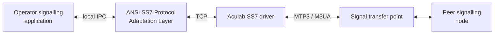
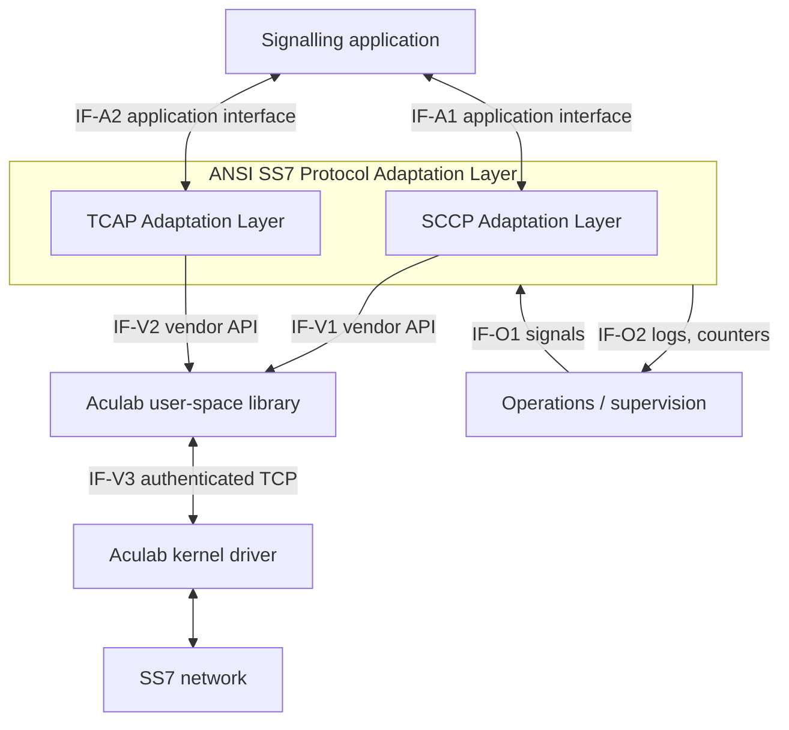
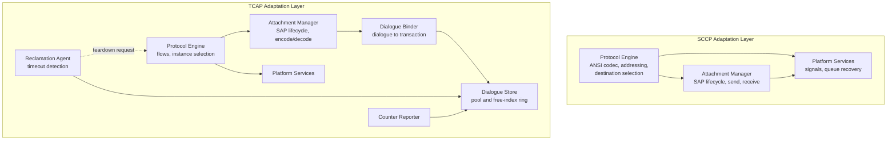
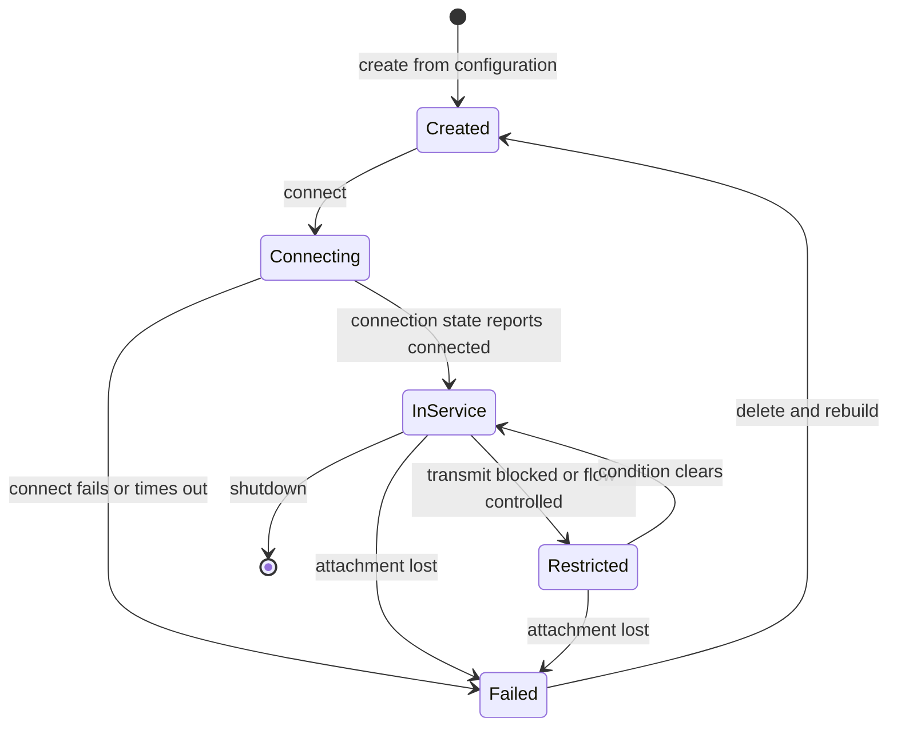
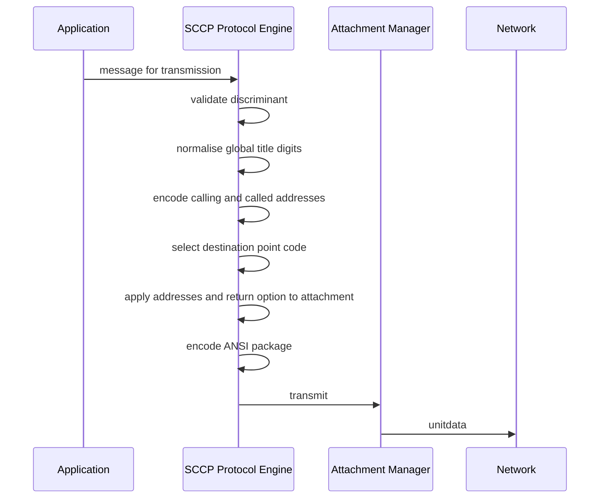
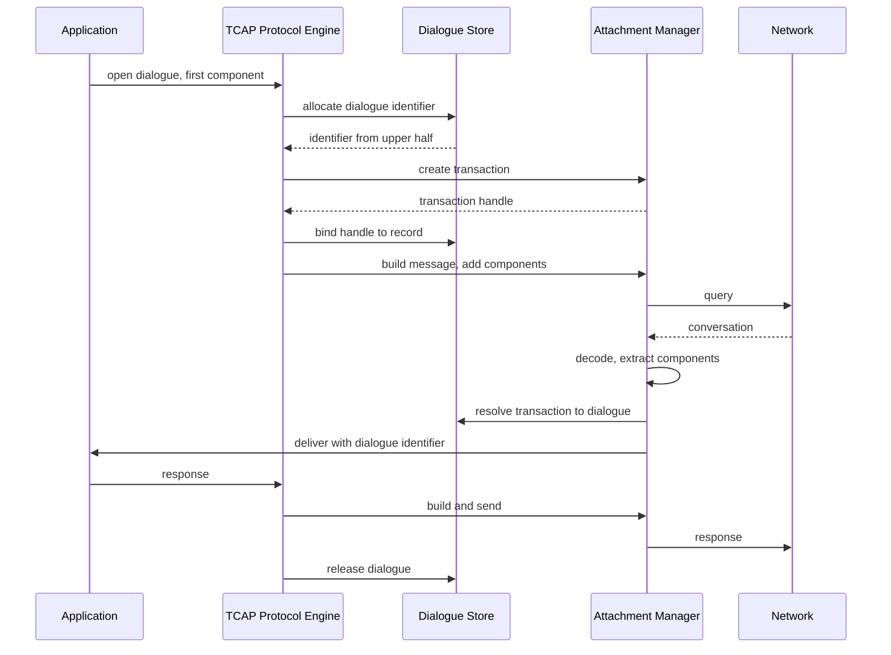
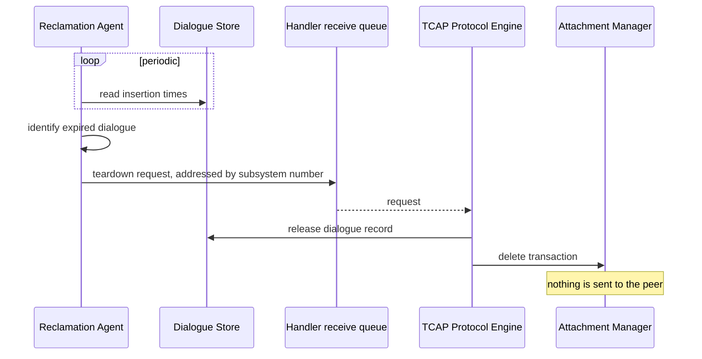
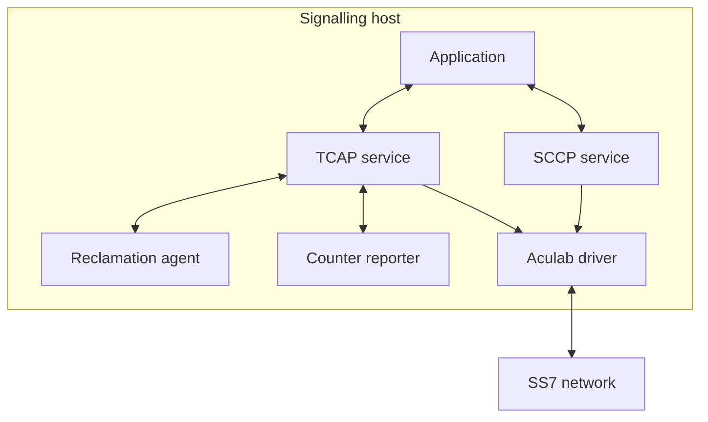
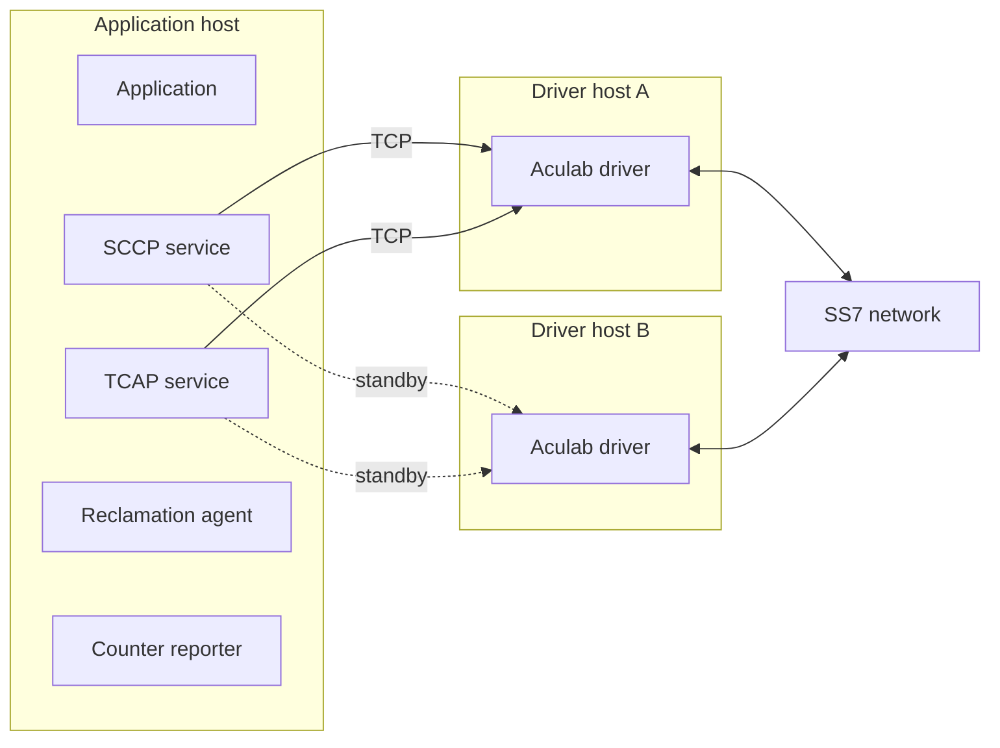

# High Level Design

## ANSI SS7 Protocol Adaptation Layer

---

## Document Control

| Field | Value |
| --- | --- |
| Document title | High Level Design — ANSI SS7 Protocol Adaptation Layer |
| Document identifier | TSS-SS7-ANSI-HLD |
| Product | Tayana ANSI SS7 Protocol Adaptation Layer |
| Product version | 3.0_RC2 |
| Document version | 1.0 |
| Status | Issued for review |
| Date | 31 July 2026 |
| Author | Sayak Singha |
| Reviewer | |
| Approver | |
| Classification | Internal — Tayana Software Solutions |

### Change history

| Version | Date | Author | Description |
| --- | --- | --- | --- |
| 1.0 | 31 Jul 2026 | Sayak Singha | First issue |

### Distribution

| Role | Purpose |
| --- | --- |
| Architecture review board | Approval |
| Application integration teams | Interface contract |
| Deployment and operations | Deployment and operational design |
| Product management | Requirements confirmation, capacity planning |

---

## Contents

| # | Chapter |
| --- | --- |
| 1 | Introduction |
| 2 | System Overview |
| 3 | Requirements |
| 4 | Assumptions, Dependencies and Constraints |
| 5 | Architecture |
| 6 | Component Design |
| 7 | Interface Design |
| 8 | Data Design |
| 9 | Behavioural Design |
| 10 | Error Handling and Fault Management |
| 11 | High Availability and Redundancy |
| 12 | Security Design |
| 13 | Performance and Capacity |
| 14 | Deployment Design |
| 15 | Operations |
| 16 | Upgrade and Migration |
| 17 | Verification Strategy |
| 18 | Standards Conformance |
| 19 | Risks and Mitigations |
| 20 | Open Issues |
| A | Glossary |
| B | Configuration Reference |
| C | Requirements Traceability Matrix |
| D | Site Data to be Supplied |

---

# 1. Introduction

## 1.1 Purpose

This document defines the high level design of the Tayana ANSI SS7 Protocol Adaptation
Layer. It specifies the architecture, interfaces, data design and operational design of the
product, and records the design decisions taken and the alternatives rejected.

It is the controlling design document for the product. Detailed algorithms, field-level
encoding tables and per-symbol vendor API usage are held in the Technical Design Annex
(`HLD-Annex.md`).

## 1.2 Scope

This document covers the software delivered from the `sccp/`, `tcap/` and `include/`
directories of the product repository:

| Subsystem | Delivered processes |
| --- | --- |
| SCCP Adaptation Layer | `SccpAnsiHandler` |
| TCAP Adaptation Layer | `TcapAnsiHandler`, `TcapAnsiHandler_DlgCleaner`, `TcapAnsiHandler_Traffic` |

The following are outside the scope of this design and are not specified here:

| Item | Owner |
| --- | --- |
| Aculab SS7 protocol stack | Aculab. Third-party product, consumed not delivered |
| MTP2, MTP3, M3UA, M2PA | Aculab stack |
| Global Title Translation | Network signal transfer points, or Aculab driver translation tables |
| Signalling link and point code provisioning | Deployment |
| Northbound application design | Application owner |
| Function-level and algorithm-level design | Low Level Design and Technical Design Annex |

## 1.3 Intended audience

| Reader | Sections of primary interest |
| --- | --- |
| Architecture review board | 2, 3, 5, 11, 12, 13, 19 |
| Application integrator | 3, 7, 8, 9 |
| Deployment engineer | 4, 14, 15, 16 |
| Operations engineer | 10, 11, 15, 19 |
| Test engineer | 3, 9, 17, Appendix C |

## 1.4 Definitions

Terms are defined in Appendix A. Three are used so heavily that they are stated here:

**Service Access Point (SAP)** — the Aculab attachment object through which a process sends,
receives and observes status. Abbreviated SSAP throughout.

**Dialogue** — the product's unit of transaction-oriented signalling, identified by a stable
numeric identifier presented to the application.

**Transaction** — the Aculab library's unit of transaction state, identified by an opaque
handle held only inside the handler process.

## 1.5 References

| Ref | Document |
| --- | --- |
| R1 | Aculab SS7 Developer's Guide |
| R2 | Aculab SS7 Installation and Administration Guide |
| R3 | Aculab Distributed SCCP API Guide, revision 6.17.0 |
| R4 | Aculab Distributed TCAP API Guide, revision 6.16.1 |
| R5 | Technical Design Annex, `HLD-Annex.md` |

## 1.6 Conventions

Requirements carry identifiers of the form `FR-nn` (functional) and `NFR-nn`
(non-functional). Design elements trace to them through the matrix in Appendix C.

Requirements in this document are **derived**. The product predates any written requirement
specification; the requirements in Chapter 3 were reconstructed from the implemented
behaviour and the deployed configuration. They describe what the product does. They require
confirmation by product management before they can be treated as what the product *should*
do. This is recorded as an open issue (Chapter 20).

Source references of the form `file.cc:line` appear only where a design statement is
surprising, contested, or contradicts existing documentation. Routine statements are not
cited; the evidence base is the Annex.

---

# 2. System Overview

## 2.1 Design drivers

An operator application that must exchange ANSI SS7 signalling faces a protocol stack rather
than a service. The Aculab stack terminates the signalling network competently, but what it
presents to an application is a C API with its own threading model, its own buffer ownership
rules, opaque transaction handles, and a connection to a kernel driver that fails
independently of the application.

Building each application against that API directly would mean every application team
re-implementing the same concerns: connection supervision, failover, buffer discipline,
transaction lifetime, and reclamation of state abandoned by a peer. Several of those are
easy to get subtly wrong, and the failure modes are silent.

The product exists to solve those concerns once, behind a message interface. An application
sends a structure on a queue and receives a structure on a queue. Everything about the stack
stays on the product's side of that boundary.

## 2.2 Capabilities

| Capability | Provided by |
| --- | --- |
| ANSI SCCP connectionless transport with application-controlled TCAP framing | SCCP Adaptation Layer |
| ANSI TCAP transaction and dialogue service | TCAP Adaptation Layer |
| Stack attachment supervision and re-establishment | Both |
| Destination and subsystem availability tracking | Both |
| Multiple originating point codes | TCAP Adaptation Layer |
| Reclamation of dialogues abandoned by a peer | TCAP Adaptation Layer |
| Operational logging, tracing and traffic counters | Both |

## 2.3 Position in the operator network



The product is not a network element in its own right. It is a local service that presents
the network to an application; the addressable network element is the point code configured
in the Aculab driver.

## 2.4 The two service paths

The product delivers two services that share a repository and share nothing else. They do not
communicate, do not share memory, queues or configuration, and may be deployed
independently.

| | SCCP Adaptation Layer | TCAP Adaptation Layer |
| --- | --- | --- |
| Abstraction offered | Connectionless message transfer | Dialogue with managed transaction state |
| TCAP encoding performed by | The product | The Aculab library |
| Transaction state held by | The application | The Aculab library |
| Maximum package size | Approximately 255 bytes | Governed by the stack |
| Transaction identifiers | Controlled by the application | Allocated by the product and the library |
| Suitable for | Applications needing wire-level control | General signalling applications |

The TCAP path is the appropriate choice for most applications. The SCCP path exists for
applications that require control the TCAP path deliberately withholds, and it is the
lower-level and less-protected of the two.

## 2.5 ANSI profile

The product implements ANSI behaviour as realised by the Aculab stack. It does not
independently implement an ANSI specification and no clause numbers are claimed. The
variant-specific properties that shape the design are:

| Property | Design consequence |
| --- | --- |
| Point codes are 24-bit | Destination point codes validated over 1 to 16777215 |
| No Nature of Address Indicator | Field absent from the address model |
| Transaction identifiers always four bytes | Decoder accepts element lengths of 4 and 8 only |
| Distinct package types for permission variants | Seven package types carried across the interface |
| Components distinguish last from not-last | Tracked by both encoder and decoder |
| Return Result carries no operation code | Applications correlate results by invoke identifier |
| Two tag values are reused across nesting levels | Decoding is position-dependent (8.4, Annex A1.4) |

---

# 3. Requirements

The requirements in this chapter are **derived from implemented behaviour**, for the reason
given in 1.6. Each is marked with its confidence:

- **Confirmed** — the requirement is evidenced by explicit validation, configuration or
  documentation, and its intent is unambiguous.
- **Inferred** — the behaviour is implemented consistently, but whether it is intended or
  incidental requires product management confirmation.

## 3.1 Functional requirements

### Service provision

| ID | Requirement | Confidence |
| --- | --- | --- |
| FR-01 | The product shall provide ANSI SCCP connectionless message transfer between a local application and the SS7 network. | Confirmed |
| FR-02 | The product shall provide ANSI TCAP transaction services, presenting the application with a dialogue abstraction. | Confirmed |
| FR-03 | The SCCP and TCAP services shall operate independently, such that failure or absence of one does not affect the other. | Confirmed |
| FR-04 | Each service instance shall serve exactly one subsystem number. | Confirmed |
| FR-05 | The product shall permit multiple service instances for different subsystem numbers to run concurrently on one host. | Confirmed |

### SCCP service

| ID | Requirement | Confidence |
| --- | --- | --- |
| FR-06 | The SCCP service shall encode and decode ANSI TCAP packages and components on behalf of the application. | Confirmed |
| FR-07 | The SCCP service shall translate SCCP addresses between the application's address-indicator representation and the stack's representation, in both directions. | Confirmed |
| FR-08 | The SCCP service shall select the destination point code from configuration, supporting a primary and an optional secondary destination. | Confirmed |
| FR-09 | Where two destinations are configured, the SCCP service shall distribute traffic between them and shall use either when the other is unavailable. | Inferred |
| FR-10 | The SCCP service shall discard messages for which no configured destination is available, and shall record the discard. | Confirmed |
| FR-11 | The SCCP service shall deliver network-originated delivery failure notifications to the application. | Confirmed |

### TCAP service

| ID | Requirement | Confidence |
| --- | --- | --- |
| FR-12 | The TCAP service shall allocate dialogue identifiers that remain stable for the life of the dialogue and are unique within the service instance. | Confirmed |
| FR-13 | The TCAP service shall maintain the binding between each dialogue identifier and its underlying stack transaction. | Confirmed |
| FR-14 | Dialogue identifiers allocated locally shall not collide with identifiers derived from a peer's transaction range. | Confirmed |
| FR-15 | The TCAP service shall support multiple originating point codes within one service instance, each with one or more stack attachments. | Confirmed |
| FR-16 | The TCAP service shall reclaim dialogues on which no activity has occurred within a configured period, without signalling to the peer. | Confirmed |
| FR-17 | The TCAP service shall optionally notify the application when a dialogue is reclaimed, under configuration control. | Confirmed |
| FR-18 | The TCAP service shall deliver stack-generated dialogue events — operation timeout, malformed component rejection, and abort information — to the application. | Confirmed |
| FR-19 | The TCAP service shall reject an attempt to open a dialogue whose identifier is already in use, and shall record the rejection. | Confirmed |
| FR-20 | The TCAP service shall validate a licence key at startup and shall not provide service without a valid key. | Confirmed |

### Stack attachment

| ID | Requirement | Confidence |
| --- | --- | --- |
| FR-21 | Each service shall establish and maintain attachment to the Aculab stack. | Confirmed |
| FR-22 | Each service shall detect loss of stack attachment and shall re-establish it without operator intervention. | Confirmed |
| FR-23 | Each service shall support attachment to a primary and a secondary driver host. | Confirmed |
| FR-24 | Each service shall track the availability of destination point codes and subsystems, and shall use that state in transmission decisions. | Confirmed |
| FR-25 | Each service shall suspend transmission on an attachment reported as blocked or flow-controlled, and shall resume when the condition clears. | Confirmed |

### Operational

| ID | Requirement | Confidence |
| --- | --- | --- |
| FR-26 | Each process shall prevent a second instance of itself from starting. | Confirmed |
| FR-27 | Each service shall emit operational logs with stable identifying codes. | Confirmed |
| FR-28 | Each service shall maintain traffic counters, enabled or disabled by configuration. | Confirmed |
| FR-29 | Each service shall support diagnostic tracing, enabled without restart. | Confirmed |
| FR-30 | Each service shall reload those configuration parameters that can be changed without re-establishing stack attachment, on operator signal. | Confirmed |
| FR-31 | The product shall retain dialogue state across a restart of the handler process. | Inferred |

## 3.2 Non-functional requirements

### Capacity

| ID | Requirement | Value | Confidence |
| --- | --- | --- | --- |
| NFR-01 | Maximum dialogues tracked per TCAP service instance | 500,000 | Confirmed |
| NFR-02 | Maximum concurrent locally-originated dialogues | Approximately half of NFR-01 | Confirmed |
| NFR-03 | Maximum originating point codes per TCAP service instance | 128 | Confirmed |
| NFR-04 | Maximum stack attachments per originating point code | 10 | Confirmed |
| NFR-05 | Maximum SCCP package size | Approximately 255 bytes | Confirmed |
| NFR-06 | Sustained and peak message rate | To be established | Open — D-1 |

### Performance

| ID | Requirement | Value | Confidence |
| --- | --- | --- | --- |
| NFR-07 | Receive latency shall not exceed the polling interval when traffic is sparse | 500 ms | Confirmed |
| NFR-08 | Receive latency under sustained load shall be governed by processing time, not by the polling interval | — | Confirmed |
| NFR-09 | Service start time | Approximately 2 s per stack attachment | Confirmed |
| NFR-10 | End-to-end latency budget | To be established | Open — D-3 |

### Availability and resilience

| ID | Requirement | Confidence |
| --- | --- | --- |
| NFR-11 | Loss of one driver host shall not interrupt service where a second is configured. | Confirmed |
| NFR-12 | Failure of one subsystem's service instance shall not affect other subsystems. | Confirmed |
| NFR-13 | Abnormal termination of a process holding the dialogue pool lock shall not render the pool permanently inaccessible. | Confirmed |
| NFR-14 | Loss of stack attachment shall not require operator intervention to recover. | Confirmed |

### Security

| ID | Requirement | Confidence |
| --- | --- | --- |
| NFR-15 | Attachment to the Aculab driver shall be authenticated. | Confirmed |
| NFR-16 | The application interface shall be accessible only to processes on the same host. | Confirmed |
| NFR-17 | Access to the application interface shall be restrictable to authorised local accounts. | Inferred — see 12.2 |

### Maintainability and portability

| ID | Requirement | Confidence |
| --- | --- | --- |
| NFR-18 | The application interface shall be defined by shared header files common to product and application. | Confirmed |
| NFR-19 | The product shall run on 64-bit Linux with System V IPC and POSIX threads. | Confirmed |
| NFR-20 | Operational faults shall be diagnosable from logs and counters without attaching a debugger. | Inferred |

---

# 4. Assumptions, Dependencies and Constraints

## 4.1 Assumptions

Statements taken as true by this design. If one proves false, the design is affected as
stated.

| ID | Assumption | If false |
| --- | --- | --- |
| A-01 | The northbound application executes on the same host as the service instances it uses. | The product cannot be used. The application interface is host-local by construction (5.5). |
| A-02 | The Aculab driver is installed, configured and running before the product starts. | Service instances start but never reach service state. |
| A-03 | The signalling network, or the Aculab driver, performs Global Title Translation. | Messages addressed by global title are undeliverable. The product performs no translation. |
| A-04 | Point codes and subsystems the product addresses are provisioned in the driver's concerned-destination configuration. | Availability is never reported for those destinations and all traffic to them is discarded (10.4). |
| A-05 | The application is compiled from the same headers, with the same compile-time options, as the service instances. | Both sides misinterpret every message (7.6). |
| A-06 | System V IPC identifiers allocated to the product do not collide with those of other software on the host. | Undefined behaviour, including cross-product message corruption. |
| A-07 | Host clock is monotonic and not adjusted backwards during operation. | Dialogue reclamation timing is affected (9.4). |
| A-08 | The application supplies global title digits in ASCII. | Digits are corrupted in transmission (7.3). |

## 4.2 External dependencies

| ID | Dependency | Nature |
| --- | --- | --- |
| D-01 | Aculab SS7 stack v4.0, SCCP API 6.17.0, TCAP API 6.16.1 | Runtime and build. The product links the vendor library and calls its API |
| D-02 | Aculab kernel driver and its `ss7maint` administration tool | Runtime |
| D-03 | Tayana platform framework libraries | Build and runtime. Configuration reading, logging, IPC, counters |
| D-04 | Linux kernel System V IPC subsystem | Runtime |
| D-05 | Process supervision | Operational. The product does not restart itself |
| D-06 | Licence key issuance for the TCAP service | Operational |

## 4.3 Constraints

Constraints are properties the design must respect and cannot negotiate.

| ID | Constraint | Origin |
| --- | --- | --- |
| C-01 | The application interface is System V message queues, which are host-local kernel objects. Application and service must be co-resident. | Platform convention (5.7) |
| C-02 | A stack attachment cannot be repaired. Recovery requires deleting and rebuilding it, invalidating all transaction state held against it. | Aculab API [R3, R4] |
| C-03 | Point code, subsystem number and transaction identifier range are fixed when an attachment is created and cannot be changed while it exists. | Aculab API [R3, R4] |
| C-04 | A received message occupies the vendor library's cyclic receive buffer until released. Delay in releasing it stalls reception for every attachment on that SAP. | Aculab API [R3, R4] |
| C-05 | An attachment must be explicitly unblocked after each received message is processed, or that attachment stops permanently. | Aculab API [R3, R4] |
| C-06 | The interface structures are exchanged by value with no version field and no serialisation. | Platform convention |
| C-07 | The SCCP service constructs TCAP encoding with 8-bit length arithmetic, bounding a package to approximately 255 bytes. | Implementation (8.4) |
| C-08 | Dialogue identifier space is divided in half between locally allocated and peer-derived identifiers. | Implementation (8.5) |

C-02 through C-05 are vendor constraints and are the origin of several design decisions in
5.7. C-04 and C-05 are absolute: they are honoured on every code path including every error
path, and any new path that receives a message inherits both obligations.
---

# 5. Architecture

## 5.1 Architectural principles

| Principle | Application in this design |
| --- | --- |
| Isolate faults at the subsystem boundary | One process per subsystem number, so a failed attachment or a hostile peer affects one subsystem only |
| Keep vendor state inside one owner | Only the handler process calls the vendor API. Companion processes request action, they do not act |
| Present stable identities | The application sees an identifier the product owns, never a vendor handle |
| Fail visibly, not silently | Every discard path increments a counter and emits a log code |
| Prefer explicit configuration to derivation | IPC identifiers, destinations and pool geometry are configured, not computed |

## 5.2 Context view



Interfaces are catalogued in 7.1.

## 5.3 Logical view



Seven logical components. The Dialogue Store is the only component shared between processes;
every other component executes wholly within one process.

## 5.4 Process view

| Process | Contains | Instances | Threads |
| --- | --- | --- | --- |
| `SccpAnsiHandler` | SCCP Protocol Engine, Attachment Manager, Platform Services | One per subsystem number | 2 |
| `TcapAnsiHandler` | TCAP Protocol Engine, Attachment Manager, Dialogue Binder, Dialogue Store owner | One per subsystem number | 2 per stack attachment |
| `TcapAnsiHandler_DlgCleaner` | Reclamation Agent | One per subsystem number | 1 |
| `TcapAnsiHandler_Traffic` | Counter Reporter | One per subsystem number | 1 |

Threads are created detached and are not joined. Each stack attachment is served by a
dedicated receive thread and a dedicated transmit thread, so thread count scales with the
number of configured attachments rather than with load.

Thread creation is deliberately serialised, one second apart, because the parameter block
passed to each new thread is reused by the creating loop for the next attachment
(`tcap/src/TcapAculabHandlerMain.cc:183`). The delay allows each thread to copy its
attachment index before it is overwritten. It is load-bearing and must not be removed as an
optimisation; the cost is start time, at approximately two seconds per attachment (NFR-09).

## 5.5 Deployment view

The application interface is System V message queues — kernel objects with host scope. This
fixes one relationship absolutely: **the application and the service instances it uses must
be processes on the same host** (C-01, A-01).

The vendor library reaches the driver over TCP, so the driver may be local or remote. Two
topologies follow, specified in Chapter 14.

## 5.6 Data view

Three classes of state:

| State | Held in | Lifetime | Shared |
| --- | --- | --- | --- |
| Interface messages | Message queues | Until consumed | Between application and handler |
| Dialogue records | Shared memory | Until released or reclaimed | Between handler, reclamation agent, counter reporter |
| Attachment and availability state | Handler process memory | Process lifetime | Not shared |

The product holds no persistent state. Nothing is written to disk except logs and traces.
Dialogue records survive a handler restart because shared memory outlives the process, but
the vendor transaction handles they contain do not (8.5).

## 5.7 Design decisions

Each decision records what was chosen, why, what was rejected, and what it costs. Decisions
are referenced by name elsewhere in this document.

### One process per subsystem number

*Chosen because* a stack attachment failure, or a peer misbehaving toward one subsystem,
must not affect unrelated subsystems. Each subsystem also needs independent configuration
and independent lifecycle.

*Rejected:* a single process multiplexing all subsystems. One attachment failure would have
degraded every subsystem, and configuration reload for one would have risked all.

*Cost:* more processes to supervise; IPC identifiers must be allocated per subsystem and
kept unique host-wide (A-06).

*Satisfies:* FR-04, FR-05, NFR-12.

### System V message queues for the application interface

*Chosen because* they are kernel-buffered, require no connection management, and match the
interface every other Tayana handler already presents — an application integrating several
Tayana protocol handlers sees one interface style.

*Rejected:* UNIX domain sockets and a shared-memory ring buffer. Both add connection or
synchronisation machinery for no benefit within a host boundary. TCP was rejected for the
same reason plus the cost of framing.

*Cost:* co-residency becomes mandatory (C-01). Queue identifiers must be managed and cleaned
up manually (15.4). Default queue permissions expose signalling traffic to any local account
(12.2).

*Satisfies:* FR-01, FR-02, NFR-16.

### Dialogue records in shared memory rather than process-private memory

*Chosen because* reclamation requires a full scan of dialogue state, which must not run on
the handler's traffic path, and counter reporting requires occupancy. Both are therefore
separate processes and need visibility of the same records.

*Rejected:* an in-handler timer wheel with private state. It would have placed a scan of up
to 500,000 records on a thread carrying traffic.

*Cost:* cross-process locking (8.6). Vendor handles stored in shared memory are meaningful
only to the owning process and only until it restarts.

*Satisfies:* FR-16, FR-31, NFR-13.

### Product-owned encoding in the SCCP service, vendor encoding in the TCAP service

*Chosen because* the SCCP service by design exposes raw connectionless transport with no
TCAP attachment involved. With no TCAP SAP there is no vendor encoder available to it, so it
must construct ANSI TCAP itself. The TCAP service has an encoder and uses it.

*Rejected:* routing all TCAP framing through a TCAP attachment. That would have made the two
services the same service and removed the wire-level control the SCCP service exists to
provide.

*Cost:* ANSI encoding knowledge exists in two places, only one of which is maintained by
Tayana. The product-owned encoder carries the size limit in C-07 and the decoding constraint
in 8.4.

*Satisfies:* FR-06.

### Vendor transaction handles stored in the dialogue record

*Chosen because* it gives direct resolution from dialogue to transaction with no second
index and no search.

*Rejected:* storing an opaque key and re-resolving through the vendor API on each use.
Correct but slower on every message.

*Cost:* the handle is a pointer in the owning process's address space. Companion processes
may read other fields of the same record but must never dereference this one, and it is
meaningless after a restart. This is a discipline the design relies on rather than enforces.

*Satisfies:* FR-13.

### Global Title Translation delegated to the network and the driver

*Chosen because* translation is operator routing policy held in signal transfer points, not
application logic. Duplicating it in the product would create a second source of truth.

*Rejected:* local translation tables.

*Cost:* the deployment must guarantee translation capability (A-03). The product cannot
diagnose a translation failure beyond reporting the cause the network returned.

*Satisfies:* FR-07.

### Polling the vendor API rather than using its event interface

*Chosen because* it yields one blocking call per receive thread and a thread model that can
be reasoned about without a dispatcher.

*Rejected:* the event-driven interface with a single dispatcher thread. Fewer threads, but a
dispatcher becomes a single point of failure and a serialisation point.

*Cost:* the polling interval sets the receive latency floor when traffic is sparse (NFR-07).
Thread count scales with configured attachments (5.4).

*Satisfies:* FR-21, NFR-07, NFR-08.

### Reclamation in a separate process

*Chosen because* it keeps a full-pool scan off the traffic path, and keeps all vendor
manipulation inside one owner: the reclamation agent detects expiry and requests teardown,
the handler performs it.

*Rejected:* a per-dialogue vendor timer. Would have created 500,000 timers at maximum
configuration.

*Cost:* an additional process to deploy and supervise, and a message contract between the
two that must be kept in step.

*Satisfies:* FR-16.

### Static linking of product libraries

*Chosen because* it yields one self-contained file per process and no runtime library path
management.

*Rejected:* shared objects.

*Cost:* a change to a shared header requires every process to be rebuilt, and the rebuild
must be complete. A partial rebuild produces the interface mismatch described in 7.6.

*Satisfies:* NFR-18.

---

# 6. Component Design

## 6.1 SCCP Protocol Engine

**Responsibility.** Translate between the application interface and the vendor attachment for
connectionless traffic. Owns ANSI encoding and decoding, address translation and destination
selection.

| Aspect | Detail |
| --- | --- |
| Provides | Application interface IF-A1 |
| Requires | SCCP Attachment Manager, Platform Services |
| Concurrency | Transmit thread reads the application queue; receive thread is driven by the Attachment Manager |
| State | Destination availability, current destination selection, configuration |
| Satisfies | FR-06, FR-07, FR-08, FR-09, FR-10, FR-11 |

Destination selection is the behaviour most likely to surprise an integrator and is specified
in 9.2.

## 6.2 SCCP Attachment Manager

**Responsibility.** Own the lifetime of the vendor attachment: create it from configuration,
connect it, observe its state, rebuild it after failure. Perform send and receive.

| Aspect | Detail |
| --- | --- |
| Provides | Send, receive, attachment state, availability queries |
| Requires | Vendor SCCP API (IF-V1) |
| Concurrency | Receive thread polls with a bounded timeout |
| State | Attachment handle, connection state per driver host |
| Satisfies | FR-21, FR-22, FR-23, FR-24, FR-25 |

Enforces C-04 and C-05 on every path.

## 6.3 TCAP Protocol Engine

**Responsibility.** Translate between the application interface and the vendor attachment for
transaction traffic. Select the attachment instance for each outbound message, apply
transmit gating, and assemble inbound messages for delivery.

| Aspect | Detail |
| --- | --- |
| Provides | Application interface IF-A2 |
| Requires | TCAP Attachment Manager, Dialogue Binder, Platform Services |
| Concurrency | One transmit and one receive thread per attachment instance |
| State | Per-instance transmit permission, configuration |
| Satisfies | FR-15, FR-18, FR-19, FR-25 |

## 6.4 TCAP Attachment Manager

**Responsibility.** As 6.2, plus encoding and decoding delegated to the vendor library, and
extraction of components from decoded messages.

| Aspect | Detail |
| --- | --- |
| Provides | Send, receive, encode, decode, component extraction, attachment state |
| Requires | Vendor TCAP API (IF-V2) |
| State | Attachment handles, one per configured instance |
| Satisfies | FR-02, FR-21, FR-22, FR-23, FR-24 |

## 6.5 Dialogue Binder

**Responsibility.** Maintain the correspondence between product dialogue identifiers and
vendor transaction handles, in both directions.

| Aspect | Detail |
| --- | --- |
| Provides | Bind, resolve, unbind |
| Requires | Dialogue Store |
| State | None of its own; operates on Dialogue Store records |
| Satisfies | FR-13 |

## 6.6 Dialogue Store

**Responsibility.** Allocate, hold and release dialogue records. Guarantee identifier
uniqueness and non-collision with peer-derived identifiers. Serialise concurrent access.

| Aspect | Detail |
| --- | --- |
| Provides | Allocate, release, update, read, occupancy |
| Requires | System V shared memory and semaphore |
| Concurrency | Accessed by three processes; mutating operations serialised |
| State | Record pool, free-index ring, occupancy count |
| Satisfies | FR-12, FR-14, FR-31, NFR-01, NFR-02, NFR-13 |

Specified in 8.5 and 8.6.

## 6.7 Reclamation Agent

**Responsibility.** Detect dialogues on which no activity has occurred within the configured
period and request their teardown.

| Aspect | Detail |
| --- | --- |
| Provides | Nothing; acts autonomously |
| Requires | Dialogue Store (read), handler application queue (write) |
| Concurrency | Single thread, periodic |
| Satisfies | FR-16, FR-17 |

Does not call the vendor API. Specified in 9.4.

## 6.8 Counter Reporter and Platform Services

The Counter Reporter publishes traffic and occupancy counters. Platform Services provides
signal handling, configuration reading, queue recovery and log emission to all processes.

| Satisfies | FR-26, FR-27, FR-28, FR-29, FR-30 |

---

# 7. Interface Design

## 7.1 Interface catalogue

| ID | Interface | Between | Mechanism |
| --- | --- | --- | --- |
| IF-A1 | SCCP application interface | Application ↔ `SccpAnsiHandler` | System V message queues |
| IF-A2 | TCAP application interface | Application ↔ `TcapAnsiHandler` | System V message queues |
| IF-I1 | Reclamation interface | Reclamation Agent → `TcapAnsiHandler` | Application receive queue |
| IF-I2 | Dialogue store interface | Handler ↔ Agent ↔ Reporter | Shared memory and semaphore |
| IF-V1 | Vendor SCCP API | `SccpAnsiHandler` → library | C function calls |
| IF-V2 | Vendor TCAP API | `TcapAnsiHandler` → library | C function calls |
| IF-V3 | Library to driver | Library ↔ driver | Authenticated TCP, port 8256 |
| IF-O1 | Operational control | Operator → all processes | Signals |
| IF-O2 | Operational reporting | All processes → operations | Log files, trace, counters |

The vendor API register — every symbol called, with error handling — is Annex A9.

## 7.2 IF-A1 — SCCP application interface

Three queues per service instance:

| Queue | Direction | Purpose |
| --- | --- | --- |
| Handler receive | Application → handler | Messages for transmission |
| Decoder receive | Handler → application | Received messages and notifications |
| Heartbeat | Supervision → handler | Liveness |

**Message.** `_SccpInfo`, a discriminated union. The discriminant is the message type field;
only the unitdata arm is processed.

| Field group | Contents |
| --- | --- |
| Message type | Union discriminant |
| Protocol class and handling | Protocol class in the low nibble; return-on-error in bit 7 |
| Called party address | Point code, subsystem number, address indicator, global title digits |
| Calling party address | As above |
| Transaction information | Package type, originating and destination transaction identifiers |
| Dialogue information | Dialogue portion, carried verbatim and not interpreted |
| Component information | Component type, invoke and linked identifiers, operation or error code, parameters |

**Obligations on the application:**

| # | Obligation | Consequence of breach |
| --- | --- | --- |
| 1 | Set the message type before populating the union | Handler reads the wrong arm |
| 2 | Supply global title digits in ASCII (A-08) | Digits corrupted; see 7.3 |
| 3 | Do not rely on the supplied destination point code | Overridden by configuration; see 9.2 |
| 4 | Correlate Return Results by invoke identifier | No operation code is present on ANSI results |
| 5 | Build against the same headers and options as the handler (A-05) | Total misinterpretation; see 7.6 |

## 7.3 Address representation

The two sides of the vendor boundary express address content differently. The application
uses an SCCP address indicator byte; the vendor uses a validity bitmask. The Protocol Engine
converts in both directions; the bit mapping is Annex A2.2.

Global title digits are ASCII in the application and packed BCD on the wire. Decoding always
unpacks. Encoding converts only when the first digit byte appears to be ASCII, tested as
greater than `0x30` (`sccp/src/SccpAculabHandler.cc:439-456`). An application that supplies
packed BCD whose first byte exceeds that value will have its digits converted a second time
and will transmit an incorrect address. This is the reason for assumption A-08 and
obligation 2 above.

## 7.4 IF-A2 — TCAP application interface

Three queues per service instance, as 7.2. The message type field of the queue message
carries the subsystem number, which is how the reclamation agent addresses a specific
handler (IF-I1).

**Message.** `AnsiTcapMsg`.

| Field group | Contents |
| --- | --- |
| Subsystem number | Also the queue message type |
| Dialogue identifier | Stable product-owned identity |
| Application correlation value | Passed through unchanged |
| Transaction identifiers and length | Four bytes for ANSI |
| Originating and destination address | Point code, subsystem number, global title |
| Dialogue type | Package type |
| Component information | Type, invoke and linked identifiers, operation or error code, parameters |

**Obligations on the application:**

| # | Obligation | Consequence of breach |
| --- | --- | --- |
| 1 | Set the queue message type to the subsystem number | Handler never receives the message |
| 2 | Open a dialogue before continuing it | Message discarded, counted, logged |
| 3 | Do not reuse a dialogue identifier before the previous dialogue ends | Rejected as duplicate (FR-19) |
| 4 | Accept stack-generated events on quiescent dialogues | Missed timeouts and rejections; see 7.5 |
| 5 | Correlate Return Results by invoke identifier | No operation code on ANSI results |
| 6 | Do not assume notification of reclamation | Configurable and disabled by default; see 9.4 |
| 7 | Build against the same headers and options as the handler (A-05) | Total misinterpretation; see 7.6 |

## 7.5 Stack-generated dialogue events

Three events reach the application as components although no peer sent them:

| Event | Meaning |
| --- | --- |
| Operation timeout | An outstanding operation exceeded its timer |
| Local reject | A malformed component was received and rejected locally |
| Abort information | Abort content presented in component form |

An application must handle these on a dialogue where it has no outstanding activity. This is
FR-18.

## 7.6 Interface versioning and compatibility

The interface structures are exchanged by value. They carry no version field and no
serialisation (C-06). Compatibility is therefore **by construction**: both sides must be
compiled from the same headers with the same options.

Two compile-time options change structure layout. Both must match across the application and
every process it communicates with:

| Option | Effect |
| --- | --- |
| Timestamp option | Appends a timestamp field |
| Routing-metadata option | Appends a routing-metadata block |

The routing-metadata option is enabled for the TCAP build and not for the SCCP build
(`tcap/Makefile:6`, `:11`). An application using both services must therefore be built
consistently with each, and cannot assume the two structures share a layout convention.

This option does not make the product interoperate with any message broker. No broker client
exists in the product. The option exposes a metadata block that a separate, out-of-tree
process may populate and read; it is a passthrough contract only.

**Mismatch is not detected.** There is no handshake and no length check. The failure
presentation is corrupted field values, not an error. Any change to a shared header requires
a complete rebuild of every process and every application that uses them, deployed together.

---

# 8. Data Design

## 8.1 Data holdings

| Holding | Medium | Scope | Survives process restart |
| --- | --- | --- | --- |
| Interface messages | System V message queue | Host | Yes |
| Dialogue records | System V shared memory | Host | Yes, but see 8.5 |
| Free-index ring | System V shared memory | Host | Yes |
| Attachment state | Process memory | Process | No |
| Destination availability | Process memory | Process | No |
| Configuration | Read at startup and on reload | Process | No |

The product has no database, no file-based persistence and no cache. Logs and traces are the
only files written.

## 8.2 Dialogue record

One record per dialogue identifier. Fields relevant to the design:

| Field | Written by | Read by | Notes |
| --- | --- | --- | --- |
| Dialogue identifier | Dialogue Store | All | Set at allocation |
| Subsystem number | Handler | Agent, Reporter | Selects reclamation timeout and addresses the teardown request |
| Insertion time | Dialogue Store | Agent | Basis of reclamation |
| Vendor transaction handle | Handler | Handler only | Process-local pointer. Must not be dereferenced by other processes |
| Application correlation value | Handler | Handler | Passed through |
| Address information | Handler | Handler | |

The handle field is the reason the record is not portable across processes or restarts. This
is stated as a cost of the corresponding design decision in 5.7 and as a risk in Chapter 19.

## 8.3 Interface message structures

`_SccpInfo` and `AnsiTcapMsg` are specified in 7.2 and 7.4. Their sizes differ between builds
according to the options in 7.6, which is why the compatibility rule is by construction
rather than by negotiation.

The header also defines an ITU-variant structure of different size. The two are distinct
structures for distinct products and are not interchangeable.

## 8.4 ANSI encoding in the SCCP service

The SCCP service constructs and parses ANSI TCAP itself, for the reason in 5.7. Two
properties of that encoder and decoder are design-significant.

**Position-dependent decoding.** Two tag values carry two meanings each:

| Value | At package level | At component level |
| --- | --- | --- |
| `0xE8` | Unidirectional package | Component portion |
| `0xE1` | Query without Permission | Invoke, not last |

Nothing in the encoded byte distinguishes them. The decoder resolves the ambiguity by
position: a tag read as the first byte of the package is a package tag; a tag read after the
transaction identifier element is a component-level tag.

This is a standing constraint on the decoder. Any change that alters the order in which
elements are examined, or introduces lookahead across the transaction identifier boundary,
can silently reinterpret one package type as another. Position sensitivity must be
preserved. The full tag set is Annex A1.

**Size limit.** Element lengths are patched after content is written, using 8-bit
arithmetic, bounding a package to approximately 255 bytes (C-07, NFR-05). The service does
not segment and does not use extended connectionless formats. A deployment whose packages
approach that size must use the TCAP service.

## 8.5 Dialogue identifier space

The identifier space is divided in half (C-08). The upper half is allocated locally; the
lower half is reserved for identifiers derived from a peer's transaction range. This is what
guarantees FR-14.

Allocation adds a fixed offset so every locally allocated identifier lands in the upper half
(`tcap/src/TcapAculabDlgMgr.cc:300-303`). From the configured pool size and a configured
shift index:

```
boundary    = pool size / 2 + shift index
allocatable = pool size / 2 − shift index
```

**A configured pool of N yields approximately N/2 locally originated dialogues** (NFR-02).
This is the most consequential sizing property in the design and the most common
dimensioning error. Chapter 13 gives the dimensioning model.

Release is asymmetric and correctly so: an identifier from the upper half is returned to the
free ring, while one from the lower half is cleared but not returned, because it was never
drawn from the ring.

## 8.6 Concurrency control

A binary semaphore serialises mutating access to the Dialogue Store. It is taken with the
undo option, so a process that terminates abnormally while holding it has its operation
reversed by the kernel. This satisfies NFR-13: a handler crash cannot leave the pool
permanently locked against the reclamation agent.

| Operation | Serialised |
| --- | --- |
| Allocate, release, update | Yes |
| Read insertion time, subsystem number, occupancy | No |

The unsynchronised reads are deliberate. They read scalar fields where a torn read yields a
stale value rather than an invalid one, and the reader acts on the value only through a
subsequent serialised operation. The reclamation agent is the principal such reader: it reads
a timestamp without the lock, and the teardown it consequently requests is performed by the
handler under the lock.

Integrity violations — releasing a free record, or referencing an identifier outside the pool
— are logged and ignored rather than allowed to corrupt the ring. Any such log is evidence of
a defect upstream and is specified as an alarm condition in 15.3.
---

# 9. Behavioural Design

This chapter specifies the scenarios that define the product's externally observable
behaviour. Each states its trigger, the sequence, and the outcome including failure outcomes.

| # | Scenario | Service |
| --- | --- | --- |
| 9.1 | Attachment establishment | Both |
| 9.2 | Connectionless message transmission | SCCP |
| 9.3 | Transaction dialogue, normal course | TCAP |
| 9.4 | Dialogue abandoned by peer | TCAP |
| 9.5 | Loss and recovery of stack attachment | Both |
| 9.6 | Destination unavailable | SCCP |
| 9.7 | Dialogue capacity exhausted | TCAP |
| 9.8 | Configuration reload | Both |

## 9.1 Attachment establishment

**Trigger.** Service start, or recovery per 9.5.



The attachment is created from its configuration file, which fixes its point code, subsystem
number and — for TCAP — transaction identifier range (C-03). It is then connected, which is
asynchronous; completion arrives as a connection state event.

**Outcome, success.** The attachment reaches in-service state, worker threads are started,
and the service begins carrying traffic.

**Outcome, failure.** Creation failure is fatal to the service instance and is logged as
such. The most common causes are a point code mismatch between the attachment configuration
and the driver configuration — which the product checks explicitly and reports with both
values — and driver unavailability.

There is no repair path. Recovery from any later failure is by deletion and rebuild (C-02),
which is why 9.5 is a distinct scenario rather than a retry.

## 9.2 Connectionless message transmission

**Trigger.** Application writes to the SCCP handler receive queue.



**Destination selection.** This step is the behaviour most likely to surprise an integrator
and is specified precisely.

The application supplies a called party address. The Protocol Engine encodes it — global
title, subsystem number and address indicator are all taken from the application. The
**destination point code is then overwritten from configuration**
(`sccp/src/SccpAculabHandler.cc:483-552`). Selection depends on how many destinations are
configured:

| Configuration | Behaviour |
| --- | --- |
| Primary only | Transmit to the primary if the network reports it available; otherwise discard |
| Primary and secondary | Alternate between them on successive messages; if the selected one is unavailable use the other; discard only if both are unavailable |

Alternation is a simple toggle held in the process, so with both destinations healthy traffic
divides approximately evenly.

The consequence for an integrator is that **an application cannot direct a message to an
arbitrary point code through the SCCP service.** The application's global title governs
onward translation; the point code is the product's to choose. This realises FR-08 and FR-09.

**Outcome, failure.** Every discard path increments a counter and emits a log code. Because
the SCCP service has no dedicated transmit-drop counter, discards are computed as the
difference between messages accepted from the application and messages transmitted; the log
code identifies the cause. Causes are address encoding failure, no available destination
(9.6), and transmission failure reported by the vendor library.

## 9.3 Transaction dialogue, normal course

**Trigger.** Application opens a dialogue, or a peer query arrives.



An inbound dialogue differs in origin only: the vendor library creates the transaction when
it decodes an inbound query, and the Protocol Engine allocates a record for it at that point.
The identifier then comes from the lower half of the space (8.5).

**Addresses are fixed when the message is initialised, not when it is sent.** The product
clears the vendor's configured address defaults and applies the application's values, so what
appears on the wire is what the application supplied rather than a residue of configuration.
Two configuration flags govern this behaviour and are specified in Appendix B.

**Outcome, failure.** The transmission path is defensive at every step — transaction
creation, message allocation, message initialisation, component addition, binding, and the
send itself. Each failure increments a dedicated transmit-drop counter and emits a distinct
log code. Unlike the SCCP service, TCAP transmit loss is therefore directly reported rather
than inferred (10.6).

Two rejections are protocol rather than resource conditions: a query on a dialogue that
already holds a transaction (FR-19), and a non-query package on a dialogue with no
transaction. Both indicate an application defect.

## 9.4 Dialogue abandoned by peer

**Trigger.** No activity on a dialogue for the configured period.

This scenario is the reason the Reclamation Agent exists (5.7). A peer that stops responding
would otherwise hold a dialogue record and a vendor transaction indefinitely, and the pool
would leak until exhausted.



The agent selects one of two configured timeouts according to the record's subsystem number,
and bounds its own CPU cost by yielding periodically during the scan. It never calls the
vendor API; teardown is performed by the handler, preserving the single-owner principle
(5.1).

**Notification is optional and disabled by default.** Under configuration control the handler
either informs the application that the dialogue ended, or removes it silently (FR-17). An
application that keeps its own per-dialogue state and runs with notification disabled will
accumulate orphaned state, because it is never told. This is recorded as a risk (Chapter 19)
and as an interface obligation (7.4, obligation 6).

## 9.5 Loss and recovery of stack attachment

**Trigger.** Connection state event reporting loss, or health evaluation failure.

Because an attachment cannot be repaired (C-02), recovery is destructive:

1. The failure is detected, by connection state event or by periodic health evaluation.
2. The attachment is deleted.
3. A new attachment is created from configuration and connected (9.1).
4. Worker threads for the attachment are started.

**All transaction state held against the old attachment is invalid.** Dialogue records survive
in shared memory because shared memory outlives the process, but the vendor handles they
contain refer to a deleted attachment. Dialogues in progress at the moment of failure do not
survive; the application sees them stop.

Recovery is automatic and requires no operator action (NFR-14). Where a secondary driver host
is configured, the vendor library fails over internally and the product observes only a
connection state event; this is specified in 11.2.

Worker threads are detached and are not joined (5.4). Repeated recovery cycles therefore
accumulate threads over the process lifetime. This is recorded as a risk in Chapter 19.

## 9.6 Destination unavailable

**Trigger.** Transmission attempt when no configured destination is reported available.

Availability is determined by the network, not by configuration. Each service subscribes to
signalling point and subsystem status and maintains current state per destination.

**A destination that has never been reported available is treated as unavailable.** The
practical consequence is important: if a destination point code and subsystem is absent from
the driver's concerned-destination configuration (A-04), no status is ever reported for it,
every message to it is discarded, and the only symptom is the discard log. This is a
configuration fault in the driver that presents as a product fault, and it is specified as a
diagnostic entry in 15.4.

**Outcome.** The message is discarded, counted, and logged with the status of each configured
destination.

## 9.7 Dialogue capacity exhausted

**Trigger.** Allocation request when the allocatable half of the pool is fully occupied.

The allocation fails, the outbound request is discarded and counted, and a distinct log code
is emitted. The service continues; inbound dialogues, which draw from the other half of the
space, are unaffected.

Because the allocatable capacity is approximately half the configured pool (8.5), this
condition is most often a dimensioning error rather than a genuine capacity limit. The
dimensioning model is in 13.2 and the condition is an alarm in 15.3.

## 9.8 Configuration reload

**Trigger.** Operator signal.

Parameters divide into two classes:

| Class | Examples | Reload behaviour |
| --- | --- | --- |
| Runtime-changeable | Counter enable, trace detail, display verbosity | Applied on reload |
| Fixed at attachment creation | Point code, subsystem number, transaction identifier range, addresses | Not applied. Requires restart (C-03) |

A reload that appears to leave addressing unchanged has not failed; it is behaving as
specified. Changing addressing requires a service restart, and this is stated in the
operational procedures (15.5).

---

# 10. Error Handling and Fault Management

## 10.1 Principles

| Principle | Realisation |
| --- | --- |
| No silent discard | Every discard path increments a counter and emits a log code |
| Distinguish fault classes | Configuration, attachment, protocol, resource and integrity faults are handled differently |
| Degrade rather than stop | A fault affecting one destination, attachment or dialogue does not stop the service |
| Fail fast on unrecoverable conditions | Configuration and licence faults prevent start rather than producing a partly functional service |
| Preserve vendor invariants on every path | Buffer release and unblock occur on error paths as on success paths (C-04, C-05) |

## 10.2 Fault taxonomy

| Class | Detection | Response | Service impact |
| --- | --- | --- | --- |
| Configuration | Startup validation | Log and exit | Service does not start |
| Licensing | Startup validation | Log and exit | TCAP service does not start |
| Duplicate instance | Startup lock | Log and exit | Second instance does not start |
| Attachment | Connection state event, health evaluation | Rebuild (9.5) | Interruption until recovered |
| Destination availability | Network status | Discard affected traffic (9.6) | Partial, by destination |
| Flow control | Connection state event | Suspend transmission on that attachment | Partial, by attachment |
| Protocol | Decode failure, invalid sequence | Discard, count, log; abort where the vendor requires | Single message or dialogue |
| Resource | Allocation failure | Discard, count, log (9.7) | Outbound dialogues only |
| Integrity | Store consistency checks | Log and ignore the operation | None immediately; indicates a defect |
| Interface mismatch | Not detected | — | Total. See 10.5 |

## 10.3 Configuration faults

Every product configuration parameter except the optional secondary SCCP destination is
mandatory. A missing or out-of-range value prevents start.

**Diagnosis is impaired by a defect in the error messages.** Several report a file name that
is not the file actually read — a configuration failure for the dialogue pool size reports
`kernel.cfg` although the value is read from the TCAP service configuration file
(`tcap/src/TcapAculabHandler.cc:581`), and the SCCP service does the same. The file actually
read is specified in Appendix B, and that table rather than the message text should be used
when diagnosing. This is recorded as a risk in Chapter 19.

## 10.4 Attachment and network faults

Attachment loss is recovered automatically (9.5). Destination unavailability is not a fault
in the product and is not recovered by it; the product reports it and discards affected
traffic until the network reports the destination available again.

The distinction matters operationally: attachment faults are the product's or the driver's,
destination faults are the network's, and they are separated by log code so that monitoring
can route them to different owners (15.3).

## 10.5 Interface mismatch

An application built against different headers or different compile-time options than the
service is the one fault class the product cannot detect (7.6). There is no version field, no
length check and no handshake (C-06).

The presentation is corrupted field values rather than an error, which makes it expensive to
diagnose and easy to misattribute to the network or the peer. The control is procedural: a
change to a shared header requires a complete, coordinated rebuild and deployment. This is
specified in 16.2 and recorded as a risk in Chapter 19.

## 10.6 Loss accounting

The two services differ in how loss is reported, and monitoring must account for it.

| Service | Transmit loss | Receive loss |
| --- | --- | --- |
| SCCP | Inferred: accepted from application minus transmitted | Inferred: received from network minus delivered to application |
| TCAP | Reported directly by a transmit-drop counter | Reported directly by a receive-drop counter |

For the TCAP service the identities *accepted − transmitted = transmit drops* and *received −
delivered = receive drops* should hold exactly. **A discrepancy means messages are being lost
on a path that has no counter**, which is a defect worth raising rather than an operational
condition.

For the SCCP service no such cross-check exists; the difference is the loss, and the log code
supplies the cause.

One further accounting property: network delivery-failure notifications increment the same
receive counter as ordinary traffic. A rise in received messages without a matching rise in
messages delivered to the application may therefore be inbound delivery failures rather than
a delivery fault in the product.

---

# 11. High Availability and Redundancy

## 11.1 Availability model

The product has no clustering, no active-standby pairing and no state replication between
hosts. Availability is provided at three levels, each independent.

| Level | Mechanism | Protects against |
| --- | --- | --- |
| Attachment | Automatic rebuild (9.5) | Transient loss of driver connectivity |
| Driver host | Vendor library failover between two configured hosts | Loss of a driver host |
| Subsystem | One process per subsystem (5.7) | Fault propagation between subsystems |

Loss of the host on which the application and services run is not protected against by this
product. Host-level redundancy, if required, is an application-architecture concern outside
this scope.

## 11.2 Driver host redundancy

The vendor library accepts a primary and a secondary driver host, connects to both, and uses
the primary while it is usable. Failover is performed inside the library. The product
observes only a connection state event and continues.

This satisfies NFR-11 **only where a secondary host is configured**. The deployment inspected
during preparation of this document configures a primary host only, so driver host loss is
not currently survivable without operator action. Completing the configuration is a
single-parameter change and is recorded as a risk in Chapter 19.

## 11.3 State and recovery

| State | Survives attachment rebuild | Survives process restart | Survives host restart |
| --- | --- | --- | --- |
| Dialogue records | Yes | Yes | No |
| Vendor transaction handles | No | No | No |
| Dialogues in progress | No | No | No |
| Destination availability | No, re-learned | No, re-learned | No |
| Queued interface messages | Yes | Yes | No |

Dialogue records outliving the handles they contain is the central recovery property to
understand. After a restart the records are present and the identifiers are consistent, but
the transactions they referenced no longer exist. Dialogues in progress at the moment of
failure are lost from the network's point of view; the application must recover them at its
own level.

The vendor library provides a transaction restoration facility intended to address this. It
is **present in the code but not exercised in the delivered configuration**, and the
corresponding flag must remain disabled. Enabling it causes transmit threads to wait
indefinitely for a restoration that never completes, which stops transmission with no
operator-visible release. This is specified in Appendix B and recorded as a risk in
Chapter 19.

## 11.4 Reclamation as an availability mechanism

Automatic reclamation of abandoned dialogues (9.4) is an availability mechanism as much as a
resource one. Without it, a peer that fails while holding dialogues would progressively
consume the allocatable pool until outbound service ceased. The configured timeout therefore
bounds the exposure to peer failure, and its value should be chosen with that in mind rather
than only against protocol expectations — a long timeout leaves capacity tied up for longer
after a peer failure (13.2).

---

# 12. Security Design

## 12.1 Security model

The product's security posture rests on two boundaries:

| Boundary | Control |
| --- | --- |
| Product to Aculab driver | Password authentication over TCP (NFR-15) |
| Application to product | Host locality and filesystem-style permissions on IPC objects (NFR-16) |

The product performs no authentication or authorisation of its own, holds no user
credentials, and makes no access-control decision about the traffic it carries. It is an
infrastructure component operating inside a trusted host boundary.

## 12.2 Application interface exposure

The application interface is System V message queues. These are host-scoped kernel objects,
which satisfies NFR-16: no remote process can reach them.

**They are created with permissions allowing access by any local account.** Any process on the
host can therefore read signalling traffic from, and inject signalling traffic into, the
interface queues. Within a dedicated signalling host with controlled local access this is
consistent with the deployment model. Where the host runs other workloads or permits
interactive login by users who should not see subscriber signalling, it is not.

NFR-17 is marked inferred for this reason: the capability to restrict access exists at the
platform level, but the product does not currently exercise it. Tightening it is a
deployment control, and it is recorded as a risk in Chapter 19.

## 12.3 Credential handling

Driver authentication passwords are held in plain text in the vendor configuration files
read by the library. The product does not read, log or transmit them. Protection of those
files is a deployment responsibility:

| Control | Requirement |
| --- | --- |
| File permissions | Readable only by the account running the services |
| Configuration management | Passwords must not be committed to shared repositories in clear |
| Rotation | Requires coordinated change of the driver configuration and a service restart |

The licence key for the TCAP service is likewise held in configuration in clear. It is a
licensing control, not a security control, and it protects revenue rather than traffic.

## 12.4 Data in transit and at rest

Signalling content is not encrypted by the product in either direction. Between product and
driver, confidentiality depends on the security of the network segment carrying the TCP
connection; where the driver is on a separate host (14.3) that segment must be treated as
carrying subscriber-affecting data and secured accordingly.

The product persists no signalling content. Logs and traces, however, can contain addresses,
global titles and component content according to the configured verbosity. **Trace output at
high verbosity records subscriber-identifying data**, and log retention and access must be
governed on that basis. Verbosity settings are in Appendix B.

## 12.5 Denial of service considerations

| Exposure | Effect | Mitigation |
| --- | --- | --- |
| Local process writing to the interface queue | Injected or malformed traffic | Host access control (12.2) |
| Peer holding dialogues open | Pool exhaustion (9.7) | Reclamation (9.4, 11.4) |
| Peer sending malformed packages | Decode failures | Discarded and counted; vendor aborts the transaction |
| Queue filled faster than it is drained | Interface backpressure | Kernel queue limits; sizing in 14.5 |

---

# 13. Performance and Capacity

## 13.1 Ceilings

Product ceilings:

| Quantity | Limit | Requirement |
| --- | --- | --- |
| Dialogue records per TCAP service instance | 500,000 | NFR-01 |
| Locally originated dialogues | Approximately half the configured pool | NFR-02 |
| Originating point codes per TCAP service instance | 128 | NFR-03 |
| Attachments per originating point code | 10 | NFR-04 |
| SCCP package size | Approximately 255 bytes | NFR-05 |
| Destination point code value | 1 to 16777215 | — |

Vendor stack ceilings [R3, R4]:

| Quantity | Limit |
| --- | --- |
| SCCP connections per system | 4094 |
| SCCP connections per attachment | 3840 |
| Transactions per TCAP attachment | 983,040 |
| Operations per transaction | 256 |
| Driver transmit queue per attachment | 140 messages, not configurable |

For substantially all deployments the dialogue pool, not the stack, is the binding
constraint.

## 13.2 Dimensioning the dialogue pool

The pool is the principal sizing decision. It is governed by 8.5.

**Inputs.** Peak concurrent locally originated dialogues, *D*. Peak concurrent inbound
dialogues, *I*. Reclamation timeout, *T*. Peak outbound dialogue establishment rate, *R*.

**Outbound capacity required.** A dialogue occupies a record from establishment until release
or reclamation. Where a peer may fail, the worst case holds records for the full reclamation
timeout:

```
D_effective = max(D, R × T)
```

The second term is the one that is missed. With a reclamation timeout of one hour and an
establishment rate of 50 per second, a peer failure ties up 180,000 records regardless of how
few dialogues are concurrently active in normal operation. **A long reclamation timeout and a
small pool are incompatible.**

**Pool size.**

```
pool size ≥ 2 × (D_effective + shift index)
```

The factor of two is the half-split. Sizing at *D_effective* rather than twice it is the
common error and presents as capacity exhaustion (9.7) at approximately half the expected
load.

**Worked example.** Taking the configuration inspected during preparation of this document —
pool 500,000, shift index 2,000:

| Quantity | Value |
| --- | --- |
| Configured pool | 500,000 |
| Boundary between halves | 252,000 |
| Allocatable for outbound dialogues | 248,000 |

With the reclamation timeout also at its configured maximum, that capacity supports an
outbound establishment rate of approximately 50 per second against total peer failure. If the
required rate is materially higher, either the pool must grow — and 500,000 is the ceiling —
or the reclamation timeout must be reduced.

## 13.3 Latency

| Contribution | Value |
| --- | --- |
| Receive latency floor, sparse traffic | 500 ms (NFR-07) |
| Receive latency, sustained load | Processing time; the floor does not apply (NFR-08) |
| Transmit latency | Processing time |
| Service start | Approximately 2 s per attachment (NFR-09) |

The polling floor is a consequence of the polling design decision (5.7). It affects isolated
messages only: the poll returns immediately when a message is waiting, so under any
continuous traffic the floor is not observed. An application whose traffic is genuinely
sparse and which requires sub-500 ms response must account for it, and this should be
confirmed against the latency budget (NFR-10, D-3).

## 13.4 Scalability

| Dimension | Mechanism | Limit |
| --- | --- | --- |
| Subsystems | Additional service instances | Host resources, IPC identifier space |
| Point codes | Configured originating point codes | 128 per TCAP service instance |
| Throughput per point code | Additional attachments | 10 per point code |
| Dialogues | Pool size | 500,000 per service instance, half allocatable |

Scaling is by configuration and by additional processes, within one host. There is no
mechanism for distributing one subsystem's load across hosts, because the application
interface is host-local (C-01).

## 13.5 Throughput

Sustained and peak message rates have not been measured. No figure is stated in this document
and NFR-06 is open. The ceilings in 13.1 and the dimensioning model in 13.2 are the limits
that can be established from the design; a measured throughput figure requires
characterisation against representative traffic and is recorded in Appendix D.
---

# 14. Deployment Design

## 14.1 Governing rule

The application interface is System V message queues, which are host-scoped kernel objects
(C-01). **The application and the service instances it uses must be processes on the same
host.** No configuration alters this and there is no remote mode.

The vendor library reaches the driver over TCP, so the driver may be local or remote. This is
the only degree of freedom in the topology.

## 14.2 Topology A — consolidated



Simplest to deploy and to diagnose; no network dependency between product and driver. The
host is a single point of failure for both the application and signalling connectivity.

Appropriate where the signalling host is dedicated and host-level redundancy is provided by
the application architecture.

## 14.3 Topology B — separated driver



The application group remains co-resident; signalling connectivity survives loss of a driver
host (11.2). The connection between the application host and the driver hosts carries
subscriber-affecting data and must be secured accordingly (12.4).

Appropriate where signalling connectivity must survive host loss, and where several
application hosts share a signalling front end.

## 14.4 Host prerequisites

| Requirement | Detail |
| --- | --- |
| Operating system | 64-bit Linux (NFR-19) |
| Kernel facilities | System V message queues, shared memory, semaphores; POSIX threads |
| Vendor software | Aculab SS7 stack v4.0, library and driver (D-01, D-02) |
| Environment | Product base path and configuration path exported to every process, with identical values |
| Network | TCP reachability to the driver, topology B only |
| Supervision | External process supervision (D-05) |

## 14.5 Resource dimensioning

Per subsystem number served:

| Resource | SCCP service | TCAP service |
| --- | --- | --- |
| Processes | 1 | 3 |
| Message queues | 3 | 3 |
| Shared memory segments | 0 | 2 |
| Semaphores | 0 | 1 |
| Threads | 2 | 2 per attachment |

Kernel parameters requiring attention:

| Parameter | Governed by |
| --- | --- |
| Maximum message size | Interface structure size, which depends on compile-time options (7.6) |
| Maximum queue size | Message size and the depth needed to absorb bursts |
| Maximum shared memory segment | Dialogue pool size — the largest object the product creates |
| Total shared memory | Sum across all service instances on the host |

Exact values follow from the configured pool size and the options in use, and are recorded in
Appendix D.

**IPC identifiers are configured, not derived.** Every identifier must be unique across all
System V objects on the host, including those of unrelated software (A-06). The product
contains no allocation scheme; the deployment owns it, and a collision produces undefined
behaviour rather than a startup error.

## 14.6 Deployment sequence

1. Install and configure the Aculab driver; start it and confirm the signalling links are in
   service.
2. Install the product binaries and configuration.
3. Verify configuration consistency (15.2).
4. Start the TCAP service and reclamation agent in either order; the first to start creates
   the shared memory and semaphore and the other attaches.
5. Start the SCCP service.
6. Confirm each service reaches in-service state.
7. Start the application.

---

# 15. Operations

## 15.1 Operational interfaces

| Interface | Mechanism |
| --- | --- |
| Control | Signals: configuration reload, trace toggle, termination |
| Reporting | Log files with stable codes; trace files; traffic counters |
| Vendor diagnostics | Driver administration tool, independent of the product |

## 15.2 Configuration governance

Configuration is layered, and **which file a process reads is not evident from its name**.
This is specified in full in Appendix B. It is a frequent source of
misconfiguration.

Three properties must be understood by anyone operating the product:

**Product settings are read from the service's own configuration file**, not from the
platform-wide kernel configuration file. The platform file is read by the counter reporter
only.

**The platform configuration file contains a stale duplicate set of TCAP and SCCP settings**
in the deployment inspected during preparation of this document, including a dialogue pool
size differing from the effective one. Those values have no effect. They should be removed;
until they are, they will mislead. This is recorded as a risk in Chapter 19.

**Consistency across processes is not enforced.** The handler and the reclamation agent must
read the same configuration file and therefore agree on the pool geometry and IPC
identifiers. Nothing checks this. A divergence presents as dialogues never being reclaimed,
or as the agent operating on a different pool from the handler.

Cross-file consistency requirements:

| Requirement | Files |
| --- | --- |
| Local point code identical | Vendor attachment configuration and driver configuration |
| Authentication password identical | Vendor attachment configuration and driver configuration |
| Pool geometry and IPC identifiers identical | TCAP service file, as read by handler and agent |
| Every addressed destination present as a concerned destination | Driver configuration (A-04) |

## 15.3 Monitoring and alarms

| Condition | Severity | Meaning | Action |
| --- | --- | --- | --- |
| Attachment creation failure | Critical | Service cannot provide service | Check point code match and driver state |
| Attachment not in service | Critical | No signalling connectivity | 15.4 |
| Destination unavailable, discards rising | Major | Network or driver configuration fault | Check concerned-destination configuration and network state |
| Dialogue capacity exhausted | Major | Dimensioning or peer failure | 13.2 |
| Store integrity violation | Major | Software defect | Raise; do not filter |
| Transmit threads awaiting restoration | Critical | Transmission stopped | Confirm restoration flag disabled (11.3) |
| Loss-accounting identity violated | Major | Uncounted message loss | Raise as defect (10.6) |
| Semaphore operation failure | Major | Store inaccessible | Check IPC object state |
| Licence validation failure | Critical | Service will not start | Licence provisioning |
| Delivery-failure notification rate rising | Minor | Addressing or destination problem | Check addressing and peer state |

Log codes are stable and are the intended alarm keys; the catalogue is Annex A6. A small
number of codes are high-frequency and carry no diagnostic value individually; these are
identified in the Annex and must be excluded from alarm rules.

Counters and their derived indicators are Annex A7. Counter reporting is disabled by
configuration in some deployments — **a counter reading zero means either no traffic or
counters disabled**, and the flag must be confirmed before a zero is interpreted.

## 15.4 Diagnostic procedures

| Symptom | Probable cause | Resolution |
| --- | --- | --- |
| Service exits at start, configuration error logged | Missing or out-of-range parameter | Edit the file identified in Appendix B, not the one named in the message (10.3) |
| Service exits at start, duplicate instance | An instance is already running | Confirm before starting another |
| Attachment never reaches service | Point code mismatch, driver down, or password mismatch | Compare vendor attachment configuration against driver configuration |
| All outbound traffic discarded, destination unavailable | Destination absent from concerned-destination configuration | Add it to the driver configuration (A-04) |
| Outbound TCAP discarded, no attachment available | No attachment in service | As attachment diagnosis above |
| No transmission, threads awaiting restoration | Restoration flag enabled | Disable it; restart (11.3) |
| Capacity exhausted under expected load | Pool sized at required dialogues rather than twice | Re-dimension per 13.2 |
| Application misinterprets all fields | Interface mismatch | Rebuild application and services together (7.6) |
| Dialogues disappear without notification | Reclamation notification disabled | Enable notification, or add an application-level timer (9.4) |
| Configuration change has no effect | Wrong file edited, or parameter fixed at attachment creation | Appendix B; 9.8 |
| Counters zero | Counter reporting disabled | Check the enable flag |
| Thread count growing | Repeated attachment recovery | Threads are not joined (9.5); investigate the recovery cause |

## 15.5 Routine procedures

**Changing addressing.** Requires restart, not reload (9.8, C-03).

**Changing IPC identifiers or pool size.** Stop every process using the object; remove the
existing IPC object; edit configuration; restart. Omitting the removal leaves processes
attached to an object with the previous geometry, because shutdown does not remove IPC
objects (15.6).

**Adding driver host redundancy.** Add the secondary host, port and password to the vendor
attachment configuration and restart the service (11.2).

**Enabling counter reporting.** Reload; no restart required.

## 15.6 Shutdown semantics

A service deletes its attachments and exits. **IPC objects are not removed.** This is
deliberate: it allows a service to restart and find its dialogue records intact (11.3).

The consequence is that IPC objects persist after the processes are gone, and any change to
an IPC identifier or to pool geometry leaves an orphaned object holding host resources.
Removal is an explicit operational step and must be performed only when every process using
the object is stopped.

---

# 16. Upgrade and Migration

## 16.1 Compatibility model

| Change | Compatibility |
| --- | --- |
| Product binary rebuild, no header change | Services may be restarted independently |
| Shared interface header change | Application and all services must be rebuilt and deployed together (16.2) |
| Compile-time option change | As above |
| Vendor library version change | Requires review against the API register, Annex A9 |
| Driver version change | Vendor compatibility statement required |
| Configuration change | Per 9.8 and 15.5 |

## 16.2 Interface-affecting upgrades

Because the interface is compatibility-by-construction (7.6, C-06), an interface-affecting
upgrade is not a rolling upgrade. The procedure is:

1. Rebuild the application and every service process from the same source tree with identical
   compile-time options.
2. Stop the application.
3. Stop all service processes for the affected subsystems.
4. Remove IPC objects if the interface structure size has changed, since queued messages of
   the previous layout would be misinterpreted.
5. Deploy all binaries.
6. Restart in the order of 14.6.

**A partial deployment is worse than an outage**, because it produces silent corruption rather
than a failure (10.5). There is no version negotiation that would allow mixed versions to
detect one another.

## 16.3 Vendor stack upgrades

The vendor API register (Annex A9) is the impact checklist. It lists every vendor symbol
called, with its error handling. An upgrade review should compare it against the vendor
release notes for signature changes, semantic changes and deprecations.

One documentation discrepancy is recorded so it is not mistaken for a defect: the shipped
headers and the published API guide differ in the name of the attachment connect function.
The header is authoritative for the delivered kit; the guide is behind. This is detailed in
Annex A9.4.

## 16.4 Rollback

Rollback is redeployment of the previous binaries by the procedure in 16.2. There is no
persistent state to migrate or revert; dialogue records do not survive the removal of IPC
objects, and dialogues in progress do not survive any service restart (11.3).

---

# 17. Verification Strategy

## 17.1 Scope of verification

ANSI protocol conformance is verified by the vendor for the stack (18.1). What requires
verification for this product is the **correctness of the mapping** between the application
interface and the vendor API, and the behaviour of the product's own mechanisms: dialogue
identity, reclamation, destination selection, attachment recovery and configuration handling.

## 17.2 Verification methods

| Method | Applied to |
| --- | --- |
| Inspection | Design conformance, interface definitions, configuration ranges |
| Unit and component test | Encoding and decoding, address translation, store operations |
| Integration test | End-to-end scenarios of Chapter 9 against a peer or simulator |
| Fault injection | Attachment loss, destination unavailability, capacity exhaustion, peer abandonment |
| Load and endurance test | Capacity ceilings (13.1), dimensioning model (13.2), thread accumulation (9.5) |
| Operational rehearsal | Startup, reload, shutdown, IPC cleanup, upgrade (16.2) |

## 17.3 Requirement coverage

Every requirement in Chapter 3 must have at least one verification method. Appendix C carries
the traceability matrix from requirement to design section; the test specification extends it
to test cases.

Requirements needing particular attention because they are easy to leave untested:

| Requirement | Why it is missed | Method |
| --- | --- | --- |
| FR-14 identifier non-collision | Requires a peer using an overlapping range | Integration test with configured overlap |
| FR-16 reclamation | Requires waiting out the timeout | Fault injection with reduced timeout |
| FR-17 reclamation notification | Disabled by default | Test both flag states |
| FR-22 attachment recovery | Requires induced failure | Fault injection |
| FR-31 state across restart | Requires restart mid-dialogue | Operational rehearsal |
| NFR-02 allocatable capacity | Fails at half the expected point | Load test to exhaustion, confirming the half-split |
| NFR-13 lock release on abnormal exit | Requires killing a process holding the lock | Fault injection |

## 17.4 Acceptance criteria

Acceptance requires:

- Every confirmed requirement in Chapter 3 verified.
- Every inferred requirement either confirmed by product management and verified, or
  withdrawn (Chapter 20).
- The scenarios of Chapter 9 demonstrated including failure outcomes.
- Capacity demonstrated against the dimensioning model of 13.2, specifically the half-split.
- Throughput characterised, closing NFR-06 and NFR-10.
- Operational procedures of 15.5 and 16.2 rehearsed.

---

# 18. Standards Conformance

## 18.1 Basis of conformance

The product implements **ANSI behaviour as realised by the Aculab SS7 stack v4.0**. It does
not independently implement an ANSI specification, and this document claims no ANSI clause
numbers. Where behaviour is described as required by ANSI, the authority is the vendor
documentation [R1–R4].

Protocol conformance testing of the ANSI stack is the vendor's. The product's verification
scope is 17.1.

## 18.2 ANSI behaviours relied upon

| Behaviour | Where the design depends on it |
| --- | --- |
| Transaction identifiers are always four bytes | Decoder accepts lengths of 4 and 8 only |
| Point codes are 24-bit | Destination validation range (13.1) |
| No Nature of Address Indicator | Address model (7.3) |
| Return Result carries no operation code | Interface obligations (7.2, 7.4) |
| Component parameters begin with defined tags | Vendor wraps non-conforming parameters |
| Invoke identifier may be omitted | Legal in ANSI only |
| Package tag values reused across nesting levels | Position-dependent decoding (8.4) |

## 18.3 Vendor dependency

Delivered kit: Aculab SS7 v4.0; SCCP API revision 6.17.0; TCAP API revision 6.16.1.

Whether this pairing is the vendor-supported combination requires confirmation and is
recorded in Appendix D.

Facilities deliberately not used, recorded so that their absence is understood as a decision:
connection-oriented SCCP, the vendor thread pool, the standalone encoder, and the vendor
maintenance and monitoring APIs. Full detail is in Annex A9.3.

---

# 19. Risks and Mitigations

Risks are assessed against the product as designed and as currently deployed. Likelihood and
impact are qualitative.

| ID | Risk | Likelihood | Impact | Mitigation | Owner |
| --- | --- | --- | --- | --- | --- |
| RSK-01 | Single driver host configured, so driver host loss stops signalling (11.2) | Medium | High | Configure the secondary driver host; single-parameter change plus restart | Deployment |
| RSK-02 | Dialogue pool sized at required dialogues rather than twice, giving half the expected capacity (8.5, 13.2) | High | High | Dimension per 13.2; verify by load test to exhaustion (17.3) | Deployment, Test |
| RSK-03 | Interface mismatch between application and services is undetectable and presents as data corruption (7.6, 10.5) | Medium | High | Coordinated rebuild and deployment procedure (16.2); build-time control of compile options | Development, Release |
| RSK-04 | Stale duplicate settings in the platform configuration file mislead operators (15.2) | High | Medium | Remove the stale entries; Appendix B is authoritative | Deployment |
| RSK-05 | Configuration error messages name the wrong file, extending diagnosis time (10.3) | High | Low | Correct the message text; until then use Appendix B | Development |
| RSK-06 | Reclamation notification disabled, so applications keeping dialogue state accumulate orphans (9.4) | Medium | Medium | Enable notification, or require an application-level timer | Deployment, Application |
| RSK-07 | Worker threads accumulate across repeated attachment recovery (9.5) | Low | Medium | Monitor thread count; restart on threshold; address in a future release | Operations, Development |
| RSK-08 | Interface queues readable and writable by any local account (12.2) | Medium | High | Restrict host access; tighten IPC permissions | Deployment, Security |
| RSK-09 | Restoration flag enabled in error stops transmission with no visible release (11.3) | Low | High | Keep disabled; alarm on the corresponding log code (15.3) | Deployment, Operations |
| RSK-10 | Vendor transaction handles in shared memory dereferenced by a companion process or after restart (8.2) | Low | High | Design discipline; confirm at code review of any change to companion processes | Development |
| RSK-11 | Long reclamation timeout combined with peer failure exhausts capacity (11.4, 13.2) | Medium | High | Choose timeout against the dimensioning model, not only protocol expectation | Deployment |
| RSK-12 | Throughput uncharacterised, so capacity cannot be confirmed against requirement (13.5) | High | Medium | Characterise under representative load; close NFR-06 | Test, Product |
| RSK-13 | IPC identifier collision with unrelated software produces undefined behaviour rather than an error (14.5) | Low | High | Host-wide identifier registry maintained by deployment | Deployment |

---

# 20. Open Issues

| ID | Issue | Resolution required from | Blocks |
| --- | --- | --- | --- |
| OI-01 | Requirements in Chapter 3 are derived, not specified. Those marked inferred require confirmation or withdrawal | Product management | Acceptance (17.4) |
| OI-02 | Throughput and latency requirements NFR-06 and NFR-10 are unstated | Product management | Capacity confirmation, RSK-12 |
| OI-03 | Deployment topology not selected between 14.2 and 14.3 | Deployment | Appendix D, RSK-01 |
| OI-04 | Vendor library version pairing not confirmed as supported (18.3) | Vendor management | Upgrade planning |
| OI-05 | Site data in Appendix D incomplete | Deployment, Operations | Deployment readiness |
| OI-06 | Whether NFR-17 is a requirement or an aspiration; the product does not currently restrict interface access (12.2) | Security, Product management | RSK-08 |

---

# Appendix A — Glossary

| Term | Definition |
| --- | --- |
| ANSI | American National Standards Institute; the North American SS7 variant |
| BCD | Binary Coded Decimal |
| BER | Basic Encoding Rules |
| Dialogue | The product's unit of transaction-oriented signalling, identified by a product-owned identifier |
| Global Title | An address that is not a point code, requiring translation to be routed |
| GTT | Global Title Translation |
| IPC | Inter-Process Communication |
| ITU | International Telecommunication Union; the other SS7 variant |
| M2PA, M3UA | Protocols carrying SS7 over IP |
| MTP2, MTP3 | Message Transfer Part, levels 2 and 3 |
| Package | A TCAP protocol data unit |
| Point code | The SS7 network address of a signalling node |
| SCCP | Signalling Connection Control Part |
| Service Access Point (SAP) | The vendor attachment object; abbreviated SSAP |
| Subsystem number | Identifies an application within a signalling node |
| STP | Signal Transfer Point |
| TCAP | Transaction Capabilities Application Part |
| Transaction | The vendor library's unit of transaction state |
| Unitdata | The SCCP connectionless message |

---

# Appendix B — Configuration Reference

## B.1 Which file is read by which process

This table is authoritative. Error messages naming a different file are in error (10.3,
RSK-05).

| File | Read by | Governs |
| --- | --- | --- |
| SCCP service configuration | SCCP service | All SCCP product settings: IPC identifiers, destinations, counter and display flags |
| TCAP service configuration | TCAP service, reclamation agent | All TCAP product settings: IPC identifiers, pool geometry, timeouts, feature flags, licence, point codes |
| SCCP attachment configuration, per subsystem | Vendor library | Addresses, driver hosts and passwords, buffers, vendor trace |
| TCAP attachment configuration, per point code and subsystem | Vendor library | As above, plus transaction identifier range |
| Platform configuration | Counter reporter only | Counter reporting |
| Driver configuration | Aculab driver | Point code, variant, links, listeners, passwords, concerned destinations |

The platform configuration file is **not** read by either service. Settings duplicated there
have no effect (15.2, RSK-04).

## B.2 SCCP service parameters

| Parameter | Range | Mandatory | Effect of absence |
| --- | --- | --- | --- |
| Handler receive queue identifier | IPC identifier | Yes | Service does not start |
| Application delivery queue identifier | IPC identifier | Yes | Service does not start |
| Heartbeat queue identifier | IPC identifier | Yes | Service does not start |
| Counter enable | 0 or 1 | Yes | Service does not start |
| Message display verbosity | Display range | Yes | Service does not start |
| Primary destination point code | 1 to 16777215 | Yes | Service does not start |
| Secondary destination point code | 1 to 16777215 | No | Treated as unset; single-destination behaviour (9.2) |

The secondary destination is the only optional parameter. The permitted range is
the full 24-bit point code space; comments in some distributed sample files state a narrower
range and are incorrect.

## B.3 TCAP service parameters

| Parameter | Range | Notes |
| --- | --- | --- |
| Handler receive queue identifier | IPC identifier | |
| Application delivery queue identifier | IPC identifier | |
| Heartbeat queue identifier | IPC identifier | |
| Dialogue store semaphore identifier | IPC identifier | Must match between service and agent |
| Dialogue record segment identifier | IPC identifier | Must match between service and agent |
| Free-index ring segment identifier | IPC identifier | Must match between service and agent |
| Dialogue pool size | 1 to 500,000 | Half is allocatable (8.5). Dimension per 13.2 |
| Identifier shift index | Integer | Adjusts the half-split boundary |
| Reclamation timeout | 1 to 5000 s | See 11.4 and 13.2 before increasing |
| Reclamation timeout, own subsystem | 1 to 8000 s | Applied to the agent's own subsystem |
| Restoration flag | 0 or 1 | **Must be 0** (11.3, RSK-09) |
| Counter enable | 0 or 1 | |
| Message display verbosity | Display range | High verbosity records subscriber data (12.4) |
| Suppress local address on receive | 0 or 1 | |
| Set local address explicitly | 0 or 1 | Address handling on transmission (9.3) |
| Relay application global title | 0 or 1 | Address handling on transmission (9.3) |
| Notify application on reclamation | 0 or 1 | Disabled by default (9.4, RSK-06) |
| Licence key | String | Validated at start (FR-20) |
| Number of originating point codes | 0 to 128 | 0 selects single point code from attachment configuration |
| Originating point code definition | Point code and attachment count | Indices contiguous from zero; up to 10 attachments each |

## B.4 Vendor attachment parameters

Read by the vendor library, not by the product. The parameters the design depends on:

| Parameter | Requirement |
| --- | --- |
| Local point code | Must match the driver configuration; verified at start (9.1) |
| Local subsystem number | Fixed at attachment creation (C-03) |
| Primary driver host, port, password | Password must match driver configuration |
| Secondary driver host, port, password | Required for driver redundancy (11.2, RSK-01) |
| Transaction identifier range | Fixed at attachment creation; must not overlap between attachments (13.4) |
| Inbound service enable | Required for inbound traffic |
| Nature of address indicator | Must remain unset for ANSI (2.5) |

## B.5 Environment

| Variable | Purpose |
| --- | --- |
| Product base path | Root for configuration resolution |
| Product configuration path | Configuration sub-path |
| Trace enable, per process | Diagnostic tracing |

The two path variables have no defaults and must be exported identically to every process
(A-06, 15.2).

---

# Appendix C — Requirements Traceability Matrix

| Requirement | Design section | Verification method (17.2) |
| --- | --- | --- |
| FR-01 | 2.4, 6.1, 7.2 | Integration |
| FR-02 | 2.4, 6.3, 6.4, 7.4 | Integration |
| FR-03 | 2.4, 5.4 | Inspection, integration |
| FR-04 | 5.4, 5.7 | Inspection |
| FR-05 | 5.4, 14.5 | Integration |
| FR-06 | 5.7, 8.4 | Unit, integration |
| FR-07 | 7.3, 5.7 | Unit |
| FR-08 | 9.2 | Integration |
| FR-09 | 9.2 | Integration, fault injection |
| FR-10 | 9.2, 9.6, 10.6 | Fault injection |
| FR-11 | 7.2, 10.6 | Integration |
| FR-12 | 6.6, 8.5 | Unit, load |
| FR-13 | 6.5, 8.2, 5.7 | Unit |
| FR-14 | 8.5 | Integration with overlapping range |
| FR-15 | 6.3, 13.4 | Integration |
| FR-16 | 6.7, 9.4, 11.4 | Fault injection |
| FR-17 | 9.4 | Fault injection, both flag states |
| FR-18 | 7.5 | Integration |
| FR-19 | 9.3 | Integration |
| FR-20 | 10.2 | Inspection |
| FR-21 | 6.2, 6.4, 9.1 | Integration |
| FR-22 | 9.5, 11.1 | Fault injection |
| FR-23 | 11.2 | Fault injection |
| FR-24 | 9.6 | Integration |
| FR-25 | 6.3, 10.2 | Fault injection |
| FR-26 | 10.2 | Operational rehearsal |
| FR-27 | 15.3 | Inspection |
| FR-28 | 15.3, 10.6 | Inspection, integration |
| FR-29 | 15.1 | Operational rehearsal |
| FR-30 | 9.8, 15.5 | Operational rehearsal |
| FR-31 | 8.1, 11.3 | Operational rehearsal |
| NFR-01 | 13.1 | Load |
| NFR-02 | 8.5, 13.2 | Load to exhaustion |
| NFR-03 | 13.1, 13.4 | Inspection |
| NFR-04 | 13.1, 13.4 | Inspection |
| NFR-05 | 8.4 | Unit |
| NFR-06 | 13.5 | Load — open, OI-02 |
| NFR-07 | 13.3 | Load |
| NFR-08 | 13.3 | Load |
| NFR-09 | 5.4, 13.3 | Operational rehearsal |
| NFR-10 | 13.3 | Open, OI-02 |
| NFR-11 | 11.2 | Fault injection |
| NFR-12 | 5.4, 5.7 | Fault injection |
| NFR-13 | 8.6 | Fault injection |
| NFR-14 | 9.5 | Fault injection |
| NFR-15 | 12.1 | Inspection |
| NFR-16 | 12.2, 14.1 | Inspection |
| NFR-17 | 12.2 | Open, OI-06 |
| NFR-18 | 7.6, 5.7 | Inspection |
| NFR-19 | 14.4 | Inspection |
| NFR-20 | 15.3, 15.4 | Operational rehearsal |

---

# Appendix D — Site Data to be Supplied

Deployment decisions, not design decisions. Collected here so there is one place to complete.

| ID | Item | Owner | Referenced by |
| --- | --- | --- | --- |
| D-1 | Sustained and peak message rate, per subsystem and aggregate | Product management | NFR-06, OI-02 |
| D-2 | Peak concurrent dialogues, outbound and inbound | Product management | 13.2 |
| D-3 | End-to-end latency budget | Product management | NFR-10, 13.3 |
| D-4 | Busy-hour message mix | Product management | 13.5 |
| D-5 | Selected deployment topology | Deployment | 14.2, 14.3, OI-03 |
| D-6 | Whether a secondary driver host will be configured | Deployment | RSK-01 |
| D-7 | Number of application hosts; physical or virtualised | Deployment | 14.4 |
| D-8 | Linux distribution and kernel version | Deployment | NFR-19 |
| D-9 | Kernel IPC parameter values | Deployment | 14.5 |
| D-10 | Host-wide IPC identifier allocation registry | Deployment | A-06, RSK-13 |
| D-11 | Derived dialogue pool size and shift index | Deployment | 13.2, RSK-02 |
| D-12 | Reclamation timeout, justified against 13.2 | Deployment | RSK-11 |
| D-13 | Process supervision mechanism | Operations | D-05 |
| D-14 | Log and trace location, retention and access control | Operations | 12.4 |
| D-15 | Monitoring system and alarm rules derived from 15.3 | Operations | NFR-20 |
| D-16 | Host access control model for the interface queues | Security | 12.2, RSK-08 |
| D-17 | Vendor library version pairing confirmation | Vendor management | 18.3, OI-04 |
| D-18 | Licence provisioning process and provisioned rate | Vendor management | FR-20 |

---

*End of document. Field-level encoding tables, log code and counter catalogues, and the
vendor API register are in the Technical Design Annex.*
