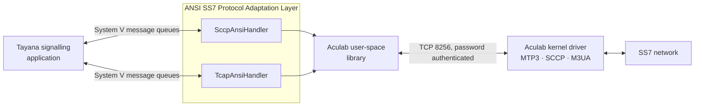
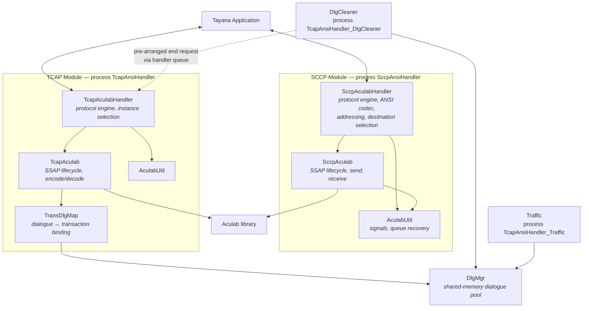

# Architectural Design Specification

## Project: ANSI SS7

---

## Document Information

| | |
| --- | --- |
| Document title | Architectural Design Specification |
| Document file name | ANSI-SS7_HLD_1.0.doc |
| Version | 1.0 |
| Issued by | Sayak Singha |
| Issue Date | 31st July 2026 |
| Status | Initial |
| Path | |

## Revision History

| Version | Date | Author | Approved by | Description of change |
| --- | --- | --- | --- | --- |
| 1.0 | 31-07-2026 | Sayak Singha | | Initial version of the ANSI SS7 Protocol Adaptation Layer |

## Table of Contents

| | Section |
| --- | --- |
| 1 | Objectives |
| 2 | Scope |
| 3 | References |
| 4 | Abbreviations |
| 5 | Introduction |
| 6 | System Context and Boundaries |
| 7 | Constraints and Dependencies |
| 8 | Component Responsibility Details |
| 9 | High-Level Architecture (Modules + Interfaces) |
| 10 | SCCP Flow Designs |
| 11 | TCAP Flow Designs |
| 12 | Dialogue Correlation and State Management |
| 13 | Configuration |
| 14 | Observability |

---

# 1. Objectives

This document presents the Architectural Design Specification (High Level Design — HLD) for
the ANSI SS7 Protocol Adaptation Layer: the software that presents ANSI SCCP and ANSI TCAP
services to Tayana signalling applications on top of the Aculab SS7 stack.

# 2. Scope

This document is for those who are new to this product or do not know anything about it, and
for those who want to review the functionality and design of these modules with the intention
of understanding how a Tayana application exchanges ANSI SS7 signalling.

It covers the SCCP module (`sccp/`), the TCAP module (`tcap/`) and the shared interface
structures (`include/`).

It does not cover the Aculab SS7 stack itself, MTP2/MTP3/M3UA/M2PA behaviour, Global Title
Translation, signalling link provisioning, or the design of the applications that sit above
this product.

# 3. References

| Document Title | Project Name |
| --- | --- |
| Aculab SS7 Developer's Guide | Aculab SS7 v4.0 |
| Aculab SS7 Installation and Administration Guide | Aculab SS7 v4.0 |
| Aculab Distributed SCCP API Guide (rev 6.17.0) | Aculab SS7 v4.0 |
| Aculab Distributed TCAP API Guide (rev 6.16.1) | Aculab SS7 v4.0 |
| Technical Design Annex (`HLD-Annex.md`) | ANSI SS7 |

# 4. Abbreviations

| Term | Meaning |
| --- | --- |
| HLD | High Level Design (also called Architectural Design) |
| LLD | Low Level Design (also called Detailed Design) |
| ANSI | American National Standards Institute — the North American SS7 variant |
| ITU | International Telecommunication Union — the other SS7 variant |
| SCCP | Signalling Connection Control Part |
| TCAP | Transaction Capabilities Application Part |
| MTP2 / MTP3 | Message Transfer Part, levels 2 and 3 |
| M3UA / M2PA | Protocols carrying SS7 over IP |
| SSAP | Service Access Point — the Aculab attachment object |
| SSN | Subsystem Number — identifies an application within a signalling node |
| PC | Point Code — the SS7 network address of a node |
| OPC | Originating Point Code |
| GT | Global Title — an address that is not a point code |
| GTI | Global Title Indicator |
| GTT | Global Title Translation |
| STP | Signal Transfer Point |
| UDT | Unitdata — the SCCP connectionless message |
| BCD | Binary Coded Decimal |
| BER | Basic Encoding Rules |
| IPC | Inter-Process Communication |
| Dialogue | This product's unit of transaction signalling, identified by a stable number |
| Transaction | The Aculab library's unit of transaction state, identified by an opaque handle |

# 5. Introduction

The purpose of this HLD document is to describe the features and functionality of the ANSI
SS7 Protocol Adaptation Layer. It can also be used to review the approach followed in
developing the product, to detect contradictions, and as a reference manual for how the
modules interact at a high level.

A Tayana signalling application that needs to exchange ANSI SS7 traffic does not face a
service — it faces a protocol stack. The Aculab stack terminates the signalling network
competently, but what it presents upward is a C API with its own threading model, its own
buffer ownership rules, opaque transaction handles, and a TCP connection to a kernel driver
that can fail independently of the application.

If every application were built directly against that API, every application team would
re-implement the same difficult work: connection supervision, driver failover, buffer
discipline, transaction lifetime, and reclamation of state that a peer has abandoned. Several
of those are easy to get subtly wrong, and when they are wrong the failure is silent — a
stalled receive path or a slowly leaking pool, not an error.

**Goal:** solve those concerns once, behind a message-queue interface. An application writes
a C structure to a queue and reads a C structure from a queue. Everything about the Aculab
stack — connection loss, host failover, flow control, buffer release, transaction handles —
stays on this product's side of that boundary.

### Specific Objectives

| Objective | Details |
| --- | --- |
| Protocol Adaptation | Present ANSI SCCP connectionless transfer and ANSI TCAP transactions to the application as message structures, hiding the Aculab C API entirely. |
| Two Independent Services | Deliver an SCCP path and a TCAP path that share nothing. An application may use either, both or neither, and a fault in one must not affect the other. |
| Stable Dialogue Identity | Give the application a dialogue number that stays valid for the life of the dialogue, instead of an Aculab transaction pointer that is meaningless outside the handler process and invalid after a reconnect. |
| Transaction ID Isolation | Guarantee that dialogue identifiers this product allocates can never collide with identifiers derived from the peer's transaction range. |
| Multiple Point Codes | Allow one TCAP process to present several originating point codes, each with several Aculab attachments, so an operator running multiple OPCs does not need multiple deployments. |
| Automatic Recovery | Detect loss of the Aculab attachment and rebuild it without operator intervention, and support a second driver host for failover. |
| Reclaim Abandoned Dialogues | Detect dialogues on which a peer has stopped responding and release them, so that a peer failure cannot progressively consume the dialogue pool until outbound service stops. |
| Fault Isolation per SSN | Run one process per subsystem number, so that a failed attachment or a hostile peer affects one subsystem only. |
| Operational Visibility | Emit stable log codes, traffic counters and optional trace, so that faults are diagnosable from files without attaching a debugger. |

# 6. System Context and Boundaries

The product acts as a protocol adaptation layer between a Tayana application and the Aculab
SS7 stack. It:

- Accepts application messages from System V message queues and transmits them to the SS7
  network through the Aculab library.
- Receives network messages through the Aculab library and delivers them to the application
  on System V message queues.
- Encodes and decodes ANSI TCAP — itself on the SCCP path, and through the Aculab library on
  the TCAP path.
- Translates SCCP addresses between the application's representation and Aculab's.
- Allocates and tracks dialogue identifiers, and binds them to Aculab transactions.
- Maintains the Aculab attachment, detects its loss, and rebuilds it.
- Tracks which destination point codes and subsystems the network reports as available.
- Does NOT execute any application-level business logic. It does not interpret operation
  codes, does not implement MAP or CAP or INAP, and does not decide what a message means.
  That is the job of the application above it.



**What is inside the boundary:**

- ANSI TCAP package and component encoding/decoding on the SCCP path
- SCCP address indicator translation and global title digit conversion
- Destination point code selection and availability tracking
- Dialogue identifier allocation, binding and release
- Dialogue timeout detection and reclamation
- Aculab SSAP lifecycle: create, connect, monitor, delete, rebuild
- Aculab buffer release and unblock discipline
- Multi-OPC and multi-instance attachment management
- System V IPC resource creation and management
- Logging, tracing and traffic counters

**What is outside the boundary:**

- MTP2, MTP3, M3UA, M2PA — provided entirely by the Aculab kernel driver
- Global Title Translation — performed by network STPs or by the Aculab driver
- ANSI protocol conformance of the stack itself — Aculab's responsibility
- Application protocols above TCAP such as MAP, CAP and INAP
- Process supervision and restart — the deployment provides this
- Host-level redundancy

There is one hard boundary condition worth stating at the outset, because it constrains every
deployment: **the application interface is System V message queues, which are host-local
kernel objects. The application must run on the same host as the handlers it uses.** The
Aculab driver, by contrast, is reached over TCP and may be on a different host.

# 7. Constraints and Dependencies

## 7.1 Technology Dependencies

| Dependency | Version | Purpose |
| --- | --- | --- |
| Aculab SS7 stack | v4.0 | The SS7 protocol stack. Runs as a kernel driver; the product links its user-space library and reaches the driver over authenticated TCP on port 8256. |
| Aculab Distributed SCCP API | 6.17.0 | `libacu_ss7sccp.so`. Provides SSAP creation, connectionless send/receive, and SCCP status. |
| Aculab Distributed TCAP API | 6.16.1 | `libacu_ss7tcap.so`. Provides SSAP creation, transaction lifecycle, ANSI TCAP encode/decode, and component handling. |
| Tayana platform framework | — | Configuration reading (`CfgRead`), logging (`gLog`), message queues, shared memory, semaphores, trace and peg counters. |
| Linux System V IPC | — | Message queues for the application interface; shared memory and a semaphore for the dialogue pool. |
| POSIX threads | — | One receive and one transmit thread per Aculab attachment. |

## 7.2 Design Constraints

| Constraint | Justification |
| --- | --- |
| Application interface is System V message queues | This is the interface every other Tayana protocol handler presents. An application integrating several Tayana handlers sees one interface style. The consequence is that the application must be co-resident with the handlers, because System V queues are host-local kernel objects. |
| A failed Aculab attachment is rebuilt, never repaired | The Aculab API provides no reconnect call. Recovery is `ssap_delete` followed by `ssap_create` and `ssap_connect`. Every transaction handle held against the old attachment becomes invalid at that moment, which is why dialogues in progress do not survive a reconnect. |
| Point code, SSN and transaction ID range are fixed at attachment creation | The Aculab API requires these before `ssap_connect` and does not allow them to change on a live SSAP. This is why a configuration reload cannot change addressing — that requires a restart. |
| Received messages must be freed promptly | A received message points into the Aculab library's cyclic receive buffer. Holding one stalls reception for every connection on that SSAP, not just the one it arrived on. The product copies what it needs into its own structures and frees immediately, on every path including error paths. |
| Every received message must be followed by an unblock | `acu_sccp_con_unblock()` / `acu_tcap_trans_unblock()` must be called after processing, or that connection or transaction stops permanently. This is honoured on every code path; any new receive path inherits the obligation. |
| Interface structures are exchanged by value with no version field | This is the platform convention. There is no serialisation, no length check and no handshake, so compatibility is by construction: the application and the handler must be compiled from the same headers with the same flags. A mismatch is not detected — it presents as corrupted field values, not as an error. |
| The SCCP path encodes ANSI TCAP itself | The SCCP path deliberately exposes raw connectionless transport with no TCAP SSAP involved. With no TCAP SSAP there is no Aculab encoder available to it, so it must build ANSI TCAP itself. This is what gives the application wire-level control, and it is also why that path carries a package size limit the TCAP path does not. |
| SCCP package size is limited to about 255 bytes | The product's own encoder patches element lengths using 8-bit arithmetic (`UINT8`), which bounds a constructed element to 255 bytes of content and matches the 300-byte payload buffer the decoder copies into. The path does not segment and does not use XUDT/LUDT. A deployment whose packages approach this size must use the TCAP path. |
| The dialogue identifier space is split in half | The upper half is allocated locally, the lower half is reserved for identifiers derived from the peer's transaction range. This is what guarantees the two ends can never allocate the same identifier. The cost is that a configured pool of N yields only about N/2 usable outbound dialogues — see section 12.1. |
| Aculab transaction handles are stored in shared memory | This gives direct dialogue-to-transaction resolution with no second index. The handle is a pointer in the handler's address space, so the cleaner and traffic processes may read other fields of the same record but must never dereference this one, and it is meaningless after a restart. |
| GTT is delegated to the network and the driver | Translation is operator routing policy held in STPs. Duplicating it in the product would create a second source of truth. The deployment must therefore guarantee translation capability; the product cannot diagnose a translation failure beyond reporting the cause the network returned. |
| The Aculab API is polled, not event-driven | Polling gives one blocking call per receive thread and a thread model that can be reasoned about without a dispatcher. The cost is that the 500 ms poll timeout becomes the receive latency floor when traffic is sparse; under load the call returns as soon as a message is available and the floor does not apply. |
---

# 8. Component Responsibility Details

## 8.1 SCCP Module Components

**`SccpAculabHandler` (`SccpAculabHandler.h/.cc`):**

This is the protocol engine of the SCCP path and the largest single component in the module.
It owns everything between the application queue and the Aculab send call. On the transmit
side, `ProcessTxMsgToStack()` takes the application's `_SccpInfo` structure, normalises the
global title digits, encodes the calling and called party addresses through `EncodeAddress()`,
selects the destination point code, applies the addresses and the return option to the Aculab
connection object, encodes the ANSI TCAP package through `EncodeSccpUnitData()`, and hands the
result to the API layer. On the receive side, `DecodeUnitData()` parses an inbound unitdata
message back into `_SccpInfo`, and `DecodeComponent()` parses the component portion inside it.
This class also holds the destination availability state that drives destination selection,
and reads all of the module's product configuration.

**`SccpAculab` (`SccpAculabApi.h/.cc`):**

This is the SSAP adaptation layer — the only class in the SCCP module that calls the Aculab
API. It creates the SSAP from `Sccp_<ssn>.cfg`, cross-checks that the point code Aculab reports
matches the one in configuration and refuses to start if they differ, subscribes to signalling
point and subsystem status, and connects to the driver. It owns `GetAcuSccpEvent()`, the
receive poll with its 500 ms timeout, and `SendAcuSccpMsg()` on the transmit side. It is also
responsible for the two Aculab disciplines that must never be broken: freeing the received
message and calling `acu_sccp_con_unblock()` on every path. Because an SSAP cannot be repaired,
this class also implements the delete-and-rebuild cycle used when the attachment is lost.

**`AculabUtil` (`SccpAculabUtil.h/.cc`):**

The support class for the SCCP module. It handles signals for configuration reload, trace
toggle and termination, recovers the application message queue if it is removed underneath the
process, converts Aculab error codes to readable text via `acu_sccp_strerror()` for logging,
and provides the diagnostic print helpers used when message display is enabled.

**`SccpAculabHandlerMain.cc`:**

The process entry point. It enforces single-instance operation, builds the configuration file
name as `Sccp_<ssn>.cfg` from the subsystem number given on the command line, creates the
`SccpAculabHandler` object, and spawns the transmit and receive threads. It then runs the
supervisor loop that evaluates SSAP health and triggers a rebuild when the attachment has
failed.

## 8.2 TCAP Module Components

**`TcapAculabHandler` (`TcapAculabHandler.h/.cc`):**

The protocol engine of the TCAP path. It reads the application queue, selects which SSAP
instance should carry an outbound message, applies per-instance transmit gating, and drives
the whole transmit sequence — allocate or resolve the dialogue, create or resolve the Aculab
transaction, allocate and initialise the message, add the dialogue portion and components, and
send. On the receive side it assembles decoded messages and their components into `AnsiTcapMsg`
and writes them to the application. It also reads all of the module's product configuration,
including the multi-OPC definitions, and it is the only process that manipulates Aculab
transactions — the cleaner asks it to tear a dialogue down rather than doing so itself.

**`TcapAculab` (`TcapAculabApi.h/.cc`):**

The SSAP adaptation layer for TCAP, and the only class that calls the Aculab TCAP API. Unlike
its SCCP counterpart it does not encode anything itself: it delegates encoding and decoding to
the Aculab library through `acu_tcap_msg_decode()` and the `acu_tcap_msg_add_comp_*()` family.
It creates one SSAP per configured instance, sets the transaction ID range before connecting —
which must happen before connect, because Aculab will not accept it afterwards — and verifies
that the point code declared in `OPC_<n>` matches the one in that instance's configuration
file, reporting both values if they differ. It owns the receive poll and the component
extraction loop that walks a decoded message until Aculab reports no components remain.

**`TransDlgMap` (`TcapAculabTransDlgMap.h/.cc`):**

The binder between the two identity systems. The application knows a dialogue by a number this
product allocated; Aculab knows a transaction by an opaque pointer. This class holds that
correspondence in both directions. It stores the dialogue record's address into the Aculab
transaction using `acu_tcap_trans_set_userptr()`, and retrieves it on the way back with
`acu_tcap_trans_get_userptr()`. That is what makes resolution from an inbound message to a
dialogue a direct lookup with no search and no second index.

**`DlgMgr` (`TcapAculabDlgMgr.h/.cc`):**

The dialogue pool. This is the only component shared between processes: it creates two System V
shared memory segments — one holding the dialogue records, one holding the free-index ring and
its header — and a semaphore that serialises mutation. Whichever process starts first creates
them with `IPC_CREAT | IPC_EXCL` and the others attach. `Allocate_DlgId()` draws an index from
the free ring and adds the half-size offset that places every locally allocated identifier in
the upper half of the space. `FreeDlgInfo()` returns upper-half identifiers to the ring and
merely clears lower-half ones, because those were never drawn from it. The semaphore is taken
with `SEM_UNDO`, which matters more than it looks: if a handler dies holding the lock, the
kernel reverses the operation, so a crash cannot leave the pool permanently locked against the
cleaner.

**`DlgCleaner` (`TcapAculabDlgCleaner.h/.cc`):**

The reclamation agent, running as its own process. Every three seconds it walks the entire pool
comparing each record's insertion time against the configured timeout, choosing between
`ACU_TCAP_DLG_TIMEOUT` and `ACU_TCAP_DLG_TIMEOUT_CAP` according to the record's SSN. When a
dialogue has expired it does not touch Aculab at all — it posts a pre-arranged end request onto
the handler's own receive queue, using the record's SSN as the message type so the request
reaches the right handler process. The handler then releases the record and calls
`acu_tcap_transaction_delete()`; nothing is sent to the peer. This exists as a separate process
for one reason: at the maximum configured pool size that scan touches 500,000 records, and it
must not run on a thread that is carrying traffic. To bound its own cost it sleeps briefly every
2000 records.

**`Traffic` (`TcapAculabHandlerTraffic.h/.cc`):**

The counter reporting process. It attaches to the dialogue pool read-only to report occupancy,
and publishes the traffic counters. It is the only process in the product that reads
`kernel.cfg`; the handlers do not.

**`AculabUtil` (`TcapAculabUtil.h/.cc`):**

The TCAP module's support class, equivalent in role to its SCCP counterpart — signal handling,
queue recovery, Aculab error text and diagnostic printing.

**`TcapAculabHandlerMain.cc`:**

The process entry point. It enforces single-instance operation, reads the OPC definitions, and
then walks every configured instance creating **two detached threads per instance** — one
`RxThread` and one `TxThread`. There is a deliberate `sleep(1)` between each thread creation.
That delay is not padding: the `AcuThreadStruct` parameter block is a stack local that the loop
reuses for the next instance, and the delay gives each new thread time to copy its instance
number before the parent overwrites it. **It must not be removed as an optimisation.** The
visible cost is start time — roughly two seconds per instance, so ten instances take about
twenty seconds to come up.

# 9. High-Level Architecture (Modules + Interfaces)

## 9.1 Module structure



## 9.2 Delivered processes and libraries

| Process | Built from | Role |
| --- | --- | --- |
| `SccpAnsiHandler` | `SccpAculabHandler.o`, `SccpAculabHandlerMain.o` | The entire SCCP path. One per SSN |
| `TcapAnsiHandler` | `TcapAculabHandler.o`, `TcapAculabHandlerMain.o` | The entire TCAP path. One per SSN |
| `TcapAnsiHandler_DlgCleaner` | `TcapAculabDlgCleaner.o`, `TcapAculabDlgCleanerMain.o` | Dialogue reclamation. One per SSN |
| `TcapAnsiHandler_Traffic` | `TcapAculabHandlerTraffic.o`, `TcapAculabHandlerTrafficMain.o` | Counter reporting |

## 9.3 Interfaces

### a. Application Interface (The Message Contract)

**Who implements it:** `SccpAculabHandler` and `TcapAculabHandler`
**The mechanism:** System V message queues — a handler receive queue, an application delivery
queue, and a heartbeat queue, per process
**The structures:** `_SccpInfo` (`include/MsuStructs.h`) and `AnsiTcapMsg`
(`include/TcapStructs.h`)

**Why it matters:** this is the only interface an application team sees, and it is a C
structure exchanged by value. There is no version field, no length check and no handshake. If
the application and the handler are compiled from different headers, or with different compile
flags, every field is read at the wrong offset — and nothing detects it. The failure looks like
corrupt addresses or nonsense operation codes, which is usually blamed on the network before
anyone suspects the build. **A change to a shared header requires the application and every
handler process to be rebuilt from the same tree and deployed together.**

The flags matter specifically. `tcap/Makefile` defines `-DKAFKA_BRIDGE`; `sccp/Makefile` does
not. That flag appends a `KafkaRoutingInfo` block to several structures. It does not make the
product talk to Kafka — there is no Kafka client anywhere in this repository — it exposes a
metadata block that a separate out-of-tree bridge process can populate and read.

On the TCAP queue the `long` message type carries the SSN. That is how one queue can serve
several subsystems, and it is how `DlgCleaner` addresses its teardown request to the correct
handler.

### b. Aculab SSAP Interface (The Attachment Contract)

**Who implements it:** `SccpAculab` and `TcapAculab`
**The methods:** `acu_*_ssap_create()`, `acu_*_ssap_connect_sccp()`, `acu_*_ssap_msg_get()`,
`acu_*_ssap_delete()`

**Why it matters:** the SSAP is the unit of attachment to the Aculab driver, and it carries
three properties the design has to work around. It is created from a configuration file, so
the product cannot set addressing programmatically. Its point code, SSN and transaction ID
range are fixed before connect and cannot change afterwards, which is why addressing changes
need a restart rather than a reload. And it cannot be repaired — recovery is delete and
rebuild, which invalidates every transaction handle held against it.

The shipped headers declare `acu_sccp_ssap_connect_sccp()` and `acu_tcap_ssap_connect_sccp()`.
The published SCCP API Guide at revision 6.16.1 documents the SCCP function as
`acu_sccp_ssap_connect_driver()`. The header is authoritative for the delivered kit; the guide
is behind. This is recorded so it is not mistaken for a defect.

### c. Aculab Buffer Contract

**Who implements it:** `SccpAculab` and `TcapAculab`
**The methods:** `acu_*_msg_free()`, `acu_sccp_con_unblock()`, `acu_tcap_trans_unblock()`

**Why it matters:** a message returned by the Aculab receive call does not belong to the
product. It points into the library's cyclic receive buffer. If it is not freed promptly,
reception stalls for **every connection on that SSAP**, not just the one the message arrived
on — so a single slow or forgotten path takes down the whole receive side. Equally, if the
connection or transaction is not unblocked after processing, that connection stops permanently
and nothing reports why.

Both obligations are honoured on every path in the product, including every error path. Any
new receive path inherits both.

### d. Dialogue Pool Interface (The Shared-Memory Contract)

**Who implements it:** `DlgMgr`, attached by `TcapAculabHandler`, `DlgCleaner` and `Traffic`
**The mechanism:** two System V shared memory segments and one semaphore

**Why it matters:** three processes read and write the same records, so mutation is serialised
by the semaphore. Reads of scalar fields — insertion time, SSN, occupancy — are deliberately
**not** serialised, because a torn read there yields a stale value rather than an invalid one,
and the reader acts on it only through a later locked operation. `DlgCleaner` is the main such
reader: it reads a timestamp without the lock, and the teardown it consequently requests is
performed by the handler under the lock.

The one field that must never be touched by any process other than the owning handler is the
Aculab transaction handle. It is a pointer into that handler's address space. Reading it from
`DlgCleaner` or `Traffic` would return a number that means nothing there, and dereferencing it
would crash the process. It is also meaningless after a restart, which is why dialogues in
progress do not survive one even though the records themselves do.
---

# 10. SCCP Flow Designs

## 10.1 How a Peer Comes Up (SSAP Initialisation)

`SccpAnsiHandler` is started with an SSN on the command line. From that it builds the
configuration file name `Sccp_<ssn>.cfg` and hands it to Aculab.

**Step 1: Single-instance lock.** The process takes a lock and exits with `GSYS16` if another
instance is already running. Two handlers on the same SSN would fight over the same queues.

**Step 2: Read configuration.** IPC queue keys, counter flag, display verbosity and the two
destination point codes are read from `SccpAnsiHandler.cfg`. Every one of these is mandatory
except the second destination; a missing value stops startup.

**Step 3: Create the SSAP.** `acu_sccp_ssap_create()` is given the configuration file name.
Aculab reads the file itself and builds the SSAP with the local point code, SSN and driver host
details from it.

**Step 4: Verify the point code.** The handler immediately calls `acu_sccp_ssap_get_locaddr()`
and compares the point code Aculab reports against the one it read from configuration. If they
differ it logs `ACUSCCP01` and refuses to run. This catches a common deployment
error — a point code in `Sccp_<ssn>.cfg` that does not match the driver's `ss7.cfg`.

**Step 5: Subscribe to status.** `acu_sccp_enable_sp_status()` and
`acu_sccp_enable_user_status()` register interest in signalling point and subsystem
availability. Passing `~0u` subscribes to all destinations rather than a named one. Without
this the handler would never learn whether a destination is reachable, and destination
selection in 10.2 could not work.

**Step 6: Connect.** `acu_sccp_ssap_connect_sccp()` opens the TCP connection to the driver.
This is asynchronous — it returns immediately and success arrives later as a connection state
event.

**Step 7: Start threads.** `TxThread` and `RxThread` are created and detached.

**Step 8: Supervisor loop.** The main thread evaluates SSAP health periodically. When the
attachment is lost it deletes the SSAP and returns to Step 3, because an SSAP cannot be
repaired.

## 10.2 What Gets Sent to the Network (Transmit Flow)

This is the exact journey of a message from the moment the application writes it to the queue
until it reaches the Aculab driver.

**Step 1: Read from the queue.** `TxThread` reads `_SccpInfo` from the handler receive queue
and logs `ACUSCCP09`.

**Step 2: Check the discriminant.** `_SccpInfo` is a union. Only `SCCP_MSG_UDT` is processed;
anything else is discarded silently. The application must set the message type field before
populating the union, because there is no other way to know which arm is valid.

**Step 3: Normalise the digits.** The application supplies global title digits as ASCII; the
wire wants packed BCD. The handler converts — but only if the first digit byte looks like
ASCII, tested as greater than `0x30`. This heuristic exists because some callers already
supply packed BCD. **The trap:** if an application supplies packed BCD whose first byte happens
to exceed `0x30`, it is converted a second time and the address goes out wrong. Applications
should supply ASCII consistently.

**Step 4: Count it.** `PEG_UDT_RCVD_FROM_APPL` is incremented here, *before* encoding and
validation. That means a message counted as received from the application may still be dropped
later — which is exactly what makes counter 92 minus counter 93 the drop count.

**Step 5: Encode the addresses.** `EncodeAddress()` is called for the calling party
(`ACUSCCP17` on failure) and then the called party (`ACUSCCP18` on failure). This converts the
application's address indicator byte into Aculab's validity bitmask.

**Step 6: Choose the destination point code.** This is the step that surprises integrators, so
it is stated plainly: **the handler overwrites the destination point code with one from its own
configuration.** The global title, SSN and address indicator all come from the application, but
the point code does not.

If only `SCCP_DESTINATION_1` is configured, it is used when the network reports it available,
and the message is dropped with `ACUSCCP24` if not. If both destinations are configured, the
handler alternates between them on successive messages using an internal `mPcFlag` toggle,
falls back to the other if the selected one is unavailable, and drops only when both are down.
With both healthy, traffic divides roughly evenly.

Availability comes from the network, not from configuration. **A destination that has never
been reported available counts as unavailable** — so if a point code and SSN is missing from
the `[CONCERNED]` section of the driver's `ss7.cfg`, no status is ever reported for it, every
message to it is dropped, and the only symptom is `ACUSCCP24` in the log.

**Step 7: Apply addresses to the connection.** The encoded addresses are copied onto the Aculab
connection object.

**Step 8: Apply the return option.** Bit 7 of the application's `pcMsgHdlg` field sets
return-on-error. This must happen *after* Step 7 because it is set on the same connection
object, and the connection must already carry the right addresses.

**Step 9: Encode the ANSI package.** `EncodeSccpUnitData()` selects the package tag from the
application's `pkgType`, writes the transaction identifiers, copies the dialogue portion
through unchanged, and appends the components. Length fields are patched afterwards using
8-bit arithmetic, which is where the 255-byte limit comes from.

**Step 10: Send.** `acu_sccp_unitdata_request()` transmits, and
`PEG_UDT_SENT_TO_STACK` is incremented only on success.

## 10.3 What Comes Back from the Network (Receive Flow)

**Step 1: Poll.** `RxThread` calls `acu_sccp_ssap_msg_get()` with a 500 ms timeout. When
traffic is sparse this timeout is the latency floor; under load the call returns as soon as a
message is waiting, so the floor is not observed.

**Step 2: Branch on event type.** A unitdata message goes to Step 3. A notice — meaning the
network could not deliver something we sent — is counted, logged with its return cause as
`ACUSCCP36`, and delivered. Connection state, point code status and subsystem status events
update the state used by 10.2 Step 6 and are neither counted nor delivered.

**Step 3: Count before decoding.** `PEG_UDT_RCVD_FROM_STACK` is incremented before the decode
attempt, so a message that fails to decode still counts as received.

**Step 4: Decode.** `DecodeUnitData()` zeroes the target structure, derives the protocol class
and return option, copies the payload, converts the addresses back to the application's
representation, reads the package tag and transaction identifiers, copies the dialogue portion
verbatim, and calls `DecodeComponent()` for the component portion. Failure logs `ACUSCCP30`.

**Step 5: Deliver.** The structure is written to the application delivery queue and
`PEG_UDT_SENT_TO_APPL` is incremented.

**Step 6: Release — always.** The message is freed and `acu_sccp_con_unblock()` is called.
This happens on every path out of the receive handler, including every failure path above.

## 10.4 The ANSI Tag Trap in the Decoder

Two ANSI tag values mean two different things depending on where they appear:

| Value | At package level | At component level |
| --- | --- | --- |
| `0xE8` | Unidirectional package | Component portion |
| `0xE1` | Query without Permission | Invoke, not last |

Nothing in the encoded byte tells them apart. `DecodeUnitData()` resolves this **by position**:
a tag read as the first byte of the package is a package tag, and a tag read after the
transaction identifier element is a component tag.

This is a permanent constraint on that function. Any change that reorders how elements are
examined, or that introduces a lookahead across the transaction identifier boundary, will
silently reinterpret a Unidirectional package as a component portion — and it will do so
without an error, producing wrong behaviour rather than a failure. The position sensitivity
must be preserved by anyone maintaining this code. The full tag set is in Annex A1.

# 11. TCAP Flow Designs

## 11.1 How the Peers Come Up (Multi-OPC Initialisation)

`TcapAnsiHandler` supports several originating point codes in one process, each with several
Aculab attachments.

**Step 1: Read the OPC definitions.** `NUMBER_OF_OPC` says how many point codes to build,
and `OPC_<n> = <pointcode>:<instances>` defines each. Indices must start at 0 and increment
without gaps. Up to 128 point codes, up to 10 instances each.

Setting `NUMBER_OF_OPC = 0` disables the mechanism, and the handler falls back to a single
point code taken from `LocalPC` in `Tcap_<ssn>.cfg`.

**Step 2: Pick the configuration file per instance.** With multi-OPC enabled the file is
`Tcap_<pc>_<ssn>.cfg` — so point code 1071 and SSN 8 gives `Tcap_1071_8.cfg`. With it disabled
the file is `Tcap_<ssn>.cfg`.

**Step 3: Create each SSAP.** `acu_tcap_ssap_create()` is called with the ANSI standard flag.
The handler then verifies the point code matches `OPC_<n>` and, if not, logs both values so the
mismatch is obvious.

**Step 4: Set the transaction ID range before connecting.** `TRANID_RANGE` is applied with
`acu_tcap_ssap_set_cfg_int()`. **This must happen before connect** — Aculab will not accept it
on a live SSAP. Ranges must not overlap between instances, because that is what keeps their
transaction identifiers distinct.

**Step 5: Connect.** `acu_tcap_ssap_connect_sccp()`, asynchronous as on the SCCP side.

**Step 6: Spawn two threads per connected instance.** One `RxThread`, one `TxThread`, both
detached, with a `sleep(1)` between each creation for the reason given in 8.2. One OPC with one
instance therefore gives two worker threads and about two seconds of startup.

## 11.2 Sending a Transaction to the Network

**Step 1: Read and count.** `TxThread` reads `AnsiTcapMsg` from the queue.
`PEG_RCVD_FROM_APP` is incremented when the dialogue identifier is non-zero.

**Step 2: Choose the instance.** The handler selects an SSAP instance that is in service and
not transmit-blocked. If no instance is available the message is dropped and `ACUTCAP157` is
logged.

**Step 3: Allocate or resolve the dialogue.** For a new outbound dialogue,
`DlgMgr::Allocate_DlgId()` draws an index from the free ring and adds the half-size offset. If
the pool is full it logs `ACUTCAP24` and the send fails. For an existing dialogue the record is
resolved instead.

**Step 4: Create or resolve the transaction.** A Query creates a new Aculab transaction; any
other package type resolves the existing one. **A Query on a dialogue that already holds a
transaction is rejected** and counted — that means the application reused a dialogue identifier
without closing the previous one. A non-Query package with no transaction is likewise rejected,
because a dialogue must be opened before it can be continued.

**Step 5: Bind them.** `TransDlgMap` stores the dialogue record's address into the transaction
with `acu_tcap_trans_set_userptr()`, so the inbound path can resolve back with no search.

**Step 6: Build the message.** `acu_tcap_msg_alloc()` then `acu_tcap_msg_init()` with the
package type. **Addresses are fixed here, at init, not at send.** The product clears Aculab's
configured address defaults and applies the application's values, so what goes on the wire is
what the application supplied rather than a residue of configuration. Two flags govern this:
`SET_LOCAL_ACU_TCAP_ADDR_FLAG` forces the local address to be set explicitly, and
`SET_APP_GT_RELAY_FLAG` relays the application's global title unchanged.

**Step 7: Add the components.** `acu_tcap_msg_add_comp_invoke()`, `_result()`, `_error()` or
`_reject()` as appropriate, with the last-component flag where ANSI requires it.

**Step 8: Send.** `acu_tcap_msg_send()`, then `PEG_SEND_TO_NWK` on success.

Every one of steps 3 through 8 has its own failure branch, each incrementing
`PEG_DROP_SEND_TO_NWK` and logging a distinct code. This is why TCAP transmit loss is reported
directly rather than inferred as it is on the SCCP path.

## 11.3 Receiving a Transaction from the Network

**Step 1: Poll.** `RxThread` calls `acu_tcap_ssap_msg_get()` with a 500 ms timeout.

**Step 2: Decode.** The event type reported before decoding is coarse — `ACU_TCAP_MSG_DATA`,
`_NOTICE`, `_TIMEOUT` and so on. The real package type is only known after
`acu_tcap_msg_decode()`, and **decoding is also what auto-creates the transaction for an
inbound Query.** A decode failure counts as a receive drop, and Aculab sends a P-Abort to the
peer on our behalf.

**Step 3: Resolve the dialogue.** `acu_tcap_trans_get_userptr()` returns the dialogue record
bound in 11.2 Step 5. For an inbound Query the handler allocates a record now; that identifier
comes from the lower half of the space.

**Step 4: Extract components.** `acu_tcap_msg_get_component()` is called repeatedly until
Aculab reports `ACU_TCAP_ERROR_NO_COMPONENT`. Each component increments its own receive
counter, so on multi-component traffic the per-component counters will exceed the per-message
counter. That is expected, not a fault.

Three component types can arrive that no peer sent — Aculab generates them: an operation
timeout, a local reject of a malformed component, and abort user information. **An application
must be prepared to receive these on a dialogue where it has nothing outstanding.**

**Step 5: Deliver and release.** The assembled `AnsiTcapMsg` is written to the application
queue and `PEG_SEND_TO_APPL` is incremented. The message is then freed and the transaction
unblocked, on every path.

# 12. Dialogue Correlation and State Management

## 12.1 The Dialogue Identifier Split — and How to Size the Pool

Both ends of a TCAP conversation allocate transaction identifiers. If both allocated from the
same range they would eventually collide and two unrelated dialogues would be confused for one
another.

The product prevents this structurally by **splitting the identifier space in half**. The upper
half is allocated locally; the lower half is reserved for identifiers derived from the peer's
range. `Allocate_DlgId()` always adds an offset that lands the result in the upper half, so a
locally allocated identifier can never equal a peer-derived one.

The geometry comes from two configuration values:

```
boundary    = MAX_ACU_TCAP_DLG_SIZE / 2 + ACU_TCAP_IN_DLG_SHIFT_INDX
allocatable = MAX_ACU_TCAP_DLG_SIZE / 2 - ACU_TCAP_IN_DLG_SHIFT_INDX
```

**A configured pool of N gives about N/2 usable outbound dialogues, not N.** Sizing the pool at the required dialogue count
rather than twice it produces capacity exhaustion at roughly half the expected load, and the
only symptom is `ACUTCAP24`.

Worked against a real deployment — pool 500,000, shift index 2,000:

| Quantity | Value |
| --- | --- |
| Configured pool | 500,000 |
| Boundary between halves | 252,000 |
| Allocatable for outbound dialogues | 248,000 |

There is a second term people miss. A dialogue holds its record until it is released *or
reclaimed*. If a peer fails, its dialogues are held for the full reclamation timeout. So the
requirement is not just the concurrent dialogue count *D*, but:

```
D_effective = max(D, establishment_rate × reclamation_timeout)
pool size  ≥ 2 × (D_effective + shift index)
```

With the timeout at its 5000-second ceiling and 50 new dialogues per second, a total peer
failure ties up 250,000 records regardless of how few are normally active. **A long reclamation
timeout and a small pool are incompatible.**

## 12.2 What Happens If the Peer Never Replies

Without intervention, a dialogue whose peer has stopped responding would hold its record and
its Aculab transaction forever, and the pool would leak until outbound service stopped. This is
what `DlgCleaner` prevents.

Every three seconds it scans the whole pool. For each record it compares `time(NULL)` against
the insertion time, choosing `ACU_TCAP_DLG_TIMEOUT_CAP` if the record's SSN is the cleaner's
own and `ACU_TCAP_DLG_TIMEOUT` otherwise. On expiry it writes a pre-arranged end request to the
handler's receive queue with the record's SSN as the message type. The handler releases the
record and calls `acu_tcap_transaction_delete()`. **Nothing is sent to the peer** — a
pre-arranged end is a local teardown, not a package.

Whether the application is told is controlled by `SEND_RSP_TIMEOUT_ON_PRE_ARR_END`. With it set
to 1 the handler sends a response-timeout indication; with 0 the dialogue simply disappears.
**An application that keeps its own per-dialogue state and runs with this at 0 will never learn
that its dialogue was reaped, and will accumulate orphaned state.** Such an application needs
either this flag set to 1 or its own timer.

## 12.3 What Happens If the Aculab Attachment Drops

An SSAP cannot be repaired. When the connection to the driver is lost — reported as a
connection state event, or caught by the supervisor's health evaluation — recovery is
destructive:

1. Delete the SSAP.
2. Create a new one from configuration.
3. Connect it.
4. Re-spawn the worker threads.

**Every Aculab transaction handle held against the old SSAP is invalid from that moment.** The
dialogue records themselves survive, because shared memory outlives the process, but the
handles inside them now point at a deleted attachment. Dialogues that were in progress do not
survive; the application sees them simply stop.

Two consequences follow. First, worker threads are detached and never joined, so **repeated
recovery cycles accumulate threads** over the life of the process — worth monitoring if
reconnects are frequent. Second, where `HOST_B_NAME` is configured, Aculab fails over to the
second driver host internally and the product sees only a connection state event; where it is
not configured, driver host loss stops signalling until an operator intervenes.

Aculab also offers a transaction restoration facility, and `RESTORATION_REQUIRED` switches it
on. **It is not exercised in the delivered configuration and must be left at 0.** Setting it to
1 causes transmit threads to wait for a restoration that never completes, logging `ACUTCAP105`
and stopping transmission with no operator-visible way to release them.

## 12.4 What Happens If the Pool Fills

`Allocate_DlgId()` fails, `ACUTCAP24` is logged, the outbound message is dropped and counted.
The service keeps running, and inbound dialogues are unaffected because they draw from the
other half of the space.

Because allocatable capacity is about half the configured pool (12.1), this condition is far
more often a sizing error than a real capacity limit. Check the arithmetic in 12.1 before
concluding that the traffic has grown.

## 12.5 Pool Integrity Protection

Releasing a record that is already free, or referencing an identifier outside the pool, is
detected and logged rather than allowed to corrupt the free ring — `ACUTCAP73`, `ACUTCAP74`,
`ACUTCAP75`, `ACUTCAP76` and `ACUTCAP156`. Any of these in a log is evidence of a real defect
upstream and should be raised, not filtered out of monitoring.

The semaphore is taken with `SEM_UNDO` so that a handler crash cannot leave the pool
permanently locked. Without it, a process dying between lock and unlock would block the cleaner
forever and the pool would fill with no way to recover short of removing the IPC objects.
---

# 13. Configuration

## 13.1 Which File Is Read By Which Process

Configuration is layered, and **which file a process actually reads is not obvious from the
file names.** The table below was established by tracing every `CfgInit()` call in the source
and is authoritative.

| File | Section | Read by | Governs |
| --- | --- | --- | --- |
| `SccpAnsiHandler.cfg` | `[ACULAB_SCCP_API]` | `SccpAnsiHandler` | All SCCP product settings |
| `TcapAnsiHandler.cfg` | `[ACULAB_TCAP_API]` | `TcapAnsiHandler`, `TcapAnsiHandler_DlgCleaner` | All TCAP product settings |
| `Sccp_<ssn>.cfg` | `[SCCP]` | Aculab library | Addresses, driver hosts, passwords, buffers |
| `Tcap_<pc>_<ssn>.cfg` | `[TCAP]` | Aculab library | As above, plus transaction ID range |
| `kernel.cfg` | — | `TcapAnsiHandler_Traffic` **only** | Counter reporting |
| `ipc.cfg`, `Peg.cfg` | — | `TcapAnsiHandler_Traffic` only | Counter reporting |
| `ss7.cfg` | — | Aculab driver, via `ss7maint` | Point code, variant, links, listeners, concerned destinations |

Three things follow from this table, and all three are live issues on the deployment inspected
for this document.

**`kernel.cfg` does not reach the handlers.** It is a platform-wide file shared with other
Tayana products. It currently carries a full duplicate set of TCAP and SCCP settings —
`MAX_ACU_TCAP_DLG_SIZE`, `ACU_TCAP_DLG_TIMEOUT`, `SCCP_DESTINATION_1`, `TCAP_PEG_REQUIRED`,
`ACU_TCAP_IN_DLG_SHIFT_INDX` and more. None of them are read by `SccpAnsiHandler` or
`TcapAnsiHandler`. Where the values differ from the AnsiHandler files — and they do,
`MAX_ACU_TCAP_DLG_SIZE` is 64000 in one and 500000 in the other — **the AnsiHandler value is
the one in force**. The stale copies should be deleted; until they are, they will mislead
whoever reads them.

**`kernel.cfg` also holds Dialogic-era settings** — `TCAP_RSI_MGMT_MODULE_ID`,
`TCAP_SIU0_INSTANCE`, `TCAP_SIU1_INSTANCE`, `DIA_TCAP_DLG_TIMEOUT`. Those belong to a
completely different stack and have no effect on this product at all.

**Some error messages name the wrong file.** A failure reading `MAX_ACU_TCAP_DLG_SIZE` reports
`"Configuration Error for MAX_ACU_TCAP_DLG_SIZE in file kernel.cfg"` even though the value was
read from `TcapAnsiHandler.cfg`. The SCCP module does the same, reporting `ss7.cfg` and
`kernel.cfg` in messages about `SccpAnsiHandler.cfg`. The log text is stale. **When diagnosing
a configuration failure, edit the file this table names, not the file the message names.**

Configuration is located relative to `PRODUCT_HOME` and `PRODUCT_CFG_PATH`. Neither has a
default, and both must be exported identically to every process — if the handler and the
cleaner see different values they will attach to different dialogue pools.

## 13.2 `SccpAnsiHandler.cfg` — SCCP Product Configuration

```
[ACULAB_SCCP_API]

# System V IPC message queue keys. Must be unique across the whole host.
MSG_SCCP_HDLR_Q_RCV = 4100
MSG_SCCP_DEC_Q_RCV = 4101
MSG_SCCP_HEART_BEAT_Q_RCV = 4102

# Enable traffic counters for the SCCP sublayer.
SCCP_PEG_REQUIRED = 1

# Message dump verbosity. Note the key retains a legacy typo ("DIPLAY").
SCCP_MSG_DIPLAY_PARAM = 2

# Destination point codes used by destination selection.
SCCP_DESTINATION_1 = 1070
SCCP_DESTINATION_2 = 35000

TCAP_LOOPBACK_SSN = 0
```

Here is what it controls:

**The IPC keys.** These three keys define the entire application interface for this handler.
They are configured, not derived, and must be unique against every System V object on the host
including those belonging to unrelated products. There is no allocation scheme in the product —
a collision produces undefined behaviour, not a startup error.

**Destination selection.** `SCCP_DESTINATION_1` and `SCCP_DESTINATION_2` are the point codes
that override whatever the application supplied, as described in 10.2 Step 6. With both set as
above, this deployment alternates between 1070 and 35000 with each covering for the other. The
code validates both over the full 24-bit ANSI range, 1 to 16777215. **Comments in some sample
files state a range of 1 to 35000; that is wrong and should be corrected.**

**The mandatory/optional split.** Every key here is mandatory except `SCCP_DESTINATION_2`; a
missing value stops startup. `SCCP_DESTINATION_2` is the one exception — if it fails to parse
the handler sets it to 0 and continues in single-destination mode.

**The typo is load-bearing.** `SCCP_MSG_DIPLAY_PARAM` is misspelled and the parser matches it
literally. Correcting the spelling in the file without changing the code will break the read.

## 13.3 `TcapAnsiHandler.cfg` — TCAP Product Configuration

```
[ACULAB_TCAP_API]

# ---- Feature flags ----
RESTORATION_REQUIRED = 0
TCAP_PEG_REQUIRED = 1
TCAP_DISABLE_RECV_LOCAL_ADDRESS = 0
SET_LOCAL_ACU_TCAP_ADDR_FLAG = 1
SET_APP_GT_RELAY_FLAG = 1
SEND_RSP_TIMEOUT_ON_PRE_ARR_END = 0

# ---- Limits and timeouts ----
MAX_ACU_TCAP_DLG_SIZE = 500000
ACU_TCAP_DLG_TIMEOUT = 5000
ACU_TCAP_DLG_TIMEOUT_CAP = 8000
TCAP_MSG_DISPLAY_PARAM = 63

# ---- Licensing ----
TCAP_MSG_LICENCE_KEY = 41672380035391

# ---- Originating point codes ----
NUMBER_OF_OPC = 1
OPC_0 = 1071:1

# ---- IPC keys ----
MSG_TCAP_HDLR_Q_RCV = 9733
MSG_TCAP_DEC_Q_RCV = 9734
MSG_TCAP_HEART_BEAT_Q_RCV = 4098
SEM_IN_DLG_KEY = 9914
SHM_IN_DLG_POOL_KEY = 9839
SHM_DLG_MGMT_QUEUE_KEY = 9840

ACU_TCAP_IN_DLG_SHIFT_INDX = 2000
```

Here is what it controls:

**The dialogue pool geometry.** `MAX_ACU_TCAP_DLG_SIZE` and `ACU_TCAP_IN_DLG_SHIFT_INDX`
together determine how many outbound dialogues actually exist. With the values above that is
248,000, not 500,000 — see 12.1 before choosing these numbers.

**The reclamation timeouts.** `ACU_TCAP_DLG_TIMEOUT` at 5000 seconds is the configured ceiling
(`DLG_TIMEOUT_MAX`). That is over 80 minutes, which is a long time to hold a record after a
peer has gone quiet, and it interacts directly with the pool sizing above.

**The three flags that change wire behaviour.** `SET_LOCAL_ACU_TCAP_ADDR_FLAG` forces the local
address to be set explicitly rather than accepting Aculab's default;
`SET_APP_GT_RELAY_FLAG` relays the application's global title unchanged;
`TCAP_DISABLE_RECV_LOCAL_ADDRESS` suppresses the local address on receive.

**The flag that must stay at zero.** `RESTORATION_REQUIRED` must be 0. See 12.3.

**The flag applications care about most.** `SEND_RSP_TIMEOUT_ON_PRE_ARR_END = 0` means the
application is **never told** when a dialogue is reclaimed. See 12.2.

**The IPC keys, including the pool.** `SEM_IN_DLG_KEY`, `SHM_IN_DLG_POOL_KEY` and
`SHM_DLG_MGMT_QUEUE_KEY` must be identical for `TcapAnsiHandler` and
`TcapAnsiHandler_DlgCleaner` — they both read this same file, which is precisely what keeps
them attached to the same pool.

**Multi-OPC.** `NUMBER_OF_OPC = 1` with `OPC_0 = 1071:1` means one point code, one Aculab
attachment, and therefore two worker threads. Setting `NUMBER_OF_OPC = 0` would instead take a
single point code from `LocalPC` in `Tcap_<ssn>.cfg`.

## 13.4 `Tcap_<pc>_<ssn>.cfg` — Aculab Attachment Configuration

Read by the Aculab library, not by the product. This is the real file from a working
deployment, `Tcap_1071_8.cfg`:

```
[TCAP]
LocalPC = 1071
LocalSSN = 8
RemotePC = 35000
RemoteSSN = 8

LOCAL_FLAGS = 2
LOCAL_TT = 0          # Translation Type
LOCAL_NP = 1          # Numbering Plan
LOCAL_ES = 2          # Encoding Scheme
#LOCAL_NAI = 4        # Nature of Address Indicator - not valid for ANSI
LOCAL_GTI = 2
LOCAL_GT_DIGITS = 919821900008

REMOTE_FLAGS = 2
REMOTE_TT = 0
REMOTE_NP = 1
REMOTE_ES = 2
#REMOTE_NAI = 4       # not valid for ANSI
REMOTE_GTI = 2
REMOTE_GT_DIGITS = 919821900009

TRANID_RANGE = 100
TRAN_RESTORE = y
HOST_A_NAME = 10.0.3.71
#HOST_B_NAME = 10.0.0.21
OPERATION_TIMEOUT = 60
RX_BUFLEN = 9999999
TX_QUEUE_LEN = 10000
Server = y
Uni_Server = y

Trace_Tag = TcapHdlr_8
TRACE_LEVEL_ALL = 5
LOGFILE_MAX_SIZE = 50000000
LOGFILE_OLD_KEPT = 50
logfile_append = y
logfile = /opt/ss7/var/log/TcapHdlr_8_log
[endTCAP]
```

Three observations on this configuration:

**The NAI lines are commented out, and correctly so.** ANSI has no Nature of Address Indicator.
Enabling those lines would be wrong for this variant.

**Only `HOST_A_NAME` is set.** `HOST_B_NAME` is commented out, which means **this deployment
cannot survive the loss of its driver host without operator action.** Uncommenting it and
supplying the second host's port and password is a single-parameter change that closes that
gap.

**`TRANID_RANGE = 100`** applies to this instance. If further instances are added for the same
point code, each needs its own non-overlapping range.

## 13.5 Configuration Field Reference

### SCCP product fields

| Field | Type | Default | Description |
| --- | --- | --- | --- |
| `MSG_SCCP_HDLR_Q_RCV` | int | — | Queue the application writes to. Mandatory |
| `MSG_SCCP_DEC_Q_RCV` | int | — | Queue the handler delivers on. Mandatory |
| `MSG_SCCP_HEART_BEAT_Q_RCV` | int | — | Heartbeat queue. Mandatory |
| `SCCP_PEG_REQUIRED` | bool | — | Enable traffic counters. Mandatory |
| `SCCP_MSG_DIPLAY_PARAM` | int | — | Message dump verbosity. Mandatory. Key is misspelled deliberately |
| `SCCP_DESTINATION_1` | int | — | Primary destination point code, 1–16777215. Mandatory |
| `SCCP_DESTINATION_2` | int | 0 | Secondary destination. Optional; 0 means single-destination mode |

### TCAP product fields

| Field | Type | Default | Description |
| --- | --- | --- | --- |
| `MAX_ACU_TCAP_DLG_SIZE` | int | — | Dialogue pool size, 1–500000. Half is usable outbound |
| `ACU_TCAP_IN_DLG_SHIFT_INDX` | int | — | Adjusts the half-split boundary |
| `ACU_TCAP_DLG_TIMEOUT` | int | — | Reclamation timeout in seconds, 1–5000 |
| `ACU_TCAP_DLG_TIMEOUT_CAP` | int | — | Reclamation timeout for the cleaner's own SSN, 1–8000 |
| `RESTORATION_REQUIRED` | bool | 0 | **Must be 0.** See 12.3 |
| `TCAP_PEG_REQUIRED` | bool | — | Enable traffic counters |
| `TCAP_MSG_DISPLAY_PARAM` | int | — | Message dump verbosity. 63 shows all parts |
| `TCAP_DISABLE_RECV_LOCAL_ADDRESS` | bool | 0 | Suppress local address on receive |
| `SET_LOCAL_ACU_TCAP_ADDR_FLAG` | bool | — | 1 overwrites Aculab's default with the application's address |
| `SET_APP_GT_RELAY_FLAG` | bool | 0 | Relay the application's global title unchanged |
| `SEND_RSP_TIMEOUT_ON_PRE_ARR_END` | bool | — | 1 notifies the application when a dialogue is reclaimed |
| `TCAP_MSG_LICENCE_KEY` | string | — | Validated at startup. `ACUTCAP107` on failure |
| `NUMBER_OF_OPC` | int | — | Number of originating point codes, 0–128. 0 falls back to `LocalPC` |
| `OPC_<n>` | string | — | `<pointcode>:<instances>`. Indices contiguous from 0, max 10 instances |
| `SEM_IN_DLG_KEY` | int | — | Dialogue pool semaphore key |
| `SHM_IN_DLG_POOL_KEY` | int | — | Dialogue record segment key |
| `SHM_DLG_MGMT_QUEUE_KEY` | int | — | Free-index ring segment key |

### Aculab attachment fields

| Field | Type | Default | Description |
| --- | --- | --- | --- |
| `LocalPC` | int | — | Must match `ss7.cfg`; verified at startup |
| `LocalSSN` | int | — | Fixed at SSAP creation |
| `TRANID_RANGE` | int | 0 | Transaction ID range. Must be set before connect; must not overlap between instances |
| `HOST_A_NAME` | string | — | Primary driver host |
| `HOST_B_NAME` | string | — | Secondary driver host. Required for driver failover |
| `OPERATION_TIMEOUT` | int | 60 | Aculab operation timer, seconds |
| `Server` | bool | — | Accept inbound Queries. Required |
| `Uni_Server` | bool | — | Accept inbound Unidirectional messages |
| `LOCAL_NAI` / `REMOTE_NAI` | int | — | **Must remain unset for ANSI** |

## 13.6 What Requires a Restart

| Change | Reload or restart |
| --- | --- |
| Counter enable, trace, display verbosity | Reload |
| Point code, SSN, transaction ID range, addresses | **Restart** — fixed at SSAP creation |
| IPC keys or dialogue pool size | **Restart, plus `ipcrm`** — see below |
| Destination point codes | Restart |
| Driver host names | Restart |

Shutdown deletes the SSAPs but **does not remove the IPC objects.** That is deliberate — it
lets a handler restart and find its dialogue pool intact. The consequence is that changing a
queue key or the pool size leaves the old object orphaned, and the process will attach to an
object with the previous geometry unless it is removed with `ipcrm` first. Remove them only
when every process using them is stopped.

# 14. Observability

## 14.1 Log Codes

| Range | Module | Count |
| --- | --- | --- |
| `ACUSCCP01`–`ACUSCCP44` | SCCP | 44 codes across 87 call sites |
| `ACUTCAP01`–`ACUTCAP180` | TCAP | 180 codes, all live |
| `GSYS*`, `CFG*` | Platform | Lifecycle and configuration |

The full catalogue with trigger conditions is in Annex A6. The codes worth alarming on:

| Code | Module | Meaning |
| --- | --- | --- |
| `GSYS01` / `GSYS03` / `GSYS02` | Both | Starting / initialised / shutting down — the lifecycle sequence to assert |
| `GSYS16` | Both | Another instance already running |
| `GSYS09` | Both | Configuration error. Check the file named in 13.1, not the message |
| `ACUSCCP01` | SCCP | SSAP creation failed or point code mismatch. Fatal |
| `ACUSCCP13` | SCCP | SSAP status and reconnect decision — primary availability signal |
| `ACUSCCP24` | SCCP | Destination unavailable, message dropped |
| `ACUSCCP30` | SCCP | Decode of a received message failed |
| `ACUSCCP36` | SCCP | Notice received, with return cause |
| `ACUTCAP01` | TCAP | SSAP creation failed. Fatal |
| `ACUTCAP24` | TCAP | Dialogue pool full. See 12.1 |
| `ACUTCAP73`–`76`, `156` | TCAP | Pool integrity violation. Always a defect |
| `ACUTCAP105` | TCAP | Transmit waiting on restore flag. See 12.3 |
| `ACUTCAP107` | TCAP | Licence validation |
| `ACUTCAP133` / `134` | TCAP | Semaphore lock / unlock failure |
| `ACUTCAP157` | TCAP | No SSAP instance available to transmit |

`ACUTCAP07`, `ACUTCAP109` and `ACUTCAP176` are high-frequency and carry no diagnostic value
individually. They must be excluded from alarm rules.

## 14.2 Traffic Counters

| ID | Counter | Module |
| --- | --- | --- |
| 91 | Unitdata received from stack | SCCP |
| 92 | Unitdata received from application | SCCP |
| 93 | Unitdata sent to stack | SCCP |
| 94 | Unitdata sent to application | SCCP |
| 95 | Notices received | SCCP |
| 59 | Dropped, received from network | TCAP |
| 60 | Dropped, sending to network | TCAP |
| 81 | Received from application | TCAP |
| 82 | Sent to network | TCAP |
| 83 | Received from network | TCAP |
| 84 | Sent to application | TCAP |

The two modules account for loss differently, and monitoring must know which:

| Check | SCCP | TCAP |
| --- | --- | --- |
| Transmit loss | 92 − 93, inferred | Reported directly as counter 60 |
| Receive loss | 91 − 94, inferred | Reported directly as counter 59 |

For TCAP the identities `81 − 82 = 60` and `83 − 84 = 59` should hold exactly. **If they do
not, messages are being lost on a path that has no counter** — that is a defect to raise, not
an operational condition.

Two accounting traps. Notices increment the same receive counter as ordinary traffic, so a rise
in counter 91 or 83 without a matching rise in deliveries may be inbound delivery failures
rather than a delivery fault. And every increment is guarded by `SCCP_PEG_REQUIRED` /
`TCAP_PEG_REQUIRED` — **a counter reading zero means either no traffic or counters disabled**,
so check the flag before drawing a conclusion.

## 14.3 Trace

Trace is enabled per process by environment variable — `TRACE_ACULAB_SCCP_HDLR`,
`TRACE_ACULAB_TCAP_HDLR`, `TRACE_ACULAB_TCAP_DLG_CLEANER` — and toggled at runtime by signal
without a restart. Message content detail is governed by `SCCP_MSG_DIPLAY_PARAM` and
`TCAP_MSG_DISPLAY_PARAM`.

**At high verbosity, trace records global titles, addresses and component content — that is
subscriber-identifying data.** Trace file location, retention and access must be governed
accordingly.

The Aculab library keeps its own separate log, configured in the attachment file via `logfile`,
`LOGFILE_MAX_SIZE` and `LOGFILE_OLD_KEPT`. When diagnosing an attachment problem that the
product's own log does not explain, that file is the next place to look.

---

*Field-level encoding tables, the full log code and counter catalogues, and the Aculab API
register are in the Technical Design Annex (`HLD-Annex.md`).*
