# High Level Design — Tayana ANSI SS7 Protocol Adaptation Layer

**System Architecture Document**

---

## Document Control

| Field            | Value                                                         |
| ---------------- | ------------------------------------------------------------- |
| Document title   | High Level Design — Tayana ANSI SS7 Protocol Adaptation Layer |
| Document ID      | `TSS-SS7-ANSI-HLD-SYS`                                        |
| Product          | Tayana ANSI SS7 Protocol Adaptation Layer                     |
| Product version  | `3.0_RC2` (`ANSI_PRODUCT_VER`, `include/Ss7ConstDef.h:46`)    |
| Document version | 0.1 — Draft                                                   |
| Status           | Draft for internal review                                     |
| Classification   | `[NEEDS INPUT: classification — Confidential / Restricted]`   |
| Author           | `[NEEDS INPUT]`                                               |
| Reviewer         | `[NEEDS INPUT]`                                               |
| Approver         | `[NEEDS INPUT]`                                               |
| Distribution     | `[NEEDS INPUT]`                                               |
| Vendor           | Tayana Software Solutions Ltd                                 |

###

---

## Table of Contents

|     | Chapter                                                     |
| --- | ----------------------------------------------------------- |
| 1   | [Introduction](#1-introduction)                             |
| 2   | [Product Overview](#2-product-overview)                     |
| 3   | [System Context](#3-system-context)                         |
| 4   | [Architecture Overview](#4-architecture-overview)           |
| 5   | Logical / Functional Architecture _(Logical view)_          |
| 6   | Protocol Architecture (ANSI)                                |
| 7   | SAP & Aculab Integration Architecture                       |
| 8   | Process, Thread & Concurrency Architecture _(Process view)_ |
| 9   | Buffering, Flow Control & Ring Buffer Architecture          |
| 10  | System V IPC Architecture                                   |
| 11  | Data Architecture                                           |
| 12  | Interface Specifications (ICD) _(Scenarios view)_           |
| 13  | Control Plane Architecture                                  |
| 14  | Development & Build Architecture _(Development view)_       |
| 15  | Deployment / Physical Architecture _(Physical view)_        |
| 16  | Observability Architecture                                  |
| 17  | Configuration Architecture                                  |
| 18  | Non-Functional Architecture                                 |
| 19  | Operations, Administration and Maintenance                  |
| 20  | Standards Conformance and Traceability                      |
| 21  | Constraints, Limitations and Risk Register                  |
| 22  | Appendices                                                  |

---

# 1. Introduction

## 1.1 Purpose

This document describes the high level design of the **Tayana ANSI SS7 Protocol
Adaptation Layer** — the software that sits between operator signalling applications
and the Aculab SS7 protocol stack, and presents ANSI SCCP and ANSI TCAP services to
those applications over local inter-process communication.

The document exists to:

- Give an operator or systems-integrator review board enough architectural detail to
  assess the product end to end, from the SS7 network to the application process.
- Make the northbound interface contract explicit and unambiguous, so integrating
  applications do not have to infer it from source code.
- Record the ANSI protocol profile actually implemented, and the Aculab Service Access
  Point (SAP) model the product is built on.
- Record known constraints, limitations and defects honestly, so that integration
  planning is based on what the product does rather than on what it is assumed to do.

# 2. Scope

### In scope

| Module                | Directory | Delivered processes                                                        |
| --------------------- | --------- | -------------------------------------------------------------------------- |
| SCCP adaptation layer | `sccp/`   | `SccpAnsiHandler`                                                          |
| TCAP adaptation layer | `tcap/`   | `TcapAnsiHandler`, `TcapAnsiHandler_DlgCleaner`, `TcapAnsiHandler_Traffic` |

Together with the shared structure definitions in `include/`, which form the northbound  
interface contract.

### Out of scope

| Item                                      | Reason                                                                   |
| ----------------------------------------- | ------------------------------------------------------------------------ |
| The Aculab SS7 stack v4.0                 | Third-party product. Consumed, not delivered.                            |
| MTP2, MTP3, M3UA and M2PA behaviour       | Provided by the Aculab stack; no part of it is implemented here.         |
| Global Title Translation                  | Performed by the network STPs or by the Aculab driver. See 6.2.          |
| Tayana platform framework libraries       | External to this repository; consumed as a dependency.                   |
| Design of the northbound applications     | Owned by those applications.                                             |
| Link, linkset and point code provisioning | Aculab stack configuration, owned by the deployment.                     |
| Function-level design                     | Belongs in a Low Level Design. Algorithm-level material is in the Annex. |

## 1.3 Intended Audience

| Audience                                | Read                                                |
| --------------------------------------- | --------------------------------------------------- |
| Operator / SI architecture review board | 1–4, 12, 15, 18, 21                                 |
| Application integrators                 | 3, 6, 11, 12, 17                                    |
| Deployment and operations engineers     | 10, 13, 15, 16, 17, 19                              |
| Developers joining the product          | The whole document, then the relevant component HLD |
| L3 support                              | 9.10, 16.6, 19.4, 21                                |

## 1.4 Definitions and Acronyms

| Term           | Meaning                                                                                             |
| -------------- | --------------------------------------------------------------------------------------------------- |
| **ANSI**       | American National Standards Institute — the North American SS7 variant implemented here             |
| **BER**        | Basic Encoding Rules — the ASN.1 encoding used by TCAP                                              |
| **CO / CL**    | Connection-Oriented / ConnectionLess SCCP service                                                   |
| **DPC**        | Destination Point Code                                                                              |
| **ES**         | Encoding Scheme — global title digit encoding (BCD odd / BCD even)                                  |
| **GT**         | Global Title — an address that is not a point code, translated to one by the network                |
| **GTI**        | Global Title Indicator — which GT sub-fields are present                                            |
| **GTT**        | Global Title Translation — resolving a GT to a point code and subsystem                             |
| **IPC**        | Inter-Process Communication. In this product, System V message queues, shared memory and semaphores |
| **MSU**        | Message Signal Unit — the SS7 network protocol data unit                                            |
| **MTP**        | Message Transfer Part — SS7 layers 1–3, provided by the Aculab stack                                |
| **NAI**        | Nature of Address Indicator — present in ITU global titles, **not** in ANSI                         |
| **NP**         | Numbering Plan                                                                                      |
| **OPC**        | Origination Point Code                                                                              |
| **Peg**        | A statistics counter held in shared memory                                                          |
| **SAP**        | Service Access Point — the Aculab abstraction for an attachment to the stack                        |
| **SCCP**       | Signalling Connection Control Part — SS7 layer 4 network service                                    |
| **SP**         | Signalling Point — a node in the SS7 network                                                        |
| **SSAP**       | SCCP/TCAP Service Access Point — the concrete Aculab SAP object. See 7                              |
| **SSN**        | SubSystem Number — identifies an application within a signalling point                              |
| **STP**        | Signal Transfer Point — the SS7 router that normally performs GTT                                   |
| **TCAP**       | Transaction Capabilities Application Part — SS7 transaction/dialogue layer                          |
| **TID**        | Transaction Identifier                                                                              |
| **TT**         | Translation Type — a global title sub-field selecting a translation table                           |
| **UDT / UDTS** | UnitData / UnitData Service — the connectionless SCCP message and its return-on-error counterpart   |

## 1.5 Normative References

The full reference register is in 20.1. In summary, this product implements
**ANSI T1.112** (SCCP) and **ANSI T1.114** (TCAP), on top of the **Aculab SS7 stack
v4.0** distributed SCCP and TCAP APIs.

---

# 2. Product Overview

## 2.1 What the Product Is

The product is an adaptation layer. It does not implement SS7 transport, routing or link  
management — the Aculab SS7 stack does that. What it provides is:

1. **Attachment management.** Creating, connecting, supervising and re-establishing the  
   Aculab Service Access Points through which signalling flows, including failover between  
   the stack's redundant host A and host B.
2. **Protocol adaptation.** Translating between the Aculab library's message and component  
   objects and a flat, fixed-layout C structure that an application can exchange over a  
   message queue.
3. **Dialogue identity and lifetime.** Allocating a stable dialogue identifier for each TCAP  
   conversation, binding it to the Aculab transaction object, and reclaiming it when the  
   conversation ends or times out.
4. **Northbound transport.** Carrying those structures to and from the application over  
   System V message queues, with error recovery when a queue is lost.
5. **Observability.** Structured logs, a developer trace channel and shared-memory  
   statistics counters.

The product presents **two independent northbound services**. An application uses one or  
the other; they do not interoperate and no message passes between them.

| Service                                             | Process           | What the application receives                                         | Who encodes TCAP               |
| --------------------------------------------------- | ----------------- | --------------------------------------------------------------------- | ------------------------------ |
| SCCP connectionless transfer with ANSI TCAP framing | `SccpAnsiHandler` | `_SccpInfo` — a decoded ANSI TCAP package with no dialogue state      | This product, in its own codec |
| ANSI TCAP transaction service                       | `TcapAnsiHandler` | `AnsiTcapMsg` — one message per component, against a managed dialogue | The Aculab stack               |

This split has architectural consequences detailed in 6.5.

## 2.2 Delivered Processes

| Process                      | Arguments           | Role                                                                                                                                                                                                                      |
| ---------------------------- | ------------------- | ------------------------------------------------------------------------------------------------------------------------------------------------------------------------------------------------------------------------- |
| `SccpAnsiHandler`            | `<ssn>`             | Connectionless SCCP relay. Terminates one Aculab SCCP SSAP, encodes and decodes ANSI TCAP packages carried in unitdata, and bridges to the application. Entry point is in the main module; the SSN is validated to 1–254. |
| `TcapAnsiHandler`            | `<ssn> <instances>` | ANSI TCAP transaction handler. Terminates up to 50 Aculab TCAP SSAPs, manages the dialogue pool, and bridges components to the application. Entry point is in the main module; arguments validated.                       |
| `TcapAnsiHandler_DlgCleaner` | none                | Timeout sweeper. Scans the shared dialogue pool and asks the handler to tear down dialogues that have exceeded their timeout. Entry point is in the main module.                                                          |
| `TcapAnsiHandler_Traffic`    | `[refresh secs]`    | Console statistics display. Entry point is in the main module. See 15.4 for its current state.                                                                                                                            |

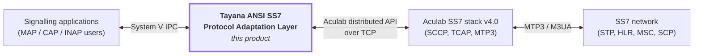

## 2.3 ANSI Protocol Profile

This is the authoritative summary of what the product implements. Full detail is in 6.

### SCCP

| Capability                                  | Status                                                                     |
| ------------------------------------------- | -------------------------------------------------------------------------- |
| Connectionless Class 0 (UDT)                | **Supported**                                                              |
| Connectionless Class 1 (sequenced UDT)      | **Supported** — protocol class carried from the application                |
| UDTS / return-on-error                      | **Supported on receive**, surfaced as a NOTICE event with the return cause |
| Connection-oriented Class 2 / Class 3       | **Not supported** — the Aculab CO API is deliberately unused               |
| XUDT / XUDTS / LUDT (segmentation)          | **Not supported** — no segmentation or reassembly is performed             |
| Addressing by point code, SSN, global title | **Supported**                                                              |
| Route-on-GT and route-on-SSN                | **Supported**                                                              |
| Local Global Title Translation              | **Not performed** — delegated to the Aculab stack and network STPs         |
| 24-bit ANSI point codes                     | **Supported** (1 … 16,777,215)                                             |

### TCAP

| Package type                    | Status        |
| ------------------------------- | ------------- |
| Query With Permission           | **Supported** |
| Query Without Permission        | **Supported** |
| Conversation With Permission    | **Supported** |
| Conversation Without Permission | **Supported** |
| Response                        | **Supported** |
| Abort                           | **Supported** |
| Unidirectional                  | **Supported** |

| Component type                    | Status        |
| --------------------------------- | ------------- |
| Invoke (Last and Not Last)        | **Supported** |
| Return Result (Last and Not Last) | **Supported** |
| Return Error                      | **Supported** |
| Reject                            | **Supported** |

### ANSI encoding characteristics

| Characteristic             | Treatment                                                                                                                                                                                         |
| -------------------------- | ------------------------------------------------------------------------------------------------------------------------------------------------------------------------------------------------- |
| Transaction ID             | Single ANSI transaction-ID tag carrying 4 bytes (one ID) or 8 bytes (originating + destination)                                                                                                   |
| Invoke ID / Correlation ID | ANSI Invoke ID and Correlation (linked) ID tags                                                                                                                                                   |
| Operation code             | **National** (integer) and **Private** (Family + Specifier, 2 bytes) both supported and round-tripped                                                                                             |
| Error code                 | National and Private forms both supported                                                                                                                                                         |
| Dialogue portion           | **ANSI TCAP has no dialogue portion.** Applications must not expect one                                                                                                                           |
| Application context        | Not carried in the ANSI message structure                                                                                                                                                         |
| Global title               | GTI derived from the Translation Type / Numbering Plan / Encoding Scheme combination. **Nature of Address Indicator is deliberately suppressed** — it is not part of the ANSI global title header |

## 2.4 Constraints and Non-Goals

| Constraint               | Consequence                                                                                                         |
| ------------------------ | ------------------------------------------------------------------------------------------------------------------- |
| Connectionless SCCP only | No SCCP connection establishment, data transfer or release. Applications requiring Class 2/3 service are not served |
| No segmentation          | Messages larger than the SCCP payload limit are the network's problem. See 6.8                                      |
| No local GTT             | The deployment must have STPs or Aculab-side translation performing GT resolution                                   |
| No persistence           | Nothing survives a process restart except shared memory, whose contents become partially invalid. See 11.6          |
| Linux only               | System V IPC, POSIX threads, and the Aculab Linux shared objects                                                    |
| One process per SSN      | An SSN's traffic is isolated but also serialised through that process's thread set                                  |
| Local co-residency       | Applications must run on the same host as their handler. System V IPC does not cross hosts                          |

## 2.5 Product Context in the Operator Network

The product occupies the SCCP/TCAP user position at a signalling point. Its peers over
the SS7 network are whatever nodes the operator's applications transact with —
typically HLR, MSC/VLR, SCP and SMSC — reached through one or more STPs which perform
global title translation on the product's behalf.

The product does not terminate SS7 links. Link, linkset and route provisioning belongs
to the Aculab stack configuration and is owned by the deployment, not by this product.

---

# 3. System Context

## 3.1 Context Diagram

**Diagram D-01 — System context.**

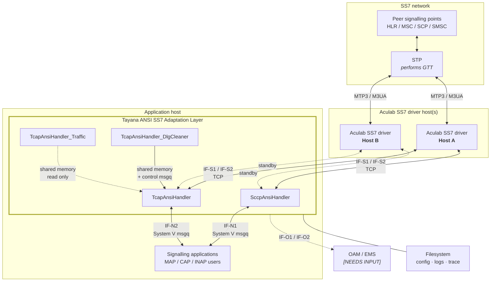

## 3.2 External Interface Summary

| ID      | Peer                   | Transport                   | Protocol / payload                      | Direction               | Mode                      | Detail     |
| ------- | ---------------------- | --------------------------- | --------------------------------------- | ----------------------- | ------------------------- | ---------- |
| `IF-N1` | Application            | System V message queue      | `_SccpInfo`                             | Bidirectional           | Async                     | 12.2       |
| `IF-N2` | Application            | System V message queue      | `AnsiTcapMsg`                           | Bidirectional           | Async                     | 12.3       |
| `IF-S1` | Aculab SS7 driver      | TCP (inside Aculab library) | Aculab distributed SCCP API             | Bidirectional           | Async, polled             | 12.4       |
| `IF-S2` | Aculab SS7 driver      | TCP (inside Aculab library) | Aculab distributed TCAP API             | Bidirectional           | Async, polled             | 12.5       |
| `IF-C1` | Filesystem             | File                        | Product and Aculab-native configuration | Inbound                 | Read at start / on signal | 12.6, 17   |
| `IF-P1` | Operator / init system | POSIX signals               | Signal number                           | Inbound                 | Async                     | 12.7, 13.3 |
| `IF-O1` | OAM reader             | System V shared memory      | Peg counters                            | Outbound                | Polled by reader          | 12.9, 16.4 |
| `IF-O2` | OAM / operator         | Files, stdout               | Log records, trace lines                | Outbound                | Streaming                 | 12.9, 16.2 |
| `IF-B1` | `TcapAnsiHandler`      | System V message queue      | `AnsiTcapMsg`                           | `_DlgCleaner` → handler | Async                     | 12.8       |

## 3.3 Actor Responsibility Matrix

The most common scoping dispute in an SS7 integration is who owns which layer. This
table is the answer.

| Responsibility                        | Network / STP | Aculab stack | **This product** | Application |
| ------------------------------------- | ------------- | ------------ | ---------------- | ----------- |
| MTP2 / MTP3 link management           | ●             | ●            |                  |             |
| Route and linkset provisioning        | ●             | ●            |                  |             |
| Global Title Translation              | ●             | ○            |                  |             |
| SCCP message assembly on the wire     |               | ●            |                  |             |
| SCCP addressing field population      |               | ○            | ●                | ○           |
| Destination point-code selection      |               |              | ●                |             |
| SCCP protocol class and return option |               |              | ●                | ●           |
| ANSI TCAP encoding — SCCP path        |               |              | ●                |             |
| ANSI TCAP encoding — TCAP path        |               | ●            | ○                |             |
| Transaction ID allocation             |               | ●            | ○                |             |
| Dialogue identity and lifetime        |               |              | ●                | ●           |
| Dialogue timeout and cleanup          |               |              | ●                |             |
| Component construction                |               |              | ○                | ●           |
| Operation and parameter semantics     |               |              |                  | ●           |
| Application context / service logic   |               |              |                  | ●           |
| SP and SSN status subscription        |               | ●            | ●                |             |
| Flow control response                 |               | ●            | ●                |             |
| Statistics and logs for this layer    |               | ○            | ●                |             |

● = primary owner ○ = contributes

## 3.4 Assumptions and Environment Dependencies

| #    | Assumption                                                                                                            | Consequence if false                                                         |
| ---- | --------------------------------------------------------------------------------------------------------------------- | ---------------------------------------------------------------------------- |
| A-01 | The Aculab SS7 driver is installed, licensed and running on at least one of host A / host B                           | SAP connection fails; the handler loops in reconnect and passes no traffic   |
| A-02 | MTP3 / M3UA linksets and routes are provisioned in the Aculab stack configuration                                     | Messages are accepted by the SAP but never reach the network                 |
| A-03 | Global title translation is performed by the network STPs or the Aculab stack                                         | GT-addressed messages are not delivered; the product performs no translation |
| A-04 | Applications run on the same host as their handler, under a UID able to access the IPC keys                           | The northbound interface cannot be established                               |
| A-05 | `PRODUCT_HOME` and `PRODUCT_CFG_PATH` are set in the process environment                                              | Configuration path construction dereferences a null pointer — see R-07       |
| A-06 | The Tayana framework libraries (`libSs7Util.a`, `libutil.a`) and build framework are available at the pinned versions | The product cannot be built. See 14.3                                        |
| A-07 | Kernel System V IPC limits are sized for the configured capacity                                                      | Queue or shared-memory creation fails at startup. See 10.7                   |
| A-08 | Every process sharing a message queue is built with an identical compile-flag set                                     | Structure sizes disagree across the interface — see R-01                     |
| A-09 | The configured local point code matches the one in the Aculab SAP configuration                                       | SAP creation is rejected as a fatal error. See 7.5                           |

---

# 4. Architecture Overview

## 4.1 Architectural Drivers

| #     | Driver                                                                                                | Architectural response                                                                                         |
| ----- | ----------------------------------------------------------------------------------------------------- | -------------------------------------------------------------------------------------------------------------- |
| AQ-01 | **Fault isolation between subsystems** — one application's failure must not stop another's signalling | One OS process per SSN, each owning its own SAP, IPC queues and threads                                        |
| AQ-02 | **Survivability of Aculab link loss** — signalling must resume automatically when the driver returns  | Supervisor thread with health evaluation, SAP re-creation and reconnect; dual host A/B attachment              |
| AQ-03 | **Throughput** — sustained transaction rates with bounded latency                                     | Dedicated receive and transmit threads per SAP instance; multiple SAP instances per process; lock-light design |
| AQ-04 | **Dialogue capacity** — large numbers of concurrent transactions                                      | Shared-memory dialogue pool sized to 500,000 records, with an O(1) free-index ring                             |
| AQ-05 | **Operability without restart** — configuration and diagnostics changeable in service                 | Signal-driven configuration reload and trace toggle                                                            |
| AQ-06 | **Diagnosability** — a signalling fault must be attributable from logs alone                          | Three independent observability channels: structured logs, developer trace, peg counters                       |
| AQ-07 | **Recovery of in-flight dialogues** across a SAP reconnect                                            | Aculab transaction restoration driven from the shared-memory pool                                              |

## 4.2 Architecture Principles

| #    | Principle                                                                                             | Rationale                                                                                                                |
| ---- | ----------------------------------------------------------------------------------------------------- | ------------------------------------------------------------------------------------------------------------------------ |
| P-01 | **All Aculab API calls are confined to one adaptation class per module** (`SccpAculab`, `TcapAculab`) | Contains the third-party dependency; makes an Aculab version upgrade a bounded change                                    |
| P-02 | **One process per SSN**                                                                               | Fault isolation, independent lifecycle, independent configuration                                                        |
| P-03 | **Shared memory only for state that must outlive or cross a process**                                 | Everything else stays in process memory, avoiding cross-process locking                                                  |
| P-04 | **Fail fast on configuration error, fail soft on link error**                                         | A misconfiguration is a deployment defect and must be visible immediately; a link failure is expected and must self-heal |
| P-05 | **No persistence**                                                                                    | The product holds no durable state; recovery semantics are simple and explicit                                           |
| P-06 | **Every received message is released back to the stack on every exit path**                           | Flow control depends on it. See 9.3                                                                                      |
| P-07 | **The application owns protocol semantics; the product owns protocol encoding**                       | Keeps service logic out of the adaptation layer                                                                          |

## 4.3 Architecture View Map

The architecture is documented against the **4+1 view model**, so that coverage is
provable rather than asserted. Each view has a dedicated chapter.

| View            | Chapter | Answers                                                            |
| --------------- | ------- | ------------------------------------------------------------------ |
| **Logical**     | 5       | What are the functional parts, and what is each responsible for?   |
| **Process**     | 8       | What runs, in how many threads, and how is concurrency controlled? |
| **Development** | 14      | How is the source organised, and how is it built?                  |
| **Physical**    | 15      | What is deployed where, and how is it sized?                       |
| **Scenarios**   | 12.10   | How do the views combine to satisfy a real call flow?              |

Five further chapters carry domain-specific architecture that does not belong to a
single 4+1 view:

| Chapter | Domain                                                       |
| ------- | ------------------------------------------------------------ |
| 6       | Protocol architecture — the ANSI profile and its encoding    |
| 7       | SAP architecture — the Aculab attachment model               |
| 9       | Buffering, flow control and ring buffers                     |
| 10      | System V IPC architecture                                    |
| 13      | Control plane — startup, signals, reload, recovery, shutdown |
| 16      | Observability architecture                                   |
| 17      | Configuration architecture                                   |

## 4.4 End-to-End Signalling Path

This is the spine of the document. Every subsequent chapter elaborates one or more of
these hops.

**Diagram D-02 — End-to-end signalling path.**

```mermaid
flowchart LR
    N["<b>1</b><br/>Peer SP / STP<br/><i>SS7 network</i>"]
    M["<b>2</b><br/>MTP3 / M3UA<br/><i>Aculab driver</i>"]
    T["<b>3</b><br/>TCP<br/><i>host A / host B</i>"]
    S["<b>4</b><br/>SSAP object<br/><i>Aculab library</i>"]
    R["<b>5</b><br/>Rx / Tx threads<br/><i>this product</i>"]
    Q["<b>6</b><br/>System V msgq<br/><i>this product</i>"]
    A["<b>7</b><br/>Application"]

    N <-->|MSU| M
    M <-->|"MTP-TRANSFER"| T
    T <-->|"Aculab distributed protocol"| S
    S <-->|"acu_*_msg_t"| R
    R <-->|"_SccpInfo / AnsiTcapMsg"| Q
    Q <--> A

    style R stroke-width:3px
    style Q stroke-width:3px
```

| Hop   | Boundary                                              | Data unit                             | Owner                                | Failure surfaces as                                                       |
| ----- | ----------------------------------------------------- | ------------------------------------- | ------------------------------------ | ------------------------------------------------------------------------- |
| **1** | Peer SP / STP ↔ SS7 network                           | MSU                                   | Operator network                     | Destination point code prohibited; subsystem out of service; no route     |
| **2** | MTP3 / M3UA ↔ Aculab SS7 driver                       | MTP-TRANSFER primitive                | Aculab configuration                 | Link or linkset down; local point code not configured                     |
| **3** | Aculab driver ↔ module, over TCP to host A and host B | Aculab distributed protocol           | This product (client side) + network | Connection state change, connect timeout, login rejected, both hosts down |
| **4** | Aculab library ↔ **SSAP object**                      | `acu_sccp_msg_t` / `acu_tcap_msg_t`   | This product                         | SAP create failure, point-code mismatch, SAP `EXITING`                    |
| **5** | SSAP ↔ Rx / Tx threads                                | Internal decoded or encoded structure | This product                         | Poll timeout, decode failure, encode failure, ring-buffer stall           |
| **6** | Module ↔ **System V message queue**                   | `_SccpInfo` / `AnsiTcapMsg`           | This product + application           | Queue full, message too large, queue removed, key collision               |
| **7** | Message queue ↔ application                           | Application semantics                 | Application                          | Application not draining; dialogue abandoned                              |

**Reading the table.** Hops 1 and 2 are outside the product but inside the fault
domain — a large share of production incidents originate there and surface here as
status events, so 7.7 documents how they are detected. Hops 3 to 6 are wholly owned
by this product. Hop 7 is the application's responsibility, but backpressure from it
propagates all the way to hop 3, which is why 9 treats the whole chain as one system.

## 4.5 Layered Architecture

**Diagram D-03 — Protocol layering and where each layer is processed.**

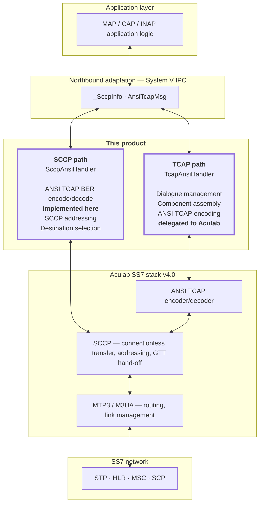

### The encoding asymmetry, stated and defended

The two paths differ in a way that matters and must not be discovered by surprise
during integration:

|                                  | SCCP path (`SccpAnsiHandler`)                                                                           | TCAP path (`TcapAnsiHandler`)                                   |
| -------------------------------- | ------------------------------------------------------------------------------------------------------- | --------------------------------------------------------------- |
| ANSI TCAP encoding               | **Implemented in this product**, by hand, against the ANSI tag table in `sccp/include/MsuAnsiStructs.h` | **Delegated to the Aculab stack** via the component-builder API |
| Aculab service used              | SCCP connectionless transfer only                                                                       | TCAP transaction and component services                         |
| What the product hands to Aculab | An opaque, fully encoded TCAP byte string                                                               | Structured component data                                       |
| Dialogue state                   | None. Every message is independent                                                                      | Full dialogue pool with identity, timeout and restoration       |

**Why both exist.** The SCCP path serves applications that want to own the transaction
layer themselves and need only connectionless transport with ANSI TCAP framing. The
TCAP path serves applications that want the stack to manage transactions. They are
alternative northbound services, not layers of one another — an application uses one or
the other.

**The cost.** ANSI TCAP encoding knowledge exists in two places, only one of which is
Aculab-maintained. The hand-rolled codec is therefore the product's highest-value
review surface and its tag table has a recorded history of encoding defects. This is
carried as **R-10** in 21.3, and drives the requirement in 20 that Appendix C
reproduce the tag table with a clause citation per tag.

## 4.6 Architecture Decision Register

| ID        | Decision                                                                          | Rationale                                                                                                                                                             | Alternatives rejected                                      | Consequences                                                                                                                                   | Status                          |
| --------- | --------------------------------------------------------------------------------- | --------------------------------------------------------------------------------------------------------------------------------------------------------------------- | ---------------------------------------------------------- | ---------------------------------------------------------------------------------------------------------------------------------------------- | ------------------------------- |
| **AD-01** | One OS process per SSN                                                            | Fault isolation (AQ-01); independent configuration and lifecycle per subsystem                                                                                        | Single multiplexing process for all SSNs                   | More processes to supervise; per-SSN IPC key allocation required                                                                               | Accepted                        |
| **AD-02** | System V message queues for the northbound interface                              | Kernel-buffered, no connection management, matches the existing Tayana framework                                                                                      | UNIX domain sockets; shared-memory ring; TCP               | Hard co-residency requirement (15.2); IPC key management and cleanup burden (10.8); default 0666 permissions are a local attack surface (18.5) | Accepted                        |
| **AD-03** | Dialogue pool in System V shared memory rather than process-private memory        | Lets the cleaner and statistics processes observe dialogue state without touching the handler's threads (AQ-04)                                                       | In-process map with an internal timer wheel                | Cross-process locking required; raw pointers stored in shared memory become invalid across restart (R-05)                                      | Accepted                        |
| **AD-04** | Hand-rolled ANSI BER codec in the SCCP path; Aculab encoder in the TCAP path      | The SCCP path deliberately exposes raw connectionless transport; encoding there cannot be delegated because no Aculab TCAP SAP is involved                            | Routing all TCAP framing through the Aculab TCAP SAP       | Dual maintenance surface for ANSI encoding knowledge (R-10)                                                                                    | Accepted — see 4.5              |
| **AD-05** | Aculab transaction handles stored in the shared-memory dialogue record            | Gives O(1) dialogue → transaction resolution without a second index                                                                                                   | Storing an opaque key and re-resolving through Aculab      | Pointers are process-address-space values; readers other than the owning handler must never dereference them (R-05)                            | Accepted with constraint        |
| **AD-06** | Global Title Translation delegated entirely to the network and the Aculab stack   | GTT is an operator routing policy, not application logic; STPs already own it                                                                                         | Local translation tables in the product                    | The deployment must guarantee GTT capability (A-03); the product cannot diagnose translation failures beyond the returned cause                | Accepted                        |
| **AD-07** | Polling the Aculab API rather than using its event-driven interface               | Simple, predictable thread model; one blocking call per receive thread                                                                                                | `select()`-style event API with a single dispatcher thread | A fixed poll timeout becomes the receive latency floor (9.6); thread count scales with SAP instances                                           | Accepted                        |
| **AD-08** | Detached worker threads with a supervisor loop, rather than a managed thread pool | Minimal machinery; a failed SAP instance's threads exit on their own                                                                                                  | Thread pool with explicit lifecycle management             | Threads are never joined; a reconnect that re-spawns them accumulates threads (R-03)                                                           | Accepted with defect — see R-03 |
| **AD-09** | A separate cleaner process for dialogue timeout, rather than an in-handler timer  | Keeps a full-pool scan off the handler's latency path; keeps all Aculab manipulation inside the handler by making the cleaner request teardown rather than perform it | In-handler timer wheel or per-dialogue Aculab timer        | An extra process to deploy and supervise; the cleaner and handler must agree on the message contract (R-02)                                    | Accepted                        |
| **AD-10** | Static libraries rather than shared objects for the product's own code            | Single-file deployment per binary; no runtime library path management                                                                                                 | Shared objects                                             | Every binary must be rebuilt when a shared header changes (19.5)                                                                               | Accepted                        |

---

# 5. Logical / Functional Architecture

_This chapter is the **Logical view** of the 4+1 model (4.3)._

## 5.1 Functional Decomposition

```mermaid
flowchart TB
    ROOT["ANSI SS7 Protocol Adaptation Layer"]

    ROOT --- F1["<b>F1 Protocol encoding</b>"]
    ROOT --- F2["<b>F2 Transfer services</b>"]
    ROOT --- F3["<b>F3 Dialogue management</b>"]
    ROOT --- F4["<b>F4 Network management</b>"]
    ROOT --- F5["<b>F5 Resource control</b>"]
    ROOT --- F6["<b>F6 Platform services</b>"]

    F1 --- F11["F1.1 ANSI TCAP encode/decode"]
    F1 --- F12["F1.2 SCCP address encode/decode"]
    F1 --- F13["F1.3 Component construction and parsing"]

    F2 --- F21["F2.1 Connectionless transfer"]
    F2 --- F22["F2.2 Destination selection"]
    F2 --- F23["F2.3 Transaction transfer"]

    F3 --- F31["F3.1 Dialogue identity allocation"]
    F3 --- F32["F3.2 Dialogue to transaction binding"]
    F3 --- F33["F3.3 Dialogue timeout and reaping"]
    F3 --- F34["F3.4 Dialogue restoration"]
    F3 --- F35["F3.5 Multi-component assembly"]

    F4 --- F41["F4.1 SP status tracking"]
    F4 --- F42["F4.2 Subsystem status tracking"]
    F4 --- F43["F4.3 SAP health and reconnect"]
    F4 --- F44["F4.4 Dual-host failover"]

    F5 --- F51["F5.1 Flow control response"]
    F5 --- F52["F5.2 Transmit rate limiting"]
    F5 --- F53["F5.3 Buffer credit release"]

    F6 --- F61["F6.1 Configuration"]
    F6 --- F62["F6.2 Logging, trace, statistics"]
    F6 --- F63["F6.3 Process control and lifecycle"]
```

## 5.2 Component Model

**Diagram D-04 — Component model.**

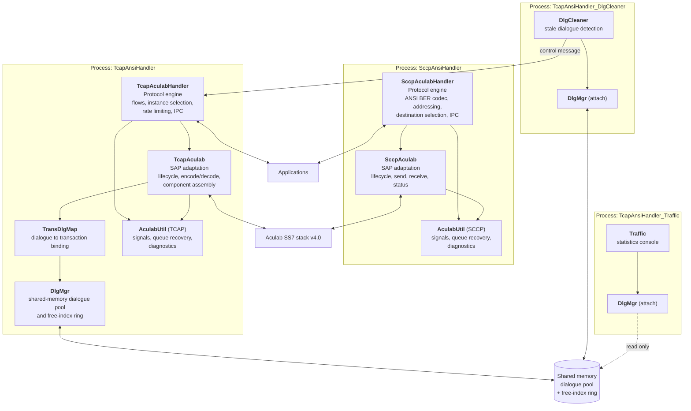

| Component           | Type                                       | Module  | Responsibility                                                                                                                                                               |
| ------------------- | ------------------------------------------ | ------- | ---------------------------------------------------------------------------------------------------------------------------------------------------------------------------- |
| `SccpAculabHandler` | Class                                      | `sccp/` | SCCP protocol engine: ANSI TCAP BER encode and decode, SCCP address translation, destination selection, IPC queue management, statistics                                     |
| `SccpAculab`        | Class, in `libSccpAculabApi.a`             | `sccp/` | The only place SCCP Aculab calls are made (P-01): SAP lifecycle, transmit, receive, connection state, status query                                                           |
| `AculabUtil` (SCCP) | All-static class, in `libSccpAculabUtil.a` | `sccp/` | Signal handling and run-state flags, message-queue error recovery, enumeration-to-string conversion, diagnostic printing                                                     |
| `TcapAculabHandler` | Class                                      | `tcap/` | TCAP protocol engine: message flows in both directions, SAP instance selection, dialogue state transitions, rate limiting, IPC                                               |
| `TcapAculab`        | Class, in `libAculabApi.a`                 | `tcap/` | The only place TCAP Aculab calls are made: SAP lifecycle, transaction and message operations, component encode and decode, address translation, multi-component accumulation |
| `TransDlgMap`       | Class, in `libAculabTransDlgMap.a`         | `tcap/` | Binds a dialogue identifier to an Aculab transaction handle in both directions                                                                                               |
| `DlgMgr`            | Class, in `libAculabDlgMgr.a`              | `tcap/` | Owns the shared-memory dialogue record pool, the free-index ring and the guarding semaphore                                                                                  |
| `AculabUtil` (TCAP) | All-static class, in `libAculabUtil.a`     | `tcap/` | As the SCCP counterpart, plus per-SAP-instance transmit gating flags                                                                                                         |
| `DlgCleaner`        | Class                                      | `tcap/` | Scans the dialogue pool for expired records and requests their teardown from the handler                                                                                     |
| `Traffic`           | Class                                      | `tcap/` | Reads peg counters and dialogue-pool occupancy for console display. Inert in this baseline — see R-14                                                                        |

## 5.3 Feature-to-Component Allocation

| Feature                           | `SccpAnsiHandler` | `TcapAnsiHandler` | `_DlgCleaner` | `_Traffic` | Aculab stack | Application |
| --------------------------------- | ----------------- | ----------------- | ------------- | ---------- | ------------ | ----------- |
| F1.1 ANSI TCAP encode/decode      | ●                 |                   |               |            | ●            |             |
| F1.2 SCCP address encode/decode   | ●                 | ●                 |               |            | ●            | ○           |
| F1.3 Component construction       | ○                 | ●                 |               |            | ●            | ●           |
| F2.1 Connectionless transfer      | ●                 |                   |               |            | ●            |             |
| F2.2 Destination selection        | ●                 | ○                 |               |            |              |             |
| F2.3 Transaction transfer         |                   | ●                 |               |            | ●            |             |
| F3.1 Dialogue identity allocation |                   | ●                 |               |            |              | ○           |
| F3.2 Dialogue↔transaction binding |                   | ●                 |               |            |              |             |
| F3.3 Dialogue timeout and reaping |                   | ○                 | ●             |            |              |             |
| F3.4 Dialogue restoration         |                   | ●                 |               |            | ●            |             |
| F3.5 Multi-component assembly     |                   | ●                 |               |            |              | ●           |
| F4.1 SP status tracking           | ●                 | ●                 |               |            | ●            |             |
| F4.2 Subsystem status tracking    | ●                 | ●                 |               |            | ●            |             |
| F4.3 SAP health and reconnect     | ●                 | ●                 |               |            |              |             |
| F4.4 Dual-host failover           | ○                 | ●                 |               |            | ●            |             |
| F5.1 Flow control response        | ●                 | ●                 |               |            | ●            |             |
| F5.2 Transmit rate limiting       |                   | ●                 |               |            |              |             |
| F5.3 Buffer credit release        | ●                 | ●                 |               |            |              |             |
| F6.1 Configuration                | ●                 | ●                 | ●             | ●          | ●            |             |
| F6.2 Logging, trace, statistics   | ●                 | ●                 | ●             | ●          | ●            |             |
| F6.3 Process control              | ●                 | ●                 | ●             | ●          |              |             |

● = primary owner ○ = contributes

**Reading this table.** Two conclusions matter for integration planning. First, dialogue
management is entirely a TCAP-path concern — an application using the SCCP path owns its
own transaction state. Second, several features are shared with the Aculab stack rather
than owned outright; for those, a fault may originate on either side, which is why 7.7
documents the status event model in detail.

## 5.4 Component Interaction Matrix

| From ↓ To →       | `SccpAnsiHandler` | `TcapAnsiHandler`       | `_DlgCleaner` | Shared memory             | Aculab          | Application             |
| ----------------- | ----------------- | ----------------------- | ------------- | ------------------------- | --------------- | ----------------------- |
| `SccpAnsiHandler` | —                 |                         |               | Peg segment               | Aculab SCCP API | System V msgq (`IF-N1`) |
| `TcapAnsiHandler` |                   | —                       |               | Dialogue pool, ring, peg  | Aculab TCAP API | System V msgq (`IF-N2`) |
| `_DlgCleaner`     |                   | System V msgq (`IF-B1`) | —             | Dialogue pool, ring       |                 |                         |
| `_Traffic`        |                   |                         |               | Dialogue pool, peg (read) |                 |                         |
| Application       | System V msgq     | System V msgq           |               |                           |                 | —                       |

There is **no direct interaction between `SccpAnsiHandler` and `TcapAnsiHandler`.** They
are alternative northbound services (4.5), not a stack. An application selects one.

## 5.5 Key Abstractions and Their Lifetimes

| Abstraction              | Created by                                                               | Destroyed by                                    | Lives in                   | Scope           | Survives process restart                     |
| ------------------------ | ------------------------------------------------------------------------ | ----------------------------------------------- | -------------------------- | --------------- | -------------------------------------------- |
| SSAP                     | `acu_*_ssap_create` at startup or reconnect                              | `acu_*_ssap_delete` on reconnect or exit        | Aculab library heap        | One process     | No                                           |
| Host connection (A / B)  | Aculab, during SAP connect                                               | Aculab, on SAP delete                           | Aculab library             | One SSAP        | No                                           |
| SCCP unitdata connection | `acu_sccp_ssap_get_unitdata_con`, lazily on first connection-state event | With the SSAP                                   | Aculab library             | One SSAP        | No                                           |
| TCAP transaction         | `acu_tcap_transaction_create` or restore                                 | `acu_tcap_transaction_delete` at dialogue end   | Aculab library             | One dialogue    | Only via restoration (13.5)                  |
| Dialogue record          | `DlgMgr` allocation                                                      | `DlgMgr` release, or cleaner-triggered teardown | **System V shared memory** | Deployment-wide | Data yes, embedded handles **no** — see R-05 |
| Aculab message           | `acu_tcap_msg_alloc`, or delivered by receive                            | `acu_*_msg_free` on every exit path (P-06)      | Aculab library             | One message     | No                                           |
| Northbound message       | Application or handler                                                   | Consumed on read                                | System V message queue     | Until read      | Queued messages yes                          |
| Peg counter              | Process init                                                             | Never (persists in shared memory)               | System V shared memory     | Deployment-wide | Yes                                          |

---

# 6. Protocol Architecture (ANSI)

## 6.1 SCCP Profile

`SccpAnsiHandler` provides **connectionless SCCP transfer only**. The northbound
message type discriminates two values, of which only one is accepted for transmission
(`sccp/src/SccpAculabHandler.cc:434`):

| Value | Constant        | Direction    | Handling                                                            |
| ----- | --------------- | ------------ | ------------------------------------------------------------------- |
| 9     | `SCCP_MSG_UDT`  | Both         | Transmitted and received                                            |
| 10    | `SCCP_MSG_UDTS` | Receive only | Surfaced from the stack as a notice event carrying the return cause |

Any other value on transmit is discarded with a diagnostic
(`sccp/src/SccpAculabHandler.cc:596`).

### Protocol class and return option

Both are carried in a single byte, `pcMsgHdlg`, defined as an anonymous union of a raw
byte and a bit pair in `_SccpUdt` (`include/MsuStructs.h`):

| Bits     | Field        | Meaning                     |
| -------- | ------------ | --------------------------- |
| 0–3      | `protoClass` | SCCP protocol class, 0 or 1 |
| 4–7      | `msgHdlg`    | Message handling            |
| 7 (0x80) | —            | Return-on-error requested   |

On receive, the byte is reconstructed from the Aculab message as
`(class & 0x0F) | (return_option ? 0x80 : 0)`. On transmit, bit 0x80 is mapped onto the
Aculab connection's return-option quality-of-service setting
(`sccp/src/SccpAculabHandler.cc:570`). The mapping is applied **after** the address is
set, because the connection object is not resolved until then — an ordering constraint
recorded in the source.

### Quality of service applied to the connection

| Aculab QoS parameter | Value set                            | Where                           |
| -------------------- | ------------------------------------ | ------------------------------- |
| Priority             | 0                                    | `sccp/src/SccpAculabApi.cc:667` |
| Response priority    | 1                                    | `sccp/src/SccpAculabApi.cc:668` |
| Return option        | Per-message, from `pcMsgHdlg & 0x80` | `sccp/src/SccpAculabApi.cc:713` |

None of these are configurable. `[NEEDS INPUT: should priority and response priority be exposed as configuration?]`

### Scope boundary — connection-oriented service

Connection-oriented SCCP (Class 2 and Class 3) is **not implemented**. The product
obtains exactly one connection object, the _unitdata connection_, from
`acu_sccp_ssap_get_unitdata_con` (`sccp/src/SccpAculabApi.cc:663`), and the only
transmit primitive used is `acu_sccp_unitdata_request`
(`sccp/src/SccpAculabApi.cc:384`).

The connection-oriented event types are recognised and named by the diagnostic
converter but are routed to the default branch of the receive handler, where they are
released and discarded (`sccp/src/SccpAculabHandler.cc:744`). An application must not
infer support from the fact that these event names appear in logs. The corresponding
"deliberately not used" API list is in 12.4.

## 6.2 SCCP Addressing Architecture

Addressing is where the largest share of integration effort is spent, because three
representations are in play at once: the application's flat structure, the Aculab
address object, and the ANSI address field on the wire.

**Diagram D-05 — SCCP address structure and global title encoding.**

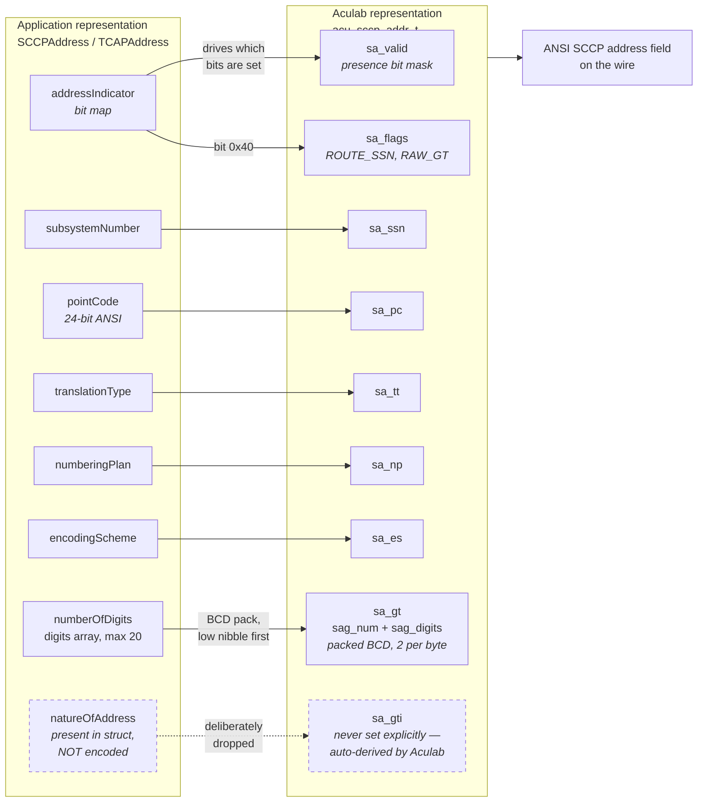

### Address indicator bit map

The application's `addressIndicator` byte drives which Aculab presence bits are set.
The encode-side mapping is (`sccp/src/SccpAculabHandler.cc:1551-1625`):

| Application AI bit | Effect on the Aculab address                                                                                                | Source  |
| ------------------ | --------------------------------------------------------------------------------------------------------------------------- | ------- |
| `0x01`             | Set point-code valid; copy `pointCode`                                                                                      | `:1584` |
| `0x02`             | Set subsystem valid; copy `subsystemNumber`                                                                                 | `:1589` |
| `0x04`             | **No effect.** This bit selects Nature of Address, which ANSI does not carry. The branch exists and is deliberately empty   | `:1594` |
| `0x08`             | Set translation-type valid; copy `translationType`                                                                          | `:1600` |
| `0x0C`             | Set translation type, numbering plan and encoding scheme valid; copy all three                                              | `:1605` |
| `0x10`             | Set translation type, numbering plan and encoding scheme valid; copy all three. Nature of Address is explicitly **not** set | `:1614` |
| `0x40`             | Set the route-on-subsystem flag on the Aculab address                                                                       | `:1551` |

The decode side performs the inverse reconstruction, deriving the application's
`addressIndicator` from the Aculab presence mask.

### Two ANSI-specific decisions, both deliberate

**1. The Global Title Indicator is never set explicitly.** The encode path does not set
the Aculab GTI-valid bit (`sccp/src/SccpAculabHandler.cc:1557-1561`). The reason is
recorded in the source: setting GTI-valid without also supplying a GTI value causes the
Aculab library to default to a GTI of 1, which is the Nature-of-Address-only format and
wrong for ANSI. By leaving GTI unset, the library derives the correct ANSI GTI-4 form
from the translation type, numbering plan and encoding scheme presence bits.

**2. Nature of Address is suppressed.** ANSI global titles do not carry a Nature of
Address Indicator `[ANSI-T1.112 NEEDS-CLAUSE]`. The field exists in the application
structure for structural compatibility but is never encoded, in either the AI-bit-`0x04`
branch or the AI-bit-`0x10` branch. Both suppressions are explicitly commented in the
source rather than being accidental omissions.

> **Integration note.** An application that populates `natureOfAddress` will see the
> field silently dropped. This is correct ANSI behaviour and not a defect.

### Global title digit packing

Digits are packed two per byte, low nibble first
(`sccp/src/SccpAculabHandler.cc:1573-1578`):

```
sag_digits[j]  =  digits[i]   & 0x0F          // low nibble  = first digit
sag_digits[j] |= (digits[i+1] << 4) & 0xF0    // high nibble = second digit
```

The byte count is `ceil(numberOfDigits / 2)`. When the encoding scheme is BCD-odd, the
high nibble of the final byte is masked off (`:1579-1582`). The maximum is
`MAX_GLOBAL_TITLE_DIGITS` = 20 (`include/Ss7Structs.h`).

On transmit, the handler first normalises ASCII digits to BCD by subtracting `0x30` when
the first digit exceeds `0x30` (`sccp/src/SccpAculabHandler.cc:439-456`). This means the
interface accepts either representation, but the detection is heuristic: it tests only
the first digit.

`[NEEDS INPUT: should the interface mandate BCD and reject ASCII, rather than detecting heuristically?]`

### Calling / called ↔ local / remote mapping

This mapping reverses between the two directions and is the single most common source of
confusion during integration. It is stated here normatively.

| Direction    | Application field                 | Aculab field       | Meaning                 |
| ------------ | --------------------------------- | ------------------ | ----------------------- |
| **Transmit** | `clgPartyAddress` (calling party) | **local** address  | Who we are              |
| **Transmit** | `cldPartyAddress` (called party)  | **remote** address | Who we are addressing   |
| **Receive**  | `clgPartyAddress` (calling party) | **remote** address | Who sent it             |
| **Receive**  | `cldPartyAddress` (called party)  | **local** address  | Who it was addressed to |

Transmit mapping: `sccp/src/SccpAculabHandler.cc:476` and `:483`. The receive mapping is
the mirror image in `DecodeUnitData`.

Stated plainly: **calling party is always the local end, called party is always the
remote end, in both directions.** "Local" and "remote" are Aculab's terms and are
relative to this node, not to the message.

## 6.3 Routing and Destination Selection

### No local Global Title Translation

The product performs no translation (AD-06). Global titles are passed to the Aculab
stack as encoded address fields, and resolution to a point code is the responsibility of
the stack and the network's Signal Transfer Points.

### Destination point code is taken from configuration, not from the message

This is an architectural characteristic that integrators must understand: **the
destination point code the application supplies in the called-party address does not
determine where the message is sent.** After the called-party address is encoded, the
handler overwrites the point code with a value selected from configuration
(`sccp/src/SccpAculabHandler.cc:483-553`).

Two configuration parameters drive the choice:

| Parameter            | Range          | Behaviour if absent                                        |
| -------------------- | -------------- | ---------------------------------------------------------- |
| `SCCP_DESTINATION_1` | 1 … 16,777,215 | Fatal — the handler will not start                         |
| `SCCP_DESTINATION_2` | 1 … 16,777,215 | Non-fatal; set to 0, which selects single-destination mode |

### Selection algorithm

| Configuration                                 | Behaviour                                                                                                                                                                                     |
| --------------------------------------------- | --------------------------------------------------------------------------------------------------------------------------------------------------------------------------------------------- |
| `SCCP_DESTINATION_2` = 0 (single destination) | Use destination 1 if its availability flag is set; otherwise drop the message and log `ACUSCCP24`                                                                                             |
| `SCCP_DESTINATION_2` ≠ 0 (dual destination)   | Alternate between destinations on successive messages using an internal toggle. If the preferred destination is unavailable, use the other. If both are unavailable, drop and log `ACUSCCP24` |

The toggle is a single boolean member flipped on each call
(`sccp/src/SccpAculabHandler.cc:502`, `:529`). This yields strict alternation, not
load-proportional distribution.

> **Design consequence.** Round-robin alternation is stateless with respect to
> destination load or latency. If the two destinations have materially different
> capacity, traffic will not distribute proportionally.
> `[NEEDS INPUT: are the two destinations expected to be equal-capacity mated pairs?]`

### Availability tracking is reactive, not polled

Availability flags are updated **only** when a signalling-point status or subsystem
status event arrives from the stack (7.7). There is no periodic availability probe.

This has a consequence at startup: the flags are not initialised in the constructor, so
until the first status event arrives, **both destinations read as unavailable and all
outbound traffic is dropped** with `ACUSCCP24`. This is recorded as **R-11**.

**Diagram D-07 — SCCP destination availability state machine.**

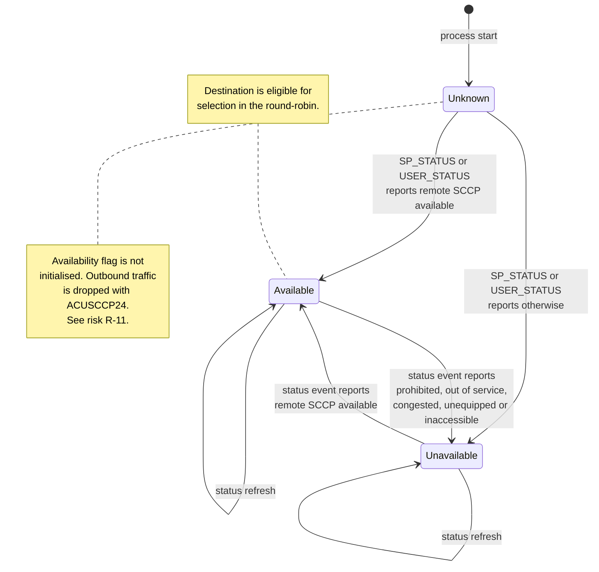

The status query itself is `acu_sccp_get_sccp_status(ssap, destination, 0, &status)`,
and the flag is set when the returned status equals _remote SCCP available_
(`sccp/src/SccpAculabHandler.cc:716`).

## 6.4 TCAP Profile

### Package types

All seven ANSI package types are supported. They are represented internally by the
`EnumTcapDlg` enumeration (`include/TcapStructs.h`), values 11 to 17:

| Value | Enumerator                                  | ANSI package                    |
| ----- | ------------------------------------------- | ------------------------------- |
| 11    | `TCAP_ANSI_QUERY_WITH_PERMISSION`           | Query With Permission           |
| 12    | `TCAP_ANSI_QUERY_WITHOUT_PERMISSION`        | Query Without Permission        |
| 13    | `TCAP_ANSI_RESPONSE`                        | Response                        |
| 14    | `TCAP_ANSI_CONVERSATION_WITH_PERMISSION`    | Conversation With Permission    |
| 15    | `TCAP_ANSI_CONVERSATION_WITHOUT_PERMISSION` | Conversation Without Permission |
| 16    | `TCAP_ANSI_ABORT`                           | Abort                           |
| 17    | `TCAP_ANSI_UNI`                             | Unidirectional                  |

The same enumeration also carries control values that are not wire package types but
internal events — pre-arranged end and response timeout among them. Their handling is
described in 13 and `[TCAP-HLD 10]`.

### Component types

| Enumerator              | ANSI component                                                  |
| ----------------------- | --------------------------------------------------------------- |
| `TCAP_INVOKE_COMP`      | Invoke, Last and Not Last both supported                        |
| `TCAP_RET_RESULT_COMP`  | Return Result, Last and Not Last both supported                 |
| `TCAP_RET_ERROR_COMP`   | Return Error                                                    |
| `TCAP_REJECT_COMP`      | Reject                                                          |
| `TCAP_ABORT_COMP`       | Internal representation of an abort surfaced to the application |
| `TCAP_RSP_TIMEOUT_COMP` | Internal representation of a response timeout                   |

### ANSI TCAP has no dialogue portion

This is stated explicitly because it is a frequent source of integration questions. The
ANSI TCAP message structure carries a transaction portion and a component portion only.
The application message structure used on the TCAP path (`AnsiTcapMsg`) therefore has no
dialogue-portion, application-context or user-information fields, and the code paths
that would populate them are disabled.

Applications must not attempt to negotiate an application context over this interface.

> Note that the **SCCP path** behaves differently: because it hands an opaque encoded
> TCAP byte string to the stack, its decoder does preserve an opaque dialogue-portion
> passthrough field if one is present in the received bytes. This is a transparency
> mechanism, not ANSI dialogue support.

## 6.5 ANSI Identifier and Encoding Model

The authoritative tag set is `sccp/include/MsuAnsiStructs.h`. It is reproduced with
clause citations in Appendix C; the architectural summary follows.

### Package tags

| Tag    | Constant                       | Package                         |
| ------ | ------------------------------ | ------------------------------- |
| `0xE1` | `SS7_ANSI_TRANS_QUERY_WO_PERM` | Query Without Permission        |
| `0xE2` | `SS7_ANSI_TRANS_QUERY_W_PERM`  | Query With Permission           |
| `0xE4` | `SS7_ANSI_TRANS_RESP`          | Response                        |
| `0xE5` | `SS7_ANSI_TRANS_CONV_W_PERM`   | Conversation With Permission    |
| `0xE6` | `SS7_ANSI_TRANS_CONV_WO_PERM`  | Conversation Without Permission |
| `0xE8` | `SS7_ANSI_TRANS_UNI`           | Unidirectional                  |
| `0xF6` | `SS7_ANSI_TRANS_ABORT`         | Abort                           |

### Transaction identifier

ANSI uses a **single** transaction-ID tag, `0xC7` (`SS7_ANSI_TRANS_ID_TAG`), whose
length discriminates the content:

| Length | Content                                   | Used for                                                                                                                                 |
| ------ | ----------------------------------------- | ---------------------------------------------------------------------------------------------------------------------------------------- |
| 4      | One transaction ID                        | Query and Unidirectional carry the originating ID; Response and Abort carry the destination ID if non-zero, otherwise the originating ID |
| 8      | Originating ID followed by destination ID | Conversation                                                                                                                             |

### Component tags

| Tag    | Constant                            | Component               |
| ------ | ----------------------------------- | ----------------------- |
| `0xE9` | `SS7_ANSI_COMP_INVOKE_LAST`         | Invoke, Last            |
| `0xE1` | `SS7_ANSI_COMP_INVOKE_NOT_LAST`     | Invoke, Not Last        |
| `0xEA` | `SS7_ANSI_COMP_RET_RESULT_LAST`     | Return Result, Last     |
| `0xE2` | `SS7_ANSI_COMP_RET_RESULT_NOT_LAST` | Return Result, Not Last |
| `0xEB` | `SS7_ANSI_COMP_RET_ERROR`           | Return Error            |
| `0xEC` | `SS7_ANSI_COMP_REJECT`              | Reject                  |

The component portion is introduced by tag `0xE8` (`SS7_ANSI_COMP_PORTION_TAG`).

> **Note for reviewers.** Tag `0xE8` serves as both the Unidirectional package tag and
> the component portion tag, and `0xE1`/`0xE2` serve as both package tags and Not-Last
> component tags. These are not collisions — the tags are interpreted in different
> positions in the structure — but they make position-sensitive parsing mandatory and
> are worth attention during any codec review.

### Component sub-tags

| Tag    | Constant                         | Content                                                         |
| ------ | -------------------------------- | --------------------------------------------------------------- |
| `0xCF` | `SS7_ANSI_INVOKE_ID_TAG`         | Invoke ID, 1 byte                                               |
| `0xDA` | `SS7_ANSI_LINKED_ID_TAG`         | Correlation ID. Emitted only for Invoke, and only when non-zero |
| `0xD0` | `SS7_ANSI_NATIONAL_OP_CODE_TAG`  | National operation code                                         |
| `0xD1` | `SS7_ANSI_PRIVATE_OP_CODE_TAG`   | Private operation code                                          |
| `0xD3` | `SS7_ANSI_NATIONAL_ERR_CODE_TAG` | National error code                                             |
| `0xD4` | `SS7_ANSI_PRIVATE_ERR_CODE_TAG`  | Private error code                                              |
| `0xF2` | `SS7_ANSI_PARAM_SEQUENCE_TAG`    | Parameter sequence                                              |
| `0xF3` | `SS7_ANSI_PARAM_SET_TAG`         | Parameter set                                                   |

### National versus Private operation codes

This is the most consequential ANSI-specific encoding decision in the product.

|                   | National                                                         | Private                                                           |
| ----------------- | ---------------------------------------------------------------- | ----------------------------------------------------------------- |
| Tag               | `0xD0`                                                           | `0xD1`                                                            |
| Form              | Integer operation code                                           | Family byte followed by Specifier byte                            |
| Application field | `TCAPOperation::operationCode`, `isPrivate = false`              | `TCAPOperation::operationCode`, `isPrivate = true`                |
| Packing           | Encoded directly, length 1–4 bytes by magnitude on the SCCP path | Split as `(code >> 8) & 0xFF` = Family, `code & 0xFF` = Specifier |

The `isPrivate` boolean in `TCAPOperation` (`include/Ss7Structs.h`) is round-tripped: it
is set on decode from the received tag and consulted on encode. **The application must
set it correctly on transmit** — there is no inference from the operation code value.

Error codes follow the same National/Private split, tags `0xD3` and `0xD4`.

### Reject problem codes

| Tag    | Problem category |
| ------ | ---------------- |
| `0xD5` | General          |
| `0xD6` | Invoke           |
| `0xD7` | Return Result    |
| `0xD8` | Return Error     |
| `0xD9` | Transaction      |

The application supplies a `(problemCodeType, problemCode)` pair which is mapped to the
Aculab reject-problem enumeration on the TCAP path. **A defect exists in that mapping:
problem code types 2, 3 and 4 fall through to a failure return
(`tcap/src/TcapAculabApi.cc:3015`), so only type-1 rejects can currently be encoded.**
This is **R-08**.

### Abort causes

Two provider-abort causes are generated by the TCAP path:

| Cause                     | Raised when                                                                                                                                                                                                            |
| ------------------------- | ---------------------------------------------------------------------------------------------------------------------------------------------------------------------------------------------------------------------- |
| Unrecognised package type | Duplicate transaction-initiating message on an existing dialogue; message received with no transaction context; message allocation, initialisation or component-addition failure; no in-service SAP instance available |
| Resource unavailable      | Aculab message decode failure                                                                                                                                                                                          |

## 6.6 The Two Encoding Paths Compared

| Aspect                 | SCCP path — hand-rolled                                                                                                                | TCAP path — Aculab-native                                                  |
| ---------------------- | -------------------------------------------------------------------------------------------------------------------------------------- | -------------------------------------------------------------------------- |
| Where encoding happens | `SccpAculabHandler::EncodeSccpUnitData` (`sccp/src/SccpAculabHandler.cc:1445`), `EncodeComponent` (`:1634`), `EncodeTransId` (`:1524`) | Aculab component-builder calls inside `TcapAculab`                         |
| Where decoding happens | `DecodeUnitData` (`:1068`), `DecodeComponent` (`:865`)                                                                                 | `acu_tcap_msg_decode` plus component iteration                             |
| Tag knowledge          | In this product, in `MsuAnsiStructs.h`                                                                                                 | In the Aculab library                                                      |
| Length forms           | Definite short form; definite long form with a one-byte extension; indefinite form recognised on decode                                | Controlled by an Aculab configuration setting that forces definite lengths |
| Length back-patching   | Performed after the fact, shifting the buffer when a length exceeds `0x7F`                                                             | Not applicable                                                             |
| Operation code length  | Variable, 1 to 4 bytes by magnitude                                                                                                    | Integer for National; a 2-byte buffer for Private                          |
| Serialisation timing   | Immediate — bytes are written into the caller's buffer as the encoder runs                                                             | **Deferred** — see below                                                   |
| Maintenance owner      | Tayana                                                                                                                                 | Aculab                                                                     |

### The deferred-serialisation constraint on the TCAP path

The Aculab component-builder call for an Invoke accepts a **pointer** to the Private
operation code bytes and stores that pointer without copying. Serialisation to BER does
not occur until the message is sent. A caller that passes the address of a local stack
array therefore hands the encoder a pointer that is dangling by the time it is read, and
the operation code goes onto the wire corrupted.

The product's response is structural: a two-byte `wireOpCode` buffer was added to
`TCAPOperation` in `include/Ss7Structs.h`, so the bytes live in the caller's own
long-lived structure rather than in a temporary. This is documented at the field
definition.

> **Rule for any future change.** Any buffer passed to an Aculab component-builder call
> must outlive the corresponding send call. This is not a general C++ hazard — it is a
> specific property of this API and must be checked on every new builder call added.
> See `[TCAP-HLD 8.4]`.

### Maintenance implication

ANSI TCAP encoding knowledge exists in two independently maintained places, and only one
of them is maintained by the protocol stack vendor. The hand-rolled codec's tag table
carries an explicit source comment recording that its tags were previously incorrect and
were corrected against the ANSI specification. That history is the reason this document
requires Appendix C to reproduce the table with a clause citation per tag, and the reason
**R-10** is carried in the risk register.

## 6.7 Protocol State Models

**Diagram D-06 — ANSI TCAP transaction state machine.**

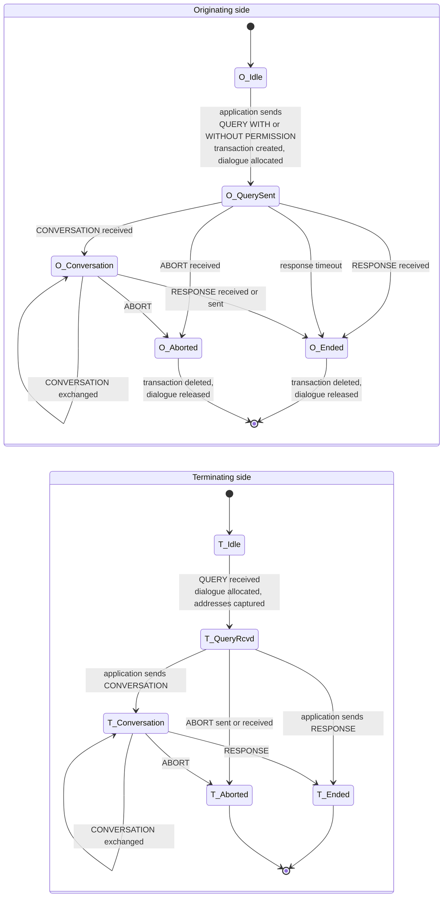

Two transitions are not shown on the diagram because they are internal rather than
protocol events:

| Internal event       | Effect                                                                                                                                                           |
| -------------------- | ---------------------------------------------------------------------------------------------------------------------------------------------------------------- |
| **Pre-arranged end** | Injected by the cleaner process when a dialogue exceeds its timeout. Releases the dialogue and deletes the transaction without emitting anything to the network  |
| **Restoration**      | After a SAP reconnect, a surviving dialogue record is used to re-create the Aculab transaction, and the state machine resumes at its recorded position. See 13.5 |

**Unidirectional** does not appear as a state because it has none — it creates a
transaction context, emits one package, and expects no reply.

Diagram D-07 (SCCP destination availability) appears in 6.3.

## 6.8 Message Size and Segmentation

| Limit                    | Value     | Constant                           | Source                              |
| ------------------------ | --------- | ---------------------------------- | ----------------------------------- |
| SCCP payload buffer      | 300 bytes | `SCCP_ACU_MAX_UDT_LENGTH`          | `sccp/include/SccpAculabConstDef.h` |
| Component parameter data | 255 bytes | `MAX_TDARRAY_BYTES`                | `include/Ss7Structs.h`              |
| Global title digits      | 20        | `MAX_GLOBAL_TITLE_DIGITS`          | `include/Ss7Structs.h`              |
| Return-error data        | 150 bytes | `SS7_MAX_TCAP_ERROR_CODE_DATA_LEN` | `include/TcapStructs.h`             |

**No segmentation is performed.** XUDT, XUDTS and LUDT are neither generated nor
interpreted. Where a payload exceeds what a single UDT can carry, the Aculab stack and
the network are responsible.

**Length truncation defect.** On the SCCP receive path, the received data length is
stored in an 8-bit variable despite the buffer being 300 bytes. Payloads longer than 255
bytes are therefore truncated silently. This is **R-06**.

---

# 7. SAP & Aculab Integration Architecture

## 7.1 The SAP Concept

The Aculab SS7 stack is _distributed_: the protocol stack runs in a driver process,
potentially on a different host, and applications attach to it over TCP through a client
library. The unit of attachment is the **Service Access Point**, or SAP. In this product
the concrete object is an SSAP — an SCCP SAP for the SCCP path, a TCAP SAP for the TCAP
path.

The SAP is more than a connection handle. It is simultaneously:

| The SAP is the unit of…        | Because                                                                                                                                                 |
| ------------------------------ | ------------------------------------------------------------------------------------------------------------------------------------------------------- |
| **Connection**                 | It owns the TCP attachment to the driver, in fact two of them — host A and host B                                                                       |
| **Addressing**                 | The local address, including the local point code and subsystem, is a property of the SAP, read back from it after creation                             |
| **Configuration**              | It is created _from a configuration file path_; almost all stack-side behaviour is set in that file and read by the Aculab library, not by this product |
| **Transaction identity space** | On the TCAP path, each SAP is assigned a distinct transaction-ID range so that IDs from different SAPs cannot collide                                   |
| **Failure**                    | A fault is a SAP-level event. Recovery is SAP deletion and re-creation, not connection retry                                                            |
| **Flow control**               | Blocked and flow-controlled states are reported per SAP connection and gate transmission through that SAP                                               |

This is why 7 exists as a chapter rather than a paragraph: nearly every operational
behaviour of the product is a consequence of SAP semantics.

## 7.2 SSAP Object Model

**Diagram D-08 — SSAP object model.**

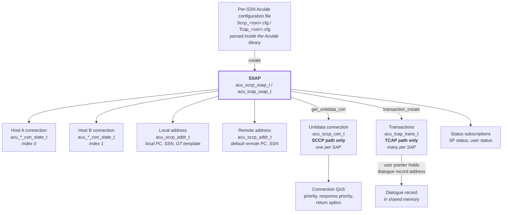

| Object                      | Path      | Cardinality                                       | Obtained by                                 | Notes                                                                                          |
| --------------------------- | --------- | ------------------------------------------------- | ------------------------------------------- | ---------------------------------------------------------------------------------------------- |
| SSAP                        | Both      | 1 per process (SCCP); up to 50 per process (TCAP) | `acu_*_ssap_create(cfgfile, flags)`         | Created from a file path, not a structure                                                      |
| Host A / B connection state | Both      | Exactly 2 per SSAP                                | `acu_*_get_con_state(ssap, 0 or 1, &state)` | Read-only view of the TCP attachment                                                           |
| Local address               | Both      | 1 per SSAP                                        | `acu_*_ssap_get_locaddr(ssap)`              | Returns a pointer into library memory; the product reads the point code from it for validation |
| Remote address              | Both      | 1 per SSAP                                        | `acu_*_ssap_get_remaddr(ssap)`              | Supplies the default remote point code and subsystem used for status subscription              |
| Unitdata connection         | SCCP only | 1 per SSAP                                        | `acu_sccp_ssap_get_unitdata_con(ssap)`      | The pseudo-connection over which all connectionless traffic flows                              |
| Transaction                 | TCAP only | Many per SSAP                                     | `acu_tcap_transaction_create` or restore    | Carries a user pointer, which the product uses to reach the dialogue record                    |

The SCCP path resolves its unitdata connection **lazily**, on the first
connection-state event rather than at creation (`sccp/src/SccpAculabApi.cc:663`). QoS
settings are applied at that moment. A consequence is that transmission cannot succeed
until at least one connection-state event has been received.

## 7.3 SSAP Lifecycle

The product tracks SAP state in its own enumeration, distinct from Aculab's connection
states (`sccp/include/SccpAculabApi.h:30`):

```c
typedef enum _SsapState { CONNECTING, IN_SERVICE, EXITING } SsapState;
```

alongside a status record holding the last activity time, the transaction-ID range, and
a copy of both host connection states (`sccp/include/SccpAculabApi.h:37`).

**Diagram D-09 — SSAP lifecycle state machine.**

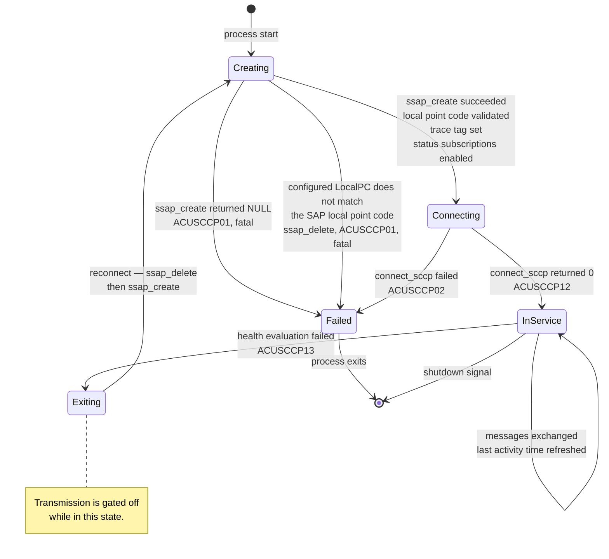

### Creation sequence, in order

| Step | Call                                                                                              | Failure handling                                                 |
| ---- | ------------------------------------------------------------------------------------------------- | ---------------------------------------------------------------- |
| 1    | Build the absolute config file path from `PRODUCT_HOME` and `PRODUCT_CFG_PATH`                    | Returns false. See R-07 for the null-check ordering defect       |
| 2    | `acu_sccp_ssap_create(path, ACU_SCCP_LOG_STDERR)` (`sccp/src/SccpAculabApi.cc:185`)               | Null return → `ACUSCCP01`, fatal                                 |
| 3    | `acu_sccp_ssap_get_locaddr` and compare its point code with the configured `LocalPC` (`:195-205`) | Mismatch → `ssap_delete`, `ACUSCCP01`, fatal                     |
| 4    | `acu_sccp_ssap_set_cfg_str(TRACE_TAG, "sccp_<pc>_0")` (`:207`)                                    | Not checked                                                      |
| 5    | `acu_sccp_ssap_get_remaddr` (`:210`)                                                              | —                                                                |
| 6    | `acu_sccp_enable_sp_status(remote pc)` if the remote point code is non-zero (`:214`)              | If zero, SP status is not subscribed and a diagnostic is emitted |
| 7    | `acu_sccp_enable_user_status(pc, ssn)`, substituting a wildcard when either is zero (`:227`)      | —                                                                |
| 8    | Record the current time as the last activity time (`:233`)                                        | —                                                                |
| 9    | `acu_sccp_ssap_connect_sccp` (`:265`)                                                             | Non-zero → `ACUSCCP02`, fatal                                    |

Step 3 deserves emphasis: **the product cross-checks its own configuration against the
Aculab configuration and refuses to start if they disagree.** This is deliberate
fail-fast behaviour (P-04) and catches the common deployment error of editing one file
and not the other.

## 7.4 SAP Cardinality and Instance Mapping

| Path | SAPs per process | Constant                      | Mapping                                         |
| ---- | ---------------- | ----------------------------- | ----------------------------------------------- |
| SCCP | Exactly 1        | `MAX_ACU_SCCP_INSTANCES` = 1  | One SAP, one SSN, one process                   |
| TCAP | 1 … 50           | `MAX_ACU_TCAP_INSTANCES` = 50 | SAPs distributed across origination point codes |

### TCAP multi-OPC mapping

The TCAP handler can attach to the stack under more than one origination point code.
Configuration declares this as a count plus one entry per point code:

| Parameter       | Form                        | Constraint                                                                                              |
| --------------- | --------------------------- | ------------------------------------------------------------------------------------------------------- |
| `NUMBER_OF_OPC` | Integer                     | 0 selects the single-OPC default path                                                                   |
| `OPC_<n>`       | `"<pointcode>:<instances>"` | Instances per point code must not exceed `MAX_INSTANCE_PER_PC` = 10. Duplicate point codes are rejected |

**Diagram D-10 — SAP-to-OPC instance mapping.**

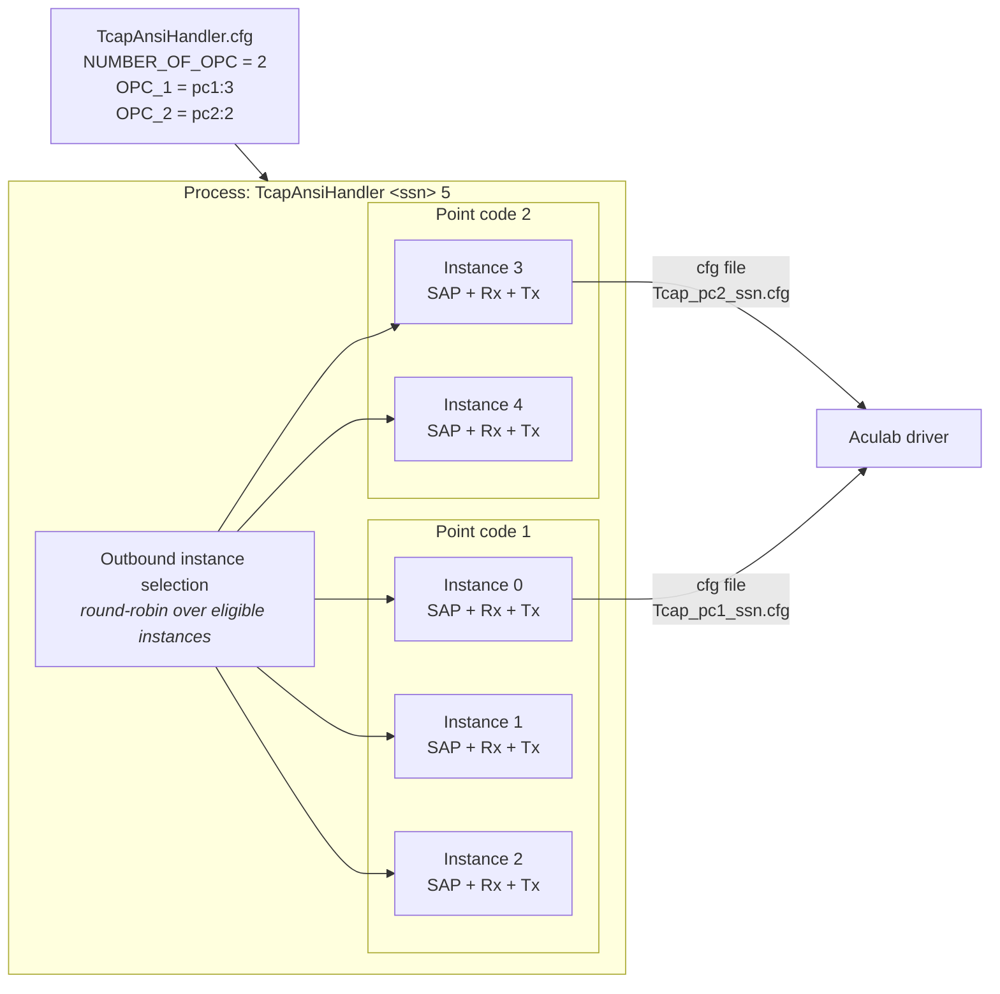

Each SAP gets its own configuration file. In the single-OPC case the filename is
`Tcap_<ssn>.cfg`; in the multi-OPC case it is `Tcap_<pointcode>_<ssn>.cfg`.

### Outbound instance selection

For a message that initiates a transaction, the handler selects a SAP instance by
round-robin from the last used index, **skipping any instance whose transmit gate is
closed** (9.5). When more than one origination point code is configured, selection is
additionally keyed by the originating address point code supplied by the application.

If no instance is eligible, the message is not queued or retried — an abort is returned
to the application and the message is dropped, logged as `ACUTCAP157`.

> **Design consequence.** There is no outbound queueing above the SAP. When every
> instance is flow-controlled, the product sheds load upward rather than buffering. This
> is a deliberate choice — buffering here would hide backpressure from the application —
> but the application must be prepared to receive an abort under congestion.

## 7.5 Configuration Binding

Configuration reaches the SAP through two distinct channels, and confusing them is a
common operational error. The ownership boundary is drawn in 17.1; the SAP-side view
follows.

### Set programmatically by this product

| Setting                  | Path | Value                                               | Source                          |
| ------------------------ | ---- | --------------------------------------------------- | ------------------------------- |
| Trace tag                | Both | `"sccp_<pc>_0"` / `"tcap_<pc>_<instance>"`          | `sccp/src/SccpAculabApi.cc:196` |
| Transaction ID range     | TCAP | Per instance, from configuration or probe           | 7.6                             |
| Definite-length encoding | TCAP | Forced on                                           | Set immediately after create    |
| Return option QoS        | Both | Per message on SCCP; forced on at SAP level on TCAP | `sccp/src/SccpAculabApi.cc:713` |
| Priority QoS             | SCCP | 0                                                   | `sccp/src/SccpAculabApi.cc:667` |
| Response priority QoS    | SCCP | 1                                                   | `sccp/src/SccpAculabApi.cc:668` |
| Host A / Host B name     | TCAP | Alternate IP addresses during failover              | 15.4                            |
| Log destination flag     | Both | Log to stderr                                       | `sccp/src/SccpAculabApi.cc:185` |

### Read by the Aculab library from the per-SSN file

Everything else, including: host A and host B name, port and password; local and remote
point code, subsystem, translation type, numbering plan and encoding scheme; network
indicator; receive and transmit buffer and window sizes; keepalive and connect timeouts;
log file name, size and rotation. These are documented in `[ACU-INST NEEDS-CLAUSE]` and
are **not parsed by this product**.

### The one overlap, and why it exists

`LocalPC` appears in the per-SSN file and is read by _both_ — by the Aculab library as
part of SAP creation, and by this product for the cross-check in 7.3 step 3. The
TCAP path additionally reads `TRANID_RANGE` from the same file.

This overlap is deliberate: it is the only way for the product to detect a mismatch
between what the deployment intended and what the stack was actually configured with.

## 7.6 Transaction Identifier Space

Transaction identifiers are allocated by the **Aculab stack**, not by this product. What
the product controls is the _range_ each SAP allocates from, which is what prevents two
SAP instances in the same process from issuing colliding identifiers.

| Property          | Value                                                                       |
| ----------------- | --------------------------------------------------------------------------- |
| Configuration key | `TRANID_RANGE`, in the per-SSN Aculab configuration file                    |
| Valid range       | 0 … 4094                                                                    |
| Aculab setting    | `ACU_TCAP_CFG_TRANID_RANGE`, applied per SAP instance                       |
| Assignment        | One distinct range value per instance, incremented as instances are created |

The upper bound of 4094 is empirical: the source records that this is the maximum value
the driver accepts, established by testing rather than from the vendor documentation.
`[NEEDS INPUT: confirm the transaction ID range upper bound against the Aculab documentation]`

### The zero-value probe

If the configuration specifies a range of 0, the product derives one instead of failing.
It creates a throwaway transaction, allocates a message on it, reads back the assigned
identifiers, and derives the range by shifting the local identifier right by 20 bits.
The derived value is stored in the SAP status record so that a later reconnect can
restore the same identifier space rather than drifting to a different one.

> **Why the range must be preserved across reconnect.** Peers hold transaction
> identifiers for in-flight dialogues. If a reconnect moved the SAP to a different range,
> every surviving dialogue's identifier would become unreachable, defeating the
> restoration mechanism described in 13.5.

## 7.7 Status and Network Management

The product subscribes to stack notifications at SAP creation (7.3 steps 6 and 7) and
reacts to them in the receive thread. This is how network-side conditions — hops 1 and 2
of 4.4, outside the product's fault domain — become visible inside it.

### Event catalogue

| Aculab event                | Meaning                                                   | Product reaction                                                                                                                                                     |
| --------------------------- | --------------------------------------------------------- | -------------------------------------------------------------------------------------------------------------------------------------------------------------------- |
| **Connection state**        | The TCP attachment to host A or host B changed            | SCCP: lazily resolve the unitdata connection and apply QoS on first receipt; update the recorded connection state. TCAP: update the per-instance transmit gate (9.5) |
| **Signalling point status** | A remote signalling point became accessible or prohibited | Re-query the SCCP status of each configured destination and update its availability flag (6.3)                                                                       |
| **User status**             | A remote subsystem came into or went out of service       | Same as signalling point status                                                                                                                                      |
| **Notice**                  | A message was returned by the network — the UDTS case     | Log the return cause; increment the notice peg; release the message                                                                                                  |
| **Unitdata**                | An inbound connectionless message                         | Decode and forward to the application                                                                                                                                |
| **Timeout**                 | A transaction operation timed out                         | TCAP: synthesise a response-timeout indication to the application and tear the dialogue down                                                                         |
| Connection-oriented events  | Class 2/3 activity                                        | Recognised, named in diagnostics, released and discarded (6.1)                                                                                                       |

### Why both signalling point status and user status matter

They operate at different granularities:

|                        | Signalling point status             | User status                                      |
| ---------------------- | ----------------------------------- | ------------------------------------------------ |
| Granularity            | Whole signalling point              | One subsystem within a point                     |
| Typical trigger        | Node restart, route failure         | Application restart at the peer                  |
| Consequence if ignored | Traffic sent to an unreachable node | Traffic sent to a live node but a dead subsystem |

Both are merged into the same handling branch, because both must refresh the destination
availability flags. Handling only one leaves a window in which outbound traffic is
either wrongly blocked or wrongly permitted — a condition that has previously been
observed in this product and is explicitly regression-tested in `[TSS-TEST-SCCP 3]`.

### Feeding the health watchdog

Every successful poll of the SAP refreshes the last-activity timestamp, whether or not a
message was returned. The health evaluation in 13.5 therefore measures _silence_, not
_idleness_ — a healthy but quiet link still ticks.

## 7.8 Aculab Error Handling

### Return conventions

| Call family  | Success                                                 | Failure             |
| ------------ | ------------------------------------------------------- | ------------------- |
| Create calls | Non-null pointer                                        | `NULL`              |
| Action calls | 0                                                       | Non-zero error code |
| Getter calls | Non-null pointer                                        | `NULL`              |
| Receive poll | 0 with a message, or a no-message indication on timeout | Negative error code |

Error codes are converted to text by `acu_*_strerror`, wrapped by the utility class
(`sccp/src/SccpAculabUtil.cc:287`).

### Error classification

| Class           | Examples                                                                        | Product behaviour                                                              |
| --------------- | ------------------------------------------------------------------------------- | ------------------------------------------------------------------------------ |
| **Fatal**       | SAP creation failure; local point-code mismatch; SAP connect failure at startup | Log and exit. The deployment is misconfigured (P-04)                           |
| **Recoverable** | Connection blocked or lost after start; silence beyond the watchdog threshold   | SAP delete, re-create, reconnect, restore (13.5)                               |
| **Per-message** | Unitdata request rejected; component addition failed; decode failed             | Drop the message, log, and on the TCAP path return an abort to the application |
| **Ignorable**   | Trace tag setting; status subscription                                          | Return value not checked                                                       |

### Message ownership discipline

This is the rule that flow control depends on (P-06), and it is stated here as an
architectural invariant rather than a coding note:

> **Every Aculab message obtained from the stack must be released, on every exit path,
> including error paths. Every message allocated for transmission must be freed whether
> or not the send succeeded.**

Two mechanisms are involved and they are not interchangeable:

| Mechanism                                         | Purpose                                                                                                           |
| ------------------------------------------------- | ----------------------------------------------------------------------------------------------------------------- |
| `acu_*_msg_free`                                  | Releases the message object's memory                                                                              |
| `acu_sccp_con_unblock` / `acu_tcap_trans_unblock` | Releases the **receive credit**, allowing the stack to deliver the next message on that connection or transaction |

Omitting the free leaks memory. Omitting the unblock **stalls the receive ring for that
connection**, which is a far more serious failure because it is silent and progressive.
The complete exit-path enumeration for both modules is in 9.3.

A related property is that the SCCP receive path deep-copies the payload out of the
Aculab message before writing it to the northbound queue. This is why the Aculab
receive-buffer copy call is not needed anywhere in the product — the copy has already
happened. This is recorded in `[TSS-TEST-SCCP 7]` as a deliberate non-issue.

## 7.9 Aculab Dependency Register

| Property                | Value                                                                         |
| ----------------------- | ----------------------------------------------------------------------------- |
| Stack version           | Aculab SS7 v4.0                                                               |
| SCCP shared object      | `libacu_ss7sccp.so`                                                           |
| TCAP shared object      | `libacu_ss7tcap.so`                                                           |
| Headers                 | `ACULAB_4-0/include/sccp_api.h`, `tcap_api.h`, `sccp_synch.h`, `tcap_synch.h` |
| Link model              | Dynamic, selected by word size at build time (14.4)                           |
| Supported version range | `[NEEDS INPUT: is v4.0 the only supported version, or is a range supported?]` |

### Upgrade impact procedure

An Aculab stack upgrade is a bounded change because of principle P-01 — all calls are
confined to `SccpAculab` and `TcapAculab`. The procedure is:

| Step | Action                                                                                                                  |
| ---- | ----------------------------------------------------------------------------------------------------------------------- |
| 1    | Diff the vendor headers for changes to any symbol listed in 12.4 or 12.5                                                |
| 2    | Re-verify the deferred-serialisation behaviour of the component builders (6.6) — a change here is silent and corrupting |
| 3    | Re-verify the connection-state bit definitions used by the health evaluation (13.5) and the transmit gate (9.5)         |
| 4    | Re-verify the buffer and window configuration parameter names in 9.2                                                    |
| 5    | Re-confirm the transaction-ID range upper bound (7.6)                                                                   |
| 6    | Re-run the regression procedures in `[TSS-TEST-SCCP]`                                                                   |

Steps 2 and 3 are the ones that fail silently if skipped.

---

# 8. Process, Thread & Concurrency Architecture

_This chapter is the **Process view** of the 4+1 model (4.3)._

## 8.1 Process Model

**Diagram D-11 — Process model with cardinalities.**

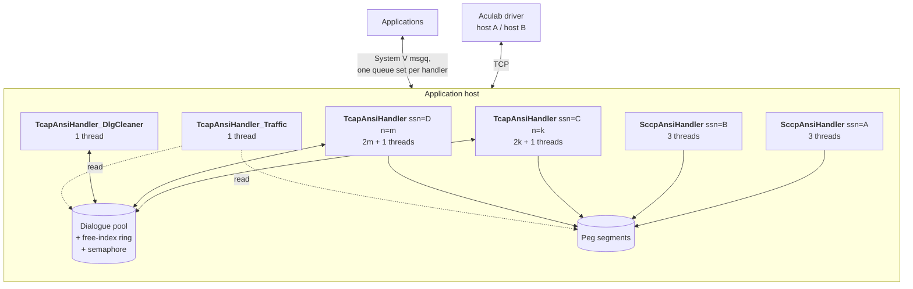

| Binary                       | Invocation                          | Instances          | Process name                                              | Single-instance key                     |
| ---------------------------- | ----------------------------------- | ------------------ | --------------------------------------------------------- | --------------------------------------- |
| `SccpAnsiHandler`            | `SccpAnsiHandler <ssn>`             | One per SSN        | `ACUSCCP_<ssn>` (`sccp/src/SccpAculabHandlerMain.cc:208`) | Product `"SCCP"`, process name (`:233`) |
| `TcapAnsiHandler`            | `TcapAnsiHandler <ssn> <instances>` | One per SSN        | `ACUTCAP_<ssn>`                                           | Product `"TCAP"`, process name          |
| `TcapAnsiHandler_DlgCleaner` | No arguments                        | One per deployment | Fixed                                                     | Yes                                     |
| `TcapAnsiHandler_Traffic`    | `[refresh_secs]`                    | One per deployment | Fixed                                                     | Yes                                     |

### Single-instance enforcement

Each process acquires a `ProcessLock` keyed on a product name and process name pair
before doing any other initialisation (`sccp/src/SccpAculabHandlerMain.cc:233`). Failure
produces log `GSYS16` and immediate exit. This prevents two handlers for the same SSN
from racing over the same IPC keys and SAP configuration. See 13.7 for the stale-lock
failure mode.

### Shared-memory attachment

| Segment                  | `SccpAnsiHandler` | `TcapAnsiHandler` | `_DlgCleaner` | `_Traffic` |
| ------------------------ | ----------------- | ----------------- | ------------- | ---------- |
| Dialogue record pool     | —                 | Read/write        | Read/write    | Read       |
| Dialogue free-index ring | —                 | Read/write        | Read/write    | Read       |
| Dialogue semaphore       | —                 | Yes               | Yes           | Yes        |
| SCCP peg segment         | Write             | —                 | —             | —          |
| TCAP peg segment         | —                 | Write             | —             | Read       |

## 8.2 Thread Model

**Diagram D-12 — Thread model per binary.**

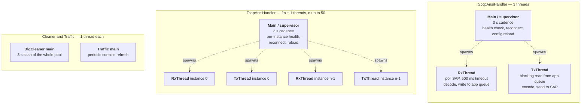

| Binary                       | Threads | Formula                                                 |
| ---------------------------- | ------- | ------------------------------------------------------- |
| `SccpAnsiHandler`            | 3       | supervisor + Rx + Tx                                    |
| `TcapAnsiHandler`            | 3 … 101 | supervisor + (Rx + Tx) per SAP instance, instances ≤ 50 |
| `TcapAnsiHandler_DlgCleaner` | 1       | main only                                               |
| `TcapAnsiHandler_Traffic`    | 1       | main only                                               |

### Creation, staggering and detach policy

Threads are created by a helper invoked from `main` after handler initialisation
(`sccp/src/SccpAculabHandlerMain.cc:266`). The transmit thread is created first, then a
one-second sleep, then the receive thread. On the TCAP path the same one-second stagger
separates every creation.

All worker threads are **detached**. There is no join path anywhere in either module.

Two consequences follow, and both are recorded as risks:

| Consequence                                                                                                                                                                                                                                                                    | Risk     |
| ------------------------------------------------------------------------------------------------------------------------------------------------------------------------------------------------------------------------------------------------------------------------------ | -------- |
| On reconnect the supervisor calls the thread-creation helper again without terminating the previous pair. The `pthread_kill` calls that would have done so are present but commented out (`sccp/src/SccpAculabHandlerMain.cc:301-302`). Repeated reconnects accumulate threads | **R-03** |
| On the TCAP path the thread-argument structure is a stack local of the creation helper, whose address is passed to every thread and then mutated in the loop. Only the one-second stagger makes this work in practice                                                          | **R-16** |

A thread-exit signal (number 30) is registered and its handler calls `pthread_exit`
(13.3), so the mechanism for orderly thread termination exists; it is simply not
invoked.

## 8.3 Thread Responsibility and Loop Bodies

| Thread                 | Entry                                            | Loop condition                              | Blocking call                                 | Timeout           | Exit                       | State touched                                                                                               |
| ---------------------- | ------------------------------------------------ | ------------------------------------------- | --------------------------------------------- | ----------------- | -------------------------- | ----------------------------------------------------------------------------------------------------------- |
| SCCP supervisor        | `main` (`sccp/src/SccpAculabHandlerMain.cc:141`) | `AculabUtil::KeepRunning()`                 | `sleep(3)`                                    | —                 | Run flag cleared by signal | SAP status record, configuration, thread creation                                                           |
| SCCP Rx                | `RxThread`                                       | `KeepRunning()`                             | `acu_sccp_ssap_msg_get` via `GetAcuSccpEvent` | 500 ms            | Run flag or signal 30      | Decode buffer, destination availability flags, unitdata connection, northbound write queue, heartbeat queue |
| SCCP Tx                | `TxThread`                                       | `KeepRunning()`                             | `msgrcv` on the inbound queue, blocking       | None — indefinite | Run flag or signal 30      | Destination availability flags (read), round-robin toggle, SAP send path                                    |
| TCAP supervisor        | `main`                                           | `KeepRunning()`                             | `sleep(3)`                                    | —                 | Run flag                   | Per-instance SAP status, configuration, thread creation                                                     |
| TCAP Rx (per instance) | `RxThread`                                       | `KeepRunning()`                             | `acu_tcap_ssap_msg_get`                       | 500 ms            | Run flag                   | Dialogue pool, transaction bindings, northbound write queue, per-instance transmit gate                     |
| TCAP Tx (per instance) | `TxThread`                                       | `KeepRunning()` and the global restore flag | `msgrcv` on the inbound queue, blocking       | None              | Run flag                   | Dialogue pool, transaction bindings, component accumulation map, rate-limiter counter                       |
| Cleaner main           | `main`                                           | `KeepRunning()`                             | `sleep(3)`                                    | —                 | Run flag                   | Dialogue pool (scan), handler control queue (write)                                                         |
| Traffic main           | `main`                                           | `while(1)`                                  | `sleep(refresh)`                              | —                 | Signal only                | Peg segment and dialogue pool, read only                                                                    |

### Two properties worth noting

**The transmit threads block indefinitely.** They wait on `msgrcv` with no timeout. A
transmit thread therefore does not participate in shutdown until a message arrives or
the process is signalled. Graceful shutdown relies on process termination rather than on
thread cooperation.

**The SCCP transmit thread spin-waits on SAP availability.** After receiving a message
from the application it loops with a one-second sleep until the SAP reports in service,
then transmits. During a reconnect this holds one message in the thread's frame; further
messages remain queued in the kernel.

## 8.4 Synchronisation Architecture

**Diagram D-13 — Synchronisation and lock map.**

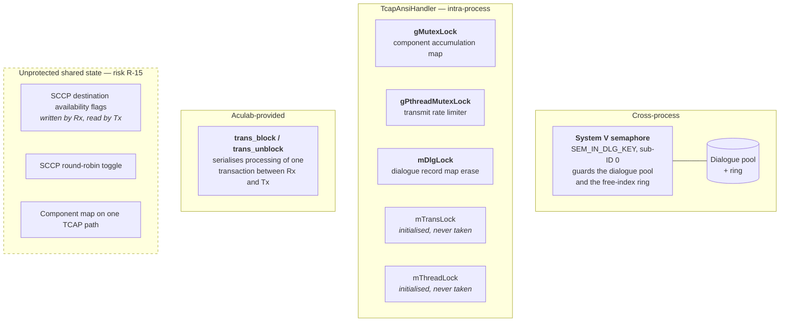

### Lock inventory

| Lock                                                     | Scope             | Protects                                                                            | Actually taken                        |
| -------------------------------------------------------- | ----------------- | ----------------------------------------------------------------------------------- | ------------------------------------- |
| System V semaphore, sub-ID `SEM_FOR_IN_DLG_POOL`         | **Cross-process** | Dialogue record allocation, release and update; the free-index ring header and body | Yes — the only real guard on the pool |
| `gMutexLock` (`tcap/src/TcapAculabApi.cc:20`)            | Process           | The multi-component accumulation map                                                | Yes, in the accumulation function     |
| `gPthreadMutexLock` (`tcap/src/TcapAculabHandler.cc:27`) | Process           | The transmit rate-limiter counter and window                                        | Yes                                   |
| `TransDlgMap::mDlgLock`                                  | Object            | Erase from the dialogue record map                                                  | Yes, in the delete path only          |
| `TransDlgMap::mTransLock`                                | Object            | —                                                                                   | **No** — initialised, never locked    |
| `DlgMgr::mThreadLock`                                    | Object            | —                                                                                   | **No** — initialised, never locked    |
| `gPthreadCondLock`                                       | Process           | —                                                                                   | **No** — declared, never used         |
| Aculab `trans_block` / `trans_unblock`                   | Per transaction   | Serialises message processing for one transaction between the Rx and Tx threads     | Yes                                   |

The two locks that are initialised but never taken, and the unused condition variable,
are vestigial. They are documented here so a reader does not assume protection that does
not exist.

### Semaphore operation pairs

The dialogue-pool semaphore uses a two-operation lock and a one-operation unlock, both
with the undo flag so that a process crash releases the lock rather than deadlocking the
survivors:

| Operation | Ops                           | Flags                                  |
| --------- | ----------------------------- | -------------------------------------- |
| Lock      | wait for zero, then increment | Undo on both; no-wait on the increment |
| Unlock    | decrement                     | Undo, no-wait                          |

Three sub-IDs are enumerated in the code — for the inbound pool, the outbound pool and
the management queue — but **only the inbound-pool sub-ID is ever used**. All pool and
ring access serialises on that single semaphore.

> **Scalability note.** Dialogue allocation and release across every TCAP handler
> process and the cleaner contend on one semaphore. At the configured maximum of 500,000
> dialogues this is the most likely cross-process contention point in the product.
> `[NEEDS INPUT: has dialogue allocation throughput been measured at target TPS?]`

### Unprotected shared state

The SCCP handler has no mutexes at all. Three members are written by one thread and read
by another with no synchronisation (**R-15**):

| Member                          | Written by                  | Read by                                 |
| ------------------------------- | --------------------------- | --------------------------------------- |
| Destination A availability flag | Rx thread, on status events | Tx thread, during destination selection |
| Destination B availability flag | Rx thread, on status events | Tx thread, during destination selection |
| Round-robin toggle              | Tx thread                   | Tx thread only                          |

In practice the design is single-reader/single-writer on machine-word booleans, so the
observable risk is a briefly stale availability decision rather than corruption. It is
recorded because it is an unstated assumption, not because it is currently causing
faults.

Separately, one TCAP path reads and erases the component accumulation map without
holding `gMutexLock`, which the accumulating path does hold. That is a genuine
inconsistency and is the more serious half of R-15.

## 8.5 Shared-State Ownership Map

| State                           | Location                     | Written by                 | Read by                         | Protected by                                       |
| ------------------------------- | ---------------------------- | -------------------------- | ------------------------------- | -------------------------------------------------- |
| SCCP decode buffer              | Process memory               | SCCP Rx thread             | SCCP Rx thread                  | Single-threaded by construction                    |
| SCCP destination availability   | Process memory               | SCCP Rx thread             | SCCP Tx thread                  | **Nothing** (R-15)                                 |
| SCCP round-robin toggle         | Process memory               | SCCP Tx thread             | SCCP Tx thread                  | Single thread                                      |
| SCCP unitdata connection handle | Process memory               | SCCP Rx thread, lazily     | SCCP Tx thread                  | **Nothing** — see note below                       |
| SAP status record               | Process memory               | Supervisor                 | Supervisor, Tx                  | Not protected; supervisor is the only writer       |
| Per-instance transmit gate      | Static array in `AculabUtil` | TCAP Rx thread, supervisor | TCAP Tx threads                 | Nothing; single-word booleans                      |
| Component accumulation map      | Process memory               | TCAP Tx threads            | TCAP Tx threads                 | `gMutexLock`, inconsistently (R-15)                |
| Rate-limiter counter and window | Process memory               | All TCAP Tx threads        | All TCAP Tx threads             | `gPthreadMutexLock`                                |
| Dialogue record pool            | **Shared memory**            | TCAP handlers, cleaner     | TCAP handlers, cleaner, traffic | System V semaphore                                 |
| Free-index ring                 | **Shared memory**            | TCAP handlers, cleaner     | Same                            | System V semaphore                                 |
| Peg counters                    | **Shared memory**            | All handlers               | Traffic, external readers       | Nothing — counters are advisory                    |
| Run, config and trace flags     | Static in `AculabUtil`       | Signal handlers            | All threads                     | Nothing; single-word flags read in loop conditions |

> **Note on the unitdata connection handle.** It is resolved lazily by the Rx thread on
> the first connection-state event and then used by the Tx thread. Before that first
> event the handle is null and transmission cannot proceed. This is the same startup
> ordering property that produces R-11.

## 8.6 Memory Ownership and Lifetime Discipline

| Boundary                             | Allocated by                       | Released by                                    | Rule                                                              |
| ------------------------------------ | ---------------------------------- | ---------------------------------------------- | ----------------------------------------------------------------- |
| Received Aculab message              | Aculab, returned by the poll       | This product, `acu_*_msg_free`                 | Free on **every** exit path including error paths                 |
| Received message credit              | —                                  | This product, `con_unblock` / `trans_unblock`  | Release on every exit path. Omission stalls the ring — see 9.3    |
| Transmitted Aculab message           | This product, `acu_tcap_msg_alloc` | This product, `acu_*_msg_free`                 | Free whether or not the send succeeded                            |
| Received payload                     | Aculab message body                | —                                              | **Deep-copied** into a product buffer before the northbound write |
| Aculab transaction                   | `transaction_create` or restore    | `transaction_delete` at dialogue end           | Block before delete; see `[TCAP-HLD 10]`                          |
| Dialogue record                      | `DlgMgr` allocate                  | `DlgMgr` release                               | Under the semaphore; double release is detected and logged        |
| Buffers passed to component builders | Caller                             | Caller                                         | **Must outlive the send call** (6.6)                              |
| Northbound message                   | Sender's stack                     | Kernel copy on write; receiver's stack on read | Value semantics throughout                                        |

### Why the Aculab receive-buffer copy call is not used

The SCCP decode path copies the received payload out of the Aculab message into a
product-owned buffer before any northbound write (`sccp/src/SccpAculabHandler.cc:1068`
onward). By the time the message is freed, nothing references its body. The Aculab
receive-buffer copy call therefore has no purpose here and its absence is not an
oversight. This is recorded as a deliberate non-issue in `[TSS-TEST-SCCP 7]`.

## 8.7 Failure Isolation

| Failure                                 | Effect on other processes                                                                                             | Effect on in-flight dialogues                                          |
| --------------------------------------- | --------------------------------------------------------------------------------------------------------------------- | ---------------------------------------------------------------------- |
| One `SccpAnsiHandler` crashes           | None. Other SSNs unaffected                                                                                           | None — the SCCP path holds no dialogue state                           |
| One `TcapAnsiHandler` crashes           | Other handlers unaffected. Its dialogue records remain in shared memory holding **stale transaction pointers** (R-05) | Lost. Peers see no response until their own timers expire              |
| `_DlgCleaner` crashes or is not running | Handlers continue. **Dialogue records are never reaped**, and the pool fills until allocation fails                   | Existing dialogues unaffected; new ones eventually cannot be allocated |
| `_Traffic` crashes                      | None                                                                                                                  | None                                                                   |
| An application stops draining its queue | Its handler's writes fail; the handler continues but sheds messages                                                   | Dialogues time out and are reaped                                      |
| Aculab driver host A fails              | All handlers attached to it react independently                                                                       | Preserved if host B is available and restoration succeeds (13.5)       |
| Both Aculab hosts fail                  | All handlers enter reconnect                                                                                          | Preserved in shared memory but not restorable until a host returns     |
| A handler thread hangs                  | Its sibling threads continue; the supervisor does not detect a hung worker                                            | Silently stalled — see note                                            |

> **Gap: there is no per-thread liveness detection.** The supervisor evaluates SAP
> health, not thread health. A receive thread that blocks indefinitely inside the Aculab
> library would stop the flow of inbound traffic while the SAP still reports healthy,
> because the last-activity timestamp is only refreshed by that same thread. The
> observable symptom would be a silent traffic stop with no reconnect.
> `[NEEDS INPUT: is a thread watchdog required by the operator's availability target?]`

---

# 9. Buffering, Flow Control & Ring Buffer Architecture

This chapter describes how messages are held, how backpressure propagates, and where
messages can be lost. It is the reference for capacity planning and for diagnosing
traffic stalls.

## 9.1 The Four-Stage Buffer Chain

**Diagram D-14 — Four-stage buffer chain with credit flow.**

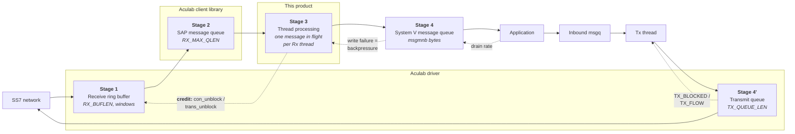

| Stage                   | Location              | Sized by                                 | Backpressure signal                                | Behaviour when full                                                     |
| ----------------------- | --------------------- | ---------------------------------------- | -------------------------------------------------- | ----------------------------------------------------------------------- |
| **1** Receive ring      | Aculab driver         | `RX_BUFLEN` and the window parameters    | Connection state becomes `RX_BLOCKED` or `RX_FLOW` | The driver stops delivering on that connection until credit is released |
| **2** SAP message queue | Aculab client library | `RX_MAX_QLEN` (TCAP only)                | Same connection state bits                         | Messages accumulate, then the ring backs up                             |
| **3** Thread processing | This product          | One message in flight per receive thread | None — this is a serialisation point, not a buffer | Latency rises; stages 1 and 2 absorb the difference                     |
| **4** Northbound queue  | Linux kernel          | `msgmnb` bytes per queue                 | Write failure returned to the handler              | Message dropped, logged and pegged; see 9.8                             |
| **4'** Transmit queue   | Aculab driver         | `TX_QUEUE_LEN`, `TX_BYTE_WINDOW`         | Connection state becomes `TX_BLOCKED` or `TX_FLOW` | TCAP: instance removed from selection. SCCP: transmit thread waits      |

**The key architectural property:** stage 3 is not a buffer. The product holds at most
one inbound message per receive thread. All inbound elasticity lives in stages 1 and 2,
inside Aculab, and is released only by the credit mechanism in 9.3. All outbound
elasticity lives in stage 4' and in the kernel queue at stage 4.

## 9.2 Aculab Receive Ring Buffer

The ring is inside the Aculab driver and is configured through the per-SSN Aculab
configuration file (17.1), not by this product.

| Parameter           | SCCP                                    | TCAP                 | Purpose                                               |
| ------------------- | --------------------------------------- | -------------------- | ----------------------------------------------------- |
| `RX_BUFLEN`         | ● (`ACULAB_4-0/include/sccp_api.h:196`) | ● (`tcap_api.h:386`) | TCP receive buffer size                               |
| `RX_MSG_WINDOW`     | —                                       | ● (`tcap_api.h:375`) | Message-count window for flow control from the driver |
| `RX_BYTE_WINDOW`    | —                                       | ● (`tcap_api.h:376`) | Byte window for flow control from the driver          |
| `RX_MAX_QLEN`       | —                                       | ● (`tcap_api.h:377`) | Maximum queue length before flow control              |
| `KEEPALIVE_TIMEOUT` | ● (`sccp_api.h:197`)                    | ● (`tcap_api.h:387`) | Interval between keepalives                           |
| `CONNECT_TIMEOUT`   | ● (`sccp_api.h:199`)                    | ● (`tcap_api.h:389`) | Connection timeout to the driver                      |

> **Note the asymmetry.** The SCCP API exposes only `RX_BUFLEN` for receive sizing; the
> three window parameters are TCAP-only. The SCCP path therefore has a coarser receive
> flow-control model, and its principal protection is prompt credit release.

**Production values are not in this repository** — they live in the per-SSN Aculab
configuration files on the target.
`[NEEDS INPUT: production values of RX_BUFLEN, RX_MSG_WINDOW, RX_BYTE_WINDOW, RX_MAX_QLEN, TX_QUEUE_LEN, TX_BYTE_WINDOW, and who owns them]`

These are the single largest throughput lever available to a deployment, and the only
one that does not require a code change.

## 9.3 Credit and Unblock Model

This is the most operationally consequential mechanism in the product.

**The rule.** Every message the stack delivers occupies a credit. The credit is returned
by calling the unblock function on the message's connection (SCCP) or transaction
(TCAP). Until it is returned, that credit is consumed. When credits are exhausted, the
driver stops delivering on that connection and the ring backs up toward the network.

**Why it is dangerous to get wrong.** Omission is silent. There is no error, no log and
no counter at the moment of omission. The symptom appears later as a progressive traffic
stall on one connection, and it is not recoverable without a reconnect. A source comment
in the notice-handling path records exactly this failure mode having been observed:
omitting the unblock caused the driver to permanently suspend delivery of further
notices on that context (`sccp/src/SccpAculabHandler.cc:696-699`).

### SCCP receive handler — complete exit path enumeration

Source: `sccp/src/SccpAculabHandler.cc:608-754`.

| #   | Event / condition                             | Line       | Unblocks     | Frees        | Correct                                                       |
| --- | --------------------------------------------- | ---------- | ------------ | ------------ | ------------------------------------------------------------- |
| 1   | Poll returned no message                      | `:615`     | n/a          | n/a          | Yes — no message was delivered                                |
| 2   | Connection state event                        | `:625-630` | **No**       | Yes (`:628`) | Yes — connection-state events carry no connection credit      |
| 3   | Unitdata, decode failed                       | `:646-654` | Yes (`:651`) | Yes (`:652`) | Yes                                                           |
| 4   | Unitdata, decoded and forwarded               | `:656-660` | Yes (`:658`) | Yes (`:659`) | Yes                                                           |
| 5   | Notice (UDTS)                                 | `:662-703` | Yes (`:700`) | Yes (`:701`) | Yes — this is the path whose omission was previously observed |
| 6   | Signalling point status                       | `:704-733` | **No**       | Yes (`:732`) | Yes — status events carry no connection credit                |
| 7   | User status                                   | `:704-733` | **No**       | Yes (`:732`) | Yes                                                           |
| 8   | Default — any other event, connection present | `:735-748` | Yes (`:742`) | Yes (`:744`) | Yes                                                           |
| 9   | Default — any other event, no connection      | `:735-748` | n/a          | Yes (`:744`) | Yes                                                           |

**Result: every SCCP exit path that holds a connection credit releases it.** The
enumeration is complete — the switch has no fall-through and every case terminates in
either `break` or `return`.

> Note that path 4 calls the northbound write **before** unblocking. If the write blocks
> or is slow, the credit is held for that duration. Since the write is non-blocking
> (9.8) the exposure is bounded, but the ordering is worth preserving in any future
> change: do not introduce a blocking operation between decode and unblock.

### TCAP receive handler — exit path summary

The TCAP path uses `acu_tcap_trans_unblock` on the transaction rather than a connection.
The structure is:

| Condition                                                       | Unblocks                                                            | Frees                 |
| --------------------------------------------------------------- | ------------------------------------------------------------------- | --------------------- |
| Poll returned no message                                        | n/a                                                                 | n/a                   |
| Data message, decode failed                                     | Abort returned to application, then transaction torn down           | Yes                   |
| Data message, dialogue found or created                         | Yes                                                                 | Yes                   |
| Data message, no dialogue and not a transaction-initiating type | Yes                                                                 | Yes — message dropped |
| Terminal package types (abort, response)                        | Yes, then transaction deleted                                       | Yes                   |
| Timeout event                                                   | Response timeout surfaced to the application, transaction torn down | Yes                   |
| Connection state, SP status, user status, notice                | Diagnostics only                                                    | Yes                   |

On the transmit side, the TCAP path additionally **blocks** a transaction before
deleting it, retrying once after a short delay and dropping the message if the block
does not succeed (logged `ACUTCAP175`). This prevents a delete racing a concurrent
receive on the same transaction.

`[NEEDS INPUT: confirm during code review that every TCAP receive return path unblocks — the enumeration above is structural rather than line-verified]`

### Review checklist

Any change that adds a return path to a receive handler must answer:

1. Did this path receive a message from the stack?
2. If yes, does it call the unblock function before returning?
3. Does it free the message on this path?
4. Is there any blocking operation between receipt and unblock?

## 9.4 Transmit-Side Buffering

| Parameter        | Purpose                                                                                                     |
| ---------------- | ----------------------------------------------------------------------------------------------------------- |
| `TX_QUEUE_LEN`   | Number of buffers queued in the driver before flow control is asserted (`sccp_api.h:198`, `tcap_api.h:388`) |
| `TX_BYTE_WINDOW` | Byte limit before an acknowledgement is required from the driver (`sccp_api.h:200`, `tcap_api.h:390`)       |

When either limit is reached the connection state gains `TX_BLOCKED` or `TX_FLOW`, which
the product observes and reacts to as described next.

## 9.5 Flow-Control State Machine

The connection-state values are a base state in the low bits plus independent flow bits
in the high bits (`ACULAB_4-0/include/sccp_api.h:298-306`,
`ACULAB_4-0/include/tcap_api.h:489-497`):

| Value      | Constant     | Meaning                        |
| ---------- | ------------ | ------------------------------ |
| 0          | `IDLE`       | Not attached                   |
| 1          | `CONNECTING` | TCP connection in progress     |
| 2          | `CONNECTED`  | TCP up, not yet in service     |
| 3          | `IN_SERVICE` | Usable                         |
| `0x010000` | `RX_BLOCKED` | Receive credit exhausted       |
| `0x020000` | `RX_FLOW`    | Receive flow control asserted  |
| `0x100000` | `TX_BLOCKED` | Transmit queue full            |
| `0x200000` | `TX_FLOW`    | Transmit flow control asserted |

Because the flow bits are independent, a connection can be `IN_SERVICE` **and**
`TX_BLOCKED` simultaneously. The product's health evaluation depends on exactly this
combination — see below.

**Diagram D-15 — Flow-control state machine.**

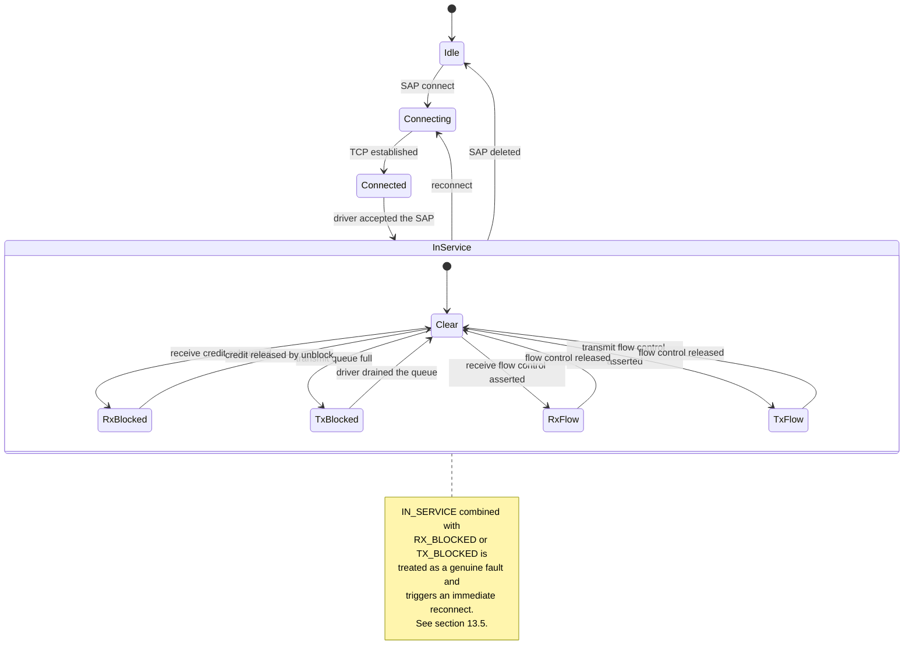

### How each path reacts

| Path                           | Detection                                                                                | Reaction                                                                                                                                                                                   |
| ------------------------------ | ---------------------------------------------------------------------------------------- | ------------------------------------------------------------------------------------------------------------------------------------------------------------------------------------------ |
| **SCCP**                       | Supervisor reads both host connection states every 3 s (`sccp/src/SccpAculabApi.cc:451`) | `IN_SERVICE` together with `RX_BLOCKED` or `TX_BLOCKED` on either host → SAP state set to `EXITING`, health check returns false, reconnect triggered (`sccp/src/SccpAculabApi.cc:493-512`) |
| **SCCP transmit**              | Transmit thread checks SAP status before sending                                         | Sleeps one second and retries until the SAP is in service                                                                                                                                  |
| **TCAP**                       | Connection-state events update a per-instance transmit gate                              | Instance whose state shows `TX_BLOCKED` or `TX_FLOW` has its gate closed and is skipped by outbound round-robin selection; plain `IN_SERVICE` reopens it                                   |
| **TCAP, no instance eligible** | All gates closed                                                                         | Abort returned to the application, message dropped, logged `ACUTCAP157`                                                                                                                    |

> **The `IN_SERVICE` + blocked combination is treated as a fault, not as backpressure.**
> The reasoning is recorded in the source: a connection that is nominally in service but
> blocked means the driver's ring is full or the TCP link has stalled, and left alone it
> will freeze all traffic. Reconnecting is the only recovery available to the product.
> This is a deliberate trade — it converts a stall into a brief outage.

## 9.6 Polling Model and the Latency Floor

| Timer                    | Value                                         | Effect                                                             |
| ------------------------ | --------------------------------------------- | ------------------------------------------------------------------ |
| SAP receive poll timeout | 500 ms                                        | Maximum time a receive thread waits with no message before looping |
| Supervisor cadence       | 3 s (`sccp/src/SccpAculabHandlerMain.cc:292`) | Health evaluation and reconnect detection granularity              |
| Transmit retry sleep     | 1 s                                           | Delay before re-checking SAP availability                          |
| Thread creation stagger  | 1 s                                           | Between successive thread creations                                |
| Silence watchdog         | 30 s (SCCP)                                   | See 13.5                                                           |

**The 500 ms poll timeout does not add 500 ms of latency to a message.** The poll returns
as soon as a message is available; the timeout only bounds the idle wait. Its practical
effects are:

1. It bounds how quickly a receive thread notices the run flag has been cleared, so
   shutdown can take up to 500 ms per thread.
2. It guarantees the last-activity timestamp is refreshed at least every 500 ms even on a
   silent link, which is what makes the silence watchdog measure genuine silence rather
   than idleness (7.7).

The supervisor's 3 s cadence is the real latency floor for _fault detection_: a SAP
failure is noticed between 0 and 3 seconds after it occurs.

## 9.7 Dialogue Free-Index Ring

The TCAP dialogue pool is fronted by a circular buffer of free record indices held in
shared memory. Architecturally:

| Property   | Value                                                                                                                                                     |
| ---------- | --------------------------------------------------------------------------------------------------------------------------------------------------------- |
| Structure  | Header holding next-free index, last-free index and record count, followed by an array of indices                                                         |
| Sizing     | One index slot per dialogue, plus the header                                                                                                              |
| Allocation | Take the index at the next-free cursor, mark the slot consumed, advance the cursor with wraparound                                                        |
| Release    | Write the index at the last-free cursor, advance it, decrement the count                                                                                  |
| Exhaustion | When the record count equals the usable pool size, or the cursor completes a full wrap without finding a free slot, allocation fails and logs `ACUTCAP24` |
| Guard      | The single System V semaphore (8.4)                                                                                                                       |

**The pool is split by direction.** The lower half is reserved for network-initiated
dialogues and is indexed directly rather than through the ring; the upper half is for
locally initiated dialogues and is what the ring manages. A configurable shift moves the
boundary. The consequence for capacity planning is that **the usable pool for outbound
dialogues is approximately half the configured size**, not all of it.

Byte-level layout, the exact arithmetic and the double-release detection are in
`[TCAP-HLD 9.3]`.

## 9.8 System V Message Queues as the Outermost Buffer

| Property         | Northbound (handler → application)                             | Inbound (application → handler)                      |
| ---------------- | -------------------------------------------------------------- | ---------------------------------------------------- |
| Write mode       | Non-blocking                                                   | —                                                    |
| Read mode        | —                                                              | Blocking                                             |
| Failure handling | Error returned to the handler; message dropped, logged, pegged | Error routed to the queue-error recovery path (10.3) |
| Depth            | Kernel `msgmnb` bytes per queue                                | Same                                                 |

The non-blocking write is what makes stage 4 the drop point rather than a stall point: a
handler that cannot write to a slow application discards the message and continues,
rather than holding a receive credit and stalling the ring. This is a deliberate choice —
it protects the network-facing side from an application-side fault.

The TCAP handler additionally has a **deferred processing path**: it can write a message
back onto its own inbound queue rather than processing it immediately, which defers work
without dropping it.

## 9.9 Transmit Rate Limiting

The TCAP handler enforces a licence-derived transmit cap:

| Property               | Value                                                                                              |
| ---------------------- | -------------------------------------------------------------------------------------------------- |
| Configuration          | `TCAP_MSG_LICENCE_KEY`, decoded to a messages-per-second figure                                    |
| Window                 | 5 seconds; the limit is the rate multiplied by the window                                          |
| Enforcement point      | End of the transmit path, under `gPthreadMutexLock`                                                |
| Behaviour at the limit | The thread computes the remainder of the current window and sleeps it out, then resets the counter |
| Scope                  | Shared across **all** transmit threads in the process                                              |

This is a **hard cap that stalls rather than sheds**. It sits above stage 4' in the
chain, so when it engages, backpressure propagates into the inbound message queue and
then to the application. It is the only place in the product where the transmit path
deliberately blocks.

`[NEEDS INPUT: what rate is the production licence provisioned at, and what is the expected peak TPS?]`

## 9.10 Where a Message Can Be Dropped or Stalled

This is the reference table for diagnosing traffic loss. Every row is a real code path.

| #   | Point                 | Direction | Cause                                        | Result                                    | Evidence                                                           |
| --- | --------------------- | --------- | -------------------------------------------- | ----------------------------------------- | ------------------------------------------------------------------ |
| 1   | Aculab receive ring   | Inbound   | Credit not released                          | **Stall**, progressive                    | Connection state shows `RX_BLOCKED`; no new inbound traffic        |
| 2   | SAP poll              | Inbound   | Poll returns an error                        | Iteration skipped                         | Aculab error text in trace                                         |
| 3   | Decode                | Inbound   | ANSI decode failure                          | **Drop**                                  | `ACUSCCP30`; message freed and unblocked                           |
| 4   | Decode                | Inbound   | Missing local or remote address              | Warning, processing continues             | `ACUSCCP40` / `ACUSCCP41`                                          |
| 5   | Decode                | Inbound   | No connection on the message                 | **Drop**                                  | `ACUSCCP42`                                                        |
| 6   | Decode                | Inbound   | Payload longer than 255 bytes                | **Silent truncation**                     | None — this is R-06                                                |
| 7   | Northbound write      | Inbound   | Application queue full or absent             | **Drop**                                  | `ACUSCCP14`; queue error code                                      |
| 8   | Northbound write      | Inbound   | Structure size mismatch across the interface | **Drop**, `E2BIG`                         | Queue error; this is R-01 and R-02                                 |
| 9   | Inbound queue read    | Outbound  | Queue removed externally                     | Recovery attempt                          | Queue error path, `GSYS06`–`GSYS08`                                |
| 10  | Message type check    | Outbound  | Not a UDT                                    | **Drop**                                  | "Not a SCCP UDT. Discarding" (`sccp/src/SccpAculabHandler.cc:597`) |
| 11  | Address encode        | Outbound  | Calling-party encode failed                  | **Drop**                                  | `ACUSCCP17`                                                        |
| 12  | Address encode        | Outbound  | Called-party encode failed                   | **Drop**                                  | `ACUSCCP18`                                                        |
| 13  | Destination selection | Outbound  | Single destination unavailable               | **Drop**                                  | `ACUSCCP24`                                                        |
| 14  | Destination selection | Outbound  | Both destinations unavailable                | **Drop**                                  | `ACUSCCP24`                                                        |
| 15  | Destination selection | Outbound  | No status event received yet since start     | **Drop**                                  | `ACUSCCP24`; this is R-11                                          |
| 16  | Address set           | Outbound  | Setting local/remote address failed          | **Drop**                                  | `ACUSCCP20`                                                        |
| 17  | Encode                | Outbound  | UDT encode failed                            | **Drop**                                  | `ACUSCCP22`                                                        |
| 18  | Transmit              | Outbound  | Unitdata request rejected by the stack       | **Drop**                                  | Aculab error; peg not incremented                                  |
| 19  | Transmit gate         | Outbound  | All TCAP instances flow-controlled           | **Drop**, abort to application            | `ACUTCAP157`                                                       |
| 20  | Transaction block     | Outbound  | Transaction still blocked after retry        | **Drop**                                  | `ACUTCAP175`                                                       |
| 21  | Dialogue allocation   | Outbound  | Pool exhausted                               | **Drop**, abort to application            | `ACUTCAP24`                                                        |
| 22  | Rate limiter          | Outbound  | Licence rate exceeded                        | **Stall** for the remainder of the window | None directly — visible as latency                                 |
| 23  | Aculab transmit queue | Outbound  | Driver queue full                            | **Stall** then instance gated off         | Connection state shows `TX_BLOCKED`                                |
| 24  | Network               | Outbound  | GTT failure, dead point code, congestion     | **Returned** as a notice                  | `ACUSCCP36` with the return cause; `PEG_NOTICE_RCVD`               |
| 25  | Dialogue timeout      | Either    | No response within the dialogue timeout      | Dialogue reaped                           | Pre-arranged end injected by the cleaner                           |

**Drops 6, 15 and 22 are the three that produce no direct evidence** and are therefore
the hardest to diagnose. Two of them are recorded risks (R-06, R-11); the third is by
design but should be inferred from a latency rise coinciding with a flat transmit peg.

---

# 10. System V IPC Architecture

## 10.1 Rationale and Constraints

System V IPC was chosen for the northbound interface (AD-02) because it is
kernel-buffered, requires no connection management or reconnection logic, and matches the
existing Tayana platform framework that supplies the queue, shared-memory and
configuration modules.

The consequences are architectural, not incidental:

| Consequence                                | Impact                                                                                                                     |
| ------------------------------------------ | -------------------------------------------------------------------------------------------------------------------------- |
| **Co-residency is mandatory**              | An application must run on the same host as its handler. There is no network transport for the northbound interface (15.2) |
| **Keys are a global namespace**            | Every queue, segment and semaphore is identified by a numeric key that must be unique across everything on the host (10.6) |
| **Objects outlive processes**              | IPC objects persist after the creating process exits and must be cleaned up explicitly (10.8)                              |
| **Permissions are the security boundary**  | Default 0666 means any local user knowing a key can inject or read signalling messages (18.5)                              |
| **Message size is fixed by the structure** | Both sides must agree on `sizeof()`, which makes compile flags part of the interface contract (11.5)                       |

## 10.2 Message Queue Architecture

**Diagram D-16 — System V message queue topology.**

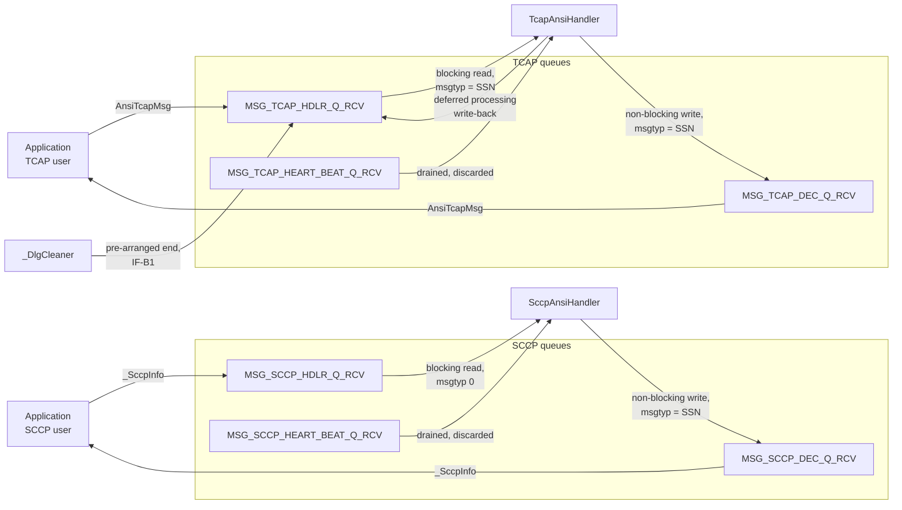

| Queue          | Config key                  | Producer                                 | Consumer                    | Payload       | Mode               | `msgtyp`          |
| -------------- | --------------------------- | ---------------------------------------- | --------------------------- | ------------- | ------------------ | ----------------- |
| SCCP inbound   | `MSG_SCCP_HDLR_Q_RCV`       | Application                              | `SccpAnsiHandler` Tx thread | `_SccpInfo`   | Blocking read      | **0** — see below |
| SCCP outbound  | `MSG_SCCP_DEC_Q_RCV`        | `SccpAnsiHandler` Rx thread              | Application                 | `_SccpInfo`   | Non-blocking write | SSN               |
| SCCP heartbeat | `MSG_SCCP_HEART_BEAT_Q_RCV` | External                                 | `SccpAnsiHandler` Rx thread | Opaque text   | Non-blocking read  | SSN               |
| TCAP inbound   | `MSG_TCAP_HDLR_Q_RCV`       | Application, cleaner, handler write-back | `TcapAnsiHandler` Tx thread | `AnsiTcapMsg` | Blocking read      | SSN               |
| TCAP outbound  | `MSG_TCAP_DEC_Q_RCV`        | `TcapAnsiHandler` Rx thread              | Application                 | `AnsiTcapMsg` | Non-blocking write | SSN               |
| TCAP heartbeat | `MSG_TCAP_HEART_BEAT_Q_RCV` | External                                 | `TcapAnsiHandler` Rx thread | Opaque text   | Non-blocking read  | SSN               |

All queues are created with `IPC_CREAT | SS7_IPC_PERM`, where `SS7_IPC_PERM` is `0666`
(`include/Ss7ConstDef.h:113`). Keys are validated against the range
`SS7_MIN_IPC_Q_KEY` … `SS7_MAX_IPC_Q_KEY`, that is 1000 … 9999
(`include/Ss7ConstDef.h:184-185`).

### The SCCP inbound read uses message type 0

The SCCP handler reads its inbound queue with `msgtyp = 0`, meaning _any_ message type,
rather than filtering on its own SSN (`sccp/src/SccpAculabHandler.cc:774`). The reason is
recorded in the source: it allows the SCCP handler to accept messages produced by a
different module that tags them with that module's own SSN rather than the SCCP
handler's.

> **Interface consequence.** The SCCP inbound queue is **not** SSN-filtered. Any message
> placed on it will be read by the handler regardless of its type field. A deployment
> must not multiplex unrelated traffic onto this queue expecting the handler to ignore
> it. The TCAP inbound queue, by contrast, _is_ filtered on the handler's SSN.

### The heartbeat queues

Both handlers drain a heartbeat queue at the top of every receive iteration
(`sccp/src/SccpAculabHandler.cc:614`) and **discard the content**. The read is
non-blocking and its return value is explicitly cast away. The queue exists so that an
external liveness monitor can write to it without filling it. No content is interpreted.

`[NEEDS INPUT: which component writes to the heartbeat queues, and what is the expected cadence?]`

## 10.3 Queue Error Handling and Recovery

Queue operations return a status enumeration which is routed to one of three handlers in
the utility class: create-error, read-error and write-error. The recovery model is:

| Condition                                  | Action                                                        |
| ------------------------------------------ | ------------------------------------------------------------- |
| Create failed                              | Log `GSYS06`; classification determines whether startup fails |
| Read failed because the queue was removed  | **Recreate the queue** and continue                           |
| Read failed for another reason             | Log `GSYS07`, continue the loop                               |
| Write failed because the queue was removed | Recreate and retry                                            |
| Write failed because the queue is full     | Log `GSYS08`; message dropped                                 |
| Write failed with size mismatch            | Log; message dropped — this is the R-01 and R-02 symptom      |

The recreate-on-removal behaviour makes the handler resilient to an operator removing a
queue with `ipcrm` while it is running, but it also means **a queue removed and recreated
loses every message that was in it**, silently from the application's point of view.

## 10.4 Shared Memory Architecture

**Diagram D-17 — Shared memory and semaphore map.**

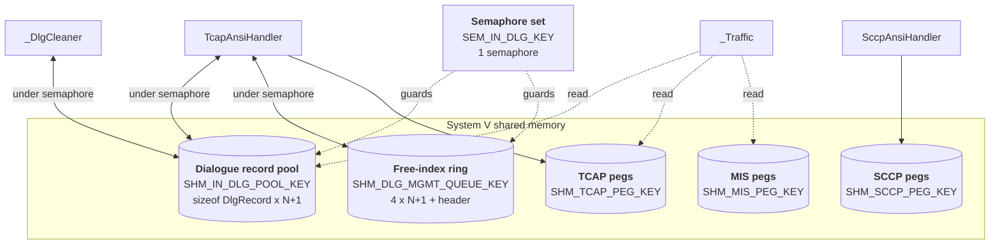

| Segment              | Config key               | Owner                            | Attachers                           | Size formula                                                    |
| -------------------- | ------------------------ | -------------------------------- | ----------------------------------- | --------------------------------------------------------------- |
| Dialogue record pool | `SHM_IN_DLG_POOL_KEY`    | First `TcapAnsiHandler` to start | All TCAP handlers, cleaner, traffic | `sizeof(DlgRecord) × (N + 1)` where N = `MAX_ACU_TCAP_DLG_SIZE` |
| Free-index ring      | `SHM_DLG_MGMT_QUEUE_KEY` | Same                             | Same                                | `sizeof(UINT32) × (N + 1) + sizeof(header)`                     |
| TCAP pegs            | `SHM_TCAP_PEG_KEY`       | `TcapAnsiHandler`                | Traffic, external readers           | Framework-defined                                               |
| SCCP pegs            | `SHM_SCCP_PEG_KEY`       | `SccpAnsiHandler`                | External readers                    | Framework-defined                                               |
| MIS pegs             | `SHM_MIS_PEG_KEY`        | External                         | Traffic                             | Framework-defined                                               |

### Creation semantics

Segments are created with `IPC_CREAT | IPC_EXCL | 0666`, falling back to attaching an
existing segment when creation fails because it already exists. The first process to
start therefore initialises the pool and the ring; subsequent processes attach to what
is already there.

> **This makes startup order significant.** A handler that attaches to a pool created
> with a _different_ `MAX_ACU_TCAP_DLG_SIZE` will index beyond the allocated segment.
> The configuration consistency rule in 17.4 exists for this reason.

## 10.5 Semaphore Architecture

| Property           | Value                                                                            |
| ------------------ | -------------------------------------------------------------------------------- |
| Config key         | `SEM_IN_DLG_KEY`                                                                 |
| Set size           | 1 semaphore (`NUM_OF_SEM`)                                                       |
| Sub-IDs enumerated | Inbound pool (0), outbound pool (1), management queue (2)                        |
| Sub-IDs used       | **0 only**                                                                       |
| Lock               | Two ops: wait-for-zero, then increment. Both with undo; no-wait on the increment |
| Unlock             | One op: decrement, with undo and no-wait                                         |
| Protects           | Dialogue allocation, release and update; the free-index ring header and body     |

The undo flag is the important detail: if a process holding the lock dies, the kernel
reverses its semaphore operation and the lock is released. Without it, a handler crash
during dialogue allocation would deadlock every other TCAP process on the host.

The no-wait flag on the increment means the lock is not a blocking wait in the usual
sense; contention is resolved by the wait-for-zero operation preceding it.

## 10.6 Key Allocation and Collision Avoidance

| Object class       | Valid range | Source                                                                  |
| ------------------ | ----------- | ----------------------------------------------------------------------- |
| Message queue keys | 1000 … 9999 | `SS7_MIN_IPC_Q_KEY` / `SS7_MAX_IPC_Q_KEY` (`include/Ss7ConstDef.h:184`) |
| Shared memory keys | 1000 … 9999 | `SHM_MIN` / `SHM_MAX`                                                   |
| Semaphore keys     | 1000 … 9999 | `SEM_MIN` / `SEM_MAX`                                                   |

**Every key is explicitly configured.** None are derived from a path or from the SSN.
This means key allocation is a deployment planning task, and the planning must cover
every process on the host, not just this product.

### What a collision looks like

| Collision                                                             | Symptom                                                                                                             |
| --------------------------------------------------------------------- | ------------------------------------------------------------------------------------------------------------------- |
| Two handlers configured with the same inbound queue key               | Both read from the same queue; each receives roughly half the messages; the application sees non-deterministic loss |
| A queue key colliding with an unrelated product                       | Foreign messages arrive at the handler and are rejected on size or type; the handler logs size errors               |
| Two deployments sharing a dialogue pool key with different pool sizes | Memory corruption in the smaller of the two                                                                         |

There is no runtime collision detection. `[NEEDS INPUT: is there a deployment-wide IPC key register, and who owns it?]`

## 10.7 Kernel Tunables

| Tunable  | Governs                         | Required value                                                         |
| -------- | ------------------------------- | ---------------------------------------------------------------------- |
| `msgmni` | System-wide message queue count | ≥ 3 × (number of handlers) + 1                                         |
| `msgmnb` | Maximum bytes per queue         | ≥ desired queue depth × `sizeof(AnsiTcapMsg)`                          |
| `msgmax` | Maximum single message size     | ≥ `sizeof(AnsiTcapMsg)`, currently 432 bytes without conditional tails |
| `shmmni` | System-wide segment count       | ≥ 2 + number of peg segments                                           |
| `shmmax` | Maximum single segment size     | ≥ `sizeof(DlgRecord) × (N + 1)`                                        |
| `shmall` | Total shared memory pages       | ≥ sum of all segments, in pages                                        |
| `semmni` | Semaphore set count             | ≥ 1 per deployment                                                     |
| `semmns` | Total semaphores                | ≥ 1 per deployment                                                     |

**Worked example.** For a deployment with 4 handlers, a 200,000-record dialogue pool and
a desired queue depth of 500 messages:

| Tunable  | Calculation                   | Value                                                        |
| -------- | ----------------------------- | ------------------------------------------------------------ |
| `msgmni` | 3 × 4 + 1                     | ≥ 13                                                         |
| `msgmnb` | 500 × 432                     | ≥ 216,000                                                    |
| `msgmax` | `sizeof(AnsiTcapMsg)`         | ≥ 432                                                        |
| `shmmax` | `sizeof(DlgRecord)` × 200,001 | `[NEEDS INPUT: confirm sizeof(DlgRecord) on the target ABI]` |

`[NEEDS INPUT: target queue depth in messages — drives msgmnb]`

## 10.8 IPC Lifecycle and Cleanup

**IPC objects are not removed on process exit.** Neither handler unlinks its queues,
segments or semaphore during shutdown. This is deliberate — it allows a handler restart
without losing queued messages or the dialogue pool — but it makes cleanup an explicit
operational step.

| Situation                                         | Required action                                                                                          |
| ------------------------------------------------- | -------------------------------------------------------------------------------------------------------- |
| Normal restart of a handler                       | **None.** Queues and pool are reattached                                                                 |
| Restart after a configuration change to pool size | **Remove the pool and ring segments** before restart, or the handler attaches to a wrongly sized segment |
| Restart after a change to any IPC key             | Remove the old objects, or they leak                                                                     |
| Restart after abnormal exit with a held semaphore | None — the undo flag has already released it                                                             |
| Clean rebuild or test run                         | Remove all queues to avoid stale messages of a different size being read                                 |

The procedure is documented in `[TSS-TEST-SCCP 2.2]`: list objects with `ipcs`, then
remove by key. It is a mandatory pre-step for every test run in that document, and the
same applies to any deployment where the structure layout may have changed.

> **The most common operational failure in this area** is restarting after a rebuild that
> changed a structure size, without clearing the queues. The handler then reads a stale
> message of the old size and reports a size error, which looks like an interface defect
> but is a cleanup omission.

---

# 11. Data Architecture

## 11.1 The Shared Header Contract

| Header                          | Contents                                                                                                | ABI-sensitive                              |
| ------------------------------- | ------------------------------------------------------------------------------------------------------- | ------------------------------------------ |
| `include/Ss7Structs.h`          | `SCCPAddress` / `TCAPAddress`, `TCAPOperation`, `TCAPProblem`, transaction and component sub-structures | **Yes**                                    |
| `include/TcapStructs.h`         | `AnsiTcapMsg`, `AnsiTcapComponent`, package and component enumerations                                  | **Yes**                                    |
| `include/MsuStructs.h`          | `_SccpInfo`, `_SccpUdt`                                                                                 | **Yes**                                    |
| `include/Ss7ConstDef.h`         | Product version, limits, IPC ranges, config file names, signal numbers                                  | No — constants only                        |
| `include/SS7LogCodes.h`         | Log code enumeration                                                                                    | No                                         |
| `sccp/include/MsuAnsiStructs.h` | ANSI TCAP tag table                                                                                     | No — constants only, but protocol-critical |

The three ABI-sensitive headers define the northbound interface. **Any change to them is
an interface change** and obliges every process on both sides of every message queue to
be rebuilt (19.5).

## 11.2 Northbound Message Structures

### `_SccpInfo` — the SCCP path payload

Defined in `include/MsuStructs.h`. Carried on `IF-N1` in both directions.

| Field                          | Type                | Direction | Semantics                                                                                                  |
| ------------------------------ | ------------------- | --------- | ---------------------------------------------------------------------------------------------------------- |
| `msgType`                      | `UINT8`             | Both      | `SCCP_MSG_UDT` (9) or `SCCP_MSG_UDTS` (10). Only UDT is accepted on transmit                               |
| `udt.pcMsgHdlg`                | `UINT8` union       | Both      | Protocol class in bits 0–3, message handling in bits 4–7, return option in bit 7 (6.1)                     |
| `udt.cldPartyAddress`          | `TCAPAddress`       | Both      | Called party. Remote on transmit, local on receive (6.2)                                                   |
| `udt.clgPartyAddress`          | `TCAPAddress`       | Both      | Calling party. Local on transmit, remote on receive                                                        |
| `udt.transInfo.pkgType`        | `EnumTcapTransType` | Both      | ANSI package type                                                                                          |
| `udt.transInfo.origTransIdLen` | `UINT8`             | Both      | Originating transaction ID length                                                                          |
| `udt.transInfo.origTransId`    | `UINT32`            | Both      | Originating transaction ID                                                                                 |
| `udt.transInfo.destTransIdLen` | `UINT8`             | Both      | Destination transaction ID length                                                                          |
| `udt.transInfo.destTransId`    | `UINT32`            | Both      | Destination transaction ID                                                                                 |
| `udt.dlgInfo.dlgPdu`           | Byte array          | Both      | Opaque passthrough of a dialogue portion if present in the received bytes. Not ANSI dialogue support (6.4) |
| `udt.compInfo`                 | Union               | Both      | Component, discriminated by component type — see 11.3                                                      |

Conditional tails (11.5) may append further fields depending on compile flags.

### `AnsiTcapMsg` — the TCAP path payload

Defined in `include/TcapStructs.h`. Carried on `IF-N2` in both directions and on `IF-B1`.

| Field group                           | Semantics                                                                                                                                       |
| ------------------------------------- | ----------------------------------------------------------------------------------------------------------------------------------------------- |
| `ssn`                                 | Subsystem number; also used as the queue message type                                                                                           |
| `dialogueId`                          | The product's dialogue identifier. Allocated by the handler for locally initiated dialogues; supplied by the handler for network-initiated ones |
| `tcapDlg`                             | The ANSI package type, `EnumTcapDlg` (6.4)                                                                                                      |
| `tcUserId`                            | **Component index** when an application splits a multi-component message (12.3)                                                                 |
| `lastComponent`                       | Marks the final component of a set                                                                                                              |
| Origination and destination addresses | `SCCPAddress` structures                                                                                                                        |
| Component                             | One `AnsiTcapComponent` — one component per message                                                                                             |

**One component per message** is the defining property of this interface and is
elaborated in 12.3.

Size: 432 bytes without conditional tails, against 520 bytes for the older structure it
replaced. The difference is why R-02 manifests as a size error.

## 11.3 Address and Component Sub-Structures

### `SCCPAddress` / `TCAPAddress`

| Field              | Type        | Notes                                             |
| ------------------ | ----------- | ------------------------------------------------- |
| `addressIndicator` | `UINT8`     | Presence bit map — see the mapping table in 6.2   |
| `subsystemNumber`  | `UINT8`     |                                                   |
| `pointCode`        | `UINT32`    | 24-bit ANSI point code                            |
| `natureOfAddress`  | `UINT8`     | **Present but never encoded** (6.2)               |
| `translationType`  | `UINT8`     |                                                   |
| `numberingPlan`    | `UINT8`     |                                                   |
| `encodingScheme`   | `UINT8`     | BCD odd or BCD even; drives the final-nibble mask |
| `numberOfDigits`   | `UINT8`     | ≤ `MAX_GLOBAL_TITLE_DIGITS` (20)                  |
| `digits`           | `UINT8[20]` | One digit per byte, BCD or ASCII (6.2)            |

### `TCAPOperation`

| Field           | Purpose                                                                                                                                                                                                                                      |
| --------------- | -------------------------------------------------------------------------------------------------------------------------------------------------------------------------------------------------------------------------------------------- |
| `operationCode` | The operation code. Interpreted as an integer for National, or as Family in the high byte and Specifier in the low byte for Private                                                                                                          |
| `isPrivate`     | Selects the National or Private tag on encode; set from the received tag on decode                                                                                                                                                           |
| `wireOpCode[2]` | **A two-byte buffer whose only purpose is lifetime.** The Aculab component builder stores a pointer to the operation code bytes and serialises only at send time (6.6). Placing the buffer in this structure guarantees it outlives the send |

`wireOpCode` is an implementation artefact exposed in an interface structure. It is not
populated by the application and must be ignored by it. It is documented here so that a
reader does not mistake it for a field with protocol meaning.

### Component union discrimination

The component structure carries a union of invoke, return-result, return-error, reject
and abort variants. **The union must be read according to the component type field.**
Reading it unconditionally is a fault — the product's own diagnostic printer previously
did so and crashed, and now discriminates on type before dereferencing.

## 11.4 Dialogue Record

`DlgRecord` lives in shared memory and is the durable representation of a TCAP dialogue.

| Field group                   | Contents                                                   | Valid in                                       |
| ----------------------------- | ---------------------------------------------------------- | ---------------------------------------------- |
| Identity                      | `dlgId`, `ssn`, `transValidationKey`                       | All processes                                  |
| Timing                        | `insertTime`                                               | All processes — this is what the cleaner scans |
| Transaction identity          | `origTransId`, `destTransId` and their lengths, `invokeId` | All processes                                  |
| Addressing                    | `callingAddr`, `calledAddr` as Aculab address structures   | All processes                                  |
| Protocol state                | `opCode`, `dlgType`, `applicationContext`, `restarted`     | All processes                                  |
| SAP binding                   | `ssapInstance`                                             | Owning handler                                 |
| **Aculab transaction handle** | `trans`                                                    | **Owning handler process only**                |

> **The transaction handle is a process-address-space pointer stored in shared memory.**
> It is meaningful only inside the handler that created it. The cleaner and the traffic
> reporter read this record and must never dereference that field — and they do not. It
> is also invalid after a handler restart, even to that handler. This is **R-05**, and it
> is the reason the cleaner requests teardown from the handler (AD-09) rather than
> performing it itself.

Byte-level layout is in `[TCAP-HLD 9.1]`.

## 11.5 Compile-Flag ABI Rule

Several interface structures have **conditional tails** — fields appended by `#ifdef`
guards. A structure with a conditional tail has a different `sizeof()` depending on the
flags the translation unit was compiled with.

Because System V message queues transfer a fixed byte count agreed by both sides, this
makes compile flags **part of the interface contract**.

> **Invariant. Every process that reads from or writes to a given message queue must be
> compiled with an identical set of flags affecting interface structure layout.**

### Current state

| Flag                                            | `sccp/Makefile` | `tcap/Makefile` | Effect                                                                |
| ----------------------------------------------- | --------------- | --------------- | --------------------------------------------------------------------- |
| `__cplusplus=1`                                 | Defined         | Defined         | Language mode                                                         |
| Conditional-tail flag on the message structures | **Not defined** | **Defined**     | Appends a trailing field to interface structures, changing `sizeof()` |
| `SS7_TIMESTAMP`                                 | Not defined     | Not defined     | Would append a timestamp field                                        |

**The two Makefiles disagree.** The TCAP module defines a flag that appends a field to
shared interface structures; the SCCP module does not. Any process pair spanning that
boundary computes different structure sizes. A source comment in the SCCP receive path
warns about exactly this (`sccp/src/SccpAculabHandler.cc:765-767`). This is **R-01**.

### Verification procedure

Before any deployment, and after any Makefile or header change:

| Step | Action                                                                                          |
| ---- | ----------------------------------------------------------------------------------------------- |
| 1    | For each message queue, list every process that reads or writes it                              |
| 2    | For each such process, extract the compile-flag set from its build                              |
| 3    | Confirm the sets are identical with respect to every flag guarding an interface structure field |
| 4    | Confirm by running a size assertion in each binary and comparing the reported `sizeof()` values |

Step 4 is the only one that catches the case where a flag is set through an
unexpected path. `[NEEDS INPUT: should a startup size assertion and log line be added to each handler?]`

## 11.6 Data Lifetime and Volatility

| Data                                  | Lives in            | Survives thread exit | Survives process restart        | Survives host restart |
| ------------------------------------- | ------------------- | -------------------- | ------------------------------- | --------------------- |
| Decode and encode buffers             | Thread stack        | No                   | No                              | No                    |
| SAP status record                     | Process heap        | Yes                  | No                              | No                    |
| Configuration values                  | Process heap        | Yes                  | No — re-read at start           | No                    |
| Aculab SAP, connections, transactions | Aculab library heap | Yes                  | No                              | No                    |
| Dialogue records — data fields        | Shared memory       | Yes                  | **Yes**                         | No                    |
| Dialogue records — transaction handle | Shared memory       | Yes                  | **No — becomes invalid** (R-05) | No                    |
| Free-index ring                       | Shared memory       | Yes                  | **Yes**                         | No                    |
| Peg counters                          | Shared memory       | Yes                  | **Yes**                         | No                    |
| Queued messages                       | Kernel              | Yes                  | **Yes**                         | No                    |
| Logs and trace                        | Filesystem          | Yes                  | Yes                             | Yes                   |

The row that matters most is the dialogue record: **its data survives a restart but its
transaction handle does not.** A restarted handler therefore inherits a pool of records
describing dialogues it can no longer act on. Two mechanisms exist to deal with this and
they are mutually exclusive:

| Mechanism   | Selected by                | Behaviour                                                                                                                 |
| ----------- | -------------------------- | ------------------------------------------------------------------------------------------------------------------------- |
| Cold start  | `RESTORATION_REQUIRED = 0` | On startup the handler sweeps the pool and releases every record belonging to its SSN, discarding all inherited dialogues |
| Restoration | `RESTORATION_REQUIRED = 1` | Surviving records are used to re-create Aculab transactions. See 13.5 and **R-04**                                        |

## 11.7 Persistence

**There is none.** The product uses no database, writes no state files, and holds nothing
on disk except logs and trace output. The `SQLAPI` include path present in both Makefiles
is unused — no SQL symbol appears in either source tree.

The recovery implications are:

| Event                             | State outcome                                                                    |
| --------------------------------- | -------------------------------------------------------------------------------- |
| Handler restart, cold-start mode  | All dialogues lost. Peers time out                                               |
| Handler restart, restoration mode | Dialogues whose records are within their timeout are re-created, subject to R-04 |
| Host restart                      | All shared memory lost. All dialogues lost                                       |
| Configuration change              | Takes effect at next start, or at reload for the subset in 13.4                  |

There is no scenario in which a dialogue survives a host restart. Any availability
requirement stronger than that must be met above this layer.
`[NEEDS INPUT: what is the availability target, and is dialogue loss on host restart acceptable?]`

---

# 12. Interface Specifications

This chapter is the Interface Control Document for the product. It is the reference an
integrating application, a deployment engineer or an Aculab-upgrade reviewer works from.
Section 12.10 is the **Scenarios view** of the 4+1 model (4.3).

## 12.1 Interface Catalogue and Versioning

| ID      | Name            | Type                   | Peer                    | Reference |
| ------- | --------------- | ---------------------- | ----------------------- | --------- |
| `IF-N1` | SCCP northbound | System V message queue | Application             | 12.2      |
| `IF-N2` | TCAP northbound | System V message queue | Application             | 12.3      |
| `IF-S1` | Aculab SCCP API | Library call over TCP  | Aculab driver           | 12.4      |
| `IF-S2` | Aculab TCAP API | Library call over TCP  | Aculab driver           | 12.5      |
| `IF-C1` | Configuration   | File                   | Filesystem              | 12.6, 17  |
| `IF-P1` | Process control | POSIX signal           | Operator, init system   | 12.7      |
| `IF-B1` | Cleaner control | System V message queue | `_DlgCleaner` → handler | 12.8      |
| `IF-O1` | Statistics      | System V shared memory | OAM reader              | 12.9      |
| `IF-O2` | Logs and trace  | File, stdout           | OAM, operator           | 12.9      |

### Versioning policy

There is **no interface version negotiation**. `IF-N1` and `IF-N2` are binary structure
interfaces whose compatibility is established at build time, not at run time. The
governing rules are:

| Rule                                                                                                           | Consequence                                                          |
| -------------------------------------------------------------------------------------------------------------- | -------------------------------------------------------------------- |
| A change to any field of `_SccpInfo`, `AnsiTcapMsg` or their sub-structures is a **breaking interface change** | Every process on both sides must be rebuilt and redeployed together  |
| A change to the compile-flag set affecting those structures is equally breaking                                | 11.5                                                                 |
| Adding a field is not backward compatible                                                                      | The structure size changes, and the queue transfer size with it      |
| IPC keys are part of the interface                                                                             | Changing one requires coordinated configuration change on both sides |

`[NEEDS INPUT: should a version field and a startup size assertion be added to the northbound structures?]`

## 12.2 `IF-N1` — SCCP Northbound Interface

### Queues

| Queue     | Config key                  | Direction             | Mode                        | `msgtyp` written     | `msgtyp` read        |
| --------- | --------------------------- | --------------------- | --------------------------- | -------------------- | -------------------- |
| Inbound   | `MSG_SCCP_HDLR_Q_RCV`       | Application → handler | Handler reads blocking      | Application's choice | **0 — any type**     |
| Outbound  | `MSG_SCCP_DEC_Q_RCV`        | Handler → application | Handler writes non-blocking | Handler's SSN        | Application's choice |
| Heartbeat | `MSG_SCCP_HEART_BEAT_Q_RCV` | External → handler    | Handler reads non-blocking  | External             | Handler's SSN        |

Transfer size is `sizeof(_SccpInfo)` in both directions.

> **The inbound queue is not SSN-filtered** (10.2). Do not multiplex unrelated traffic
> onto it.

### Field population — application to handler

| Field                                                  | Requirement                                                                               |
| ------------------------------------------------------ | ----------------------------------------------------------------------------------------- |
| `msgType`                                              | **Must** be `SCCP_MSG_UDT` (9). Any other value is discarded                              |
| `udt.pcMsgHdlg`                                        | Protocol class in the low nibble; set bit `0x80` to request return-on-error               |
| `udt.clgPartyAddress`                                  | Calling party — **the local end**. Encoded as the Aculab local address                    |
| `udt.cldPartyAddress`                                  | Called party — the remote end. **Its point code is overwritten from configuration** (6.3) |
| `udt.transInfo.pkgType`                                | ANSI package type. Determines the package tag emitted                                     |
| `udt.transInfo.origTransId`, `destTransId` and lengths | Populated per the rules in 6.5                                                            |
| `udt.dlgInfo.dlgPdu`                                   | Optional. Copied verbatim into the encoded message if the byte count is non-zero          |
| `udt.compInfo`                                         | The component. Union member selected by component type                                    |

Digits may be supplied as BCD or as ASCII; ASCII is detected heuristically and converted
(6.2).

### Field population — handler to application

The handler zeroes the structure and populates it from the decoded message. Address
mapping is the mirror of the transmit case (6.2). The component union is populated
according to the decoded component type and **must be read according to that type**.

### Error conditions visible to the application

| Condition                             | How the application observes it                                   |
| ------------------------------------- | ----------------------------------------------------------------- |
| Message discarded for wrong `msgType` | Nothing is returned. Log only                                     |
| Encode failure                        | Nothing is returned. Log `ACUSCCP17`, `ACUSCCP18` or `ACUSCCP22`  |
| Destination unavailable               | Nothing is returned. Log `ACUSCCP24`                              |
| Network returned the message          | **Not surfaced to the application.** Log `ACUSCCP36` and peg only |

> **Architectural gap.** The SCCP path has **no negative acknowledgement to the
> application.** A message that is dropped for any reason is dropped silently from the
> application's perspective. An application must implement its own response timer.
> `[NEEDS INPUT: is a negative acknowledgement required on IF-N1?]`

## 12.3 `IF-N2` — TCAP Northbound Interface

### Queues

| Queue     | Config key                  | Direction                                          | Mode               | `msgtyp`      |
| --------- | --------------------------- | -------------------------------------------------- | ------------------ | ------------- |
| Inbound   | `MSG_TCAP_HDLR_Q_RCV`       | Application, cleaner, handler write-back → handler | Blocking read      | Handler's SSN |
| Outbound  | `MSG_TCAP_DEC_Q_RCV`        | Handler → application                              | Non-blocking write | Handler's SSN |
| Heartbeat | `MSG_TCAP_HEART_BEAT_Q_RCV` | External → handler                                 | Non-blocking read  | Handler's SSN |

Transfer size is `sizeof(AnsiTcapMsg)`.

### Dialogue identity contract

| Case                            | Who assigns `dialogueId`                                                                                                      |
| ------------------------------- | ----------------------------------------------------------------------------------------------------------------------------- |
| Application initiates           | The handler allocates from the outgoing half of the pool and returns the identifier to the application on subsequent messages |
| Network initiates               | The handler allocates from the incoming half and supplies the identifier on the first message delivered to the application    |
| Continuing an existing dialogue | The application **must** echo the identifier it was given                                                                     |

An unrecognised identifier on a non-initiating message is rejected — the handler returns
an abort with an unrecognised-package-type cause.

A transaction-initiating package type on an identifier that already has a dialogue is
also rejected as a duplicate, with the same cause.

### The multi-component contract

This is the defining property of `IF-N2` and the part most often misunderstood.

> **One IPC message carries exactly one TCAP component.** A TCAP package containing
> several components is assembled by the handler from several IPC messages.

| Field           | Role                                                |
| --------------- | --------------------------------------------------- |
| `tcUserId`      | The component's index within the set, starting at 0 |
| `lastComponent` | Set on the final component of the set               |

The handler accumulates components in a per-dialogue map, keyed on `dialogueId`, and
emits a single TCAP package only when **both** conditions hold:

1. A component marked as last has arrived, and
2. The number of components received equals the highest index seen plus one.

Until then, each arriving message is buffered and nothing is sent.

**Diagram D-18 — Multi-component assembly.**

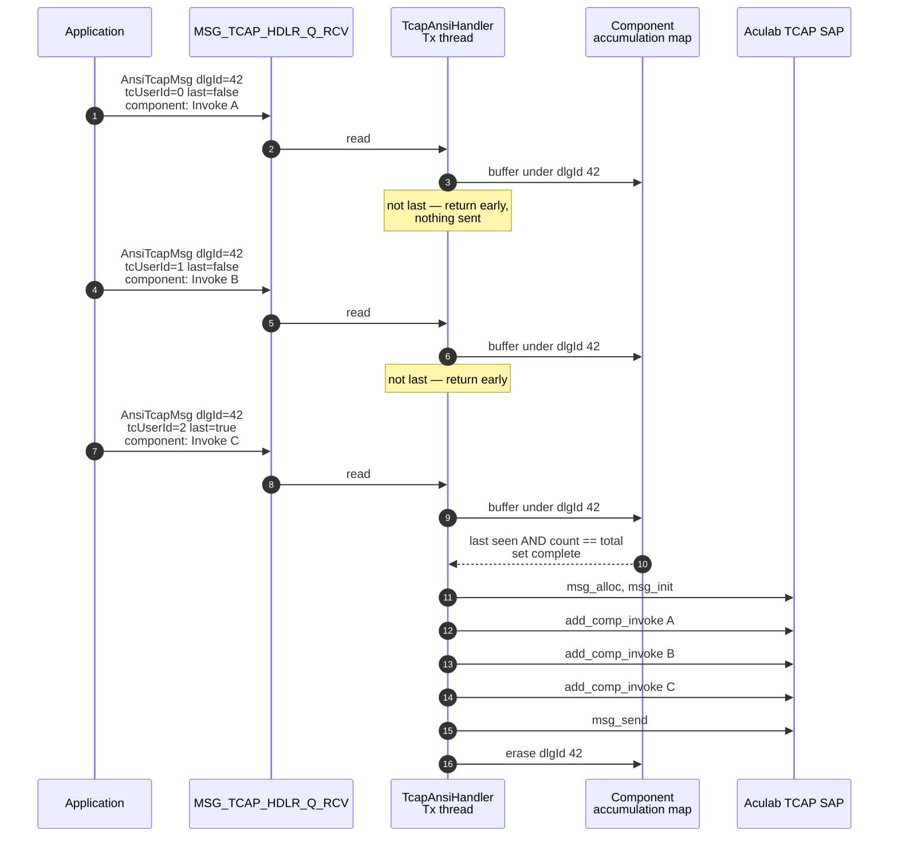

### Rules the application must observe

| #   | Rule                                                                  | Consequence of breaking it                                                                         |
| --- | --------------------------------------------------------------------- | -------------------------------------------------------------------------------------------------- |
| 1   | Indices must be contiguous from 0                                     | The completeness test never passes; the set is buffered indefinitely and the package is never sent |
| 2   | Exactly one component must be marked last                             | Same                                                                                               |
| 3   | At most `ACU_TCAP_MAX_COMPONENT` (5) components per package           | The buffer array is overrun                                                                        |
| 4   | All components of a set must carry the same `dialogueId`              | Components are split across map entries and neither set completes                                  |
| 5   | A single-component package must still set the last flag, with index 0 | Never sent                                                                                         |

> **There is no timeout on an incomplete component set.** A set that never completes
> occupies its map entry for the life of the process. Rules 1, 2, 4 and 5 therefore fail
> silently and cumulatively rather than producing an error.
> `[NEEDS INPUT: should an incomplete component set be aged out and rejected?]`

### Error conditions surfaced to the application

Unlike `IF-N1`, the TCAP path **does** return errors, as an abort message with the
originating and destination addresses swapped:

| Condition                                                        | Cause returned                                 |
| ---------------------------------------------------------------- | ---------------------------------------------- |
| Duplicate transaction-initiating message on an existing dialogue | Unrecognised package type                      |
| Message with no transaction context                              | Unrecognised package type                      |
| Message allocation, initialisation or component addition failed  | Unrecognised package type                      |
| No SAP instance available for transmission                       | Unrecognised package type, logged `ACUTCAP157` |
| Inbound message failed to decode                                 | Resource unavailable                           |

## 12.4 `IF-S1` — Aculab ANSI SCCP API Usage Register

Every `acu_sccp_*` function used by the product, with its role. Verified against
`sccp/src/` by symbol extraction.

### SAP lifecycle

| Function                     | Purpose                                                                    | Called from                             | Return handling               | Reference                 |
| ---------------------------- | -------------------------------------------------------------------------- | --------------------------------------- | ----------------------------- | ------------------------- |
| `acu_sccp_ssap_create`       | Create the SAP from a configuration file path, with the log-to-stderr flag | `sccp/src/SccpAculabApi.cc:185`, `:306` | `NULL` → `ACUSCCP01`, fatal   | `[ACU-SCCP NEEDS-CLAUSE]` |
| `acu_sccp_ssap_connect_sccp` | Establish the TCP attachment to the driver                                 | `sccp/src/SccpAculabApi.cc:265`         | Non-zero → `ACUSCCP02`, fatal | `[ACU-SCCP NEEDS-CLAUSE]` |
| `acu_sccp_ssap_delete`       | Destroy the SAP before re-creation, or on point-code mismatch              | `sccp/src/SccpAculabApi.cc:203`, `:297` | Void                          |                           |
| `acu_sccp_ssap_set_cfg_str`  | Set the trace tag to `sccp_<pc>_0`                                         | `sccp/src/SccpAculabApi.cc:207`, `:318` | Not checked                   |                           |

### Addressing

| Function                    | Purpose                                                                      | Called from    | Return handling                |
| --------------------------- | ---------------------------------------------------------------------------- | -------------- | ------------------------------ |
| `acu_sccp_ssap_get_locaddr` | Read the SAP local address, for the point-code cross-check and the trace tag | `:195`, `:295` | Dereferenced; assumed non-null |
| `acu_sccp_ssap_get_remaddr` | Read the SAP default remote address, for status subscription                 | `:210`, `:320` | Dereferenced                   |
| `acu_sccp_con_get_locaddr`  | Obtain the connection's local address for population before transmit         | `:694`         | Dereferenced                   |
| `acu_sccp_con_get_remaddr`  | Obtain the connection's remote address for population before transmit        | `:695`         | Dereferenced                   |

### Connectionless transfer

| Function                         | Purpose                                                                                    | Called from                                                                 | Return handling                          |
| -------------------------------- | ------------------------------------------------------------------------------------------ | --------------------------------------------------------------------------- | ---------------------------------------- |
| `acu_sccp_ssap_get_unitdata_con` | Obtain the single connectionless connection object, lazily on first connection-state event | `:663`                                                                      | Null check                               |
| `acu_sccp_con_set_cfg_int`       | Set QoS: priority 0, response priority 1, return option per message                        | `:667`, `:668`, `:713`                                                      | Not checked                              |
| `acu_sccp_unitdata_request`      | **The only transmit primitive used**                                                       | `:384`                                                                      | Non-zero → error logged, message dropped |
| `acu_sccp_ssap_msg_get`          | Poll for an inbound message, 500 ms timeout                                                | `:426`                                                                      | Negative → error; no-message → loop      |
| `acu_sccp_msg_free`              | Release a received message                                                                 | `sccp/src/SccpAculabHandler.cc:628`, `:652`, `:659`, `:701`, `:732`, `:744` | Void                                     |
| `acu_sccp_con_unblock`           | **Release receive credit** — see 9.3                                                       | `sccp/src/SccpAculabApi.cc:725`                                             | Void                                     |

### Status and network management

| Function                       | Purpose                                                        | Called from                      | Return handling                          |
| ------------------------------ | -------------------------------------------------------------- | -------------------------------- | ---------------------------------------- |
| `acu_sccp_enable_sp_status`    | Subscribe to signalling-point status for the remote point code | `:214`, `:324`                   | Void                                     |
| `acu_sccp_enable_user_status`  | Subscribe to subsystem status, wildcarding zero values         | `:227`, `:339`                   | Void                                     |
| `acu_sccp_get_con_state`       | Read host A and host B connection state for health evaluation  | `:457`, `:459`, `:645`, `:654`   | Return not checked; state dereferenced   |
| `acu_sccp_msg_get_con_state`   | Extract both connection states from a connection-state message | `:639`                           | Checked                                  |
| `acu_sccp_get_sccp_status`     | Query availability of a configured destination point code      | `:740`, `:742`, `:764`           | Drives the destination availability flag |
| `acu_sccp_msg_get_sccp_status` | Extract SCCP status from a status message, for diagnostics     | `sccp/src/SccpAculabUtil.cc:207` | Checked                                  |
| `acu_sccp_strerror`            | Convert an Aculab error code to text                           | `sccp/src/SccpAculabUtil.cc:287` | —                                        |

### Aculab types consumed

Beyond the calls above, the component reads these Aculab enumerations directly for
diagnostics and status evaluation. They are part of the interface surface and change with
an Aculab version:

| Type                                                  | Header               | Used for                                    |
| ----------------------------------------------------- | -------------------- | ------------------------------------------- |
| `acu_sccp_msg_type_t`                                 | `sccp_api.h`         | Event dispatch in the receive handler       |
| `acu_sccp_con_state_t`, `acu_sccp_cs_state_t`         | `sccp_api.h:298-306` | Health evaluation and transmit gating (9.5) |
| `acu_sccp_u_svals`                                    | `sccp_api.h:347`     | Subsystem status text conversion            |
| `acu_sccp_sp_svals`                                   | `sccp_api.h:359`     | Signalling point status text conversion     |
| `acu_sccp_sccp_svals`                                 | `sccp_api.h:373`     | Destination availability evaluation (6.3)   |
| `acu_sccp_addr_t`                                     | `sccp_api.h`         | Address encode and decode (6.2)             |
| `acu_sccp_msg_t`, `acu_sccp_con_t`, `acu_sccp_ssap_t` | `sccp_api.h`         | Opaque handles                              |

### Deliberately not used

The following are declared by `ACULAB_4-0/include/sccp_api.h` and are **not called
anywhere in the product**. This list makes the scope boundary in 2.4 provable.

| Group                                       | Functions                                                                                                                                                                                                                                                                                                                                                                  | Why not used                                                                      |
| ------------------------------------------- | -------------------------------------------------------------------------------------------------------------------------------------------------------------------------------------------------------------------------------------------------------------------------------------------------------------------------------------------------------------------------- | --------------------------------------------------------------------------------- |
| **Connection-oriented service (Class 2/3)** | `acu_sccp_connect_request`, `acu_sccp_connect_confirm`, `acu_sccp_connect_refused`, `acu_sccp_disconnect`, `acu_sccp_data_request`, `acu_sccp_con_create`, `acu_sccp_con_delete`                                                                                                                                                                                           | Connection-oriented SCCP is out of scope (2.4, 6.1)                               |
| **Connection-oriented timers**              | `acu_sccp_con_timer_start`, `acu_sccp_con_timer_restart`, `acu_sccp_con_timer_cancel`, `acu_sccp_dump_con_timers`                                                                                                                                                                                                                                                          | Applicable only to connection-oriented service                                    |
| **Event-driven receive**                    | `acu_sccp_event_create`, `acu_sccp_event_delete`, `acu_sccp_event_wait`, `acu_sccp_event_signal`, `acu_sccp_event_clear`, `acu_sccp_event_msg_get`, `acu_sccp_event_get_os_event`, `acu_sccp_event_ssap_attach`, `acu_sccp_event_ssap_detach`, `acu_sccp_event_ssap_detach_all`, `acu_sccp_event_con_attach`, `acu_sccp_event_con_detach`, `acu_sccp_event_con_detach_all` | The product polls rather than using the event interface (AD-07)                   |
| **Alternative message-get forms**           | `acu_sccp_con_msg_get`, `acu_sccp_con_wakeup_msg_get`, `acu_sccp_ssap_wakeup_msg_get`                                                                                                                                                                                                                                                                                      | The single SAP-level poll is sufficient for the single-connection model           |
| **Receive buffer copy**                     | `acu_sccp_msg_copy_rx_buffer`                                                                                                                                                                                                                                                                                                                                              | The decode path already deep-copies the payload (8.6)                             |
| **Connection blocking**                     | `acu_sccp_con_block`                                                                                                                                                                                                                                                                                                                                                       | The product never asserts backpressure toward the driver; it only releases credit |
| **Connection user pointer**                 | `acu_sccp_con_set_userptr`, `acu_sccp_con_get_userptr`                                                                                                                                                                                                                                                                                                                     | Only one connection exists per SAP; no association is needed                      |
| **Connection identity and integer config**  | `acu_sccp_con_get_ids`, `acu_sccp_con_set_cfg_str`, `acu_sccp_ssap_set_cfg_int`                                                                                                                                                                                                                                                                                            | Not required by the connectionless model                                          |
| **Aculab trace helpers**                    | `acu_sccp_trace`, `acu_sccp_trace_v`, `acu_sccp_trace_buf`, `acu_sccp_trace_error`                                                                                                                                                                                                                                                                                         | The product uses its own trace framework (16.3)                                   |

## 12.5 `IF-S2` — Aculab ANSI TCAP API Usage Register

### SAP lifecycle

| Function                     | Purpose                                                               | Return handling                              |
| ---------------------------- | --------------------------------------------------------------------- | -------------------------------------------- |
| `acu_tcap_ssap_create`       | Create the SAP with the ANSI standard flag and log-to-stderr          | `NULL` → fatal for that instance             |
| `acu_tcap_ssap_connect_sccp` | Establish the TCP attachment to the driver                            | Non-zero → instance not brought into service |
| `acu_tcap_ssap_delete`       | Destroy the SAP before re-creation                                    | Void                                         |
| `acu_tcap_ssap_set_cfg_int`  | Set transaction ID range, definite-length encoding, return-option QoS | Not checked                                  |
| `acu_tcap_ssap_set_cfg_str`  | Set trace tag, host A name, host B name                               | Not checked                                  |
| `acu_tcap_ssap_get_locaddr`  | Read the SAP local address for the point-code cross-check             | Dereferenced                                 |
| `acu_tcap_ssap_get_remaddr`  | Read the SAP default remote address                                   | Dereferenced                                 |

### Transactions

| Function                               | Purpose                                                                         |
| -------------------------------------- | ------------------------------------------------------------------------------- |
| `acu_tcap_transaction_create`          | Create a transaction for a locally initiated dialogue                           |
| `acu_tcap_transaction_delete`          | Destroy a transaction at dialogue end. Preceded by a block                      |
| `acu_tcap_transaction_restore`         | Re-create a transaction from a surviving dialogue record after reconnect (13.5) |
| `acu_tcap_operation_restore`           | Restore the pending operation on a restored transaction                         |
| `acu_tcap_transaction_restore_app_ctx` | Restore the recorded application context on a restored transaction              |
| `acu_tcap_trans_block`                 | Serialise processing of one transaction; taken before delete, retried once      |
| `acu_tcap_trans_unblock`               | **Release receive credit** on a transaction — see 9.3                           |
| `acu_tcap_trans_get_ids`               | Read the local and remote transaction identifiers                               |
| `acu_tcap_trans_set_userptr`           | Store the shared-memory dialogue record address on the transaction (AD-05)      |
| `acu_tcap_trans_get_userptr`           | Recover the dialogue record address from an inbound transaction                 |
| `acu_tcap_trans_get_locaddr`           | Access the transaction local address for population or restoration              |
| `acu_tcap_trans_get_remaddr`           | Access the transaction remote address                                           |

### Messages

| Function                       | Purpose                                                                |
| ------------------------------ | ---------------------------------------------------------------------- |
| `acu_tcap_msg_alloc`           | Allocate an outbound message on a transaction                          |
| `acu_tcap_msg_init`            | Initialise it with the ANSI package type                               |
| `acu_tcap_msg_send`            | Transmit. **This is where deferred serialisation occurs** (6.6)        |
| `acu_tcap_msg_free`            | Release an inbound or outbound message                                 |
| `acu_tcap_msg_decode`          | Decode an inbound message                                              |
| `acu_tcap_msg_has_components`  | Test whether the decoded message carries components                    |
| `acu_tcap_msg_get_component`   | Iterate components of a decoded message                                |
| `acu_tcap_ssap_msg_get`        | Poll for an inbound message, 500 ms timeout                            |
| `acu_tcap_msg_get_con_state`   | Extract connection state from a connection-state message               |
| `acu_tcap_msg_get_sccp_status` | Extract SCCP status for diagnostics (`tcap/src/TcapAculabUtil.cc:294`) |

### Component builders

| Function                               | Purpose                    | Note                                                                        |
| -------------------------------------- | -------------------------- | --------------------------------------------------------------------------- |
| `acu_tcap_msg_add_comp_invoke`         | Add an Invoke              | **Stores the operation-code pointer without copying** — see 6.6             |
| `acu_tcap_msg_add_comp_result`         | Add a Return Result        | Operation code passed as null — ANSI Return Result carries none on the wire |
| `acu_tcap_msg_add_comp_error`          | Add a Return Error         | Same National/Private pointer handling as Invoke                            |
| `acu_tcap_msg_add_comp_reject`         | Add a Reject               | Problem mapping is defective for types 2–4 — R-08                           |
| `acu_tcap_msg_add_ansi_abort_userinfo` | Add abort user information |

### Status and diagnostics

| Function                      | Purpose                                              |
| ----------------------------- | ---------------------------------------------------- |
| `acu_tcap_enable_sp_status`   | Subscribe to signalling-point status                 |
| `acu_tcap_enable_user_status` | Subscribe to subsystem status                        |
| `acu_tcap_get_con_state`      | Read host A and host B connection state per instance |
| `acu_tcap_strerror`           | Convert an Aculab error code to text                 |

### Deliberately not used

| Group                                      | Functions                                                                                                                                                                                                                                                                                                                                                                        | Why not used                                                                                                                            |
| ------------------------------------------ | -------------------------------------------------------------------------------------------------------------------------------------------------------------------------------------------------------------------------------------------------------------------------------------------------------------------------------------------------------------------------------- | --------------------------------------------------------------------------------------------------------------------------------------- |
| **Event-driven receive**                   | `acu_tcap_event_create`, `acu_tcap_event_delete`, `acu_tcap_event_wait`, `acu_tcap_event_signal`, `acu_tcap_event_clear`, `acu_tcap_event_msg_get`, `acu_tcap_event_get_os_event`, `acu_tcap_event_ssap_attach`, `acu_tcap_event_ssap_detach`, `acu_tcap_event_ssap_detach_all`, `acu_tcap_event_trans_attach`, `acu_tcap_event_trans_detach`, `acu_tcap_event_trans_detach_all` | The product polls (AD-07)                                                                                                               |
| **Dialogue portion construction**          | `acu_tcap_msg_add_dialogue`, `acu_tcap_msg_add_dlg_userinfo`, `acu_tcap_msg_add_dlg_confidentiality`, `acu_tcap_msg_add_dlg_security_context`                                                                                                                                                                                                                                    | **ANSI TCAP has no dialogue portion** (6.4). These calls appear only in disabled code (`tcap/src/TcapAculabApi.cc:2376` and neighbours) |
| **Operation timers**                       | `acu_tcap_operation_timer_start`, `acu_tcap_operation_timer_restart`, `acu_tcap_operation_cancel`, `acu_tcap_dump_operation_timers`                                                                                                                                                                                                                                              | Dialogue timing is managed by the product's own pool scan (AD-09)                                                                       |
| **Alternative message-get forms**          | `acu_tcap_trans_msg_get`, `acu_tcap_trans_wakeup_msg_get`, `acu_tcap_ssap_wakeup_msg_get`                                                                                                                                                                                                                                                                                        | The SAP-level poll serves all transactions on the instance                                                                              |
| **Receive buffer copy**                    | `acu_tcap_msg_copy_rx_buffer`                                                                                                                                                                                                                                                                                                                                                    | Not needed — see 8.6                                                                                                                    |
| **Convenience and per-transaction config** | `acu_tcap_msg_reply_reject`, `acu_tcap_msg_add_comp_param`, `acu_tcap_msg_get_ids`, `acu_tcap_trans_set_cfg_int`, `acu_tcap_trans_set_cfg_str`, `acu_tcap_get_sccp_status`, `acu_tcap_ssap_get_uni_transaction`                                                                                                                                                                  | The product constructs equivalents from lower-level calls, or does not need the capability                                              |
| **Aculab trace helpers**                   | `acu_tcap_trace`, `acu_tcap_trace_v`, `acu_tcap_trace_buf`, `acu_tcap_trace_error`                                                                                                                                                                                                                                                                                               | The product uses its own trace framework                                                                                                |

## 12.6 `IF-C1` — Configuration Interface

Three tiers, fully specified in 17.1. In summary:

| Tier                     | Files                                                     | Read by                                                    | When                                |
| ------------------------ | --------------------------------------------------------- | ---------------------------------------------------------- | ----------------------------------- |
| Product configuration    | `SccpAnsiHandler.cfg`, `TcapAnsiHandler.cfg`              | This product                                               | At start; a subset on reload signal |
| Aculab SAP configuration | `Sccp_<ssn>.cfg`, `Tcap_<ssn>.cfg`, `Tcap_<pc>_<ssn>.cfg` | **The Aculab library**, plus two keys read by this product | At SAP creation                     |
| Environment              | `PRODUCT_HOME`, `PRODUCT_CFG_PATH`, trace variables       | This product                                               | At start                            |

## 12.7 `IF-P1` — Process Control Interface

| Signal                                               | Number                           | Effect                                                                             |
| ---------------------------------------------------- | -------------------------------- | ---------------------------------------------------------------------------------- |
| `SIGINT`, `SIGTERM`, `SIGQUIT`, `SIGTSTP`, `SIGPIPE` | —                                | Clear the run flag; all loops exit at their next iteration                         |
| `SIGCFG`                                             | 10 (`include/Ss7ConstDef.h:112`) | Set the reload flag; configuration subset re-read at the next supervisor iteration |
| `SIGTRC`                                             | 12 (`include/Ss7ConstDef.h:111`) | Set the trace flag; trace state toggled lazily                                     |
| 30                                                   | 30                               | Thread exit. Handler calls `pthread_exit`. Registered but not currently sent       |
| `SIGHUP`, `SIGCHLD`                                  | —                                | Ignored                                                                            |

Full semantics in 13.3.

## 12.8 `IF-B1` — Cleaner Control Interface

The cleaner does not tear down dialogues itself (AD-09). It writes a control message onto
the handler's own inbound queue and lets the handler perform the teardown.

| Property         | Value                                                          |
| ---------------- | -------------------------------------------------------------- |
| Queue            | `MSG_TCAP_HDLR_Q_RCV` — the handler's normal inbound queue     |
| Payload          | `AnsiTcapMsg` with `tcapDlg` set to the pre-arranged-end value |
| Fields populated | `ssn`, `dialogueId`, `tcapDlg`                                 |
| Mode             | Non-blocking write, `msgtyp` = SSN                             |

### Known defect in this interface

> **The cleaner writes the wrong number of bytes.** It sizes its write from the older,
> larger message structure (520 bytes) while the handler reads using the current
> structure (432 bytes). The kernel rejects the oversized message, so **pre-arranged end
> notifications from the cleaner do not reach the handler.**
>
> The consequence is that dialogue reaping does not occur through this path, and the
> pool fills over time. This is **R-02** and is the highest-severity open defect in the
> product.

The other two writers to this queue — the application and the handler's own
write-back path — were corrected to use the current size; the cleaner was missed.

## 12.9 `IF-O1` / `IF-O2` — OAM Interfaces

| Interface          | Mechanism                                                              | Contract                                                                                                                                                                        |
| ------------------ | ---------------------------------------------------------------------- | ------------------------------------------------------------------------------------------------------------------------------------------------------------------------------- |
| `IF-O1` statistics | System V shared memory, keys `SHM_SCCP_PEG_KEY` and `SHM_TCAP_PEG_KEY` | A reader attaches and reads counter values by event index. Counters are monotonically increasing and are not reset by the product. No locking — reads may observe a torn update |
| `IF-O2` logs       | Framework log files                                                    | One record per event, carrying a code from `include/SS7LogCodes.h`, a severity and free text                                                                                    |
| `IF-O2` trace      | stdout                                                                 | Free-form developer trace with ANSI colour escapes, enabled by environment variable                                                                                             |
| Aculab log         | Aculab library log file                                                | Tagged `sccp_<pc>_0` / `tcap_<pc>_<instance>`; rotation configured in the Aculab SAP configuration                                                                              |

Full detail in 16.

## 12.10 Scenario Walkthroughs

_This section is the **Scenarios view** of the 4+1 model. Each scenario exercises the
logical, process, development and physical views together and traces the seven hops of
4.4._

### Scenario 1 — Application-initiated Query, answered with a Response

**Diagram D-19 — Application-initiated QUERY to RESPONSE.**

```mermaid
sequenceDiagram
    autonumber
    participant App as Application
    participant IQ as Inbound msgq
    participant Tx as Tx thread
    participant DM as DlgMgr<br/>shared memory
    participant SAP as Aculab SAP
    participant Drv as Aculab driver
    participant Net as SS7 network
    participant Rx as Rx thread
    participant OQ as Outbound msgq

    App->>IQ: AnsiTcapMsg<br/>QUERY WITH PERMISSION<br/>tcUserId=0 last=true<br/>Invoke component
    IQ->>Tx: blocking read
    Tx->>Tx: component set complete
    Tx->>Tx: no existing dialogue —<br/>select SAP instance by round-robin<br/>skipping gated-off instances
    Tx->>SAP: transaction_create
    SAP-->>Tx: transaction handle
    Tx->>DM: allocate dialogue record<br/>under semaphore
    DM-->>Tx: dialogueId
    Tx->>SAP: trans_set_userptr = record address
    Tx->>SAP: msg_alloc, msg_init QUERY
    Tx->>SAP: add_comp_invoke<br/>opcode buffer must outlive send
    Tx->>SAP: msg_send
    Note over Tx,SAP: BER serialisation happens here
    SAP->>Drv: over TCP, host A
    Drv->>Net: MSU
    Tx->>Tx: rate limiter check

    Net->>Drv: MSU — RESPONSE
    Drv->>SAP: over TCP
    Rx->>SAP: ssap_msg_get, 500 ms poll
    SAP-->>Rx: message
    Rx->>SAP: msg_decode
    Rx->>SAP: trans_get_userptr
    SAP-->>Rx: dialogue record address
    Rx->>DM: read record
    Rx->>OQ: AnsiTcapMsg RESPONSE<br/>with ReturnResult component<br/>non-blocking write
    Rx->>SAP: trans_unblock
    Rx->>SAP: msg_free
    Rx->>SAP: trans_block then transaction_delete
    Rx->>DM: release dialogue record
    OQ->>App: read
```

| Hop     | What happens                                                                                         |
| ------- | ---------------------------------------------------------------------------------------------------- |
| 7 → 6   | Application writes one `AnsiTcapMsg` per component to the inbound queue                              |
| 6 → 5   | Tx thread reads, assembles the component set, allocates the dialogue                                 |
| 5 → 4   | Component builders populate the Aculab message; send triggers serialisation                          |
| 4 → 3   | Aculab library transmits over TCP to host A                                                          |
| 3 → 2   | Driver hands to MTP3                                                                                 |
| 2 → 1   | MSU onto the network                                                                                 |
| Reverse | The response traverses the same path inward, resolving the dialogue via the transaction user pointer |

### Scenario 2 — Network-initiated Query

**Diagram D-20 — Network-initiated QUERY to RESPONSE.**

```mermaid
sequenceDiagram
    autonumber
    participant Net as SS7 network
    participant Drv as Aculab driver
    participant SAP as Aculab SAP
    participant Rx as Rx thread
    participant DM as DlgMgr<br/>shared memory
    participant OQ as Outbound msgq
    participant App as Application
    participant IQ as Inbound msgq
    participant Tx as Tx thread

    Net->>Drv: MSU — QUERY
    Drv->>SAP: over TCP
    Rx->>SAP: ssap_msg_get
    SAP-->>Rx: message
    Rx->>SAP: msg_decode
    Rx->>Rx: no existing dialogue,<br/>type is transaction-initiating
    Rx->>DM: allocate from the incoming half<br/>capture addresses, insert time, instance
    DM-->>Rx: dialogueId
    Rx->>SAP: trans_set_userptr = record address
    loop for each decoded component
        Rx->>OQ: AnsiTcapMsg with one component<br/>tcUserId set, last flag on the final one
    end
    Rx->>SAP: trans_unblock
    Rx->>SAP: msg_free
    OQ->>App: read components

    App->>IQ: AnsiTcapMsg RESPONSE<br/>echoing dialogueId<br/>ReturnResult component, last=true
    IQ->>Tx: blocking read
    Tx->>DM: look up dialogue record
    DM-->>Tx: record with transaction handle
    Tx->>SAP: msg_alloc, msg_init RESPONSE
    Tx->>SAP: add_comp_result
    Tx->>SAP: msg_send
    SAP->>Drv: over TCP
    Drv->>Net: MSU
    Tx->>SAP: trans_block, transaction_delete
    Tx->>DM: release dialogue record
```

**The critical application obligation** is at the point where it sends the response: it
must echo the `dialogueId` it was given. An incorrect or absent identifier produces an
abort rather than a response on the wire.

### Scenario 3 — Connectionless UDT over the SCCP path

| Step | Actor       | Action                                                                                               |
| ---- | ----------- | ---------------------------------------------------------------------------------------------------- |
| 1    | Application | Writes `_SccpInfo` with `msgType` = UDT to `MSG_SCCP_HDLR_Q_RCV`                                     |
| 2    | Tx thread   | Blocking read; waits for the SAP to be in service                                                    |
| 3    | Tx thread   | Normalises digits; encodes calling party to the local address and called party to the remote address |
| 4    | Tx thread   | **Overwrites the remote point code from configuration** via round-robin selection                    |
| 5    | Tx thread   | Sets local and remote addresses on the connection; applies the return option                         |
| 6    | Tx thread   | Encodes the ANSI TCAP package into a byte buffer                                                     |
| 7    | Tx thread   | `acu_sccp_unitdata_request`; increments the transmit peg                                             |
| 8    | Rx thread   | Poll returns a unitdata message; increments the receive peg                                          |
| 9    | Rx thread   | Decodes addresses, transaction portion and component into `_SccpInfo`                                |
| 10   | Rx thread   | Non-blocking write to `MSG_SCCP_DEC_Q_RCV`                                                           |
| 11   | Rx thread   | Unblocks the connection and frees the message                                                        |

### Scenario 4 — Network rejects a message

| Step | Actor       | Action                                                                           |
| ---- | ----------- | -------------------------------------------------------------------------------- |
| 1    | Tx thread   | Transmits successfully; the local call returns 0                                 |
| 2    | Network     | Cannot deliver — GTT failure, dead point code, or congestion                     |
| 3    | Network     | Returns the message                                                              |
| 4    | Rx thread   | Poll returns a **notice** event carrying the return cause                        |
| 5    | Rx thread   | Logs `ACUSCCP36` with the cause; increments the notice peg                       |
| 6    | Rx thread   | **Unblocks and frees** — omission here would permanently suspend further notices |
| 7    | Application | **Learns nothing.** The notice is not forwarded (12.2)                           |

### Scenario 5 — SAP fails and reconnects

| Step | Actor      | Action                                                                                                                                                                   |
| ---- | ---------- | ------------------------------------------------------------------------------------------------------------------------------------------------------------------------ |
| 1    | Supervisor | 3 s tick; reads both host connection states                                                                                                                              |
| 2    | Supervisor | Detects `IN_SERVICE` combined with a blocked bit, **or** 30 s silence with neither host in service                                                                       |
| 3    | Supervisor | Sets SAP state to `EXITING`; logs `ACUSCCP13`                                                                                                                            |
| 4    | Supervisor | Calls reconnect: read the local address, delete the SAP, clear the transmit flag, re-create, re-apply configuration, re-subscribe to status, reconnect                   |
| 5    | TCAP only  | Scan the dialogue pool; for records within their timeout and belonging to this instance, restore transaction, operation and application context; re-bind; mark restarted |
| 6    | Supervisor | Re-invokes thread creation — **without terminating the previous threads** (R-03)                                                                                         |
| 7    | Tx thread  | Resumes once the SAP reports in service                                                                                                                                  |
| 8    | Rx thread  | First status event restores destination availability (SCCP)                                                                                                              |

### Scenario 6 — Dialogue times out

| Step | Actor      | Action                                                                                                       |
| ---- | ---------- | ------------------------------------------------------------------------------------------------------------ |
| 1    | Cleaner    | 3 s tick; scans the whole pool, yielding periodically                                                        |
| 2    | Cleaner    | Finds a record whose age exceeds its timeout — the extended timeout applies to the configured long-lived SSN |
| 3    | Cleaner    | Writes a pre-arranged-end message to the handler's inbound queue                                             |
| 4    | —          | **Currently fails on the size mismatch (R-02).** The intended behaviour is described below                   |
| 5    | Handler Tx | Reads the message, releases the dialogue, blocks and deletes the transaction                                 |
| 6    | Handler Tx | Optionally emits a response-timeout indication upward, if configured                                         |

---

# 13. Control Plane Architecture

## 13.1 Startup Sequence

**Diagram D-21 — Startup sequence.**

```mermaid
sequenceDiagram
    autonumber
    participant OS as Operator / init
    participant Main as main
    participant Util as AculabUtil
    participant Lock as ProcessLock
    participant Peg as Peg framework
    participant Hdlr as Handler
    participant Cfg as Configuration
    participant IPC as System V IPC
    participant SAP as Aculab SAP

    OS->>Main: exec with arguments
    Main->>Main: validate argument count<br/>print banner and exit if wrong
    Main->>Main: validate SSN range 1..254
    Main->>Main: build process name and<br/>Aculab config filename
    Main->>Main: gLog.Init
    Main->>Util: LoadSignals
    Main->>Util: SetTransmitFlag
    Main->>Lock: SetProdProcName then Lock
    Lock-->>Main: fail: GSYS16, exit
    Main->>Main: log GSYS01 startup
    Main->>Peg: Init on the peg shared memory key
    Peg-->>Main: fail: GSYS04, exit
    Main->>Hdlr: Init with config file and SSN
    Hdlr->>Cfg: ReadIpcConfig — queue keys
    Hdlr->>Cfg: ReadKernelConfig — behaviour parameters
    Hdlr->>IPC: CreateMsgQ — create or attach queues
    Hdlr->>Cfg: read LocalPC from the Aculab config file
    Hdlr->>SAP: SsapCreate then SsapConnect
    Hdlr-->>Main: fail: GSYS04, exit
    Main->>Main: HandleThreads — create Tx, sleep 1 s, create Rx
    Main-->>Main: fail: GSYS04, exit
    Main->>Main: log GSYS03 init complete
    Main->>Util: ResetConfigFlag
    Main->>Main: enter supervisor loop
```

### Step table with failure behaviour

Traced from `sccp/src/SccpAculabHandlerMain.cc:141-280`.

| #   | Step                                             | Line   | On failure                             |
| --- | ------------------------------------------------ | ------ | -------------------------------------- |
| 1   | Argument count check                             | `:157` | Print product banner and usage; exit 1 |
| 2   | SSN range check, `0 < ssn < 255`                 | `:198` | Print usage; exit 1                    |
| 3   | Build process name `ACUSCCP_<ssn>`               | `:208` | —                                      |
| 4   | Build Aculab config filename `Sccp_<ssn>.cfg`    | `:215` | —                                      |
| 5   | Log framework init                               | `:222` | Trace error; exit 1                    |
| 6   | Register signal handlers                         | `:230` | —                                      |
| 7   | Set the transmit flag true                       | `:231` | —                                      |
| 8   | Acquire the process lock                         | `:233` | `GSYS16`; exit 1                       |
| 9   | Log `GSYS01` startup                             | `:244` | —                                      |
| 10  | Peg shared-memory init                           | `:246` | `GSYS04`; exit 1                       |
| 11  | Handler init — configuration, IPC, SAP           | `:255` | `GSYS04`; exit 1                       |
| 12  | Create threads                                   | `:266` | `GSYS04`; exit 1                       |
| 13  | Log `GSYS03` initialisation complete             | `:275` | —                                      |
| 14  | Reset the config flag; enter the supervisor loop | `:278` | —                                      |

**Every startup failure is fatal.** There is no degraded-start mode. This is principle
P-04: a configuration or environment fault must be visible immediately rather than
producing a process that runs but cannot pass traffic.

### Ordering constraints that matter

| Constraint                                                           | Reason                                                                           |
| -------------------------------------------------------------------- | -------------------------------------------------------------------------------- |
| Signals are registered **before** the process lock is acquired       | A signal arriving during lock acquisition must not kill the process uncleanly    |
| The process lock is acquired **before** IPC creation                 | Prevents two instances racing on the same queue keys                             |
| IPC queues are created **before** the SAP connects                   | Ensures a message arriving immediately after connect has somewhere to go         |
| The transmit thread is created **before** the receive thread         | The receive thread can immediately produce work; the transmit path must be ready |
| The `TcapAnsiHandler` cold-start pool sweep runs during handler init | Clears this SSN's stale dialogue records before any new allocation               |

## 13.2 Steady-State Supervision

The supervisor is the `main` thread after startup
(`sccp/src/SccpAculabHandlerMain.cc:280-319`):

```
while (KeepRunning()):
    if (ReloadConfig flag set):
        apply signal handling
        re-read the reloadable configuration subset
        reset the flag
    sleep(3)
    UpdateSsapStatus()        # read both host connection states
    if (!GetSsapStatus()):    # health evaluation
        log ACUSCCP13
        ReconnectSsap()
        HandleThreads()       # re-spawn -- see R-03
        usleep(1000)
```

| Property      | Value                                                         | Consequence                             |
| ------------- | ------------------------------------------------------------- | --------------------------------------- |
| Cadence       | 3 s                                                           | Fault detection latency is 0–3 s        |
| Health inputs | Both host connection states, and time since last SAP activity | 13.5                                    |
| Reload check  | Once per iteration, before the sleep                          | A reload signal takes effect within 3 s |
| Thread health | **Not evaluated**                                             | See the gap noted in 8.7                |

The TCAP supervisor follows the same shape but iterates over every SAP instance,
evaluating and reconnecting each independently.

## 13.3 Signal Architecture

### Registration

From `AculabUtil::LoadSignals` (`sccp/src/SccpAculabUtil.cc:313-333`):

| Signal     | Number | Disposition                                                                 | Line           |
| ---------- | ------ | --------------------------------------------------------------------------- | -------------- |
| `SIGHUP`   | 1      | Ignored                                                                     | `:319`         |
| `SIGABRT`  | 6      | Ignored, then **re-registered to the handler**                              | `:320`, `:331` |
| `SIGCHLD`  | 17     | Ignored                                                                     | `:322`         |
| `SIGINT`   | 2      | Handler                                                                     | `:323`         |
| `SIGTERM`  | 15     | Handler                                                                     | `:324`         |
| `SIGQUIT`  | 3      | Handler                                                                     | `:325`         |
| `SIGTSTP`  | 20     | Handler                                                                     | `:326`         |
| `SIGPIPE`  | 13     | Handler                                                                     | `:327`         |
| `SIGTRACE` | 12     | Handler                                                                     | `:328`         |
| `SIGCFG`   | 10     | Handler                                                                     | `:329`         |
| 30         | 30     | Handler                                                                     | `:332`         |
| `SIGSEGV`  | 11     | **Neither ignored nor handled** — both registration lines are commented out | `:321`, `:330` |

> **`SIGABRT` is registered twice**, first to be ignored and then to the handler. The
> second registration wins. The handler's `SIGABRT` case logs and ignores.

> **`SIGSEGV` has a handler case written but is never registered** (`:372`). A
> segmentation fault therefore terminates the process with the default disposition. This
> is arguably the correct outcome, but the dead handler case should be removed or the
> registration restored — it currently misleads a reader into thinking segfaults are
> caught. Recorded under R-12.

### Handler behaviour

| Signal                                               | Action                                  | Line          |
| ---------------------------------------------------- | --------------------------------------- | ------------- |
| `SIGABRT`                                            | Log and ignore                          | `:364`        |
| `SIGSEGV`                                            | Would clear the run flag — unreachable  | `:372`        |
| `SIGTRACE` (12)                                      | Set the trace flag                      | `:384`        |
| `SIGCFG` (10)                                        | Set the reload flag                     | `:392`        |
| `SIGTERM`, `SIGINT`, `SIGQUIT`, `SIGPIPE`, `SIGTSTP` | **Clear the run flag**                  | `:399`–`:443` |
| 30                                                   | `pthread_exit` for the receiving thread | `:447`        |
| Any other                                            | Log and ignore                          | `:457`        |

Every signal is logged with code `GSYS13`. The handler **re-registers itself** on exit
(`:463`), because the process uses the classic `signal()` interface whose disposition may
reset.

### Lazy flag application

Neither the trace flag nor the reload flag takes effect inside the handler. Both are
applied at the top of the run-condition predicate, which every loop evaluates. This keeps
the signal handler free of anything that is not async-signal-safe — an important property
given that the handler runs on whichever thread happens to receive the signal.

The consequence is that **a signal takes effect at the next loop iteration**, which is up
to 500 ms for a receive thread, up to 3 s for a supervisor, and **indefinitely for a
transmit thread** because it blocks on a queue read with no timeout (8.3).

### Sending signals operationally

```bash
kill -10 $(pgrep -f 'SccpAnsiHandler 149')
```

```bash
kill -12 $(pgrep -f 'SccpAnsiHandler 149')
```

The first triggers a configuration reload; the second toggles trace.

## 13.4 Configuration Reload

Reload is deliberately partial. Re-reading everything would require tearing down IPC
queues and SAPs, which is a restart in all but name.

### SCCP reload scope

| Parameter                   | Reloadable | Reason                                                              |
| --------------------------- | ---------- | ------------------------------------------------------------------- |
| `SCCP_PEG_REQUIRED`         | **Yes**    | A simple flag with no structural effect                             |
| `SCCP_MSG_DIPLAY_PARAM`     | **Yes**    | Diagnostic verbosity only                                           |
| `SCCP_DESTINATION_1`        | No         | Changing the destination mid-flight would silently redirect traffic |
| `SCCP_DESTINATION_2`        | No         | Same                                                                |
| `MSG_SCCP_HDLR_Q_RCV`       | No         | Requires queue re-creation and loses queued messages                |
| `MSG_SCCP_DEC_Q_RCV`        | No         | Same                                                                |
| `MSG_SCCP_HEART_BEAT_Q_RCV` | No         | Same                                                                |
| `LocalPC`                   | No         | Requires SAP re-creation                                            |

### TCAP reload scope

| Parameter              | Reloadable             | Effect                                                               |
| ---------------------- | ---------------------- | -------------------------------------------------------------------- |
| `NUMBER_OF_OPC`        | **Yes, additive only** | New SAP instances are created starting at the current instance count |
| `OPC_<n>`              | **Yes, additive only** | New point codes gain instances                                       |
| Existing SAP instances | No                     | Not re-read, not reconfigured, not removed                           |
| Dialogue timeouts      | No                     | Read once at start                                                   |
| Pool size and IPC keys | No                     | Structural                                                           |

> **Reload can only add TCAP SAP instances, never remove or reconfigure them.** Reducing
> the instance count in configuration and sending the reload signal has no effect; the
> existing instances continue. Removing capacity requires a restart.

`[NEEDS INPUT: is additive-only SAP reload sufficient for operational needs, or is instance removal required?]`

## 13.5 Reconnect and Recovery Orchestration

### Health evaluation

Two independent conditions trigger reconnect
(`sccp/src/SccpAculabApi.cc:476-550`):

| Priority | Condition                                                                                        | Rationale                                                                                                                                                           |
| -------- | ------------------------------------------------------------------------------------------------ | ------------------------------------------------------------------------------------------------------------------------------------------------------------------- |
| **1**    | Either host connection is `IN_SERVICE` **and** carries `RX_BLOCKED` or `TX_BLOCKED` (`:493-512`) | A nominally in-service but blocked connection means the driver's ring is full or the TCP link has stalled. Left alone it freezes all traffic. Reconnect immediately |
| **2**    | More than **30 s** since the last SAP activity **and** neither host is `IN_SERVICE` (`:523-547`) | Silence alone is not a fault — off-peak periods are legitimately quiet. Only reconnect when the driver has actually gone away                                       |

The 30-second threshold replaced an earlier 10-second one that caused reconnect storms
during off-peak periods, as recorded in the source and in `[TSS-REL]`. Note that priority
2 **logs** at 30 s regardless, and only reconnects when the additional in-service test
also fails — so a quiet but healthy link produces a periodic warning without disruption.

The TCAP path uses the same two-priority structure with different thresholds: 15 s
without alternate host IPs configured, 10 s with them, plus explicit tests for connect
timeout, connection rejected and login rejected before attempting host switchover.

**Diagram D-22 — Reconnect and recovery orchestration.**

```mermaid
sequenceDiagram
    autonumber
    participant Sup as Supervisor
    participant Api as SAP adaptation
    participant Acu as Aculab library
    participant Pool as Dialogue pool
    participant Thr as Threads

    loop every 3 s
        Sup->>Api: UpdateSsapStatus
        Api->>Acu: get_con_state host A
        Api->>Acu: get_con_state host B
        Sup->>Api: GetSsapStatus
        alt in service but blocked
            Api-->>Sup: false — priority 1
        else 30 s silence and neither host in service
            Api-->>Sup: false — priority 2
        else healthy
            Api-->>Sup: true
        end
    end

    Sup->>Sup: log ACUSCCP13
    Sup->>Api: ReconnectSsap
    Api->>Acu: ssap_get_locaddr — preserve the address
    Api->>Acu: ssap_delete
    Api->>Api: clear the transmit flag
    Api->>Acu: ssap_create from the config file
    Api->>Acu: set trace tag
    Api->>Acu: enable_sp_status, enable_user_status
    Api->>Acu: ssap_connect_sccp

    opt TCAP path only
        Api->>Pool: scan records for this instance
        loop each record within its timeout
            Api->>Acu: transaction_restore
            Api->>Acu: operation_restore
            Api->>Acu: transaction_restore_app_ctx
            Api->>Acu: set local and remote addresses
            Api->>Pool: re-bind dialogue to transaction, mark restarted
        end
        Api->>Api: set the global restore flag true
        Api->>Api: reopen the per-instance transmit gate
    end

    Sup->>Thr: HandleThreads — re-spawn Rx and Tx
    Note over Sup,Thr: previous threads are NOT terminated<br/>risk R-03
```

### Restoration

Restoration is what allows in-flight dialogues to survive a SAP reconnect. It runs inside
the reconnect path and applies to a dialogue record when **all** of the following hold:

| Condition                                                        |
| ---------------------------------------------------------------- |
| The record's age is less than the configured dialogue timeout    |
| The record's insert time is non-zero, that is the slot is in use |
| The record's SAP instance matches the instance being reconnected |

For each qualifying record the product restores the transaction, the pending operation
and the recorded application context, re-applies the calling and called addresses, and
re-binds the dialogue identifier to the new transaction handle.

> **There is a second, disabled restoration path.** A separate handler-level restoration
> function exists but is entirely commented out, along with its call site. The
> consequence is that setting `RESTORATION_REQUIRED = 1` clears the global restore flag
> and never sets it, leaving the transmit threads **permanently idle-looping** and the
> handler unable to transmit at all. This is **R-04**, and it means the configuration
> parameter is currently a trap rather than a feature. The reconnect-path restoration
> above is the only working mechanism and does not depend on that flag.

`[NEEDS INPUT: is RESTORATION_REQUIRED intended to be usable? If not it should be removed from the configuration catalogue.]`

## 13.6 Shutdown Sequence

| Step | Action                                                           |
| ---- | ---------------------------------------------------------------- |
| 1    | A terminating signal clears the run flag                         |
| 2    | The supervisor loop exits at its next iteration, up to 3 s later |
| 3    | Log `GSYS02` shutdown                                            |
| 4    | `main` returns; the process exits                                |

### What is not done

| Resource                  | Cleaned up                                       | Consequence                                                 |
| ------------------------- | ------------------------------------------------ | ----------------------------------------------------------- |
| Worker threads            | **No** — never joined, never signalled           | They are terminated by process exit, possibly mid-operation |
| Aculab SAP                | **No** — no explicit delete on the shutdown path | The library's TCP connections are closed by process exit    |
| In-flight Aculab messages | **No**                                           | Freed by process exit                                       |
| System V message queues   | **No** — deliberate                              | Queued messages survive for the restarted handler           |
| Dialogue pool and ring    | **No** — deliberate                              | Records survive; transaction handles become invalid (R-05)  |
| Semaphore                 | Released by the kernel undo flag                 | No deadlock                                                 |
| Process lock              | Released on exit                                 |                                                             |

**A transmit thread blocked on `msgrcv` does not observe the run flag** (8.3). Shutdown
therefore relies on process termination rather than thread cooperation. In practice this
means a message being transmitted at the moment of shutdown may be partially processed —
encoded and sent to the SAP, but with its dialogue record not yet updated.

`[NEEDS INPUT: is a bounded graceful-drain shutdown required, or is abrupt termination acceptable?]`

## 13.7 Single-Instance Enforcement

| Property  | Value                                                              |
| --------- | ------------------------------------------------------------------ |
| Mechanism | `ProcessLock` from the platform framework                          |
| Key       | Product name and process name pair, e.g. `("SCCP", "ACUSCCP_149")` |
| Acquired  | Step 8 of startup, before any IPC creation                         |
| Released  | On process exit                                                    |
| Failure   | `GSYS16` logged; exit 1                                            |

The lock is what makes AD-01's one-process-per-SSN model enforceable rather than merely
conventional. Without it, two handlers for the same SSN would attach to the same queues
and each would receive an arbitrary subset of messages.

> **Stale-lock failure mode.** If the lock is backed by a file or IPC object that
> survives an abnormal exit, a restarted handler may find the lock held by a process that
> no longer exists and refuse to start. The symptom is `GSYS16` with no other instance
> running. `[NEEDS INPUT: what backs ProcessLock, and what is the stale-lock clearing procedure?]`

---

# 14. Development & Build Architecture

_This chapter is the **Development view** of the 4+1 model (4.3)._

## 14.1 Source Tree Map

**Diagram D-23 — Source tree and library dependency graph.**

```mermaid
flowchart TB
    subgraph SHARED["include/ — shared contract"]
        SH1["Ss7Structs.h"]
        SH2["TcapStructs.h"]
        SH3["MsuStructs.h"]
        SH4["Ss7ConstDef.h"]
        SH5["SS7LogCodes.h"]
    end

    subgraph SCCPM["sccp/"]
        SU["SccpAculabUtil.cc<br/>→ libSccpAculabUtil.a"]
        SA["SccpAculabApi.cc<br/>→ libSccpAculabApi.a"]
        SHD["SccpAculabHandler.cc"]
        SM["SccpAculabHandlerMain.cc"]
        SANSI["MsuAnsiStructs.h<br/><i>ANSI tag table</i>"]
        SBIN["<b>SccpAnsiHandler</b>"]
        SHD --> SBIN
        SM --> SBIN
        SA --> SBIN
        SU --> SBIN
        SANSI -.-> SHD
    end

    subgraph TCAPM["tcap/"]
        TU["TcapAculabUtil.cc<br/>→ libAculabUtil.a"]
        TDM["TcapAculabDlgMgr.cc<br/>→ libAculabDlgMgr.a"]
        TTM["TcapAculabTransDlgMap.cc<br/>→ libAculabTransDlgMap.a"]
        TA["TcapAculabApi.cc<br/>→ libAculabApi.a"]
        TH["TcapAculabHandler.cc"]
        TM["TcapAculabHandlerMain.cc"]
        TT["TcapAculabHandlerTraffic.cc<br/>+ TrafficMain.cc"]
        TC["TcapAculabDlgCleaner.cc<br/>+ CleanerMain.cc"]
        TBIN["<b>TcapAnsiHandler</b>"]
        TTBIN["<b>TcapAnsiHandler_Traffic</b>"]
        TCBIN["<b>TcapAnsiHandler_DlgCleaner</b>"]
        TH --> TBIN
        TM --> TBIN
        TA --> TBIN
        TTM --> TBIN
        TDM --> TBIN
        TU --> TBIN
        TT --> TTBIN
        TDM --> TTBIN
        TC --> TCBIN
        TDM --> TCBIN
    end

    EXT["<b>External</b><br/>libacu_ss7sccp.so<br/>libacu_ss7tcap.so<br/>libSs7Util.a<br/>libutil.a"]

    SHARED --> SCCPM
    SHARED --> TCAPM
    EXT --> SBIN
    EXT --> TBIN
```

### `sccp/`

| File                           | Lines | Responsibility                                                                      |
| ------------------------------ | ----- | ----------------------------------------------------------------------------------- |
| `src/SccpAculabHandlerMain.cc` | 326   | Process entry point, global singletons, thread creation, supervisor loop            |
| `src/SccpAculabHandler.cc`     | 1844  | Protocol engine: IPC, ANSI BER encode and decode, addressing, destination selection |
| `src/SccpAculabApi.cc`         | 772   | SAP adaptation: lifecycle, transmit, receive, connection state, status query        |
| `src/SccpAculabUtil.cc`        | 983   | Signals, queue error recovery, enumeration-to-string, diagnostic printing           |
| `include/SccpAculabHandler.h`  | 119   | Handler class and the queue-set structure                                           |
| `include/SccpAculabApi.h`      | 111   | SAP adaptation class, SAP state enumeration and status record                       |
| `include/SccpAculabUtil.h`     | 82    | Static utility class                                                                |
| `include/SccpAculabConstDef.h` | 80    | Constants, peg event enumeration, Aculab header inclusion                           |
| `include/MsuAnsiStructs.h`     | 63    | **The ANSI TCAP tag table** (6.5, Appendix C)                                       |
| `stubs/src/sccp.cc`            | 522   | Standalone Aculab probe. **Not delivered** — see 14.7                               |
| `TESTING.md`                   | —     | Test and verification guide                                                         |
| `upgrade.md`                   | —     | Release notes                                                                       |

### `tcap/`

| File                                  | Lines | Responsibility                                                                          |
| ------------------------------------- | ----- | --------------------------------------------------------------------------------------- |
| `src/TcapAculabApi.cc`                | 4171  | SAP adaptation, component encode and decode, addressing, multi-component accumulation   |
| `src/TcapAculabHandler.cc`            | 3100  | Protocol engine: message flows, instance selection, dialogue transitions, rate limiting |
| `src/TcapAculabUtil.cc`               | 1181  | Signals, queue recovery, diagnostics, per-instance transmit gates                       |
| `src/TcapAculabDlgMgr.cc`             | 807   | Shared-memory dialogue pool, free-index ring, semaphore                                 |
| `src/TcapAculabHandlerMain.cc`        | 422   | Process entry point, thread creation, supervisor loop                                   |
| `src/TcapAculabDlgCleaner.cc`         | 406   | Stale dialogue detection and teardown request                                           |
| `src/TcapAculabTransDlgMap.cc`        | 255   | Dialogue to transaction binding                                                         |
| `src/TcapAculabHandlerTraffic.cc`     | 945   | Statistics console. **Largely disabled** — R-14                                         |
| `src/TcapAculabGenerateLicKey.cc`     | 132   | Offline licence key generator. **Not in the build**                                     |
| `src/TcapAculabDlgCleanerMain.cc`     | 112   | Cleaner entry point                                                                     |
| `src/TcapAculabHandlerTrafficMain.cc` | 104   | Traffic entry point                                                                     |
| `include/TcapAculabConstDef.h`        | —     | Constants, capacity limits, dialogue record and ring layouts, peg enumeration           |
| `include/TcapAculab*.h`               | —     | Class declarations for the above                                                        |

### `include/` — the shared contract

| File                                            | Purpose                                                                     |
| ----------------------------------------------- | --------------------------------------------------------------------------- |
| `Ss7Structs.h`                                  | Address, operation, problem and component sub-structures. **ABI-sensitive** |
| `TcapStructs.h`                                 | `AnsiTcapMsg` and its enumerations. **ABI-sensitive**                       |
| `MsuStructs.h`                                  | `_SccpInfo`. **ABI-sensitive**                                              |
| `Ss7ConstDef.h`                                 | Product version, limits, IPC ranges, config file names, signal numbers      |
| `SS7LogCodes.h`                                 | Log code definitions                                                        |
| `MapStructs.h`, `CapStructs.h`, `IsupStructs.h` | Application-layer structures, not used by this product                      |

> **Housekeeping items in `include/`.** The directory contains `Ss7Structs1.h`, a
> divergent older copy of `Ss7Structs.h`; `TcapAculabApi.cc`, a stale source file in a
> header directory; and an editor swap file. None are referenced by the build. They should
> be removed — recorded under R-12.

## 14.2 Library Structure

| Library                  | Objects                   | Consumed by             |
| ------------------------ | ------------------------- | ----------------------- |
| `libSccpAculabUtil.a`    | `SccpAculabUtil.o`        | `SccpAnsiHandler`       |
| `libSccpAculabApi.a`     | `SccpAculabApi.o`         | `SccpAnsiHandler`       |
| `libAculabUtil.a`        | `TcapAculabUtil.o`        | All three TCAP binaries |
| `libAculabDlgMgr.a`      | `TcapAculabDlgMgr.o`      | All three TCAP binaries |
| `libAculabTransDlgMap.a` | `TcapAculabTransDlgMap.o` | `TcapAnsiHandler`       |
| `libAculabApi.a`         | `TcapAculabApi.o`         | `TcapAnsiHandler`       |

Static linking (AD-10) means each binary is self-contained apart from the Aculab shared
objects, and each must be rebuilt when a shared header changes.

## 14.3 External Dependency Register

### Aculab SS7 stack

| Library                 | Version on disk | Used by           |
| ----------------------- | --------------- | ----------------- |
| `libacu_ss7sccp.so`     | **6.17.0**      | `SccpAnsiHandler` |
| `libacu_ss7tcap.so`     | **6.16.1**      | `TcapAnsiHandler` |
| `libacu_ss7maintapi.so` | 6.17.0          | Not used          |
| `libacu_ss7decode.so`   | 6.17.0          | Not used          |
| `libacu_ss7monitor.so`  | 6.16.1          | Not used          |

Selected at link time by word size: the 64-bit path resolves to `ACULAB/lib64/`, the
32-bit path to `ACULAB/lib/`.

> **The SCCP and TCAP libraries are at different minor versions** — 6.17.0 and 6.16.1.
> This is what is on disk; whether it is the supported combination is not derivable from
> the repository. `[NEEDS INPUT: is the 6.17.0 / 6.16.1 pairing a supported combination?]`

### Tayana platform framework

| Dependency                                       | Provides                                                                                                                                                         | Present in repo |
| ------------------------------------------------ | ---------------------------------------------------------------------------------------------------------------------------------------------------------------- | --------------- |
| `$(PROJ_HOME)/makeutil/header.mod`, `footer.mod` | The build framework both Makefiles include                                                                                                                       | **No**          |
| `$(PROJ_HOME)/ss7util/lib/libSs7Util.a`          | SS7 utility layer                                                                                                                                                | **No**          |
| `$(UTIL_HOME)/lib/libutil.a`                     | Message queues, shared memory, configuration reading, timers, trace, process lock, logging, peg counters, string tokenising, sockets, disk buffering, semaphores | **No**          |

The utility library's sub-modules are visible only through the Makefile include path:
`include`, `msgq`, `shmq`, `configinfo`, `strtok`, `socket`, `datastructures`,
`diskmonitor`, `filedeletion`, `semaphore`, `timer`, `trace`, `protocolstack`,
`processlock`, `diskbuffer`, `octet`, `log`, `db`, `tssutil`, `peg`.

> **This framework is the largest undocumented dependency in the product.** Every
> northbound queue operation, every configuration read, every log line and every peg
> counter passes through code that is not in this repository and whose version is not
> pinned anywhere visible.
> `[NEEDS INPUT: provenance, version and pinning mechanism for makeutil, libSs7Util.a and libutil.a]`

### System

| Dependency   | Purpose                                           |
| ------------ | ------------------------------------------------- |
| `-lpthread`  | POSIX threads                                     |
| `-ldl`       | Dynamic loading, required by the Aculab libraries |
| System V IPC | Message queues, shared memory, semaphores         |

The `SQLAPI` include path appears in both Makefiles but **no SQL symbol appears in either
source tree**. It is a vestigial path (11.7).

## 14.4 Build Architecture

### Structure

Both Makefiles are fragments of a larger framework:

```
include $(PROJ_HOME)/makeutil/header.mod
   ... module-specific definitions ...
include $(PROJ_HOME)/makeutil/footer.mod
```

**The tree does not build standalone.** Without the framework there are no compilation
rules. Furthermore the library output paths in both Makefiles point at an installed
location — `$(PROJ_HOME)/Aculab/sccp_ansi/lib` and `$(PROJ_HOME)/Aculab/tcap_ansi/lib` —
which does not match this repository's layout, where the libraries are produced in
`sccp/lib/` and `tcap/lib/`. The tree is intended to be dropped into a larger build root.
This is **R-17**.

### Environment variables required at build time

| Variable                     | Purpose                                                               |
| ---------------------------- | --------------------------------------------------------------------- |
| `PROJ_HOME`                  | Project root; locates the build framework and the SS7 utility library |
| `TP_HOME`                    | Third-party root; locates the Aculab SDK and SQLAPI                   |
| `UTIL_HOME`                  | Utility library root                                                  |
| `SRCDIR`, `OBJDIR`, `BINDIR` | Output directories                                                    |

### Word-size selection

The Aculab library path is chosen by evaluating `getconf LONG_BIT` at build time, giving
`lib64/` on a 64-bit host and `lib/` on a 32-bit one. **This makes the build
host-dependent**: building on a 32-bit host silently produces a 32-bit-linked binary with
different structure sizes, which then cannot interoperate over IPC with a 64-bit-built
application (11.5).

`[NEEDS INPUT: is the target 64-bit only? If so the selection should be pinned rather than probed.]`

### Makefile defects observed

| Defect                                                                                                                   | Effect                                                                                                       |
| ------------------------------------------------------------------------------------------------------------------------ | ------------------------------------------------------------------------------------------------------------ |
| Compiler defines are assigned to a variable named `DECFS` rather than the conventional `DEFS` in both Makefiles          | Unless the framework consumes `DECFS`, `-DLINUX -DLINT_ARGS -D_REENTRANT` are **not passed to the compiler** |
| `tcap/Makefile` composes its object list using `$(OBJ6)` and `$(OBJ7)` where the definitions are `OBJS6` and `OBJS7`     | Those two object groups expand empty                                                                         |
| Static library targets in `tcap/Makefile` declare a dependency on the binary directory rather than the library directory | Inconsistent with the other targets                                                                          |
| `sccp/Makefile` lists only two of its four sources in the source list                                                    | The other two are built through the object rules; dependency tracking may be incomplete                      |
| Trailing whitespace in a target name in `tcap/Makefile`                                                                  | Fragile                                                                                                      |

These are recorded here because a reviewer will otherwise assume the defines are active.
`[NEEDS INPUT: does the build framework consume DECFS, or is this a typo for DEFS?]`

## 14.5 Build-Time Configuration Matrix

| Flag                                      | `sccp/Makefile`     | `tcap/Makefile`     | Effect                                                                               |
| ----------------------------------------- | ------------------- | ------------------- | ------------------------------------------------------------------------------------ |
| `__cplusplus=1`                           | Defined             | Defined             | Language mode selection for the Aculab headers                                       |
| Conditional interface-structure tail flag | **Not defined**     | **Defined**         | **Appends a field to shared interface structures, changing `sizeof()`** — R-01, 11.5 |
| `SS7_TIMESTAMP`                           | Not defined         | Not defined         | Would append a timestamp field to `_SccpInfo`                                        |
| `LINUX`, `LINT_ARGS`, `_REENTRANT`        | Assigned to `DECFS` | Assigned to `DECFS` | Possibly not reaching the compiler — see above                                       |

Only the second row affects the interface contract, and it is the one that differs
between the two modules.

## 14.6 Code Organisation Conventions

| Convention                   | Description                                                                                                                                                                                                     |
| ---------------------------- | --------------------------------------------------------------------------------------------------------------------------------------------------------------------------------------------------------------- |
| **Adaptation-class pattern** | Every Aculab call is made from `SccpAculab` or `TcapAculab` and nowhere else (P-01). This is what makes 12.4 and 12.5 complete and an Aculab upgrade bounded                                                    |
| **All-static utility class** | `AculabUtil` holds process-wide state — run flag, reload flag, trace flag, transmit gates — as static members with static accessors. There is one per module, with the same class name in different namespacing |
| **Global singletons**        | `gLog`, `gPeg`, `gTrace`, `gProcessName`, `gCfgFile` are defined in the main translation unit and declared `extern` everywhere else                                                                             |
| **Log-line prefixes**        | `MN:` handler main, `AI:` Aculab adaptation, `DM:` dialogue manager, `TR:` transaction/dialogue map, `TX:` and `RX:` for direction. Greppable by subsystem                                                      |
| **Trace macros**             | `T(gTrace, ...)` for normal trace, `TERR(gTrace, ...)` for errors. Both compile to `printf` with ANSI colour escapes                                                                                            |
| **Naming**                   | Members prefixed `m`, locals prefixed `l`, globals prefixed `g`, parameters prefixed `p`                                                                                                                        |
| **Return convention**        | `BOOLEAN` true on success throughout the product's own functions                                                                                                                                                |

## 14.7 Non-Delivered and Vestigial Artefacts

### What ships

| Artefact                                                                                      | Delivered                                            |
| --------------------------------------------------------------------------------------------- | ---------------------------------------------------- |
| `SccpAnsiHandler`, `TcapAnsiHandler`, `TcapAnsiHandler_Traffic`, `TcapAnsiHandler_DlgCleaner` | Yes                                                  |
| The six static libraries                                                                      | Yes, as build intermediates                          |
| Configuration file templates                                                                  | `[NEEDS INPUT: are templates part of the delivery?]` |

### What does not

| Artefact                                                               | Status                                                                                                                                                             |
| ---------------------------------------------------------------------- | ------------------------------------------------------------------------------------------------------------------------------------------------------------------ |
| `sccp/stubs/`                                                          | A standalone single-threaded Aculab probe used during development. Has its own Makefile and produces a binary with a legacy name. Not part of the product          |
| `TcapAculabGenerateLicKey.cc`                                          | An offline licence key generator. Not in the Makefile source list; built manually if needed                                                                        |
| Committed object files and binaries under `sccp/obj/` and `tcap/obj/`  | Build artefacts committed to version control. Should be removed and the directories ignored                                                                        |
| `include/Ss7Structs1.h`, `include/TcapAculabApi.cc`, editor swap files | Stale duplicates (14.1)                                                                                                                                            |
| Declared-but-undefined methods                                         | Several licence and transaction-validation methods are declared in the SCCP handler header with no definition anywhere. They compile because they are never called |
| Large disabled code blocks in `tcap/src/TcapAculabApi.cc`              | Superseded implementations retained in comments and `#if 0` blocks                                                                                                 |

All of the above are collected under **R-12**. None affect correctness; together they
materially affect the cost of reviewing and maintaining the product, and they make static
analysis noisy.

---

# 15. Deployment / Physical Architecture

_This chapter is the **Physical view** of the 4+1 model (4.3). It is the most
`[NEEDS INPUT]`-dependent chapter in the document, because deployment facts are not
derivable from source code._

## 15.1 Reference Physical Topology

**Diagram D-24 — Reference deployment topology.**

```mermaid
flowchart TB
    subgraph SS7NET["SS7 network"]
        STP1["STP 1<br/><i>performs GTT</i>"]
        STP2["STP 2<br/><i>mated pair</i>"]
        PEERS["HLR · MSC/VLR · SCP · SMSC"]
    end

    subgraph ACUHOSTS["Aculab SS7 driver tier"]
        HA["<b>Host A</b><br/>Aculab SS7 driver"]
        HB["<b>Host B</b><br/>Aculab SS7 driver"]
    end

    subgraph APPHOST["Application host — single fault domain"]
        direction TB
        HANDLERS["SccpAnsiHandler x n<br/>TcapAnsiHandler x m<br/>TcapAnsiHandler_DlgCleaner<br/>TcapAnsiHandler_Traffic"]
        IPCL[("System V IPC<br/>queues · shared memory · semaphore")]
        APPS["Signalling applications"]
        HANDLERS <--> IPCL
        IPCL <--> APPS
    end

    PEERS <--> STP1
    PEERS <--> STP2
    STP1 <-->|"MTP3 / M3UA"| HA
    STP2 <-->|"MTP3 / M3UA"| HB
    HA <-->|"TCP"| HANDLERS
    HB <-.->|"TCP, standby"| HANDLERS

    OAM["OAM / EMS"]
    APPHOST -.-> OAM
```

`[NEEDS INPUT: the actual topology — number of application hosts, number of Aculab driver hosts, bare metal or virtualised, and whether handlers are co-located with the driver]`

## 15.2 Node Roles and Process Placement

| Rule                                                                           | Status                          | Reason                                                                                              |
| ------------------------------------------------------------------------------ | ------------------------------- | --------------------------------------------------------------------------------------------------- |
| An application **must** run on the same host as its handler                    | **Mandatory**                   | System V IPC does not cross hosts (10.1)                                                            |
| The `_DlgCleaner` **must** run on the same host as the TCAP handlers it serves | **Mandatory**                   | It attaches to their shared-memory dialogue pool                                                    |
| The `_Traffic` reporter must run on the same host                              | **Mandatory**                   | Same                                                                                                |
| The Aculab driver **may** run on a different host                              | Optional                        | The attachment is TCP                                                                               |
| Multiple handlers for different SSNs may share a host                          | Permitted                       | Subject to distinct IPC keys (10.6)                                                                 |
| Two handlers for the same SSN on one host                                      | **Prohibited**                  | Enforced by the process lock (13.7)                                                                 |
| Two handlers for the same SSN on different hosts                               | **Not prevented, and not safe** | The process lock is host-local. Both would attach to the same point code and subsystem at the stack |

> **The last row is a real deployment hazard.** Nothing in the product prevents the same
> SSN being started on two hosts against the same Aculab driver. The symptom would be
> non-deterministic message delivery between the two.
> `[NEEDS INPUT: what prevents duplicate SSN deployment across hosts?]`

## 15.3 Network Architecture

**Diagram D-25 — Network connectivity.**

```mermaid
flowchart LR
    subgraph APP["Application host"]
        H["Handlers"]
    end

    subgraph MGMT["Management / signalling LAN"]
        SW["Switch"]
    end

    subgraph DRV["Aculab driver hosts"]
        HA["Host A<br/>name and port from<br/>the SAP config file"]
        HB["Host B<br/>name and port from<br/>the SAP config file"]
    end

    H -->|"TCP, primary"| SW
    SW --> HA
    H -.->|"TCP, secondary"| SW
    SW -.-> HB

    HA -->|"SS7 links"| NET["SS7 network"]
    HB -->|"SS7 links"| NET
```

| Property                 | Source                                        | Value           |
| ------------------------ | --------------------------------------------- | --------------- |
| Host A name and port     | Aculab SAP configuration file                 | `[NEEDS INPUT]` |
| Host B name and port     | Aculab SAP configuration file                 | `[NEEDS INPUT]` |
| Alternate host A address | `TCAP_HOST_A_ALT_IP` in product configuration | `[NEEDS INPUT]` |
| Alternate host B address | `TCAP_HOST_B_ALT_IP` in product configuration | `[NEEDS INPUT]` |
| Transport security       | None applied by this product                  | See 18.5        |

`[NEEDS INPUT: firewall rules required between the application host and the Aculab driver hosts]`

## 15.4 Dual-Host A/B Failover

**Diagram D-26 — Dual-host failover.**

```mermaid
sequenceDiagram
    autonumber
    participant Sup as Supervisor
    participant Api as SAP adaptation
    participant HA as Host A
    participant HB as Host B

    loop every 3 s
        Sup->>Api: read both connection states
    end

    Note over HA: host A fails
    Api->>Api: host A state leaves IN_SERVICE
    Api->>Api: silence threshold reached<br/>10 s with alternate IPs configured,<br/>15 s without

    alt host B is in service
        Api->>Api: continue on host B<br/>no reconnect required
    else neither host in service
        Api->>Api: check connect timeout,<br/>connection rejected, login rejected
        Api->>Api: switch the configured host name<br/>to the alternate IP
        Api->>Api: SAP delete and re-create
        Api->>HB: connect
        Api->>Api: restore surviving dialogues
        Api->>Api: reopen the transmit gate
    end
```

| Path | Threshold without alternate IPs              | Threshold with alternate IPs                            | Shutdown condition |
| ---- | -------------------------------------------- | ------------------------------------------------------- | ------------------ |
| SCCP | 30 s silence **and** neither host in service | Not applicable — SCCP has no alternate IP configuration | Both hosts down    |
| TCAP | 15 s                                         | 10 s                                                    | Both hosts down    |

The SCCP path has no alternate-IP mechanism. Its resilience is limited to the two hosts
named in the Aculab SAP configuration file.
`[NEEDS INPUT: is alternate-IP failover required on the SCCP path for parity with TCAP?]`

## 15.5 Point Code, SSN and Global Title Plan

**Diagram D-27 — Point code and subsystem allocation.**

```mermaid
flowchart TB
    subgraph LOCAL["Local signalling point"]
        OPC1["OPC 1<br/><i>NEEDS INPUT</i>"]
        OPC2["OPC 2<br/><i>NEEDS INPUT</i>"]
        SSN1["SSN a — application 1"]
        SSN2["SSN b — application 2"]
        SSN3["SSN c — long-lived dialogues"]
    end

    subgraph REMOTE["Configured destinations"]
        D1["SCCP_DESTINATION_1<br/><i>NEEDS INPUT</i>"]
        D2["SCCP_DESTINATION_2<br/><i>NEEDS INPUT</i>"]
    end

    OPC1 --> SSN1
    OPC1 --> SSN2
    OPC2 --> SSN3
    LOCAL -->|"round-robin<br/>with fallback"| REMOTE
```

| Item                            | Constraint                                              | Value           |
| ------------------------------- | ------------------------------------------------------- | --------------- |
| Local point codes               | 1 … 16,777,215, must match the Aculab SAP configuration | `[NEEDS INPUT]` |
| `NUMBER_OF_OPC`                 | 0 … `SS7_MAX_NO_OF_PC` (128)                            | `[NEEDS INPUT]` |
| Instances per point code        | ≤ `MAX_INSTANCE_PER_PC` (10)                            | `[NEEDS INPUT]` |
| Total SAP instances per process | ≤ `MAX_ACU_TCAP_INSTANCES` (50)                         | `[NEEDS INPUT]` |
| `SCCP_DESTINATION_1`            | 1 … 16,777,215, mandatory                               | `[NEEDS INPUT]` |
| `SCCP_DESTINATION_2`            | Optional                                                | `[NEEDS INPUT]` |
| SSN allocation                  | 1 … 254, one handler process per SSN                    | `[NEEDS INPUT]` |
| `ACU_TCAP_DLG_CLEANER_SSN`      | Which SSN gets the extended dialogue timeout            | `[NEEDS INPUT]` |
| Global title translation types  | Not used by this product; must be agreed with the STP   | `[NEEDS INPUT]` |

## 15.6 Sizing and Dimensioning

### Formulas

| Quantity                      | Formula                                                           |
| ----------------------------- | ----------------------------------------------------------------- |
| Threads per SCCP handler      | 3                                                                 |
| Threads per TCAP handler      | 2 × instances + 1                                                 |
| Total threads on a host       | Σ over all handlers                                               |
| Dialogue pool memory          | `sizeof(DlgRecord) × (MAX_ACU_TCAP_DLG_SIZE + 1)`                 |
| Free-index ring memory        | `4 × (MAX_ACU_TCAP_DLG_SIZE + 1) + sizeof(header)`                |
| **Usable outbound dialogues** | `MAX_ACU_TCAP_DLG_SIZE / 2 − ACU_TCAP_IN_DLG_SHIFT_INDX`          |
| Message queues required       | 3 per handler                                                     |
| Shared memory segments        | 2 for the dialogue pool and ring, plus one peg segment per module |
| Semaphore sets                | 1 per deployment                                                  |

> **The halving is the sizing trap.** Configuring a pool of 200,000 gives roughly 100,000
> usable outbound dialogues, not 200,000 (9.7). Capacity planning must start from the
> peak concurrent _outbound_ dialogue count and double it.

### Worked example

For a target of 40,000 concurrent outbound dialogues:

| Step                     | Calculation                   | Result                                               |
| ------------------------ | ----------------------------- | ---------------------------------------------------- |
| Required usable outbound | Given                         | 40,000                                               |
| `MAX_ACU_TCAP_DLG_SIZE`  | 2 × 40,000, plus headroom     | 100,000                                              |
| Pool memory              | `sizeof(DlgRecord)` × 100,001 | `[NEEDS INPUT: sizeof(DlgRecord) on the target ABI]` |
| Ring memory              | 4 × 100,001 + header          | ≈ 400 KB                                             |
| `shmmax`                 | ≥ pool size                   | Derived from the above                               |

`[NEEDS INPUT: target sustained and peak TPS, per SSN and aggregate]`
`[NEEDS INPUT: peak concurrent dialogue count]`
`[NEEDS INPUT: busy-hour message mix and average components per package]`

## 15.7 Platform Prerequisites

| Requirement                     | Value                                               |
| ------------------------------- | --------------------------------------------------- |
| Operating system                | Linux                                               |
| Word size                       | 64-bit assumed; the build probes the host (14.4)    |
| Distribution and kernel version | `[NEEDS INPUT]`                                     |
| glibc version                   | `[NEEDS INPUT]`                                     |
| Kernel System V IPC tunables    | Per 10.7                                            |
| Open file descriptor limit      | ≥ 2 per SAP instance plus queue and log descriptors |
| Thread limit                    | ≥ total threads from 15.6                           |
| Aculab driver                   | Installed, licensed and running                     |

## 15.8 Installation and Directory Layout

| Path                             | Contents                                                            |
| -------------------------------- | ------------------------------------------------------------------- |
| `$PRODUCT_HOME`                  | Product root                                                        |
| `$PRODUCT_HOME$PRODUCT_CFG_PATH` | All configuration files — both product and Aculab SAP configuration |
| Binary directory                 | The four executables                                                |
| Library directory                | The six static libraries, as build intermediates                    |
| Log directory                    | Framework log output                                                |
| Aculab log directory             | Aculab library log files, named by trace tag                        |

Both `PRODUCT_HOME` and `PRODUCT_CFG_PATH` **must** be set. They are read with `getenv`
and copied into fixed-size buffers **before** the null check, so an unset variable causes
a crash rather than a diagnostic (**R-07**).

`[NEEDS INPUT: the concrete directory layout and the packaging format — RPM, tarball, other]`

## 15.9 Startup Ordering

**Diagram D-28 — Cross-node startup ordering.**

```mermaid
sequenceDiagram
    autonumber
    participant Ops as Operator
    participant Drv as Aculab driver
    participant Tcap as TcapAnsiHandler
    participant Clean as _DlgCleaner
    participant App as Applications

    Ops->>Drv: start the Aculab SS7 driver
    Note over Drv: links must come into service first
    Ops->>Ops: clear stale IPC if the structure<br/>layout or pool size changed
    Ops->>Tcap: start handlers, one per SSN
    Note over Tcap: first handler creates the dialogue pool<br/>subsequent handlers attach
    Tcap->>Drv: SAP connect
    Ops->>Clean: start the cleaner
    Note over Clean: attaches to the existing pool
    Ops->>App: start applications
    Note over App: applications may start earlier;<br/>their messages queue in the kernel
```

| Rule                                                                   | Reason                                                            |
| ---------------------------------------------------------------------- | ----------------------------------------------------------------- |
| The Aculab driver must be running before any handler starts            | SAP connect failure at startup is fatal (13.1)                    |
| Stale IPC must be cleared if the structure layout or pool size changed | 10.8                                                              |
| The first TCAP handler creates the dialogue pool; later ones attach    | All must agree on pool size (17.4)                                |
| The cleaner may start at any time after the first handler              | It only attaches                                                  |
| Applications may start before their handler                            | Messages queue in the kernel and are read when the handler starts |

> **No supervision is delivered.** There are no systemd units, init scripts, run scripts
> or process monitors in this repository. Startup ordering, restart-on-failure and
> shutdown are entirely the deployment's responsibility. This is **R-09** and is the
> single largest deployment gap in the product.
> `[NEEDS INPUT: what supervises these processes in production?]`

## 15.10 Capacity Ceilings

| Ceiling                   | Value                                  | Symptom at the limit                                | Remedy                                   |
| ------------------------- | -------------------------------------- | --------------------------------------------------- | ---------------------------------------- |
| SAP instances per process | 50                                     | Argument rejected at startup                        | Additional handler processes             |
| Instances per point code  | 10                                     | Configuration parsing rejects the entry             | Additional point codes                   |
| Components per package    | 5                                      | Accumulation buffer overrun                         | Application must not exceed it           |
| Dialogue pool             | 500,000 configured, ~half usable       | Allocation fails, `ACUTCAP24`, abort to application | Increase pool size; add handlers         |
| Transaction ID range      | 0 … 4094                               | SAP creation fails                                  | Fewer instances per process              |
| SCCP payload              | 300 bytes, truncating above 255 (R-06) | Silent truncation                                   | Fix R-06; keep payloads small            |
| Global title digits       | 20                                     | Truncation                                          | —                                        |
| Component parameter data  | 255 bytes                              | Truncation                                          | —                                        |
| SSN                       | 1 … 254                                | Argument rejected                                   | —                                        |
| Point code                | 1 … 16,777,215                         | Configuration rejected                              | —                                        |
| Transmit rate             | Licence-derived                        | Latency rises; transmit stalls                      | Licence upgrade                          |
| Message queue depth       | `msgmnb`                               | Write failure, message dropped                      | Kernel tuning (10.7); faster application |

---

# 16. Observability Architecture

## 16.1 The Three Channels

| Channel             | Mechanism                                 | Audience                    | Cost                           | Always on    |
| ------------------- | ----------------------------------------- | --------------------------- | ------------------------------ | ------------ |
| **Structured logs** | Framework log records with a numeric code | Operations, L3 support      | Low                            | Yes          |
| **Developer trace** | `printf` to stdout with ANSI colour       | Development, deep diagnosis | **High** — roughly doubles CPU | No           |
| **Peg counters**    | Shared-memory counters                    | Capacity management, EMS    | Very low                       | Configurable |

They are independent: a condition may be logged, pegged, traced, or any combination.
Section 16.6 maps each significant failure mode to the specific evidence in each channel.

## 16.2 Logging Architecture

### Code taxonomy

| Range                      | Base                                    | Meaning                                                  |
| -------------------------- | --------------------------------------- | -------------------------------------------------------- |
| `GSYS*`                    | —                                       | Generic system events shared by all Tayana SS7 processes |
| `ACUTCAP01` … `ACUTCAP180` | **15651** (`include/SS7LogCodes.h:281`) | TCAP handler events                                      |
| `ACUSCCP01` … `ACUSCCP45`  | **15771** (`include/SS7LogCodes.h:506`) | SCCP handler events                                      |
| `CFG*`                     | —                                       | Configuration reading errors                             |

> Note that the SCCP base of 15771 sits **inside** the TCAP range of 15651 + 180 = 15831.
> The two ranges overlap. Codes must therefore be interpreted in the context of the
> emitting process, not globally. `[NEEDS INPUT: should the SCCP code base be moved to remove the overlap?]`

### Generic codes in use

| Code     | Meaning                 |
| -------- | ----------------------- |
| `GSYS01` | Process starting        |
| `GSYS02` | Process shutting down   |
| `GSYS03` | Initialisation complete |
| `GSYS04` | Initialisation failure  |
| `GSYS06` | Queue create error      |
| `GSYS07` | Queue read error        |
| `GSYS08` | Queue write error       |
| `GSYS09` | Configuration error     |
| `GSYS13` | Signal received         |
| `GSYS16` | Process already running |

### Significant SCCP codes

| Code                     | Meaning                                                                                                               |
| ------------------------ | --------------------------------------------------------------------------------------------------------------------- |
| `ACUSCCP01`              | SAP creation failed, including point-code mismatch                                                                    |
| `ACUSCCP02`              | SAP connect state                                                                                                     |
| `ACUSCCP03`–`ACUSCCP08`  | Connection state transitions: disconnected, connected, receive blocked, receive flow, transmit blocked, transmit flow |
| `ACUSCCP09`              | Message received from the application                                                                                 |
| `ACUSCCP12`              | SAP connected to the driver                                                                                           |
| `ACUSCCP13`              | SAP status and reconnect decision                                                                                     |
| `ACUSCCP14`              | Queue write failure                                                                                                   |
| `ACUSCCP17`, `ACUSCCP18` | Address encode failure, calling and called                                                                            |
| `ACUSCCP20`, `ACUSCCP21` | Address set failure and success                                                                                       |
| `ACUSCCP22`, `ACUSCCP23` | UDT encode failure and success                                                                                        |
| `ACUSCCP24`              | **Destination not available — message dropped**                                                                       |
| `ACUSCCP25`              | SCCP status query result                                                                                              |
| `ACUSCCP30`              | Decode failure                                                                                                        |
| `ACUSCCP34`              | Unitdata received                                                                                                     |
| `ACUSCCP36`              | **Notice received with return cause**, and default-with-connection                                                    |
| `ACUSCCP37`              | Default message freed                                                                                                 |
| `ACUSCCP40`, `ACUSCCP41` | Missing local or remote address                                                                                       |
| `ACUSCCP42`              | No connection on the message                                                                                          |
| `ACUSCCP43`              | UDT sent                                                                                                              |

### Line-prefix convention

| Prefix        | Subsystem                    |
| ------------- | ---------------------------- |
| `MN:`         | Handler main                 |
| `AI:`         | Aculab adaptation            |
| `DM:`         | Dialogue manager             |
| `TR:`         | Transaction and dialogue map |
| `TX:` / `RX:` | Direction                    |

Combined with the dialogue and transaction identifiers that TCAP log lines carry, this
makes a single dialogue's history greppable end to end.

## 16.3 Trace Architecture

| Property       | Value                                                         |
| -------------- | ------------------------------------------------------------- |
| Mechanism      | `CTrace` object per process, macros `T(...)` and `TERR(...)`  |
| Enable         | Set the environment variable to 1 before starting the process |
| Runtime toggle | `SIGTRACE` (12), applied lazily (13.3)                        |
| Output         | stdout, with ANSI colour escapes                              |

| Binary                       | Environment variable             |
| ---------------------------- | -------------------------------- |
| `SccpAnsiHandler`            | `TRACE_ACULAB_SCCP_HDLR`         |
| `TcapAnsiHandler`            | `TRACE_ACULAB_TCAP_HDLR`         |
| `TcapAnsiHandler_Traffic`    | `TRACE_ACULAB_TCAP_HDLR_TRAFFIC` |
| `TcapAnsiHandler_DlgCleaner` | `TRACE_ACULAB_TCAP_DLG_CLEANER`  |

### Payload display bitmask

`SCCP_MSG_DIPLAY_PARAM` and `TCAP_MSG_DISPLAY_PARAM` (0 … 255) control how much of a
message is dumped when trace is on:

| Bit | Enables                                      |
| --- | -------------------------------------------- |
| 1   | Dialogue and transaction information         |
| 2   | Originating address                          |
| 4   | Destination address                          |
| 8   | Application context — not applicable to ANSI |
| 16  | User information — not applicable to ANSI    |
| 32  | Component detail                             |

> **Note the spelling.** The SCCP key is `SCCP_MSG_DIPLAY_PARAM` — "DIPLAY", not
> "DISPLAY". This is the literal key the code reads and configuration files must use it
> exactly. The TCAP key is spelled correctly.

> **Production guidance: trace off.** `[TSS-TEST-SCCP]` records that enabling trace
> roughly doubles CPU consumption. Trace is a diagnostic tool, not a logging channel.

## 16.4 Peg Counter Architecture

| Property     | Value                                     |
| ------------ | ----------------------------------------- |
| Storage      | System V shared memory                    |
| Keys         | `SHM_SCCP_PEG_KEY`, `SHM_TCAP_PEG_KEY`    |
| Enable flags | `SCCP_PEG_REQUIRED`, `TCAP_PEG_REQUIRED`  |
| Event count  | `NUM_OF_EVENTS` from `Peg.cfg`            |
| Reset        | Never reset by the product                |
| Locking      | None — a reader may observe a torn update |

### SCCP counters

| ID  | Name                      | Incremented when                                            |
| --- | ------------------------- | ----------------------------------------------------------- |
| 91  | `PEG_UDT_RCVD_FROM_STACK` | A unitdata message is received from the stack               |
| 92  | `PEG_UDT_RCVD_FROM_APPL`  | A message is accepted from the application for transmission |
| 93  | `PEG_UDT_SENT_TO_STACK`   | A unitdata request is issued to the stack                   |
| 94  | `PEG_UDT_SENT_TO_APPL`    | A decoded message is written to the application queue       |
| 95  | `PEG_NOTICE_RCVD`         | **A notice (returned message) is received**                 |

### TCAP counters

| ID  | Name                     |
| --- | ------------------------ |
| 59  | `PEG_DROP_RCVD_FROM_NWK` |
| 60  | `PEG_DROP_SEND_TO_NWK`   |
| 81  | `PEG_RCVD_FROM_APP`      |
| 82  | `PEG_SEND_TO_NWK`        |
| 83  | `PEG_RCVD_FROM_NWK`      |
| 84  | `PEG_SEND_TO_APPL`       |

Plus per-primitive counters from the shared header for each package and component type in
each direction.

### The most useful derived indicators

| Indicator              | Derivation                                       | Meaning                                                                    |
| ---------------------- | ------------------------------------------------ | -------------------------------------------------------------------------- |
| Transmit loss          | `PEG_UDT_RCVD_FROM_APPL − PEG_UDT_SENT_TO_STACK` | Messages accepted but never transmitted — encoding or destination failures |
| Receive loss           | `PEG_UDT_RCVD_FROM_STACK − PEG_UDT_SENT_TO_APPL` | Messages received but never delivered — decode or queue-write failures     |
| Network rejection rate | `PEG_NOTICE_RCVD / PEG_UDT_SENT_TO_STACK`        | Proportion of transmitted messages returned by the network                 |

These three deltas are the recommended basis for alarms (19.3).

## 16.5 Aculab-Side Observability

| Facility        | Configuration                                                                                                            |
| --------------- | ------------------------------------------------------------------------------------------------------------------------ |
| Aculab log file | Named and sized in the Aculab SAP configuration file                                                                     |
| Trace tag       | Set by this product to `sccp_<pc>_0` or `tcap_<pc>_<instance>`, so log lines are attributable to a specific SAP instance |
| Rotation        | `LOGFILE_MAX_SIZE` and `LOGFILE_OLD_KEPT` in the Aculab configuration                                                    |
| Early errors    | The SAP is created with the log-to-stderr flag, so failures before the log file opens still appear                       |

The Aculab log is the authoritative source for anything below hop 4 of 4.4. When the
product's logs show a SAP-level failure with no further detail, the Aculab log is the
next place to look.

## 16.6 Diagnostic Playbook

| #   | Symptom                                           | Log evidence                    | Peg evidence                                 | Trace needed | Action                                                                                            |
| --- | ------------------------------------------------- | ------------------------------- | -------------------------------------------- | ------------ | ------------------------------------------------------------------------------------------------- |
| 1   | Process will not start, no other instance running | `GSYS16`                        | —                                            | No           | Clear the stale process lock (13.7)                                                               |
| 2   | Process will not start                            | `ACUSCCP01` with point codes    | —                                            | No           | Reconcile `LocalPC` with the Aculab SAP configuration                                             |
| 3   | Process will not start                            | `ACUSCCP02`                     | —                                            | No           | Check the Aculab driver is running and reachable                                                  |
| 4   | Process exits immediately, no log                 | —                               | —                                            | —            | Check `PRODUCT_HOME` and `PRODUCT_CFG_PATH` are set (R-07)                                        |
| 5   | **No outbound traffic since start**               | `ACUSCCP24` repeatedly          | Transmit peg flat                            | No           | No status event received yet (R-11); check remote point code reachability                         |
| 6   | Outbound traffic stopped                          | `ACUSCCP24`                     | Transmit peg flat                            | No           | Destination went unavailable; check `ACUSCCP25` for the status value                              |
| 7   | Inbound traffic stopped, SAP healthy              | `ACUSCCP05` or `ACUSCCP06`      | Receive peg flat                             | Yes          | Receive credit not released (9.3); reconnect will clear it                                        |
| 8   | Traffic stopped in both directions                | `ACUSCCP13` "BLOCKED"           | Both pegs flat                               | No           | Ring full or TCP stalled; reconnect is automatic                                                  |
| 9   | Periodic reconnects at low traffic                | `ACUSCCP13` silence messages    | Pegs low                                     | No           | Expected below the 30 s threshold if the driver is genuinely down; otherwise investigate the link |
| 10  | Messages sent, no responses                       | `ACUSCCP36` with a return cause | `PEG_NOTICE_RCVD` rising                     | No           | Network is rejecting; decode the return cause — GTT failure, dead point code, congestion          |
| 11  | Application sees nothing despite inbound traffic  | `ACUSCCP14` or `GSYS08`         | Receive peg rising, send-to-application flat | No           | Application not draining, or structure size mismatch (R-01)                                       |
| 12  | Size errors on the queue                          | Queue error with size           | —                                            | No           | Rebuild all interoperating binaries with identical flags (11.5)                                   |
| 13  | Dialogue pool filling                             | `ACUTCAP24`                     | —                                            | No           | Check the cleaner is running; note R-02 blocks reaping                                            |
| 14  | TCAP aborts under load                            | `ACUTCAP157`                    | Drop pegs rising                             | No           | All SAP instances flow-controlled; check `TX_BLOCKED` and increase capacity                       |
| 15  | Latency rising, no errors                         | —                               | Transmit peg plateaus at a constant rate     | No           | Licence rate cap reached (9.9)                                                                    |
| 16  | TCAP log lines unreadable                         | Lines show `UNHANDLED`          | —                                            | —            | Known cosmetic defect R-13                                                                        |

## 16.7 Observability Gaps

| Gap                                                                                                            | Impact                                                                                                         | Risk     |
| -------------------------------------------------------------------------------------------------------------- | -------------------------------------------------------------------------------------------------------------- | -------- |
| **No SNMP agent or EMS integration**                                                                           | Statistics must be read directly from shared memory by a bespoke reader                                        | —        |
| **The traffic reporter is inert** — its display logic is commented out and it returns without output           | The delivered statistics console shows nothing                                                                 | **R-14** |
| **TCAP message-type names have no ANSI cases** — the converter returns `UNHANDLED` for every ANSI message type | A large proportion of TCAP log lines are uninformative about message type, materially degrading supportability | **R-13** |
| No counter for messages dropped at each specific drop point                                                    | The 9.10 drop table must be diagnosed from log codes rather than counters                                      | —        |
| No latency measurement                                                                                         | End-to-end latency cannot be observed from the product                                                         | —        |
| Peg counters are never reset and have no timestamps                                                            | Rates must be derived by differencing successive reads                                                         | —        |

`[NEEDS INPUT: target EMS or NMS and the required integration mechanism]`

---

# 17. Configuration Architecture

## 17.1 The Three-Tier Model

**Diagram D-29 — Configuration source precedence and ownership.**

```mermaid
flowchart TB
    subgraph T3["Tier 3 — Environment"]
        E1["PRODUCT_HOME"]
        E2["PRODUCT_CFG_PATH"]
        E3["TRACE_ACULAB_*"]
    end

    subgraph T1["Tier 1 — Product configuration<br/><b>read by this product</b>"]
        P1["SccpAnsiHandler.cfg"]
        P2["TcapAnsiHandler.cfg"]
        P3["Peg.cfg · ipc.cfg · kernel.cfg"]
    end

    subgraph T2["Tier 2 — Aculab SAP configuration<br/><b>read by the Aculab library</b>"]
        A1["Sccp_&lt;ssn&gt;.cfg"]
        A2["Tcap_&lt;ssn&gt;.cfg<br/>Tcap_&lt;pc&gt;_&lt;ssn&gt;.cfg"]
    end

    PROD["Handler process"]
    ACULIB["Aculab client library"]

    E1 --> PATH["path construction"]
    E2 --> PATH
    PATH --> T1
    PATH --> T2
    T1 -->|"CfgRead"| PROD
    E3 --> PROD
    T2 -->|"file path passed<br/>to ssap_create"| ACULIB
    T2 -.->|"only LocalPC and<br/>TRANID_RANGE"| PROD
    PROD --> ACULIB

    style T2 stroke-dasharray: 5 5
```

| Tier                | Files                                                                            | Parsed by                                                                                                          | Read when                             |
| ------------------- | -------------------------------------------------------------------------------- | ------------------------------------------------------------------------------------------------------------------ | ------------------------------------- |
| **1 — Product**     | `SccpAnsiHandler.cfg`, `TcapAnsiHandler.cfg`, `Peg.cfg`, `ipc.cfg`, `kernel.cfg` | **This product**, via the framework's configuration reader with section tags `ACULAB_SCCP_API` / `ACULAB_TCAP_API` | At startup; a subset on reload signal |
| **2 — Aculab SAP**  | `Sccp_<ssn>.cfg`, `Tcap_<ssn>.cfg`, `Tcap_<pc>_<ssn>.cfg`                        | **The Aculab library**, from a file path handed to the SAP create call                                             | At SAP creation and re-creation       |
| **3 — Environment** | Process environment                                                              | This product                                                                                                       | At startup                            |

> **The critical distinction.** Tier 2 files are **not parsed by this product**. The
> product passes a path and the library does the rest. Only two keys — `LocalPC` and
> `TRANID_RANGE` — are additionally read by the product from tier 2, and only for
> validation and instance setup (7.5).
>
> This is why a tier 2 parameter cannot be listed with a range or a default in 17.3:
> the product does not know about it. The authority for tier 2 is `[ACU-INST]`.

### A documentation drift to be aware of

`[TSS-TEST-SCCP 2.2]` states that handler parameters such as the queue keys and
destinations live in `Sccp_<SSN>.cfg`. **They do not.** The code reads them from
`SccpAnsiHandler.cfg` (`SCCP_ANSI_CFG`, `include/Ss7ConstDef.h:121`) and reads only
`LocalPC` from `Sccp_<ssn>.cfg`. Following the test guide literally produces a handler
that fails to start with a configuration error. This is **R-18**.

## 17.2 Path Resolution and Validation

### Path construction

```
<PRODUCT_HOME><PRODUCT_CFG_PATH>/<filename>
```

Both environment variables are read with `getenv` and **copied into fixed-size buffers
before the null check** (`sccp/src/SccpAculabApi.cc:93-117`). If either is unset the
process crashes rather than reporting a configuration error. This is **R-07**.

### Validation model

Every numeric parameter is read with an explicit minimum and maximum. The reader returns
a classified error:

| Error                      | Meaning                                      |
| -------------------------- | -------------------------------------------- |
| `CFG_FILE_OPEN_ERR`        | Configuration file not found or not readable |
| `CFG_KEYWORD_NOT_FOUND`    | Key absent from the file                     |
| `CFG_VALUE_NOT_CONFIGURED` | Key present with no value                    |
| `CFG_RANGE_EXCEEDED`       | Value outside the declared range             |
| `CFG_BUFFER_OVERFLOW`      | String value too long                        |
| `CFG_UNKNOWN_ERR`          | Other                                        |

### Fatal versus non-fatal

| Parameter class              | On error                                                         |
| ---------------------------- | ---------------------------------------------------------------- |
| IPC keys                     | **Fatal** — the handler cannot establish its interface           |
| `SCCP_DESTINATION_1`         | **Fatal** — no destination means no outbound traffic is possible |
| `SCCP_DESTINATION_2`         | **Non-fatal** — set to 0, selecting single-destination mode      |
| Peg and display flags        | **Fatal** at startup, tolerated on reload                        |
| `ACU_TCAP_IN_DLG_SHIFT_INDX` | **Non-fatal** — defaults to 0                                    |
| Behaviour flags              | Mostly fatal; defaults where noted in 17.3                       |

## 17.3 Configuration Parameter Catalogue

### `SccpAnsiHandler.cfg`, section `ACULAB_SCCP_API`

| Key                         | Type    | Range          | Default       | Reload  | Effect                                                      |
| --------------------------- | ------- | -------------- | ------------- | ------- | ----------------------------------------------------------- |
| `MSG_SCCP_HDLR_Q_RCV`       | Numeric | 1000 … 9999    | None — fatal  | No      | Inbound queue key (`IF-N1`)                                 |
| `MSG_SCCP_DEC_Q_RCV`        | Numeric | 1000 … 9999    | None — fatal  | No      | Outbound queue key                                          |
| `MSG_SCCP_HEART_BEAT_Q_RCV` | Numeric | 1000 … 9999    | None — fatal  | No      | Heartbeat queue key                                         |
| `SCCP_PEG_REQUIRED`         | Numeric | 0 … 1          | None — fatal  | **Yes** | Enable peg counters                                         |
| `SCCP_MSG_DIPLAY_PARAM`     | Numeric | 0 … 255        | None — fatal  | **Yes** | Trace payload display bitmask. **Note the spelling** (16.3) |
| `SCCP_DESTINATION_1`        | Numeric | 1 … 16,777,215 | None — fatal  | No      | Primary destination point code                              |
| `SCCP_DESTINATION_2`        | Numeric | 1 … 16,777,215 | 0 — non-fatal | No      | Secondary destination; 0 selects single-destination mode    |

### `TcapAnsiHandler.cfg`, section `ACULAB_TCAP_API`

| Key                               | Type    | Range                       | Default | Reload            | Consumer                  | Effect                                                                                |
| --------------------------------- | ------- | --------------------------- | ------- | ----------------- | ------------------------- | ------------------------------------------------------------------------------------- |
| `MSG_TCAP_HDLR_Q_RCV`             | Numeric | 1000 … 9999                 | Fatal   | No                | Handler, cleaner          | Inbound queue key (`IF-N2`, `IF-B1`)                                                  |
| `MSG_TCAP_DEC_Q_RCV`              | Numeric | 1000 … 9999                 | Fatal   | No                | Handler                   | Outbound queue key                                                                    |
| `MSG_TCAP_HEART_BEAT_Q_RCV`       | Numeric | 1000 … 9999                 | Fatal   | No                | Handler                   | Heartbeat queue key                                                                   |
| `SEM_IN_DLG_KEY`                  | Numeric | 1000 … 9999                 | Fatal   | No                | Dialogue manager          | Dialogue-pool semaphore key                                                           |
| `SHM_IN_DLG_POOL_KEY`             | Numeric | 1000 … 9999                 | Fatal   | No                | Dialogue manager          | Dialogue record pool key                                                              |
| `SHM_DLG_MGMT_QUEUE_KEY`          | Numeric | 1000 … 9999                 | Fatal   | No                | Dialogue manager          | Free-index ring key                                                                   |
| `MAX_ACU_TCAP_DLG_SIZE`           | Numeric | 1 … 500,000                 | Fatal   | No                | Handler, cleaner, traffic | Dialogue pool size. **Usable outbound is roughly half** (9.7)                         |
| `ACU_TCAP_IN_DLG_SHIFT_INDX`      | Numeric | 0 … 500,000                 | 0       | No                | Dialogue manager          | Shifts the incoming/outgoing pool boundary                                            |
| `ACU_TCAP_DLG_TIMEOUT`            | Numeric | 1 … 5000 s                  | Fatal   | No                | Handler, cleaner          | Normal dialogue timeout                                                               |
| `ACU_TCAP_DLG_TIMEOUT_CAP`        | Numeric | 1 … 8000 s                  | Fatal   | No                | Handler, cleaner          | Extended timeout for the long-lived SSN                                               |
| `ACU_TCAP_DLG_CLEANER_SSN`        | Numeric | 1 … 255                     | Fatal   | No                | Cleaner                   | Which SSN receives the extended timeout                                               |
| `RESTORATION_REQUIRED`            | Boolean | 0 … 1                       | 0       | No                | Handler                   | **Currently a trap — see R-04 and 13.5**                                              |
| `TCAP_PEG_REQUIRED`               | Boolean | 0 … 1                       | Fatal   | No                | Handler                   | Enable peg counters                                                                   |
| `TCAP_MSG_DISPLAY_PARAM`          | Numeric | 0 … 255                     | Fatal   | No                | Handler                   | Trace payload display bitmask                                                         |
| `TCAP_MSG_LICENCE_KEY`            | String  | 1 … 20 chars                | Fatal   | No                | Handler                   | Transmit rate licence (9.9)                                                           |
| `NUMBER_OF_OPC`                   | Numeric | 0 … 128                     | 0       | **Yes, additive** | Handler                   | Number of origination point codes; 0 selects the single-OPC path                      |
| `OPC_<n>`                         | String  | `"<pointcode>:<instances>"` | —       | **Yes, additive** | Handler                   | Per-point-code instance count; instances ≤ 10; duplicates rejected                    |
| `TCAP_HOST_A_ALT_IP`              | String  | IP address                  | None    | No                | SAP adaptation            | Alternate address for host A failover                                                 |
| `TCAP_HOST_B_ALT_IP`              | String  | IP address                  | None    | No                | SAP adaptation            | Alternate address for host B failover                                                 |
| `SET_LOCAL_ACU_TCAP_ADDR_FLAG`    | Boolean | 0 … 1                       | Fatal   | No                | Handler                   | Apply the application-supplied calling address on transaction-initiating messages     |
| `SET_APP_GT_RELAY_FLAG`           | Boolean | 0 … 1                       | 0       | No                | Handler                   | Relay the application-supplied global title on non-initiating messages                |
| `TCAP_DISABLE_RECV_LOCAL_ADDRESS` | Boolean | 0 … 1                       | 0       | No                | Handler                   | When 0, capture the received local address on inbound transaction-initiating messages |
| `SEND_RSP_TIMEOUT_ON_PRE_ARR_END` | Boolean | 0 … 1                       | Fatal   | No                | Handler                   | Emit a response-timeout indication to the application on pre-arranged end             |

### `Peg.cfg`

| Key             | Range   | Consumer      |
| --------------- | ------- | ------------- |
| `NUM_OF_EVENTS` | 1 … 150 | Peg framework |

### `ipc.cfg`, `kernel.cfg`

| Key                     | Consumer         | Note                                                                                    |
| ----------------------- | ---------------- | --------------------------------------------------------------------------------------- |
| `SHM_MIS_PEG_KEY`       | Traffic reporter | From `ipc.cfg`                                                                          |
| `MAX_ACU_TCAP_DLG_SIZE` | Traffic reporter | From `kernel.cfg`, range 1 … 256,000 — **inconsistent with the 500,000 used elsewhere** |

> **The pool size bound differs by reader**: 1 … 500,000 in the handler, cleaner and
> dialogue manager, but 1 … 256,000 in the traffic reporter reading `kernel.cfg`. A pool
> configured above 256,000 will be rejected by the traffic reporter. Recorded under R-12.

### Tier 2 keys read by this product

| Key            | File                           | Range          | Purpose                                                       |
| -------------- | ------------------------------ | -------------- | ------------------------------------------------------------- |
| `LocalPC`      | `Sccp_<ssn>.cfg`, `Tcap_*.cfg` | 1 … 16,777,215 | Cross-checked against the SAP local point code (7.3)          |
| `TRANID_RANGE` | `Tcap_*.cfg`                   | 0 … 4094       | Per-instance transaction ID range; 0 triggers the probe (7.6) |

All other tier 2 keys are the Aculab library's; see `[ACU-INST]`.

### Environment

| Variable                         | Required | Purpose                                              |
| -------------------------------- | -------- | ---------------------------------------------------- |
| `PRODUCT_HOME`                   | **Yes**  | Configuration path root. Unset causes a crash (R-07) |
| `PRODUCT_CFG_PATH`               | **Yes**  | Configuration path suffix. Same                      |
| `TRACE_ACULAB_SCCP_HDLR`         | No       | Enable SCCP trace                                    |
| `TRACE_ACULAB_TCAP_HDLR`         | No       | Enable TCAP trace                                    |
| `TRACE_ACULAB_TCAP_HDLR_TRAFFIC` | No       | Enable traffic reporter trace                        |
| `TRACE_ACULAB_TCAP_DLG_CLEANER`  | No       | Enable cleaner trace                                 |

## 17.4 Cross-Process Consistency Rules

These are invariants, not recommendations. Violating them produces silent misbehaviour
rather than a startup error.

| #       | Rule                                                                                                           | Applies to                  | Failure mode if violated                                                         |
| ------- | -------------------------------------------------------------------------------------------------------------- | --------------------------- | -------------------------------------------------------------------------------- |
| **C-1** | `MAX_ACU_TCAP_DLG_SIZE` must be identical in every process that attaches to the dialogue pool                  | Handlers, cleaner, traffic  | The process with the larger value indexes beyond the segment — memory corruption |
| **C-2** | `SHM_IN_DLG_POOL_KEY`, `SHM_DLG_MGMT_QUEUE_KEY` and `SEM_IN_DLG_KEY` must be identical across those processes  | Same                        | They operate on different pools; the cleaner reaps nothing                       |
| **C-3** | `ACU_TCAP_DLG_TIMEOUT` and `ACU_TCAP_DLG_TIMEOUT_CAP` should agree between handler and cleaner                 | Handler, cleaner            | Dialogues are reaped earlier or later than the handler expects                   |
| **C-4** | `ACU_TCAP_DLG_CLEANER_SSN` must name a real, configured SSN                                                    | Cleaner                     | The extended timeout applies to nothing; long-lived dialogues are reaped early   |
| **C-5** | `MSG_TCAP_HDLR_Q_RCV` must be identical in the handler and the cleaner                                         | Handler, cleaner            | Pre-arranged end messages go to a queue nobody reads                             |
| **C-6** | Every IPC key must be unique across all processes on the host                                                  | All                         | 10.6                                                                             |
| **C-7** | **Every process sharing a message queue must be built with an identical interface-affecting compile-flag set** | All, including applications | Size mismatch, messages rejected — R-01                                          |
| **C-8** | `LocalPC` in the tier 2 file must match the point code the Aculab SAP configuration establishes                | Handlers                    | SAP creation fails, fatal — this one _is_ detected                               |
| **C-9** | The SSN passed on the command line must match the SSN in the tier 2 configuration                              | Handlers                    | Traffic addressed to the wrong subsystem                                         |

Only C-8 is checked by the product. **C-1, C-2, C-5 and C-7 are the dangerous ones**
because they fail silently.

`[NEEDS INPUT: should the handler validate C-1 by writing the pool size into the shared-memory header and checking it on attach?]`

## 17.5 Sample Configurations

### Minimal single-SSN SCCP deployment

`SccpAnsiHandler.cfg`:

```
[ACULAB_SCCP_API]
# Northbound IPC — keys must be unique across the whole host
MSG_SCCP_HDLR_Q_RCV        = 4100
MSG_SCCP_DEC_Q_RCV         = 4101
MSG_SCCP_HEART_BEAT_Q_RCV  = 4102

# Statistics and diagnostics
SCCP_PEG_REQUIRED          = 1
SCCP_MSG_DIPLAY_PARAM      = 0

# Destination point codes. DESTINATION_1 is mandatory.
# Omit DESTINATION_2 for single-destination operation.
SCCP_DESTINATION_1         = 221
```

Started as:

```bash
SccpAnsiHandler 149
```

### Multi-OPC TCAP deployment

`TcapAnsiHandler.cfg`:

```
[ACULAB_TCAP_API]
# Northbound IPC
MSG_TCAP_HDLR_Q_RCV        = 4200
MSG_TCAP_DEC_Q_RCV         = 4201
MSG_TCAP_HEART_BEAT_Q_RCV  = 4202

# Dialogue pool. Usable outbound capacity is roughly half of this value.
SHM_IN_DLG_POOL_KEY        = 4300
SHM_DLG_MGMT_QUEUE_KEY     = 4301
SEM_IN_DLG_KEY             = 4302
MAX_ACU_TCAP_DLG_SIZE      = 100000
ACU_TCAP_IN_DLG_SHIFT_INDX = 0

# Dialogue timeouts. The CAP value applies only to the cleaner SSN.
ACU_TCAP_DLG_TIMEOUT       = 45
ACU_TCAP_DLG_TIMEOUT_CAP   = 7200
ACU_TCAP_DLG_CLEANER_SSN   = 146

# Two origination point codes, three SAP instances on the first,
# two on the second. Total instances must match the command line.
NUMBER_OF_OPC              = 2
OPC_1                      = 1001:3
OPC_2                      = 1002:2

# Dual-host failover
TCAP_HOST_A_ALT_IP         = 10.0.0.11
TCAP_HOST_B_ALT_IP         = 10.0.0.12

# Behaviour
RESTORATION_REQUIRED       = 0
SET_LOCAL_ACU_TCAP_ADDR_FLAG    = 1
SET_APP_GT_RELAY_FLAG           = 0
TCAP_DISABLE_RECV_LOCAL_ADDRESS = 0
SEND_RSP_TIMEOUT_ON_PRE_ARR_END = 1

# Statistics, diagnostics and licensing
TCAP_PEG_REQUIRED          = 1
TCAP_MSG_DISPLAY_PARAM     = 0
TCAP_MSG_LICENCE_KEY       = <licence key>
```

Started as:

```bash
TcapAnsiHandler 200 5
```

The instance count on the command line must equal the sum of the per-OPC instance counts
in `NUMBER_OF_OPC` and `OPC_<n>`.

> **`RESTORATION_REQUIRED` is set to 0 deliberately.** Setting it to 1 currently prevents
> the handler from transmitting at all (R-04).

---

# 18. Non-Functional Architecture

## 18.1 Performance and Capacity

### What bounds throughput

| Bound                           | Value                                    | Adjustable                                           |
| ------------------------------- | ---------------------------------------- | ---------------------------------------------------- |
| Aculab receive ring and windows | Aculab SAP configuration                 | **Yes — the largest lever** (9.2)                    |
| Receive concurrency             | One in-flight message per receive thread | Yes, via SAP instance count (TCAP only)              |
| Transmit concurrency            | One transmit thread per SAP instance     | Yes, TCAP only                                       |
| Licence transmit cap            | Messages per second over a 5 s window    | Only by licence change                               |
| Northbound queue depth          | Kernel `msgmnb`                          | Yes, kernel tuning                                   |
| Dialogue allocation             | Single cross-process semaphore           | No                                                   |
| SCCP throughput                 | 1 receive and 1 transmit thread, fixed   | **No** — the SCCP path cannot scale within a process |

> **The SCCP path has no horizontal scaling within a process.** With exactly one SAP and
> one thread in each direction, its ceiling is fixed. Scaling requires more SSNs and
> therefore more processes. The TCAP path scales to 50 SAP instances in one process.

### Latency contributions

| Contribution                     | Value                                                  |
| -------------------------------- | ------------------------------------------------------ |
| Receive poll                     | 0 — the poll returns as soon as a message is available |
| Encode and decode                | Bounded, single-pass, no allocation                    |
| Northbound queue transit         | Kernel copy, sub-millisecond                           |
| Transmit gating during reconnect | Up to 1 s per retry                                    |
| Licence rate cap when engaged    | Up to the remainder of a 5 s window                    |
| Fault detection                  | 0 … 3 s                                                |

`[NEEDS INPUT: target sustained and peak TPS, per SSN and aggregate]`
`[NEEDS INPUT: end-to-end latency budget for this layer]`
`[NEEDS INPUT: busy-hour message mix and average components per package]`
`[NEEDS INPUT: the rate the production licence is provisioned at]`

## 18.2 Availability and Resilience

| Mechanism                             | Covers                                 | Recovery time                             | Reference                     |
| ------------------------------------- | -------------------------------------- | ----------------------------------------- | ----------------------------- |
| SAP health evaluation and reconnect   | Driver loss, TCP stall, blocked ring   | 0–3 s detection plus reconnect            | 13.5                          |
| Dual-host A/B attachment              | Loss of one Aculab driver host         | Immediate if the other host is in service | 15.4                          |
| Alternate host IP switchover          | Loss of a driver host address          | 10 s (TCAP only)                          | 15.4                          |
| Destination round-robin with fallback | Loss of one remote destination         | Next status event                         | 6.3                           |
| Per-instance transmit gating          | Flow control on one SAP instance       | Next connection-state event               | 9.5                           |
| Queue recreate on removal             | Operator removing a queue              | Next operation                            | 10.3                          |
| Dialogue restoration                  | SAP reconnect with dialogues in flight | Within the reconnect                      | 13.5                          |
| Dialogue reaping                      | Abandoned dialogues                    | Within the cleaner's 3 s scan             | **Currently blocked by R-02** |
| Process lock                          | Duplicate instance on one host         | At startup                                | 13.7                          |

### What is not covered

| Gap                                         | Consequence                                                                          | Risk     |
| ------------------------------------------- | ------------------------------------------------------------------------------------ | -------- |
| No process supervision is delivered         | A crashed handler stays down until an operator or an external supervisor restarts it | **R-09** |
| No thread liveness detection                | A hung worker thread stops traffic while the SAP reports healthy                     | 8.7      |
| Restoration is partially disabled           | `RESTORATION_REQUIRED = 1` prevents transmission entirely                            | **R-04** |
| Dialogue reaping does not reach the handler | The pool fills over time                                                             | **R-02** |
| No duplicate-SSN prevention across hosts    | Two hosts can serve the same subsystem                                               | 15.2     |
| Dialogues do not survive a host restart     | All in-flight transactions lost                                                      | 11.7     |

`[NEEDS INPUT: required availability figure and maximum tolerable outage during SAP reconnect]`
`[NEEDS INPUT: is dialogue loss on handler crash acceptable? This determines whether R-04 is a defect or a documented limitation]`

## 18.3 Failure Modes and Effects

| #   | Failure                                          | Detection                               | Product behaviour                                      | Traffic impact                            | Operator action                      |
| --- | ------------------------------------------------ | --------------------------------------- | ------------------------------------------------------ | ----------------------------------------- | ------------------------------------ |
| 1   | Aculab host A fails, host B in service           | Connection state                        | Continue on host B                                     | None                                      | Investigate host A                   |
| 2   | Both Aculab hosts fail                           | Connection state plus silence threshold | Continuous reconnect attempts                          | **Total loss**                            | Restore a driver host                |
| 3   | TCP link stalls, connection still in service     | `IN_SERVICE` with a blocked bit         | Immediate reconnect                                    | Brief outage                              | None if it clears                    |
| 4   | Aculab ring full because credit was not released | `RX_BLOCKED`                            | Reconnect via case 3                                   | Inbound stops until reconnect             | Report — indicates a code defect     |
| 5   | Remote signalling point prohibited               | SP status event                         | Destination marked unavailable                         | Outbound to that destination drops        | Network investigation                |
| 6   | Remote subsystem out of service                  | User status event                       | Same                                                   | Same                                      | Peer application investigation       |
| 7   | Both destinations unavailable                    | Both flags clear                        | **All outbound dropped**, `ACUSCCP24`                  | Total outbound loss                       | Restore a destination                |
| 8   | No status event since start                      | Flags never set                         | Same as 7                                              | Total outbound loss until the first event | Known behaviour, R-11                |
| 9   | Network returns messages                         | Notice events                           | Logged and pegged, **not surfaced to the application** | Silent loss from the application's view   | Decode the return cause              |
| 10  | Dialogue pool exhausted                          | Allocation failure                      | Abort to application, `ACUTCAP24`                      | New dialogues rejected                    | Check the cleaner; increase the pool |
| 11  | Northbound queue full                            | Write failure                           | Message dropped, logged                                | Inbound loss                              | Investigate the application          |
| 12  | Application stopped                              | Queue fills, then write failures        | As 11                                                  | Inbound loss; dialogues time out          | Restart the application              |
| 13  | Structure size mismatch across the interface     | Queue size error                        | Messages rejected both ways                            | Total loss on that queue                  | Rebuild all parties, R-01            |
| 14  | Licence rate reached                             | None directly                           | Transmit thread stalls to the window boundary          | Latency rise, throughput plateau          | Licence upgrade                      |
| 15  | Handler crashes                                  | External only                           | —                                                      | That SSN's traffic stops; dialogues lost  | Restart; note R-09                   |
| 16  | Cleaner not running                              | None                                    | Pool fills over hours or days                          | Eventually as 10                          | Start the cleaner                    |
| 17  | Stale IPC after a structure change               | Size errors at startup                  | Messages rejected                                      | Total loss                                | Clear IPC, 10.8                      |
| 18  | Environment variables unset                      | Crash at startup                        | Process dies with no diagnostic                        | Process will not start                    | Set them, R-07                       |
| 19  | Local point code mismatch                        | Explicit cross-check                    | Fatal exit with a clear log                            | Process will not start                    | Reconcile configuration              |
| 20  | Duplicate instance on the same host              | Process lock                            | Fatal exit, `GSYS16`                                   | None                                      | Expected behaviour                   |

## 18.4 Scalability

| Dimension                      | Mechanism                        | Ceiling                          | Beyond the ceiling                      |
| ------------------------------ | -------------------------------- | -------------------------------- | --------------------------------------- |
| Subsystems                     | One handler process per SSN      | 254 SSNs                         | —                                       |
| TCAP SAP instances per process | Configuration plus command line  | 50                               | Additional handler processes            |
| Instances per point code       | Configuration                    | 10                               | Additional point codes                  |
| Origination point codes        | `NUMBER_OF_OPC`                  | 128                              | —                                       |
| Concurrent dialogues           | Pool size                        | 500,000 configured, ~half usable | Additional handlers with separate pools |
| SCCP throughput                | **Fixed at one thread each way** | —                                | Additional SSNs                         |
| Hosts                          | Not supported by the product     | —                                | Requires application-level distribution |

**The product scales vertically within a host and horizontally only by adding
subsystems.** There is no mechanism for distributing one subsystem's traffic across
hosts, and 15.2 notes that attempting it is unsafe.

## 18.5 Security Architecture

### The local IPC attack surface

This is the product's principal security exposure and it is understated by the current
configuration.

| Property                  | Current state                        | Implication                                                                 |
| ------------------------- | ------------------------------------ | --------------------------------------------------------------------------- |
| Queue permissions         | `0666` (`include/Ss7ConstDef.h:113`) | **Any local user** who knows the key can write to a handler's inbound queue |
| Shared-memory permissions | `0666`                               | Any local user can read or corrupt the dialogue pool                        |
| Key discoverability       | `ipcs` lists every key on the host   | Keys are not secret                                                         |
| Message validation        | Type field and structure size only   | No authentication of the producer                                           |

> **A local unprivileged user can inject arbitrary SS7 messages** by writing a
> well-formed structure onto a handler's inbound queue. There is no authentication,
> capability check or origin validation on the northbound interface.

Mitigation is entirely deployment-side: run handlers and applications under a dedicated
user and group, and tighten the permission constant so that only that group has access.
This requires a code change, since the permission is a compile-time constant.

`[NEEDS INPUT: is a dedicated OS user and group with restricted IPC permissions required? This would need SS7_IPC_PERM changed from 0666.]`

### Transport security

| Link                         | Protection                                                                                                                                         |
| ---------------------------- | -------------------------------------------------------------------------------------------------------------------------------------------------- |
| Handler ↔ Aculab driver, TCP | **None applied by this product.** The Aculab configuration provides a host password; whether the link is encrypted is an Aculab and network matter |
| Handler ↔ application        | Local kernel IPC; no network exposure                                                                                                              |

`[NEEDS INPUT: is the Aculab driver link confined to a management VLAN, or does it traverse a shared network?]`

### Credentials and secrets

| Item                 | Handling                                                                                                       |
| -------------------- | -------------------------------------------------------------------------------------------------------------- |
| Aculab host password | Held in plain text in the tier 2 configuration file                                                            |
| Product licence key  | Held in plain text in the tier 1 configuration file                                                            |
| Licence obfuscation  | The product contains fixed pass strings and an arithmetic obfuscation with two constants and two random digits |

> **The licence mechanism is obfuscation, not cryptography.** It uses fixed constants and
> a reversible arithmetic transform. It provides no security guarantee and should not be
> described as protecting anything. It exists to make casual limit-raising inconvenient.

`[NEEDS INPUT: licence key generation and distribution lifecycle — who runs the generator and how are keys delivered?]`

### Data exposure

| Exposure     | Detail                                                                                                                                                         |
| ------------ | -------------------------------------------------------------------------------------------------------------------------------------------------------------- |
| Trace output | With the display bitmask set, full message payloads including global title digits are printed to stdout. Global titles frequently carry subscriber identifiers |
| Log records  | Carry point codes and status values; not payloads                                                                                                              |
| Aculab log   | Configurable verbosity; may carry payloads                                                                                                                     |

`[NEEDS INPUT: log retention, rotation and subscriber-identifier redaction requirements]`
`[NEEDS INPUT: hardening baseline the delivered nodes must meet]`

## 18.6 Maintainability and Supportability

| Positive                                         | Detail                                       |
| ------------------------------------------------ | -------------------------------------------- |
| Aculab calls confined to one class per module    | An Aculab upgrade is a bounded change (7.9)  |
| Consistent log prefixes and dialogue identifiers | A dialogue's history is greppable end to end |
| Three independent observability channels         | 16.1                                         |
| Explicit configuration validation with ranges    | Misconfiguration is caught at startup        |

| Negative                                                        | Detail                                                     | Risk |
| --------------------------------------------------------------- | ---------------------------------------------------------- | ---- |
| ANSI encoding knowledge duplicated in two places                | Only one is vendor-maintained                              | R-10 |
| Large volume of disabled and superseded code                    | Review cost, static-analysis noise                         | R-12 |
| Log message-type names not implemented for ANSI                 | Many log lines read `UNHANDLED`                            | R-13 |
| The statistics console produces no output                       | The delivered diagnostic tool is unusable                  | R-14 |
| Locks initialised but never taken                               | A reader may assume protection that does not exist         | R-15 |
| The tree does not build standalone                              | New developers cannot build without the external framework | R-17 |
| Test documentation disagrees with the code on config file names | Following the guide produces a failing start               | R-18 |

## 18.7 Portability and Compliance

| Aspect           | Position                                                                                                                                                                                              |
| ---------------- | ----------------------------------------------------------------------------------------------------------------------------------------------------------------------------------------------------- |
| Operating system | Linux only. System V IPC, POSIX threads, Aculab Linux shared objects                                                                                                                                  |
| Word size        | The build probes the host (14.4). Structure sizes differ between 32-bit and 64-bit builds, which matters for the IPC contract                                                                         |
| Endianness       | The hand-rolled BER codec assembles multi-byte fields byte by byte with explicit shifts, so it is endian-independent. Structure layout over IPC is **not** — both sides must be the same architecture |
| Compiler         | Not pinned                                                                                                                                                                                            |
| ANSI conformance | See 20.2                                                                                                                                                                                              |

`[NEEDS INPUT: target distribution, kernel, glibc and compiler versions]`

---

# 19. Operations, Administration and Maintenance

## 19.1 Operational Overview

| Check                    | Frequency              | Healthy indication                                                        |
| ------------------------ | ---------------------- | ------------------------------------------------------------------------- |
| Processes running        | Continuous             | One per configured SSN, plus one cleaner                                  |
| SAP in service           | Continuous             | No recurring `ACUSCCP13` reconnect messages                               |
| Destination availability | Continuous             | No recurring `ACUSCCP24`                                                  |
| Peg deltas               | Every polling interval | Transmit and receive counters advancing in proportion to expected traffic |
| Dialogue pool occupancy  | Hourly                 | Stable, not monotonically rising                                          |
| Queue depth              | Hourly                 | Near zero                                                                 |
| Notice rate              | Hourly                 | Low relative to transmit volume                                           |
| Trace disabled           | On every deployment    | No trace environment variable set                                         |

## 19.2 Routine Procedures

### Reload configuration

```bash
kill -10 $(pgrep -f 'SccpAnsiHandler 149')
```

Only the reloadable subset takes effect (13.4). Confirm in the log that the reload was
processed.

### Toggle trace

```bash
kill -12 $(pgrep -f 'SccpAnsiHandler 149')
```

Trace roughly doubles CPU. Toggle it back off as soon as the diagnosis is complete.

### Inspect IPC state

```bash
ipcs -q -m -s
```

Queues with a growing message count indicate an application that is not draining.

### Clear stale IPC

Required after any change to structure layout, compile flags or pool size (10.8).

```bash
ipcrm -Q 4100 -Q 4101 -Q 4102
```

> Do this only with the handler stopped. Removing a queue under a running handler causes
> it to recreate the queue and lose every message that was in it.

### Check dialogue pool occupancy

The pool occupancy is exposed through the statistics console — which currently produces
no output (R-14). Until that is fixed, occupancy must be inferred from allocation
failures (`ACUTCAP24`) or read directly from shared memory with a bespoke tool.

`[NEEDS INPUT: is a supported pool-inspection tool required?]`

### Diagnose a dialogue leak

| Step | Action                                                                                                       |
| ---- | ------------------------------------------------------------------------------------------------------------ |
| 1    | Confirm the cleaner process is running                                                                       |
| 2    | Confirm `MSG_TCAP_HDLR_Q_RCV` is identical in the handler and cleaner configuration (rule C-5)               |
| 3    | **Check for R-02** — the cleaner's messages are currently rejected on size, so reaping does not occur        |
| 4    | Confirm `ACU_TCAP_DLG_TIMEOUT` is appropriate for the traffic pattern                                        |
| 5    | As an interim measure, restart the handler with `RESTORATION_REQUIRED = 0`, which sweeps the pool at startup |

### Diagnose a receive stall

| Step | Action                                                                                                          |
| ---- | --------------------------------------------------------------------------------------------------------------- |
| 1    | Check the connection state in the log for `RX_BLOCKED` or `RX_FLOW` (`ACUSCCP05`, `ACUSCCP06`)                  |
| 2    | Confirm the receive peg has stopped advancing                                                                   |
| 3    | The supervisor should reconnect within 3 s of detecting the blocked state; confirm from `ACUSCCP13`             |
| 4    | If it recurs, the cause is a receive credit not being released (9.3) — a code defect, not a configuration issue |

## 19.3 Alarm Recommendations

Derived from 16.4 and 18.3. Thresholds require operator input.

| #   | Alarm                         | Condition                                                      | Severity |
| --- | ----------------------------- | -------------------------------------------------------------- | -------- |
| 1   | Handler down                  | Process absent                                                 | Critical |
| 2   | Cleaner down                  | Process absent                                                 | Major    |
| 3   | SAP reconnecting              | `ACUSCCP13` reconnect messages recurring                       | Major    |
| 4   | Both destinations unavailable | `ACUSCCP24` recurring                                          | Critical |
| 5   | No outbound traffic           | Transmit peg flat while inbound advances                       | Critical |
| 6   | No inbound traffic            | Receive peg flat over the alarm window                         | Major    |
| 7   | Transmit loss                 | `PEG_UDT_RCVD_FROM_APPL − PEG_UDT_SENT_TO_STACK` rising        | Major    |
| 8   | Receive loss                  | `PEG_UDT_RCVD_FROM_STACK − PEG_UDT_SENT_TO_APPL` rising        | Major    |
| 9   | Network rejection rate        | `PEG_NOTICE_RCVD` rising above a proportion of transmit volume | Major    |
| 10  | Dialogue pool occupancy       | Above a percentage of usable capacity                          | Major    |
| 11  | Dialogue allocation failure   | `ACUTCAP24`                                                    | Critical |
| 12  | Queue depth                   | Above a threshold                                              | Minor    |
| 13  | Queue write failure           | `GSYS08` or `ACUSCCP14`                                        | Major    |
| 14  | Structure size error          | Any queue size error                                           | Critical |
| 15  | Startup failure               | `GSYS04` or `GSYS16`                                           | Critical |

`[NEEDS INPUT: threshold values and severity mapping for the operator's alarm policy]`
`[NEEDS INPUT: EMS integration mechanism — no SNMP agent exists]`

## 19.4 Troubleshooting Guide

See the diagnostic playbook in 16.6, which maps sixteen symptoms to their log, peg and
trace evidence and the corresponding action.

## 19.5 Upgrade and Rollback

### The recompile-all rule

> **Any change to `include/Ss7Structs.h`, `include/TcapStructs.h` or
> `include/MsuStructs.h` obliges every process on both sides of every message queue to be
> rebuilt and redeployed together** (11.5, 12.1).

`[TSS-REL]` records a prior instance: adding a two-byte field to an operation structure
changed the size of several dependent structures and required all consumers to be
rebuilt.

### Upgrade procedure

| Step | Action                                                                              |
| ---- | ----------------------------------------------------------------------------------- |
| 1    | Determine whether any ABI-sensitive header changed. If so, all parties are in scope |
| 2    | Determine whether the pool size or IPC keys changed                                 |
| 3    | Stop applications, then handlers, then the cleaner                                  |
| 4    | If step 1 or 2 applies, clear the affected IPC objects (10.8)                       |
| 5    | Deploy the new binaries                                                             |
| 6    | Verify the compile-flag consistency rule C-7 across all parties                     |
| 7    | Start in the order of 15.9                                                          |
| 8    | Confirm the startup log sequence: `GSYS01`, SAP created, SAP connected, `GSYS03`    |
| 9    | Confirm peg counters advance                                                        |

### Rollback constraints

| Constraint                                    | Detail                                                                                             |
| --------------------------------------------- | -------------------------------------------------------------------------------------------------- |
| Structure changes are not reversible in place | Rolling back one component while others remain on the new structure reintroduces the size mismatch |
| Dialogue pool contents do not survive         | Rollback discards in-flight dialogues                                                              |
| IPC keys must be reverted together            | A partial revert splits producers and consumers across two key sets                                |

Rollback is therefore an all-or-nothing operation across every process sharing an
interface.

### Aculab upgrade

Follow the six-step impact procedure in 7.9. Steps 2 and 3 — deferred serialisation and
connection-state bit definitions — fail silently if skipped.

## 19.6 Backup and Restore

**There is no runtime state to back up** (11.7). Backup scope is:

| Item                                  | Backup                                  |
| ------------------------------------- | --------------------------------------- |
| Tier 1 product configuration files    | Yes                                     |
| Tier 2 Aculab SAP configuration files | Yes                                     |
| Licence key                           | Yes                                     |
| Binaries                              | Per the deployment's release management |
| Dialogue pool                         | No — transient, and not restorable      |
| Peg counters                          | No — advisory                           |
| Logs                                  | Per the retention policy                |

---

# 20. Standards Conformance and Traceability

## 20.1 Normative Reference Register

| Ref ID            | Document                                                     | Version                     | Role                                                                            | Location                                    |
| ----------------- | ------------------------------------------------------------ | --------------------------- | ------------------------------------------------------------------------------- | ------------------------------------------- |
| `[ANSI-T1.111]`   | ANSI T1.111 — Signalling System No. 7, Message Transfer Part | `[NEEDS INPUT: issue year]` | Informative — MTP is provided by the Aculab stack                               | External                                    |
| `[ANSI-T1.112]`   | ANSI T1.112 — Signalling Connection Control Part             | `[NEEDS INPUT: issue year]` | **Normative** — UDT and UDTS, addressing, signalling point and subsystem status | External                                    |
| `[ANSI-T1.114]`   | ANSI T1.114 — Transaction Capabilities Application Part      | `[NEEDS INPUT: issue year]` | **Normative** — package and component encoding, transaction identifiers         | External                                    |
| `[ACU-DEV]`       | Aculab SS7 Developer's Guide                                 | v4.0                        | **Normative** — stack model, SAP concept                                        | `ss7_developers_guide.pdf`                  |
| `[ACU-SCCP]`      | Aculab SS7 SCCP API Guide                                    | v4.0                        | **Normative** — every `acu_sccp_*` call                                         | `ss7_sccp_api_guide.pdf`                    |
| `[ACU-TCAP]`      | Aculab SS7 Distributed TCAP API Guide                        | v4.0                        | **Normative** — every `acu_tcap_*` call                                         | `ss7_distributed_tcap_api_guide.pdf`        |
| `[ACU-INST]`      | Aculab SS7 Installation and Administration Guide             | v4.0                        | **Normative** — deployment, tier 2 configuration, buffer and window parameters  | `ss7_installation_administration_guide.pdf` |
| `[TSS-TEST-SCCP]` | Tayana SCCP Test and Verification Guide                      | Current                     | Informative — verification procedures                                           | `sccp/TESTING.md`                           |
| `[TSS-REL]`       | Tayana ANSI SS7 Handlers Release Notes                       | Current                     | Informative — change history                                                    | `sccp/upgrade.md`                           |

The four Aculab guides are present in the repository root and are cited by repository-relative
path so that references resolve offline.

**No ITU-T references appear in this register.** The product is ANSI-only (1.5).

## 20.2 ANSI Conformance Statement

### ANSI T1.112 — SCCP

| Capability                         | Status            | Justification                                                                                                                 |
| ---------------------------------- | ----------------- | ----------------------------------------------------------------------------------------------------------------------------- |
| Connectionless Class 0             | **Supported**     | 6.1                                                                                                                           |
| Connectionless Class 1             | **Supported**     | Protocol class carried from the application                                                                                   |
| UDT                                | **Supported**     | Both directions                                                                                                               |
| UDTS / return on error             | **Partial**       | Return option is settable per message; a returned message is logged and pegged but **not surfaced to the application** (12.2) |
| Connection-oriented Class 2        | **Not supported** | Out of scope (2.4). The relevant Aculab calls are unused (12.4)                                                               |
| Connection-oriented Class 3        | **Not supported** | Same                                                                                                                          |
| XUDT / XUDTS / LUDT                | **Not supported** | No segmentation or reassembly (6.8)                                                                                           |
| Address by point code              | **Supported**     | 24-bit ANSI point codes                                                                                                       |
| Address by subsystem number        | **Supported**     |                                                                                                                               |
| Address by global title            | **Supported**     | GTI-4 form, derived (6.2)                                                                                                     |
| Route on global title              | **Supported**     |                                                                                                                               |
| Route on subsystem number          | **Supported**     | Address indicator bit `0x40`                                                                                                  |
| Global Title Translation           | **Not performed** | Delegated to the network and the Aculab stack (AD-06)                                                                         |
| Signalling point status management | **Supported**     | Subscription and reaction (7.7)                                                                                               |
| Subsystem status management        | **Supported**     | Same                                                                                                                          |
| SCCP management messages           | **Not generated** | The product consumes status, it does not originate management procedures                                                      |

### ANSI T1.114 — TCAP

| Capability                          | Status                                               | Justification                                                                                          |
| ----------------------------------- | ---------------------------------------------------- | ------------------------------------------------------------------------------------------------------ |
| Query With Permission               | **Supported**                                        | Both paths                                                                                             |
| Query Without Permission            | **Supported on the TCAP path; not on the SCCP path** | The SCCP path cannot transmit it and discards the distinction on receive — R-19                        |
| Conversation With Permission        | **Supported**                                        | Both paths                                                                                             |
| Conversation Without Permission     | **Supported on the TCAP path; not on the SCCP path** | Same — R-19                                                                                            |
| Response                            | **Supported**                                        |                                                                                                        |
| Abort                               | **Supported**                                        | Two provider-abort causes generated (6.5)                                                              |
| Unidirectional                      | **Supported**                                        |                                                                                                        |
| Invoke, Last and Not Last           | **Supported**                                        |                                                                                                        |
| Return Result, Last and Not Last    | **Supported**                                        |                                                                                                        |
| Return Error                        | **Supported**                                        | National and Private forms                                                                             |
| Reject                              | **Partial**                                          | **Only problem code type 1 can be encoded** — types 2, 3 and 4 fall through to a failure return (R-08) |
| National operation codes            | **Supported**                                        |                                                                                                        |
| Private operation codes             | **Supported**                                        | Family and Specifier form                                                                              |
| Transaction identifier, 4-byte form | **Supported**                                        |                                                                                                        |
| Transaction identifier, 8-byte form | **Supported**                                        | Conversation                                                                                           |
| Correlation identifier              | **Supported**                                        | Invoke only, when non-zero                                                                             |
| Multiple components per package     | **Supported**                                        | Up to 5, assembled from separate interface messages (12.3)                                             |
| Component parameter data            | **Supported**                                        | Up to 255 bytes                                                                                        |
| Operation timers                    | **Not used**                                         | Dialogue timing is managed by the product (AD-09)                                                      |

### Summary of non-conformances and partials

| Item                                 | Status                                          | Risk                     |
| ------------------------------------ | ----------------------------------------------- | ------------------------ |
| Connection-oriented SCCP             | Not supported — declared scope exclusion        | —                        |
| Segmentation                         | Not supported — declared scope exclusion        | —                        |
| Local GTT                            | Not performed — declared architectural decision | —                        |
| UDTS not surfaced to the application | Partial                                         | Design gap noted in 12.2 |
| Reject problem types 2–4             | **Defect**                                      | **R-08**                 |
| Payload truncation above 255 bytes   | **Defect**                                      | **R-06**                 |

`[NEEDS INPUT: which issue year of ANSI T1.112 and T1.114 is the conformance target?]`

## 20.3 Aculab API Usage Register

The complete register is in 12.4 and 12.5, including the explicit "deliberately not
used" lists that make the scope boundary in 2.4 provable.

That register doubles as the **upgrade impact checklist**: on any Aculab version change,
every symbol listed must be re-verified against the new headers (7.9).

## 20.4 Requirements Traceability Matrix

_Optional for this revision; mandatory before operator acceptance._

Structure:

| Req ID       | HLD section | Standard clause              | Implementing symbol                                                       | Test case           |
| ------------ | ----------- | ---------------------------- | ------------------------------------------------------------------------- | ------------------- |
| `REQ-SC-001` | 6.1         | `[ANSI-T1.112 NEEDS-CLAUSE]` | `SccpAculab::SendAcuSccpMsg`                                              | `[TSS-TEST-SCCP 3]` |
| `REQ-SC-002` | 6.2         | `[ANSI-T1.112 NEEDS-CLAUSE]` | `SccpAculabHandler::EncodeAddress` (`sccp/src/SccpAculabHandler.cc:1543`) | `[TSS-TEST-SCCP 3]` |
| `REQ-SC-003` | 6.3         | —                            | Destination selection (`sccp/src/SccpAculabHandler.cc:483`)               | `[TSS-TEST-SCCP 3]` |
| `REQ-TC-001` | 6.5         | `[ANSI-T1.114 NEEDS-CLAUSE]` | `TcapAculab::AddAcuTcapComponet`                                          | —                   |
| `REQ-TC-002` | 6.6         | `[ANSI-T1.114 NEEDS-CLAUSE]` | `TCAPOperation::wireOpCode` (`include/Ss7Structs.h`)                      | —                   |

`[NEEDS INPUT: the complete requirement set, to be supplied before acceptance]`

---

# 21. Constraints, Limitations and Risk Register

## 21.1 Hard Limits

| Limit                          | Value          | Constant                           | Enforced                                     |
| ------------------------------ | -------------- | ---------------------------------- | -------------------------------------------- |
| SCCP SAP instances per process | 1              | `MAX_ACU_SCCP_INSTANCES`           | By design                                    |
| TCAP SAP instances per process | 50             | `MAX_ACU_TCAP_INSTANCES`           | Argument validation                          |
| SAP instances per point code   | 10             | `MAX_INSTANCE_PER_PC`              | Configuration parsing                        |
| Origination point codes        | 128            | `SS7_MAX_NO_OF_PC`                 | Configuration range                          |
| Components per package         | 5              | `ACU_TCAP_MAX_COMPONENT`           | **Not enforced** — the buffer is overrun     |
| Dialogue pool                  | 500,000        | `MAX_ACU_TCAP_DLG`                 | Configuration range                          |
| Usable outbound dialogues      | ~half the pool | Derived                            | By design (9.7)                              |
| SCCP payload buffer            | 300 bytes      | `SCCP_ACU_MAX_UDT_LENGTH`          | Buffer size                                  |
| SCCP payload effective         | **255 bytes**  | 8-bit length field                 | Silent truncation — R-06                     |
| Global title digits            | 20             | `MAX_GLOBAL_TITLE_DIGITS`          | Buffer size                                  |
| Component parameter data       | 255 bytes      | `MAX_TDARRAY_BYTES`                | Buffer size                                  |
| Return error data              | 150 bytes      | `SS7_MAX_TCAP_ERROR_CODE_DATA_LEN` | Buffer size                                  |
| Transaction ID range           | 0 … 4094       | —                                  | Configuration range; empirically established |
| Subsystem number               | 1 … 254        | —                                  | Argument validation                          |
| ANSI point code                | 1 … 16,777,215 | —                                  | Configuration range                          |
| Normal dialogue timeout        | 1 … 5000 s     | —                                  | Configuration range                          |
| Extended dialogue timeout      | 1 … 8000 s     | —                                  | Configuration range                          |
| IPC keys                       | 1000 … 9999    | `SS7_MIN/MAX_IPC_Q_KEY`            | Configuration range                          |
| Process name                   | 50 characters  | `ACU_SCCP_MAX_PROCESS_NAME`        | Buffer size                                  |

## 21.2 Functional Limitations

| #    | Limitation                                                                          | Reference  |
| ---- | ----------------------------------------------------------------------------------- | ---------- |
| L-01 | Connection-oriented SCCP Class 2 and Class 3 are not implemented                    | 6.1        |
| L-02 | XUDT, XUDTS and LUDT are not implemented; no segmentation or reassembly             | 6.8        |
| L-03 | No local Global Title Translation                                                   | 6.3        |
| L-04 | Destination point code comes from configuration, not from the application's message | 6.3        |
| L-05 | Returned messages are not surfaced to the application on the SCCP path              | 12.2       |
| L-06 | The SCCP path provides no negative acknowledgement of any kind                      | 12.2       |
| L-07 | Dialogue restoration is only partially operative                                    | 13.5, R-04 |
| L-08 | Configuration reload covers only a small subset of parameters                       | 13.4       |
| L-09 | TCAP SAP instances can be added by reload but never removed or reconfigured         | 13.4       |
| L-10 | The statistics console produces no output                                           | 16.7, R-14 |
| L-11 | No SNMP agent or EMS integration                                                    | 16.7       |
| L-12 | No process supervision is delivered                                                 | 15.9, R-09 |
| L-13 | Nothing survives a host restart                                                     | 11.7       |
| L-14 | The SCCP path cannot scale within a process                                         | 18.1       |
| L-15 | An incomplete component set is buffered indefinitely with no timeout                | 12.3       |

## 21.3 Risk Register

Severity combines likelihood and impact. Every entry carries a source citation so a
reviewer can verify it independently.

| ID       | Risk                                                                                                                                                                                                                                                                                                | Evidence                                                                                        | Likelihood                               | Impact                                                              | Severity     | Mitigation                                                                               | Status                           |
| -------- | --------------------------------------------------------------------------------------------------------------------------------------------------------------------------------------------------------------------------------------------------------------------------------------------------- | ----------------------------------------------------------------------------------------------- | ---------------------------------------- | ------------------------------------------------------------------- | ------------ | ---------------------------------------------------------------------------------------- | -------------------------------- |
| **R-01** | Compile-flag asymmetry between the two Makefiles changes conditional interface-structure tails, so processes on either side of a message queue compute different `sizeof()`                                                                                                                         | `sccp/Makefile` and `tcap/Makefile`; warning comment at `sccp/src/SccpAculabHandler.cc:765-767` | High                                     | High — total loss on the affected interface                         | **Critical** | Align the flag sets; add a startup size assertion (11.5)                                 | **Open**                         |
| **R-02** | The dialogue cleaner writes a 520-byte message onto a queue read as 432 bytes, so pre-arranged end notifications are rejected and **dialogue reaping does not occur**                                                                                                                               | Cleaner write size versus handler read size; 12.8                                               | **Certain**                              | High — the pool fills over time                                     | **Critical** | Change the cleaner to use the current structure size                                     | **Open**                         |
| **R-03** | On reconnect the supervisor re-invokes thread creation without terminating the previous threads, so repeated reconnects accumulate threads                                                                                                                                                          | `sccp/src/SccpAculabHandlerMain.cc:301-302`, `:315`                                             | Medium                                   | Medium — resource growth over long uptimes with frequent reconnects | **Major**    | Restore the commented-out thread termination, or join before re-spawning                 | **Open**                         |
| **R-04** | The handler-level restoration entry point is commented out, so `RESTORATION_REQUIRED = 1` leaves the transmit threads permanently idle and the handler unable to transmit                                                                                                                           | 13.5                                                                                            | Medium — only if the parameter is set    | **Critical when triggered**                                         | **Major**    | Either implement or remove the parameter; document it as unusable meanwhile              | **Open**                         |
| **R-05** | Aculab transaction handles are stored in shared memory. They are process-address-space values, invalid to other processes and after a restart. The stale-response validation check is disabled                                                                                                      | `DlgRecord::trans`; 11.4                                                                        | Low — current readers do not dereference | High if violated                                                    | **Major**    | Document the constraint; consider storing an opaque key instead                          | **Accepted with constraint**     |
| **R-06** | The SCCP receive path stores the payload length in an 8-bit field, silently truncating payloads above 255 bytes despite a 300-byte buffer                                                                                                                                                           | `SccpAculabHandler::DecodeUnitData` (`sccp/src/SccpAculabHandler.cc:1068`)                      | Medium                                   | High — silent data corruption                                       | **Major**    | Widen the length variable to 16 bits                                                     | **Open**                         |
| **R-07** | `PRODUCT_HOME` and `PRODUCT_CFG_PATH` are copied into fixed buffers **before** the null check, so an unset variable crashes the process with no diagnostic                                                                                                                                          | `sccp/src/SccpAculabApi.cc:93-117`                                                              | Low                                      | Medium — process will not start, with no explanation                | **Moderate** | Move the null check before the copy; bound the copy                                      | **Open**                         |
| **R-08** | Reject problem code types 2, 3 and 4 fall through to a failure return, so only type-1 rejects can be encoded                                                                                                                                                                                        | `tcap/src/TcapAculabApi.cc:3015`                                                                | Medium                                   | Medium — a conformance gap (20.2)                                   | **Major**    | Add the missing break statements                                                         | **Open**                         |
| **R-09** | No deployment artefacts are delivered — no systemd units, init scripts or supervision                                                                                                                                                                                                               | Repository contents; 15.9                                                                       | **Certain**                              | High — a crashed process stays down                                 | **Major**    | Deliver unit files, or document the operator's obligation explicitly                     | **Open**                         |
| **R-10** | ANSI TCAP encoding knowledge exists in two independently maintained places; the hand-rolled tag table has a recorded history of encoding defects                                                                                                                                                    | `sccp/include/MsuAnsiStructs.h:30`; 4.5, 6.6                                                    | Medium                                   | High — wire-level protocol errors                                   | **Major**    | Appendix C with clause citations; mandatory review of any tag change                     | **Accepted with control**        |
| **R-11** | SCCP destination availability flags are uninitialised until the first status event, so all outbound traffic is dropped from start until then                                                                                                                                                        | `sccp/src/SccpAculabHandler.cc:483-553`; 6.3                                                    | High                                     | Medium — outbound blocked at start                                  | **Major**    | Initialise explicitly, or query status at startup rather than waiting for an event       | **Open**                         |
| **R-12** | Substantial residual dead code: disabled blocks, declared-but-undefined methods, stale duplicate headers, committed build artefacts, an unregistered signal handler, and inconsistent pool-size bounds between readers                                                                              | 14.7, 13.3, 17.3                                                                                | **Certain**                              | Low individually; high in aggregate for review cost                 | **Moderate** | Scheduled cleanup                                                                        | **Open**                         |
| **R-13** | The TCAP message-type-to-string converter has no ANSI cases, so a large proportion of TCAP log lines print `UNHANDLED`                                                                                                                                                                              | 16.7                                                                                            | **Certain**                              | Medium — materially degrades supportability                         | **Moderate** | Add the ANSI cases                                                                       | **Open**                         |
| **R-14** | The statistics console's display logic is commented out; the delivered binary produces no output                                                                                                                                                                                                    | `tcap/src/TcapAculabHandlerTraffic.cc`; 16.7                                                    | **Certain**                              | Medium — the delivered diagnostic tool is unusable                  | **Moderate** | Restore or remove the binary                                                             | **Open**                         |
| **R-15** | Shared state between the SCCP receive and transmit threads is unsynchronised; one TCAP path mutates the component map without the mutex the other path holds                                                                                                                                        | 8.4, 8.5                                                                                        | Low for SCCP, Medium for TCAP            | Medium                                                              | **Moderate** | Add the missing lock on the TCAP path; document the SCCP assumption                      | **Open**                         |
| **R-16** | Thread creation passes the address of a stack-local argument structure to every thread and then mutates it; only the one-second stagger makes this work                                                                                                                                             | 8.2                                                                                             | Low                                      | High if the stagger is ever removed                                 | **Moderate** | Allocate one argument structure per thread                                               | **Open**                         |
| **R-17** | The tree does not build standalone: the build framework is external and the library output paths do not match the repository layout                                                                                                                                                                 | Both Makefiles; 14.4                                                                            | **Certain**                              | Medium — onboarding and CI cost                                     | **Moderate** | Document the required build root, or make the tree self-contained                        | **Open**                         |
| **R-18** | The test guide names a different configuration file for handler parameters than the code reads                                                                                                                                                                                                      | `[TSS-TEST-SCCP 2.2]` versus `include/Ss7ConstDef.h:121`; 17.1                                  | **Certain**                              | Medium — following the guide produces a failing start               | **Moderate** | Correct the test guide                                                                   | **Open**                         |
| **R-19** | On the SCCP path the with-permission / without-permission package distinction is neither transmittable nor observable. The encoder always emits the with-permission form; the decoder collapses both forms to one internal value                                                                    | `sccp/src/SccpAculabHandler.cc:1268-1277`, `:1450-1470`; `[SCCP-HLD 8.1]`                       | **Certain**                              | Medium — an ANSI conformance gap on that path (20.2)                | **Major**    | Extend the internal package enumeration on the SCCP path                                 | **Open**                         |
| **R-20** | The SCCP encoder computes the package length into an 8-bit variable, so a package longer than 257 bytes produces a wrapped length. The buffer is 300 bytes, so this is reachable                                                                                                                    | `sccp/src/SccpAculabHandler.cc:1506`                                                            | Medium                                   | High — malformed message on the wire                                | **Major**    | Widen the length variable                                                                | **Open**                         |
| **R-21** | The SCCP startup banner claims connection-oriented service and Global Title Translation capability, neither of which the component provides                                                                                                                                                         | `sccp/src/SccpAculabHandlerMain.cc:180-183`                                                     | **Certain**                              | Low — misleading, but only at startup                               | **Minor**    | Correct the banner text                                                                  | **Open**                         |
| **R-22** | `LocalPC` is validated against 1 … 35000, narrower than the 24-bit ANSI point-code space used for the destination parameters. A legitimate ANSI point code above 35000 is rejected at startup                                                                                                       | `[SCCP-HLD 7.2]`                                                                                | Medium                                   | High — the handler will not start on such a point code              | **Major**    | Widen the range to the ANSI point-code space                                             | **Open**                         |
| **R-23** | A zero remote point code in the tier 2 configuration silently suppresses signalling point status subscription. Combined with R-11 this produces a permanent transmit blackout, visible only in trace                                                                                                | `sccp/src/SccpAculabApi.cc:212-223`                                                             | Medium                                   | High — no outbound traffic, with no log record                      | **Major**    | Make a zero remote point code a startup error, or log it                                 | **Open**                         |
| **R-24** | The TCAP Return Error path passes a **local** array of Private Family and Specifier bytes to the Aculab component builder — the same construct the Invoke path was corrected for. If its scope does not enclose the send call, every Private-opcode Return Error is corrupted on the wire, silently | `tcap/src/TcapAculabApi.cc`, Return Error branch; `[TCAP-HLD 8.4]`                              | **Unverified**                           | **Critical if confirmed** — silent wire corruption                  | **Major**    | **Verify first.** If confirmed, move the buffer into `TCAPOperation` as `wireOpCode` was | **Open — verification required** |
| **R-25** | The SCCP address indicator bit assignment differs between the two components: the point-code and subsystem indicator bits are swapped. An application using both paths must populate the field differently for each, with nothing to signal the difference                                          | `[TCAP-HLD 8.6]` versus `[SCCP-HLD 8.2]`                                                        | Medium                                   | High — silent mis-addressing                                        | **Major**    | Reconcile the two, or document the difference on both interfaces                         | **Open**                         |
| **R-26** | `GetTcapDlgType` maps an unrecognised Aculab message type to Response by default, so an unknown message is presented to the application as a valid response rather than being rejected                                                                                                              | `tcap/src/TcapAculabApi.cc:3939`                                                                | Low                                      | Medium                                                              | **Moderate** | Reject unknown types explicitly                                                          | **Open**                         |

### Risks by severity

| Severity     | IDs                                                                                |
| ------------ | ---------------------------------------------------------------------------------- |
| **Critical** | R-01, R-02                                                                         |
| **Major**    | R-03, R-04, R-05, R-06, R-08, R-09, R-10, R-11, R-19, R-20, R-22, R-23, R-24, R-25 |
| **Moderate** | R-07, R-12, R-13, R-14, R-15, R-16, R-17, R-18, R-26                               |
| **Minor**    | R-21                                                                               |

Risks R-19 to R-23 are owned by the SCCP component `[SCCP-HLD 16.2]`; R-24 to R-26 are
owned by the TCAP component `[TCAP-HLD 16.2]`.

### The four to resolve before any production deployment

| Risk                            | Why                                                                                                                                                                             |
| ------------------------------- | ------------------------------------------------------------------------------------------------------------------------------------------------------------------------------- |
| **R-02**                        | Certain and progressive. Dialogue reaping does not work at all; the pool fills until allocation fails                                                                           |
| **R-01**                        | Latent total-loss condition on whichever interface spans the compile-flag boundary                                                                                              |
| **R-24**                        | **Verify immediately.** It is the same construct that previously corrupted every Private-opcode Invoke silently. If the Return Error path shares it, it shares the failure mode |
| **R-11** together with **R-23** | Together they can leave a correctly built, correctly started SCCP handler transmitting nothing, with no log record explaining why                                               |

## 21.4 Deferred Items and Roadmap

| Item                                                   | Rationale for deferral                                               |
| ------------------------------------------------------ | -------------------------------------------------------------------- |
| Requirements traceability matrix (20.4)                | Requires the customer requirement set                                |
| Alarm threshold values (19.3)                          | Requires operator policy                                             |
| Deployment topology and sizing (15)                    | Requires deployment facts                                            |
| Low Level Design                                       | Separate document, not yet written                                   |
| Interface Control Document as a standalone deliverable | Currently 12 of this document                                        |
| Full log code catalogue                                | Appendix D is a pointer; the full list is in `include/SS7LogCodes.h` |

---

# 22. Appendices

## Appendix A — Acronyms and Glossary

See 1.4 for the working set. Additional terms used in this document:

| Term                              | Meaning                                                                                                               |
| --------------------------------- | --------------------------------------------------------------------------------------------------------------------- |
| **ABI**                           | Application Binary Interface — here, the memory layout of shared structures                                           |
| **ADR**                           | Architecture Decision Record (4.6)                                                                                    |
| **Credit**                        | The right to receive one more message on a connection or transaction, released by an unblock call (9.3)               |
| **Dialogue**                      | The product's representation of a TCAP transaction and its associated state                                           |
| **FMEA**                          | Failure Modes and Effects Analysis (18.3)                                                                             |
| **Pre-arranged end**              | Termination of a dialogue without a network message, on timeout                                                       |
| **Ring**                          | Either the Aculab receive ring buffer (9.2) or the dialogue free-index ring (9.7) — always qualified in this document |
| **Tier 1 / Tier 2 configuration** | Product-parsed versus Aculab-parsed configuration (17.1)                                                              |

## Appendix B — Configuration Key Reference

The complete catalogue is 17.3. Quick index by owning file:

| File                  | Keys                                                                                                                                                                                                                                                                                                                                                                                                                                                                                                                                                                                     |
| --------------------- | ---------------------------------------------------------------------------------------------------------------------------------------------------------------------------------------------------------------------------------------------------------------------------------------------------------------------------------------------------------------------------------------------------------------------------------------------------------------------------------------------------------------------------------------------------------------------------------------- |
| `SccpAnsiHandler.cfg` | `MSG_SCCP_HDLR_Q_RCV`, `MSG_SCCP_DEC_Q_RCV`, `MSG_SCCP_HEART_BEAT_Q_RCV`, `SCCP_PEG_REQUIRED`, `SCCP_MSG_DIPLAY_PARAM`, `SCCP_DESTINATION_1`, `SCCP_DESTINATION_2`                                                                                                                                                                                                                                                                                                                                                                                                                       |
| `TcapAnsiHandler.cfg` | `MSG_TCAP_HDLR_Q_RCV`, `MSG_TCAP_DEC_Q_RCV`, `MSG_TCAP_HEART_BEAT_Q_RCV`, `SEM_IN_DLG_KEY`, `SHM_IN_DLG_POOL_KEY`, `SHM_DLG_MGMT_QUEUE_KEY`, `MAX_ACU_TCAP_DLG_SIZE`, `ACU_TCAP_IN_DLG_SHIFT_INDX`, `ACU_TCAP_DLG_TIMEOUT`, `ACU_TCAP_DLG_TIMEOUT_CAP`, `ACU_TCAP_DLG_CLEANER_SSN`, `RESTORATION_REQUIRED`, `TCAP_PEG_REQUIRED`, `TCAP_MSG_DISPLAY_PARAM`, `TCAP_MSG_LICENCE_KEY`, `NUMBER_OF_OPC`, `OPC_<n>`, `TCAP_HOST_A_ALT_IP`, `TCAP_HOST_B_ALT_IP`, `SET_LOCAL_ACU_TCAP_ADDR_FLAG`, `SET_APP_GT_RELAY_FLAG`, `TCAP_DISABLE_RECV_LOCAL_ADDRESS`, `SEND_RSP_TIMEOUT_ON_PRE_ARR_END` |
| `Peg.cfg`             | `NUM_OF_EVENTS`                                                                                                                                                                                                                                                                                                                                                                                                                                                                                                                                                                          |
| `ipc.cfg`             | `SHM_MIS_PEG_KEY`                                                                                                                                                                                                                                                                                                                                                                                                                                                                                                                                                                        |
| `kernel.cfg`          | `MAX_ACU_TCAP_DLG_SIZE` (traffic reporter only)                                                                                                                                                                                                                                                                                                                                                                                                                                                                                                                                          |
| Tier 2 Aculab files   | `LocalPC`, `TRANID_RANGE` read by the product; all others by the Aculab library                                                                                                                                                                                                                                                                                                                                                                                                                                                                                                          |
| Environment           | `PRODUCT_HOME`, `PRODUCT_CFG_PATH`, `TRACE_ACULAB_*`                                                                                                                                                                                                                                                                                                                                                                                                                                                                                                                                     |

## Appendix C — ANSI TCAP Tag Reference

Reproduced from `sccp/include/MsuAnsiStructs.h`. **Any change to that header requires this
appendix to be updated** (20.3).

| Tag    | Constant                            | Element                                      | Clause                       |
| ------ | ----------------------------------- | -------------------------------------------- | ---------------------------- |
| `0xE1` | `SS7_ANSI_TRANS_QUERY_WO_PERM`      | Package: Query Without Permission            | `[ANSI-T1.114 NEEDS-CLAUSE]` |
| `0xE2` | `SS7_ANSI_TRANS_QUERY_W_PERM`       | Package: Query With Permission               | `[ANSI-T1.114 NEEDS-CLAUSE]` |
| `0xE4` | `SS7_ANSI_TRANS_RESP`               | Package: Response                            | `[ANSI-T1.114 NEEDS-CLAUSE]` |
| `0xE5` | `SS7_ANSI_TRANS_CONV_W_PERM`        | Package: Conversation With Permission        | `[ANSI-T1.114 NEEDS-CLAUSE]` |
| `0xE6` | `SS7_ANSI_TRANS_CONV_WO_PERM`       | Package: Conversation Without Permission     | `[ANSI-T1.114 NEEDS-CLAUSE]` |
| `0xE8` | `SS7_ANSI_TRANS_UNI`                | Package: Unidirectional                      | `[ANSI-T1.114 NEEDS-CLAUSE]` |
| `0xF6` | `SS7_ANSI_TRANS_ABORT`              | Package: Abort                               | `[ANSI-T1.114 NEEDS-CLAUSE]` |
| `0xC7` | `SS7_ANSI_TRANS_ID_TAG`             | Transaction identifier, 4 or 8 bytes         | `[ANSI-T1.114 NEEDS-CLAUSE]` |
| `0xE8` | `SS7_ANSI_COMP_PORTION_TAG`         | Component portion                            | `[ANSI-T1.114 NEEDS-CLAUSE]` |
| `0xE9` | `SS7_ANSI_COMP_INVOKE_LAST`         | Component: Invoke, Last                      | `[ANSI-T1.114 NEEDS-CLAUSE]` |
| `0xE1` | `SS7_ANSI_COMP_INVOKE_NOT_LAST`     | Component: Invoke, Not Last                  | `[ANSI-T1.114 NEEDS-CLAUSE]` |
| `0xEA` | `SS7_ANSI_COMP_RET_RESULT_LAST`     | Component: Return Result, Last               | `[ANSI-T1.114 NEEDS-CLAUSE]` |
| `0xE2` | `SS7_ANSI_COMP_RET_RESULT_NOT_LAST` | Component: Return Result, Not Last           | `[ANSI-T1.114 NEEDS-CLAUSE]` |
| `0xEB` | `SS7_ANSI_COMP_RET_ERROR`           | Component: Return Error                      | `[ANSI-T1.114 NEEDS-CLAUSE]` |
| `0xEC` | `SS7_ANSI_COMP_REJECT`              | Component: Reject                            | `[ANSI-T1.114 NEEDS-CLAUSE]` |
| `0xCF` | `SS7_ANSI_INVOKE_ID_TAG`            | Invoke identifier                            | `[ANSI-T1.114 NEEDS-CLAUSE]` |
| `0xDA` | `SS7_ANSI_LINKED_ID_TAG`            | Correlation identifier                       | `[ANSI-T1.114 NEEDS-CLAUSE]` |
| `0xD0` | `SS7_ANSI_NATIONAL_OP_CODE_TAG`     | National operation code                      | `[ANSI-T1.114 NEEDS-CLAUSE]` |
| `0xD1` | `SS7_ANSI_PRIVATE_OP_CODE_TAG`      | Private operation code, Family and Specifier | `[ANSI-T1.114 NEEDS-CLAUSE]` |
| `0xD3` | `SS7_ANSI_NATIONAL_ERR_CODE_TAG`    | National error code                          | `[ANSI-T1.114 NEEDS-CLAUSE]` |
| `0xD4` | `SS7_ANSI_PRIVATE_ERR_CODE_TAG`     | Private error code                           | `[ANSI-T1.114 NEEDS-CLAUSE]` |
| `0xD5` | `SS7_ANSI_PBLM_GENERAL`             | Problem: General                             | `[ANSI-T1.114 NEEDS-CLAUSE]` |
| `0xD6` | `SS7_ANSI_PBLM_INVOKE`              | Problem: Invoke                              | `[ANSI-T1.114 NEEDS-CLAUSE]` |
| `0xD7` | `SS7_ANSI_PBLM_RET_RESULT`          | Problem: Return Result                       | `[ANSI-T1.114 NEEDS-CLAUSE]` |
| `0xD8` | `SS7_ANSI_PBLM_RET_ERROR`           | Problem: Return Error                        | `[ANSI-T1.114 NEEDS-CLAUSE]` |
| `0xD9` | `SS7_ANSI_PBLM_TRANSACTION`         | Problem: Transaction                         | `[ANSI-T1.114 NEEDS-CLAUSE]` |
| `0xF2` | `SS7_ANSI_PARAM_SEQUENCE_TAG`       | Parameter sequence                           | `[ANSI-T1.114 NEEDS-CLAUSE]` |
| `0xF3` | `SS7_ANSI_PARAM_SET_TAG`            | Parameter set                                | `[ANSI-T1.114 NEEDS-CLAUSE]` |

> **Tag reuse.** `0xE8` serves as both the Unidirectional package tag and the component
> portion tag. `0xE1` and `0xE2` serve as both package tags and Not-Last component tags.
> These are position-dependent and are not collisions, but any parser change must
> preserve position sensitivity (6.5).

`[NEEDS INPUT: the clause number for each tag, from the target issue of ANSI T1.114]`

## Appendix D — Log Code Index

| Range                      | Base                                | Owner                             |
| -------------------------- | ----------------------------------- | --------------------------------- |
| `GSYS*`                    | —                                   | Platform framework, all processes |
| `ACUTCAP01` … `ACUTCAP180` | 15651 (`include/SS7LogCodes.h:281`) | `TcapAnsiHandler` and siblings    |
| `ACUSCCP01` … `ACUSCCP45`  | 15771 (`include/SS7LogCodes.h:506`) | `SccpAnsiHandler`                 |
| `CFG*`                     | —                                   | Configuration reader              |

Significant codes are tabulated in 16.2; the authoritative full list is
`include/SS7LogCodes.h`.

> The two module ranges overlap numerically (16.2). Codes must be interpreted in the
> context of the emitting process.

## Appendix E — Peg Counter Index

| ID  | Name                      | Module |
| --- | ------------------------- | ------ |
| 59  | `PEG_DROP_RCVD_FROM_NWK`  | TCAP   |
| 60  | `PEG_DROP_SEND_TO_NWK`    | TCAP   |
| 81  | `PEG_RCVD_FROM_APP`       | TCAP   |
| 82  | `PEG_SEND_TO_NWK`         | TCAP   |
| 83  | `PEG_RCVD_FROM_NWK`       | TCAP   |
| 84  | `PEG_SEND_TO_APPL`        | TCAP   |
| 91  | `PEG_UDT_RCVD_FROM_STACK` | SCCP   |
| 92  | `PEG_UDT_RCVD_FROM_APPL`  | SCCP   |
| 93  | `PEG_UDT_SENT_TO_STACK`   | SCCP   |
| 94  | `PEG_UDT_SENT_TO_APPL`    | SCCP   |
| 95  | `PEG_NOTICE_RCVD`         | SCCP   |

Plus the per-primitive package and component counters defined in the shared header.
Derived indicators are in 16.4.

## Appendix F — Open Questions Register

Every `[NEEDS INPUT]` marker in this document appears here. No marker is orphaned.

| #                          | Question                                                                                                                                                                         | Blocks                 | Owner | Due |
| -------------------------- | -------------------------------------------------------------------------------------------------------------------------------------------------------------------------------- | ---------------------- | ----- | --- |
| **Capacity**               |                                                                                                                                                                                  |                        |       |     |
| Q-01                       | Target sustained and peak TPS, per SSN and aggregate                                                                                                                             | 18.1, 15.6             |       |     |
| Q-02                       | End-to-end latency budget for this layer                                                                                                                                         | 18.1                   |       |     |
| Q-03                       | Busy-hour message mix and average components per package                                                                                                                         | 18.1                   |       |     |
| Q-04                       | Rate the production licence is provisioned at                                                                                                                                    | 9.9, 18.1              |       |     |
| Q-05                       | Peak concurrent dialogue count                                                                                                                                                   | 15.6                   |       |     |
| Q-06                       | `sizeof(DlgRecord)` on the target ABI                                                                                                                                            | 10.7, 15.6             |       |     |
| Q-07                       | Target message queue depth, which drives `msgmnb`                                                                                                                                | 10.7                   |       |     |
| Q-08                       | Has dialogue allocation throughput been measured at target TPS?                                                                                                                  | 8.4                    |       |     |
| **Buffer tuning**          |                                                                                                                                                                                  |                        |       |     |
| Q-09                       | Production values of `RX_BUFLEN`, `RX_MSG_WINDOW`, `RX_BYTE_WINDOW`, `RX_MAX_QLEN`, `TX_QUEUE_LEN`, `TX_BYTE_WINDOW`, and who owns them                                          | 9.2                    |       |     |
| **Deployment and network** |                                                                                                                                                                                  |                        |       |     |
| Q-10                       | Physical topology: host counts, virtualisation, driver co-location                                                                                                               | 15.1                   |       |     |
| Q-11                       | Actual origination point codes and instance distribution                                                                                                                         | 15.5                   |       |     |
| Q-12                       | `SCCP_DESTINATION_1` and `SCCP_DESTINATION_2` values                                                                                                                             | 15.5                   |       |     |
| Q-13                       | SSN allocation table and which SSN carries the extended timeout                                                                                                                  | 15.5                   |       |     |
| Q-14                       | Global title plan and translation types; confirmation that the STP performs all GTT                                                                                              | 15.5                   |       |     |
| Q-15                       | Aculab driver version, host names, alternate IPs, ports, VLAN                                                                                                                    | 15.3                   |       |     |
| Q-16                       | Firewall rules between the application host and the driver hosts                                                                                                                 | 15.3                   |       |     |
| Q-17                       | Target distribution, kernel, glibc and compiler versions                                                                                                                         | 15.7, 18.7             |       |     |
| Q-18                       | Concrete directory layout and packaging format                                                                                                                                   | 15.8                   |       |     |
| Q-19                       | What prevents the same SSN being deployed on two hosts?                                                                                                                          | 15.2                   |       |     |
| Q-20                       | Are configuration templates part of the delivery?                                                                                                                                | 14.7                   |       |     |
| **Availability**           |                                                                                                                                                                                  |                        |       |     |
| Q-21                       | Required availability figure and tolerable outage during SAP reconnect                                                                                                           | 18.2                   |       |     |
| Q-22                       | **Is dialogue loss on handler crash acceptable?** Determines whether R-04 is a defect or a limitation                                                                            | 18.2                   |       |     |
| Q-23                       | What supervises these processes in production?                                                                                                                                   | 15.9                   |       |     |
| Q-24                       | Is a thread watchdog required by the availability target?                                                                                                                        | 8.7                    |       |     |
| Q-25                       | Is a bounded graceful-drain shutdown required?                                                                                                                                   | 13.6                   |       |     |
| Q-26                       | Is alternate-IP failover required on the SCCP path for parity with TCAP?                                                                                                         | 15.4                   |       |     |
| Q-27                       | Is additive-only SAP instance reload sufficient?                                                                                                                                 | 13.4                   |       |     |
| Q-28                       | What backs `ProcessLock`, and what is the stale-lock clearing procedure?                                                                                                         | 13.7                   |       |     |
| **Security**               |                                                                                                                                                                                  |                        |       |     |
| Q-29                       | Is a dedicated OS user and group with restricted IPC permissions required? Requires changing `SS7_IPC_PERM` from 0666                                                            | 18.5                   |       |     |
| Q-30                       | Is the Aculab driver link confined to a management VLAN?                                                                                                                         | 18.5                   |       |     |
| Q-31                       | Log retention, rotation and subscriber-identifier redaction requirements                                                                                                         | 18.5                   |       |     |
| Q-32                       | Hardening baseline the delivered nodes must meet                                                                                                                                 | 18.5                   |       |     |
| Q-33                       | Licence key generation and distribution lifecycle                                                                                                                                | 18.5                   |       |     |
| **OAM**                    |                                                                                                                                                                                  |                        |       |     |
| Q-34                       | Target EMS or NMS and the required integration mechanism                                                                                                                         | 16.7, 19.3             |       |     |
| Q-35                       | Alarm threshold values and severity mapping                                                                                                                                      | 19.3                   |       |     |
| Q-36                       | Is a supported dialogue-pool inspection tool required?                                                                                                                           | 19.2                   |       |     |
| Q-37                       | Which component writes to the heartbeat queues, and at what cadence?                                                                                                             | 10.2                   |       |     |
| Q-38                       | Is there a deployment-wide IPC key register, and who owns it?                                                                                                                    | 10.6                   |       |     |
| **Product and standards**  |                                                                                                                                                                                  |                        |       |     |
| Q-39                       | Which issue year of ANSI T1.112 and T1.114 is the conformance target?                                                                                                            | 20.1, 20.2             |       |     |
| Q-40                       | Is the Aculab 6.17.0 / 6.16.1 library pairing supported?                                                                                                                         | 14.3                   |       |     |
| Q-41                       | Is Aculab v4.0 the only supported version, or a range?                                                                                                                           | 7.9                    |       |     |
| Q-42                       | Confirm the transaction ID range upper bound of 4094 against Aculab documentation                                                                                                | 7.6                    |       |     |
| Q-43                       | Is `RESTORATION_REQUIRED` intended to be usable? If not it should be removed                                                                                                     | 13.5                   |       |     |
| Q-44                       | Should SCCP QoS priority and response priority be configurable?                                                                                                                  | 6.1                    |       |     |
| Q-45                       | Should the interface mandate BCD digits rather than detecting ASCII heuristically?                                                                                               | 6.2                    |       |     |
| Q-46                       | Are the two SCCP destinations expected to be equal-capacity mated pairs?                                                                                                         | 6.3                    |       |     |
| Q-47                       | Is a negative acknowledgement required on `IF-N1`?                                                                                                                               | 12.2                   |       |     |
| Q-48                       | Should an incomplete component set be aged out and rejected?                                                                                                                     | 12.3                   |       |     |
| Q-49                       | Should a version field and startup size assertion be added to the northbound structures?                                                                                         | 11.5, 12.1             |       |     |
| Q-50                       | Should the handler validate pool-size consistency on shared-memory attach?                                                                                                       | 17.4                   |       |     |
| Q-51                       | Should the SCCP log code base move to remove the overlap with the TCAP range?                                                                                                    | 16.2                   |       |     |
| Q-52                       | Clause numbers for each ANSI TCAP tag in Appendix C                                                                                                                              | Appendix C             |       |     |
| **Build and release**      |                                                                                                                                                                                  |                        |       |     |
| Q-53                       | Provenance, version and pinning for `makeutil`, `libSs7Util.a` and `libutil.a`                                                                                                   | 14.3                   |       |     |
| Q-54                       | Does the build framework consume `DECFS`, or is it a typo for `DEFS`?                                                                                                            | 14.4                   |       |     |
| Q-55                       | Is the target 64-bit only? If so the library-path selection should be pinned                                                                                                     | 14.4                   |       |     |
| Q-56                       | The complete requirement set for the traceability matrix                                                                                                                         | 20.4                   |       |     |
| Q-57                       | Document classification, author, reviewer, approver and distribution                                                                                                             | Front matter           |       |     |
| Q-58                       | **Line-by-line verification that every TCAP receive return path releases its credit.** The enumeration in 9.3 is structural for the TCAP path, unlike the line-verified SCCP one | 9.3, `[TCAP-HLD 6.2]`  |       |     |
| Q-59                       | Is dialogue loss on a **host** restart acceptable? Nothing survives one (11.7). Distinct from Q-22, which concerns a handler restart                                             | 11.7                   |       |     |
| Q-60                       | **Verify the TCAP Return Error Family/Specifier buffer lifetime against the send call.** This is R-24 and is the highest-priority verification item in the document              | 21.3, `[TCAP-HLD 8.4]` |       |     |
| Q-61                       | Is the address indicator bit assignment difference between the two components intentional? This is R-25                                                                          | 21.3, `[TCAP-HLD 8.6]` |       |     |
| Q-62                       | Is the with-permission / without-permission distinction required by any deployed application? This determines the priority of R-19                                               | 20.2, `[SCCP-HLD 8.1]` |       |     |
| Q-63                       | Is the SCCP `LocalPC` upper bound of 35000 intentional? It rejects legitimate ANSI point codes. This is R-22                                                                     | 21.3, `[SCCP-HLD 7.2]` |       |     |
| Q-64                       | Should a zero remote point code be a startup error rather than a trace line? This is R-23                                                                                        | 21.3, `[SCCP-HLD 4.2]` |       |     |
| Q-65                       | Should the poll interval, supervisor cadence and silence thresholds be configurable rather than compile-time constants?                                                          | 9.6, `[SCCP-HLD 12.1]` |       |     |
| Q-66                       | Should the 5-component-per-package limit be enforced rather than overrunning the buffer?                                                                                         | 12.3, `[TCAP-HLD 8.2]` |       |     |
| Q-67                       | Which combination of the three TCAP address-handling flags is used in production?                                                                                                | `[TCAP-HLD 11.2]`      |       |     |
| Q-68                       | Is the `TCAP_BEGIN_CONTINUE` rewrite on multi-component queries correct for ANSI? The source marks it unreviewed                                                                 | `[TCAP-HLD 10.3]`      |       |     |

### Component-document questions

The component HLDs carry additional questions, prefixed `SQ-` in `[SCCP-HLD 16.4]` and
`TQ-` in `[TCAP-HLD 16.4]`. Every one of them is represented above, either directly or
by the risk it relates to. The component prefixes are retained so that a component owner
can work from their own document alone.

## Appendix G — Source File Inventory

See 14.1 for the complete file-by-file inventory with line counts and responsibilities.

## Appendix H — Review Sign-Off

| Role                      | Name | Signature | Date |
| ------------------------- | ---- | --------- | ---- |
| Author                    |      |           |      |
| Technical reviewer — SCCP |      |           |      |
| Technical reviewer — TCAP |      |           |      |
| Architecture review board |      |           |      |
| Operations representative |      |           |      |
| Approver                  |      |           |      |

### Review checklist

| #   | Item                                                                              | Verified |
| --- | --------------------------------------------------------------------------------- | -------- |
| 1   | Every mermaid diagram renders                                                     |          |
| 2   | All five 4+1 views have a chapter and a diagram (4.3)                             |          |
| 3   | All seven hops of 4.4 have an owner, a data unit, a failure mode and a diagnostic |          |
| 4   | Every constant, log code, peg ID and Aculab symbol cited resolves in the source   |          |
| 5   | The Aculab API registers (12.4, 12.5) match the symbols in the source trees       |          |
| 6   | The unblock exit-path enumeration (9.3) accounts for every return path            |          |
| 7   | Every `[NEEDS INPUT]` marker has a row in Appendix F                              |          |
| 8   | Every risk in 21.3 carries a source citation                                      |          |
| 9   | The interface tables in 12 match a real integrating application's expectations    |          |
| 10  | No ITU content remains outside the residual-dead-code risk row                    |          |

---

_End of System HLD._
