# High Level Design — SCCP Component

**`SccpAnsiHandler` — ANSI SCCP Connectionless Handler**

---

## Document Control

| Field | Value |
|---|---|
| Document title | High Level Design — SCCP Component |
| Document ID | `TSS-SS7-ANSI-HLD-SCCP` |
| Component | `SccpAnsiHandler` |
| Product version | `3.0_RC2` (`include/Ss7ConstDef.h:46`) |
| Document version | 0.1 — Draft |
| Parent document | [System HLD](../HLD.md) |
| Classification | `[NEEDS INPUT]` |
| Author | `[NEEDS INPUT]` |

### Relationship to the System HLD

This document is **normative for the internals of the `SccpAnsiHandler` process only**.
Anything crossing a process boundary — the northbound interface contract, IPC
architecture, deployment, non-functional characteristics and the risk register — is
normative in the System HLD and is referenced here rather than restated.

References of the form `[SYS-HLD §7.3]` point to the System HLD.

### Conventions

Same as `[SYS-HLD §1.6]`. In particular, every factual claim carries a source citation of
the form `path/file.cc:123`, and facts not derivable from code appear as
`[NEEDS INPUT: question]`.

---

## Table of Contents

| § | Title |
|---|---|
| 1 | [Introduction and Scope](#1-introduction-and-scope) |
| 2 | [Component Context](#2-component-context) |
| 3 | [Internal Structure](#3-internal-structure) |
| 4 | [SAP Management](#4-sap-management) |
| 5 | [Concurrency and Threading](#5-concurrency-and-threading) |
| 6 | [Buffering and Flow Control](#6-buffering-and-flow-control) |
| 7 | [Lifecycle and Control](#7-lifecycle-and-control) |
| 8 | [Protocol Processing](#8-protocol-processing) |
| 9 | [State and Data](#9-state-and-data) |
| 10 | [Message Flows](#10-message-flows) |
| 11 | [Routing and Destination Selection](#11-routing-and-destination-selection) |
| 12 | [Timers and Rate Control](#12-timers-and-rate-control) |
| 13 | [Error Handling and Recovery](#13-error-handling-and-recovery) |
| 14 | [Component OAM](#14-component-oam) |
| 15 | [Build and Source Map](#15-build-and-source-map) |
| 16 | [Component Limitations and Risks](#16-component-limitations-and-risks) |

---

# 1. Introduction and Scope

## 1.1 Purpose

`SccpAnsiHandler` presents **ANSI SCCP connectionless transfer** to a local application,
and performs **ANSI T1.114 TCAP encoding and decoding in this process** rather than
delegating it to the Aculab stack.

That second responsibility is what distinguishes this component from
`TcapAnsiHandler`. An application using this component owns its own transaction layer;
the component provides connectionless transport plus ANSI TCAP framing.

## 1.2 Scope

| In scope | Out of scope |
|---|---|
| `sccp/src/` and `sccp/include/` | `sccp/stubs/` — a development probe, not delivered |
| The `SccpAnsiHandler` binary | The Aculab SCCP library |
| `libSccpAculabApi.a`, `libSccpAculabUtil.a` | The northbound application |
| ANSI TCAP encode and decode for this path | Connection-oriented SCCP — not implemented |

## 1.3 Source Inventory

| File | Lines | Role |
|---|---|---|
| `src/SccpAculabHandlerMain.cc` | 326 | Entry point, global singletons, thread creation, supervisor loop |
| `src/SccpAculabHandler.cc` | 1844 | Protocol engine: IPC, ANSI BER codec, addressing, destination selection |
| `src/SccpAculabApi.cc` | 772 | SAP adaptation: lifecycle, transmit, receive, state, status |
| `src/SccpAculabUtil.cc` | 983 | Signals, queue recovery, diagnostics |
| `include/SccpAculabHandler.h` | 119 | Handler class, queue-set structure |
| `include/SccpAculabApi.h` | 111 | SAP class, state enumeration, status record |
| `include/SccpAculabUtil.h` | 82 | Static utility class |
| `include/SccpAculabConstDef.h` | 80 | Constants, peg enumeration, Aculab header inclusion |
| `include/MsuAnsiStructs.h` | 63 | **The ANSI TCAP tag table** |

---

# 2. Component Context

**Diagram S-01 — Component context.**

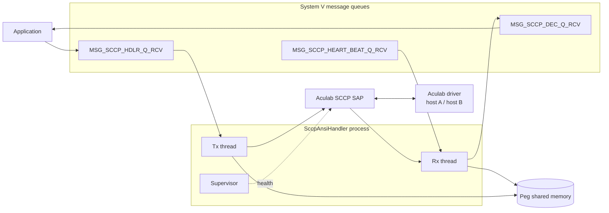

| Interface | Peer | Reference |
|---|---|---|
| `IF-N1` | Application | `[SYS-HLD §12.2]` |
| `IF-S1` | Aculab SCCP API | `[SYS-HLD §12.4]` |
| `IF-C1` | `SccpAnsiHandler.cfg`, `Sccp_<ssn>.cfg` | `[SYS-HLD §17]` |
| `IF-P1` | Signals | `[SYS-HLD §13.3]` |
| `IF-O1`, `IF-O2` | Pegs, logs, trace | §14 |

**This component does not communicate with `TcapAnsiHandler`.** They are alternative
northbound services `[SYS-HLD §5.4]`.

---

# 3. Internal Structure

**Diagram S-02 — Class structure.**

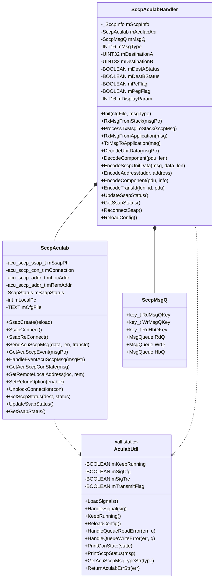

## 3.1 Responsibility Split

| Class | Library | Responsibility | May call Aculab |
|---|---|---|---|
| `SccpAculabHandler` | Built into the binary | Protocol engine, IPC, codec, routing | **No** — except through `SccpAculab` |
| `SccpAculab` | `libSccpAculabApi.a` | Every Aculab SCCP call | **Yes — exclusively** |
| `AculabUtil` | `libSccpAculabUtil.a` | Process-wide flags, signals, queue recovery, diagnostics | Only diagnostic converters |
| `SccpMsgQ` | Struct in the handler header | The three queue keys and objects | No |

The confinement of Aculab calls to `SccpAculab` is architecture principle P-01
`[SYS-HLD §4.2]` and is what makes the API register in `[SYS-HLD §12.4]` provably
complete.

## 3.2 Global Singletons

Defined in `src/SccpAculabHandlerMain.cc` and declared `extern` elsewhere:

| Symbol | Type | Purpose |
|---|---|---|
| `gLog` | `Log` | Structured logging |
| `gPeg` | `PegApi` | Peg counters in shared memory |
| `gTrace` | `CTrace` | Developer trace, keyed on `TRACE_ACULAB_SCCP_HDLR` |
| `gProcessName` | `TEXT[]` | `ACUSCCP_<ssn>` |
| `gCfgFile` | `TEXT[]` | `Sccp_<ssn>.cfg` — the tier 2 Aculab configuration filename |
| `gRxThreadId`, `gTxThreadId` | `pthread_t[]` | Thread identifiers, sized `MAX_ACU_SCCP_INSTANCES + 1` |

## 3.3 Declared but Undefined

The handler header declares members and methods that have **no definition anywhere** in
the module. They compile because nothing calls them:

| Symbol | Nature |
|---|---|
| `mNoOfInstance`, `mTransValidationKey`, `mMsgLimitCount`, `mLicPassAscii`, `mLicKey[]`, `mNumofOPCs` | Members, never used |
| `DecryptLicKey()`, `GetTransValidationKey()`, `ReadSccpConfig(TEXT*)` | Methods, declared only |
| `SccpAculab::ReadIpcConfig()` | Declared only |

**There is no licence enforcement in this component.** The licence-related declarations
are residue from a shared header lineage. `ACU_SCCP_PASS`, `SCCP_ACU_MAX_LIC_LEN`,
`MAX_INSTANCE_PER_PC` and the semaphore and shared-memory range constants in
`include/SccpAculabConstDef.h` are likewise unused. All are collected under
`[SYS-HLD §21.3]` R-12.

---

# 4. SAP Management

## 4.1 Cardinality

**Exactly one SAP per process.** `MAX_ACU_SCCP_INSTANCES` is 1
(`include/SccpAculabConstDef.h`). There is no multi-instance or multi-OPC capability on
this path — the counterpart to `[TCAP-HLD §4]`, which supports up to 50.

This is the component's fundamental scaling constraint `[SYS-HLD §18.1]`: SCCP throughput
scales only by adding SSNs, and therefore processes.

## 4.2 SAP Lifecycle

**Diagram S-03 — SAP lifecycle.**

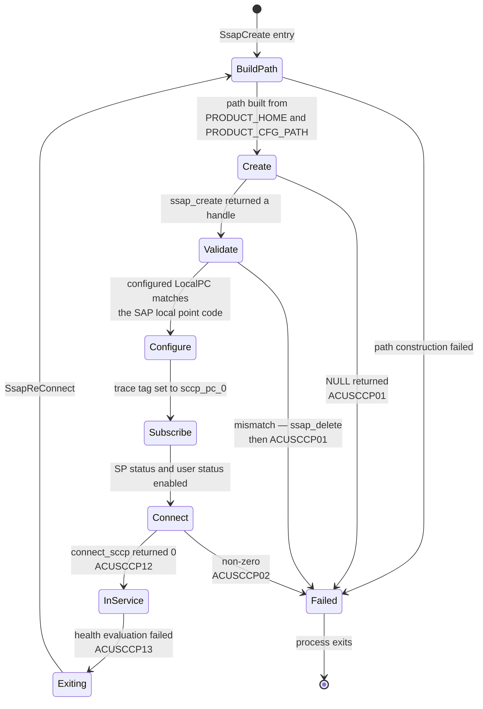

### Creation sequence

Traced from `src/SccpAculabApi.cc:176-241`:

| # | Action | Line | Failure |
|---|---|---|---|
| 1 | `SetSccpConfigFilePath(gCfgFile)` — build the absolute tier 2 path | `:181` | Return false. **Crashes if the environment is unset** — see §16, R-07 |
| 2 | `acu_sccp_ssap_create(path, ACU_SCCP_LOG_STDERR)` | `:185` | `NULL` → `ACUSCCP01`, fatal |
| 3 | `acu_sccp_ssap_get_locaddr` | `:195` | Dereferenced without a null check |
| 4 | Build the trace tag `sccp_<pc>_0` | `:196` | — |
| 5 | **Compare `mLocalPc` against `mLocAddr->sa_pc`** | `:197` | Mismatch → `acu_sccp_ssap_delete`, `ACUSCCP01`, fatal |
| 6 | `acu_sccp_ssap_set_cfg_str(TRACE_TAG, tag)` | `:207` | Not checked |
| 7 | `acu_sccp_ssap_get_remaddr` | `:210` | Dereferenced |
| 8 | `acu_sccp_enable_sp_status(remote pc)` if non-zero | `:214` | If zero, SP status is **not subscribed**; a trace line notes it |
| 9 | `acu_sccp_enable_user_status(pc, ssn)`, wildcarding zero values with `~0u` | `:227` | — |
| 10 | Record the last activity time | `:233` | — |
| 11 | `SsapConnect()` → `acu_sccp_ssap_connect_sccp` | `:235`, `:265` | Non-zero → `ACUSCCP02`, fatal |

### The point-code cross-check

Step 5 is the component's most valuable configuration safeguard. `mLocalPc` is read by
**this component** from the tier 2 file; `mLocAddr->sa_pc` is what the **Aculab library**
derived from the same file. A mismatch means the two readers disagree, which almost
always indicates a partially edited configuration. The component refuses to start.

> If the remote point code in the tier 2 configuration is zero, **signalling point status
> is not subscribed at all** (step 8). Combined with the uninitialised destination flags
> (§11), this produces a handler that never transmits. The condition is visible only in
> trace, not in a log record.
> `[NEEDS INPUT: should a zero remote point code be a startup error rather than a trace line?]`

## 4.3 Reconnect

`SsapReConnect` (`src/SccpAculabApi.cc:288`) performs:

| # | Action | Line |
|---|---|---|
| 1 | Read the local address before destroying the SAP | `:295` |
| 2 | `acu_sccp_ssap_delete` | `:297` |
| 3 | Clear the transmit flag | `:299` |
| 4 | `acu_sccp_ssap_create` | `:306` |
| 5 | Set the trace tag | `:318` |
| 6 | Read the remote address | `:320` |
| 7 | Re-subscribe to SP status and user status | `:324`, `:339` |
| 8 | Connect |

**There is no dialogue restoration on this path** because the component holds no dialogue
state (§9). Reconnect is therefore simpler and faster than its TCAP counterpart
`[TCAP-HLD §4]`, but every message in flight at the moment of failure is lost with no
record.

## 4.4 SAP State Record

```c
typedef enum _SsapState { CONNECTING, IN_SERVICE, EXITING } SsapState;

typedef struct _SsapStatus {
   SsapState            state;
   UINT16               transIdRange;      // unused on this path
   time_t               lastActTime;
   acu_sccp_cs_state_t  host_a_con_state;
   acu_sccp_cs_state_t  host_b_con_state;
} SsapStatus;
```

`include/SccpAculabApi.h:30-44`. `transIdRange` is a TCAP concept and is unused here.

---

# 5. Concurrency and Threading

## 5.1 Thread Model

**Diagram S-04 — Thread model.**

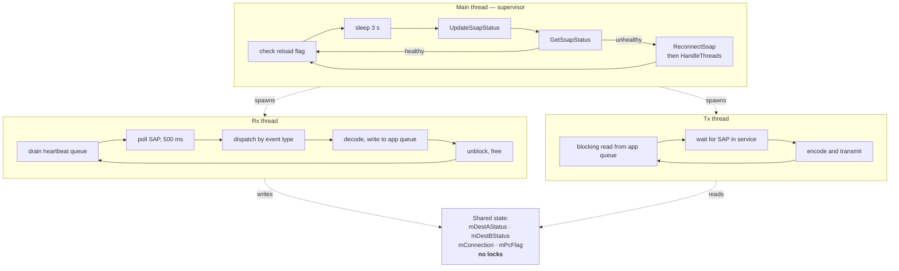

| Thread | Entry | Loop condition | Blocking call | Timeout |
|---|---|---|---|---|
| Main | `main` (`src/SccpAculabHandlerMain.cc:141`) | `AculabUtil::KeepRunning()` | `sleep(3)` (`:292`) | — |
| Rx | `RxThread` | `KeepRunning()` | `acu_sccp_ssap_msg_get` | 500 ms |
| Tx | `TxThread` | `KeepRunning()` | `msgrcv`, blocking | **None** |

Total: **3 threads**, fixed. Both workers are detached; neither is ever joined.

## 5.2 Synchronisation

**There are no mutexes in this component.** Not one.

| Shared item | Written by | Read by | Protected by |
|---|---|---|---|
| `mDestAStatus` | Rx thread (`src/SccpAculabHandler.cc:721`) | Tx thread (`:487`, `:505`) | **Nothing** |
| `mDestBStatus` | Rx thread (`:727`) | Tx thread (`:512`, `:530`) | **Nothing** |
| `mConnection` | Rx thread, lazily on first connection-state event | Tx thread | **Nothing** |
| `mPcFlag` | Tx thread only | Tx thread only | Single thread |
| `mSccpInfo` | Rx thread only | Rx thread only | Single thread |
| `AculabUtil` static flags | Signal handler | All threads | **Nothing** |

The design is single-writer/single-reader over machine-word booleans and a pointer, so
the practical exposure is a briefly stale routing decision rather than corruption.

**It is recorded because it is an unstated assumption**, not because faults have been
observed. Any future change that introduces a second writer, or a non-atomic shared
field, must add synchronisation. This is `[SYS-HLD §21.3]` R-15.

## 5.3 Thread Accumulation on Reconnect

The supervisor calls `HandleThreads()` again after every successful reconnect
(`src/SccpAculabHandlerMain.cc:315`) **without terminating the previous pair**. The
`pthread_kill(..., 30)` calls that would have done so are present but commented out at
`:301-302`, and the signal-30 handler that calls `pthread_exit` is registered and working
(`src/SccpAculabUtil.cc:447`).

The mechanism exists and is disabled. Each reconnect therefore adds two threads that
continue to run against a deleted SAP.

This is `[SYS-HLD §21.3]` R-03.

---

# 6. Buffering and Flow Control

The four-stage chain and the credit model are described in `[SYS-HLD §9]`. This section
documents the component's specific obligations.

## 6.1 Credit Release — Complete Exit Path Enumeration

**Diagram S-05 — Receive dispatch and credit release.**

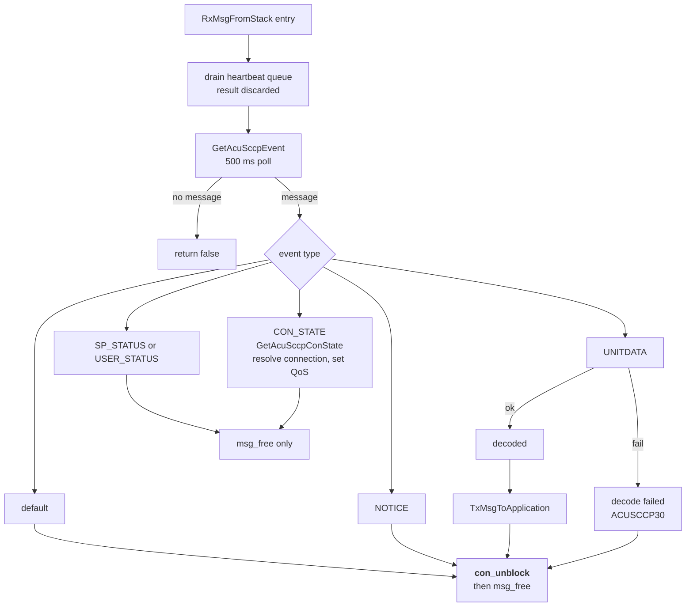

Source: `src/SccpAculabHandler.cc:608-754`.

| # | Path | Line | Unblocks | Frees | Correct | Why |
|---|---|---|---|---|---|---|
| 1 | Poll returned no message | `:615` | n/a | n/a | Yes | No message was delivered |
| 2 | Connection state event | `:625-630` | **No** | Yes `:628` | Yes | Connection-state events carry no connection credit |
| 3 | Unitdata, decode failed | `:646-654` | Yes `:651` | Yes `:652` | Yes | |
| 4 | Unitdata, forwarded | `:656-660` | Yes `:658` | Yes `:659` | Yes | |
| 5 | Notice (returned message) | `:662-703` | Yes `:700` | Yes `:701` | Yes | **See below** |
| 6 | Signalling point status | `:704-733` | **No** | Yes `:732` | Yes | Status events carry no connection credit |
| 7 | User status | `:704-733` | **No** | Yes `:732` | Yes | |
| 8 | Default, connection present | `:735-748` | Yes `:742` | Yes `:744` | Yes | |
| 9 | Default, no connection | `:735-748` | n/a | Yes `:744` | Yes | |

**Every path that holds a connection credit releases it.** The switch has no
fall-through; every case ends in `break` or `return`. The enumeration is complete.

### The notice path is the one with history

A source comment at `:696-699` records the observed failure: omitting the unblock on the
notice path caused the Aculab driver's flow control to **permanently suspend delivery of
further notices on that context**, to protect its ring buffer. The symptom was that
network rejections became invisible after the first one.

> **Review rule.** Any new return path added to `RxMsgFromStack` must answer: did this
> path receive a message from the stack, and if so does it call `UnblockConnection` before
> returning? Omission produces no error, no log and no counter.

### Ordering note

Path 4 calls `TxMsgToApplication` **before** unblocking (`:656` then `:658`), so the
credit is held for the duration of the northbound write. Because that write is
non-blocking `[SYS-HLD §9.8]` the exposure is bounded, but **no blocking operation may be
introduced between decode and unblock**.

## 6.2 Transmit-Side Gating

The transmit thread does not send until the SAP reports in service. It sleeps one second
and re-checks, holding the message it has already dequeued in its own frame. Further
messages remain in the kernel queue.

The transmit flag itself is set from the connection-state printer
(`src/SccpAculabUtil.cc:91`, `:98`, `:104`):

| Connection state | Transmit flag | Log |
|---|---|---|
| `IN_SERVICE` with `RX_BLOCKED` | Unchanged | `ACUSCCP05` |
| `IN_SERVICE` with `RX_FLOW` | Unchanged | `ACUSCCP06` |
| `IN_SERVICE` with `TX_BLOCKED` | **false** | `ACUSCCP07` |
| `IN_SERVICE` with `TX_FLOW` | **false** | `ACUSCCP08` |
| `IN_SERVICE`, clear | **true** | `ACUSCCP04` |
| `IDLE` | Unchanged | `ACUSCCP03` |
| `CONNECTED` | Unchanged | `ACUSCCP02` |

Note the ordering in the printer: the blocked and flow tests `return true` early, so a
connection that is blocked never reaches the line that sets the flag true. Recovery
depends on a subsequent clean `IN_SERVICE` report.

## 6.3 Heartbeat Queue

Drained non-blocking at the top of every receive iteration
(`src/SccpAculabHandler.cc:614`), into a scratch text buffer, with the return value
explicitly cast away. **The content is never interpreted.** The queue exists so an
external monitor can write to it without filling it.

## 6.4 What This Component Does Not Have

| Absent | Present in TCAP path |
|---|---|
| Per-instance transmit gating | Yes — instances removed from round-robin |
| Deferred processing write-back | Yes |
| Transmit rate limiting | Yes — licence-enforced |
| Receive window configuration beyond the TCP buffer | Yes — message and byte windows |

The SCCP path's only inbound flow-control protection is **prompt credit release**
(§6.1). That is why the enumeration above matters more here than on the TCAP path.

---

# 7. Lifecycle and Control

## 7.1 Startup

Detailed step table with failure behaviour in `[SYS-HLD §13.1]`. Component-specific
points:

| Step | Detail |
|---|---|
| Argument | `SccpAnsiHandler <ssn>`, validated `0 < ssn < 255` (`src/SccpAculabHandlerMain.cc:198`) |
| Wrong argument count | Prints an ASCII-art product banner with version and compliance text, then exits 1 (`:157-194`) |
| Process name | `ACUSCCP_<ssn>` (`:208`) |
| Tier 2 config filename | `Sccp_<ssn>.cfg`, stored in `gCfgFile` (`:215`) |
| Process lock | Product `"SCCP"`, process name (`:233`) |
| Peg init | Key name `"SHM_SCCP_PEG_KEY"` (`:246`) |
| Handler init | Configuration, queue creation, SAP creation and connection (`:255`) |
| Threads | Tx created, one-second sleep, then Rx (`:266`) |

**Every failure is fatal.** There is no degraded start.

> The banner text at `:180-183` claims the component provides "connectionless **and
> connection-oriented** network services" and "Global Title Translation (GTT)
> capabilities". **Both claims are incorrect.** The component is connectionless-only and
> performs no translation. The banner should be corrected — it is the first thing an
> operator sees.

## 7.2 Configuration Read Order

| # | Function | File | Reads |
|---|---|---|---|
| 1 | `ReadIpcConfig` (`src/SccpAculabHandler.cc:129`) | `SccpAnsiHandler.cfg` | The three queue keys |
| 2 | `ReadKernelConfig` (`:194`) | `SccpAnsiHandler.cfg` | Peg flag, display parameter, both destinations |
| 3 | `CreateMsgQ` (`:332`) | — | Creates or attaches the three queues |
| 4 | `SccpAculab::ReadSccpConfig` | `Sccp_<ssn>.cfg` | `LocalPC`, range 1 … 35000 |
| 5 | Aculab library | `Sccp_<ssn>.cfg` | Everything else, at SAP creation |

> **Note the `LocalPC` range.** This component validates `LocalPC` against 1 … 35000,
> which is narrower than the 24-bit ANSI point-code space of 1 … 16,777,215 used for the
> destination parameters. A legitimate ANSI point code above 35000 will be rejected at
> startup. `[NEEDS INPUT: is the LocalPC upper bound of 35000 intentional? It appears to be an ITU-era 14-bit-derived limit.]`

## 7.3 Supervisor Loop

`src/SccpAculabHandlerMain.cc:280-319`:

| Action | Line |
|---|---|
| Check the reload flag; if set, apply signal handling, call `ReloadConfig`, reset the flag | `:282-290` |
| `sleep(3)` | `:292` |
| `UpdateSsapStatus()` | `:294` |
| `GetSsapStatus()`; if false, log `ACUSCCP13`, `ReconnectSsap()`, `HandleThreads()` | `:295-318` |

## 7.4 Configuration Reload

`ReloadConfig` (`src/SccpAculabHandler.cc:279`) re-reads **two parameters only**:

| Parameter | Reloadable |
|---|---|
| `SCCP_PEG_REQUIRED` | **Yes** |
| `SCCP_MSG_DIPLAY_PARAM` | **Yes** |
| `SCCP_DESTINATION_1` | No |
| `SCCP_DESTINATION_2` | No |
| The three queue keys | No |
| `LocalPC` | No |

Changing a destination point code requires a restart. `[SYS-HLD §13.4]`

## 7.5 Signals

Registration and handler behaviour are in `src/SccpAculabUtil.cc:313-465` and are
documented in `[SYS-HLD §13.3]`. Component-specific notes:

- The trace flag is applied **lazily inside `KeepRunning()`**, so a trace toggle takes
  effect at the next loop iteration.
- Signal 30 calls `pthread_exit` (`:447`) and is the intended thread-termination
  mechanism for reconnect. It is registered but never sent (§5.3).
- `SIGSEGV` has a handler case (`:372`) but **its registration is commented out**
  (`:321`, `:330`). Segmentation faults take the default disposition.

## 7.6 Shutdown

| Cleaned up | Not cleaned up |
|---|---|
| Process lock | Threads — never joined or signalled |
| — | The SAP — no explicit delete on this path |
| — | Message queues — deliberate, so messages survive a restart |

The transmit thread blocks indefinitely on `msgrcv` and does not observe the run flag, so
shutdown depends on process termination `[SYS-HLD §13.6]`.

---

# 8. Protocol Processing

This is the component's defining function: **ANSI T1.114 encoding and decoding performed
in this process**.

## 8.1 Encode Pipeline

**Diagram S-06 — Outbound encode pipeline.**

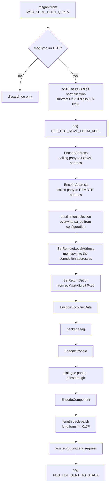

### Package tag mapping — and its loss of information

`EncodeSccpUnitData` (`src/SccpAculabHandler.cc:1450-1470`):

| Internal enum | Emitted tag | ANSI package |
|---|---|---|
| `TCAP_TRANS_BEGIN` | `0xE2` | Query **With** Permission |
| `TCAP_TRANS_END` | `0xE4` | Response |
| `TCAP_TRANS_CONTINUE` | `0xE5` | Conversation **With** Permission |
| `TCAP_TRANS_ABORT` | `0xF6` | Abort |
| `TCAP_TRANS_UNIDIRECTIONAL` | `0xE8` | Unidirectional |
| anything else | `0xE2` | Query With Permission |

> **The SCCP path cannot emit Query Without Permission or Conversation Without
> Permission.** The internal enumeration has only five package values, so the
> with-permission / without-permission distinction has no representation on transmit and
> the encoder always selects the with-permission form.
>
> The decoder has the mirror problem: `0xE1` and `0xE2` both map to `TCAP_TRANS_BEGIN`,
> and `0xE5` and `0xE6` both map to `TCAP_TRANS_CONTINUE`
> (`src/SccpAculabHandler.cc:1268-1277`). **A received package's permission bit is
> discarded and not visible to the application.**
>
> This is a genuine ANSI conformance limitation of this path, recorded as **R-19** in §16
> and reflected in `[SYS-HLD §20.2]`. The TCAP path does not have this limitation — it
> carries all seven package types distinctly `[TCAP-HLD §8.3]`.

### Transaction identifier encoding

`src/SccpAculabHandler.cc:1474-1493`:

| Package | Length byte | Content |
|---|---|---|
| Conversation | 8 | Originating identifier, then destination identifier |
| Response, Abort | 4 | Destination identifier if non-zero, otherwise originating |
| Query, Unidirectional | 4 | Originating identifier |

`EncodeTransId` (`:1524-1536`) writes big-endian bytes, emitting 4 bytes when the length
argument is 4 or 0. A source comment records that a redundant length byte was previously
written inside this function, which shifted the entire structure — the defect was
corrected.

### Dialogue portion passthrough

If the application supplied a non-zero dialogue-portion byte count, the tag and the bytes
are copied verbatim (`:1494-1500`). This is **transparency, not ANSI dialogue support** —
ANSI TCAP has no dialogue portion `[SYS-HLD §6.4]`. The mechanism exists so an
application that receives one can echo it.

### Length back-patching

`src/SccpAculabHandler.cc:1506-1514`:

```c
UINT8 lLength = lOffset - 2;
if (lLength > 0x7F) {
   lData[lPkgLenIdx++] = 0x81;              // long form, one length byte
   memmove(&lData[lPkgLenIdx + 1], &lData[lPkgLenIdx], lOffset);
   lOffset++;
}
lData[lPkgLenIdx] = lLength;
```

> **`lLength` is a `UINT8`.** A package longer than 257 bytes produces a wrapped length
> value, and the buffer is 300 bytes so such packages are reachable. This is the same
> class of defect as the receive-side truncation and is recorded as **R-20** in §16.

## 8.2 Decode Pipeline

**Diagram S-07 — Inbound decode pipeline.**

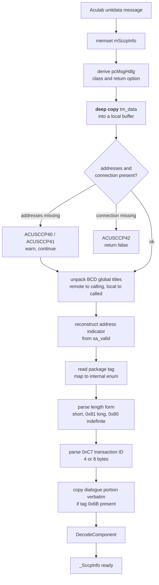

### Steps in order

`DecodeUnitData` (`src/SccpAculabHandler.cc:1068` onward):

| # | Action | Note |
|---|---|---|
| 1 | Zero the decode buffer | Single shared buffer, Rx-thread-only (§9) |
| 2 | Derive `pcMsgHdlg` from the Aculab class and return-option fields | |
| 3 | **Deep-copy** the payload into a local buffer | This is why the Aculab receive-buffer copy call is unnecessary `[SYS-HLD §8.6]` |
| 4 | Null-check local and remote addresses | Warn `ACUSCCP40` / `ACUSCCP41` and continue (`:1105-1116`) |
| 5 | Null-check the connection | **Fatal** for this message: `ACUSCCP42`, return false (`:1117-1123`) |
| 6 | Unpack BCD digits, low nibble first | Remote to calling, local to called (`:1142-1153`) |
| 7 | Reconstruct the address indicator from the Aculab presence mask | (`:1165` onward) |
| 8 | Read the package tag and map it to the internal enum | (`:1268-1284`) |
| 9 | Parse the length form | Short, `0x81` long, `0x80` indefinite |
| 10 | Parse the transaction identifier | Tag `0xC7`, 4 or 8 bytes (`:1301-1310`) |
| 11 | Copy the dialogue portion verbatim if present | Tag `0x6B` |
| 12 | `DecodeComponent` | (`:865`) |

### Address indicator reconstruction

Decode sets the indicator bits from the Aculab presence mask
(`src/SccpAculabHandler.cc:1165` onward):

| Aculab presence bits | Indicator bit set | Fields copied |
|---|---|---|
| Point code valid | `0x01` | `pointCode` |
| Subsystem valid | `0x02` | `subsystemNumber` |
| Translation type, numbering plan, encoding scheme **and** nature of address | `0x10` | All four, **including nature of address** |
| Translation type, numbering plan, encoding scheme | `0x0C` | Three |

> **Asymmetry with encode.** Decode *does* populate `natureOfAddress` when the Aculab
> mask carries it, but encode *never* emits it (`[SYS-HLD §6.2]`). A message decoded and
> re-encoded by the application therefore loses the field. For ANSI this is correct — the
> field should not be on the wire — but the asymmetry is worth knowing when comparing a
> received structure against a transmitted one.

### Component decoding

`DecodeComponent` (`src/SccpAculabHandler.cc:865`) maps ANSI component tags to the
internal component enumeration and extracts:

| Element | Tag | Notes |
|---|---|---|
| Invoke identifier | `0xCF` | |
| Correlation identifier | `0xDA` | |
| Operation code, National | `0xD0` | **Variable length, 1 to 4 bytes**; `isPrivate` set false |
| Operation code, Private | `0xD1` | `isPrivate` set true |
| Error code | `0xD3` / `0xD4` | National and Private |
| Reject problem type and code | `0xD5`–`0xD9` | |
| Parameter payload | `0xF2` / `0xF3` | |

## 8.3 ANSI Tag Table

The authoritative table is `include/MsuAnsiStructs.h`, reproduced with clause citations in
`[SYS-HLD Appendix C]`. Two properties matter for any codec change:

| Property | Consequence |
|---|---|
| Tag `0xE8` is both the Unidirectional package tag and the component portion tag | Parsing must be position-sensitive |
| Tags `0xE1` and `0xE2` are both package tags and Not-Last component tags | Same |

The header carries a source comment recording that its tags were **previously incorrect**
and were corrected against the ANSI specification. That history is why this component's
codec is the product's highest-value review surface `[SYS-HLD §21.3]` R-10.

## 8.4 Encoding Asymmetries Summary

| Element | Encoded | Decoded | Symmetric |
|---|---|---|---|
| Point code | Yes | Yes | Yes |
| Subsystem number | Yes | Yes | Yes |
| Global title digits | Yes | Yes | Yes |
| Translation type, numbering plan, encoding scheme | Yes | Yes | Yes |
| Nature of address | **No** | Yes | **No** — correct for ANSI |
| Global title indicator | **Never set** — auto-derived | n/a | n/a |
| Package permission bit | **Not representable** | **Discarded** | **No** — R-19 |
| Dialogue portion | Verbatim | Verbatim | Yes |
| Operation code, National or Private | Yes | Yes | Yes |

---

# 9. State and Data

## 9.1 Component State

This component holds **no dialogue state and no per-message persistent state**. That is
the sharpest architectural difference from `[TCAP-HLD §9]`, which owns a 500,000-record
shared-memory pool.

| State | Location | Lifetime |
|---|---|---|
| `mSccpInfo` | Handler member | One inbound message; overwritten each iteration |
| `mDestAStatus`, `mDestBStatus` | Handler members | Until the next status event |
| `mPcFlag` | Handler member | Round-robin toggle, flipped per transmitted message |
| `mDestinationA`, `mDestinationB` | Handler members | Read once at startup |
| `mMsgType` | Handler member | The SSN; used as the outbound queue message type |
| `mPegFlag`, `mDisplayParam` | Handler members | Reloadable |
| `mSaapStatus` | SAP class member | Updated every supervisor iteration |
| `mConnection` | SAP class member | Resolved lazily; valid for the SAP's lifetime |

Consequences:

| Property | Consequence |
|---|---|
| Nothing to restore after a reconnect | Reconnect is fast and simple (§4.3) |
| Nothing survives a restart | Messages in flight are lost silently |
| No shared memory except pegs | No cross-process locking |
| Transactions are the application's responsibility | The application must implement its own response timers |

## 9.2 The Single Decode Buffer

`mSccpInfo` is a single member reused for every inbound message. It is written and read
only by the Rx thread and is zeroed at the start of each decode, so reuse is safe under
the current single-Rx-thread design.

**It would not be safe with more than one receive thread.** Since this component is fixed
at one (§4.1), the constraint is currently satisfied by construction — but it is an
unstated dependency of the threading model on the data model.

## 9.3 Northbound Structure

`_SccpInfo`, defined in `include/MsuStructs.h`, is specified field by field in
`[SYS-HLD §11.2]`. Component-specific handling:

| Field | On transmit | On receive |
|---|---|---|
| `msgType` | Must be UDT; anything else is discarded | Set from the event type |
| `pcMsgHdlg` | Bit `0x80` maps to the return-option QoS | Reconstructed from class and return option |
| `clgPartyAddress` | Encoded to the **local** Aculab address | Populated from the **remote** Aculab address |
| `cldPartyAddress` | Encoded to the **remote** address, then **its point code is overwritten** (§11) | Populated from the **local** address |
| `transInfo` | Drives the package tag and identifier encoding | Populated from the decoded transaction portion |
| `dlgInfo.dlgPdu` | Copied verbatim if non-empty | Copied verbatim if present |
| `compInfo` | Encoded per component type | Populated per decoded component type |

## 9.4 Component Union Discrimination

The component field is a union. **It must be read according to the component type.** The
component's own diagnostic printer previously read it unconditionally and crashed; it now
discriminates on type before dereferencing. The same obligation applies to the
application.

---

# 10. Message Flows

## 10.1 Inbound Unitdata

**Diagram S-08 — Inbound unitdata.**

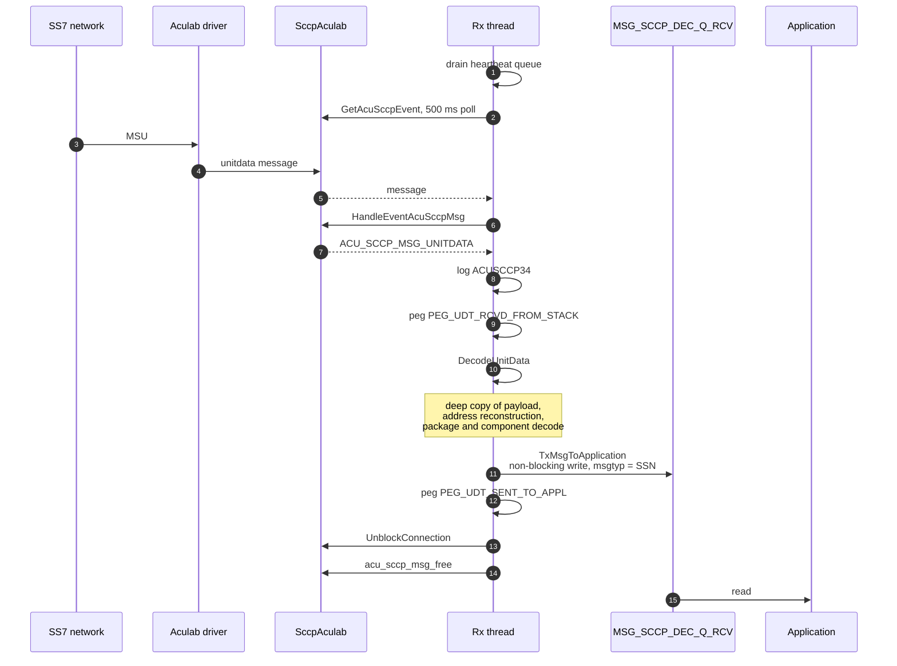

## 10.2 Outbound Unitdata

**Diagram S-09 — Outbound unitdata with destination selection.**

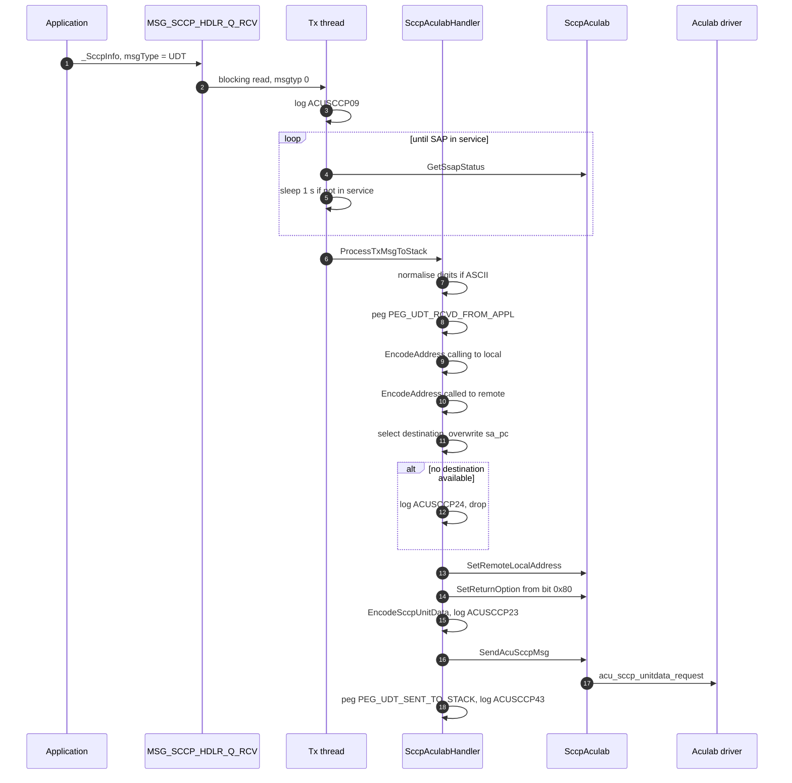

## 10.3 Network Rejection — Notice

**Diagram S-10 — Notice handling.**

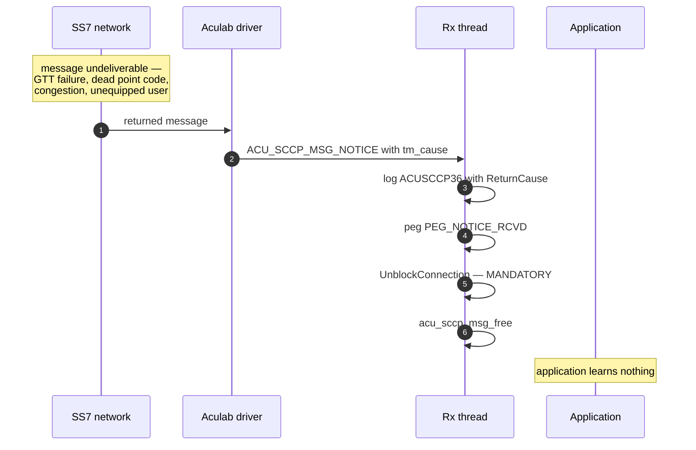

Return causes documented in the source at `src/SccpAculabHandler.cc:673-684`:

| Cause | Meaning |
|---|---|
| `0x00` | No translation for an address of such nature |
| `0x01` | No translation for this specific address |
| `0x02` | Subsystem congestion |
| `0x03` | Subsystem failure |
| `0x04` | Unequipped user |
| `0x05` | Network failure |
| `0x0D` | Transport unavailable |
| `0x0F` | Unqualified |

> **The notice is not forwarded to the application.** This is a design gap
> `[SYS-HLD §12.2]`: the application cannot distinguish a message that was delivered from
> one the network returned. `[NEEDS INPUT: should notices be surfaced on IF-N1?]`

## 10.4 Status Event

**Diagram S-12 — Status event handling.**

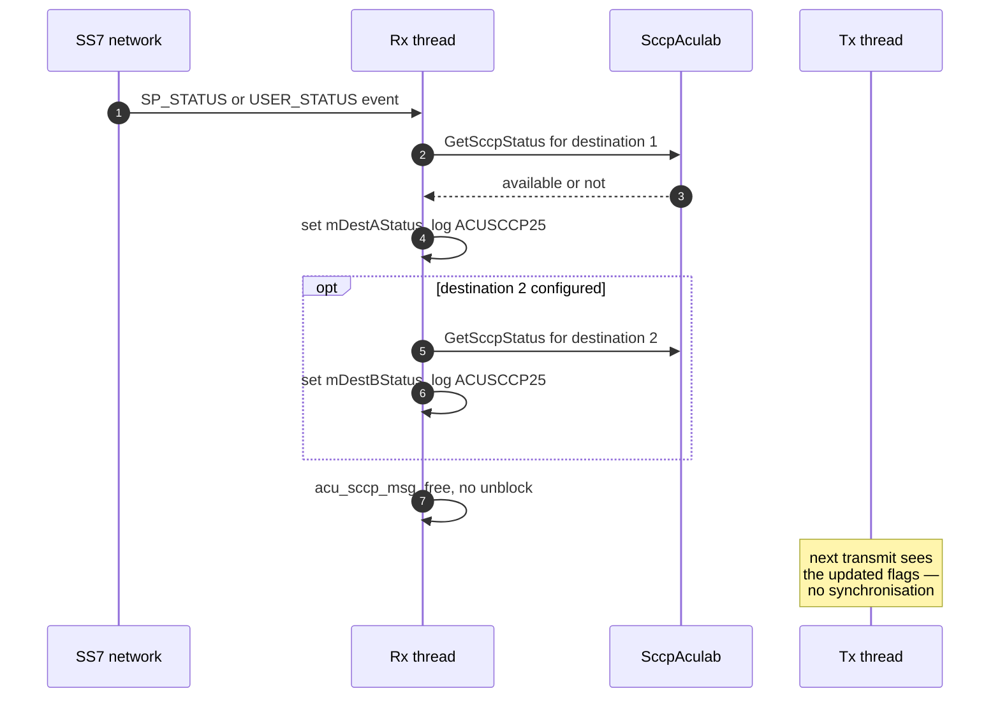

Both event types share one handler branch (`src/SccpAculabHandler.cc:704-733`). The
reason is recorded in the source: signalling point status covers a whole node while user
status covers one subsystem, and both must refresh the same availability flags. Handling
only one leaves a window in which traffic is either wrongly blocked or wrongly permitted.

## 10.5 SAP Reconnect

**Diagram S-13 — SAP health evaluation and reconnect.**

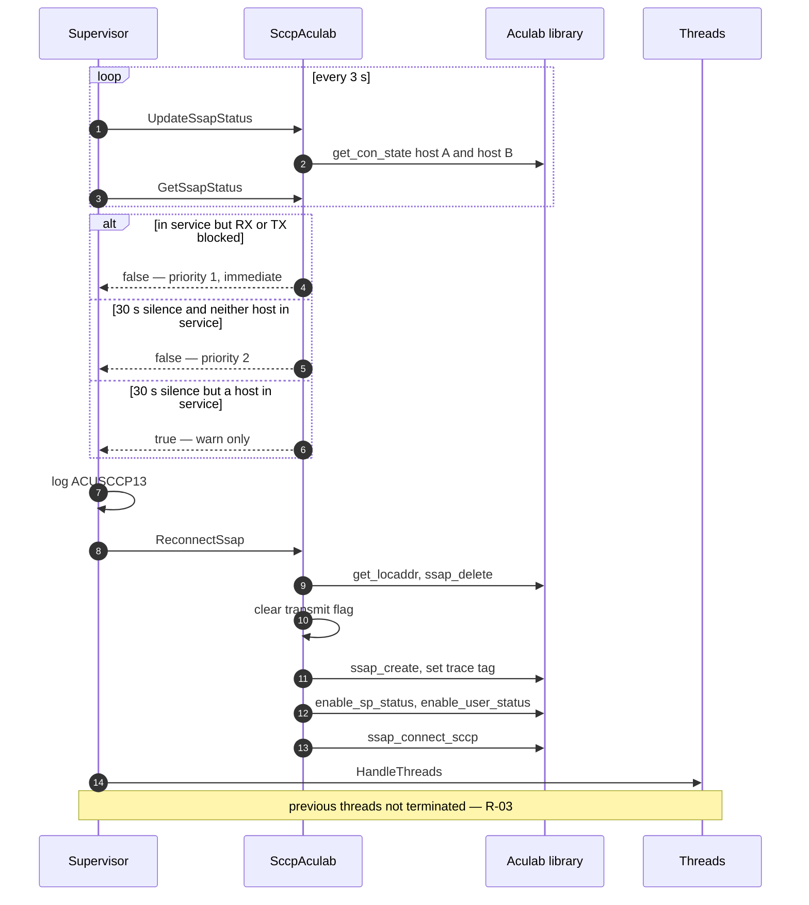

---

# 11. Routing and Destination Selection

## 11.1 The Model

`[SYS-HLD §6.3]` states the architecture. The component-level behaviour is:

**Diagram S-11 — Destination selection.**

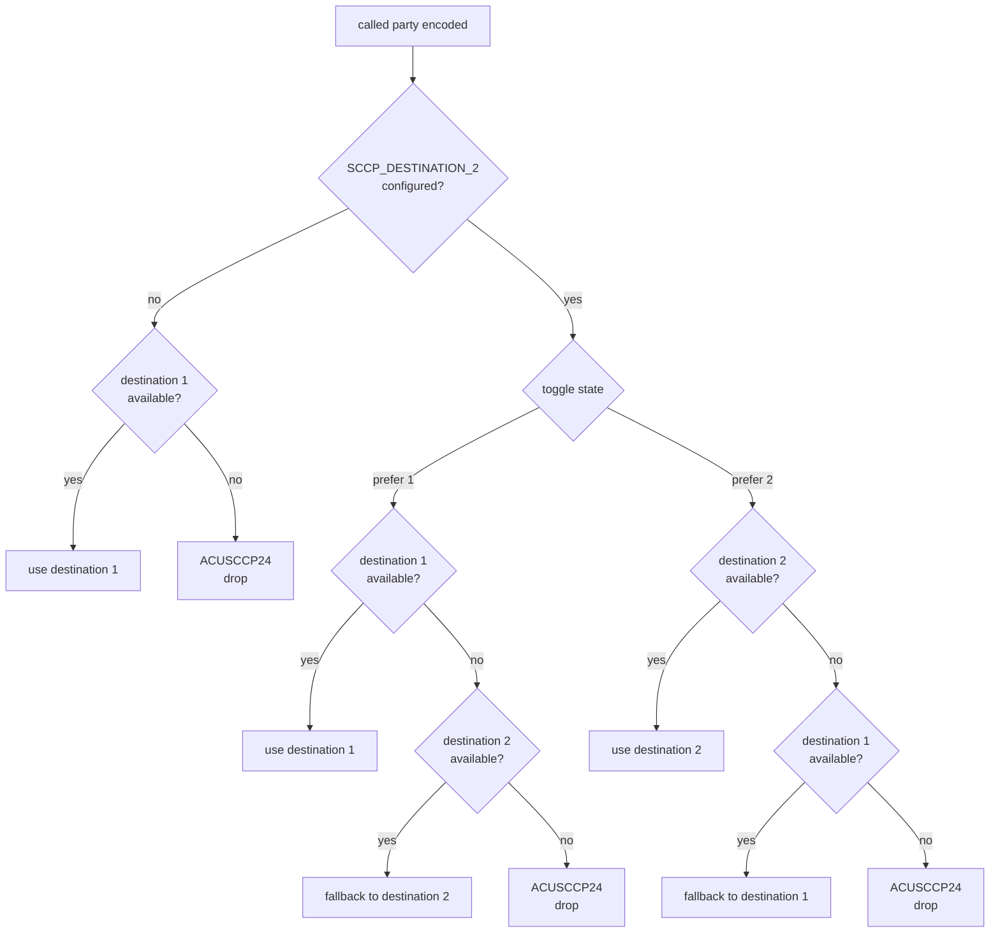

Source: `src/SccpAculabHandler.cc:483-553`.

## 11.2 Properties and Consequences

| Property | Consequence |
|---|---|
| The point code the application supplies is **overwritten** | An application cannot direct a message to a specific point code |
| Availability is refreshed **only** on status events | No periodic probe; a silent destination failure is invisible until the network reports it |
| The toggle flips on every call, including on fallback | Distribution is strict alternation, not load-proportional |
| Both unavailable means drop | No queueing, no retry, no notification to the application |
| Flags are **uninitialised until the first status event** | **All outbound traffic is dropped from startup until then** — R-11 |

## 11.3 The Startup Blackout

`mDestAStatus` and `mDestBStatus` are not initialised in the constructor. Between process
start and the first signalling-point or user status event, both read as unavailable and
every outbound message is dropped with `ACUSCCP24`.

The duration of the blackout is entirely determined by when the network next sends a
status event, which may be immediately after subscription or may be a long time. Combined
with §4.2's note that a zero remote point code suppresses SP status subscription
altogether, a misconfigured deployment can be in permanent blackout.

**Diagnosis:** repeated `ACUSCCP24` from startup with a flat transmit peg, and no
`ACUSCCP25` lines at all.

`[NEEDS INPUT: should the handler query destination status at startup rather than waiting for an event?]`

## 11.4 Global Title Translation

**Not performed** (`[SYS-HLD §6.3]`, AD-06). The component encodes the global title into
the Aculab address and relies on the stack and the network's Signal Transfer Points to
resolve it. A translation failure returns as a notice (§10.3) with cause `0x00` or `0x01`.

---

# 12. Timers and Rate Control

| Timer | Value | Location | Effect |
|---|---|---|---|
| SAP receive poll | 500 ms | `src/SccpAculabApi.cc:426` | Bounds idle wait; refreshes the last-activity time |
| Supervisor cadence | 3 s | `src/SccpAculabHandlerMain.cc:292` | Fault detection latency |
| Transmit retry sleep | 1 s | Transmit thread | Delay before re-checking SAP availability |
| Thread creation stagger | 1 s | `HandleThreads` | Between transmit and receive thread creation |
| **Silence watchdog** | **30 s** | `src/SccpAculabApi.cc:523` | Warn always; reconnect only if neither host is in service |
| Post-reconnect settle | 1 ms | `src/SccpAculabHandlerMain.cc:317` | Before resuming the supervisor loop |

**None of these are configurable.** They are compile-time constants.

## 12.1 The Silence Watchdog Threshold

The 30-second value replaced an earlier 10-second one. The source records the reason
(`src/SccpAculabApi.cc:514-522`): the shorter threshold caused reconnect storms during
off-peak periods, because low traffic was indistinguishable from a dead link.

The current logic separates the two concerns:

| Condition | Action |
|---|---|
| In service but blocked | **Reconnect immediately** — a genuine fault |
| 30 s silence, at least one host in service | **Warn only** — the link is alive, just quiet |
| 30 s silence, neither host in service | **Reconnect** — the driver has gone away |

`[NEEDS INPUT: should the poll interval, supervisor cadence and silence threshold be configurable?]`

## 12.2 Rate Control

**There is none in this component.** The licence-enforced transmit cap exists only on the
TCAP path `[TCAP-HLD §12]`. The licence-key members declared in this component's header
are undefined and unused (§3.3).

---

# 13. Error Handling and Recovery

## 13.1 Classification

| Class | Examples | Behaviour |
|---|---|---|
| **Fatal at startup** | SAP create failure, point-code mismatch, SAP connect failure, config error, queue create failure, process lock held | Log and exit |
| **Recoverable** | Connection blocked, 30 s silence with no host in service | SAP delete, re-create, reconnect |
| **Per-message** | Encode failure, decode failure, destination unavailable, unitdata request rejected | Drop, log; **nothing returned to the application** |
| **Ignorable** | Trace tag setting, status subscription | Return value not checked |

## 13.2 Queue Error Recovery

Queue errors route to `AculabUtil::HandleQueueReadError` and
`HandleQueueWriteError` (`src/SccpAculabHandler.cc:777`), which classify and may
**delete and recreate** the queue.

> Recreating a queue **discards every message in it**, silently from the application's
> point of view. This makes the handler resilient to an operator removing a queue with
> `ipcrm`, at the cost of losing whatever was queued.

## 13.3 Aculab Error Reporting

Error codes are converted by `AculabUtil::ReturnAculabErrStr`
(`src/SccpAculabUtil.cc:287`), which wraps `acu_sccp_strerror`. Enumeration-to-string
converters exist for message types, user status, signalling point status, SCCP status and
queue errors.

Unlike the TCAP path, **the SCCP message-type converter has complete coverage** — all
fourteen Aculab event types are named (`src/SccpAculabUtil.cc:128` onward). The
`UNHANDLED` log-quality defect R-13 does not affect this component.

## 13.4 What Has No Recovery

| Condition | Behaviour |
|---|---|
| Environment variables unset | Crash before any diagnostic — R-07 |
| Both destinations unavailable | Indefinite drop until a status event changes it |
| Receive credit not released | Ring stalls until the supervisor reconnects |
| Thread hangs inside the Aculab library | Undetected — the supervisor checks SAP health, not thread health |
| Application not draining | Messages dropped at the queue write, logged |

---

# 14. Component OAM

## 14.1 Peg Counters

Shared memory key name `"SHM_SCCP_PEG_KEY"`, gated by `SCCP_PEG_REQUIRED`. Defined in
`include/SccpAculabConstDef.h:69-77`:

| ID | Name | Incremented at |
|---|---|---|
| 91 | `PEG_UDT_RCVD_FROM_STACK` | `src/SccpAculabHandler.cc:644` |
| 92 | `PEG_UDT_RCVD_FROM_APPL` | `:459` |
| 93 | `PEG_UDT_SENT_TO_STACK` | Transmit path |
| 94 | `PEG_UDT_SENT_TO_APPL` | Northbound write |
| 95 | `PEG_NOTICE_RCVD` | `:694` |

### Derived indicators

| Indicator | Derivation | Meaning |
|---|---|---|
| Transmit loss | 92 − 93 | Accepted but never transmitted — encode or destination failures |
| Receive loss | 91 − 94 | Received but never delivered — decode or queue-write failures |
| Rejection rate | 95 ÷ 93 | Proportion of transmitted messages returned by the network |

These three are the recommended alarm basis `[SYS-HLD §19.3]`.

## 14.2 Log Codes

Base `ACUSCCP01` = 15771 (`include/SS7LogCodes.h:506`). Significant codes are tabulated
in `[SYS-HLD §16.2]`. The ones an operator sees most:

| Code | Meaning | Severity |
|---|---|---|
| `ACUSCCP01` | SAP creation failed | Fatal |
| `ACUSCCP02` | SAP connect state | Fatal or informational |
| `ACUSCCP12` | SAP connected | Informational |
| `ACUSCCP13` | SAP status and reconnect decision | Warning or error |
| `ACUSCCP24` | **Destination not available — message dropped** | Error |
| `ACUSCCP25` | SCCP status query result | Informational |
| `ACUSCCP30` | Decode failure | Error |
| `ACUSCCP36` | **Notice received with return cause** | Error |
| `ACUSCCP42` | No connection on the message | Error |

## 14.3 Trace

| Property | Value |
|---|---|
| Environment variable | `TRACE_ACULAB_SCCP_HDLR` (`TRACE_ACU_SCCP_HDLR_ENV`) |
| Runtime toggle | `SIGTRACE` (12), applied lazily |
| Output | stdout with ANSI colour escapes |
| Payload display | `SCCP_MSG_DIPLAY_PARAM`, 0 … 255 — **note the spelling** |
| Cost | Roughly doubles CPU per `[TSS-TEST-SCCP]` |

`PrintApplSccpStruct` (`src/SccpAculabHandler.cc:791`) and `DisplayAddress` (`:1823`)
dump the full structure when the display parameter is non-zero and trace is on. The
component dump discriminates on component type before reading the union (§9.4).

## 14.4 Aculab-Side Logging

The trace tag is set to `sccp_<localPC>_0` (`src/SccpAculabApi.cc:196`), so Aculab log
lines are attributable to this SAP. The SAP is created with the log-to-stderr flag, so
failures before the Aculab log file opens are still visible.

---

# 15. Build and Source Map

## 15.1 Targets

| Target | Objects | Type |
|---|---|---|
| `libSccpAculabUtil.a` | `SccpAculabUtil.o` | Static library |
| `libSccpAculabApi.a` | `SccpAculabApi.o` | Static library |
| **`SccpAnsiHandler`** | `SccpAculabHandler.o`, `SccpAculabHandlerMain.o`, plus both libraries | Executable |

## 15.2 Link Inputs

| Input | Source |
|---|---|
| `libacu_ss7sccp.so` | Aculab SDK, version 6.17.0 on disk, selected by word size |
| `libSs7Util.a` | Tayana framework, external |
| `libutil.a` | Tayana framework, external |
| `-ldl -lpthread` | System |

## 15.3 Compile Flags

| Flag | Set | Effect |
|---|---|---|
| `__cplusplus=1` | Yes | Language mode for the Aculab headers |
| Conditional interface-structure tail flag | **No** | **This is the asymmetry with the TCAP module** — `[SYS-HLD §11.5]` R-01 |
| `LINUX`, `LINT_ARGS`, `_REENTRANT` | Assigned to `DECFS` | May not reach the compiler — `[SYS-HLD §14.4]` |

## 15.4 Build Notes

| Note | Detail |
|---|---|
| The Makefile source list names only two of the four sources | The library sources build through object rules |
| Library output paths point at an installed tree, not this repository | `[SYS-HLD §14.4]` R-17 |
| The tree does not build standalone | The build framework is external |

## 15.5 Not Delivered

| Artefact | Status |
|---|---|
| `stubs/src/sccp.cc` and `stubs/Makefile` | A standalone single-threaded Aculab probe with its own build. Development aid only |
| `obj/` contents | Committed build artefacts; should be removed from version control |
| Declared-but-undefined licence members and methods | §3.3 |

---

# 16. Component Limitations and Risks

## 16.1 Functional Limitations

| # | Limitation | Reference |
|---|---|---|
| SL-01 | Connectionless Class 0 and 1 only; no connection-oriented service | §1.2, `[SYS-HLD §6.1]` |
| SL-02 | No XUDT, XUDTS or LUDT; no segmentation | `[SYS-HLD §6.8]` |
| SL-03 | No local Global Title Translation | §11.4 |
| SL-04 | The destination point code comes from configuration, not from the message | §11.2 |
| SL-05 | **Query Without Permission and Conversation Without Permission cannot be transmitted, and the permission bit is discarded on receive** | §8.1, R-19 |
| SL-06 | Notices are not surfaced to the application | §10.3 |
| SL-07 | No negative acknowledgement of any kind to the application | §13.1 |
| SL-08 | One SAP per process; no horizontal scaling within a process | §4.1 |
| SL-09 | Only two configuration parameters are reloadable | §7.4 |
| SL-10 | No dialogue state, so nothing is recoverable after a restart | §9.1 |
| SL-11 | All timers are compile-time constants | §12 |

## 16.2 Component Risks

Risks owned by this component. Numbering continues the System HLD register
`[SYS-HLD §21.3]`.

| ID | Risk | Evidence | Severity | Status |
|---|---|---|---|---|
| **R-01** | The module does not define the conditional interface-structure tail flag that the TCAP module defines, so structure sizes differ across a shared IPC boundary | `sccp/Makefile`; comment at `src/SccpAculabHandler.cc:765-767` | **Critical** | Open |
| **R-03** | Reconnect re-spawns threads without terminating the previous pair; the mechanism exists but is commented out | `src/SccpAculabHandlerMain.cc:301-302`, `:315` | Major | Open |
| **R-06** | The received data length is stored in an 8-bit variable, silently truncating payloads above 255 bytes despite a 300-byte buffer | `src/SccpAculabHandler.cc:1068` onward | Major | Open |
| **R-07** | `PRODUCT_HOME` and `PRODUCT_CFG_PATH` are copied into fixed buffers before the null check | `src/SccpAculabApi.cc:93-117` | Moderate | Open |
| **R-10** | ANSI TCAP encoding is implemented here rather than by the stack vendor; the tag table has a recorded history of defects | `include/MsuAnsiStructs.h:30` | Major | Accepted with control |
| **R-11** | Destination availability flags are uninitialised until the first status event, so all outbound traffic is dropped from startup until then | `src/SccpAculabHandler.cc:483-553` | Major | Open |
| **R-15** | No synchronisation on state shared between the receive and transmit threads | §5.2 | Moderate | Open |
| **R-19** | **The with-permission and without-permission package distinction is neither transmittable nor observable.** Encode always emits the with-permission form; decode collapses both forms to one internal value | `src/SccpAculabHandler.cc:1268-1277`, `:1450-1470` | **Major** | Open |
| **R-20** | The package length variable in the encoder is 8-bit, so a package longer than 257 bytes produces a wrapped length. The buffer is 300 bytes, so this is reachable | `src/SccpAculabHandler.cc:1506` | Major | Open |
| **R-21** | The startup banner claims connection-oriented service and Global Title Translation, neither of which the component provides | `src/SccpAculabHandlerMain.cc:180-183` | Minor | Open |
| **R-22** | `LocalPC` is validated against 1 … 35000, narrower than the 24-bit ANSI point-code space used for destinations. Legitimate ANSI point codes above 35000 are rejected at startup | §7.2 | Major | Open |
| **R-23** | A zero remote point code in the tier 2 configuration silently suppresses signalling point status subscription, which combined with R-11 produces a permanent transmit blackout. The condition appears only in trace | `src/SccpAculabApi.cc:212-223` | Major | Open |

## 16.3 Priority

| Priority | Risks | Rationale |
|---|---|---|
| **Fix before production** | R-01, R-11, R-22, R-23 | Each can prevent traffic flowing at all, and R-11 and R-23 do so silently |
| **Fix in the next release** | R-06, R-19, R-20, R-03 | Correctness and conformance defects that corrupt or lose data |
| **Schedule** | R-07, R-10, R-15, R-21 | Robustness, maintainability and documentation accuracy |

## 16.4 Open Questions

| # | Question | Section |
|---|---|---|
| SQ-01 | Should SCCP QoS priority and response priority be configurable? | `[SYS-HLD §6.1]` |
| SQ-02 | Should the interface mandate BCD digits rather than detecting ASCII heuristically? | §8.1 |
| SQ-03 | Are the two destinations expected to be equal-capacity mated pairs? | §11.2 |
| SQ-04 | Should the handler query destination status at startup rather than waiting for an event? | §11.3 |
| SQ-05 | Should notices be surfaced to the application on `IF-N1`? | §10.3 |
| SQ-06 | Should a zero remote point code be a startup error rather than a trace line? | §4.2 |
| SQ-07 | Is the `LocalPC` upper bound of 35000 intentional? | §7.2 |
| SQ-08 | Should the poll interval, supervisor cadence and silence threshold be configurable? | §12.1 |
| SQ-09 | Is the with/without-permission distinction required by any deployed application? | §8.1 |

All are carried in `[SYS-HLD Appendix F]`.

---

*End of SCCP Component HLD.*
