# High Level Design — TCAP Component

**`TcapAnsiHandler`, `TcapAnsiHandler_DlgCleaner`, `TcapAnsiHandler_Traffic` — ANSI TCAP Handler Suite**

---

## Document Control

| Field | Value |
|---|---|
| Document title | High Level Design — TCAP Component |
| Document ID | `TSS-SS7-ANSI-HLD-TCAP` |
| Components | `TcapAnsiHandler`, `TcapAnsiHandler_DlgCleaner`, `TcapAnsiHandler_Traffic` |
| Product version | `3.0_RC2` (`include/Ss7ConstDef.h:46`) |
| Document version | 0.1 — Draft |
| Parent document | [System HLD](../HLD.md) |
| Classification | `[NEEDS INPUT]` |
| Author | `[NEEDS INPUT]` |

### Relationship to the System HLD

This document is **normative for the internals of the three TCAP processes only**.
Anything crossing a process boundary — the northbound interface contract, IPC
architecture, deployment, non-functional characteristics and the risk register — is
normative in the System HLD and is referenced here rather than restated.

References of the form `[SYS-HLD §7.3]` point to the System HLD;
`[SCCP-HLD §8.1]` points to the sibling component document.

### Conventions

Same as `[SYS-HLD §1.6]`.

---

## Table of Contents

| § | Title |
|---|---|
| 1 | [Introduction and Scope](#1-introduction-and-scope) |
| 2 | [Component Context](#2-component-context) |
| 3 | [Internal Structure](#3-internal-structure) |
| 4 | [SAP Management](#4-sap-management) |
| 5 | [Concurrency and Threading](#5-concurrency-and-threading) |
| 6 | [Buffering and Flow Control](#6-buffering-and-flow-control) |
| 7 | [Lifecycle and Control](#7-lifecycle-and-control) |
| 8 | [Protocol Processing](#8-protocol-processing) |
| 9 | [State and Data — the Dialogue Pool](#9-state-and-data--the-dialogue-pool) |
| 10 | [Message Flows](#10-message-flows) |
| 11 | [Routing and Instance Selection](#11-routing-and-instance-selection) |
| 12 | [Timers and Rate Control](#12-timers-and-rate-control) |
| 13 | [Error Handling and Recovery](#13-error-handling-and-recovery) |
| 14 | [Component OAM](#14-component-oam) |
| 15 | [Build and Source Map](#15-build-and-source-map) |
| 16 | [Component Limitations and Risks](#16-component-limitations-and-risks) |

---

# 1. Introduction and Scope

## 1.1 Purpose

The TCAP component presents **ANSI TCAP transaction services** to local applications. It
differs from the SCCP component in two defining ways:

| | TCAP component | SCCP component |
|---|---|---|
| ANSI TCAP encoding | **Delegated to the Aculab stack** | Performed in-process |
| Transaction state | **Owned — a 500,000-record shared-memory dialogue pool** | None |
| SAP instances per process | Up to 50, across multiple point codes | Exactly 1 |

An application using this component delegates transaction management to the product. An
application using the SCCP component owns it `[SCCP-HLD §1.1]`.

## 1.2 Scope

| In scope | Out of scope |
|---|---|
| `tcap/src/` and `tcap/include/` | The Aculab TCAP library |
| The three binaries | The northbound application |
| The four static libraries | `TcapAculabGenerateLicKey.cc` — an offline tool, not in the build |

## 1.3 Source Inventory

| File | Lines | Role |
|---|---|---|
| `src/TcapAculabApi.cc` | 4171 | SAP adaptation, component encode and decode, addressing, multi-component accumulation |
| `src/TcapAculabHandler.cc` | 3100 | Protocol engine: flows, instance selection, dialogue transitions, rate limiting |
| `src/TcapAculabUtil.cc` | 1181 | Signals, queue recovery, diagnostics, per-instance transmit gates |
| `src/TcapAculabDlgMgr.cc` | 807 | Shared-memory dialogue pool, free-index ring, semaphore |
| `src/TcapAculabHandlerMain.cc` | 422 | Handler entry point, thread creation, supervisor loop |
| `src/TcapAculabDlgCleaner.cc` | 406 | Stale dialogue detection and teardown request |
| `src/TcapAculabTransDlgMap.cc` | 255 | Dialogue-to-transaction binding |
| `src/TcapAculabHandlerTraffic.cc` | 945 | Statistics console — **largely disabled**, §14.5 |
| `src/TcapAculabDlgCleanerMain.cc` | 112 | Cleaner entry point |
| `src/TcapAculabHandlerTrafficMain.cc` | 104 | Traffic entry point |
| `src/TcapAculabGenerateLicKey.cc` | 132 | Offline licence generator — not in the build |
| `include/TcapAculabConstDef.h` | — | Constants, capacity limits, dialogue record and ring layouts, peg enumeration |

---

# 2. Component Context

**Diagram T-01 — Component context.**

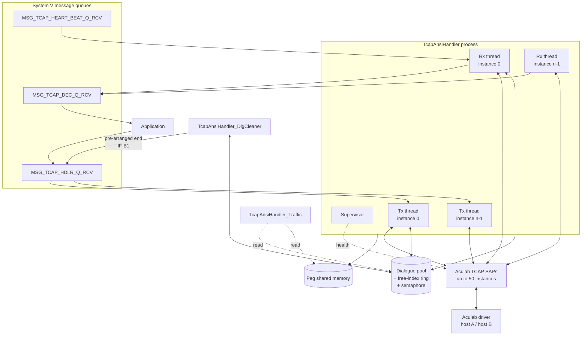
```mermaid
flowchart TB
    APP["Application"]

    subgraph HANDLER["TcapAnsiHandler process"]
        SUP["Supervisor"]
        RX0["Rx thread<br/>instance 0"]
        TX0["Tx thread<br/>instance 0"]
        RXN["Rx thread<br/>instance n-1"]
        TXN["Tx thread<br/>instance n-1"]
    end

    subgraph QUEUES["System V message queues"]
        Q1["MSG_TCAP_HDLR_Q_RCV"]
        Q2["MSG_TCAP_DEC_Q_RCV"]
        Q3["MSG_TCAP_HEART_BEAT_Q_RCV"]
    end

    POOL[("Dialogue pool<br/>+ free-index ring<br/>+ semaphore")]
    CLEAN["TcapAnsiHandler_DlgCleaner"]
    TRAF["TcapAnsiHandler_Traffic"]
    SAPS["Aculab TCAP SAPs<br/>up to 50 instances"]
    DRV["Aculab driver<br/>host A / host B"]
    PEG[("Peg shared memory")]

    APP --> Q1 --> TX0
    Q1 --> TXN
    RX0 --> Q2
    RXN --> Q2 --> APP
    Q3 --> RX0

    TX0 <--> SAPS
    RX0 <--> SAPS
    TXN <--> SAPS
    RXN <--> SAPS
    SAPS <--> DRV

    RX0 <--> POOL
    TX0 <--> POOL
    CLEAN <--> POOL
    CLEAN -->|"pre-arranged end<br/>IF-B1"| Q1
    TRAF -.->|read| POOL
    TRAF -.->|read| PEG
    HANDLER --> PEG
    SUP -.->|health| SAPS
```

| Interface | Peer | Reference |
|---|---|---|
| `IF-N2` | Application | `[SYS-HLD §12.3]` |
| `IF-S2` | Aculab TCAP API | `[SYS-HLD §12.5]` |
| `IF-B1` | Cleaner to handler | `[SYS-HLD §12.8]` |
| `IF-C1` | `TcapAnsiHandler.cfg`, `Tcap_*.cfg` | `[SYS-HLD §17]` |
| `IF-P1` | Signals | `[SYS-HLD §13.3]` |

## 2.1 The Three Processes

| Process | Relationship to the handler |
|---|---|
| `TcapAnsiHandler` | The protocol engine. Owns the SAPs and all Aculab interaction |
| `TcapAnsiHandler_DlgCleaner` | **Never touches Aculab.** Detects expired dialogue records in shared memory and asks the handler to tear them down over `IF-B1`. This keeps all Aculab manipulation inside the handler's threads (`[SYS-HLD §4.6]` AD-09) |
| `TcapAnsiHandler_Traffic` | Read-only observer of the pool and peg counters. No Aculab linkage, no queues, no SAPs |

---

# 3. Internal Structure

**Diagram T-02 — Class structure.**

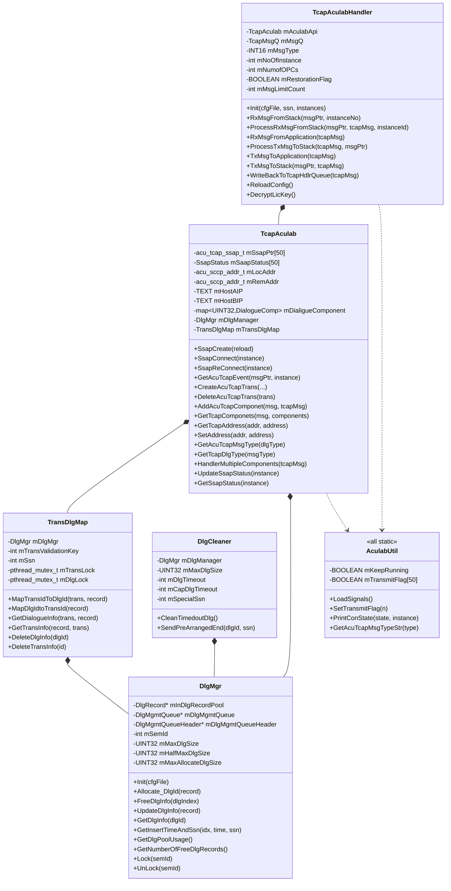
```mermaid
classDiagram
    class TcapAculabHandler {
        -TcapAculab mAculabApi
        -TcapMsgQ mMsgQ
        -INT16 mMsgType
        -int mNoOfInstance
        -int mNumofOPCs
        -BOOLEAN mRestorationFlag
        -int mMsgLimitCount
        +Init(cfgFile, ssn, instances)
        +RxMsgFromStack(msgPtr, instanceNo)
        +ProcessRxMsgFromStack(msgPtr, tcapMsg, instanceId)
        +RxMsgFromApplication(tcapMsg)
        +ProcessTxMsgToStack(tcapMsg, msgPtr)
        +TxMsgToApplication(tcapMsg)
        +TxMsgToStack(msgPtr, tcapMsg)
        +WriteBackToTcapHdlrQueue(tcapMsg)
        +ReloadConfig()
        +DecryptLicKey()
    }

    class TcapAculab {
        -acu_tcap_ssap_t mSsapPtr[50]
        -SsapStatus mSaapStatus[50]
        -acu_sccp_addr_t mLocAddr
        -acu_sccp_addr_t mRemAddr
        -TEXT mHostAIP
        -TEXT mHostBIP
        -map~UINT32,DialogueComp~ mDialigueComponent
        -DlgMgr mDlgManager
        -TransDlgMap mTransDlgMap
        +SsapCreate(reload)
        +SsapConnect(instance)
        +SsapReConnect(instance)
        +GetAcuTcapEvent(msgPtr, instance)
        +CreateAcuTcapTrans(...)
        +DeleteAcuTcapTrans(trans)
        +AddAcuTcapComponet(msg, tcapMsg)
        +GetTcapComponets(msg, components)
        +GetTcapAddress(addr, address)
        +SetAddress(addr, address)
        +GetAcuTcapMsgType(dlgType)
        +GetTcapDlgType(msgType)
        +HandlerMultipleComponents(tcapMsg)
        +UpdateSsapStatus(instance)
        +GetSsapStatus(instance)
    }

    class TransDlgMap {
        -DlgMgr mDlgMgr
        -int mTransValidationKey
        -int mSsn
        -pthread_mutex_t mTransLock
        -pthread_mutex_t mDlgLock
        +MapTransIdToDlgId(trans, record)
        +MapDlgIdtoTransId(record)
        +GetDialogueInfo(trans, record)
        +GetTransInfo(record, trans)
        +DeleteDlgInfo(dlgId)
        +DeleteTransInfo(id)
    }

    class DlgMgr {
        -DlgRecord* mInDlgRecordPool
        -DlgMgmtQueue* mDlgMgmtQueue
        -DlgMgmtQueueHeader* mDlgMgmtQueueHeader
        -int mSemId
        -UINT32 mMaxDlgSize
        -UINT32 mHalfMaxDlgSize
        -UINT32 mMaxAllocateDlgSize
        +Init(cfgFile)
        +Allocate_DlgId(record)
        +FreeDlgInfo(dlgIndex)
        +UpdateDlgInfo(record)
        +GetDlgInfo(dlgId)
        +GetInsertTimeAndSsn(idx, time, ssn)
        +GetDlgPoolUsage()
        +GetNumberOfFreeDlgRecords()
        +Lock(semId)
        +UnLock(semId)
    }

    class DlgCleaner {
        -DlgMgr mDlgManager
        -UINT32 mMaxDlgSize
        -int mDlgTimeout
        -int mCapDlgTimeout
        -int mSpecialSsn
        +CleanTimedoutDlg()
        +SendPreArrangedEnd(dlgId, ssn)
    }

    class AculabUtil {
        <<all static>>
        -BOOLEAN mKeepRunning
        -BOOLEAN mTransmitFlag[50]
        +LoadSignals()
        +SetTransmitFlag(n)
        +PrintConState(state, instance)
        +GetAcuTcapMsgTypeStr(type)
    }

    TcapAculabHandler *-- TcapAculab
    TcapAculab *-- TransDlgMap
    TcapAculab *-- DlgMgr
    TransDlgMap *-- DlgMgr
    DlgCleaner *-- DlgMgr
    TcapAculabHandler ..> AculabUtil
    TcapAculab ..> AculabUtil
```

## 3.1 Responsibility Split

| Class | Library | Responsibility | May call Aculab |
|---|---|---|---|
| `TcapAculabHandler` | Built into the binary | Protocol engine, flows, IPC, instance selection, rate limiting | **No** — only through `TcapAculab` |
| `TcapAculab` | `libAculabApi.a` | Every Aculab TCAP call; encode and decode; component accumulation | **Yes — exclusively** |
| `TransDlgMap` | `libAculabTransDlgMap.a` | Dialogue-to-transaction binding | Only the transaction user-pointer calls |
| `DlgMgr` | `libAculabDlgMgr.a` | Shared-memory pool, ring, semaphore | **No** |
| `AculabUtil` | `libAculabUtil.a` | Flags, signals, queue recovery, transmit gates, diagnostics | Only diagnostic converters |
| `DlgCleaner` | Built into its binary | Expiry detection | **No** |
| `Traffic` | Built into its binary | Statistics display | **No** |

`DlgMgr` deliberately has no Aculab dependency. That is what allows the cleaner and the
traffic reporter to link it without linking the Aculab library.

## 3.2 Vestigial Structure

| Item | Status |
|---|---|
| `TransDlgMap::mapDlgRecord`, `mapTransRecord` | STL maps that are **largely vestigial**. The real binding is the transaction user pointer (§9.4). `mapTransRecord` is declared and never used |
| `TransDlgMap::mTransLock` | Initialised, never locked |
| `DlgMgr::mThreadLock` | Initialised, never locked |
| `gPthreadCondLock` | Declared, never used |
| `TcapMsgQ::WrSccpQKey`, `RdSccpQKey`, `SccpWrQ`, `SccpRdQ` | Declared, never used |
| `TcapAculabHandler::ProcessRxSccpMsgFromStack` | **Declared in the header, defined nowhere** |
| Large `#if 0` and comment blocks in `src/TcapAculabApi.cc` | Superseded implementations retained in place |

All are collected under `[SYS-HLD §21.3]` R-12. They matter because a reader can easily
assume the maps are the binding mechanism, or that the unused queue members indicate a
working feature.

---

# 4. SAP Management

## 4.1 Cardinality and Instance Mapping

| Limit | Value | Constant |
|---|---|---|
| SAP instances per process | 50 | `MAX_ACU_TCAP_INSTANCES` |
| Instances per point code | 10 | `MAX_INSTANCE_PER_PC` |
| Origination point codes | 128 | `SS7_MAX_NO_OF_PC` |

**Diagram T-03 — SAP-to-point-code mapping.**

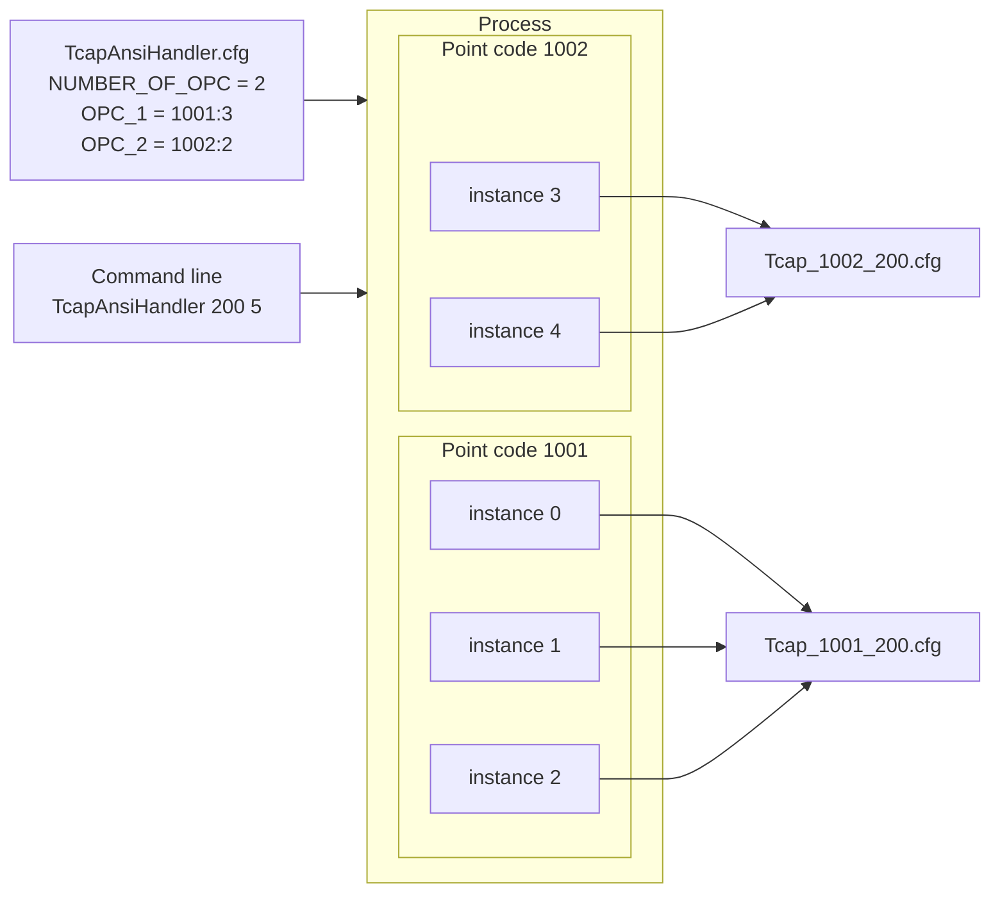
```mermaid
flowchart LR
    CFG["TcapAnsiHandler.cfg<br/>NUMBER_OF_OPC = 2<br/>OPC_1 = 1001:3<br/>OPC_2 = 1002:2"]
    CMD["Command line<br/>TcapAnsiHandler 200 5"]

    subgraph PROC["Process"]
        subgraph PC1["Point code 1001"]
            I0["instance 0"]
            I1["instance 1"]
            I2["instance 2"]
        end
        subgraph PC2["Point code 1002"]
            I3["instance 3"]
            I4["instance 4"]
        end
    end

    F1["Tcap_1001_200.cfg"]
    F2["Tcap_1002_200.cfg"]

    CFG --> PROC
    CMD --> PROC
    I0 --> F1
    I1 --> F1
    I2 --> F1
    I3 --> F2
    I4 --> F2
```

| Configuration | Config file name |
|---|---|
| `NUMBER_OF_OPC` = 0 — single point code | `Tcap_<ssn>.cfg` |
| `NUMBER_OF_OPC` > 0 — multi point code | `Tcap_<pointcode>_<ssn>.cfg` |

**The instance count on the command line must equal the sum of the per-point-code counts
in configuration.** Duplicate point codes are rejected during parsing.

## 4.2 SAP Creation

Each instance is created with the **ANSI standard flag**:

```c
acu_tcap_ssap_create(cfgFile, acu_tcap_ssap_flags_t(SS7_STANDARD_ANSI | ACU_TCAP_LOG_STDERR));
```

where `SS7_STANDARD_ANSI` is 1 from `enum EnumSs7Standard` (`include/TcapStructs.h:32`).

> **The flag is a literal, not a variable.** A comment above the line records the
> intention to make the standard selectable at run time, and a local variable exists for
> it in the component-encoding path — assigned and never read. **This is a hard-switched
> ANSI build**, not a dual-standard binary. Treat the enumeration as documentation of
> intent, not as a supported capability.

### Settings applied immediately after creation

| Setting | Value | Purpose |
|---|---|---|
| `ACU_TCAP_CFG_TRANID_RANGE` | Per instance, incrementing | Prevents transaction-ID collision between instances (§4.3) |
| `ACU_TCAP_CFG_TRACE_TAG` | `tcap_<pc>_<instance>` | Attributes Aculab log lines to an instance |
| `ACU_TCAP_CFG_ENC_DEF_LEN` | 1 | **Forces definite-length BER encoding** |
| `ACU_TCAP_CFG_QOS_RET_OPT` | 1 | Return option on |
| `ACU_TCAP_CFG_HOST_A_NAME`, `HOST_B_NAME` | From configuration | Used during failover (§4.5) |

### Local point-code cross-check

As on the SCCP path, `LocalPC` is read by this component from the tier 2 file and
compared with the point code the Aculab library derived. A mismatch logs the discrepancy
and fails SAP creation for that instance.

## 4.3 Transaction Identifier Range

| Property | Value |
|---|---|
| Configuration key | `TRANID_RANGE`, in the tier 2 file |
| Valid range | 0 … 4094 |
| Assignment | One distinct value per instance, incremented as instances are created |
| Zero value | Triggers a probe |

### The probe

When configuration specifies 0, the component derives the range rather than failing:

| # | Step |
|---|---|
| 1 | Create a throwaway transaction on the new SAP |
| 2 | Allocate a message on it |
| 3 | Read back the assigned identifiers with `acu_tcap_trans_get_ids` |
| 4 | Derive the range as the local identifier shifted right by 20 bits |
| 5 | Store it in `mSaapStatus[instance].transIdRange` |

Step 5 matters: on a later reconnect the stored value is reapplied, so the instance
returns to the **same** identifier space. Without it, restoration (§4.6) would be
pointless, because peers hold identifiers from the previous range.

> The upper bound of 4094 is recorded in the source as empirical — "while testing the
> maximum value the driver is accepting is 4094" — not taken from vendor documentation.
> `[NEEDS INPUT: confirm the transaction ID range upper bound against the Aculab documentation]`

## 4.4 SAP Health Evaluation

`GetSsapStatus` (`src/TcapAculabApi.cc:819`) evaluates each instance independently. The
thresholds depend on whether alternate host addresses are configured:

| Configuration | Silence threshold | Additional tests |
|---|---|---|
| No alternate IPs | **15 s** | `IN_SERVICE` combined with `RX_BLOCKED` or `TX_BLOCKED` |
| Alternate IPs configured | **10 s** | Also connect timeout, connection rejected, login rejected; attempts host switchover |

On failure the instance's state is set to `EXITING`, the global restore flag is cleared,
and the supervisor triggers reconnect.

The last-activity time is refreshed on **every** poll, which uses a 500 ms timeout — so a
healthy but idle link still ticks and the threshold measures genuine silence
`[SYS-HLD §9.6]`.

Compare the SCCP path, which uses a single 30-second threshold and has no alternate-IP
mechanism `[SCCP-HLD §12.1]`.

## 4.5 Dual-Host Failover

**Diagram T-04 — Dual-host failover per instance.**

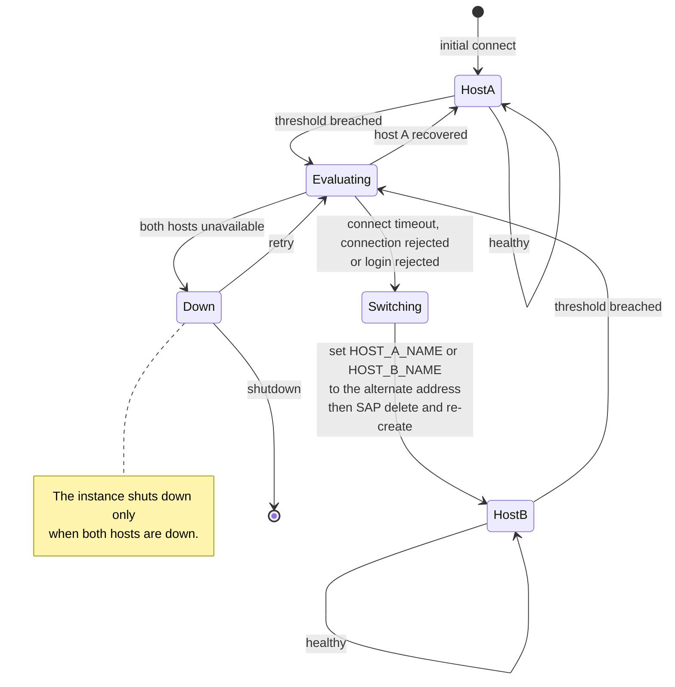
```mermaid
stateDiagram-v2
    [*] --> HostA : initial connect

    HostA --> HostA : healthy
    HostA --> Evaluating : threshold breached

    Evaluating --> HostA : host A recovered
    Evaluating --> Switching : connect timeout, connection rejected<br/>or login rejected
    Switching --> HostB : set HOST_A_NAME or HOST_B_NAME<br/>to the alternate address<br/>then SAP delete and re-create
    HostB --> HostB : healthy
    HostB --> Evaluating : threshold breached

    Evaluating --> Down : both hosts unavailable
    Down --> Evaluating : retry
    Down --> [*] : shutdown

    note right of Down
        The instance shuts down only
        when both hosts are down.
    end note
```

`TCAP_HOST_A_ALT_IP` and `TCAP_HOST_B_ALT_IP` supply the alternate addresses. They are
applied through `acu_tcap_ssap_set_cfg_str` on the host-name configuration keys before
re-creating the SAP.

## 4.6 Restoration After Reconnect

This is the component's most valuable resilience mechanism and has no counterpart on the
SCCP path.

**Diagram T-05 — Restoration sequence.**

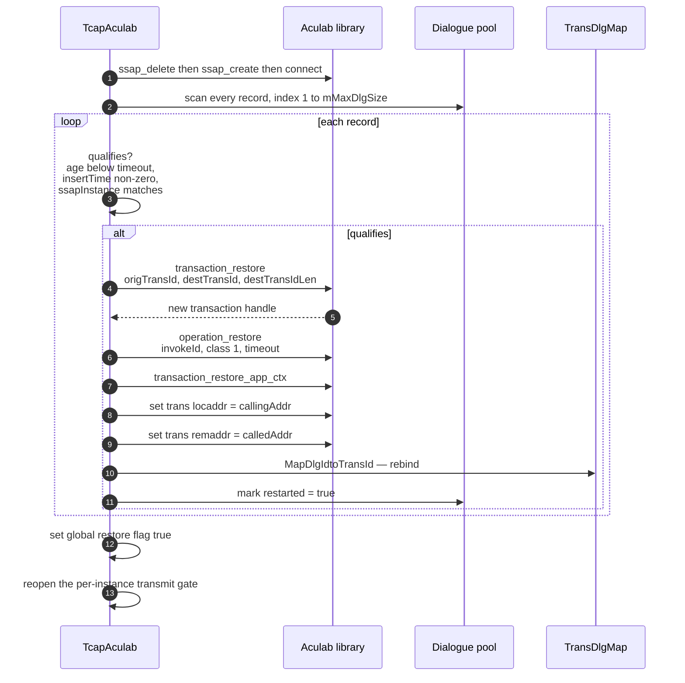
```mermaid
sequenceDiagram
    autonumber
    participant Api as TcapAculab
    participant Acu as Aculab library
    participant Pool as Dialogue pool
    participant Map as TransDlgMap

    Api->>Acu: ssap_delete then ssap_create then connect
    Api->>Pool: scan every record, index 1 to mMaxDlgSize
    loop each record
        Api->>Api: qualifies?<br/>age below timeout,<br/>insertTime non-zero,<br/>ssapInstance matches
        alt qualifies
            Api->>Acu: transaction_restore<br/>origTransId, destTransId, destTransIdLen
            Acu-->>Api: new transaction handle
            Api->>Acu: operation_restore<br/>invokeId, class 1, timeout
            Api->>Acu: transaction_restore_app_ctx
            Api->>Acu: set trans locaddr = callingAddr
            Api->>Acu: set trans remaddr = calledAddr
            Api->>Map: MapDlgIdtoTransId — rebind
            Api->>Pool: mark restarted = true
        end
    end
    Api->>Api: set global restore flag true
    Api->>Api: reopen the per-instance transmit gate
```

Qualifying conditions, all required:

| Condition |
|---|
| `time(NULL) − insertTime` is less than the configured dialogue timeout |
| `insertTime` is non-zero, that is the slot is in use |
| `ssapInstance` matches the instance being reconnected |

### The disabled second path

A handler-level restoration function, `GetDlgInfoAndRestore`
(`src/TcapAculabHandler.cc:162-287`), is **entirely commented out**, and so is its call
site in `Init`.

The consequence is severe and non-obvious:

> Setting `RESTORATION_REQUIRED = 1` causes the handler to clear the global restore flag
> and never set it. The transmit threads gate on that flag, so they **idle-loop
> permanently, logging `ACUTCAP105`, and the handler cannot transmit at all.**

The parameter is currently a trap rather than a feature. The reconnect-path restoration
described above is the only working mechanism and does **not** depend on the flag. This
is `[SYS-HLD §21.3]` R-04.

### Cold start

When `RESTORATION_REQUIRED` is 0, `Init` performs the opposite: it walks the whole pool
and releases every record whose SSN matches this handler's, clearing the previous
incarnation's leftovers. This is the safe default and is what the sample configuration in
`[SYS-HLD §17.5]` uses.

---

# 5. Concurrency and Threading

## 5.1 Thread Model

**Diagram T-06 — Thread model.**

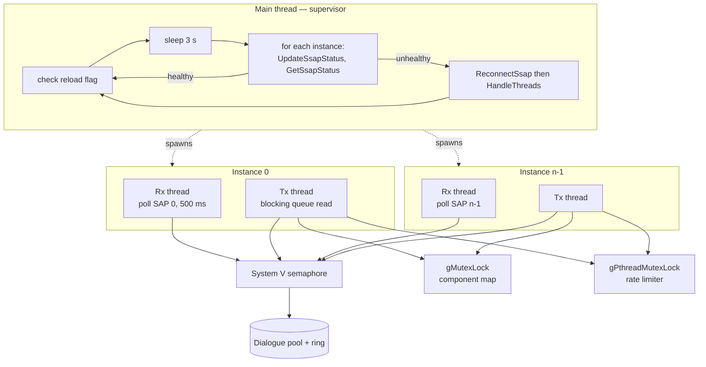
```mermaid
flowchart TB
    subgraph SUP["Main thread — supervisor"]
        S1["check reload flag"]
        S2["sleep 3 s"]
        S3["for each instance:<br/>UpdateSsapStatus, GetSsapStatus"]
        S4["ReconnectSsap then HandleThreads"]
        S1 --> S2 --> S3
        S3 -->|unhealthy| S4 --> S1
        S3 -->|healthy| S1
    end

    subgraph INST0["Instance 0"]
        R0["Rx thread<br/>poll SAP 0, 500 ms"]
        T0["Tx thread<br/>blocking queue read"]
    end

    subgraph INSTN["Instance n-1"]
        RN["Rx thread<br/>poll SAP n-1"]
        TN["Tx thread"]
    end

    SEM["System V semaphore"]
    POOL[("Dialogue pool + ring")]
    MUT["gMutexLock<br/>component map"]
    RATE["gPthreadMutexLock<br/>rate limiter"]

    SUP -.->|spawns| INST0
    SUP -.->|spawns| INSTN
    R0 --> SEM --> POOL
    T0 --> SEM
    RN --> SEM
    TN --> SEM
    T0 --> MUT
    TN --> MUT
    T0 --> RATE
    TN --> RATE
```

| Thread | Count | Loop condition | Blocking call | Timeout |
|---|---|---|---|---|
| Supervisor | 1 | `KeepRunning()` | `sleep(3)` | — |
| Rx | 1 per instance | `KeepRunning()` | `acu_tcap_ssap_msg_get` | 500 ms |
| Tx | 1 per instance | `KeepRunning()` **and** the global restore flag | `msgrcv`, blocking | None |

**Total: 2n + 1 threads**, up to 101 at the 50-instance maximum.

Threads are created only for instances whose status is connected. Each creation is
separated by a one-second sleep. All worker threads are detached.

## 5.2 The Transmit Thread Gate

The transmit thread checks the global restore flag before reading its queue. When the
flag is false it sleeps one second and logs `ACUTCAP105`. This is the mechanism that R-04
turns into a permanent stall.

## 5.3 Lock Inventory

| Lock | Scope | Protects | Actually taken |
|---|---|---|---|
| System V semaphore, sub-ID `SEM_FOR_IN_DLG_POOL` | **Cross-process** | Dialogue allocation, release, update; the ring header and body | **Yes** — the only real pool guard |
| `gMutexLock` (`src/TcapAculabApi.cc:20`) | Process | The component accumulation map | Yes, in `HandlerMultipleComponents` |
| `gPthreadMutexLock` (`src/TcapAculabHandler.cc:27`) | Process | The rate-limiter counter and window | Yes |
| `TransDlgMap::mDlgLock` | Object | Erase from the dialogue record map | Yes, in `DeleteTransInfo` only |
| `TransDlgMap::mTransLock` | Object | — | **No** |
| `DlgMgr::mThreadLock` | Object | — | **No** |
| `gPthreadCondLock` | Process | — | **No** |
| Aculab `trans_block` / `trans_unblock` | Per transaction | Serialises processing of one transaction between Rx and Tx | Yes |

### The inconsistent lock

`HandlerMultipleComponents` takes `gMutexLock` before touching the component accumulation
map. **`AddAcuTcapComponet` reads and erases the same map without taking it.** Since both
run on transmit threads and there is one per instance, concurrent access is reachable
whenever two instances process components for different dialogues at the same time.

This is the more serious half of `[SYS-HLD §21.3]` R-15.

### Semaphore protocol

| Operation | Ops | Flags |
|---|---|---|
| Lock | wait for zero, then increment | Undo on both; no-wait on the increment |
| Unlock | decrement | Undo, no-wait |

The undo flag means a process crash releases the lock rather than deadlocking the
survivors — essential given that the handler, the cleaner and the traffic reporter all
contend on it.

Three sub-IDs are enumerated — inbound pool, outbound pool, management queue — but **only
the inbound-pool sub-ID is ever used**. All pool and ring access serialises on one
semaphore.

## 5.4 Transaction-Level Serialisation

Aculab's `trans_block` / `trans_unblock` pair serialises processing of a single
transaction across the Rx and Tx threads. On the transmit side, before deleting a
transaction, the component:

| # | Step |
|---|---|
| 1 | Attempt `acu_tcap_trans_block` |
| 2 | If it fails, `usleep(500)` and retry once |
| 3 | If it still fails, **drop the message** and log `ACUTCAP175` |

This prevents a delete racing a concurrent receive on the same transaction, at the cost
of dropping a message under contention.

## 5.5 Thread Argument Hazard

`HandleThreads` declares an `AcuThreadStruct` as a **stack local**, passes its address to
every `pthread_create`, and then mutates it in the loop for the next instance. The
one-second stagger between creations is what makes this work in practice: each thread
reads its arguments before the next iteration overwrites them.

Removing or shortening the stagger would produce threads bound to the wrong instance.
This is `[SYS-HLD §21.3]` R-16.

---

# 6. Buffering and Flow Control

The four-stage chain is described in `[SYS-HLD §9]`. This section covers the
component's specific mechanisms.

## 6.1 Receive Windows

Unlike the SCCP path, the TCAP path has a full set of receive flow-control parameters in
the tier 2 configuration:

| Parameter | Header | Purpose |
|---|---|---|
| `ACU_TCAP_CFG_RX_BUFLEN` | `tcap_api.h:386` | TCP receive buffer size |
| `ACU_TCAP_CFG_RX_MSG_WINDOW` | `tcap_api.h:375` | Message-count window for driver flow control |
| `ACU_TCAP_CFG_RX_BYTE_WINDOW` | `tcap_api.h:376` | Byte window |
| `ACU_TCAP_CFG_RX_MAX_QLEN` | `tcap_api.h:377` | Maximum queue length before flow control |
| `ACU_TCAP_CFG_TX_QUEUE_LEN` | `tcap_api.h:388` | Transmit buffers before flow control |
| `ACU_TCAP_CFG_TX_BYTE_WINDOW` | `tcap_api.h:390` | Transmit byte window |

`[NEEDS INPUT: production values for these six parameters]`

## 6.2 Credit Release

Every received message must be released with `acu_tcap_trans_unblock` on its transaction.
The structural enumeration of receive exit paths:

| Condition | Unblocks | Frees |
|---|---|---|
| Poll returned no message | n/a | n/a |
| Data message, `acu_tcap_msg_decode` failed | Abort returned to the application, transaction torn down | Yes |
| Data message, dialogue found or created | Yes | Yes |
| Data message, no dialogue and not a transaction-initiating type | Yes | Yes — dropped as "fresh request but not a begin" |
| Terminal types: provider abort, local abort, response, ANSI abort | Yes, then `transaction_delete` | Yes |
| Timeout event | Response timeout surfaced upward, transaction torn down | Yes |
| Connection state, SP status, user status, notice | Diagnostics only | Yes |

`[NEEDS INPUT: line-by-line verification of every TCAP receive return path against this table — the enumeration above is structural rather than line-verified, unlike the SCCP equivalent in SCCP-HLD §6.1]`

## 6.3 Per-Instance Transmit Gating

`AculabUtil::mTransmitFlag[MAX_ACU_TCAP_INSTANCES]` is a static per-instance boolean array
set from the connection-state printer:

| Connection state | Gate |
|---|---|
| `IN_SERVICE` with `TX_BLOCKED` | **Closed** |
| `IN_SERVICE` with `TX_FLOW` | **Closed** |
| `IN_SERVICE`, clear | **Open** |
| During reconnect | Closed, then reopened after restoration |

Outbound instance selection skips instances whose gate is closed (§11). If **no** instance
is eligible, the message is not queued or retried — an abort is returned to the
application and the message is dropped, logged `ACUTCAP157`.

This is the component's principal difference from the SCCP path, which has no per-instance
gating and simply waits `[SCCP-HLD §6.2]`.

## 6.4 Deferred Processing

`WriteBackToTcapHdlrQueue` writes a message back onto the handler's own inbound queue
rather than processing it immediately. This defers work without dropping it, using the
kernel queue as the buffer. The SCCP path has no equivalent.

## 6.5 Heartbeat Queue

Drained non-blocking at the top of every receive iteration and discarded, exactly as on
the SCCP path `[SCCP-HLD §6.3]`.

---

# 7. Lifecycle and Control

## 7.1 Handler Startup

| # | Step | Failure |
|---|---|---|
| 1 | Validate argument count; print the ASCII-art banner and exit if wrong | Exit 1 |
| 2 | Validate SSN, `0 < ssn < 255` (`src/TcapAculabHandlerMain.cc:288`) | Exit 1 |
| 3 | Validate instance count against `MAX_ACU_TCAP_INSTANCES` | Exit 1 |
| 4 | Build process name `ACUTCAP_<ssn>` and config filename `Tcap_<ssn>.cfg` (`:306`) | — |
| 5 | `gLog.Init()` | Exit 1 |
| 6 | `AculabUtil::LoadSignals()` | — |
| 7 | `AculabUtil::SetTransmitFlag(50)` — open all gates | — |
| 8 | Acquire the process lock, product `"TCAP"` | `GSYS16`, exit 1 |
| 9 | Peg init on `"SHM_TCAP_PEG_KEY"` | `GSYS04`, exit 1 |
| 10 | Handler `Init(cfgFile, ssn, instances)` | `GSYS04`, exit 1 |
| 11 | `HandleThreads()` | `GSYS04`, exit 1 |
| 12 | Enter the supervisor loop | — |

Handler `Init` performs, in order: IPC configuration read, kernel configuration read,
queue creation, licence key decryption, dialogue manager initialisation, the cold-start
pool sweep or restoration branch (§4.6), then per-instance SAP creation and connection.

## 7.2 Cleaner Startup

`TcapAnsiHandler_DlgCleaner` takes no arguments. It reads `TcapAnsiHandler.cfg` for the
pool size, the two timeouts, the cleaner SSN and the handler queue key, initialises
`DlgMgr` — attaching to the existing pool — and enters its scan loop.

**It must start after at least one handler**, because it attaches to a pool it does not
create. In practice `DlgMgr::Init` would create the pool if absent, but with the cleaner's
own configured size, which risks violating consistency rule C-1 `[SYS-HLD §17.4]`.

## 7.3 Supervisor Loop

```
while (KeepRunning()):
    if (reload flag set):
        ReloadConfig()          # OPC list only
        HandleThreads()         # spawn threads for any new instances
        reset the flag
    sleep(3)
    for each instance:
        UpdateSsapStatus(instance)
        if (!GetSsapStatus(instance)):
            log ACUTCAP33
            ReconnectSsap(instance)
            HandleThreads()     # re-spawn -- see R-03
```

## 7.4 Configuration Reload

Reload re-reads **only** `NUMBER_OF_OPC` and the `OPC_<n>` entries, and creates SAP
instances starting at the current instance count.

| Property | Value |
|---|---|
| Can add instances | **Yes** |
| Can remove instances | **No** |
| Can reconfigure existing instances | **No** |
| Can change timeouts, pool size or IPC keys | **No** |

Reducing the instance count in configuration and sending the reload signal has no effect.
Removing capacity requires a restart. `[SYS-HLD §13.4]`

## 7.5 Cleaner Loop

```
while (KeepRunning()):
    if (reload flag set): ReloadConfig()
    CleanTimedoutDlg()
    sleep(3)
```

`CleanTimedoutDlg` (`src/TcapAculabDlgCleaner.cc:337`) scans the **entire** pool:

```
for i in 1 .. mMaxDlgSize:
    GetInsertTimeAndSsn(i, insertTime, ssn)
    now = time(NULL)
    if ssn == mSpecialSsn:
        if (now - insertTime) > mCapDlgTimeout and insertTime: SendPreArrangedEnd(i, ssn)
    else:
        if (now - insertTime) > mDlgTimeout and insertTime: SendPreArrangedEnd(i, ssn)
    if i % 2000 == 0: usleep(1000)
```

The periodic `usleep` every 2000 records yields the CPU so a full scan of a large pool
does not monopolise it. At the 500,000 maximum, a scan performs 250 yields of 1 ms each,
so the scan itself takes at least 250 ms of wall time.

## 7.6 Shutdown

As on the SCCP path: the run flag is cleared, loops exit at their next iteration, and
nothing is explicitly cleaned up. Transmit threads block indefinitely on `msgrcv` and do
not observe the flag `[SYS-HLD §13.6]`.

---

# 8. Protocol Processing

Unlike the SCCP path, this component does **not** encode ANSI TCAP itself. It builds
structured component data and lets the Aculab stack serialise it.

## 8.1 Encode Path

**Diagram T-07 — Outbound processing.**

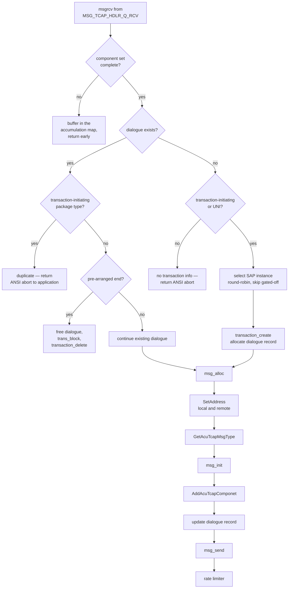
```mermaid
flowchart TB
    Q["msgrcv from<br/>MSG_TCAP_HDLR_Q_RCV"]
    MC{"component set<br/>complete?"}
    BUF["buffer in the<br/>accumulation map,<br/>return early"]
    EXIST{"dialogue exists?"}

    DUP{"transaction-initiating<br/>package type?"}
    ABORT1["duplicate — return<br/>ANSI abort to application"]
    PAE{"pre-arranged end?"}
    TEARDOWN["free dialogue,<br/>trans_block,<br/>transaction_delete"]
    CONT["continue existing dialogue"]

    NEWTYPE{"transaction-initiating<br/>or UNI?"}
    ABORT2["no transaction info —<br/>return ANSI abort"]
    SELECT["select SAP instance<br/>round-robin, skip gated-off"]
    CREATE["transaction_create<br/>allocate dialogue record"]

    ALLOC["msg_alloc"]
    ADDR["SetAddress<br/>local and remote"]
    TYPE["GetAcuTcapMsgType"]
    INIT["msg_init"]
    COMP["AddAcuTcapComponet"]
    UPD["update dialogue record"]
    SEND["msg_send"]
    RATE["rate limiter"]

    Q --> MC
    MC -->|no| BUF
    MC -->|yes| EXIST
    EXIST -->|yes| DUP
    DUP -->|yes| ABORT1
    DUP -->|no| PAE
    PAE -->|yes| TEARDOWN
    PAE -->|no| CONT --> ALLOC
    EXIST -->|no| NEWTYPE
    NEWTYPE -->|no| ABORT2
    NEWTYPE -->|yes| SELECT --> CREATE --> ALLOC
    ALLOC --> ADDR --> TYPE --> INIT --> COMP --> UPD --> SEND --> RATE
```

## 8.2 Multi-Component Assembly

The northbound interface carries **one component per message**
`[SYS-HLD §12.3]`. `HandlerMultipleComponents` (`src/TcapAculabApi.cc:4014`) accumulates
them under `gMutexLock`:

```c
typedef struct _DialogueComp {
   UINT8   numberOfComponent;   // how many have arrived
   UINT8   totComponent;        // highest tcUserId seen, plus one
   BOOLEAN lastComponentFlag;   // the last-marked component has arrived
   AnsiTcapComponent tcapComponent[ACU_TCAP_MAX_COMPONENT];  // 5
} DialogueComp;
```

held in `map<UINT32, DialogueComp> mDialigueComponent`, keyed on dialogue identifier.

| Return | Meaning |
|---|---|
| `true` | Keep buffering; drop this message from further processing |
| `false` | The set is complete; `AddAcuTcapComponet` drains it into one Aculab message |

Completion requires **both** `lastComponentFlag == 1` **and**
`numberOfComponent == totComponent`.

> **There is no timeout on an incomplete set.** A set that never completes occupies its
> map entry for the life of the process. The application-side rules in
> `[SYS-HLD §12.3]` therefore fail silently and cumulatively.

## 8.3 Package Type Mapping

### Application to wire

`GetAcuTcapMsgType` (`src/TcapAculabApi.cc:3808`):

| Internal enum | Aculab type | Peg |
|---|---|---|
| `TCAP_ANSI_QUERY_WITH_PERMISSION` | `ACU_TCAP_MSG_ANSI_QUERY` | `PEG_TCAP_BEGIN_TX` |
| `TCAP_ANSI_QUERY_WITHOUT_PERMISSION` | `ACU_TCAP_MSG_ANSI_QUERY_WO` | `PEG_TCAP_BEGIN_TX` |
| `TCAP_ANSI_CONVERSATION_WITH_PERMISSION` | `ACU_TCAP_MSG_ANSI_CONV` | `PEG_TCAP_CONTINUE_TX` |
| `TCAP_ANSI_CONVERSATION_WITHOUT_PERMISSION` | `ACU_TCAP_MSG_ANSI_CONV_WO` | `PEG_TCAP_CONTINUE_TX` |
| `TCAP_ANSI_RESPONSE`, `TCAP_PRE_ARRANGED_END`, `TCAP_END`, `TCAP_END_WITH_ADDRESS` | `ACU_TCAP_MSG_ANSI_RESPONSE` | `PEG_TCAP_END_TX` |
| `TCAP_ANSI_ABORT` | `ACU_TCAP_MSG_ANSI_ABORT` | `PEG_TCAP_USER_ABORT_TX` |
| `TCAP_ANSI_UNI` | `ACU_TCAP_MSG_ANSI_UNI` | — |
| `TCAP_RSP_TIMEOUT`, `TCAP_CONTROL`, default | `ACU_TCAP_MSG_TIMEOUT` | — |

### Wire to application

`GetTcapDlgType` (`src/TcapAculabApi.cc:3939`) is the inverse, with two notes:

| Wire type | Internal enum |
|---|---|
| Provider abort, local abort, ANSI abort | `TCAP_ANSI_ABORT` — **all three collapse to one value** |
| ANSI UNI | `TCAP_UNIDIRECTIONAL` |
| **default** | `TCAP_ANSI_RESPONSE` |

> **The default mapping to Response is a silent fallback.** An unrecognised Aculab
> message type is presented to the application as a Response rather than being rejected.

> **This component preserves the with-permission and without-permission distinction in
> both directions**, unlike the SCCP path `[SCCP-HLD §8.1]` R-19. This is the single
> strongest protocol-fidelity argument for choosing this path.

## 8.4 Component Encoding

`AddAcuTcapComponet` (`src/TcapAculabApi.cc:2767`). Operation code `0xFF` is normalised to
`0x00` first.

### Invoke — and the deferred-serialisation trap

```c
int lastClass = 1;
if (lastComponent == TCAP_LAST_COMPONENT) lastClass |= ACU_TCAP_LAST;
int invokeId = comp.invokeId ? comp.invokeId : ACU_TCAP_NO_INVOKE_ID;

UINT8* pOpCode   = NULL;
int lOpCodeOrLen = lOp.operationCode;          // National: integer, null pointer
if (lOp.isPrivate) {
   lOp.wireOpCode[0] = (lOp.operationCode >> 8) & 0xFF;   // Family
   lOp.wireOpCode[1] =  lOp.operationCode       & 0xFF;   // Specifier
   pOpCode = lOp.wireOpCode;  lOpCodeOrLen = 2;           // Private: pointer, length 2
}
acu_tcap_msg_add_comp_invoke(lMsg, invokeId, ACU_TCAP_NO_INVOKE_ID,
                             lastClass, comp.tcapInvokeComp.timeout,
                             pOpCode, lOpCodeOrLen,
                             comp.tcapInvokeComp.parameterData.array,
                             comp.tcapInvokeComp.parameterData.numberOfBytes);
```

> **`wireOpCode` lives in `TCAPOperation` (`include/Ss7Structs.h`), not on the local
> stack.** The Aculab builder stores the pointer without copying, and BER serialisation
> happens only at `acu_tcap_msg_send`. A stack-local array would be dangling by then, and
> every Private-opcode Invoke would go onto the wire corrupted — silently.
>
> This is documented at the field definition and in `[TSS-REL]`. **Any buffer passed to
> any Aculab component builder must outlive the send call.** This is the single most
> important invariant in this component.

### Return Result

`acu_tcap_msg_add_comp_result(msg, invokeId, lLast, NULL, 0, param, len)`.

The operation code is deliberately null with length zero: **ANSI Return Result does not
carry an operation code on the wire.** `lLast` is `ACU_TCAP_LAST` unless the last
indicator says otherwise.

### Return Error

The same National-integer versus Private-pointer treatment as Invoke, via
`acu_tcap_msg_add_comp_error`, using a local two-byte array for the Family and Specifier.

> The Return Error path uses a **local** array rather than a structure field. Because
> the error-code buffer is consumed the same way as the Invoke opcode buffer, this is the
> same hazard the Invoke path was fixed for. It works only if the array outlives the send
> — which requires the array's scope to enclose the send call. This should be verified
> and, if necessary, moved into the structure as `wireOpCode` was.
> `[NEEDS INPUT: verify the Return Error Family/Specifier buffer lifetime against the send call]`

### Reject

`GetAcuRejectProblem` maps the application's `(problemCodeType, problemCode)` pair to the
Aculab reject-problem enumeration, then `acu_tcap_msg_add_comp_reject`.

> **Defect.** Cases 2, 3 and 4 in `GetAcuRejectProblem`
> (`src/TcapAculabApi.cc:3015-3084`) have inner switch statements with **no trailing
> `break`**, so control falls through to `default: return false`. **Only problem code
> type 1 can be encoded.** This is `[SYS-HLD §21.3]` R-08 and is a conformance gap
> `[SYS-HLD §20.2]`.

### Abort

`acu_tcap_msg_add_ansi_abort_userinfo(msg, abortReason.array, numberOfBytes)`.

## 8.5 Component Decoding

`GetTcapComponets` (`src/TcapAculabApi.cc:1728`):

| # | Step |
|---|---|
| 1 | `acu_tcap_msg_has_components` |
| 2 | If zero, **synthesise** an abort component for local abort and provider abort, carrying the abort cause as a single byte |
| 3 | Otherwise loop on `acu_tcap_msg_get_component` until no component remains |
| 4 | Fill one component structure per iteration, marking each not-last |
| 5 | Back-patch the final one as last |

### Flag-driven operation code decode

| Aculab flag | Result |
|---|---|
| `ACU_TCAP_CF_HAS_INT_OPCODE` | `operationCode` from the integer field; `isPrivate` false |
| `ACU_TCAP_CF_HAS_HEX_OPCODE` | `isPrivate` true; `operationCode` = `(byte0 << 8) | byte1`, or the single byte when the length is 1 |
| `ACU_TCAP_CF_HAS_PARAMETER` | Copy the parameter bytes |

Component type mapping (`GetTcapCompType`, `src/TcapAculabApi.cc:2274`) folds the ANSI
Aculab enumerators into the internal set: last and not-last Invoke both to Invoke, last
and not-last Result both to Return Result, and so on. The not-last property is preserved
separately in the last-indicator field.

## 8.6 Addressing

`SetAddress` (`src/TcapAculabApi.cc:3688`) — the ANSI path explicitly **clears three
Aculab defaults** that the tier 2 configuration pre-sets:

```c
lAddr->sa_flags &= ~ACU_SCCP_SA_FLAGS_RAW_GT;   // let the stack build the GT header
lAddr->sa_valid &= ~ACU_SCCP_SA_VALID_GTI;      // ambiguous alongside TT, NP, ES
lAddr->sa_valid &= ~ACU_SCCP_SA_VALID_NAI;      // the ANSI GT header has no NAI
```

Each clearing is accompanied by an explanatory comment in the source. The GTI is instead
derived as `(addressIndicator >> 2) & 0x0F`:

| Derived GTI | Fields set |
|---|---|
| 1 | Translation type only |
| 2 or 3 | Translation type, numbering plan, encoding scheme |

On decode (`GetTcapAddress`, `src/TcapAculabApi.cc:3300`) the ANSI bit assignment is:

| Bit | Meaning |
|---|---|
| `0x02` | Point code indicator |
| `0x01` | Subsystem indicator |
| `0x40` | Route on subsystem |

with an explicit comment that nature of address is **not** decoded, because it is not part
of the ANSI SCCP address header.

> **Note the bit assignment differs from the SCCP path**, where `0x01` is the point-code
> indicator and `0x02` the subsystem indicator `[SCCP-HLD §8.2]`. An application that
> uses both paths must populate the indicator differently for each.
> `[NEEDS INPUT: is the address indicator bit assignment difference between the two paths intentional?]`

## 8.7 Package and Component Type Enumerations

`EnumTcapDlg` (`include/TcapStructs.h:38`) carries legacy values 0–10 and the ANSI
additions 11–17:

| Value | Enumerator |
|---|---|
| 1 | `TCAP_PRE_ARRANGED_END` |
| 5 | `TCAP_RSP_TIMEOUT` |
| 6 | `TCAP_CONTROL` |
| 11 | `TCAP_ANSI_QUERY_WITH_PERMISSION` |
| 12 | `TCAP_ANSI_QUERY_WITHOUT_PERMISSION` |
| 13 | `TCAP_ANSI_RESPONSE` |
| 14 | `TCAP_ANSI_CONVERSATION_WITH_PERMISSION` |
| 15 | `TCAP_ANSI_CONVERSATION_WITHOUT_PERMISSION` |
| 16 | `TCAP_ANSI_ABORT` |
| 17 | `TCAP_ANSI_UNI` |

Values 0, 2, 3, 4, 7, 8, 9 and 10 are legacy and are handled only as inputs mapped onto
the ANSI set (§8.3).

`EnumTcapComp`: Invoke 0, Return Result 1, Return Error 2, Reject 3, Abort 4, Response
Timeout 5.

---

# 9. State and Data — the Dialogue Pool

This chapter is the component's defining content.

## 9.1 The Dialogue Record

`include/TcapAculabConstDef.h:93`:

```c
struct DlgRecord {
   unsigned int      dlgId;
   acu_tcap_trans_t  *trans;          // Aculab transaction handle — see the warning
   int               ssn;
   time_t            insertTime;      // basis for all timeout logic
   int               transValidationKey;
   int               origTransIdLen, destTransIdLen;
   unsigned int      origTransId,   destTransId;
   int               invokeId;
   acu_sccp_addr_t   callingAddr, calledAddr;
   UINT8             opCode;
   EnumTcapDlg       dlgType;
   TcapAcnPdu        applicationContext;
   BOOLEAN           restarted;
   int               ssapInstance;
};
```

**Diagram T-08 — Dialogue record and its validity scope.**

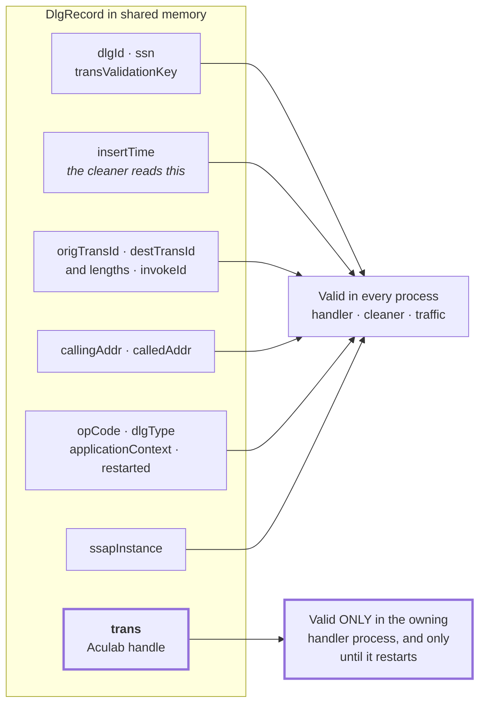
```mermaid
flowchart LR
    subgraph REC["DlgRecord in shared memory"]
        ID["dlgId · ssn<br/>transValidationKey"]
        TIME["insertTime<br/><i>the cleaner reads this</i>"]
        TID["origTransId · destTransId<br/>and lengths · invokeId"]
        ADDR["callingAddr · calledAddr"]
        PROTO["opCode · dlgType<br/>applicationContext · restarted"]
        INST["ssapInstance"]
        PTR["<b>trans</b><br/>Aculab handle"]
    end

    ALL["Valid in every process<br/>handler · cleaner · traffic"]
    OWN["Valid ONLY in the owning<br/>handler process, and only<br/>until it restarts"]

    ID --> ALL
    TIME --> ALL
    TID --> ALL
    ADDR --> ALL
    PROTO --> ALL
    INST --> ALL
    PTR --> OWN

    style PTR stroke-width:3px
    style OWN stroke-width:3px
```

> **`trans` is a process-address-space pointer stored in shared memory.** It is
> meaningful only inside the handler that created it, and becomes invalid even to that
> handler after a restart. The cleaner and the traffic reporter read this record and
> **must never dereference that field** — and they do not.
>
> This is why the cleaner requests teardown from the handler rather than performing it
> (`[SYS-HLD §4.6]` AD-09), and it is `[SYS-HLD §21.3]` R-05. The
> `transValidationKey` field was intended to detect stale records from a previous
> incarnation, but **the check is `#if 0`-disabled** at `src/TcapAculabHandler.cc:1320`
> with the comment "Below Commented to avoid trans validation for HA".

## 9.2 Pool Sizing and the Directional Split

`DlgMgr::Init` (`src/TcapAculabDlgMgr.cc:138`) reads two parameters and derives three
quantities:

| Read | Range |
|---|---|
| `MAX_ACU_TCAP_DLG_SIZE` → `mMaxDlgSize` | 1 … 500,000 |
| `ACU_TCAP_IN_DLG_SHIFT_INDX` → `shift` | 0 … 500,000, default 0 |

```c
mHalfMaxDlgSize     = mMaxDlgSize / 2 + shift;
mMaxAllocateDlgSize = mMaxDlgSize / 2 - shift;
```

**Diagram T-09 — Pool directional split.**

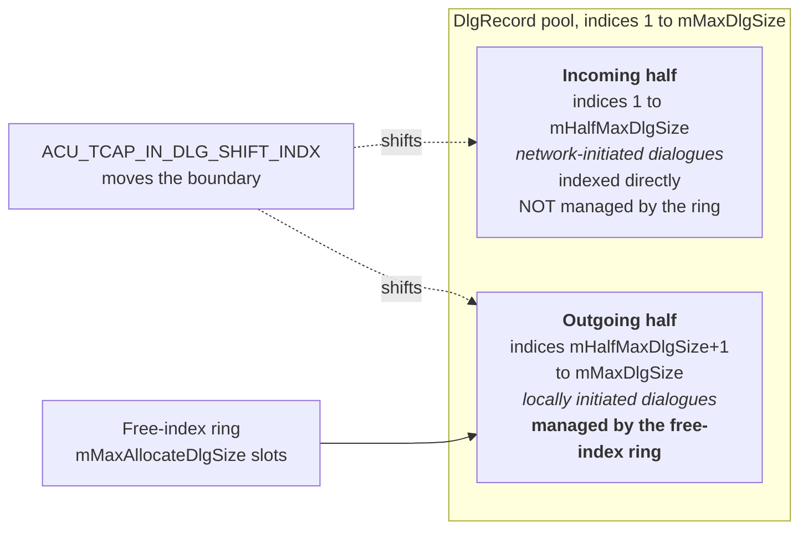
```mermaid
flowchart LR
    subgraph POOL["DlgRecord pool, indices 1 to mMaxDlgSize"]
        direction LR
        IN["<b>Incoming half</b><br/>indices 1 to mHalfMaxDlgSize<br/><i>network-initiated dialogues</i><br/>indexed directly<br/>NOT managed by the ring"]
        OUT["<b>Outgoing half</b><br/>indices mHalfMaxDlgSize+1<br/>to mMaxDlgSize<br/><i>locally initiated dialogues</i><br/><b>managed by the free-index ring</b>"]
    end

    SHIFT["ACU_TCAP_IN_DLG_SHIFT_INDX<br/>moves the boundary"]
    SHIFT -.->|shifts| IN
    SHIFT -.->|shifts| OUT

    RING["Free-index ring<br/>mMaxAllocateDlgSize slots"]
    RING --> OUT
```

| Half | Index range | Allocated by | Released by |
|---|---|---|---|
| Incoming | 1 … `mHalfMaxDlgSize` | The application or receive path, indexed directly | `FreeDlgInfo` **zeroes the record but does not push an index** — that half is not ring-managed |
| Outgoing | `mHalfMaxDlgSize + 1` … `mMaxDlgSize` | The free-index ring | `FreeDlgInfo` zeroes and pushes `index − mHalfMaxDlgSize` back onto the ring |

> **The sizing trap.** Configuring a pool of 200,000 yields roughly **100,000 usable
> outbound dialogues**, not 200,000. Capacity planning must start from the peak
> concurrent outbound count and double it `[SYS-HLD §15.6]`.

## 9.3 The Free-Index Circular Ring

### Structure

```c
struct DlgMgmtQueueHeader {
   UINT32 nextFreeDlgIdx;   // allocation cursor
   UINT32 lastFreeDlgIdx;   // release cursor
   UINT32 recordCount;      // currently allocated
};

struct DlgMgmtQueue {
   DlgMgmtQueueHeader *HeaderPtr;
   UINT32             *dlgIdx;   // the index array, immediately after the header
};
```

Shared-memory size: `sizeof(UINT32) * (mMaxDlgSize + 1) + sizeof(DlgMgmtQueueHeader)`.
The index array pointer is set to `(UINT32*)(mDlgMgmtQueueHeader + 1)` — that is,
immediately after the header (`src/TcapAculabDlgMgr.cc`).

### Initialisation

On first creation only (`IPC_CREAT | IPC_EXCL` succeeded):

```c
nextFreeDlgIdx = 1;
lastFreeDlgIdx = 1;
recordCount    = 0;
for (i = 0; i <= mMaxAllocateDlgSize; i++) dlgIdx[i] = i;
```

A slot value of **0 means consumed**; a non-zero value is an available offset.

### Allocation

`Allocate_DlgId` (`src/TcapAculabDlgMgr.cc:262`), under the semaphore:

**Diagram T-10 — Allocation and release on the ring.**

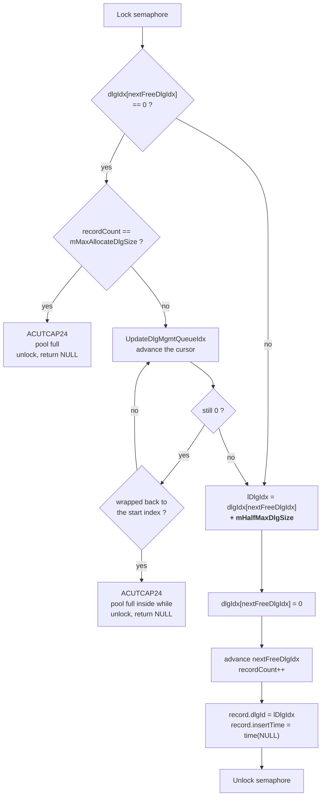
```mermaid
flowchart TB
    LOCK["Lock semaphore"]
    CHK{"dlgIdx[nextFreeDlgIdx]<br/>== 0 ?"}
    FULL1{"recordCount ==<br/>mMaxAllocateDlgSize ?"}
    ERR1["ACUTCAP24<br/>pool full<br/>unlock, return NULL"]
    ADV["UpdateDlgMgmtQueueIdx<br/>advance the cursor"]
    SCAN{"still 0 ?"}
    WRAP{"wrapped back to<br/>the start index ?"}
    ERR2["ACUTCAP24<br/>pool full inside while<br/>unlock, return NULL"]
    TAKE["lDlgIdx = dlgIdx[nextFreeDlgIdx]<br/><b>+ mHalfMaxDlgSize</b>"]
    MARK["dlgIdx[nextFreeDlgIdx] = 0"]
    ADV2["advance nextFreeDlgIdx<br/>recordCount++"]
    FILL["record.dlgId = lDlgIdx<br/>record.insertTime = time(NULL)"]
    UNLOCK["Unlock semaphore"]

    LOCK --> CHK
    CHK -->|no| TAKE
    CHK -->|yes| FULL1
    FULL1 -->|yes| ERR1
    FULL1 -->|no| ADV --> SCAN
    SCAN -->|yes| WRAP
    WRAP -->|yes| ERR2
    WRAP -->|no| ADV
    SCAN -->|no| TAKE
    TAKE --> MARK --> ADV2 --> FILL --> UNLOCK
```

The `+ mHalfMaxDlgSize` at the take step is what places the allocated identifier in the
outgoing half.

### Cursor wraparound

```c
void UpdateDlgMgmtQueueIdx(UINT32 *idx) {
   if (*idx + 1 > mMaxAllocateDlgSize) *idx = 1;
   else (*idx)++;
}
```

Note the cursor range is 1 … `mMaxAllocateDlgSize`; slot 0 is initialised but never
reached by the cursor.

### Release

`FreeDlgInfo(dlgIndex)` (`src/TcapAculabDlgMgr.cc:333`) has three branches:

| Branch | Condition | Action |
|---|---|---|
| Outgoing | `dlgIndex > mHalfMaxDlgSize` and `<= mMaxDlgSize` | Zero the record; write `dlgIndex − mHalfMaxDlgSize` at `lastFreeDlgIdx`; advance that cursor; decrement `recordCount` |
| Incoming | `1 <= dlgIndex <= mHalfMaxDlgSize` | **Zero the record only.** No index is pushed — that half is not ring-managed |
| Out of range | Otherwise | Log `ACUTCAP75` |

### Double-release detection

A record whose `dlgId` is already zero is treated as an attempted double release and
logged (`ACUTCAP73`, `ACUTCAP74`, `ACUTCAP76`) rather than corrupting the ring.

### Bounds guard on update

`UpdateDlgInfo` (`src/TcapAculabDlgMgr.cc:501`) rejects `dlgId == 0` or
`dlgId > mMaxDlgSize`, preventing an application-supplied identifier from indexing beyond
the pool.

### Occupancy metrics

| Metric | Formula |
|---|---|
| `GetDlgPoolUsage()` | `recordCount * 100 / mMaxAllocateDlgSize` — percentage |
| `GetNumberOfFreeDlgRecords()` | `mMaxAllocateDlgSize − recordCount` |

Both are exposed only through the traffic reporter, which is inert (§14.5).

## 9.4 Dialogue-to-Transaction Binding

**Diagram T-11 — Binding mechanism.**

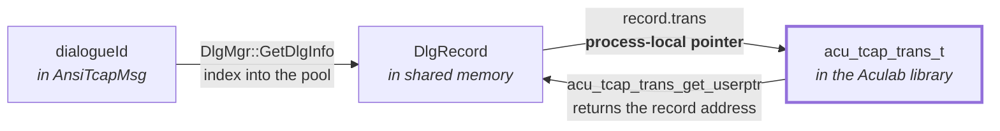
```mermaid
flowchart LR
    DLGID["dialogueId<br/><i>in AnsiTcapMsg</i>"]
    REC["DlgRecord<br/><i>in shared memory</i>"]
    TRANS["acu_tcap_trans_t<br/><i>in the Aculab library</i>"]

    DLGID -->|"DlgMgr::GetDlgInfo<br/>index into the pool"| REC
    REC -->|"record.trans<br/><b>process-local pointer</b>"| TRANS
    TRANS -->|"acu_tcap_trans_get_userptr<br/>returns the record address"| REC

    style TRANS stroke-width:3px
```

| Direction | Mechanism |
|---|---|
| Dialogue identifier → transaction | `DlgMgr::GetDlgInfo(dlgId)` returns the record; `record.trans` is the handle |
| Transaction → dialogue record | `acu_tcap_trans_get_userptr(trans)` returns the record address, set at creation |

`TransDlgMap` methods:

| Method | Action |
|---|---|
| `MapTransIdToDlgId(trans, record)` | Allocate a dialogue identifier, then `acu_tcap_trans_set_userptr(trans, record)` |
| `MapDlgIdtoTransId(record)` | Update the record, then set the user pointer — used by restoration |
| `GetDialogueInfo(trans, record)` | `get_userptr` then copy |
| `GetTransInfo(record, trans)` | `GetDlgInfo(dlgId)` then return `.trans` |
| `DeleteDlgInfo(dlgId)` | `FreeDlgInfo` |
| `DeleteTransInfo(id)` | Erase from the in-process map under `mDlgLock` |

**The STL maps are not the binding.** `mapTransRecord` is never used, and `mapDlgRecord`
is touched only by `DeleteTransInfo`. The real binding is the two-way pointer arrangement
above.

## 9.5 Transaction Validation Key

`mTransValidationKey` is generated once per handler start from a time-seeded
`rand_r`. It was intended to let a restarted handler reject responses addressed to its
predecessor's transactions. **The check is `#if 0`-disabled**
(`src/TcapAculabHandler.cc:1320`) with the comment "Below Commented to avoid trans
validation for HA".

The consequence: a restarted handler can act on a response belonging to a previous
incarnation's dialogue. This is part of R-05.

---

# 10. Message Flows

## 10.1 ANSI Transaction State Machine

**Diagram T-12 — ANSI TCAP transaction state machine.**

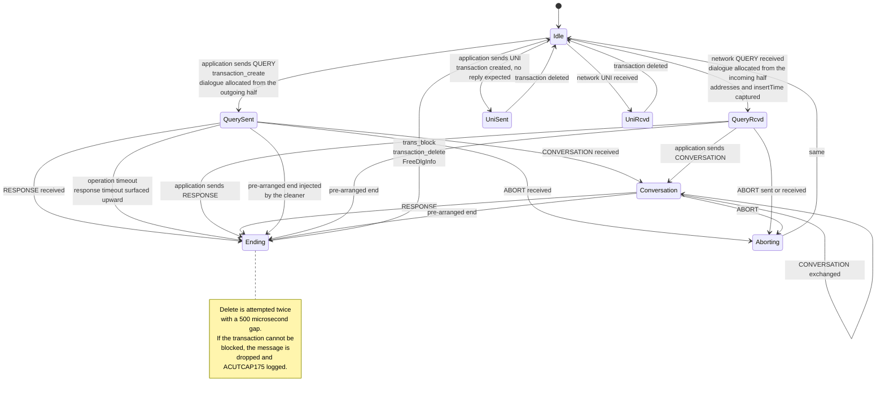
```mermaid
stateDiagram-v2
    direction TB

    [*] --> Idle

    Idle --> QuerySent : application sends QUERY<br/>transaction_create<br/>dialogue allocated from the outgoing half
    Idle --> QueryRcvd : network QUERY received<br/>dialogue allocated from the incoming half<br/>addresses and insertTime captured
    Idle --> UniSent : application sends UNI<br/>transaction created, no reply expected
    Idle --> UniRcvd : network UNI received

    QuerySent --> Conversation : CONVERSATION received
    QuerySent --> Ending : RESPONSE received
    QuerySent --> Aborting : ABORT received
    QuerySent --> Ending : operation timeout<br/>response timeout surfaced upward

    QueryRcvd --> Conversation : application sends CONVERSATION
    QueryRcvd --> Ending : application sends RESPONSE
    QueryRcvd --> Aborting : ABORT sent or received

    Conversation --> Conversation : CONVERSATION exchanged
    Conversation --> Ending : RESPONSE
    Conversation --> Aborting : ABORT

    QuerySent --> Ending : pre-arranged end injected<br/>by the cleaner
    QueryRcvd --> Ending : pre-arranged end
    Conversation --> Ending : pre-arranged end

    Ending --> Idle : trans_block<br/>transaction_delete<br/>FreeDlgInfo
    Aborting --> Idle : same
    UniSent --> Idle : transaction deleted
    UniRcvd --> Idle : transaction deleted

    note right of Ending
        Delete is attempted twice
        with a 500 microsecond gap.
        If the transaction cannot be
        blocked, the message is
        dropped and ACUTCAP175 logged.
    end note
```

There is **no explicit state table in the code.** State is the tuple *(existence of a
dialogue record, the record's `dlgType`, the arriving message type)*, evaluated by two
switch statements — one in `ProcessTxMsgToStack`, one in `ProcessRxMsgFromStack`.

### Deletion triggers

`lDelFlag = DELTE_TRANS` is set for: `TCAP_END`, `TCAP_ANSI_ABORT`, `TCAP_RSP_TIMEOUT`,
`TCAP_ANSI_RESPONSE`, `TCAP_END_WITH_ADDRESS`.

### Guard against double teardown

Before deleting, the component checks that the dialogue is not already complete, by
comparing the newly read local identifier against the recorded originating identifier. If
they disagree, or the new identifier is zero, the transaction has already been reclaimed
by the stack and is not deleted again.

## 10.2 Outbound Query

**Diagram T-13 — Outbound QUERY.**

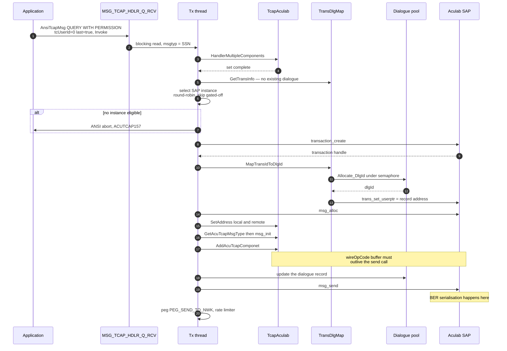
```mermaid
sequenceDiagram
    autonumber
    participant App as Application
    participant Q as MSG_TCAP_HDLR_Q_RCV
    participant Tx as Tx thread
    participant Api as TcapAculab
    participant Map as TransDlgMap
    participant Pool as Dialogue pool
    participant Acu as Aculab SAP

    App->>Q: AnsiTcapMsg QUERY WITH PERMISSION<br/>tcUserId=0 last=true, Invoke
    Q->>Tx: blocking read, msgtyp = SSN
    Tx->>Api: HandlerMultipleComponents
    Api-->>Tx: set complete
    Tx->>Map: GetTransInfo — no existing dialogue
    Tx->>Tx: select SAP instance<br/>round-robin, skip gated-off
    alt no instance eligible
        Tx->>App: ANSI abort, ACUTCAP157
    end
    Tx->>Acu: transaction_create
    Acu-->>Tx: transaction handle
    Tx->>Map: MapTransIdToDlgId
    Map->>Pool: Allocate_DlgId under semaphore
    Pool-->>Map: dlgId
    Map->>Acu: trans_set_userptr = record address
    Tx->>Acu: msg_alloc
    Tx->>Api: SetAddress local and remote
    Tx->>Api: GetAcuTcapMsgType then msg_init
    Tx->>Api: AddAcuTcapComponet
    Note over Api,Acu: wireOpCode buffer must<br/>outlive the send call
    Tx->>Pool: update the dialogue record
    Tx->>Acu: msg_send
    Note over Acu: BER serialisation happens here
    Tx->>Tx: peg PEG_SEND_TO_NWK, rate limiter
```

## 10.3 Inbound Query to Response

**Diagram T-14 — Inbound QUERY, application responds.**

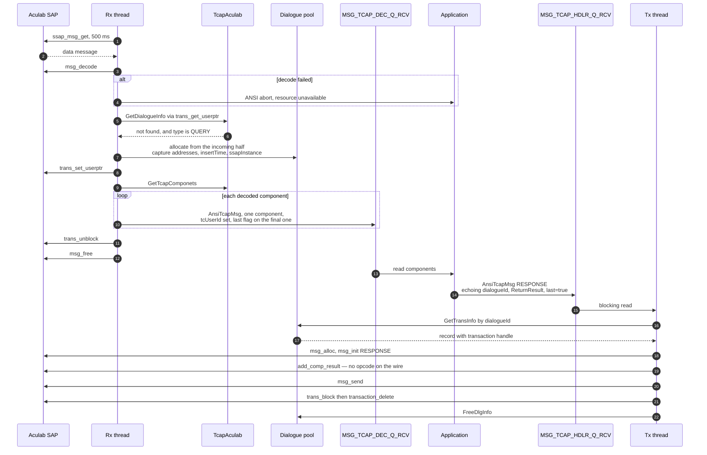
```mermaid
sequenceDiagram
    autonumber
    participant Acu as Aculab SAP
    participant Rx as Rx thread
    participant Api as TcapAculab
    participant Pool as Dialogue pool
    participant Q as MSG_TCAP_DEC_Q_RCV
    participant App as Application
    participant IQ as MSG_TCAP_HDLR_Q_RCV
    participant Tx as Tx thread

    Rx->>Acu: ssap_msg_get, 500 ms
    Acu-->>Rx: data message
    Rx->>Acu: msg_decode
    alt decode failed
        Rx->>App: ANSI abort, resource unavailable
    end
    Rx->>Api: GetDialogueInfo via trans_get_userptr
    Api-->>Rx: not found, and type is QUERY
    Rx->>Pool: allocate from the incoming half<br/>capture addresses, insertTime, ssapInstance
    Rx->>Acu: trans_set_userptr
    Rx->>Api: GetTcapComponets
    loop each decoded component
        Rx->>Q: AnsiTcapMsg, one component,<br/>tcUserId set, last flag on the final one
    end
    Rx->>Acu: trans_unblock
    Rx->>Acu: msg_free
    Q->>App: read components

    App->>IQ: AnsiTcapMsg RESPONSE<br/>echoing dialogueId, ReturnResult, last=true
    IQ->>Tx: blocking read
    Tx->>Pool: GetTransInfo by dialogueId
    Pool-->>Tx: record with transaction handle
    Tx->>Acu: msg_alloc, msg_init RESPONSE
    Tx->>Acu: add_comp_result — no opcode on the wire
    Tx->>Acu: msg_send
    Tx->>Acu: trans_block then transaction_delete
    Tx->>Pool: FreeDlgInfo
```

> On the second component of a query, the dialogue type is rewritten to
> `TCAP_BEGIN_CONTINUE`, marked in the source with an `ANSI_NEEDCHECK` comment. This is an
> unreviewed behaviour. `[NEEDS INPUT: is the TCAP_BEGIN_CONTINUE rewrite on multi-component queries correct for ANSI?]`

## 10.4 Conversation

**Diagram T-16 — Conversation exchange.**

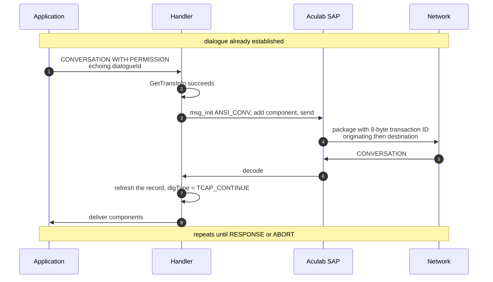
```mermaid
sequenceDiagram
    autonumber
    participant App as Application
    participant Hdl as Handler
    participant Acu as Aculab SAP
    participant Net as Network

    Note over App,Net: dialogue already established
    App->>Hdl: CONVERSATION WITH PERMISSION<br/>echoing dialogueId
    Hdl->>Hdl: GetTransInfo succeeds
    Hdl->>Acu: msg_init ANSI_CONV, add component, send
    Acu->>Net: package with 8-byte transaction ID<br/>originating then destination
    Net->>Acu: CONVERSATION
    Acu->>Hdl: decode
    Hdl->>Hdl: refresh the record, dlgType = TCAP_CONTINUE
    Hdl->>App: deliver components
    Note over App,Net: repeats until RESPONSE or ABORT
```

## 10.5 Abort

**Diagram T-17 — Abort, all three origins.**

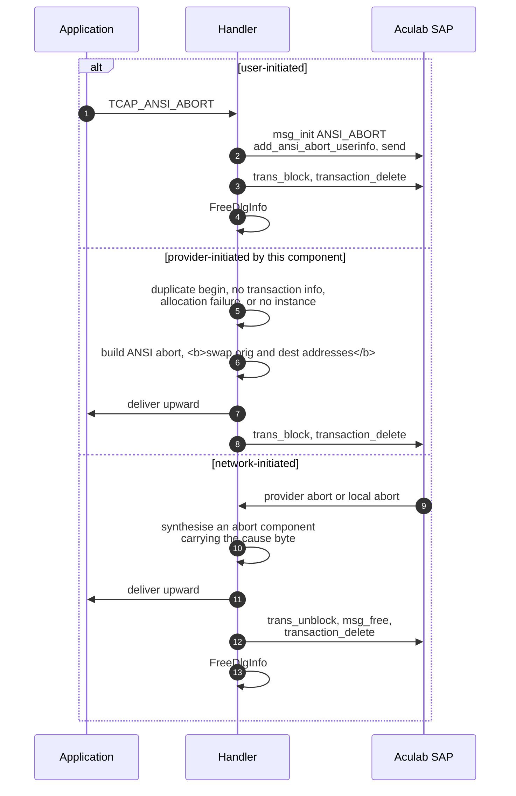
```mermaid
sequenceDiagram
    autonumber
    participant App as Application
    participant Hdl as Handler
    participant Acu as Aculab SAP

    alt user-initiated
        App->>Hdl: TCAP_ANSI_ABORT
        Hdl->>Acu: msg_init ANSI_ABORT<br/>add_ansi_abort_userinfo, send
        Hdl->>Acu: trans_block, transaction_delete
        Hdl->>Hdl: FreeDlgInfo
    else provider-initiated by this component
        Hdl->>Hdl: duplicate begin, no transaction info,<br/>allocation failure, or no instance
        Hdl->>Hdl: build ANSI abort, <b>swap orig and dest addresses</b>
        Hdl->>App: deliver upward
        Hdl->>Acu: trans_block, transaction_delete
    else network-initiated
        Acu->>Hdl: provider abort or local abort
        Hdl->>Hdl: synthesise an abort component<br/>carrying the cause byte
        Hdl->>App: deliver upward
        Hdl->>Acu: trans_unblock, msg_free,<br/>transaction_delete
        Hdl->>Hdl: FreeDlgInfo
    end
```

The address swap on the provider-initiated path is what makes the abort routable back to
the application's own view of the dialogue.

## 10.6 Pre-Arranged End

**Diagram T-15 — Dialogue expiry and teardown.**

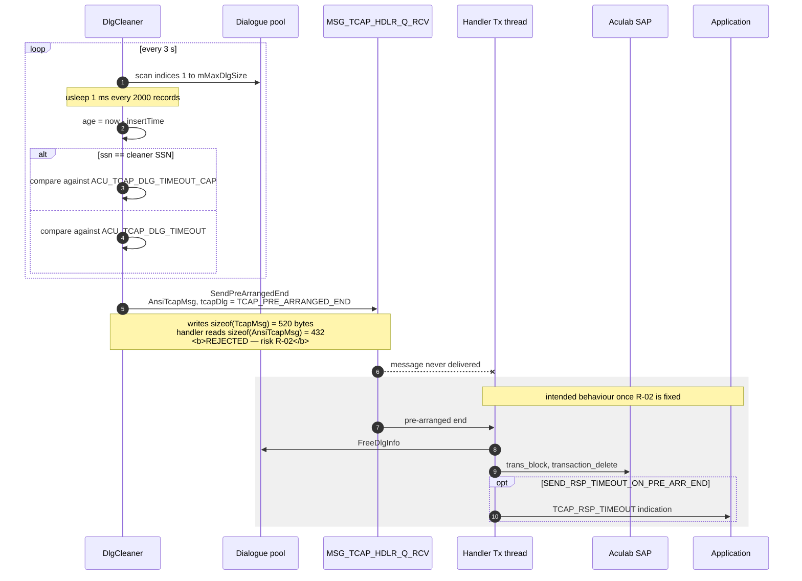
```mermaid
sequenceDiagram
    autonumber
    participant Clean as DlgCleaner
    participant Pool as Dialogue pool
    participant Q as MSG_TCAP_HDLR_Q_RCV
    participant Tx as Handler Tx thread
    participant Acu as Aculab SAP
    participant App as Application

    loop every 3 s
        Clean->>Pool: scan indices 1 to mMaxDlgSize
        Note over Clean: usleep 1 ms every 2000 records
        Clean->>Clean: age = now - insertTime
        alt ssn == cleaner SSN
            Clean->>Clean: compare against ACU_TCAP_DLG_TIMEOUT_CAP
        else
            Clean->>Clean: compare against ACU_TCAP_DLG_TIMEOUT
        end
    end
    Clean->>Q: SendPreArrangedEnd<br/>AnsiTcapMsg, tcapDlg = TCAP_PRE_ARRANGED_END
    Note over Clean,Q: writes sizeof(TcapMsg) = 520 bytes<br/>handler reads sizeof(AnsiTcapMsg) = 432<br/><b>REJECTED — risk R-02</b>
    Q--xTx: message never delivered

    rect rgb(240,240,240)
        Note over Tx,App: intended behaviour once R-02 is fixed
        Q->>Tx: pre-arranged end
        Tx->>Pool: FreeDlgInfo
        Tx->>Acu: trans_block, transaction_delete
        opt SEND_RSP_TIMEOUT_ON_PRE_ARR_END
            Tx->>App: TCAP_RSP_TIMEOUT indication
        end
    end
```

> **This flow does not currently work.** `SendPreArrangedEnd` sizes its write from the
> older `TcapMsg` structure (520 bytes) while the handler reads with `AnsiTcapMsg` (432
> bytes). The kernel rejects the oversized message, so **no dialogue is ever reaped
> through this path** and the pool fills over time.
>
> The two "Ab Comment" blocks at `src/TcapAculabHandler.cc:1130` and `:1172` were written
> to fix exactly this on the other two write paths. **The cleaner was missed.** This is
> `[SYS-HLD §21.3]` R-02 and the highest-severity open defect in the product.

The log wording on teardown distinguishes which half of the pool the identifier came
from: "no response from application" for the incoming half, "no response from network"
for the outgoing half.

## 10.7 Restoration After Reconnect

See §4.6 and Diagram T-05.

---

# 11. Routing and Instance Selection

## 11.1 Outbound Instance Selection

For a transaction-initiating message with no existing dialogue:

| # | Rule |
|---|---|
| 1 | Round-robin from `lastUsedInstance` |
| 2 | **Skip any instance whose transmit gate is closed** (§6.3) |
| 3 | When more than one origination point code is configured, key the selection on the originating address point code supplied by the application |
| 4 | If no instance is eligible, return an ANSI abort to the application, log `ACUTCAP157`, drop the message |

For a message on an existing dialogue, the instance is fixed — it is the one recorded in
`ssapInstance`.

> **There is no outbound queueing above the SAP.** Under full congestion the component
> sheds load upward rather than buffering. The application must be prepared to receive an
> abort.

## 11.2 Address Handling Flags

| Flag | Effect |
|---|---|
| `SET_LOCAL_ACU_TCAP_ADDR_FLAG` | Apply the application-supplied calling address on transaction-initiating messages |
| `SET_APP_GT_RELAY_FLAG` | Relay the application-supplied global title on non-initiating messages. Default off |
| `TCAP_DISABLE_RECV_LOCAL_ADDRESS` | When 0, capture the received local address on inbound transaction-initiating messages |

These three determine whether the application or the tier 2 configuration controls the
addresses on the wire. `[NEEDS INPUT: which combination is used in production?]`

## 11.3 Global Title Translation

**Not performed**, as on the SCCP path. GTI derivation and NAI suppression are described
in §8.6.

---

# 12. Timers and Rate Control

| Timer | Value | Configurable |
|---|---|---|
| SAP receive poll | 500 ms | No |
| Supervisor cadence | 3 s | No |
| Cleaner scan interval | 3 s | No |
| Cleaner yield | 1 ms every 2000 records | No |
| Transaction block retry | 500 microseconds, one retry | No |
| Thread creation stagger | 1 s | No |
| Transmit gate wait | 1 s | No |
| Silence threshold, no alternate IPs | **15 s** | No |
| Silence threshold, alternate IPs | **10 s** | No |
| Normal dialogue timeout | `ACU_TCAP_DLG_TIMEOUT` | **Yes**, 1 … 5000 s |
| Extended dialogue timeout | `ACU_TCAP_DLG_TIMEOUT_CAP` | **Yes**, 1 … 8000 s |
| Invoke operation timeout | From the component's timeout field | Per message |
| Licence rate window | 5 s | No |

## 12.1 The Two Dialogue Timeouts

| Timeout | Applies to |
|---|---|
| `ACU_TCAP_DLG_TIMEOUT` | Every SSN except the configured cleaner SSN |
| `ACU_TCAP_DLG_TIMEOUT_CAP` | The SSN named by `ACU_TCAP_DLG_CLEANER_SSN` |

The extended timeout exists because some transaction types legitimately run far longer
than a typical query — the source comment cites 7200 seconds. Applying the normal timeout
to those would reap live dialogues.

> The naming is misleading: `ACU_TCAP_DLG_CLEANER_SSN` does not name the SSN the cleaner
> serves — the cleaner serves all of them — it names **the SSN that gets the longer
> timeout**.

## 12.2 Timer Resolution

Dialogue expiry is evaluated against `time(NULL)`, which has one-second resolution, and is
checked every three seconds. The effective reaping granularity is therefore
**timeout + 0 to 3 seconds**. `[TSS-REL]` records timer drift as a known limitation.

## 12.3 Transmit Rate Limiting

| Property | Value |
|---|---|
| Source | `TCAP_MSG_LICENCE_KEY`, decoded by `DecryptLicKey` |
| Limit | Licensed messages per second, multiplied by 5 |
| Window | 5 seconds |
| Enforcement | End of the transmit path, under `gPthreadMutexLock` |
| Behaviour at the limit | Compute the remainder of the window and `select()` it away, then reset |
| Scope | **Shared across all transmit threads in the process** |

This is a **hard cap that stalls rather than sheds**. It is the only place in the product
where the transmit path deliberately blocks, and it propagates backpressure into the
inbound queue and then to the application `[SYS-HLD §9.9]`.

The licence key is produced by `src/TcapAculabGenerateLicKey.cc`, an offline tool not in
the build. It accepts a message count of 10 … 12,800 and a pass string, and emits an
obfuscated key using two fixed constants and two random digits. `DecryptLicKey` is the
exact inverse.

> **This is obfuscation, not cryptography** `[SYS-HLD §18.5]`.

---

# 13. Error Handling and Recovery

## 13.1 Classification

| Class | Examples | Behaviour |
|---|---|---|
| **Fatal at startup** | SAP create failure, point-code mismatch, config error, queue create failure, pool attach failure, process lock held | Log and exit |
| **Per-instance recoverable** | Connection blocked, silence threshold breached, host failure | SAP delete, re-create, reconnect, restore |
| **Per-message, reported** | Duplicate begin, no transaction info, allocation failure, no eligible instance, decode failure | **ANSI abort returned to the application** |
| **Per-message, silent** | Transaction still blocked after retry | Dropped, `ACUTCAP175` |
| **Ignorable** | Trace tag, status subscription | Not checked |

The third row is the key difference from the SCCP path, which reports nothing to the
application `[SCCP-HLD §13.1]`.

## 13.2 The Uniform Abort Path

Every failure path in `ProcessTxMsgToStack` follows the same shape:

| # | Step |
|---|---|
| 1 | Build an ANSI abort message |
| 2 | **Swap the originating and destination addresses** |
| 3 | `TxMsgToApplication` |
| 4 | Free the Aculab message |
| 5 | Block and delete the transaction — guarded by the dialogue-completed check (§10.1) |

Two provider-abort causes are used:

| Cause | Raised for |
|---|---|
| Unrecognised package type | Duplicate begin, no transaction info, allocation or component-addition failure, no eligible instance |
| Resource unavailable | Decode failure |

## 13.3 Diagnostic Quality Defect

`AculabUtil::GetAcuTcapMsgTypeStr` returns strings for the legacy message types only and
has **no ANSI cases**. Every ANSI message type therefore logs as `"UNHANDLED"`.

Since ANSI is the only mode this build supports (§4.2), **a large proportion of TCAP log
lines carry no usable message-type information.** This materially degrades supportability
and is `[SYS-HLD §21.3]` R-13.

The SCCP path does not have this defect — its converter covers all fourteen event types
`[SCCP-HLD §13.3]`.

## 13.4 What Has No Recovery

| Condition | Behaviour |
|---|---|
| Environment variables unset | Crash before any diagnostic — R-07 |
| `RESTORATION_REQUIRED = 1` | Permanent transmit stall — R-04 |
| Cleaner messages rejected on size | Dialogues never reaped — R-02 |
| Incomplete component set | Buffered for the life of the process |
| Pool exhausted | Aborts to the application until dialogues are released |
| Thread hangs inside the Aculab library | Undetected |

---

# 14. Component OAM

## 14.1 Peg Counters

Shared memory key name `"SHM_TCAP_PEG_KEY"`, gated by `TCAP_PEG_REQUIRED`. Module-local
events from `include/TcapAculabConstDef.h:175-180`:

| ID | Name |
|---|---|
| 59 | `PEG_DROP_RCVD_FROM_NWK` |
| 60 | `PEG_DROP_SEND_TO_NWK` |
| 81 | `PEG_RCVD_FROM_APP` |
| 82 | `PEG_SEND_TO_NWK` |
| 83 | `PEG_RCVD_FROM_NWK` |
| 84 | `PEG_SEND_TO_APPL` |

Plus per-primitive counters from the shared header: begin, end, continue, user abort,
protocol abort, unidirectional, and the four component types, in each direction.

### Derived indicators

| Indicator | Derivation |
|---|---|
| Transmit loss | 81 − 82 |
| Receive loss | 83 − 84 |
| Network drop rate | 59 ÷ 83 |
| Local drop rate | 60 ÷ 81 |

## 14.2 Log Codes

Base `ACUTCAP01` = 15651 (`include/SS7LogCodes.h:281`), running to `ACUTCAP180`.
Operationally significant ones:

| Code | Meaning |
|---|---|
| `ACUTCAP24` | **Dialogue pool full** |
| `ACUTCAP33` | SAP status and reconnect decision |
| `ACUTCAP73`, `ACUTCAP74`, `ACUTCAP76` | Double-release detection |
| `ACUTCAP75` | Dialogue index out of range |
| `ACUTCAP105` | Transmit thread waiting on the restore flag — **see R-04** |
| `ACUTCAP157` | **No SAP instance available for transmission** |
| `ACUTCAP175` | Transaction still blocked; message dropped |

> **The TCAP range 15651 … 15831 overlaps the SCCP base of 15771.** Codes must be
> interpreted in the context of the emitting process `[SYS-HLD §16.2]`.

## 14.3 Log Line Convention

| Prefix | Subsystem |
|---|---|
| `MN:` | Handler main |
| `AI:` | Aculab adaptation |
| `DM:` | Dialogue manager |
| `TR:` | Transaction and dialogue map |
| `TX:` / `RX:` | Direction |

Followed by `DlgId:%d TransPtr:%08X lTid:%08X rTid:%08X`. Combined with the dialogue
identifier this makes a single dialogue's history greppable end to end — which partly
compensates for the `UNHANDLED` defect (§13.3).

## 14.4 Trace

| Binary | Environment variable |
|---|---|
| `TcapAnsiHandler` | `TRACE_ACULAB_TCAP_HDLR` |
| `TcapAnsiHandler_Traffic` | `TRACE_ACULAB_TCAP_HDLR_TRAFFIC` |
| `TcapAnsiHandler_DlgCleaner` | `TRACE_ACULAB_TCAP_DLG_CLEANER` |

`TCAP_MSG_DISPLAY_PARAM` (0 … 255) controls payload display:

| Bit | Enables |
|---|---|
| 1 | Dialogue and transaction information |
| 2 | Originating address |
| 4 | Destination address |
| 8 | Application context — **not applicable to ANSI** |
| 16 | User information — **not applicable to ANSI** |
| 32 | Component detail |

Bits 8 and 16 have no effect on this build.

## 14.5 The Traffic Reporter

`TcapAnsiHandler_Traffic` is intended to display, refreshing every `refresh_secs`
seconds with a screen clear:

- Per-event received, transmitted, peak and total counters
- Free dialogue count against `mMaxDlgSize / 2`
- Pool usage percentage from `GetDlgPoolUsage()`

> **In this baseline it displays nothing.** `CreateSharedMemory`, `GetSnapShot`,
> `GetInitialSnapShot`, `PrintTraffic` and `ProcessTraffic` are all commented out and
> return true immediately. Only configuration reading, dialogue manager initialisation
> and the time calculation are live.
>
> The delivered binary starts, loops, clears the screen and prints nothing. This is
> `[SYS-HLD §21.3]` R-14, and it removes the only supported means of observing pool
> occupancy (§9.3).

It also reads `MAX_ACU_TCAP_DLG_SIZE` from `kernel.cfg` with a range of 1 … 256,000,
**inconsistent with the 1 … 500,000 used by the handler and cleaner**. A pool configured
above 256,000 would be rejected by this binary. Part of R-12.

---

# 15. Build and Source Map

## 15.1 Targets

| Target | Objects |
|---|---|
| `libAculabUtil.a` | `TcapAculabUtil.o` |
| `libAculabDlgMgr.a` | `TcapAculabDlgMgr.o` |
| `libAculabTransDlgMap.a` | `TcapAculabTransDlgMap.o` |
| `libAculabApi.a` | `TcapAculabApi.o` |
| **`TcapAnsiHandler`** | `TcapAculabHandler.o`, `TcapAculabHandlerMain.o` + all four libraries |
| **`TcapAnsiHandler_Traffic`** | `TcapAculabHandlerTraffic.o`, `TcapAculabHandlerTrafficMain.o` + `libAculabDlgMgr.a`, `libAculabUtil.a` |
| **`TcapAnsiHandler_DlgCleaner`** | `TcapAculabDlgCleaner.o`, `TcapAculabDlgCleanerMain.o` + `libAculabDlgMgr.a`, `libAculabUtil.a` |

## 15.2 Link Inputs

| Input | Version |
|---|---|
| `libacu_ss7tcap.so` | **6.16.1** on disk. Note the SCCP library is 6.17.0 — `[SYS-HLD §14.3]` |
| `libSs7Util.a`, `libutil.a` | Tayana framework, external |
| `-ldl -lpthread` | System |

## 15.3 Compile Flags

| Flag | Set | Effect |
|---|---|---|
| `__cplusplus=1` | Yes | Language mode |
| Conditional interface-structure tail flag | **Yes** | **This is the asymmetry with the SCCP module** — `[SYS-HLD §11.5]` R-01 |
| `LINUX`, `LINT_ARGS`, `_REENTRANT` | Assigned to `DECFS` | May not reach the compiler |

## 15.4 Makefile Defects

| Defect | Effect |
|---|---|
| The object list uses `$(OBJ6)` and `$(OBJ7)` where the definitions are `OBJS6` and `OBJS7` | Those two object groups expand empty |
| Static library targets declare a dependency on the binary directory rather than the library directory | Inconsistent with the other targets |
| A target name carries trailing whitespace | Fragile |
| Library output paths point at an installed tree | `[SYS-HLD §14.4]` R-17 |

## 15.5 Not Delivered

| Artefact | Status |
|---|---|
| `src/TcapAculabGenerateLicKey.cc` | Offline licence generator, not in the source list |
| `obj/` contents | Committed build artefacts, including binaries under legacy names |
| Disabled code blocks in `src/TcapAculabApi.cc` | Superseded implementations |
| `ProcessRxSccpMsgFromStack`, the unused SCCP queue members | Declared, never defined or used |

---

# 16. Component Limitations and Risks

## 16.1 Functional Limitations

| # | Limitation | Reference |
|---|---|---|
| TL-01 | ANSI only — the standard flag is a literal, not a runtime selection | §4.2 |
| TL-02 | Maximum 5 components per package, **not enforced** — the buffer is overrun | §8.2 |
| TL-03 | An incomplete component set is buffered indefinitely with no timeout | §8.2 |
| TL-04 | Only problem code type 1 can be encoded on Reject | §8.4, R-08 |
| TL-05 | Usable outbound dialogue capacity is roughly half the configured pool | §9.2 |
| TL-06 | Only the OPC list is reloadable; instances can be added but never removed | §7.4 |
| TL-07 | Restoration via `RESTORATION_REQUIRED` is non-functional | §4.6, R-04 |
| TL-08 | Dialogue reaping does not reach the handler | §10.6, R-02 |
| TL-09 | The traffic reporter displays nothing | §14.5, R-14 |
| TL-10 | No outbound queueing above the SAP — congestion sheds load upward | §11.1 |
| TL-11 | An unrecognised Aculab message type is presented to the application as a Response | §8.3 |
| TL-12 | Dialogue reaping granularity is the timeout plus 0 to 3 seconds | §12.2 |
| TL-13 | Most timers are compile-time constants | §12 |

## 16.2 Component Risks

Risks owned by this component. Numbering continues `[SYS-HLD §21.3]`.

| ID | Risk | Evidence | Severity | Status |
|---|---|---|---|---|
| **R-01** | The module defines a conditional interface-structure tail flag the SCCP module does not, so structure sizes differ across a shared IPC boundary | `tcap/Makefile` | **Critical** | Open |
| **R-02** | `SendPreArrangedEnd` writes 520 bytes onto a queue read as 432, so **no dialogue is ever reaped** and the pool fills over time | `src/TcapAculabDlgCleaner.cc`; §10.6 | **Critical** | Open |
| **R-03** | Reconnect re-spawns threads without terminating the previous pair | §5.1 | Major | Open |
| **R-04** | `GetDlgInfoAndRestore` is commented out, so `RESTORATION_REQUIRED = 1` stalls the transmit threads permanently | `src/TcapAculabHandler.cc:162-287`; §4.6 | Major | Open |
| **R-05** | The Aculab transaction handle is stored in shared memory and the stale-response validation check is disabled | `include/TcapAculabConstDef.h:93`; `src/TcapAculabHandler.cc:1320`; §9.1, §9.5 | Major | Accepted with constraint |
| **R-08** | `GetAcuRejectProblem` cases 2, 3 and 4 fall through to a failure return, so only type-1 rejects can be encoded | `src/TcapAculabApi.cc:3015-3084` | Major | Open |
| **R-12** | Substantial disabled code, unused declarations, and the pool-size bound inconsistency between the handler and the traffic reporter | §3.2, §14.5 | Moderate | Open |
| **R-13** | The message-type-to-string converter has no ANSI cases, so most log lines print `UNHANDLED` | §13.3 | Moderate | Open |
| **R-14** | The traffic reporter's display logic is commented out; the delivered binary produces no output, removing the only supported pool-occupancy view | §14.5 | Moderate | Open |
| **R-15** | `AddAcuTcapComponet` mutates the component accumulation map without holding `gMutexLock`, which `HandlerMultipleComponents` does hold | §5.3 | Moderate | Open |
| **R-16** | `HandleThreads` passes the address of a stack-local argument structure to every thread and then mutates it; only the one-second stagger makes this work | §5.5 | Moderate | Open |
| **R-24** | The Return Error path uses a **local** array for the Private Family and Specifier bytes, the same construct the Invoke path was fixed for. If its scope does not enclose the send call, Private-opcode Return Errors are corrupted on the wire — silently | §8.4 | **Major, unverified** | Open |
| **R-25** | The address indicator bit assignment differs between this component and the SCCP component: `0x01` and `0x02` are swapped. An application using both paths must populate the field differently for each, with nothing to signal the difference | §8.6 versus `[SCCP-HLD §8.2]` | Major | Open |
| **R-26** | `GetTcapDlgType` maps an unrecognised Aculab message type to `TCAP_ANSI_RESPONSE` by default, so an unknown message is presented to the application as a valid response rather than being rejected | `src/TcapAculabApi.cc:3939` | Moderate | Open |

## 16.3 Priority

| Priority | Risks | Rationale |
|---|---|---|
| **Fix before production** | R-01, R-02, R-24 | R-02 is certain and progressive; R-01 is a latent total-loss condition; R-24 is silent wire corruption if confirmed |
| **Fix in the next release** | R-04, R-08, R-25, R-03 | Correctness and conformance defects |
| **Schedule** | R-05, R-12, R-13, R-14, R-15, R-16, R-26 | Robustness, supportability and maintainability |

**R-24 should be verified first**, because it is the same class of defect as the one
`[TSS-REL]` records as having silently corrupted every Private-opcode Invoke before it was
found. If the Return Error path has the same construct, it has the same failure mode.

## 16.4 Open Questions

| # | Question | Section |
|---|---|---|
| TQ-01 | Confirm the transaction ID range upper bound of 4094 against Aculab documentation | §4.3 |
| TQ-02 | Production values for the six receive and transmit window parameters | §6.1 |
| TQ-03 | Line-by-line verification of every receive return path against the unblock table | §6.2 |
| TQ-04 | **Verify the Return Error Family/Specifier buffer lifetime against the send call** | §8.4, R-24 |
| TQ-05 | Is the address indicator bit assignment difference between the two paths intentional? | §8.6, R-25 |
| TQ-06 | Is the `TCAP_BEGIN_CONTINUE` rewrite on multi-component queries correct for ANSI? | §10.3 |
| TQ-07 | Which combination of the three address handling flags is used in production? | §11.2 |
| TQ-08 | Is `RESTORATION_REQUIRED` intended to be usable? If not it should be removed | §4.6 |
| TQ-09 | Should an incomplete component set be aged out and rejected? | §8.2 |
| TQ-10 | Should the component count limit be enforced rather than overrunning the buffer? | §8.2 |
| TQ-11 | Should the traffic reporter be restored, or replaced by a supported pool-inspection tool? | §14.5 |

All are carried in `[SYS-HLD Appendix F]`.

---

*End of TCAP Component HLD.*
